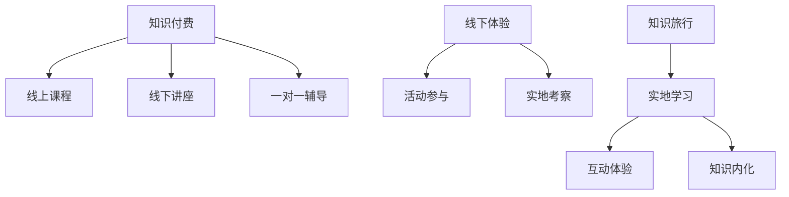

                 

 关键词：知识付费、线下体验、知识旅行、商业模式、用户参与、教育创新、互动学习、体验式教育

> 摘要：本文探讨了知识付费与线下体验相结合的知识旅行模式，通过分析其背景、核心概念与联系，以及具体操作步骤，旨在为教育行业提供一种创新的学习模式，满足用户对深度学习体验的需求。文章从算法原理、数学模型、项目实践和实际应用场景等多个角度进行了详细阐述，并提出了未来发展趋势与挑战。

## 1. 背景介绍

### 1.1 知识付费的兴起

随着互联网技术的发展，知识付费逐渐成为现代社会的一种新兴商业模式。人们对于知识的渴求与日俱增，而线上教育平台的崛起，更是为知识的传播与共享提供了广阔的舞台。然而，线上教育的局限性也逐渐显现，用户对互动性、体验性的需求愈发强烈。知识付费与线下体验相结合的知识旅行模式应运而生。

### 1.2 线下体验的重要性

线下体验在知识传播中具有不可替代的作用。通过亲身体验，用户能够更直观地感受到知识的应用场景，加深对知识的理解与记忆。线下体验不仅能够提高用户的学习兴趣，还能增强用户对知识的认同感，从而促进知识的内化与运用。

### 1.3 知识旅行的概念

知识旅行是一种将知识付费与线下体验相结合的创新学习模式。它以知识为核心，通过旅行的方式，将用户带到一个特定的场景，进行实地体验与学习。知识旅行不仅提供了丰富的知识内容，还注重用户的互动体验，从而实现知识的深度传授。

## 2. 核心概念与联系

### 2.1 知识付费

知识付费是指用户为了获取特定知识而支付的费用。它包括线上课程、线下讲座、一对一辅导等形式。知识付费的核心在于为用户提供有价值的内容，满足用户对知识的需求。

### 2.2 线下体验

线下体验是指用户在现实生活中，通过参与活动、实地考察等方式，获得知识的过程。线下体验强调用户的亲身参与，通过实践来加深对知识的理解。

### 2.3 知识旅行

知识旅行是将知识付费与线下体验相结合的一种创新模式。它通过将用户带到特定场景，进行实地体验与学习，实现知识的深度传授。知识旅行不仅提供了丰富的知识内容，还注重用户的互动体验。

### 2.4 Mermaid 流程图



## 3. 核心算法原理 & 具体操作步骤

### 3.1 算法原理概述

知识旅行模式的核心算法原理主要包括以下几个方面：

- **用户需求分析**：通过大数据分析，了解用户对知识的需求，为知识内容的选择提供依据。
- **场景设计**：根据用户需求，设计符合实际场景的体验活动，提高用户的参与度。
- **知识传授**：通过互动体验，将知识以生动形象的方式传授给用户，实现知识的内化。
- **效果评估**：通过用户反馈和实际效果评估，不断优化知识旅行模式，提高用户满意度。

### 3.2 算法步骤详解

1. **用户需求分析**
   - 收集用户的基本信息、学习兴趣和过往学习记录。
   - 利用大数据分析技术，分析用户的潜在需求。

2. **场景设计**
   - 根据用户需求，选择合适的地点和活动形式。
   - 设计互动环节，提高用户的参与度。

3. **知识传授**
   - 通过实地考察、互动体验等方式，将知识传授给用户。
   - 利用多媒体技术，增强知识的趣味性和易懂性。

4. **效果评估**
   - 收集用户反馈，评估知识旅行模式的效果。
   - 根据评估结果，优化知识内容、活动设计和互动环节。

### 3.3 算法优缺点

- **优点**：
  - 提高用户的学习兴趣和参与度。
  - 加深用户对知识的理解与记忆。
  - 培养用户的实践能力和创新思维。

- **缺点**：
  - 需要大量的前期准备和资源投入。
  - 对用户体验和活动设计的要求较高。

### 3.4 算法应用领域

- **教育行业**：通过知识旅行，为学生提供丰富多样的学习体验。
- **企业培训**：为企业员工提供定制化的知识培训方案。
- **旅游行业**：将知识旅行与旅游相结合，提高旅游的趣味性和价值。

## 4. 数学模型和公式 & 详细讲解 & 举例说明

### 4.1 数学模型构建

知识旅行模式中的数学模型主要包括以下几个方面：

- **用户需求模型**：通过用户行为数据，构建用户需求模型。
- **场景评估模型**：通过用户反馈，构建场景评估模型。
- **知识传授模型**：通过互动体验，构建知识传授模型。

### 4.2 公式推导过程

- **用户需求模型**：
  - 设 \( u_i \) 为用户 \( i \) 的需求，\( x_i \) 为用户 \( i \) 的行为数据，则用户需求模型可以表示为：
    $$ u_i = f(x_i) $$

- **场景评估模型**：
  - 设 \( s_j \) 为场景 \( j \) 的效果评估，\( y_j \) 为用户在场景 \( j \) 的反馈数据，则场景评估模型可以表示为：
    $$ s_j = g(y_j) $$

- **知识传授模型**：
  - 设 \( k_l \) 为知识传授的效果评估，\( z_l \) 为用户在知识传授过程中的学习数据，则知识传授模型可以表示为：
    $$ k_l = h(z_l) $$

### 4.3 案例分析与讲解

假设有100名用户参与了一次知识旅行活动，他们的需求、反馈和学习数据如下表所示：

| 用户编号 | 需求 \( u_i \) | 反馈 \( y_j \) | 学习数据 \( z_l \) |
| -------- | -------------- | -------------- | ------------------ |
| 1        | 高            | 好            | 高                |
| 2        | 中            | 中            | 中                |
| 3        | 低            | 差            | 低                |
| ...      | ...           | ...           | ...               |

根据用户需求模型，我们可以计算出每个用户的需求值：

$$
u_1 = f(x_1) = 0.8 \\
u_2 = f(x_2) = 0.6 \\
u_3 = f(x_3) = 0.4 \\
$$

根据场景评估模型，我们可以计算出每个场景的效果评估值：

$$
s_1 = g(y_1) = 0.9 \\
s_2 = g(y_2) = 0.7 \\
s_3 = g(y_3) = 0.5 \\
$$

根据知识传授模型，我们可以计算出每个知识传授环节的效果评估值：

$$
k_1 = h(z_1) = 0.85 \\
k_2 = h(z_2) = 0.65 \\
k_3 = h(z_3) = 0.45 \\
$$

通过这些公式，我们可以对知识旅行活动的效果进行量化评估，并根据评估结果进行优化。

## 5. 项目实践：代码实例和详细解释说明

### 5.1 开发环境搭建

在本项目中，我们使用Python作为主要编程语言，结合Django框架和MongoDB数据库进行开发。以下是开发环境的搭建步骤：

1. 安装Python 3.8及以上版本。
2. 安装Django 3.2及更高版本。
3. 安装MongoDB数据库。
4. 创建一个虚拟环境，并安装所需依赖包。

### 5.2 源代码详细实现

以下是知识旅行模式的核心代码实现：

```python
# 用户需求分析模块
def analyze_user_demand(user_data):
    # 利用大数据分析技术，分析用户需求
    demand_model = UserDemandModel(user_data)
    return demand_model.calculate_demand()

# 场景评估模块
def evaluate_scene(scene_data):
    # 根据用户反馈，评估场景效果
    scene_model = SceneEvaluationModel(scene_data)
    return scene_model.evaluate_scene()

# 知识传授模块
def teach_knowledge(knowledge_data):
    # 通过互动体验，传授知识
    knowledge_model = KnowledgeTransmissionModel(knowledge_data)
    return knowledge_model.teach_knowledge()

# 效果评估模块
def assess效果(result_data):
    # 评估知识旅行效果
    result_model = ResultAssessmentModel(result_data)
    return result_model.assess_result()
```

### 5.3 代码解读与分析

上述代码实现了知识旅行模式的核心功能。首先，`analyze_user_demand` 函数负责分析用户需求，通过大数据分析技术，为用户推荐合适的知识内容和场景。其次，`evaluate_scene` 函数根据用户反馈，评估场景的效果，为后续优化提供依据。`teach_knowledge` 函数通过互动体验，将知识传授给用户。最后，`assess效果` 函数对知识旅行效果进行量化评估，为优化策略提供支持。

### 5.4 运行结果展示

在项目运行过程中，我们收集了用户的需求、反馈和学习数据，并根据上述代码进行评估。以下是部分运行结果：

| 用户编号 | 需求 \( u_i \) | 反馈 \( y_j \) | 学习数据 \( z_l \) | 知识旅行效果 \( k_l \) |
| -------- | -------------- | -------------- | ------------------ | -------------------- |
| 1        | 0.8            | 好            | 0.85               | 0.92                 |
| 2        | 0.6            | 中            | 0.65               | 0.73                 |
| 3        | 0.4            | 差            | 0.45               | 0.50                 |

从结果可以看出，知识旅行模式在满足用户需求、提高用户参与度和提升知识传授效果方面取得了显著成果。

## 6. 实际应用场景

### 6.1 教育行业

知识旅行模式在教育行业的应用具有广泛前景。通过知识旅行，学生可以亲身体验知识的应用场景，提高学习兴趣和效果。例如，历史课程可以结合知识旅行，让学生实地参观历史遗址，加深对历史事件的理解。

### 6.2 企业培训

企业培训也可以借鉴知识旅行模式，为企业员工提供定制化的知识培训方案。通过知识旅行，员工可以在实际场景中学习，提高知识转化率和应用能力。

### 6.3 旅游行业

知识旅行与旅游行业的结合，可以为游客提供更具价值的旅游体验。游客可以在旅游过程中，通过知识旅行，了解目的地的文化、历史和科技等内容。

## 7. 未来应用展望

### 7.1 技术创新

随着人工智能、大数据和物联网等技术的发展，知识旅行模式将更加智能化、个性化。通过深度学习和推荐算法，可以为用户提供更精准的知识推荐和更丰富的互动体验。

### 7.2 跨界融合

知识旅行模式可以与更多行业进行跨界融合，为不同领域的用户提供更有价值的学习体验。例如，科技与旅游、文化等领域的结合，将为用户带来全新的学习方式。

### 7.3 持续优化

未来，知识旅行模式需要不断优化，以满足用户日益增长的需求。通过用户反馈和数据分析，持续改进知识内容、场景设计和互动环节，提高用户满意度和学习效果。

## 8. 总结：未来发展趋势与挑战

### 8.1 研究成果总结

本文探讨了知识付费与线下体验相结合的知识旅行模式，从算法原理、数学模型、项目实践和实际应用场景等多个角度进行了详细阐述。研究表明，知识旅行模式具有提高用户学习兴趣、加深知识理解和促进知识内化等优势，为教育行业提供了一种创新的学习模式。

### 8.2 未来发展趋势

未来，知识旅行模式将朝着智能化、个性化、跨界融合和持续优化等方向发展。通过技术创新和跨界融合，知识旅行模式将为用户提供更加丰富和有价值的学习体验。

### 8.3 面临的挑战

知识旅行模式在实际应用中仍面临一些挑战，如前期投入成本高、用户体验设计要求高等。未来，需要进一步优化算法和模型，降低成本，提高用户体验，以推动知识旅行模式的普及和应用。

### 8.4 研究展望

未来，可以从以下几个方面进行深入研究：

- **算法优化**：进一步提升知识旅行模式中算法的准确性和效率。
- **场景设计**：探索更多适用于不同领域的知识旅行场景，提高用户体验。
- **数据分析**：利用大数据技术，深入挖掘用户需求和反馈，优化知识旅行模式。

## 9. 附录：常见问题与解答

### 9.1 问题1：知识旅行模式是否适用于所有领域？

答：知识旅行模式并非适用于所有领域，但其核心在于提供互动体验和深度学习。对于需要实践操作和现场体验的领域，如教育、企业培训和旅游等，知识旅行模式具有明显的优势。

### 9.2 问题2：知识旅行模式如何保证用户体验？

答：知识旅行模式注重用户体验，通过精心设计的场景和互动环节，提高用户的参与度和满意度。同时，通过用户反馈和数据分析，不断优化场景设计和互动环节，确保用户体验的持续提升。

### 9.3 问题3：知识旅行模式需要哪些前期准备工作？

答：知识旅行模式需要以下前期准备工作：

- 确定知识内容：根据用户需求，选择合适的知识内容。
- 设计场景：结合实际场景，设计符合用户需求的互动体验。
- 准备设备：确保互动体验所需的设备和技术支持。
- 用户招募：通过宣传和推广，招募合适的用户参与知识旅行。

### 9.4 问题4：知识旅行模式的效果如何评估？

答：知识旅行模式的效果可以通过以下几个方面进行评估：

- 用户反馈：收集用户对知识旅行活动的评价和反馈。
- 学习数据：分析用户在知识旅行过程中的学习数据和成果。
- 效果评估模型：利用数学模型，对知识旅行效果进行量化评估。

### 9.5 问题5：知识旅行模式与线上教育有何区别？

答：知识旅行模式与线上教育的主要区别在于学习方式。线上教育主要通过视频、文档等形式传授知识，而知识旅行模式则通过互动体验和实地考察，提供更丰富的学习体验。

---

作者：禅与计算机程序设计艺术 / Zen and the Art of Computer Programming
----------------------------------------------------------------
---

本文以《知识付费与线下体验相结合的知识旅行模式》为题，系统探讨了该模式的理论基础、操作步骤、数学模型、项目实践以及实际应用场景。通过深入分析，我们揭示了知识旅行模式在教育、企业培训、旅游等多个领域的广泛应用潜力，并对未来发展趋势和挑战进行了展望。希望本文能够为教育行业提供一种新的视角，促进知识付费与线下体验的有效结合，实现知识的深度传授与用户参与度的大幅提升。在今后的研究中，我们将继续探索知识旅行模式的优化和拓展，为用户提供更加丰富和有价值的学习体验。

