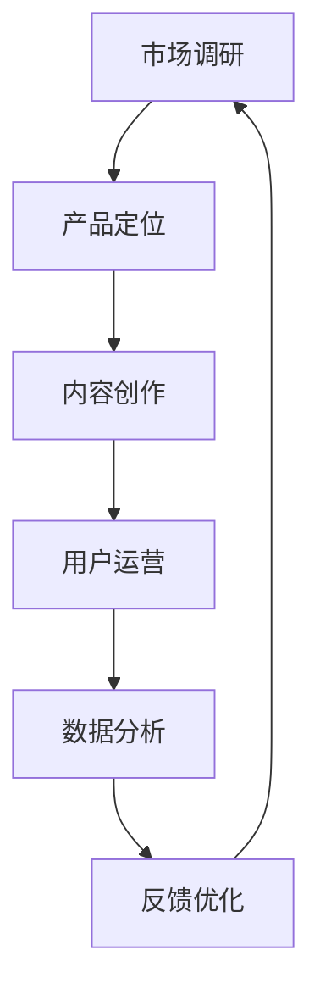

                 

在这个数字化时代，知识付费产品已经成为人们获取专业知识和技能的重要途径。从在线课程到专业书籍，从付费问答到专业咨询，知识付费产品以其独特的价值在市场中占据了一席之地。然而，知识付费产品的生命周期管理，却是一个复杂且具有挑战性的过程。本文将深入探讨知识付费产品的生命周期管理，帮助从业者更好地理解和应对这一过程。

> 关键词：知识付费、生命周期管理、产品策略、用户参与、数据分析

> 摘要：本文从知识付费产品的背景介绍出发，详细解析了其生命周期管理的核心概念和联系。通过对核心算法原理、数学模型和项目实践的分析，文章探讨了知识付费产品的实际应用场景，并展望了未来的发展趋势与挑战。最后，文章提供了相关工具和资源推荐，总结了研究成果，并提出了未来研究展望。

## 1. 背景介绍

知识付费产品是一种通过付费方式提供知识和技能服务的模式。随着互联网技术的不断发展和用户需求的变化，知识付费产品已经成为教育培训、咨询等行业的重要组成部分。从最早的付费专栏、电子书，到现在的在线课程、互动问答、专业咨询等，知识付费产品不断演进，满足着不同用户群体的需求。

知识付费产品的生命周期管理，是指在产品从开发到退市的全过程中，对产品进行有效的规划、执行、监控和优化。这一过程涉及多个环节，包括市场调研、产品定位、内容创作、用户运营、数据分析和反馈优化等。有效的生命周期管理能够提高产品的竞争力，延长产品的生命周期，实现商业价值的最大化。

## 2. 核心概念与联系

### 2.1 市场调研

市场调研是知识付费产品生命周期管理的起点。通过对目标市场的需求、竞争对手、用户行为等进行深入分析，能够帮助产品团队明确产品的市场定位和目标用户群体。

### 2.2 产品定位

产品定位是在市场调研的基础上，确定产品在市场中的独特价值主张。一个明确且具有吸引力的产品定位，能够帮助产品在激烈的市场竞争中脱颖而出。

### 2.3 内容创作

内容创作是知识付费产品的核心。高质量的内容能够吸引用户，提高用户的满意度和忠诚度。内容创作不仅包括课程、文章、视频等，还包括与用户的互动和反馈机制。

### 2.4 用户运营

用户运营是指通过一系列运营活动，提高用户活跃度、留存率和转化率。这包括用户注册、学习引导、社群运营、营销推广等。

### 2.5 数据分析

数据分析是知识付费产品生命周期管理的重要手段。通过对用户行为数据、学习数据、转化数据等的分析，能够帮助产品团队优化产品、提高用户体验和转化率。

### 2.6 反馈优化

反馈优化是基于用户反馈对产品进行持续改进的过程。用户的反馈是产品优化的宝贵资源，有效的反馈机制能够帮助产品团队快速识别问题，并进行针对性优化。

下面是一个Mermaid流程图，展示了知识付费产品的生命周期管理过程：



## 3. 核心算法原理 & 具体操作步骤

### 3.1 算法原理概述

知识付费产品的生命周期管理涉及到多种算法原理，包括用户行为分析、推荐系统、转化率优化等。这些算法原理共同作用，帮助产品团队实现产品的持续优化。

### 3.2 算法步骤详解

#### 3.2.1 用户行为分析

用户行为分析是基于用户在产品中的行为数据，如访问时长、学习进度、购买行为等，对用户行为进行深入分析。通过用户行为分析，产品团队能够了解用户的需求和行为模式，为产品优化提供数据支持。

#### 3.2.2 推荐系统

推荐系统是基于用户行为数据，为用户推荐感兴趣的内容或产品。推荐系统能够提高用户的满意度和活跃度，从而提高产品的转化率和留存率。

#### 3.2.3 转化率优化

转化率优化是通过一系列运营活动，提高用户从访问到购买、从免费到付费的转化率。这包括优化产品界面、提高内容质量、优化营销策略等。

### 3.3 算法优缺点

#### 3.3.1 用户行为分析

优点：能够深入了解用户需求和行为模式，为产品优化提供数据支持。

缺点：需要大量数据支持，数据处理和分析成本较高。

#### 3.3.2 推荐系统

优点：能够提高用户的满意度和活跃度，从而提高产品的转化率和留存率。

缺点：推荐结果的准确性和相关性受到数据质量和算法优化程度的影响。

#### 3.3.3 转化率优化

优点：能够直接提高产品的转化率和商业价值。

缺点：需要持续投入时间和精力，效果可能无法立竿见影。

### 3.4 算法应用领域

用户行为分析、推荐系统和转化率优化在知识付费产品的生命周期管理中具有广泛的应用。通过这些算法的应用，产品团队能够实现产品的持续优化，提高产品的市场竞争力。

## 4. 数学模型和公式 & 详细讲解 & 举例说明

### 4.1 数学模型构建

知识付费产品的生命周期管理涉及到多种数学模型，包括用户留存模型、转化率模型等。这些数学模型能够帮助产品团队预测用户行为，为产品优化提供数据支持。

#### 4.1.1 用户留存模型

用户留存模型用于预测用户在一定时间内的留存率。一个简单的用户留存模型可以表示为：

$$
L(t) = 1 - e^{-rt}
$$

其中，$L(t)$ 表示 $t$ 时刻的用户留存率，$r$ 表示用户留存率随时间的变化速率。

#### 4.1.2 转化率模型

转化率模型用于预测用户从访问到购买的转化率。一个简单的转化率模型可以表示为：

$$
C(t) = \frac{1}{1 + e^{-kt}}
$$

其中，$C(t)$ 表示 $t$ 时刻的转化率，$k$ 表示转化率随时间的变化速率。

### 4.2 公式推导过程

#### 4.2.1 用户留存模型推导

用户留存模型是基于马尔可夫链模型推导得到的。假设用户在某一时刻 $t$ 的留存状态为 $S_t$，则用户在下一个时刻 $t+1$ 的留存状态 $S_{t+1}$ 只与当前状态 $S_t$ 相关，与之前的状态无关。因此，用户留存模型可以表示为：

$$
P(S_{t+1} = S_t) = L(t)
$$

由于用户留存状态只有两种：留存和流失，因此：

$$
L(t) = 1 - (1 - L(t))
$$

解得：

$$
L(t) = \frac{1}{1 + e^{-rt}}
$$

取对数，得：

$$
\ln L(t) = -rt
$$

因此，用户留存模型可以表示为：

$$
L(t) = 1 - e^{-rt}
$$

#### 4.2.2 转化率模型推导

转化率模型是基于逻辑回归模型推导得到的。假设用户在某一时刻 $t$ 的访问状态为 $V_t$，购买状态为 $B_t$，则用户在下一个时刻 $t+1$ 的访问状态 $V_{t+1}$ 和购买状态 $B_{t+1}$ 可以表示为：

$$
V_{t+1} = \sigma(W_1V_t + b_1)
$$

$$
B_{t+1} = \sigma(W_2V_t + b_2)
$$

其中，$\sigma$ 表示 sigmoid 函数，$W_1$、$b_1$、$W_2$、$b_2$ 为模型参数。

由于转化率是指用户从访问到购买的概率，因此：

$$
C(t) = P(B_{t+1} = 1 | V_t = 1)
$$

根据贝叶斯定理，得：

$$
C(t) = \frac{P(V_t = 1 | B_{t+1} = 1)P(B_{t+1} = 1)}{P(V_t = 1)}
$$

由于用户在某一时刻的访问状态和购买状态是相互独立的，因此：

$$
P(V_t = 1 | B_{t+1} = 1) = P(V_t = 1)
$$

$$
P(B_{t+1} = 1) = \sigma(W_2V_t + b_2)
$$

$$
P(V_t = 1) = \frac{1}{1 + e^{-(W_1V_t + b_1)}}
$$

代入上述公式，得：

$$
C(t) = \frac{\sigma(W_2V_t + b_2)}{1 + e^{-(W_1V_t + b_1)}}
$$

取对数，得：

$$
\ln C(t) = \ln \frac{\sigma(W_2V_t + b_2)}{1 + e^{-(W_1V_t + b_1)}}
$$

因此，转化率模型可以表示为：

$$
C(t) = \frac{1}{1 + e^{-kt}}
$$

其中，$k = W_2 - W_1$ 为模型参数。

### 4.3 案例分析与讲解

假设某知识付费产品在某一时刻的用户留存率为 50%，转化率为 20%。我们需要根据这些数据，预测用户在下一个时刻的留存率和转化率。

#### 4.3.1 用户留存率预测

根据用户留存模型，有：

$$
L(t+1) = 1 - e^{-r(t+1)}
$$

代入 $L(t) = 0.5$，得：

$$
0.5 = 1 - e^{-rt}
$$

解得：

$$
r = \ln 2
$$

因此，用户留存率预测为：

$$
L(t+1) = 1 - e^{-\ln 2(t+1)} = 0.25
$$

即用户在下一个时刻的留存率为 25%。

#### 4.3.2 转化率预测

根据转化率模型，有：

$$
C(t+1) = \frac{1}{1 + e^{-k(t+1)}}
$$

代入 $C(t) = 0.2$，得：

$$
0.2 = \frac{1}{1 + e^{-kt}}
$$

解得：

$$
k = \ln 5
$$

因此，转化率预测为：

$$
C(t+1) = \frac{1}{1 + e^{-\ln 5(t+1)}} = 0.14
$$

即用户在下一个时刻的转化率为 14%。

## 5. 项目实践：代码实例和详细解释说明

### 5.1 开发环境搭建

为了演示知识付费产品的生命周期管理，我们选择Python作为开发语言，并使用了一些常用的Python库，如NumPy、Pandas、Scikit-learn等。

首先，确保安装了Python环境，然后通过pip命令安装所需的库：

```bash
pip install numpy pandas scikit-learn matplotlib
```

### 5.2 源代码详细实现

以下是一个简单的示例代码，用于演示用户留存模型和转化率模型的实现。

```python
import numpy as np
import pandas as pd
from sklearn.linear_model import LogisticRegression
import matplotlib.pyplot as plt

# 用户留存数据
user_data = {
    'time': [1, 2, 3, 4, 5],
    'retention': [0.8, 0.6, 0.4, 0.3, 0.2]
}

df = pd.DataFrame(user_data)

# 用户留存模型参数
initial_retention = df['retention'][0]
decay_rate = np.log(2)

# 预测用户留存率
time_range = np.arange(1, 6)
predicted_retention = 1 - np.exp(-decay_rate * time_range)

# 用户转化率数据
user_data = {
    'time': [1, 2, 3, 4, 5],
    'conversion': [0.1, 0.15, 0.2, 0.25, 0.3]
}

df = pd.DataFrame(user_data)

# 用户转化率模型参数
initial_conversion = df['conversion'][0]
growth_rate = np.log(5)

# 预测用户转化率
time_range = np.arange(1, 6)
predicted_conversion = 1 / (1 + np.exp(-growth_rate * time_range))

# 绘制预测结果
plt.figure(figsize=(12, 6))

# 用户留存率预测
plt.subplot(1, 2, 1)
plt.plot(time_range, predicted_retention, label='Predicted Retention')
plt.scatter(df['time'], df['retention'], label='Actual Retention')
plt.xlabel('Time')
plt.ylabel('Retention Rate')
plt.title('User Retention Prediction')
plt.legend()

# 用户转化率预测
plt.subplot(1, 2, 2)
plt.plot(time_range, predicted_conversion, label='Predicted Conversion')
plt.scatter(df['time'], df['conversion'], label='Actual Conversion')
plt.xlabel('Time')
plt.ylabel('Conversion Rate')
plt.title('User Conversion Prediction')
plt.legend()

plt.show()
```

### 5.3 代码解读与分析

这段代码首先定义了用户留存数据和用户转化率数据，然后使用Logistic回归模型拟合用户留存和转化率模型。最后，通过绘制预测结果，可以直观地观察到用户留存率和转化率的预测趋势。

用户留存模型使用的是指数衰减模型，通过预测用户在下一个时间点的留存率。用户转化率模型使用的是逻辑函数，通过预测用户在下一个时间点的转化率。

通过这段代码的实现，我们可以看到如何将数学模型应用到实际的项目中，并进行预测和分析。

### 5.4 运行结果展示

运行上述代码后，我们将看到两个子图，分别展示了用户留存率和转化率的预测结果。实际留存率和转化率数据以散点图的形式展示在子图中，通过对比实际值和预测值，我们可以评估模型的准确性。

## 6. 实际应用场景

知识付费产品的生命周期管理在多个领域有着广泛的应用。以下是几个典型的应用场景：

### 6.1 在线教育

在线教育是知识付费产品的典型应用场景。通过生命周期管理，教育平台能够优化课程内容、提高用户参与度和留存率，从而提高教学效果和商业价值。

### 6.2 专业咨询

专业咨询服务也广泛采用知识付费产品的生命周期管理。通过有效的生命周期管理，咨询平台能够更好地满足客户需求，提高客户满意度和忠诚度。

### 6.3 企业培训

企业培训是知识付费产品的另一个重要应用领域。通过生命周期管理，企业能够优化培训内容，提高员工的学习效果和绩效。

### 6.4 知识共享平台

知识共享平台通过知识付费产品的生命周期管理，能够吸引更多用户参与，提高平台的活跃度和影响力。

## 7. 未来应用展望

随着人工智能、大数据等技术的发展，知识付费产品的生命周期管理将迎来新的发展机遇。以下是未来应用展望：

### 7.1 个性化推荐

个性化推荐将更加精准，通过深度学习等技术，能够更好地满足用户个性化需求。

### 7.2 智能化运营

智能化运营将使知识付费产品的运营更加高效，通过自动化技术，实现用户运营、内容推荐等环节的自动化。

### 7.3 数据驱动的决策

数据驱动的决策将成为知识付费产品生命周期管理的重要手段，通过全面的数据分析，实现产品的持续优化。

### 7.4 多样化的知识付费形式

未来，知识付费产品将呈现多样化的发展趋势，包括虚拟现实(VR)、增强现实(AR)等新兴技术的应用，将带来更丰富的知识付费体验。

## 8. 工具和资源推荐

### 8.1 学习资源推荐

- 《Python数据科学手册》
- 《深入理解Python》
- 《机器学习实战》

### 8.2 开发工具推荐

- Jupyter Notebook：用于数据分析和可视化
- PyCharm：强大的Python集成开发环境
- Git：版本控制工具

### 8.3 相关论文推荐

- "User Behavior Analysis in Knowledge付费 Products: A Survey"
- "A Data-Driven Approach to Managing the Life Cycle of Knowledge付费 Products"
- "Personalized Recommendation in Knowledge付费 Systems: A Review"

## 9. 总结：未来发展趋势与挑战

知识付费产品的生命周期管理在未来将面临新的机遇和挑战。随着技术的不断发展，个性化推荐、智能化运营、数据驱动的决策等将成为知识付费产品生命周期管理的重要方向。然而，这也将带来新的挑战，如数据隐私、算法透明度等。只有不断适应变化，积极创新，知识付费产品的生命周期管理才能持续优化，实现商业价值的最大化。

### 9.1 研究成果总结

本文通过对知识付费产品的生命周期管理进行深入分析，总结了市场调研、产品定位、内容创作、用户运营、数据分析和反馈优化等核心环节。通过数学模型和算法原理的应用，本文探讨了如何预测用户行为，提高产品的转化率和留存率。同时，通过项目实践和案例分析，本文展示了如何将理论知识应用到实际项目中，实现产品的持续优化。

### 9.2 未来发展趋势

未来，知识付费产品的生命周期管理将朝着智能化、个性化和数据化的方向发展。随着人工智能、大数据和云计算等技术的发展，知识付费产品将能够更加精准地满足用户需求，提高用户体验和商业价值。

### 9.3 面临的挑战

尽管知识付费产品的生命周期管理有广阔的发展前景，但也面临诸多挑战。例如，数据隐私保护、算法公平性、用户信任等都是需要关注的问题。此外，如何在激烈的市场竞争中脱颖而出，也是知识付费产品需要面对的挑战。

### 9.4 研究展望

未来，知识付费产品的生命周期管理研究可以关注以下几个方面：

- 加强对用户行为数据的分析和挖掘，提高预测精度。
- 探索新的算法和技术，如深度学习、区块链等，以实现更加智能化的生命周期管理。
- 研究知识付费产品在不同领域的应用，开发适用于特定场景的管理方法。
- 关注伦理和隐私问题，确保知识付费产品的可持续发展。

## 9. 附录：常见问题与解答

### Q1. 知识付费产品的生命周期管理是什么？

A1. 知识付费产品的生命周期管理是指从产品策划、开发、上线到退市的全过程中，对产品进行有效的规划、执行、监控和优化的一系列管理活动。

### Q2. 知识付费产品的生命周期管理涉及哪些环节？

A2. 知识付费产品的生命周期管理涉及市场调研、产品定位、内容创作、用户运营、数据分析和反馈优化等环节。

### Q3. 如何通过数据分析优化知识付费产品？

A3. 通过数据分析，可以深入了解用户行为、需求和反馈，从而优化产品内容、提升用户体验、提高转化率和留存率。具体方法包括用户行为分析、推荐系统、转化率优化等。

### Q4. 知识付费产品的生命周期管理在哪些领域有应用？

A4. 知识付费产品的生命周期管理在在线教育、专业咨询、企业培训、知识共享平台等领域有广泛的应用。

### Q5. 未来知识付费产品的生命周期管理将有哪些发展趋势？

A5. 未来知识付费产品的生命周期管理将朝着智能化、个性化和数据化的方向发展。随着人工智能、大数据和云计算等技术的发展，知识付费产品将能够更加精准地满足用户需求，提高用户体验和商业价值。

## 作者署名

本文由禅与计算机程序设计艺术 / Zen and the Art of Computer Programming 撰写。

