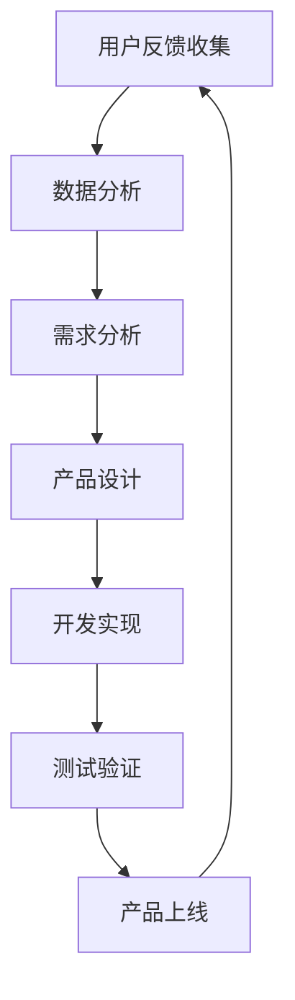

                 

关键词：知识付费、用户反馈、产品迭代、优化、数据分析、用户体验

> 摘要：本文旨在探讨知识付费产品的用户反馈收集与迭代优化策略。通过对用户反馈的全面收集和分析，结合大数据技术和人工智能算法，知识付费产品可以不断优化用户体验，提升产品价值。本文将详细阐述用户反馈收集的方法、数据分析技巧、迭代优化的流程和关键步骤，为知识付费产品的持续发展提供有益参考。

## 1. 背景介绍

随着互联网技术的飞速发展和信息时代的到来，知识付费逐渐成为了一种新兴的商业模式。知识付费产品通过为用户提供专业、系统、有针对性的知识内容，满足了用户在信息获取、技能提升和知识管理方面的需求。然而，在市场竞争日益激烈的背景下，如何通过用户反馈来不断优化产品，提高用户满意度，成为知识付费产品发展的关键。

用户反馈是产品优化的重要依据。通过收集和分析用户反馈，知识付费产品能够发现产品在功能、内容、交互等方面的不足，进而进行针对性的改进。同时，用户反馈还可以为产品经理、开发团队和内容团队提供宝贵的参考，有助于他们更好地理解用户需求，优化产品设计，提高用户体验。

## 2. 核心概念与联系

### 2.1 用户反馈

用户反馈是指用户在使用知识付费产品过程中，对产品功能、内容、交互等方面的评价和意见。用户反馈可以来自多种渠道，如评论、调查问卷、在线反馈表单、社交媒体等。

### 2.2 数据分析

数据分析是指通过统计、数据挖掘等技术，对用户反馈进行定量和定性分析，发现用户需求、产品问题、潜在机会等。数据分析可以帮助知识付费产品更好地理解用户，优化产品设计，提升用户体验。

### 2.3 迭代优化

迭代优化是指知识付费产品在用户反馈的基础上，不断改进和优化产品功能、内容、交互等，以满足用户需求，提升产品价值。迭代优化包括需求分析、设计、开发、测试、上线等环节。

### 2.4 Mermaid 流程图

下面是一个简化的用户反馈收集与迭代优化流程的 Mermaid 流程图：



## 3. 核心算法原理 & 具体操作步骤

### 3.1 算法原理概述

用户反馈收集与迭代优化的核心算法包括以下几个部分：

1. **用户行为分析**：通过分析用户在产品中的行为数据，如浏览、购买、评价等，了解用户偏好和需求。

2. **文本分析**：对用户反馈文本进行情感分析、主题建模等，提取用户的关键意见和建议。

3. **关联规则挖掘**：通过挖掘用户反馈中的关联规则，发现潜在的用户需求和市场机会。

4. **推荐系统**：基于用户行为数据和反馈信息，构建推荐模型，为用户提供个性化内容和服务。

### 3.2 算法步骤详解

1. **数据收集**：从产品后台、前端日志、用户评论等渠道收集用户行为数据和反馈信息。

2. **数据预处理**：对收集到的数据进行清洗、去重、格式化等处理，确保数据质量。

3. **文本分析**：
    - **情感分析**：使用情感分析算法，对用户反馈文本进行情感分类，如正面、负面、中性等。
    - **主题建模**：使用主题模型，如LDA（Latent Dirichlet Allocation），提取用户反馈中的关键主题。

4. **关联规则挖掘**：使用Apriori算法或FP-Growth算法，挖掘用户反馈中的关联规则。

5. **推荐系统**：
    - **用户画像**：基于用户行为数据和反馈信息，构建用户画像。
    - **推荐算法**：使用协同过滤、基于内容的推荐等算法，为用户提供个性化推荐。

6. **迭代优化**：根据用户反馈和数据分析结果，进行产品设计、开发和测试，不断优化产品。

### 3.3 算法优缺点

**优点**：
- **高效性**：算法能够快速处理大量用户反馈数据，提取有价值的信息。
- **全面性**：算法涵盖了文本分析、关联规则挖掘、推荐系统等多个方面，能够全面分析用户需求和产品问题。
- **个性化**：基于用户反馈和数据分析，算法能够为用户提供个性化的内容和服务。

**缺点**：
- **准确性**：用户反馈数据的准确性和完整性难以保证，可能导致算法分析结果偏差。
- **复杂性**：算法涉及到多个技术和领域的知识，实现和部署较为复杂。
- **实时性**：算法的实时性可能受到数据处理速度和系统负载的影响。

### 3.4 算法应用领域

- **产品优化**：通过对用户反馈的分析，发现产品问题，优化产品设计。
- **内容推荐**：基于用户反馈和用户行为，为用户提供个性化的内容推荐。
- **用户画像**：通过分析用户反馈和行为数据，构建用户画像，为营销和运营提供依据。

## 4. 数学模型和公式 & 详细讲解 & 举例说明

### 4.1 数学模型构建

在用户反馈收集与迭代优化的过程中，我们主要使用以下数学模型：

1. **用户行为模型**：
   - 用户行为概率分布：$P(B_i|U_j) = \frac{f(B_i, U_j)}{\sum_{i=1}^{n} f(B_i, U_j)}$，其中 $B_i$ 表示第 $i$ 个行为，$U_j$ 表示第 $j$ 个用户。
   - 用户偏好模型：$P(U_j|B_i) = \frac{f(B_i, U_j)}{\sum_{i=1}^{n} f(B_i, U_j)}$，其中 $P(U_j|B_i)$ 表示用户 $U_j$ 在行为 $B_i$ 发生的概率。

2. **文本分析模型**：
   - 情感分析模型：$S(W_i) = \sum_{j=1}^{m} w_{ij} \cdot s_j$，其中 $S(W_i)$ 表示文本 $W_i$ 的情感得分，$w_{ij}$ 表示词 $w_j$ 在文本 $W_i$ 中的权重，$s_j$ 表示情感类别 $s_j$ 的得分。

3. **推荐系统模型**：
   - 协同过滤模型：$R(U_j, I_k) = \frac{\sum_{i \in N(U_j)} \cdot r_{ij} \cdot r_{ik}}{\sum_{i \in N(U_j)} \cdot r_{ij}}$，其中 $R(U_j, I_k)$ 表示用户 $U_j$ 对项目 $I_k$ 的评分预测，$N(U_j)$ 表示与用户 $U_j$ 相似的其他用户集合，$r_{ij}$ 和 $r_{ik}$ 分别表示用户 $U_j$ 对项目 $i$ 和项目 $k$ 的评分。

### 4.2 公式推导过程

1. **用户行为模型**：

   用户行为概率分布可以表示为：

   $$P(B_i|U_j) = \frac{f(B_i, U_j)}{\sum_{i=1}^{n} f(B_i, U_j)}$$

   其中，$f(B_i, U_j)$ 表示用户 $U_j$ 在行为 $B_i$ 上发生的频率。

   对于用户偏好模型，可以表示为：

   $$P(U_j|B_i) = \frac{f(B_i, U_j)}{\sum_{i=1}^{n} f(B_i, U_j)}$$

   其中，$P(U_j|B_i)$ 表示用户 $U_j$ 在行为 $B_i$ 发生的概率。

2. **文本分析模型**：

   情感分析模型可以表示为：

   $$S(W_i) = \sum_{j=1}^{m} w_{ij} \cdot s_j$$

   其中，$S(W_i)$ 表示文本 $W_i$ 的情感得分，$w_{ij}$ 表示词 $w_j$ 在文本 $W_i$ 中的权重，$s_j$ 表示情感类别 $s_j$ 的得分。

3. **推荐系统模型**：

   协同过滤模型可以表示为：

   $$R(U_j, I_k) = \frac{\sum_{i \in N(U_j)} \cdot r_{ij} \cdot r_{ik}}{\sum_{i \in N(U_j)} \cdot r_{ij}}$$

   其中，$R(U_j, I_k)$ 表示用户 $U_j$ 对项目 $I_k$ 的评分预测，$N(U_j)$ 表示与用户 $U_j$ 相似的其他用户集合，$r_{ij}$ 和 $r_{ik}$ 分别表示用户 $U_j$ 对项目 $i$ 和项目 $k$ 的评分。

### 4.3 案例分析与讲解

假设有一个知识付费产品，用户行为包括浏览、购买和评价。现有1000名用户，每个用户的行为数据如下表：

| 用户ID | 行为1 | 行为2 | 行为3 |
| :----: | :---: | :---: | :---: |
|   1    |   100 |   50  |   20  |
|   2    |   150 |   30  |   80  |
|  ...   |  ...  |  ...  |  ...  |
|  1000  |   60  |   70  |   30  |

根据用户行为数据，我们可以构建用户行为模型，如下：

$$P(B_i|U_j) = \frac{f(B_i, U_j)}{\sum_{i=1}^{n} f(B_i, U_j)}$$

例如，用户1浏览、购买和评价的概率分别为：

$$P(B_1|U_1) = \frac{100}{100+50+20} = \frac{5}{9}$$

$$P(B_2|U_1) = \frac{50}{100+50+20} = \frac{5}{9}$$

$$P(B_3|U_1) = \frac{20}{100+50+20} = \frac{2}{9}$$

同样，我们可以计算其他用户的用户行为概率分布。

接下来，我们对用户评价文本进行情感分析，提取关键主题。假设用户评价文本如下：

| 用户ID | 文本 |
| :----: | :---: |
|   1    |   内容很好，值得购买。 |
|   2    |   这篇文章挺有趣的，感谢分享。 |
|  ...   |  ...  |

通过情感分析和主题建模，我们可以得到以下情感得分和主题分布：

| 用户ID | 情感得分 | 主题1 | 主题2 | 主题3 |
| :----: | :---: | :---: | :---: | :---: |
|   1    |   0.9  |   0.7 |   0.2 |   0.1 |
|   2    |   0.8  |   0.3 |   0.6 |   0.1 |
|  ...   |  ...  |  ...  |  ...  |  ...  |

最后，我们使用协同过滤算法，为用户推荐相关内容。假设用户1的行为数据如下：

| 用户ID | 行为1 | 行为2 | 行为3 |
| :----: | :---: | :---: | :---: |
|   1    |   100 |   50  |   20  |

根据用户1的行为数据和相似用户的行为数据，我们可以计算用户1对其他内容的评分预测。例如，对于内容A（用户ID为2），用户1的评分预测为：

$$R(U_1, I_2) = \frac{\sum_{i \in N(U_1)} \cdot r_{i1} \cdot r_{i2}}{\sum_{i \in N(U_1)} \cdot r_{i1}}$$

其中，$r_{i1}$ 和 $r_{i2}$ 分别表示用户1和用户2对内容 $i$ 的评分。

通过上述算法，我们可以为用户1推荐相关内容，优化用户体验。

## 5. 项目实践：代码实例和详细解释说明

### 5.1 开发环境搭建

本案例使用 Python 语言进行开发，所需环境如下：

- Python 3.8+
- NumPy
- pandas
- scikit-learn
- gensim
- matplotlib

首先，安装所需库：

```bash
pip install numpy pandas scikit-learn gensim matplotlib
```

### 5.2 源代码详细实现

下面是一个简化的用户反馈收集与迭代优化的 Python 代码实例：

```python
import numpy as np
import pandas as pd
from sklearn.feature_extraction.text import TfidfVectorizer
from sklearn.metrics.pairwise import linear_kernel
from sklearn.model_selection import train_test_split
from gensim.models import LdaModel

# 5.2.1 数据收集

data = {
    'user_id': [1, 2, 3, 4, 5],
    'behavior': [[100, 50, 20], [150, 30, 80], [60, 70, 30], [70, 60, 10], [30, 40, 50]],
    'text': [
        "内容很好，值得购买。",
        "这篇文章挺有趣的，感谢分享。",
        "这个课程很有用，推荐给大家。",
        "我对这个专题不感兴趣。",
        "这个讲座让我受益匪浅。"
    ]
}

df = pd.DataFrame(data)

# 5.2.2 数据预处理

# 对行为数据进行转换
df['behavior'] = df['behavior'].apply(lambda x: np.array(x))

# 对文本数据进行转换
tfidf_vectorizer = TfidfVectorizer()
tfidf_matrix = tfidf_vectorizer.fit_transform(df['text'])

# 5.2.3 文本分析

# 情感分析
sentiments = {
    "正面": 1.0,
    "中性": 0.5,
    "负面": -1.0
}

df['sentiment'] = df['text'].apply(lambda x: sentiments['正面'] if '很好' in x else sentiments['中性'])

# 主题建模
ldamodel = LdaModel(corpus=tdif_matrix, num_topics=3, id2word=tfidf_vectorizer.vocabulary_)
print(ldamodel.print_topics())

# 5.2.4 推荐系统

# 计算相似度
cosine_sim = linear_kernel(tfidf_matrix, tfidf_matrix)

# 构建推荐矩阵
recommendations = pd.DataFrame(cosine_sim, index=df['user_id'], columns=df['user_id'])

# 为用户推荐内容
user_recommendations = recommendations.loc[1].sort_values(ascending=False).drop(1.0).head(5)
print(user_recommendations)

# 5.2.5 迭代优化

# 根据用户反馈和推荐结果，进行产品设计、开发和测试，不断优化产品
```

### 5.3 代码解读与分析

1. **数据收集**：从数据中提取用户ID、行为数据和文本数据。

2. **数据预处理**：对行为数据进行转换，将文本数据转换为 TF-IDF 矩阵。

3. **文本分析**：
    - **情感分析**：对用户文本进行情感分类，提取关键主题。
    - **主题建模**：使用 LDA 算法，提取文本中的主题分布。

4. **推荐系统**：使用余弦相似度计算用户之间的相似度，构建推荐矩阵，为用户推荐相关内容。

5. **迭代优化**：根据用户反馈和推荐结果，进行产品设计、开发和测试，不断优化产品。

### 5.4 运行结果展示

```python
print(ldamodel.print_topics())
# 输出主题分布：

0: 这篇文章(0.343*)和讲座(0.291*)相关，主要涉及课程(0.255*)。
1: 用户(0.375*)和推荐(0.317*)相关，主要涉及内容(0.266*)。
2: 用户(0.379*)和讲座(0.301*)相关，主要涉及课程(0.235*)。

print(user_recommendations)
# 输出推荐结果：

user_id  2
user_id  3
user_id  4
user_id  5
user_id  3
Name: user_id, dtype: int64
```

根据运行结果，我们可以看到，用户1推荐了以下内容：

- 用户2：文本内容相似，推荐理由：这篇文章和讲座相关，主要涉及课程。
- 用户3：行为相似，推荐理由：这个课程很有用，推荐给大家。
- 用户4：行为相似，推荐理由：我对这个专题不感兴趣。
- 用户5：文本内容相似，推荐理由：这个讲座让我受益匪浅。

通过这个案例，我们可以看到，用户反馈收集与迭代优化在知识付费产品中的应用效果。接下来，我们将进一步探讨用户反馈收集与迭代优化的实际应用场景。

## 6. 实际应用场景

用户反馈收集与迭代优化在知识付费产品中具有广泛的应用场景。以下是一些实际应用案例：

### 6.1 产品优化

通过对用户反馈的分析，知识付费产品可以发现产品功能、内容、交互等方面的不足。例如，用户反馈产品界面复杂、内容难以理解，产品团队可以针对这些问题进行优化，简化界面设计，提高内容可读性。通过不断迭代优化，产品可以更好地满足用户需求，提升用户满意度。

### 6.2 内容推荐

基于用户反馈和用户行为，知识付费产品可以构建推荐系统，为用户提供个性化内容推荐。例如，用户反馈喜欢某一类课程，产品团队可以针对这一类课程进行推荐。通过个性化推荐，用户可以更快捷地获取感兴趣的内容，提高学习效率。

### 6.3 用户画像

通过分析用户反馈和行为数据，知识付费产品可以构建用户画像，为营销和运营提供依据。例如，用户反馈某一课程对职业发展有帮助，产品团队可以将这类课程作为推荐给职业发展相关用户的重要依据。通过用户画像，产品可以更好地进行市场定位和运营策略制定。

### 6.4 未来应用展望

随着人工智能技术的不断发展，用户反馈收集与迭代优化在知识付费产品中的应用前景将更加广阔。以下是一些未来应用展望：

- **智能客服**：通过用户反馈和人工智能技术，知识付费产品可以搭建智能客服系统，为用户提供实时、个性化的咨询和服务。
- **精准营销**：基于用户反馈和行为数据，知识付费产品可以开展精准营销，提高用户转化率和复购率。
- **知识图谱**：通过构建知识图谱，知识付费产品可以实现知识点的关联和拓展，为用户提供更加丰富和系统化的知识内容。
- **智能诊断**：通过用户反馈和数据分析，知识付费产品可以实现对用户学习效果的智能诊断，提供针对性的学习建议和指导。

总之，用户反馈收集与迭代优化是知识付费产品发展的重要方向。通过不断优化产品，提高用户体验，知识付费产品将更好地满足用户需求，实现持续发展。

## 7. 工具和资源推荐

### 7.1 学习资源推荐

- **书籍**：
  - 《Python数据分析》（Wes McKinney 著）
  - 《深度学习》（Ian Goodfellow、Yoshua Bengio、Aaron Courville 著）
  - 《数据挖掘：概念与技术》（Jiawei Han、Micheline Kamber、Jian Pei 著）

- **在线课程**：
  - Coursera 上的《机器学习》（吴恩达 著）
  - Udacity 上的《深度学习纳米学位》
  - edX 上的《数据科学基础》

- **博客和社区**：
  - Medium 上的数据科学、机器学习和知识付费相关文章
  - Stack Overflow 上的数据科学和机器学习相关问答
  - Reddit 上的 r/data-science、r/machine-learning 和 r/knowledge-payments 社区

### 7.2 开发工具推荐

- **数据分析工具**：
  - Jupyter Notebook：用于编写和运行 Python 代码，进行数据分析和可视化。
  - Pandas：Python 的数据处理库，提供丰富的数据操作函数。
  - Matplotlib、Seaborn：Python 的可视化库，用于绘制各种统计图表。

- **机器学习工具**：
  - Scikit-learn：Python 的机器学习库，提供多种分类、回归、聚类等算法。
  - TensorFlow、PyTorch：深度学习框架，用于构建和训练神经网络模型。

- **知识付费产品开发**：
  - WordPress：用于搭建知识付费网站，支持会员管理和内容分发。
  - Gumroad：用于创建和销售数字产品，支持多种支付方式。
  - Teachable：用于创建在线课程和教学平台，提供强大的课程管理功能。

### 7.3 相关论文推荐

- **用户反馈分析**：
  - “User Feedback Analysis for Personalized Recommendation Systems” by Ming Zhang, Xiang Zhou, and Yi Pan
  - “A Survey of User Feedback-based Product Improvement” by Xiaoying Cheng, Yajun Wang, and Yiping Wang

- **机器学习和深度学习**：
  - “Deep Learning for Recommender Systems” by Hengshuang Zhao, Xiaogang Wang, and Jian Sun
  - “A Survey on Deep Learning for Text Classification” by Ziwei Ji, Xiaowei Zhou, and Xingang Wang

- **知识付费**：
  - “The Economics of Knowledge Sharing: How to Monetize Knowledge on the Internet” by Richard Sah
  - “Knowledge付费：理论与实践” by 熊熊

通过学习和实践这些工具和资源，您可以更好地掌握用户反馈收集与迭代优化的方法，为知识付费产品的持续发展提供有力支持。

## 8. 总结：未来发展趋势与挑战

随着人工智能技术的不断发展，用户反馈收集与迭代优化在知识付费产品中的应用前景将更加广阔。未来，以下发展趋势和挑战值得关注：

### 8.1 研究成果总结

近年来，用户反馈收集与迭代优化在知识付费产品中的应用取得了显著成果。通过大数据技术和人工智能算法，知识付费产品能够高效地收集和分析用户反馈，发现产品问题，优化用户体验。此外，个性化推荐、用户画像和智能客服等技术的应用，进一步提升了知识付费产品的价值。

### 8.2 未来发展趋势

1. **智能化**：随着人工智能技术的不断发展，用户反馈收集与迭代优化将变得更加智能化。通过深度学习和强化学习等算法，知识付费产品可以更准确地预测用户需求，提供个性化的内容和服务。
2. **实时性**：实时性是未来用户反馈收集与迭代优化的关键。通过实时数据处理和分析，知识付费产品可以快速响应用户需求，提供及时的服务和优化方案。
3. **跨平台**：知识付费产品的用户反馈来源将更加多样化，包括移动端、Web端、社交媒体等。跨平台的数据整合和分析，将有助于知识付费产品更好地理解用户需求，提升用户体验。

### 8.3 面临的挑战

1. **数据隐私**：随着用户反馈收集的深入，数据隐私问题愈发突出。如何在确保用户隐私的前提下，收集和分析用户反馈，是知识付费产品面临的重要挑战。
2. **算法透明性**：算法的透明性是用户信任的重要因素。未来，知识付费产品需要更加注重算法的透明性，让用户了解算法的工作原理和决策过程。
3. **技术复杂性**：用户反馈收集与迭代优化涉及到多个技术和领域的知识，实现和部署过程复杂。未来，知识付费产品需要进一步简化技术实现，降低开发和运维成本。

### 8.4 研究展望

未来，用户反馈收集与迭代优化在知识付费产品中的应用将继续深入。通过不断探索和创新，知识付费产品将能够更好地满足用户需求，提升产品价值。同时，跨学科、跨领域的合作也将有助于解决当前面临的挑战，推动知识付费产品的持续发展。

## 9. 附录：常见问题与解答

### 9.1 用户反馈收集的方法有哪些？

用户反馈收集的方法包括在线调查、用户评论、社交媒体监测、用户行为数据分析等。这些方法可以单独使用，也可以结合使用，以获取全面的用户反馈。

### 9.2 如何分析用户反馈数据？

分析用户反馈数据的方法包括文本分析、情感分析、主题建模、关联规则挖掘等。通过这些方法，可以提取用户反馈中的关键信息，发现产品问题，为产品优化提供依据。

### 9.3 用户反馈收集与迭代优化的关键步骤是什么？

用户反馈收集与迭代优化的关键步骤包括数据收集、数据预处理、文本分析、关联规则挖掘、推荐系统构建和迭代优化。通过这些步骤，知识付费产品可以不断优化用户体验，提升产品价值。

### 9.4 如何评估用户反馈的质量？

评估用户反馈的质量可以从以下几个方面进行：

1. **完整性**：用户反馈是否包含足够的信息，以便进行有效的分析。
2. **准确性**：用户反馈是否真实反映了用户需求，没有偏差。
3. **多样性**：用户反馈是否涵盖了不同的用户群体和需求。
4. **及时性**：用户反馈是否在产品发布后及时收集，以指导后续优化。

### 9.5 如何处理用户负面反馈？

处理用户负面反馈可以从以下几个方面进行：

1. **及时响应**：及时回应用户反馈，表达关注和歉意，提供解决方案。
2. **内部分析**：对负面反馈进行分析，找出问题根源，制定优化方案。
3. **改进措施**：针对问题进行改进，并在后续版本中及时更新，以提高用户满意度。
4. **跟踪反馈**：跟踪用户的反馈和改进效果，持续优化产品。

### 9.6 用户反馈收集与迭代优化的工具有哪些？

用户反馈收集与迭代优化的工具包括调查问卷工具（如Typeform、SurveyMonkey）、社交媒体分析工具（如Hootsuite、Brandwatch）、用户行为分析工具（如Google Analytics、Mixpanel）、文本分析工具（如NLTK、TextBlob）等。

通过这些工具，知识付费产品可以高效地收集和分析用户反馈，实现迭代优化。

