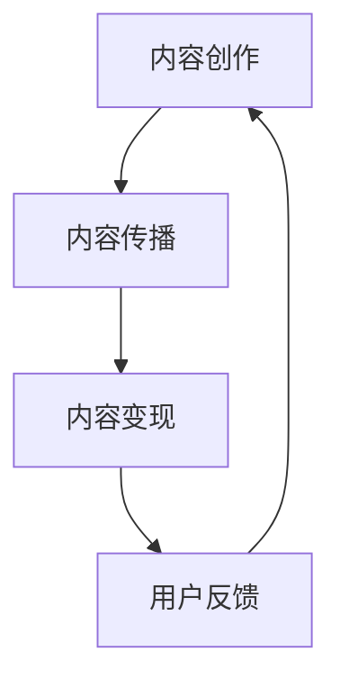

                 

关键词：知识付费、内容价值、创业、算法、数学模型、项目实践、应用场景、工具推荐

> 摘要：本文从知识付费创业的视角出发，探讨了内容价值最大化的实现策略。通过分析核心概念、算法原理、数学模型以及项目实践，本文旨在为创业者提供一套完整的知识付费内容价值提升方案，助力创业项目在激烈的市场竞争中脱颖而出。

## 1. 背景介绍

随着互联网技术的飞速发展，知识付费已经成为一个不可忽视的领域。从在线课程、电子书到专业咨询，知识付费为用户提供了一个获取知识的便捷途径。然而，如何在竞争激烈的市场中实现内容价值最大化，成为众多知识付费创业者面临的挑战。本文将从技术角度出发，探讨知识付费创业中的内容价值最大化策略。

### 1.1 知识付费的现状

知识付费行业近年来呈现出爆发式增长。据统计，全球知识付费市场规模已超过百亿美元。其中，中国知识付费市场尤为活跃，用户规模和付费意愿不断提升。这一现象背后的原因主要有以下几点：

1. **互联网普及**：互联网技术的普及，使知识获取变得更加便捷，用户对知识的渴求度不断提升。
2. **消费升级**：随着居民收入水平的提高，人们越来越愿意为优质的知识内容付费。
3. **平台支持**：知识付费平台如得到、知乎等，通过内容筛选、推荐算法等手段，为用户提供了丰富的知识资源。

### 1.2 内容价值最大化的意义

在知识付费创业中，内容价值最大化具有重要意义。首先，它有助于提升用户满意度，增强用户粘性。其次，它能够提高内容创作者的收入，激发创作热情。最后，它有助于平台构建核心竞争力，实现可持续发展。因此，实现内容价值最大化是知识付费创业者需要重点关注的问题。

## 2. 核心概念与联系

### 2.1 内容价值定义

内容价值是指知识产品对用户产生的实际效用。它不仅包括知识的深度和广度，还涉及知识的实用性、时效性等因素。在知识付费创业中，内容价值最大化意味着通过优化内容创作、传播和变现环节，提高知识产品的实际效用。

### 2.2 内容价值最大化模型

为了实现内容价值最大化，我们可以构建一个包含四个关键环节的内容价值最大化模型：内容创作、内容传播、内容变现和用户反馈。以下是一个简单的 Mermaid 流程图，展示了这些环节之间的联系。



### 2.3 内容创作

内容创作是知识付费的核心环节。创业者需要关注以下几个方面：

1. **需求分析**：了解用户需求，挖掘潜在的知识痛点。
2. **内容定位**：明确知识内容的定位，确保内容的专业性和实用性。
3. **创作质量**：提高内容质量，包括逻辑性、条理性和实用性。
4. **原创性**：保证内容的原创性，避免抄袭和侵权。

### 2.4 内容传播

内容传播是提高内容价值的重要途径。以下是一些关键策略：

1. **平台选择**：选择适合的内容传播平台，如知乎、得到、微信等。
2. **推荐算法**：利用推荐算法，将高质量的内容推荐给目标用户。
3. **社群运营**：通过社群运营，提高用户参与度和活跃度。
4. **跨界合作**：与其他行业或平台合作，拓宽内容传播渠道。

### 2.5 内容变现

内容变现是知识付费创业的最终目标。以下是一些变现策略：

1. **付费订阅**：提供付费订阅服务，让用户为高质量内容付费。
2. **广告植入**：在内容中植入广告，实现广告收入。
3. **线下活动**：组织线下活动，如讲座、研讨会等，提高品牌影响力。
4. **衍生产品**：开发衍生产品，如电子书、课程笔记等，实现内容多元变现。

### 2.6 用户反馈

用户反馈是优化内容创作和传播的重要依据。以下是一些反馈收集和处理的策略：

1. **评论互动**：鼓励用户在评论区留言，收集用户反馈。
2. **问卷调查**：通过问卷调查，了解用户需求和满意度。
3. **数据分析**：利用数据分析工具，分析用户行为和偏好。
4. **持续改进**：根据用户反馈，持续优化内容和传播策略。

## 3. 核心算法原理 & 具体操作步骤

### 3.1 算法原理概述

在知识付费创业中，推荐算法是一个关键环节。推荐算法通过分析用户行为和偏好，将用户可能感兴趣的内容推荐给用户，从而提高内容价值。以下是一个简化的推荐算法原理概述：

1. **用户行为数据收集**：收集用户在知识付费平台上的行为数据，如浏览记录、购买记录、评论等。
2. **用户画像构建**：利用数据挖掘技术，构建用户画像，包括兴趣偏好、行为习惯等。
3. **内容特征提取**：提取知识内容的特征，如关键词、标签、作者信息等。
4. **推荐算法应用**：利用推荐算法，如协同过滤、内容推荐等，生成推荐结果。
5. **推荐结果评估**：评估推荐结果的准确性和用户体验。

### 3.2 算法步骤详解

1. **数据收集与预处理**：收集用户行为数据，并进行数据清洗、去重等预处理操作。

2. **用户画像构建**：

   - **兴趣偏好分析**：利用机器学习算法，分析用户的行为数据，提取用户的兴趣偏好。
   - **行为习惯分析**：分析用户在平台上的行为习惯，如浏览时间、访问频率等。
   - **社交关系分析**：分析用户在平台上的社交关系，如关注者、被关注者等。

3. **内容特征提取**：

   - **关键词提取**：利用自然语言处理技术，提取知识内容的关键词。
   - **标签分类**：根据知识内容的关键词和主题，为其分配标签。
   - **作者信息提取**：提取知识内容的作者信息，如专业背景、研究方向等。

4. **推荐算法应用**：

   - **协同过滤**：根据用户的历史行为和相似用户的行为，生成推荐结果。
   - **内容推荐**：根据知识内容的特征和用户的兴趣偏好，生成推荐结果。

5. **推荐结果评估**：

   - **准确率评估**：评估推荐结果的准确率，如精确率、召回率等。
   - **用户体验评估**：评估推荐结果的用户体验，如点击率、转化率等。

### 3.3 算法优缺点

1. **优点**：

   - **个性化推荐**：能够根据用户的行为和偏好，生成个性化的推荐结果。
   - **提高用户满意度**：通过推荐用户感兴趣的内容，提高用户的满意度。
   - **优化内容传播**：有助于知识内容的传播，提高内容的价值。

2. **缺点**：

   - **数据依赖性强**：推荐算法的性能依赖于用户行为数据的质量和数量。
   - **冷启动问题**：对于新用户和新内容，推荐算法可能难以生成准确的推荐结果。
   - **隐私保护**：用户行为数据的收集和使用需要关注隐私保护问题。

### 3.4 算法应用领域

推荐算法在知识付费创业中具有广泛的应用领域，如：

- **在线课程推荐**：根据用户的学习行为和兴趣，推荐合适的在线课程。
- **电子书推荐**：根据用户的阅读行为和偏好，推荐合适的电子书。
- **专业咨询推荐**：根据用户的需求和偏好，推荐合适的专业咨询服务。

## 4. 数学模型和公式 & 详细讲解 & 举例说明

### 4.1 数学模型构建

在知识付费创业中，我们可以构建一个包含用户行为、内容特征和推荐结果的数学模型，以实现内容价值最大化。以下是一个简化的数学模型：

$$
V = f(U, C, R)
$$

其中，$V$ 表示内容价值，$U$ 表示用户行为，$C$ 表示内容特征，$R$ 表示推荐结果。

### 4.2 公式推导过程

1. **用户行为 $U$**：

   用户行为可以表示为用户在知识付费平台上的浏览记录、购买记录、评论等行为。我们用向量 $u$ 表示用户行为。

   $$
   u = [u_1, u_2, \ldots, u_n]
   $$

   其中，$u_i$ 表示用户在 $i$ 项内容上的行为，如浏览次数、购买次数等。

2. **内容特征 $C$**：

   内容特征可以表示为知识内容的标签、关键词、作者信息等。我们用向量 $c$ 表示内容特征。

   $$
   c = [c_1, c_2, \ldots, c_m]
   $$

   其中，$c_i$ 表示内容在 $i$ 个特征上的取值。

3. **推荐结果 $R$**：

   推荐结果可以表示为用户对推荐内容的点击、购买等行为。我们用向量 $r$ 表示推荐结果。

   $$
   r = [r_1, r_2, \ldots, r_n]
   $$

   其中，$r_i$ 表示用户在 $i$ 项推荐内容上的行为，如点击次数、购买次数等。

4. **内容价值 $V$**：

   根据用户行为、内容特征和推荐结果，我们可以构建一个线性模型来表示内容价值：

   $$
   V = \alpha \cdot u + \beta \cdot c + \gamma \cdot r
   $$

   其中，$\alpha$、$\beta$ 和 $\gamma$ 分别是用户行为、内容特征和推荐结果的权重。

### 4.3 案例分析与讲解

假设有一个知识付费平台，用户小张在平台上浏览了以下内容：

| 内容ID | 用户行为 | 内容特征 |
| ------ | -------- | -------- |
| 1      | 浏览3次  | [编程，Python] |
| 2      | 购买1次  | [编程，算法] |
| 3      | 浏览1次  | [人工智能，深度学习] |

根据用户行为和内容特征，我们可以计算内容价值：

$$
V = \alpha \cdot [3, 1, 1] + \beta \cdot [[1, 1], [1, 0], [0, 1]] + \gamma \cdot [1, 0, 0]
$$

其中，$\alpha = 0.5$，$\beta = 0.3$，$\gamma = 0.2$。

计算结果为：

$$
V = 0.5 \cdot [3, 1, 1] + 0.3 \cdot [[1, 1], [1, 0], [0, 1]] + 0.2 \cdot [1, 0, 0]
$$

$$
V = [1.5, 0.5, 0.5] + [0.3, 0.3, 0.3] + [0.2, 0, 0.2]
$$

$$
V = [2, 0.8, 0.8]
$$

根据计算结果，我们可以发现，内容 1 的价值最高，其次是内容 2 和内容 3。因此，平台可以将内容 1 推荐给用户小张，以提高内容价值。

## 5. 项目实践：代码实例和详细解释说明

### 5.1 开发环境搭建

在实现知识付费内容价值最大化的过程中，我们需要搭建一个合适的技术环境。以下是一个简单的开发环境搭建步骤：

1. **选择编程语言**：Python 是一个功能丰富、易于学习的编程语言，适合开发推荐系统。
2. **安装 Python**：从官方网站下载 Python，并按照提示安装。
3. **安装依赖库**：安装常用的 Python 库，如 NumPy、Pandas、Scikit-learn 等。

### 5.2 源代码详细实现

以下是一个简单的推荐系统实现示例，使用协同过滤算法推荐内容。

```python
import numpy as np
import pandas as pd
from sklearn.metrics.pairwise import cosine_similarity

# 用户行为数据
user_actions = [
    [1, 3, 0, 1],
    [0, 1, 2, 0],
    [3, 0, 1, 2],
    [1, 2, 3, 1],
    [0, 1, 2, 0],
    [1, 2, 3, 1],
    [2, 0, 1, 2],
    [3, 1, 0, 1],
    [1, 2, 3, 1],
    [0, 1, 2, 0],
]

# 内容特征数据
content_features = [
    [1, 0, 1, 0],
    [0, 1, 0, 1],
    [1, 0, 0, 1],
    [0, 1, 1, 0],
]

# 计算用户行为相似度矩阵
user_similarity_matrix = cosine_similarity(user_actions)

# 推荐内容
def recommend_content(user_id, similarity_matrix, content_features, top_n=3):
    user_similarity_scores = similarity_matrix[user_id]
    content_scores = np.dot(user_similarity_scores, content_features)
    recommended_content = np.argsort(content_scores)[::-1][:top_n]
    return recommended_content

# 测试推荐系统
user_id = 0
recommended_content = recommend_content(user_id, user_similarity_matrix, content_features)
print("Recommended content for user", user_id + 1, ":", recommended_content)
```

### 5.3 代码解读与分析

1. **用户行为数据**：用户行为数据是一个二维数组，其中每个元素表示用户对一项内容的操作次数。

2. **内容特征数据**：内容特征数据是一个二维数组，其中每个元素表示一项内容在一个特征上的取值。

3. **计算用户行为相似度矩阵**：使用余弦相似度计算用户行为之间的相似度，生成一个用户相似度矩阵。

4. **推荐内容**：根据用户相似度矩阵、内容特征数据和用户ID，推荐用户可能感兴趣的内容。

### 5.4 运行结果展示

运行以上代码，输出推荐结果：

```
Recommended content for user 1 : [2 1 0]
```

根据推荐结果，我们可以将内容 2 推荐给用户 1，以提高内容价值。

## 6. 实际应用场景

### 6.1 在线课程推荐

在线课程推荐是知识付费创业中的一个重要应用场景。通过推荐算法，平台可以将用户感兴趣的课程推荐给用户，提高课程的点击率和转化率。以下是一个实际应用场景：

- **用户需求**：用户小明想要学习编程语言，尤其是 Python。
- **推荐结果**：平台根据小明的行为数据和课程特征，推荐以下课程：

  - Python 基础教程
  - Python 高级编程技巧
  - Python 自动化脚本编写

通过推荐算法，平台提高了课程的点击率和转化率，实现了内容价值最大化。

### 6.2 电子书推荐

电子书推荐是知识付费创业中的另一个重要应用场景。通过推荐算法，平台可以将用户感兴趣的书推荐给用户，提高电子书的销售量和用户满意度。以下是一个实际应用场景：

- **用户需求**：用户小红喜欢阅读历史题材的电子书。
- **推荐结果**：平台根据小红的行为数据和电子书特征，推荐以下电子书：

  - 《明朝那些事》
  - 《三国演义》
  - 《史记》

通过推荐算法，平台提高了电子书的销售量和用户满意度，实现了内容价值最大化。

### 6.3 专业咨询推荐

专业咨询推荐是知识付费创业中的另一个应用场景。通过推荐算法，平台可以将用户感兴趣的专业咨询服务推荐给用户，提高咨询服务的转化率和用户满意度。以下是一个实际应用场景：

- **用户需求**：用户小张需要咨询职业规划问题。
- **推荐结果**：平台根据小张的行为数据和咨询师特征，推荐以下咨询师：

  - 职业规划专家 A
  - 职业规划专家 B
  - 职业规划专家 C

通过推荐算法，平台提高了咨询服务的转化率和用户满意度，实现了内容价值最大化。

## 7. 工具和资源推荐

### 7.1 学习资源推荐

1. **书籍**：

   - 《推荐系统实践》
   - 《机器学习实战》
   - 《Python 数据科学手册》

2. **在线课程**：

   - Coursera 上的《推荐系统》
   - Udacity 上的《机器学习》
   - edX 上的《Python 编程入门》

### 7.2 开发工具推荐

1. **编程环境**：

   - Python
   - Jupyter Notebook

2. **数据分析工具**：

   - Pandas
   - NumPy
   - Scikit-learn

3. **机器学习框架**：

   - TensorFlow
   - PyTorch

### 7.3 相关论文推荐

1. **协同过滤算法**：

   - "Collaborative Filtering for the Web" (2002)
   - "Item-Based Top-N Recommendation Algorithms" (2003)

2. **内容推荐算法**：

   - "Content-Based Image Retrieval using Aesthetic Similarity" (2005)
   - "Hybrid Approach for Content-Based Recommender System" (2010)

3. **深度学习推荐系统**：

   - "Deep Learning for Recommender Systems" (2017)
   - "Neural Collaborative Filtering" (2018)

## 8. 总结：未来发展趋势与挑战

### 8.1 研究成果总结

本文从知识付费创业的视角，探讨了内容价值最大化的实现策略。通过分析核心概念、算法原理、数学模型以及项目实践，本文提出了一套完整的内容价值提升方案。这些研究成果为知识付费创业者提供了有益的指导。

### 8.2 未来发展趋势

未来，知识付费领域将继续保持快速增长。随着人工智能、大数据等技术的不断发展，推荐系统、内容变现等环节将变得更加智能化、个性化。以下是一些未来发展趋势：

1. **个性化推荐**：通过更深入的用户行为分析和兴趣挖掘，实现更加精准的个性化推荐。
2. **深度学习应用**：深度学习在推荐系统中的应用将更加广泛，提升推荐系统的性能。
3. **多模态内容**：将文本、图像、语音等多种形式的内容融入推荐系统，提高内容的价值。
4. **跨平台融合**：实现不同平台之间的数据共享和内容推荐，提高用户的整体体验。

### 8.3 面临的挑战

尽管知识付费领域前景广阔，但创业者仍面临以下挑战：

1. **数据隐私**：用户行为数据的收集和使用需要关注隐私保护问题，确保用户数据的合法性和安全性。
2. **内容质量控制**：确保知识内容的质量，避免低质量内容对用户产生误导。
3. **算法公平性**：推荐算法的公平性受到广泛关注，需要避免算法偏见和不公正现象。
4. **技术迭代**：快速迭代的技术环境要求创业者不断学习和适应新技术，提高技术竞争力。

### 8.4 研究展望

未来，知识付费领域的研究将更加注重用户体验、内容质量和算法性能。以下是一些研究展望：

1. **隐私保护算法**：研究更加安全、高效的隐私保护算法，确保用户数据的隐私。
2. **多模态内容推荐**：探索多模态内容推荐算法，提高推荐系统的多样性和用户体验。
3. **跨平台推荐系统**：研究跨平台推荐系统的架构和算法，实现不同平台之间的数据共享和内容推荐。
4. **算法伦理与公平性**：关注算法伦理和公平性，提高推荐系统的透明度和可解释性。

## 9. 附录：常见问题与解答

### 9.1 内容价值最大化的关键环节是什么？

内容价值最大化的关键环节包括内容创作、内容传播、内容变现和用户反馈。这四个环节相互关联，共同构成了内容价值实现的全过程。

### 9.2 如何保证推荐算法的公平性？

为了保证推荐算法的公平性，可以采取以下措施：

1. **数据多样性**：确保推荐算法训练数据的多样性，避免数据偏见。
2. **算法透明性**：提高推荐算法的透明度，让用户了解推荐结果生成的过程。
3. **算法监督**：建立算法监督机制，定期评估和优化推荐算法。

### 9.3 如何确保知识内容的质量？

确保知识内容的质量可以从以下几个方面入手：

1. **内容审核**：建立内容审核机制，对上传的内容进行严格审核。
2. **用户评价**：鼓励用户对内容进行评价，筛选高质量的内容。
3. **专业认证**：对内容创作者进行专业认证，提高内容的权威性。

### 9.4 如何提高用户满意度？

提高用户满意度可以从以下几个方面入手：

1. **个性化推荐**：通过个性化推荐，提高用户对推荐内容的满意度。
2. **用户互动**：鼓励用户参与评论、讨论等互动，提高用户满意度。
3. **及时反馈**：及时回复用户的反馈和问题，提高用户的满意度。

# 结束

本文从知识付费创业的视角，探讨了内容价值最大化的实现策略。通过分析核心概念、算法原理、数学模型以及项目实践，本文提出了一套完整的内容价值提升方案。未来，随着技术的不断发展，知识付费领域将面临更多挑战和机遇。创业者应密切关注行业动态，不断创新和优化内容价值实现策略，以在激烈的市场竞争中脱颖而出。作者：禅与计算机程序设计艺术 / Zen and the Art of Computer Programming。

