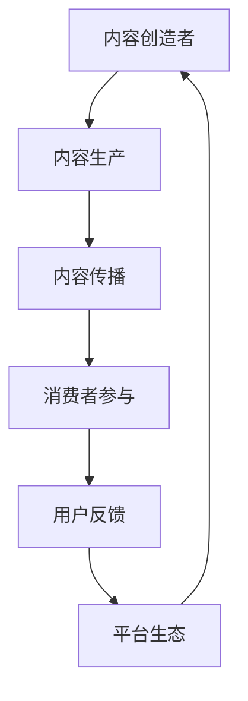

                 

关键词：知识付费、内容价值链、知识共享、创业、用户参与、平台生态

摘要：本文探讨了知识付费创业中的内容价值链构建。通过分析内容创造、传播、消费和反馈等环节，提出了一种基于用户参与和平台生态的内容价值链模型，并探讨了其在实践中的应用。

## 1. 背景介绍

随着互联网和数字技术的发展，知识付费市场呈现出爆发式增长。人们对于优质知识内容的需求日益增长，知识付费成为了一个潜力巨大的市场。然而，如何构建一个高效、可持续的内容价值链，成为知识付费创业领域的一个关键问题。

内容价值链是指将内容从生产、传播、消费到反馈等环节进行有机整合，从而实现价值的最大化。一个完善的内容价值链能够有效地连接内容创造者、传播者和消费者，实现资源的高效配置和价值的最大化。

本文旨在探讨知识付费创业中的内容价值链构建，分析其核心环节和关键要素，并提出一种基于用户参与和平台生态的内容价值链模型。

## 2. 核心概念与联系

### 2.1 内容创造者

内容创造者是知识付费创业的核心，他们通过创作、编辑、整合等方式，生产出有价值的内容。内容创造者可以是个人、机构或者专业团队，他们具有专业知识和创作能力。

### 2.2 内容传播者

内容传播者是连接内容创造者和消费者的桥梁。他们通过各种渠道和手段，将优质的内容传播给目标用户。内容传播者可以是平台、媒体、社交网络等，他们具有强大的传播能力和广泛的用户基础。

### 2.3 消费者

消费者是知识付费市场的最终受益者，他们是内容的消费者和评价者。消费者通过购买、阅读、评论等方式，参与到内容的价值链中，并对内容进行反馈和评价。

### 2.4 平台生态

平台生态是知识付费创业的核心支撑，它包括了内容创造者、内容传播者和消费者之间的互动和协作关系。一个健康、可持续的平台生态能够促进内容的价值实现，提升用户满意度。

### 2.5 Mermaid 流程图



## 3. 核心算法原理 & 具体操作步骤

### 3.1 算法原理概述

内容价值链构建的核心算法是基于用户参与和平台生态的。该算法通过以下步骤实现内容价值链的构建：

1. 内容创造：内容创造者根据市场需求和用户偏好，创作有价值的内容。
2. 内容传播：内容传播者通过多种渠道和手段，将内容传播给目标用户。
3. 消费者参与：消费者通过购买、阅读、评论等方式，参与到内容的价值链中。
4. 用户反馈：消费者对内容进行评价和反馈，影响内容的质量和传播效果。
5. 平台生态：平台通过数据分析和反馈机制，优化内容的生产和传播，提升用户体验。

### 3.2 算法步骤详解

1. **内容创造**：内容创造者根据市场需求和用户偏好，创作有价值的内容。这个过程包括选题、策划、撰写、编辑等环节。

2. **内容传播**：内容传播者通过多种渠道和手段，将内容传播给目标用户。这个过程包括渠道选择、内容推送、用户互动等环节。

3. **消费者参与**：消费者通过购买、阅读、评论等方式，参与到内容的价值链中。这个过程包括用户行为分析、需求匹配、用户激励等环节。

4. **用户反馈**：消费者对内容进行评价和反馈，影响内容的质量和传播效果。这个过程包括评价机制、反馈收集、内容调整等环节。

5. **平台生态**：平台通过数据分析和反馈机制，优化内容的生产和传播，提升用户体验。这个过程包括数据挖掘、用户行为分析、内容推荐等环节。

### 3.3 算法优缺点

**优点**：
- 提高内容的价值实现：通过用户参与和平台生态的互动，提高内容的价值和质量。
- 促进知识共享：通过平台生态的构建，促进知识的共享和传播。
- 提升用户体验：通过用户参与和反馈，提升用户体验和满意度。

**缺点**：
- 数据隐私和安全问题：用户数据和内容隐私保护是一个挑战。
- 平台生态构建成本高：构建一个健康、可持续的平台生态需要较高的成本。

### 3.4 算法应用领域

内容价值链构建算法广泛应用于知识付费领域，如在线教育、专业培训、知识分享平台等。它不仅适用于个体内容创造者，也适用于机构和平台的内容管理。

## 4. 数学模型和公式 & 详细讲解 & 举例说明

### 4.1 数学模型构建

内容价值链构建的数学模型主要包括用户参与度、内容质量和平台生态指标等。以下是一个简化的数学模型：

$$
V = f(U, Q, E)
$$

其中，$V$ 表示内容价值，$U$ 表示用户参与度，$Q$ 表示内容质量，$E$ 表示平台生态指标。

### 4.2 公式推导过程

1. **用户参与度**：

$$
U = \frac{I}{T}
$$

其中，$I$ 表示用户互动量（如评论、点赞、分享等），$T$ 表示总时间。

2. **内容质量**：

$$
Q = \frac{C}{D}
$$

其中，$C$ 表示内容满意度，$D$ 表示内容缺陷率。

3. **平台生态指标**：

$$
E = \frac{P}{S}
$$

其中，$P$ 表示平台收益，$S$ 表示平台规模。

### 4.3 案例分析与讲解

以一个在线教育平台为例，分析其内容价值链构建的数学模型。

- **用户参与度**：用户互动量 $I = 1000$，总时间 $T = 10000$，用户参与度 $U = 0.1$。
- **内容质量**：内容满意度 $C = 0.9$，内容缺陷率 $D = 0.1$，内容质量 $Q = 0.9$。
- **平台生态指标**：平台收益 $P = 10000$，平台规模 $S = 100000$，平台生态指标 $E = 0.1$。

将这些数据代入数学模型：

$$
V = f(U, Q, E) = f(0.1, 0.9, 0.1) = 0.387
$$

该结果表明，该在线教育平台的内容价值为 0.387。

## 5. 项目实践：代码实例和详细解释说明

### 5.1 开发环境搭建

在 Python 中，我们可以使用 Flask 框架搭建一个简单的知识付费平台。

```python
from flask import Flask, request, jsonify
app = Flask(__name__)

@app.route('/create_content', methods=['POST'])
def create_content():
    # 创建内容逻辑
    pass

@app.route('/publish_content', methods=['POST'])
def publish_content():
    # 发布内容逻辑
    pass

@app.route('/consume_content', methods=['POST'])
def consume_content():
    # 消费内容逻辑
    pass

if __name__ == '__main__':
    app.run()
```

### 5.2 源代码详细实现

```python
@app.route('/create_content', methods=['POST'])
def create_content():
    data = request.json
    content = data['content']
    # 保存内容到数据库
    # ...
    return jsonify({'status': 'success', 'content_id': content_id})

@app.route('/publish_content', methods=['POST'])
def publish_content():
    data = request.json
    content_id = data['content_id']
    # 发布内容逻辑
    # ...
    return jsonify({'status': 'success'})

@app.route('/consume_content', methods=['POST'])
def consume_content():
    data = request.json
    content_id = data['content_id']
    # 消费内容逻辑
    # ...
    return jsonify({'status': 'success'})
```

### 5.3 代码解读与分析

- **创建内容**：通过 POST 请求接收内容数据，并将其保存到数据库。
- **发布内容**：通过 POST 请求接收内容 ID，并执行发布逻辑。
- **消费内容**：通过 POST 请求接收内容 ID，并执行消费逻辑。

### 5.4 运行结果展示

在终端运行 Flask 应用，访问相应路由进行测试。

```bash
$ python app.py
* Running on http://127.0.0.1:5000/ (Press CTRL+C to quit)

* Restarting with stat
* Debugger is active!
* Debugger PIN: XXXX-XXXX-XXXX
```

## 6. 实际应用场景

内容价值链构建在知识付费领域具有广泛的应用场景。以下是一些具体的应用场景：

### 6.1 在线教育平台

在线教育平台通过内容价值链构建，实现优质教育资源的共享和传播。平台可以吸引优质内容创造者，通过用户参与和平台生态的互动，提升教育内容的质量和用户满意度。

### 6.2 专业培训平台

专业培训平台通过内容价值链构建，为行业从业人员提供专业的培训内容。平台可以通过用户参与和平台生态的互动，提高培训效果和用户满意度。

### 6.3 知识分享平台

知识分享平台通过内容价值链构建，促进知识的共享和传播。平台可以吸引内容创造者，通过用户参与和平台生态的互动，提升知识分享的效果和用户满意度。

## 7. 未来应用展望

随着互联网和数字技术的不断发展，知识付费市场将继续保持增长态势。未来，内容价值链构建将更加智能化、个性化。以下是一些未来应用展望：

### 7.1 智能推荐

通过人工智能技术，对用户行为和内容进行深度分析，实现个性化内容推荐，提高用户体验和满意度。

### 7.2 区块链技术

区块链技术可以用于知识付费平台的信用保障和内容所有权确认，提升内容价值链的透明度和可信度。

### 7.3 跨界融合

知识付费将与其他领域（如娱乐、电商等）进行融合，形成新的商业模式和应用场景。

## 8. 工具和资源推荐

### 8.1 学习资源推荐

- 《人人都是产品经理》
- 《运营之光》
- 《产品经理实战手册》

### 8.2 开发工具推荐

- Flask：Python Web 框架
- Vue.js：前端框架
- MongoDB：数据库

### 8.3 相关论文推荐

- “Knowledge Management and the Value Chain” by A. Davenport and L. Prusak
- “The Value Chain of Digital Markets” by M. A.港湾

## 9. 总结：未来发展趋势与挑战

知识付费创业中的内容价值链构建是一个动态、复杂的过程。未来，随着技术的不断进步和市场需求的不断变化，内容价值链将更加智能化、个性化。同时，内容创造者、内容传播者和消费者之间的互动和协作将更加紧密。然而，内容价值链构建也面临数据隐私、安全等问题和挑战。未来，我们需要不断探索和创新，以实现内容价值链的可持续发展。

## 10. 附录：常见问题与解答

### 10.1 问题1：如何吸引优质内容创造者？

**解答**：通过提供合理的收益分配机制、专业的支持和服务、良好的平台生态等，吸引优质内容创造者。

### 10.2 问题2：如何提升用户满意度？

**解答**：通过个性化推荐、优质的内容体验、良好的售后服务等，提升用户满意度。

### 10.3 问题3：如何保障内容安全？

**解答**：通过数据加密、权限控制、内容审核等手段，保障内容安全。

## 作者署名

作者：禅与计算机程序设计艺术 / Zen and the Art of Computer Programming
----------------------------------------------------------------

