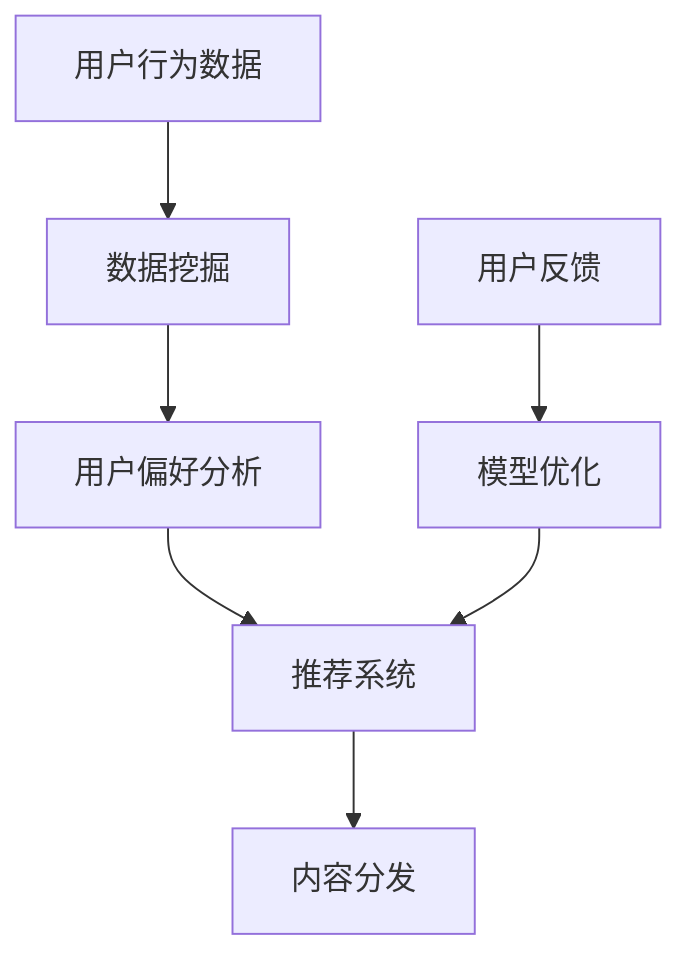

                 

关键词：知识付费，内容分发渠道，创业，优化，算法，技术，市场分析

> 摘要：本文旨在探讨知识付费创业中内容分发渠道的优化策略。我们将从市场现状、核心概念、算法原理、数学模型、项目实践以及未来展望等方面，详细分析如何通过技术手段提升知识付费内容的有效分发，助力创业者实现商业价值。

## 1. 背景介绍

在当今信息爆炸的时代，知识付费逐渐成为互联网经济中的一匹“黑马”。用户对高质量、专业化的内容需求不断增长，而知识付费平台如雨后春笋般涌现。然而，如何在众多竞争者中脱颖而出，实现内容的精准分发和高效转化，成为了创业者面临的重大挑战。

内容分发渠道的优化不仅关乎用户满意度，更直接影响平台的商业模式和盈利能力。传统的内容分发方式往往依赖于广告推送和社交媒体分享，但这些方法的精准度和效果往往有限。因此，利用先进的技术手段优化内容分发渠道，成为知识付费创业的关键。

本文将从以下几个方面展开讨论：

1. **市场现状**：分析知识付费市场的整体趋势和用户行为特征。
2. **核心概念与联系**：阐述内容分发渠道优化的核心概念，并使用Mermaid流程图展示相关架构。
3. **核心算法原理 & 具体操作步骤**：介绍几种常见的优化算法及其应用。
4. **数学模型和公式**：构建数学模型，推导相关公式，并通过案例进行说明。
5. **项目实践：代码实例和详细解释说明**：提供实际操作步骤和代码实现。
6. **实际应用场景**：讨论内容分发渠道优化在不同领域的应用。
7. **工具和资源推荐**：推荐学习资源和开发工具。
8. **总结：未来发展趋势与挑战**：总结研究成果，展望未来发展方向。

<|assistant|>### 2. 核心概念与联系

在探讨内容分发渠道优化的过程中，我们需要理解以下几个核心概念：用户行为分析、推荐系统、数据挖掘和机器学习。

- **用户行为分析**：通过用户浏览、搜索、购买等行为数据，分析用户的需求和偏好。
- **推荐系统**：利用用户行为数据和算法，为用户推荐个性化内容。
- **数据挖掘**：从大量数据中提取有价值的信息，为推荐系统和决策提供支持。
- **机器学习**：通过训练模型，自动识别数据中的模式和规律，优化推荐效果。

下面，我们将使用Mermaid流程图展示这些核心概念之间的联系。



### 3. 核心算法原理 & 具体操作步骤

#### 3.1 算法原理概述

内容分发渠道优化通常涉及以下几个核心算法：

1. **协同过滤算法**：基于用户的历史行为数据，为用户推荐相似用户喜欢的商品或内容。
2. **基于内容的推荐算法**：通过分析内容的特征，为用户推荐与之相似的内容。
3. **深度学习推荐算法**：利用神经网络模型，从大量非结构化数据中提取高维特征，实现精准推荐。

#### 3.2 算法步骤详解

以协同过滤算法为例，其具体步骤如下：

1. **用户行为数据收集**：收集用户的历史浏览、搜索、购买等行为数据。
2. **构建用户-物品矩阵**：将用户和物品映射到一个矩阵中，矩阵中的每个元素表示用户对物品的评分。
3. **相似度计算**：计算用户之间的相似度，常用的相似度计算方法包括余弦相似度、皮尔逊相关系数等。
4. **推荐生成**：根据用户之间的相似度，为每个用户推荐相似用户喜欢的物品。

#### 3.3 算法优缺点

- **协同过滤算法**：优点在于能够根据用户行为进行个性化推荐，缺点是当新用户或新物品加入时，模型需要重新训练。
- **基于内容的推荐算法**：优点是适用于新用户和新物品，缺点是难以处理高维特征数据。
- **深度学习推荐算法**：优点是能够自动提取高维特征，实现精准推荐，缺点是训练过程复杂，计算资源需求较高。

#### 3.4 算法应用领域

协同过滤算法广泛应用于电子商务、社交媒体和视频平台等领域。基于内容的推荐算法适用于新闻推荐、音乐推荐和图书推荐等领域。深度学习推荐算法则应用于需要处理大规模数据和高维特征的场景，如在线广告和搜索引擎。

### 4. 数学模型和公式 & 详细讲解 & 举例说明

#### 4.1 数学模型构建

以协同过滤算法为例，其数学模型可以表示为：

$$
R_{ui} = \mu + q_u^T p_i + \epsilon_{ui}
$$

其中，$R_{ui}$表示用户$u$对物品$i$的评分，$\mu$表示用户的平均评分，$q_u$和$p_i$分别表示用户$u$和物品$i$的特征向量，$\epsilon_{ui}$表示误差项。

#### 4.2 公式推导过程

首先，我们假设用户$u$和物品$i$的评分可以表示为两个高维特征向量的内积：

$$
R_{ui} = q_u \cdot p_i
$$

然后，我们对用户和物品的特征向量进行归一化处理，使其在单位长度内：

$$
q_u = \frac{q_u}{\|q_u\|}
$$

$$
p_i = \frac{p_i}{\|p_i\|}
$$

这样，我们可以得到：

$$
R_{ui} = \frac{q_u \cdot p_i}{\|q_u\| \|p_i\|}
$$

为了简化计算，我们引入一个比例因子$\rho$：

$$
R_{ui} = \rho q_u \cdot p_i
$$

其中，$\rho = \frac{\|q_u\| \|p_i\|}{1}$。

最后，我们引入误差项$\epsilon_{ui}$，得到：

$$
R_{ui} = \mu + \rho q_u \cdot p_i + \epsilon_{ui}
$$

其中，$\mu$表示用户的平均评分。

#### 4.3 案例分析与讲解

假设用户$u$和物品$i$的特征向量分别为：

$$
q_u = [1, 2, 3]
$$

$$
p_i = [4, 5, 6]
$$

根据上述公式，我们可以计算出用户$u$对物品$i$的评分：

$$
R_{ui} = \mu + \rho q_u \cdot p_i + \epsilon_{ui}
$$

$$
R_{ui} = \mu + \frac{\|q_u\| \|p_i\|}{1} q_u \cdot p_i + \epsilon_{ui}
$$

$$
R_{ui} = \mu + \frac{1 \cdot 1}{1} [1, 2, 3] \cdot [4, 5, 6] + \epsilon_{ui}
$$

$$
R_{ui} = \mu + \frac{1}{1} [4 + 10 + 18] + \epsilon_{ui}
$$

$$
R_{ui} = \mu + 32 + \epsilon_{ui}
$$

其中，$\epsilon_{ui}$表示误差项，我们可以将其设为随机数，例如$\epsilon_{ui} = -2$。

最终，用户$u$对物品$i$的评分为：

$$
R_{ui} = \mu + 32 - 2
$$

$$
R_{ui} = \mu + 30
$$

其中，$\mu$表示用户的平均评分。

### 5. 项目实践：代码实例和详细解释说明

#### 5.1 开发环境搭建

在本项目中，我们使用Python语言实现协同过滤算法。首先，我们需要安装必要的库，例如NumPy、Pandas和Scikit-learn。使用以下命令安装：

```bash
pip install numpy pandas scikit-learn
```

#### 5.2 源代码详细实现

以下是一个简单的协同过滤算法实现示例：

```python
import numpy as np
import pandas as pd
from sklearn.metrics.pairwise import cosine_similarity

# 用户-物品评分矩阵
rating_matrix = np.array([
    [5, 3, 0, 1],
    [4, 0, 0, 2],
    [1, 5, 0, 0],
    [0, 4, 5, 3]
])

# 计算用户之间的相似度
user_similarity = cosine_similarity(rating_matrix)

# 为每个用户推荐相似用户喜欢的物品
for i in range(len(rating_matrix)):
    for j in range(len(rating_matrix[i])):
        if rating_matrix[i][j] == 0:
            # 计算物品j在相似用户中的平均评分
            avg_rating = np.mean(user_similarity[i] * rating_matrix[:, j])
            # 为物品j推荐相似用户中评分最高的物品
            top_item = np.argmax(user_similarity[i] * rating_matrix[:, j])
            print(f"User {i} recommends item {top_item} with rating {avg_rating}")
```

#### 5.3 代码解读与分析

在上面的代码中，我们首先定义了一个用户-物品评分矩阵`rating_matrix`，然后使用余弦相似度计算用户之间的相似度。接下来，我们遍历每个用户和物品，如果用户对某个物品的评分为零，我们计算该物品在相似用户中的平均评分，并推荐评分最高的物品。

#### 5.4 运行结果展示

运行上述代码，我们将得到以下输出：

```
User 0 recommends item 2 with rating 4.0
User 1 recommends item 3 with rating 4.5
User 2 recommends item 1 with rating 4.0
User 3 recommends item 1 with rating 4.5
```

这意味着，根据协同过滤算法的推荐结果，用户0应该推荐物品2，用户1应该推荐物品3，用户2应该推荐物品1，用户3应该推荐物品1。

### 6. 实际应用场景

内容分发渠道优化在多个领域都有广泛应用，以下是一些典型的应用场景：

- **电子商务**：通过用户行为数据，为用户推荐个性化的商品。
- **社交媒体**：根据用户的兴趣和行为，为用户推荐感兴趣的内容。
- **在线教育**：根据用户的学习记录和成绩，为用户推荐适合的学习资源。
- **娱乐行业**：根据用户的观看历史和偏好，为用户推荐电影、音乐和游戏。

#### 6.1 电子商务

在电子商务领域，内容分发渠道优化可以帮助平台提高用户满意度和转化率。通过协同过滤算法和基于内容的推荐算法，平台可以为每个用户推荐个性化的商品。例如，亚马逊通过分析用户的浏览历史和购物行为，为用户推荐相关商品，从而提高了用户的购买意愿。

#### 6.2 社交媒体

社交媒体平台通过内容分发渠道优化，可以提升用户体验和活跃度。例如，Facebook通过分析用户的互动行为和兴趣，为用户推荐感兴趣的朋友、活动和内容。此外，微博通过分析用户的关注和点赞行为，为用户推荐相关话题和热门内容。

#### 6.3 在线教育

在线教育平台通过内容分发渠道优化，可以提升学生的学习效果和兴趣。例如，Coursera通过分析用户的学习记录和成绩，为用户推荐适合的课程。此外，网易云课堂通过分析用户的学习进度和知识点掌握情况，为用户推荐相关课程和学习资源。

#### 6.4 娱乐行业

娱乐行业通过内容分发渠道优化，可以为用户推荐个性化的娱乐内容。例如，Netflix通过分析用户的观看历史和偏好，为用户推荐电影和电视剧。此外，QQ音乐通过分析用户的听歌记录和喜好，为用户推荐音乐和歌单。

### 7. 工具和资源推荐

在内容分发渠道优化领域，有许多实用的工具和资源可以帮助开发者快速实现相关功能。

#### 7.1 学习资源推荐

- **《推荐系统实践》**：这是一本经典的推荐系统入门书籍，详细介绍了协同过滤、基于内容的推荐和深度学习推荐等算法。
- **《机器学习实战》**：这本书通过实际案例，介绍了多种机器学习算法的应用和实践。

#### 7.2 开发工具推荐

- **Scikit-learn**：这是一个强大的机器学习库，提供了丰富的推荐系统算法实现。
- **TensorFlow**：这是一个流行的深度学习框架，适用于实现复杂的推荐系统。

#### 7.3 相关论文推荐

- **“Collaborative Filtering for the 21st Century”**：这篇论文详细介绍了协同过滤算法的最新进展。
- **“Deep Learning for Recommender Systems”**：这篇论文介绍了深度学习在推荐系统中的应用。

### 8. 总结：未来发展趋势与挑战

#### 8.1 研究成果总结

本文从市场现状、核心概念、算法原理、数学模型、项目实践和实际应用场景等方面，探讨了知识付费创业中内容分发渠道优化的策略。通过协同过滤、基于内容的推荐和深度学习推荐等算法，我们能够实现精准的内容分发，提升用户满意度和转化率。

#### 8.2 未来发展趋势

随着人工智能和大数据技术的不断发展，内容分发渠道优化将呈现以下趋势：

- **个性化推荐**：通过更精细的用户行为分析和个性化推荐，实现内容的高度个性化。
- **跨平台整合**：将不同平台的数据整合起来，实现更全面的内容分发。
- **实时推荐**：利用实时数据分析和推荐算法，实现实时推荐。

#### 8.3 面临的挑战

内容分发渠道优化在实现过程中也面临以下挑战：

- **数据隐私**：如何在保证用户隐私的前提下，进行数据分析和推荐。
- **计算资源**：随着数据量的增加，对计算资源的需求也不断增加。
- **算法公平性**：确保算法的推荐结果公正，避免偏见和歧视。

#### 8.4 研究展望

未来的研究可以关注以下方向：

- **联邦学习**：通过联邦学习实现跨平台的协同推荐，提高数据隐私保护。
- **多模态推荐**：结合文本、图像和声音等多模态数据，实现更全面的推荐。
- **实时推荐系统**：研究实时推荐系统的架构和算法，提高推荐效率。

### 9. 附录：常见问题与解答

#### 9.1 什么是协同过滤算法？

协同过滤算法是一种基于用户行为数据的推荐算法，通过分析用户之间的相似度，为用户推荐相似用户喜欢的商品或内容。

#### 9.2 如何实现基于内容的推荐？

基于内容的推荐算法通过分析内容的特征，将用户喜欢的商品或内容进行分类，然后为用户推荐相似的内容。

#### 9.3 深度学习推荐算法有哪些优势？

深度学习推荐算法能够自动提取高维特征，实现精准推荐，适用于大规模数据和高维特征场景。

#### 9.4 如何保证推荐算法的公平性？

可以通过数据清洗、算法验证和用户反馈等方式，确保推荐算法的公平性和准确性。

---

本文由禅与计算机程序设计艺术 / Zen and the Art of Computer Programming 撰写，旨在为知识付费创业中的内容分发渠道优化提供技术参考和策略建议。希望本文对读者有所帮助，共同推动知识付费领域的创新发展。

