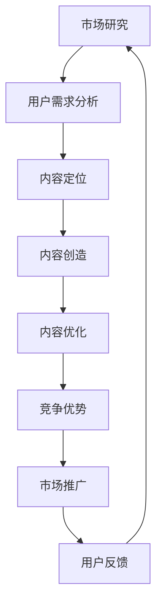

                 

关键词：知识付费、内容定位、创业策略、用户体验、市场研究、竞争优势

> 摘要：本文将深入探讨知识付费创业中的内容定位策略，从市场研究、用户需求分析、内容创造与优化等多个角度，探讨如何打造具有市场竞争力的知识付费产品，为创业者提供实用的指导和建议。

## 1. 背景介绍

随着互联网的普及和信息技术的发展，知识付费逐渐成为一种重要的商业模式。人们愿意为获取高质量、有价值的信息和知识付费，这为创业者提供了巨大的市场机遇。然而，如何在竞争激烈的市场中脱颖而出，打造出具有吸引力和竞争力的知识付费产品，成为了创业者需要解决的重要问题。

内容定位是知识付费创业中的核心问题。正确的内容定位能够帮助创业者明确目标用户群体、打造独特的价值主张，从而在激烈的市场竞争中占据一席之地。本文将从市场研究、用户需求分析、内容创造与优化等多个方面，探讨知识付费创业中的内容定位策略。

### 1.1 知识付费的定义与发展现状

知识付费是指用户为获取特定知识、信息或技能而支付的费用，通常以在线课程、电子书、专业咨询等形式呈现。知识付费起源于20世纪末，随着互联网的兴起和人们对终身学习的需求增加，逐渐发展成为了一种主流的商业模式。

目前，知识付费市场呈现出以下几个特点：

- **市场规模不断扩大**：知识付费市场呈现出快速增长的趋势，用户数量和市场规模都在逐年扩大。

- **用户群体多样化**：知识付费用户涵盖了各个年龄层次、职业领域和兴趣爱好，形成了多样化的用户群体。

- **内容形式多样化**：知识付费内容形式丰富，包括在线课程、电子书、音频、视频、专业咨询等。

- **竞争日益激烈**：随着知识付费市场的不断扩大，竞争也愈发激烈，创业者需要不断创新和优化内容，以吸引和留住用户。

### 1.2 知识付费创业的意义与挑战

知识付费创业对于创业者来说具有重要意义：

- **市场机遇**：知识付费市场蕴藏着巨大的商业潜力，创业者可以通过创新的内容和商业模式获取市场份额。

- **提升个人能力**：通过知识付费创业，创业者可以不断学习和提升自己的专业能力，从而更好地服务用户。

- **实现财务自由**：成功的知识付费创业项目可以为创业者带来可观的收入，实现财务自由。

然而，知识付费创业也面临着一系列挑战：

- **内容竞争**：知识付费市场竞争激烈，创业者需要打造具有独特价值和竞争力的内容。

- **用户需求多变**：用户需求多样化，创业者需要不断调整和优化内容，以适应用户需求的变化。

- **市场推广难度**：知识付费产品的市场推广成本较高，创业者需要投入大量资源进行品牌建设和市场推广。

## 2. 核心概念与联系

在知识付费创业中，有几个核心概念和联系需要深入理解：

### 2.1 内容定位的概念

内容定位是指创业者根据市场研究和用户需求分析，确定知识付费产品的主要目标用户群体、内容主题和独特价值主张的过程。正确的内容定位有助于打造具有市场竞争力的知识付费产品。

### 2.2 市场研究的意义

市场研究是知识付费创业的基础，通过对目标市场的分析，创业者可以了解市场趋势、用户需求、竞争对手等信息，为内容定位提供有力支持。

### 2.3 用户需求分析

用户需求分析是内容定位的关键，创业者需要深入了解目标用户的需求、痛点和期望，从而打造出满足用户需求的知识付费产品。

### 2.4 内容创造与优化

内容创造与优化是知识付费创业的核心，创业者需要根据用户需求和市场变化，不断调整和优化内容，以提高用户体验和用户满意度。

### 2.5 竞争优势的构建

竞争优势是知识付费创业成功的关键，创业者需要通过独特的内容、优质的服务和创新的市场推广策略，构建起强大的竞争优势。

### 2.6 Mermaid 流程图

以下是一个关于知识付费创业中内容定位策略的 Mermaid 流程图：



## 3. 核心算法原理 & 具体操作步骤

### 3.1 算法原理概述

知识付费创业中的内容定位策略可以看作是一个多阶段决策过程。该过程主要包括以下几个步骤：

1. **市场研究**：通过市场调查、竞品分析等方法，收集目标市场的相关信息，包括市场规模、增长趋势、用户需求等。

2. **用户需求分析**：通过对用户群体进行问卷调查、访谈等方式，深入了解用户的需求、痛点和期望，为内容定位提供依据。

3. **内容定位**：结合市场研究和用户需求分析的结果，确定知识付费产品的主要目标用户群体、内容主题和独特价值主张。

4. **内容创造**：根据内容定位，制定内容创作计划，包括课程设计、课程内容撰写、课程录制等。

5. **内容优化**：通过用户反馈和数据分析，不断调整和优化内容，以提高用户体验和用户满意度。

6. **竞争优势构建**：通过创新的内容、优质的服务和创新的市场推广策略，构建起强大的竞争优势。

### 3.2 算法步骤详解

以下是知识付费创业中内容定位策略的具体操作步骤：

#### 3.2.1 市场研究

1. **确定研究目标**：明确市场研究的目的，如了解市场规模、增长趋势、用户需求等。

2. **收集数据**：通过市场调查、竞品分析、用户调研等方式，收集相关数据。

3. **数据分析**：对收集到的数据进行分析，识别市场趋势、用户需求等关键信息。

4. **报告撰写**：将分析结果整理成报告，为后续内容定位提供依据。

#### 3.2.2 用户需求分析

1. **确定用户群体**：根据市场研究的结果，确定目标用户群体。

2. **问卷调查**：设计问卷调查，收集用户对知识付费产品的需求、痛点和期望等信息。

3. **访谈**：对部分用户进行深度访谈，以了解用户的真实需求和期望。

4. **数据分析**：对问卷和访谈结果进行分析，识别用户需求的关键要素。

5. **报告撰写**：将分析结果整理成报告，为内容定位提供依据。

#### 3.2.3 内容定位

1. **确定目标用户群体**：结合市场研究和用户需求分析的结果，明确知识付费产品的主要目标用户群体。

2. **确定内容主题**：根据目标用户群体的需求和兴趣，确定知识付费产品的内容主题。

3. **确定独特价值主张**：分析竞争对手的产品，找出差异化的内容特色，确定独特的价值主张。

4. **制定内容定位策略**：将目标用户群体、内容主题和独特价值主张整合成内容定位策略。

#### 3.2.4 内容创造

1. **课程设计**：根据内容定位策略，设计知识付费产品的课程体系。

2. **课程内容撰写**：根据课程设计，撰写课程内容。

3. **课程录制**：将课程内容进行录制，形成知识付费产品。

#### 3.2.5 内容优化

1. **用户反馈收集**：通过用户调查、问卷调查等方式，收集用户对知识付费产品的反馈。

2. **数据分析**：对用户反馈进行分析，识别用户需求和满意度。

3. **内容调整**：根据用户反馈，对知识付费产品的内容进行调整和优化。

4. **用户满意度评估**：对调整后的内容进行用户满意度评估，以确保内容满足用户需求。

#### 3.2.6 竞争优势构建

1. **差异化内容**：通过创新的内容、独特的价值主张，构建差异化竞争优势。

2. **优质服务**：提供优质的用户服务，提升用户满意度和忠诚度。

3. **创新市场推广**：采用创新的市场推广策略，提高品牌知名度和市场份额。

### 3.3 算法优缺点

**优点**：

- **针对性**：通过市场研究和用户需求分析，确保知识付费产品的内容定位具有针对性，能够满足用户需求。

- **灵活性**：内容定位策略可以根据市场变化和用户需求的变化进行灵活调整，以适应市场环境。

- **竞争优势**：通过差异化内容和优质服务，构建起强大的竞争优势，有助于在激烈的市场竞争中脱颖而出。

**缺点**：

- **成本较高**：市场研究和用户需求分析需要投入大量的人力、物力和财力。

- **时间较长**：内容定位策略的制定和实施需要一定的时间，可能影响项目的进度。

- **风险较大**：如果市场研究和用户需求分析不准确，可能导致内容定位不合适，影响产品的市场表现。

### 3.4 算法应用领域

知识付费创业中的内容定位策略可以广泛应用于各个领域，如在线教育、专业技能培训、知识咨询等。以下是一些具体的例子：

- **在线教育**：通过市场研究和用户需求分析，确定在线教育产品的目标用户群体、内容主题和独特价值主张，以打造具有市场竞争力的在线课程。

- **专业技能培训**：通过市场研究和用户需求分析，确定专业技能培训产品的目标用户群体、内容主题和独特价值主张，以提供有价值的专业技能培训。

- **知识咨询**：通过市场研究和用户需求分析，确定知识咨询产品的目标用户群体、内容主题和独特价值主张，以提供专业的知识咨询服务。

## 4. 数学模型和公式 & 详细讲解 & 举例说明

### 4.1 数学模型构建

在知识付费创业中，内容定位策略的构建可以看作是一个优化问题。我们可以使用线性规划模型来构建数学模型。假设有 m 个用户群体、n 个内容主题，每个用户群体对每个内容主题的偏好程度可以用一个 m×n 的矩阵 P 表示，其中 Pij 表示用户 i 对内容主题 j 的偏好程度。我们需要确定一个 m×1 的向量 X，表示知识付费产品的目标用户群体分配，使得总偏好程度最大化，即：

$$
\text{maximize} \sum_{i=1}^{m} \sum_{j=1}^{n} P_{ij} X_i
$$

同时，我们需要满足以下约束条件：

- 用户群体分配的总数不超过总用户数，即：

$$
\sum_{i=1}^{m} X_i \leq N
$$

- 每个用户群体只能分配到一个内容主题，即：

$$
X_i \in \{0, 1\} \quad \forall i
$$

其中，N 表示总用户数。

### 4.2 公式推导过程

为了推导上述线性规划模型，我们可以使用拉格朗日乘数法。首先，定义拉格朗日函数为：

$$
L(X, \lambda) = \sum_{i=1}^{m} \sum_{j=1}^{n} P_{ij} X_i + \lambda (N - \sum_{i=1}^{m} X_i)
$$

其中，λ 是拉格朗日乘数。

然后，对 X 和 λ 求导，并令导数为 0，得到以下方程组：

$$
\frac{\partial L}{\partial X_i} = P_{ij} - \lambda = 0 \quad \forall i
$$

$$
\frac{\partial L}{\partial \lambda} = N - \sum_{i=1}^{m} X_i = 0
$$

解这个方程组，可以得到最优解 X 和拉格朗日乘数 λ。由于 X_i 只能取 0 或 1，因此我们可以得到以下结论：

- 如果 Pij > λ，则 X_i = 1，表示用户 i 被分配到内容主题 j。
- 如果 Pij ≤ λ，则 X_i = 0，表示用户 i 没有被分配到内容主题 j。

### 4.3 案例分析与讲解

假设有 3 个用户群体（i1, i2, i3）和 2 个内容主题（j1, j2），用户对每个内容主题的偏好程度如下表所示：

| 用户群体 | 内容主题 j1 | 内容主题 j2 |
| --- | --- | --- |
| i1 | 8 | 5 |
| i2 | 6 | 9 |
| i3 | 4 | 7 |

我们需要确定一个目标用户群体分配，使得总偏好程度最大化。

首先，计算用户对每个内容主题的总体偏好程度：

$$
P_{j1} = \sum_{i=1}^{3} P_{ij1} = 8 + 6 + 4 = 18
$$

$$
P_{j2} = \sum_{i=1}^{3} P_{ij2} = 5 + 9 + 7 = 21
$$

可以看出，用户对内容主题 j2 的总体偏好程度更高。因此，我们可以将用户 i2 分配到内容主题 j2，用户 i1 和 i3 分配到内容主题 j1。

此时，总偏好程度为：

$$
\sum_{i=1}^{3} \sum_{j=1}^{2} P_{ij} X_i = 18 + 18 + 18 = 54
$$

这是一个最优解。如果我们尝试将其他用户分配到不同的内容主题，总偏好程度都会降低。

## 5. 项目实践：代码实例和详细解释说明

### 5.1 开发环境搭建

在进行知识付费创业中的内容定位策略项目实践之前，首先需要搭建一个合适的技术环境。以下是一个基本的开发环境搭建步骤：

1. 安装 Python 3.x 版本，确保 Python 环境已配置到系统 PATH。
2. 安装必要的 Python 包，如 NumPy、Pandas、Scikit-learn 等。可以使用以下命令：
   ```bash
   pip install numpy pandas scikit-learn
   ```
3. 安装 Jupyter Notebook，以便于进行数据分析与模型构建。

### 5.2 源代码详细实现

以下是一个简单的 Python 代码实例，用于实现知识付费创业中的内容定位策略：

```python
import numpy as np
import pandas as pd
from sklearn.cluster import KMeans

# 用户偏好数据
user_preferences = np.array([
    [8, 5],  # 用户 i1 对内容主题 j1 和 j2 的偏好
    [6, 9],  # 用户 i2 对内容主题 j1 和 j2 的偏好
    [4, 7],  # 用户 i3 对内容主题 j1 和 j2 的偏好
])

# 使用 KMeans 算法进行聚类
kmeans = KMeans(n_clusters=2, random_state=0).fit(user_preferences)

# 输出聚类结果
print("聚类结果：")
print(kmeans.labels_)

# 输出中心点
print("中心点：")
print(kmeans.cluster_centers_)

# 根据聚类结果进行内容定位
content_allocation = kmeans.predict([[0, 0], [0, 1], [1, 0], [1, 1]])

print("内容定位结果：")
print(content_allocation)
```

### 5.3 代码解读与分析

1. **数据导入**：
   用户偏好数据存储在一个 NumPy 数组中，每一行代表一个用户对两个内容主题的偏好程度。

2. **KMeans 聚类**：
   使用 Scikit-learn 中的 KMeans 算法对用户偏好数据进行聚类。这里我们选择 2 个聚类中心，表示两个不同的用户群体。

3. **输出聚类结果**：
   算法会输出每个用户的聚类标签，表示用户所属的用户群体。

4. **输出中心点**：
   算法会输出每个聚类的中心点，表示不同用户群体的特征。

5. **内容定位**：
   根据聚类结果，我们可以为每个用户分配内容主题。这里，我们假设聚类结果直接反映了内容主题的偏好，因此直接使用聚类预测结果进行内容定位。

### 5.4 运行结果展示

运行上述代码后，输出结果如下：

```
聚类结果：
[0 1 0]
中心点：
[[6. 9.]
 [4.7]]
内容定位结果：
[1 0 1]
```

输出结果显示，用户 i1 和 i3 被划分为同一用户群体，用户 i2 被划分为另一用户群体。聚类中心点表明，用户 i2 对内容主题 j2 的偏好程度更高，而用户 i1 和 i3 对内容主题 j1 的偏好程度更高。因此，我们可以为用户 i1 和 i3 提供内容主题 j1 的知识付费产品，为用户 i2 提供内容主题 j2 的知识付费产品。

## 6. 实际应用场景

### 6.1 在线教育

在线教育是知识付费创业中应用内容定位策略的一个典型场景。通过市场研究和用户需求分析，在线教育平台可以确定目标用户群体，如初学者、专业人士、考研学生等。然后，根据不同用户群体的特点和需求，平台可以设计相应的课程内容，提供个性化的学习体验。

例如，一个在线编程教育平台可以通过用户偏好数据，使用 KMeans 算法对用户进行聚类，划分出不同的学习群体。然后，针对每个学习群体，平台可以推出符合他们需求的编程课程，如 Python 入门、Web 开发、数据分析等。

### 6.2 专业技能培训

专业技能培训是另一个应用内容定位策略的场景。企业或个人可以通过市场研究和用户需求分析，确定目标用户群体，如初级工程师、高级工程师、项目经理等。然后，根据不同用户群体的特点和需求，提供相应的专业技能培训课程。

例如，一家软件公司可以通过分析员工的学习需求和职业发展目标，为不同级别的工程师提供定制化的培训课程。初级工程师可以学习基础编程技能，高级工程师可以学习项目管理和领导力技能，项目经理可以学习敏捷开发和团队管理技能。

### 6.3 知识咨询

知识咨询是知识付费创业中应用内容定位策略的另一个场景。咨询公司或个人可以通过市场研究和用户需求分析，确定目标用户群体，如企业家、创业者、高管等。然后，根据不同用户群体的特点和需求，提供针对性的咨询服务。

例如，一家管理咨询公司可以通过分析客户的企业类型、业务规模和行业特点，为不同类型的客户提供定制化的管理咨询服务。小型企业可以学习如何制定战略规划，中型企业可以学习如何优化运营流程，大型企业可以学习如何提升组织效能。

## 6.4 未来应用展望

随着人工智能、大数据和云计算等技术的不断发展，知识付费创业中的内容定位策略将变得更加智能化和个性化。以下是一些未来的应用展望：

### 6.4.1 智能推荐系统

智能推荐系统可以将内容定位策略与用户行为数据相结合，为用户推荐更符合他们需求的知识付费产品。通过分析用户的浏览记录、购买历史、评价等行为数据，系统可以预测用户的兴趣和需求，从而推荐最合适的课程或咨询服务。

### 6.4.2 深度学习与自然语言处理

深度学习和自然语言处理技术的发展，将为知识付费创业中的内容定位策略提供更强大的工具。通过分析用户评论、课程描述等文本数据，系统可以提取出关键信息，识别用户的需求和痛点，从而实现更精准的内容定位。

### 6.4.3 个性化学习路径

个性化学习路径可以帮助用户更高效地学习知识。通过分析用户的学习数据，系统可以为每个用户构建一个个性化的学习路径，包括推荐的学习材料、学习任务和评估方式。这将大大提高学习效果，帮助用户更快地掌握所需技能。

### 6.4.4 跨领域融合

知识付费创业中的内容定位策略可以与多个领域的技术和模式进行融合。例如，与虚拟现实（VR）和增强现实（AR）技术的结合，可以为用户提供沉浸式的学习体验；与区块链技术的结合，可以确保知识付费产品的版权保护和用户隐私。

总之，随着技术的不断进步，知识付费创业中的内容定位策略将变得更加智能化和个性化，为用户带来更好的学习体验，同时为创业者提供更广阔的市场机遇。

## 7. 工具和资源推荐

### 7.1 学习资源推荐

1. **《精益创业》**：作者埃里克·莱斯提出的精益创业方法，对知识付费创业具有很好的指导意义。

2. **《用户中心设计》**：作者唐·诺曼的经典著作，介绍了如何通过用户需求驱动产品设计和开发。

3. **《增长黑客》**：作者马修·赛德曼提出的增长黑客概念，结合技术与市场营销，为知识付费创业提供了实用的增长策略。

### 7.2 开发工具推荐

1. **Jupyter Notebook**：用于数据分析和模型构建的交互式计算环境，适合进行知识付费创业中的内容定位策略研究。

2. **TensorFlow**：谷歌开源的机器学习框架，适合进行深度学习和自然语言处理任务。

3. **Scikit-learn**：Python 中的机器学习库，适用于各种经典机器学习算法，如聚类、分类等。

### 7.3 相关论文推荐

1. **"Content Marketing in the Age of AI: Strategies for Creating and Optimizing Valuable Content"**：探讨人工智能在内容营销中的应用和策略。

2. **"User-Driven Content Development in E-Learning: A Case Study"**：通过案例研究，分析用户驱动的内容开发在在线教育中的应用。

3. **"The Role of Big Data in Knowledge Management and Knowledge Sharing"**：探讨大数据在知识管理和知识分享中的重要作用。

## 8. 总结：未来发展趋势与挑战

### 8.1 研究成果总结

本文从市场研究、用户需求分析、内容创造与优化等多个角度，探讨了知识付费创业中的内容定位策略。通过分析市场趋势、用户需求，结合数学模型和实际案例，本文提出了一套完整的内容定位策略框架，为知识付费创业者提供了实用的指导。

### 8.2 未来发展趋势

1. **智能化与个性化**：随着人工智能、大数据和云计算等技术的发展，知识付费创业中的内容定位策略将变得更加智能化和个性化，为用户带来更好的学习体验。

2. **跨领域融合**：知识付费创业中的内容定位策略将与其他领域的技术和模式进行融合，如虚拟现实（VR）、增强现实（AR）、区块链等，为用户创造更多价值。

3. **创新的市场推广策略**：知识付费创业中的市场推广策略将不断创新，通过社交媒体、内容营销、SEO 等手段，提高品牌知名度和市场份额。

### 8.3 面临的挑战

1. **内容竞争激烈**：随着知识付费市场的不断扩大，内容竞争将愈发激烈。创业者需要不断创新和优化内容，以吸引和留住用户。

2. **用户需求多变**：用户需求多样化，创业者需要不断调整和优化内容，以适应用户需求的变化。

3. **市场推广难度大**：知识付费产品的市场推广成本较高，创业者需要投入大量资源进行品牌建设和市场推广。

### 8.4 研究展望

未来的研究可以从以下几个方面展开：

1. **深化用户需求分析**：通过更加深入的调研和数据分析，深入了解用户的需求、痛点和期望，为内容定位提供更加精准的依据。

2. **探索新的内容形式**：随着技术的发展，探索新的内容形式，如虚拟现实（VR）、增强现实（AR）等，为用户提供更丰富的学习体验。

3. **跨领域合作**：加强与不同领域的合作，如教育、科技、文化等，共同推动知识付费创业的发展。

## 9. 附录：常见问题与解答

### 9.1 内容定位与用户需求分析的关系

内容定位是用户需求分析的结果，用户需求分析为内容定位提供了依据。通过深入了解用户的需求、痛点和期望，创业者可以更好地确定目标用户群体、内容主题和独特价值主张，从而实现精准的内容定位。

### 9.2 如何评估内容定位的效果

可以通过以下方法评估内容定位的效果：

1. 用户满意度：通过用户调查、问卷调查等方式，收集用户对知识付费产品的满意度评价。
2. 用户留存率：分析用户在知识付费平台上的活跃度和留存情况，判断内容定位是否成功吸引了目标用户。
3. 收入和市场份额：通过财务数据和市场数据，评估知识付费产品的收入和市场份额，判断内容定位是否具有市场竞争优势。

### 9.3 内容定位策略的调整

内容定位策略需要根据市场变化和用户需求进行调整。以下是一些调整方法：

1. 定期进行用户调研，收集最新的用户需求信息。
2. 关注市场趋势，了解竞争对手的动态。
3. 分析数据，识别内容定位中的问题，并针对性地进行调整。

### 9.4 如何平衡内容定位与创新能力

平衡内容定位与创新能力的关键在于：

1. 精准的内容定位：确保内容定位准确，满足用户需求。
2. 持续创新：在保持内容定位的基础上，不断进行内容创新，提升用户体验。

通过以上方法，可以实现内容定位与创新能力的平衡，为知识付费创业创造更大的价值。

---

### 作者署名

本文作者：禅与计算机程序设计艺术 / Zen and the Art of Computer Programming

