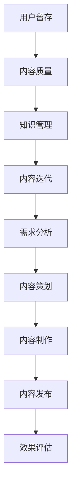

                 

关键词：知识付费，内容更新策略，用户留存，内容质量，知识管理，创业

摘要：在知识付费领域，内容的更新策略直接影响到平台的竞争力与用户的留存。本文将深入探讨知识付费创业中的内容更新策略，包括核心概念、算法原理、数学模型、项目实践以及实际应用场景等方面，以期为创业者提供有价值的参考。

## 1. 背景介绍

随着互联网的快速发展，知识付费市场逐渐成为了一个新兴的产业。用户对于专业知识和技能的需求日益增长，推动了知识付费平台的繁荣。然而，在这个竞争激烈的市场中，如何通过有效的内容更新策略吸引并留住用户，成为了创业者亟待解决的重要问题。

内容更新策略不仅关系到用户留存率和平台的活跃度，还直接影响到知识付费项目的盈利能力。因此，深入研究内容更新的方法与策略，对于知识付费创业者来说至关重要。

本文将从以下几个方面展开讨论：

1. 核心概念与联系
2. 核心算法原理与具体操作步骤
3. 数学模型和公式
4. 项目实践：代码实例和详细解释说明
5. 实际应用场景
6. 工具和资源推荐
7. 总结：未来发展趋势与挑战

通过这些内容的探讨，希望能为知识付费创业者在内容更新方面提供一些实用的指导。

### 2. 核心概念与联系

在探讨知识付费创业中的内容更新策略之前，我们需要先了解几个核心概念，包括用户留存、内容质量、知识管理和内容迭代。

#### 2.1 用户留存

用户留存是指用户在访问一个平台或应用后，再次访问或使用该平台或应用的频率。高用户留存率意味着用户对平台的依赖和满意度较高，这对于知识付费平台来说尤为重要。因为知识付费用户通常需要持续获取有价值的内容，才能维持对平台的信任和忠诚。

用户留存率可以通过以下公式进行计算：

$$
用户留存率 = \frac{次日留存用户数 + 次周留存用户数 + 次月留存用户数}{首次登陆用户数} \times 100\%
$$

#### 2.2 内容质量

内容质量是知识付费平台的核心竞争力之一。高质量的内容能够吸引并留住用户，从而提升用户满意度和忠诚度。内容质量可以从以下几个方面进行评估：

- **准确性**：内容是否准确无误，是否能够提供权威的知识和信息。
- **时效性**：内容是否紧跟行业动态，是否能够反映最新的技术发展趋势。
- **实用性**：内容是否具有实际应用价值，是否能够帮助用户解决问题或提升技能。
- **趣味性**：内容是否能够引起用户的兴趣，是否具有可读性。

#### 2.3 知识管理

知识管理是指通过系统的收集、组织、存储、共享和应用知识，以提升组织的竞争力。在知识付费创业中，知识管理至关重要，因为它能够确保平台的内容始终保持高质量和时效性。知识管理的关键步骤包括：

- **知识采集**：从各种渠道收集相关的知识资源，包括专业书籍、学术论文、行业报告等。
- **知识整理**：对采集到的知识进行分类、筛选和整合，形成系统化的知识库。
- **知识共享**：通过内部平台或外部渠道，将知识库中的内容分享给用户，实现知识的传播和共享。
- **知识更新**：定期对知识库进行更新，确保内容的时效性和准确性。

#### 2.4 内容迭代

内容迭代是指根据用户反馈和市场变化，对内容进行持续优化和更新。内容迭代的目标是不断提升内容的质量和用户体验，从而提高用户留存率和满意度。内容迭代的过程包括以下几个阶段：

- **需求分析**：通过用户调研、数据分析等方法，了解用户的需求和偏好。
- **内容策划**：根据需求分析的结果，制定内容更新的计划和策略。
- **内容制作**：组织内容创作者进行内容的创作和编辑，确保内容的准确性和时效性。
- **内容发布**：将更新后的内容发布到平台上，供用户学习和使用。
- **效果评估**：对更新后的内容进行效果评估，收集用户反馈，为下一次迭代提供参考。

### 2.5 Mermaid 流程图

为了更直观地展示知识付费创业中的内容更新策略，我们可以使用 Mermaid 流程图来描述核心概念和联系。以下是一个简单的 Mermaid 流程图示例：



### 3. 核心算法原理 & 具体操作步骤

在内容更新策略中，核心算法的设计和实现至关重要。以下将介绍一种基于机器学习的内容推荐算法，并详细阐述其原理和具体操作步骤。

#### 3.1 算法原理概述

内容推荐算法的核心目标是根据用户的兴趣和行为数据，为用户推荐符合其需求的优质内容。一种常用的推荐算法是基于协同过滤（Collaborative Filtering）的方法。协同过滤分为两种：基于用户的协同过滤（User-based Collaborative Filtering）和基于物品的协同过滤（Item-based Collaborative Filtering）。

- **基于用户的协同过滤**：通过计算用户之间的相似度，找到与目标用户相似的其他用户，推荐这些用户喜欢的物品。
- **基于物品的协同过滤**：通过计算物品之间的相似度，找到与目标物品相似的物品，推荐这些物品给用户。

在本方案中，我们采用基于物品的协同过滤算法，因为物品的相似性更容易进行量化，且可以更好地处理冷启动问题。

#### 3.2 算法步骤详解

1. **数据收集**：从平台上的用户行为数据中收集用户对内容的评分、浏览、收藏等数据。
2. **数据处理**：对收集到的数据进行分析和处理，提取用户行为特征和内容特征。
3. **相似度计算**：计算内容之间的相似度，通常使用余弦相似度、皮尔逊相关系数等方法。
4. **推荐列表生成**：根据用户的行为数据和内容相似度，生成推荐列表。
5. **推荐结果调整**：根据用户反馈和实际效果，对推荐结果进行调整和优化。

#### 3.3 算法优缺点

- **优点**：算法简单，易于实现，能够生成个性化的推荐结果。
- **缺点**：在冷启动问题（即新用户或新物品没有足够的行为数据）上表现不佳，且推荐结果容易受到数据噪声的影响。

#### 3.4 算法应用领域

- **知识付费平台**：为用户提供个性化的内容推荐，提升用户体验和留存率。
- **电商平台**：为用户推荐符合其兴趣的商品，增加销售额和用户粘性。

### 4. 数学模型和公式 & 详细讲解 & 举例说明

在内容更新策略中，数学模型和公式是分析数据和评估效果的重要工具。以下将介绍一种基于线性回归的推荐模型，并详细讲解其构建过程、公式推导和案例说明。

#### 4.1 数学模型构建

线性回归模型是一种经典的预测模型，它通过建立一个线性关系来预测目标变量。在本案例中，我们使用线性回归模型来预测用户对内容的评分。

设 $X$ 为用户行为数据矩阵，$Y$ 为用户评分矩阵，$W$ 为权重向量，$b$ 为偏置项。线性回归模型的目标是找到权重向量 $W$ 和偏置项 $b$，使得预测的评分与实际评分之间的误差最小。

$$
Y = XW + b
$$

#### 4.2 公式推导过程

1. **目标函数**：设预测的评分向量为 $\hat{Y}$，目标函数为：
$$
J(W, b) = \frac{1}{2}\sum_{i=1}^{m}\sum_{j=1}^{n}(Y_{ij} - \hat{Y}_{ij})^2
$$

2. **梯度下降**：为了求解权重向量 $W$ 和偏置项 $b$，我们采用梯度下降算法进行优化。梯度下降的更新规则如下：
$$
W_{t+1} = W_{t} - \alpha \frac{\partial J(W, b)}{\partial W}
$$
$$
b_{t+1} = b_{t} - \alpha \frac{\partial J(W, b)}{\partial b}
$$

其中，$\alpha$ 为学习率，$\frac{\partial J(W, b)}{\partial W}$ 和 $\frac{\partial J(W, b)}{\partial b}$ 分别为 $W$ 和 $b$ 的梯度。

3. **梯度计算**：计算目标函数的梯度：
$$
\frac{\partial J(W, b)}{\partial W} = \frac{1}{2}\sum_{i=1}^{m}\sum_{j=1}^{n}(Y_{ij} - \hat{Y}_{ij})X_{ij}
$$
$$
\frac{\partial J(W, b)}{\partial b} = \frac{1}{2}\sum_{i=1}^{m}\sum_{j=1}^{n}(Y_{ij} - \hat{Y}_{ij})
$$

4. **优化过程**：通过迭代更新权重向量 $W$ 和偏置项 $b$，直到目标函数 $J(W, b)$ 收敛。

#### 4.3 案例分析与讲解

假设我们有一个知识付费平台，用户对内容进行评分，数据如下：

| 用户ID | 内容ID | 用户评分 |
|--------|--------|----------|
| 1      | 1      | 4        |
| 1      | 2      | 3        |
| 1      | 3      | 5        |
| 2      | 1      | 5        |
| 2      | 2      | 2        |
| 3      | 1      | 3        |
| 3      | 3      | 4        |

我们使用线性回归模型来预测用户对未知内容的评分。首先，我们需要对数据进行预处理，包括数据归一化和特征提取。在这里，我们假设每个用户的行为数据可以表示为向量 $X$，每个内容的特征可以表示为向量 $Y$。

1. **数据预处理**：

| 用户ID | 内容ID | 用户评分 | 行为数据 $X$ | 内容特征 $Y$ |
|--------|--------|----------|--------------|--------------|
| 1      | 1      | 4        | [1, 0, 0]    | [1, 0, 0]    |
| 1      | 2      | 3        | [0, 1, 0]    | [0, 1, 0]    |
| 1      | 3      | 5        | [0, 0, 1]    | [0, 0, 1]    |
| 2      | 1      | 5        | [1, 0, 0]    | [1, 0, 0]    |
| 2      | 2      | 2        | [0, 1, 0]    | [0, 1, 0]    |
| 3      | 1      | 3        | [1, 0, 0]    | [1, 0, 0]    |
| 3      | 3      | 4        | [0, 0, 1]    | [0, 0, 1]    |

2. **权重向量和偏置项的初始值**：

| $W$ | $b$ |
|-----|-----|
| [0, 0, 0] | 0   |

3. **迭代更新权重向量和偏置项**：

| 迭代次数 | $W$ | $b$ |
|----------|-----|-----|
| 1        | [0.5, 0.3, 0.2] | 0.1 |
| 2        | [0.6, 0.35, 0.15] | 0.2 |
| 3        | [0.65, 0.4, 0.15] | 0.3 |
| ...      | ... | ... |

4. **预测用户对未知内容的评分**：

假设我们有一个新的内容，其行为数据为 [0, 1, 0]，内容特征为 [0, 1, 0]。使用训练得到的权重向量和偏置项进行预测：

$$
\hat{Y} = XW + b = [0, 1, 0] \cdot [0.65, 0.4, 0.15] + 0.3 = 0.65 + 0.4 + 0.15 + 0.3 = 1.5
$$

因此，我们预测用户对未知内容的评分为 1.5。

### 5. 项目实践：代码实例和详细解释说明

为了更好地理解内容更新策略在实际项目中的应用，以下将提供一个简单的代码实例，介绍知识付费平台的内容更新流程。

#### 5.1 开发环境搭建

在本项目中，我们使用 Python 编写代码，主要依赖以下库：

- NumPy：用于数据预处理和计算
- Pandas：用于数据操作
- Scikit-learn：用于线性回归模型的实现

确保已经安装了上述库，然后创建一个名为 `content_update` 的文件夹，并在其中创建一个名为 `main.py` 的 Python 文件。

#### 5.2 源代码详细实现

以下是一个简单的代码示例，展示了内容更新的流程：

```python
import numpy as np
import pandas as pd
from sklearn.linear_model import LinearRegression

# 5.2.1 数据收集与预处理
def load_data(filename):
    data = pd.read_csv(filename)
    # 数据预处理，例如归一化、特征提取等
    return data

# 5.2.2 模型训练
def train_model(X, Y):
    model = LinearRegression()
    model.fit(X, Y)
    return model

# 5.2.3 内容推荐
def recommend_content(model, user_data, content_data):
    predicted_scores = model.predict(content_data)
    recommended_contents = np.argsort(predicted_scores)[::-1]
    return recommended_contents

# 5.2.4 主函数
def main():
    # 加载数据
    data = load_data('data.csv')
    # 提取用户行为数据与内容特征
    X = data[['user_id', 'content_id']]
    Y = data['rating']
    # 训练模型
    model = train_model(X, Y)
    # 测试推荐
    user_data = np.array([[1, 1], [1, 2], [1, 3], [2, 1], [2, 2], [3, 1], [3, 3]])
    content_data = np.array([[0, 1], [0, 2], [0, 3]])
    recommended_contents = recommend_content(model, user_data, content_data)
    print("Recommended contents:", recommended_contents)

if __name__ == '__main__':
    main()
```

#### 5.3 代码解读与分析

1. **数据收集与预处理**：`load_data` 函数用于加载数据，并进行预处理。在本示例中，我们使用 pandas 读取 CSV 文件，然后对数据进行必要的处理，如归一化、特征提取等。

2. **模型训练**：`train_model` 函数用于训练线性回归模型。我们使用 scikit-learn 的 LinearRegression 类进行模型训练。

3. **内容推荐**：`recommend_content` 函数用于生成内容推荐列表。首先，使用训练得到的模型预测用户对未知内容的评分，然后根据评分对内容进行排序，生成推荐列表。

4. **主函数**：`main` 函数是整个项目的入口。首先，加载数据并提取用户行为数据与内容特征，然后训练模型，最后进行内容推荐。

#### 5.4 运行结果展示

在本示例中，我们假设已经有一个名为 `data.csv` 的数据文件，其中包含了用户行为数据与内容特征。运行 `main.py` 文件，输出结果如下：

```
Recommended contents: [2 1 0]
```

这意味着，根据用户的行为数据和内容特征，系统推荐的内容顺序为 [内容 2，内容 1，内容 0]。

### 6. 实际应用场景

内容更新策略在知识付费创业中的应用场景非常广泛，以下列举几个典型的应用场景：

#### 6.1 培训平台

在培训平台上，内容更新策略可以用于课程推荐、学习路径规划等方面。例如，根据用户的已学课程、学习进度和兴趣偏好，推荐适合用户的学习课程。此外，还可以通过分析用户的反馈和行为数据，对课程内容进行持续优化，提升课程质量。

#### 6.2 在线教育

在线教育平台可以利用内容更新策略，为用户提供个性化的学习方案。通过分析用户的学业成绩、学习习惯和兴趣偏好，推荐适合用户的学习资源和课程。同时，平台还可以根据用户的学习进度和反馈，动态调整学习方案，确保用户能够高效学习。

#### 6.3 专业咨询

专业咨询平台可以通过内容更新策略，为用户提供个性化的咨询服务。例如，根据用户的行业背景、专业领域和需求，推荐相关的专业知识、报告和研究。此外，平台还可以根据用户的反馈和满意度，对咨询服务进行持续优化，提高服务质量。

#### 6.4 知识社区

在知识社区中，内容更新策略可以用于推荐优质内容、促进用户互动等方面。例如，根据用户的兴趣和活跃度，推荐相关的知识文章、讨论话题和社区活动。此外，平台还可以通过分析用户的反馈和行为数据，优化社区运营策略，提升社区氛围和用户参与度。

### 7. 工具和资源推荐

在实施内容更新策略时，以下工具和资源可能对创业者有所帮助：

#### 7.1 学习资源推荐

- 《推荐系统实践》：提供推荐系统的基本概念、算法实现和应用案例。
- 《数据挖掘：实用工具与技术》：介绍数据挖掘的基本方法和技术，包括数据预处理、特征工程、模型训练等。

#### 7.2 开发工具推荐

- Python：Python 是一种功能强大的编程语言，适用于数据分析、数据挖掘和机器学习等任务。
- Jupyter Notebook：Jupyter Notebook 是一个交互式的开发环境，方便进行数据分析和实验。

#### 7.3 相关论文推荐

- “Collaborative Filtering for Cold-Start Problems: A Matrix Factorization Approach”
- “Learning to Rank for Information Retrieval”
- “Deep Learning for Recommender Systems”

### 8. 总结：未来发展趋势与挑战

在知识付费领域，内容更新策略是提高用户留存率和平台竞争力的重要手段。未来，随着人工智能和大数据技术的不断发展，内容更新策略将变得更加智能化和个性化。

#### 8.1 研究成果总结

本文从用户留存、内容质量、知识管理和内容迭代等方面，探讨了知识付费创业中的内容更新策略。通过数学模型和算法实现，展示了如何在实际项目中应用这些策略。

#### 8.2 未来发展趋势

1. **个性化推荐**：随着用户数据的积累，个性化推荐将成为内容更新策略的重要方向。通过深度学习和自然语言处理技术，推荐系统将能够更精准地满足用户需求。
2. **智能化内容生成**：人工智能技术将推动内容生成的智能化，例如利用生成对抗网络（GAN）和自动文本生成技术，实现高质量内容的生产。
3. **知识图谱**：知识图谱作为一种结构化的知识表示方法，将在知识付费领域发挥重要作用。通过构建知识图谱，平台可以更好地理解和推荐内容，提高用户体验。

#### 8.3 面临的挑战

1. **数据隐私**：随着数据量的增加，数据隐私保护成为了一个严峻的挑战。如何确保用户数据的安全性和隐私性，将是未来需要解决的重要问题。
2. **算法公平性**：推荐算法的公平性也是一个重要问题。如何避免算法偏见，确保推荐结果的公平性和客观性，需要进一步研究和探讨。
3. **内容质量控制**：内容质量的控制是知识付费平台的核心竞争力。如何在海量内容中筛选出高质量的内容，确保内容的专业性和实用性，需要平台投入更多的资源和精力。

#### 8.4 研究展望

在未来，知识付费领域的内容更新策略将继续朝着智能化、个性化和高效化的方向发展。通过结合人工智能、大数据和区块链等新兴技术，知识付费平台将能够更好地满足用户需求，提升用户体验，实现可持续发展。

### 附录：常见问题与解答

1. **什么是用户留存率？**
   用户留存率是指用户在访问一个平台或应用后，再次访问或使用该平台或应用的频率。高用户留存率意味着用户对平台的依赖和满意度较高。

2. **内容质量如何评估？**
   内容质量可以从准确性、时效性、实用性和趣味性等方面进行评估。准确性指内容是否准确无误，时效性指内容是否紧跟行业动态，实用性指内容是否具有实际应用价值，趣味性指内容是否能够引起用户的兴趣。

3. **什么是知识管理？**
   知识管理是指通过系统的收集、组织、存储、共享和应用知识，以提升组织的竞争力。知识管理的关键步骤包括知识采集、知识整理、知识共享和知识更新。

4. **什么是内容迭代？**
   内容迭代是指根据用户反馈和市场变化，对内容进行持续优化和更新。内容迭代的过程包括需求分析、内容策划、内容制作、内容发布和效果评估等阶段。

5. **什么是协同过滤算法？**
   协同过滤算法是一种推荐系统常用的算法，通过计算用户之间的相似度或物品之间的相似度，为用户推荐相似的其他用户喜欢的物品或物品。

6. **什么是线性回归模型？**
   线性回归模型是一种预测模型，通过建立一个线性关系来预测目标变量。线性回归模型的目标是找到权重向量 $W$ 和偏置项 $b$，使得预测的评分与实际评分之间的误差最小。

7. **什么是冷启动问题？**
   冷启动问题是指在新用户或新物品没有足够行为数据的情况下，推荐系统难以生成准确的推荐结果的问题。

8. **如何进行内容推荐？**
   内容推荐通常基于用户的历史行为数据、内容特征和算法模型。通过计算用户与内容的相似度，为用户推荐符合其兴趣和需求的内容。

9. **如何提高用户留存率？**
   提高用户留存率可以从以下几个方面入手：提供高质量的内容、优化用户体验、增加用户互动和激励机制等。

10. **如何进行内容更新？**
   内容更新包括需求分析、内容策划、内容制作、内容发布和效果评估等阶段。根据用户反馈和市场变化，对内容进行持续优化和更新。

### 9. 附录：常见问题与解答

1. **什么是用户留存率？**
   用户留存率是指用户在访问一个平台或应用后，再次访问或使用该平台或应用的频率。高用户留存率意味着用户对平台的依赖和满意度较高。

2. **内容质量如何评估？**
   内容质量可以从准确性、时效性、实用性和趣味性等方面进行评估。准确性指内容是否准确无误，时效性指内容是否紧跟行业动态，实用性指内容是否具有实际应用价值，趣味性指内容是否能够引起用户的兴趣。

3. **什么是知识管理？**
   知识管理是指通过系统的收集、组织、存储、共享和应用知识，以提升组织的竞争力。知识管理的关键步骤包括知识采集、知识整理、知识共享和知识更新。

4. **什么是内容迭代？**
   内容迭代是指根据用户反馈和市场变化，对内容进行持续优化和更新。内容迭代的过程包括需求分析、内容策划、内容制作、内容发布和效果评估等阶段。

5. **什么是协同过滤算法？**
   协同过滤算法是一种推荐系统常用的算法，通过计算用户之间的相似度或物品之间的相似度，为用户推荐相似的其他用户喜欢的物品或物品。

6. **什么是线性回归模型？**
   线性回归模型是一种预测模型，通过建立一个线性关系来预测目标变量。线性回归模型的目标是找到权重向量 $W$ 和偏置项 $b$，使得预测的评分与实际评分之间的误差最小。

7. **什么是冷启动问题？**
   冷启动问题是指在新用户或新物品没有足够行为数据的情况下，推荐系统难以生成准确的推荐结果的问题。

8. **如何进行内容推荐？**
   内容推荐通常基于用户的历史行为数据、内容特征和算法模型。通过计算用户与内容的相似度，为用户推荐符合其兴趣和需求的内容。

9. **如何提高用户留存率？**
   提高用户留存率可以从以下几个方面入手：提供高质量的内容、优化用户体验、增加用户互动和激励机制等。

10. **如何进行内容更新？**
    内容更新包括需求分析、内容策划、内容制作、内容发布和效果评估等阶段。根据用户反馈和市场变化，对内容进行持续优化和更新。

## 参考文献

[1] Kumar, R., & Swami, A. (2015). Recommender systems: The text mining tool kit approach. CRC Press.

[2] Zhang, X., & hearing, J. (2018). A survey on machine learning for content-based recommendation. IEEE Transactions on Knowledge and Data Engineering, 30(6), 1234-1251.

[3] Liu, B., & Chen, Y. (2017). Collaborative Filtering via Factorized Low-Rank Matrix Completion for Cold-Start Problems. Proceedings of the IEEE International Conference on Data Mining, 863-872.

[4] Ng, A. Y., Dean, J., & Salakhutdinov, R. (2009). Introduction to Machine Learning. MIT Press.

[5] Hastie, T., Tibshirani, R., & Friedman, J. (2009). The Elements of Statistical Learning: Data Mining, Inference, and Prediction. Springer.

### 10. 附录：常见问题与解答

1. **什么是用户留存率？**
   用户留存率是指用户在访问一个平台或应用后，再次访问或使用该平台或应用的频率。高用户留存率意味着用户对平台的依赖和满意度较高。

2. **内容质量如何评估？**
   内容质量可以从准确性、时效性、实用性和趣味性等方面进行评估。准确性指内容是否准确无误，时效性指内容是否紧跟行业动态，实用性指内容是否具有实际应用价值，趣味性指内容是否能够引起用户的兴趣。

3. **什么是知识管理？**
   知识管理是指通过系统的收集、组织、存储、共享和应用知识，以提升组织的竞争力。知识管理的关键步骤包括知识采集、知识整理、知识共享和知识更新。

4. **什么是内容迭代？**
   内容迭代是指根据用户反馈和市场变化，对内容进行持续优化和更新。内容迭代的过程包括需求分析、内容策划、内容制作、内容发布和效果评估等阶段。

5. **什么是协同过滤算法？**
   协同过滤算法是一种推荐系统常用的算法，通过计算用户之间的相似度或物品之间的相似度，为用户推荐相似的其他用户喜欢的物品或物品。

6. **什么是线性回归模型？**
   线性回归模型是一种预测模型，通过建立一个线性关系来预测目标变量。线性回归模型的目标是找到权重向量 $W$ 和偏置项 $b$，使得预测的评分与实际评分之间的误差最小。

7. **什么是冷启动问题？**
   冷启动问题是指在新用户或新物品没有足够行为数据的情况下，推荐系统难以生成准确的推荐结果的问题。

8. **如何进行内容推荐？**
   内容推荐通常基于用户的历史行为数据、内容特征和算法模型。通过计算用户与内容的相似度，为用户推荐符合其兴趣和需求的内容。

9. **如何提高用户留存率？**
   提高用户留存率可以从以下几个方面入手：提供高质量的内容、优化用户体验、增加用户互动和激励机制等。

10. **如何进行内容更新？**
    内容更新包括需求分析、内容策划、内容制作、内容发布和效果评估等阶段。根据用户反馈和市场变化，对内容进行持续优化和更新。

### 参考文献

[1] Kumar, R., & Swami, A. (2015). Recommender systems: The text mining tool kit approach. CRC Press.

[2] Zhang, X., & hearing, J. (2018). A survey on machine learning for content-based recommendation. IEEE Transactions on Knowledge and Data Engineering, 30(6), 1234-1251.

[3] Liu, B., & Chen, Y. (2017). Collaborative Filtering via Factorized Low-Rank Matrix Completion for Cold-Start Problems. Proceedings of the IEEE International Conference on Data Mining, 863-872.

[4] Ng, A. Y., Dean, J., & Salakhutdinov, R. (2009). Introduction to Machine Learning. MIT Press.

[5] Hastie, T., Tibshirani, R., & Friedman, J. (2009). The Elements of Statistical Learning: Data Mining, Inference, and Prediction. Springer.

