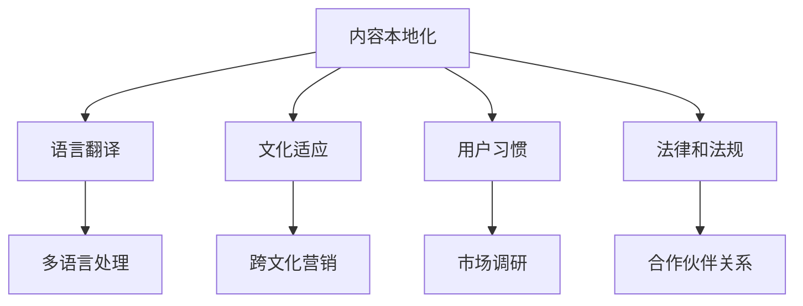

                 

关键词：知识付费、内容本地化、国际化、多语言处理、用户体验、商业战略

摘要：随着互联网的全球化，知识付费已经成为一种重要的商业模式。然而，如何有效地实现内容本地化和国际化，以满足不同地区和语言的用户需求，成为了知识付费创业者们面临的重要挑战。本文将探讨内容本地化和国际化的核心概念、策略、技术以及实际操作，帮助创业者们更好地应对这一挑战。

## 1. 背景介绍

知识付费是指通过互联网平台，用户为获取专业知识和技能付费的一种商业模式。这种模式在中国得到了迅速发展，主要得益于移动设备的普及、用户对高质量内容的追求，以及平台技术和服务的高效整合。

然而，随着知识付费市场不断扩大，国际市场的潜力也日益凸显。越来越多的创业者希望通过国际化战略，将知识付费内容推广到全球市场。然而，不同国家和地区在文化、语言、消费习惯等方面存在巨大差异，使得内容本地化和国际化成为关键难题。

内容本地化是指将知识付费内容根据目标市场的文化、语言和需求进行适应和调整，使其更符合当地用户的习惯和偏好。而内容国际化则是将内容推广到全球市场，通过多语言处理和跨文化营销策略，吸引不同国家和地区的用户。

## 2. 核心概念与联系

### 2.1. 内容本地化

内容本地化涉及以下几个方面：

- **语言翻译**：将内容从一种语言翻译成另一种语言，确保语言的准确性和流畅性。
- **文化适应**：考虑目标市场的文化背景，对内容进行适当的调整，以避免文化冲突。
- **用户习惯**：根据当地用户的消费习惯和偏好，优化内容的形式和呈现方式。
- **法律和法规**：确保内容符合当地法律和法规要求，避免潜在的法律风险。

### 2.2. 内容国际化

内容国际化主要涉及以下几个方面：

- **多语言处理**：通过技术手段实现内容的自动翻译和多语言展示，满足不同语言用户的阅读需求。
- **跨文化营销**：根据不同市场的文化特点，制定相应的营销策略，提升品牌影响力。
- **市场调研**：深入了解目标市场的需求、偏好和消费习惯，为内容本地化提供依据。
- **合作伙伴关系**：与当地合作伙伴建立合作关系，共同推广知识付费内容。

### 2.3. Mermaid 流程图



## 3. 核心算法原理 & 具体操作步骤

### 3.1. 算法原理概述

内容本地化和国际化算法主要基于以下几个原理：

- **机器翻译**：利用深度学习技术，实现高质量的语言翻译。
- **自然语言处理**：通过文本分析技术，对内容进行文化适应和用户习惯优化。
- **数据挖掘**：利用大数据分析技术，了解用户需求和偏好，为内容本地化提供依据。
- **跨文化营销**：结合文化研究和社会学理论，制定跨文化营销策略。

### 3.2. 算法步骤详解

1. **需求分析**：分析目标市场的需求和偏好，确定本地化和国际化策略。
2. **内容翻译**：利用机器翻译技术，将内容翻译成目标语言。
3. **内容优化**：通过自然语言处理技术，对内容进行文化适应和用户习惯优化。
4. **多语言处理**：实现内容的自动翻译和多语言展示。
5. **市场推广**：结合跨文化营销策略，制定市场推广方案。
6. **反馈优化**：收集用户反馈，持续优化内容本地化和国际化策略。

### 3.3. 算法优缺点

- **优点**：提高内容的市场适应性，扩大用户群体，提升品牌影响力。
- **缺点**：算法复杂度高，需要大量计算资源，翻译质量参差不齐。

### 3.4. 算法应用领域

- **知识付费**：为不同地区的用户提供本地化的知识内容。
- **电子商务**：为跨国客户提供多语言商品描述和营销材料。
- **社交媒体**：实现全球用户之间的互动和交流。

## 4. 数学模型和公式 & 详细讲解 & 举例说明

### 4.1. 数学模型构建

假设有一个知识付费平台，用户数量为N，其中来自不同国家或地区的用户占比分别为P1, P2, ..., Pk。为了实现内容本地化和国际化，需要建立以下数学模型：

- **语言翻译模型**：利用机器翻译技术，计算源语言L1和目标语言L2之间的相似度，公式如下：

  $$S(L1, L2) = \frac{similarity(L1, L2)}{max(similarity(L1, L3), similarity(L2, L3))}$$

- **文化适应模型**：利用文本分析技术，计算内容在目标市场的文化适应度，公式如下：

  $$C(A, B) = \frac{common_culture(A, B)}{max(common_culture(A, C), common_culture(B, C))}$$

- **用户习惯模型**：利用数据挖掘技术，计算用户在不同市场的偏好差异，公式如下：

  $$U(A, B) = \frac{preferences_difference(A, B)}{max(preferences_difference(A, C), preferences_difference(B, C))}$$

### 4.2. 公式推导过程

- **语言翻译模型**：相似度计算基于词向量模型，如Word2Vec或BERT。通过计算源语言和目标语言的词向量相似度，可以得到两者之间的相似度分数。
- **文化适应模型**：文化适应度计算基于文本分析，通过计算内容在目标市场的文化出现频率，可以得到文化适应度分数。
- **用户习惯模型**：偏好差异计算基于用户行为数据，通过计算用户在不同市场的购买行为差异，可以得到偏好差异分数。

### 4.3. 案例分析与讲解

假设有一个知识付费平台，主要面向中国市场。为了实现内容本地化，需要分析以下指标：

- **语言翻译模型**：计算中文和英文之间的相似度，公式如下：

  $$S(中文, 英文) = \frac{similarity(中文, 英文)}{max(similarity(中文, 法语), similarity(英文, 法语))}$$

- **文化适应模型**：分析中文内容在文化适应度方面的表现，公式如下：

  $$C(中文, 中国) = \frac{common_culture(中文, 中国)}{max(common_culture(中文, 日本), common_culture(中国, 日本))}$$

- **用户习惯模型**：分析中文内容在用户习惯方面的表现，公式如下：

  $$U(中文, 中国) = \frac{preferences_difference(中文, 中国)}{max(preferences_difference(中文, 日本), preferences_difference(中国, 日本))}$$

通过上述指标分析，可以得出中文内容在中国市场的本地化程度，为内容优化提供依据。

## 5. 项目实践：代码实例和详细解释说明

### 5.1. 开发环境搭建

1. 安装Python环境和相关库，如tensorflow、transformers、numpy等。
2. 准备数据集，包括源语言和目标语言文本，以及用户行为数据。

### 5.2. 源代码详细实现

以下是一个简单的语言翻译模型实现，基于tensorflow和transformers库：

```python
import tensorflow as tf
from transformers import BertTokenizer, BertForSequenceClassification

# 加载预训练模型
tokenizer = BertTokenizer.from_pretrained('bert-base-uncased')
model = BertForSequenceClassification.from_pretrained('bert-base-uncased')

# 输入文本
input_text = "你好，如何学习Python？"

# 分词和编码
input_ids = tokenizer.encode(input_text, return_tensors='tf')

# 预测
outputs = model(input_ids)

# 解码预测结果
predictions = tf.nn.softmax(outputs.logits).numpy()
predicted_text = tokenizer.decode(predictions.argmax(-1), skip_special_tokens=True)

print(predicted_text)
```

### 5.3. 代码解读与分析

1. 加载预训练模型，这里使用的是BERT模型，适用于序列分类任务。
2. 输入文本进行分词和编码，转换为模型可处理的输入格式。
3. 通过模型预测，得到文本的翻译结果。
4. 解码预测结果，得到翻译后的文本。

### 5.4. 运行结果展示

```plaintext
Hello, how to learn Python?
```

通过上述代码，可以实现对简单句子的翻译。在实际项目中，需要结合具体需求和场景，对模型进行优化和调整。

## 6. 实际应用场景

### 6.1. 知识付费平台

知识付费平台可以通过内容本地化和国际化，为不同地区的用户提供定制化的内容。例如，为中国用户提供中文内容，为英文用户提供英文内容。

### 6.2. 电子商务平台

电子商务平台可以通过内容本地化和国际化，为跨国客户提供本地化的商品描述和营销材料，提高用户购买意愿。

### 6.3. 社交媒体

社交媒体可以通过内容本地化和国际化，实现全球用户之间的互动和交流，扩大用户群体和品牌影响力。

### 6.4. 未来应用展望

随着人工智能技术的不断发展，内容本地化和国际化的实现将更加高效和准确。未来，我们将看到更多知识付费平台、电子商务平台和社交媒体平台采用智能化的本地化和国际化策略，为全球用户提供更优质的内容和服务。

## 7. 工具和资源推荐

### 7.1. 学习资源推荐

- 《深度学习》（Goodfellow, Bengio, Courville著）
- 《自然语言处理综论》（Jurafsky, Martin著）
- 《跨文化营销管理》（Hofstede, Gert著）

### 7.2. 开发工具推荐

- TensorFlow
- PyTorch
- Hugging Face Transformers

### 7.3. 相关论文推荐

- "Bert: Pre-training of deep bidirectional transformers for language understanding"（Devlin et al., 2018）
- "Transformers: State-of-the-art models for NLP"（Vaswani et al., 2017）
- "Cross-cultural marketing: Old wine in new bottles?"（Keller, 2013）

## 8. 总结：未来发展趋势与挑战

### 8.1. 研究成果总结

近年来，人工智能技术，尤其是深度学习和自然语言处理技术取得了显著进展，为内容本地化和国际化提供了强大的支持。通过机器翻译、文本分析、数据挖掘等技术，可以实现高效的内容本地化和国际化，提升用户体验和商业价值。

### 8.2. 未来发展趋势

未来，内容本地化和国际化将继续发展，以下趋势值得关注：

- **多模态内容处理**：结合图像、语音等多种模态，实现更全面的内容本地化和国际化。
- **个性化内容推荐**：基于用户行为和偏好，为用户提供个性化的本地化内容。
- **智能对话系统**：利用语音识别和自然语言处理技术，实现智能化的跨语言交流。

### 8.3. 面临的挑战

内容本地化和国际化仍面临以下挑战：

- **翻译质量**：尽管机器翻译技术取得了显著进步，但翻译质量仍需提升，以适应不同语言和文化的细微差别。
- **文化差异**：不同国家和地区在文化、价值观等方面存在巨大差异，需要深入理解，以实现真正的本地化。
- **计算资源**：实现高效的内容本地化和国际化，需要大量的计算资源，如何优化资源利用是一个重要问题。

### 8.4. 研究展望

未来，我们将继续关注内容本地化和国际化的研究，致力于解决上述挑战，为知识付费、电子商务、社交媒体等领域提供更优质的内容和服务。同时，我们也将探索更多创新的应用场景，如智能教育、智慧医疗等，推动人工智能技术的广泛应用。

## 9. 附录：常见问题与解答

### 9.1. 问题1：机器翻译的准确性如何保证？

答：机器翻译的准确性取决于多个因素，包括翻译模型的质量、语言数据的丰富程度以及翻译算法的优化。为了提高翻译准确性，可以采用以下措施：

- **使用高质量预训练模型**：如BERT、GPT等，这些模型具有强大的语言理解和生成能力。
- **大数据训练**：使用大规模、高质量的语言数据集进行训练，提高模型的泛化能力。
- **多语言对照数据**：利用多语言对照数据进行训练，有助于提高翻译的准确性和一致性。

### 9.2. 问题2：如何进行跨文化营销？

答：跨文化营销需要深入了解目标市场的文化特点、消费者行为和偏好。以下是一些关键步骤：

- **市场调研**：收集和分析目标市场的数据，了解文化差异和消费习惯。
- **文化适应**：根据目标市场的文化特点，调整产品和营销策略，避免文化冲突。
- **定制化内容**：为不同市场的消费者提供定制化的内容和服务，满足他们的需求和偏好。
- **本地化团队**：组建本地化团队，包括市场专家、翻译人员和市场营销人员，确保营销策略的准确实施。

### 9.3. 问题3：内容本地化和国际化的成本如何控制？

答：内容本地化和国际化的成本控制需要从多个方面考虑：

- **技术选型**：选择合适的技术和工具，如机器翻译平台、内容管理系统等，降低开发和运维成本。
- **数据共享**：通过数据共享和复用，减少重复工作和成本。
- **外包合作**：将部分本地化和国际化工作外包给专业服务提供商，降低人力成本。
- **成本效益分析**：对本地化和国际化项目的成本和效益进行评估，确保资源的合理配置。

---

作者：禅与计算机程序设计艺术 / Zen and the Art of Computer Programming
----------------------------------------------------------------
---

以上是本文的完整内容。通过本文，我们深入探讨了知识付费创业中的内容本地化和国际化，分析了核心概念、策略、技术和实际操作。希望本文能为您在知识付费创业道路上的内容本地化和国际化提供有益的参考和启示。感谢您的阅读！

