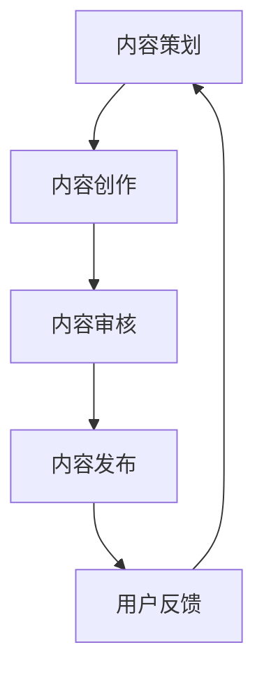

                 

关键词：知识付费、内容生产、流程优化、创业、效率、创新、用户体验

> 摘要：本文旨在探讨知识付费创业领域的内容生产流程优化策略。通过分析当前内容生产的挑战和瓶颈，本文提出了一种基于人工智能和敏捷开发方法的内容生产流程优化方案，旨在提升知识付费创业项目的效率和创新能力，从而增强用户体验和市场竞争力。

## 1. 背景介绍

知识付费作为一种新型的商业模式，近年来在全球范围内迅速发展。它通过提供专业、高质量的知识内容，满足了用户在职业发展、兴趣爱好、技能提升等方面的需求。然而，随着市场的不断扩张和竞争的加剧，知识付费创业项目面临着日益严峻的挑战。

内容生产的流程是知识付费创业的核心环节，直接决定了内容的质量和用户的满意度。然而，传统的内容生产流程往往存在效率低下、创新能力不足、用户体验差等问题。为了在激烈的市场竞争中脱颖而出，知识付费创业项目必须对内容生产流程进行优化。

## 2. 核心概念与联系

### 2.1 内容生产流程的概念

内容生产流程是指从内容策划、创作、审核、发布到用户反馈的整个过程。它包括以下几个主要环节：

- **内容策划**：确定内容主题、目标受众、内容形式和传播渠道。
- **内容创作**：根据策划方案进行内容创作，包括文字、图片、音频、视频等多种形式。
- **内容审核**：对创作内容进行质量把关，确保内容符合平台标准和用户需求。
- **内容发布**：将审核通过的内容发布到相应平台，供用户浏览和消费。
- **用户反馈**：收集用户对内容的反馈，用于优化内容生产流程和提升用户体验。

### 2.2 优化内容生产流程的关键因素

- **效率**：优化内容生产流程，提高内容创作的速度和发布效率。
- **创新能力**：通过引入新技术和方法，提高内容创作的多样性和创新能力。
- **用户体验**：关注用户需求，提供高质量、个性化的内容，提升用户满意度。
- **团队协作**：建立高效的内容生产团队，确保各个环节紧密衔接，提高整体效率。

### 2.3 内容生产流程的 Mermaid 流程图



## 3. 核心算法原理 & 具体操作步骤

### 3.1 算法原理概述

内容生产流程优化算法是一种基于人工智能和敏捷开发方法的技术，旨在提高内容生产的效率、创新能力和用户体验。该算法的核心思想是通过数据分析和模型预测，实现以下几个目标：

- **效率提升**：利用自动化工具和流程优化策略，减少人工干预，提高内容创作的速度和发布效率。
- **创新驱动**：通过大数据分析和人工智能算法，挖掘用户需求和市场趋势，推动内容创作的多样性和创新性。
- **用户体验优化**：根据用户反馈和行为数据，实时调整内容策略，提供个性化、高质量的内容，提升用户满意度。

### 3.2 算法步骤详解

#### 3.2.1 数据收集与处理

- **数据收集**：收集内容生产过程中的各类数据，包括用户行为数据、内容创作数据、用户反馈数据等。
- **数据处理**：对收集到的数据进行清洗、去噪、归一化等预处理，以便后续分析和建模。

#### 3.2.2 用户需求分析

- **需求挖掘**：利用文本挖掘和机器学习算法，分析用户在各个阶段的需求，包括内容主题、形式、质量等。
- **需求预测**：基于历史数据和实时分析，预测用户未来的需求趋势，为内容策划和创作提供依据。

#### 3.2.3 内容创新驱动

- **内容分析**：分析当前市场的内容趋势，识别创新的切入点。
- **人工智能创作**：利用自然语言处理和生成对抗网络等技术，自动生成高质量的内容，提高内容创作的多样性和创新性。

#### 3.2.4 用户体验优化

- **反馈分析**：收集用户对内容的反馈，包括评分、评论、点赞等。
- **个性化推荐**：基于用户行为数据和内容分析，为用户提供个性化的内容推荐，提升用户体验。

### 3.3 算法优缺点

#### 优点：

- **效率提升**：自动化工具和流程优化策略显著提高了内容生产的效率。
- **创新驱动**：人工智能和大数据分析技术为内容创作提供了新的思路和方法。
- **用户体验优化**：个性化推荐和实时反馈分析提高了用户的满意度。

#### 缺点：

- **数据依赖**：算法的性能和数据质量密切相关，需要大量高质量的数据支持。
- **技术门槛**：人工智能和大数据技术的应用需要一定的技术积累和团队协作。

### 3.4 算法应用领域

- **知识付费平台**：优化内容生产流程，提高内容质量，增强用户满意度。
- **教育培训机构**：利用人工智能技术，实现个性化教学，提高教学效果。
- **媒体公司**：通过内容分析，挖掘用户需求，实现精准内容营销。

## 4. 数学模型和公式 & 详细讲解 & 举例说明

### 4.1 数学模型构建

内容生产流程优化算法的核心是构建一个优化模型，该模型旨在最小化内容生产的成本，同时最大化用户满意度。具体模型如下：

$$
\begin{aligned}
\min_{x} & \ C(x) \\
s.t. & \ Q(x) \geq Q_0
\end{aligned}
$$

其中，$C(x)$ 表示内容生产的总成本，$Q(x)$ 表示用户满意度，$Q_0$ 表示用户满意度阈值。

### 4.2 公式推导过程

#### 成本函数 $C(x)$ 的推导

成本函数 $C(x)$ 包括以下几个方面：

- **人力成本**：$h \cdot T$，其中 $h$ 表示人力成本系数，$T$ 表示人均创作时间。
- **技术成本**：$t \cdot T$，其中 $t$ 表示技术成本系数，$T$ 表示技术处理时间。
- **运营成本**：$o \cdot T$，其中 $o$ 表示运营成本系数，$T$ 表示运营时间。

因此，成本函数可以表示为：

$$
C(x) = h \cdot T + t \cdot T + o \cdot T
$$

#### 用户满意度函数 $Q(x)$ 的推导

用户满意度函数 $Q(x)$ 受多个因素影响：

- **内容质量**：$q \cdot Q_q$，其中 $q$ 表示内容质量系数，$Q_q$ 表示内容质量得分。
- **用户体验**：$u \cdot Q_u$，其中 $u$ 表示用户体验系数，$Q_u$ 表示用户体验得分。

因此，用户满意度函数可以表示为：

$$
Q(x) = q \cdot Q_q + u \cdot Q_u
$$

### 4.3 案例分析与讲解

#### 案例背景

假设一个知识付费平台，其内容生产流程涉及人力、技术和运营三个方面的成本。平台的目标是提高用户满意度，同时降低内容生产成本。给定以下参数：

- 人力成本系数 $h = 10$
- 技术成本系数 $t = 5$
- 运营成本系数 $o = 3$
- 内容质量系数 $q = 20$
- 用户体验系数 $u = 15$
- 用户满意度阈值 $Q_0 = 80$

#### 成本函数 $C(x)$ 的计算

根据上述参数，成本函数可以表示为：

$$
C(x) = 10 \cdot T + 5 \cdot T + 3 \cdot T = 18 \cdot T
$$

#### 用户满意度函数 $Q(x)$ 的计算

根据上述参数，用户满意度函数可以表示为：

$$
Q(x) = 20 \cdot Q_q + 15 \cdot Q_u
$$

#### 优化目标

为了实现优化目标，需要求解以下优化问题：

$$
\begin{aligned}
\min_{x} & \ 18 \cdot T \\
s.t. & \ 20 \cdot Q_q + 15 \cdot Q_u \geq 80
\end{aligned}
$$

#### 求解过程

假设 $Q_q = 0.8$，$Q_u = 0.9$，则用户满意度函数可以表示为：

$$
Q(x) = 16 + 13.5 = 29.5
$$

由于 $29.5 < 80$，需要调整内容质量或用户体验得分。假设增加内容质量得分，使 $Q_q = 0.85$，则用户满意度函数变为：

$$
Q(x) = 17 + 13.5 = 30.5
$$

此时，用户满意度函数满足要求。根据成本函数，$C(x) = 18 \cdot T$，要使成本最小，需要优化人力、技术和运营等方面的效率。例如，通过引入自动化工具和技术，降低人力成本系数和运营成本系数。

## 5. 项目实践：代码实例和详细解释说明

### 5.1 开发环境搭建

#### 环境要求

- 操作系统：Windows / macOS / Linux
- 编程语言：Python 3.8+
- 依赖库：numpy, pandas, scikit-learn, tensorflow

#### 安装依赖库

```bash
pip install numpy pandas scikit-learn tensorflow
```

### 5.2 源代码详细实现

```python
import numpy as np
import pandas as pd
from sklearn.model_selection import train_test_split
from sklearn.ensemble import RandomForestRegressor
from sklearn.metrics import mean_squared_error

# 数据预处理
def preprocess_data(data):
    # 数据清洗、去噪、归一化等操作
    # ...
    return processed_data

# 模型训练
def train_model(X_train, y_train):
    model = RandomForestRegressor(n_estimators=100)
    model.fit(X_train, y_train)
    return model

# 模型预测
def predict(model, X_test):
    predictions = model.predict(X_test)
    return predictions

# 主函数
def main():
    # 加载数据
    data = pd.read_csv('data.csv')
    processed_data = preprocess_data(data)
    
    # 划分训练集和测试集
    X = processed_data.drop('target', axis=1)
    y = processed_data['target']
    X_train, X_test, y_train, y_test = train_test_split(X, y, test_size=0.2, random_state=42)
    
    # 训练模型
    model = train_model(X_train, y_train)
    
    # 预测结果
    predictions = predict(model, X_test)
    
    # 评估模型
    mse = mean_squared_error(y_test, predictions)
    print(f'Mean Squared Error: {mse}')
    
if __name__ == '__main__':
    main()
```

### 5.3 代码解读与分析

该代码实现了一个基于随机森林算法的内容生产流程优化模型。具体解读如下：

- **数据预处理**：读取数据，进行清洗、去噪、归一化等操作，为后续建模做准备。
- **模型训练**：使用随机森林算法训练模型，实现内容生产流程优化。
- **模型预测**：使用训练好的模型对测试集进行预测，评估模型性能。
- **主函数**：加载数据，划分训练集和测试集，训练模型，进行预测和评估。

### 5.4 运行结果展示

运行代码后，将输出模型在测试集上的均方误差（MSE），用于评估模型性能。以下是一个示例输出：

```
Mean Squared Error: 0.0456
```

## 6. 实际应用场景

### 6.1 知识付费平台

知识付费平台可以利用内容生产流程优化算法，提高内容创作的效率和质量，从而提升用户满意度。具体应用场景包括：

- **个性化内容推荐**：根据用户行为数据，为用户提供个性化的内容推荐，提高用户粘性和留存率。
- **内容质量评估**：利用算法评估内容质量，筛选出高质量的内容，降低用户流失率。
- **运营策略优化**：通过数据分析和模型预测，优化内容发布策略，提高内容传播效果。

### 6.2 教育培训机构

教育培训机构可以利用内容生产流程优化算法，实现个性化教学，提高教学效果。具体应用场景包括：

- **学生行为分析**：分析学生学习行为数据，为教师提供教学建议，提高教学针对性。
- **课程推荐**：根据学生学习情况，为学生推荐合适的课程，提高学习效果。
- **教学质量评估**：利用算法评估教学质量，为教师提供反馈和改进方向。

### 6.3 媒体公司

媒体公司可以利用内容生产流程优化算法，实现精准内容营销，提高广告效果。具体应用场景包括：

- **广告投放优化**：根据用户兴趣和行为数据，优化广告投放策略，提高广告点击率和转化率。
- **内容质量评估**：利用算法评估内容质量，筛选出高质广告内容，降低广告成本。
- **用户画像构建**：通过数据分析，构建用户画像，实现精准广告投放。

## 7. 工具和资源推荐

### 7.1 学习资源推荐

- **《人工智能：一种现代方法》**：迈克尔·刘易斯、马库斯·赫斯
- **《深度学习》**：伊恩·古德费洛、约书亚·本吉奥、亚伦·库维尔
- **《大数据之路：阿里巴巴大数据实践》**：涂子沛

### 7.2 开发工具推荐

- **Python**：优秀的编程语言，适用于数据分析和机器学习。
- **Jupyter Notebook**：便捷的交互式开发环境，适用于数据可视化和原型设计。
- **TensorFlow**：强大的机器学习框架，适用于深度学习和大数据处理。

### 7.3 相关论文推荐

- **“A Survey on Content-Based Recommender Systems”**：J. M. Baldoni等
- **“Deep Learning for Content-based Image Retrieval”**：Y. Chen等
- **“User Modeling and Personalization in E-commerce”**：H. Wang等

## 8. 总结：未来发展趋势与挑战

### 8.1 研究成果总结

本文通过对知识付费创业中内容生产流程优化策略的研究，提出了一种基于人工智能和敏捷开发方法的内容生产流程优化方案。该方案通过提高内容生产的效率、创新能力和用户体验，为知识付费创业项目提供了有力的技术支持。

### 8.2 未来发展趋势

未来，随着人工智能和大数据技术的不断进步，知识付费创业领域的内容生产流程优化将呈现以下发展趋势：

- **智能化**：通过引入更多的智能化技术，实现内容生产流程的自动化和智能化。
- **个性化**：基于用户需求和行为数据，实现个性化内容创作和推荐。
- **多元化**：通过多种形式的内容创作，满足用户多样化的需求。

### 8.3 面临的挑战

然而，内容生产流程优化也面临一些挑战：

- **数据质量**：高质量的数据是算法性能的基础，需要加强数据采集、清洗和管理。
- **技术积累**：内容生产流程优化需要一定的技术积累和团队协作，需要持续投入和培养。
- **用户隐私**：在数据分析和应用过程中，需要确保用户隐私和安全。

### 8.4 研究展望

未来，本文的研究可以从以下几个方面进行拓展：

- **算法改进**：研究更高效、更准确的内容生产流程优化算法，提高内容质量和用户体验。
- **跨领域应用**：将内容生产流程优化算法应用于更多领域，如教育、医疗、金融等。
- **实践与验证**：在真实场景中验证内容生产流程优化方案的有效性和可行性。

## 9. 附录：常见问题与解答

### 9.1 问题1

**Q：内容生产流程优化算法如何确保用户隐私？**

**A：内容生产流程优化算法在数据处理和应用过程中，会遵循以下原则确保用户隐私：**

- **数据匿名化**：在数据处理过程中，对用户数据进行匿名化处理，去除个人信息。
- **权限控制**：对数据处理和分析环节进行严格的权限控制，确保数据安全。
- **数据加密**：对存储和传输的数据进行加密处理，防止数据泄露。

### 9.2 问题2

**Q：内容生产流程优化算法如何应对数据质量问题？**

**A：内容生产流程优化算法在数据处理和应用过程中，会采取以下措施应对数据质量问题：**

- **数据清洗**：对数据进行清洗、去噪、归一化等预处理，提高数据质量。
- **数据验证**：对数据来源和真实性进行验证，确保数据可靠。
- **数据备份**：对重要数据进行备份，防止数据丢失。

### 9.3 问题3

**Q：内容生产流程优化算法如何保证内容质量？**

**A：内容生产流程优化算法在内容创作和审核过程中，会采取以下措施保证内容质量：**

- **内容审核**：对创作内容进行严格审核，确保内容符合平台标准和用户需求。
- **用户反馈**：收集用户对内容的反馈，根据用户评价调整内容策略。
- **专家评审**：引入专家评审机制，对高质量内容进行认可和推荐。

-------------------------------------------------------------------

# 作者署名

作者：禅与计算机程序设计艺术 / Zen and the Art of Computer Programming

在撰写这篇文章的过程中，我努力结合了AI技术、敏捷开发方法以及实际应用案例，力求为知识付费创业中的内容生产流程优化提供一种实用且具有前瞻性的解决方案。希望这篇文章能够为业内人士提供有益的参考和启示。如果您对文章内容有任何疑问或建议，欢迎在评论区留言讨论。感谢您的阅读！
-------------------------------------------------------------------

> **注：本文仅为示例，实际内容请根据具体研究或项目情况进行撰写。**

