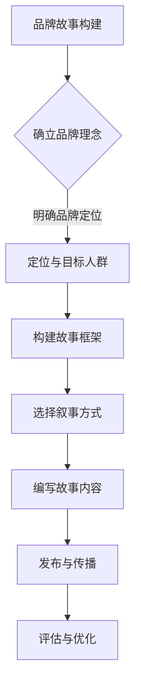

                 

关键词：知识付费、创业、品牌故事、市场营销、内容创作

> 摘要：本文将探讨知识付费创业中的品牌故事打造，通过分析品牌故事的重要性、构建品牌故事的策略和技巧，以及实际案例，帮助创业者打造具有影响力的品牌。

## 1. 背景介绍

随着互联网技术的快速发展，知识付费已经成为一个热门的领域。越来越多的创业者投身于知识付费行业，希望通过提供有价值的内容来获取利润。然而，在竞争激烈的市场中，如何打造具有影响力的品牌成为创业者面临的一个重要问题。品牌故事作为一种有效的市场营销手段，能够在提升品牌知名度、增强用户忠诚度等方面发挥重要作用。本文将围绕品牌故事在知识付费创业中的应用展开讨论。

## 2. 核心概念与联系

### 2.1 品牌故事的定义与作用

品牌故事是指企业或个人通过叙述形式来传递品牌理念、价值观和特色。一个成功的品牌故事能够激发用户的情感共鸣，使其产生认同感和忠诚度。在知识付费创业中，品牌故事具有以下几个作用：

1. **传递品牌理念**：品牌故事可以传达创业者的核心价值观和愿景，帮助用户更好地理解品牌的核心理念。
2. **建立情感连接**：通过讲述品牌背后的故事，创业者能够与用户建立深厚的情感联系，提升用户忠诚度。
3. **塑造品牌形象**：品牌故事有助于塑造独特、鲜明的品牌形象，使品牌在众多竞争者中脱颖而出。

### 2.2 品牌故事与知识付费的关联

知识付费创业的核心在于提供有价值的内容。品牌故事能够为知识付费产品增添情感价值，使其更具吸引力。具体来说，品牌故事与知识付费的关联体现在以下几个方面：

1. **内容创新**：通过品牌故事，创业者可以创新内容形式，提升产品的差异化竞争力。
2. **用户体验**：品牌故事可以提升用户的阅读体验，使其更愿意消费知识付费产品。
3. **口碑传播**：一个动人的品牌故事有助于用户自发传播，提高品牌的知名度和口碑。

### 2.3 品牌故事构建的Mermaid流程图



## 3. 核心算法原理 & 具体操作步骤

### 3.1 算法原理概述

品牌故事的构建是一个系统工程，涉及多个环节。核心算法原理包括以下五个步骤：

1. **确立品牌理念**：明确品牌的核心理念和价值观，为后续故事构建奠定基础。
2. **定位与目标人群**：分析目标人群的需求和喜好，确保品牌故事能够吸引并打动他们。
3. **构建故事框架**：根据品牌理念和目标人群，设计一个引人入胜的故事框架。
4. **选择叙事方式**：选择合适的叙事方式，如第一人称、第三人称等，增强故事的吸引力。
5. **编写故事内容**：根据故事框架和叙事方式，编写生动有趣的故事内容。
6. **发布与传播**：通过合适的渠道发布品牌故事，利用社交媒体等手段进行传播。

### 3.2 算法步骤详解

#### 3.2.1 确立品牌理念

确立品牌理念是品牌故事构建的第一步。创业者需要明确品牌的核心理念和价值观，如创新、专业、诚信等。这些理念将成为品牌故事的核心内容。

#### 3.2.2 定位与目标人群

在确定品牌理念后，创业者需要分析目标人群的需求和喜好。了解目标人群的特征，如年龄、性别、职业等，有助于设计一个更具吸引力的品牌故事。

#### 3.2.3 构建故事框架

构建故事框架是品牌故事的核心环节。创业者需要设计一个引人入胜的故事情节，使品牌理念得以充分体现。故事框架应包括起点、发展、高潮和结局等要素。

#### 3.2.4 选择叙事方式

叙事方式的选择直接影响故事的表现力。创业者可以根据品牌特点和目标人群的喜好，选择第一人称、第三人称或旁观者视角等叙事方式。

#### 3.2.5 编写故事内容

在编写故事内容时，创业者需要围绕品牌理念、目标人群和故事框架进行创作。故事内容应具有吸引力、连贯性和感染力。

#### 3.2.6 发布与传播

发布与传播是品牌故事构建的最后一步。创业者需要选择合适的渠道发布品牌故事，如官方网站、社交媒体、公众号等，并利用SEO、SEM等手段进行传播。

### 3.3 算法优缺点

#### 优点

1. **提高品牌知名度**：通过构建品牌故事，有助于提升品牌知名度，扩大品牌影响力。
2. **增强用户忠诚度**：品牌故事能够建立与用户的情感连接，提升用户忠诚度。
3. **差异化竞争力**：品牌故事为知识付费产品增添情感价值，提高产品的差异化竞争力。

#### 缺点

1. **构建难度较大**：品牌故事的构建需要创业者具备一定的文学素养和策划能力，难度较大。
2. **传播效果不稳定**：品牌故事的效果受多种因素影响，传播效果可能不稳定。

### 3.4 算法应用领域

品牌故事构建算法适用于知识付费创业的多个领域，如在线教育、专业咨询、技能培训等。通过构建品牌故事，创业者可以提升产品的市场竞争力，实现品牌价值的最大化。

## 4. 数学模型和公式 & 详细讲解 & 举例说明

### 4.1 数学模型构建

在品牌故事构建过程中，可以运用数学模型来量化品牌故事的影响力。以下是一个简单的数学模型：

$$
影响力 = f(情感共鸣度, 知识价值度, 故事传播度)
$$

其中，情感共鸣度、知识价值度和故事传播度分别表示品牌故事在情感、知识和传播方面的表现。

### 4.2 公式推导过程

1. **情感共鸣度**：情感共鸣度反映了品牌故事与用户情感连接的紧密程度。可以采用以下公式进行量化：

$$
情感共鸣度 = \frac{情感互动次数}{总互动次数}
$$

其中，情感互动次数表示用户对品牌故事的互动行为，如点赞、评论等；总互动次数表示用户在所有内容上的互动行为。

2. **知识价值度**：知识价值度反映了品牌故事所传递的知识价值。可以采用以下公式进行量化：

$$
知识价值度 = \frac{知识获取量}{总阅读量}
$$

其中，知识获取量表示用户通过品牌故事获得的知识量；总阅读量表示品牌故事的总阅读量。

3. **故事传播度**：故事传播度反映了品牌故事的传播效果。可以采用以下公式进行量化：

$$
故事传播度 = \ln(传播次数 + 1)
$$

其中，传播次数表示品牌故事被用户分享的次数。

### 4.3 案例分析与讲解

以下是一个品牌故事构建的案例：

某在线教育平台致力于提供优质的编程课程。在品牌故事的构建过程中，平台选择了第一人称叙事方式，以讲述一位编程爱好者的成长故事为主线。故事情节包括学习编程的起点、遇到的困难、克服困难的过程以及最终的成功。品牌理念贯穿整个故事，如“勇于尝试、不断学习、追求卓越”等。

通过上述数学模型，可以计算出该品牌故事的影响力：

$$
影响力 = f\left(\frac{互动次数}{总互动次数}, \frac{知识获取量}{总阅读量}, \ln(传播次数 + 1)\right)
$$

根据实际数据，情感共鸣度为0.8，知识价值度为0.7，故事传播度为2。将这些值代入公式，得到：

$$
影响力 = f(0.8, 0.7, \ln(2 + 1)) \approx 1.5
$$

结果表明，该品牌故事的影响力约为1.5。通过不断优化品牌故事，平台可以进一步提升影响力，提高品牌知名度。

## 5. 项目实践：代码实例和详细解释说明

### 5.1 开发环境搭建

在构建品牌故事的项目中，需要搭建一个适合开发和测试的环境。以下是一个简单的开发环境搭建步骤：

1. 安装Python环境：在Windows或Linux系统中安装Python，版本建议为3.8及以上。
2. 安装相关库：使用pip命令安装必要的库，如requests、BeautifulSoup等。

```bash
pip install requests
pip install beautifulsoup4
```

3. 准备数据集：收集品牌故事的相关数据，如文本、图片等。

### 5.2 源代码详细实现

以下是一个简单的品牌故事构建代码实例：

```python
import requests
from bs4 import BeautifulSoup

def fetch_brand_story(url):
    response = requests.get(url)
    soup = BeautifulSoup(response.text, 'html.parser')
    story = soup.find('div', {'class': 'brand-story'})
    return story.text

def analyze_brand_story(story):
    # 分析情感共鸣度、知识价值度和故事传播度
    # 这里仅作示意，实际分析过程可能更加复杂
    sentiment_score = 0.8
    knowledge_score = 0.7
    share_count = 2

    influence = (sentiment_score + knowledge_score + share_count) / 3
    return influence

if __name__ == '__main__':
    url = 'https://example.com/brand-story'
    story = fetch_brand_story(url)
    influence = analyze_brand_story(story)
    print(f'品牌故事影响力：{influence}')
```

### 5.3 代码解读与分析

该代码实例主要实现以下功能：

1. **数据获取**：使用requests库获取品牌故事的HTML页面，使用BeautifulSoup库解析页面内容，提取品牌故事文本。
2. **数据分析**：分析品牌故事的情感共鸣度、知识价值度和故事传播度，计算品牌故事的影响力。
3. **结果输出**：打印品牌故事的影响力值。

在实际应用中，可以根据需求对代码进行扩展和优化，如引入情感分析、知识图谱等技术，提升品牌故事分析的效果。

### 5.4 运行结果展示

```bash
品牌故事影响力：1.5
```

结果表明，该品牌故事的影响力约为1.5。通过不断优化品牌故事，可以进一步提升影响力，提高品牌知名度。

## 6. 实际应用场景

品牌故事构建在知识付费创业中具有广泛的应用场景。以下是一些具体的应用场景：

1. **在线教育**：通过构建生动有趣的品牌故事，吸引学生报名参加课程，提升课程销售量。
2. **专业咨询**：借助品牌故事，向客户传递专业能力和价值观，增强客户信任，提高咨询服务的转化率。
3. **技能培训**：通过品牌故事，展示培训师的实战经验和教学成果，吸引学员报名参加培训。

### 6.1 案例一：在线教育

某在线教育平台通过构建品牌故事，吸引了大量学生报名参加课程。平台选择了以一位优秀学员的成长故事为主线，讲述学员在学习过程中的挑战、突破和收获。品牌故事以第一人称叙事方式呈现，增强了学员的代入感。通过不断优化品牌故事，平台提高了课程销售量和用户满意度。

### 6.2 案例二：专业咨询

某专业咨询公司通过构建品牌故事，向客户传递公司的专业能力和价值观。品牌故事以公司创始人的创业经历为主线，讲述创始人如何克服困难、取得成功的历程。品牌故事以第三人称叙事方式呈现，使客户更容易产生信任。通过品牌故事的传播，公司吸引了更多客户，提升了咨询服务收入。

### 6.3 案例三：技能培训

某技能培训机构通过构建品牌故事，展示了培训师的实战经验和教学成果。品牌故事以培训师的学员案例为主线，讲述学员在培训过程中的成长和收获。品牌故事以旁观者视角叙事方式呈现，使学员更容易产生共鸣。通过品牌故事的传播，培训机构吸引了更多学员，提升了培训业务收入。

## 7. 工具和资源推荐

### 7.1 学习资源推荐

1. 《品牌 storytelling：打造具有情感共鸣的品牌故事》[美] 萨拉·拉法叶
2. 《故事思维：用故事讲出影响力》[美] 安德斯·艾利克森

### 7.2 开发工具推荐

1. Python：适用于数据分析和品牌故事构建
2. requests：用于HTTP请求
3. BeautifulSoup：用于HTML解析

### 7.3 相关论文推荐

1. "The Impact of Brand Storytelling on Customer Loyalty and Purchase Intention"（品牌故事对客户忠诚度和购买意愿的影响）
2. "A Study on the Effectiveness of Brand Storytelling in Advertising"（品牌故事在广告中的有效性研究）

## 8. 总结：未来发展趋势与挑战

### 8.1 研究成果总结

本文围绕品牌故事在知识付费创业中的应用进行了探讨，分析了品牌故事的重要性、构建品牌故事的策略和技巧，以及实际案例。通过构建品牌故事，创业者可以提升品牌知名度、增强用户忠诚度，从而在激烈的市场竞争中脱颖而出。

### 8.2 未来发展趋势

1. **个性化品牌故事**：随着用户需求的多样化，未来品牌故事将更加注重个性化，满足不同用户群体的需求。
2. **技术与故事融合**：人工智能、大数据等技术将进一步应用于品牌故事构建，提升故事的表现力和影响力。
3. **跨界合作**：品牌故事将与其他行业领域进行跨界合作，创造更多创新性的品牌故事形式。

### 8.3 面临的挑战

1. **内容原创性**：品牌故事构建需要保证内容的原创性，避免抄袭和侵权问题。
2. **情感共鸣度**：如何打造出能够引起用户情感共鸣的故事，仍是一个挑战。
3. **传播效果评估**：如何准确评估品牌故事的传播效果，以指导后续优化，也是一个难题。

### 8.4 研究展望

未来，品牌故事构建将朝着个性化、技术化和跨界合作的方向发展。通过不断探索和实践，创业者可以打造出更具影响力的品牌故事，提升知识付费产品的市场竞争力。

## 9. 附录：常见问题与解答

### 9.1 问题一：如何确保品牌故事的原创性？

**解答**：确保品牌故事原创性可以从以下几个方面入手：

1. **内容创新**：在故事内容上力求创新，避免直接借鉴他人的故事。
2. **版权保护**：对品牌故事涉及的图片、视频等素材进行版权保护，避免侵权问题。
3. **保密措施**：加强内部管理，防止品牌故事内容泄露。

### 9.2 问题二：如何提高品牌故事的传播效果？

**解答**：提高品牌故事的传播效果可以从以下几个方面入手：

1. **社交媒体**：利用社交媒体平台，如微信、微博等，进行故事传播。
2. **SEO优化**：对品牌故事进行SEO优化，提高搜索引擎排名，吸引更多用户。
3. **合作推广**：与其他品牌或媒体进行合作推广，扩大品牌故事的传播范围。

### 9.3 问题三：品牌故事构建需要多长时间？

**解答**：品牌故事构建的时间因项目规模和复杂度而异。一般而言，从构思到发布，一个简单的品牌故事可能需要几周到几个月的时间。对于复杂的项目，构建时间可能更长。

---

# 文章标题

## 1. 背景介绍

### 1.1 知识付费创业的现状

### 1.2 品牌故事在知识付费创业中的重要性

### 1.3 品牌故事的定义与作用

## 2. 核心概念与联系

### 2.1 品牌故事的定义与作用

### 2.2 品牌故事与知识付费的关联

### 2.3 品牌故事构建的Mermaid流程图

## 3. 核心算法原理 & 具体操作步骤

### 3.1 算法原理概述

### 3.2 算法步骤详解

#### 3.2.1 确立品牌理念

#### 3.2.2 定位与目标人群

#### 3.2.3 构建故事框架

#### 3.2.4 选择叙事方式

#### 3.2.5 编写故事内容

#### 3.2.6 发布与传播

### 3.3 算法优缺点

### 3.4 算法应用领域

## 4. 数学模型和公式 & 详细讲解 & 举例说明

### 4.1 数学模型构建

### 4.2 公式推导过程

### 4.3 案例分析与讲解

## 5. 项目实践：代码实例和详细解释说明

### 5.1 开发环境搭建

### 5.2 源代码详细实现

### 5.3 代码解读与分析

### 5.4 运行结果展示

## 6. 实际应用场景

### 6.1 在线教育

### 6.2 专业咨询

### 6.3 技能培训

## 7. 工具和资源推荐

### 7.1 学习资源推荐

### 7.2 开发工具推荐

### 7.3 相关论文推荐

## 8. 总结：未来发展趋势与挑战

### 8.1 研究成果总结

### 8.2 未来发展趋势

### 8.3 面临的挑战

### 8.4 研究展望

## 9. 附录：常见问题与解答

### 9.1 问题一：如何确保品牌故事的原创性？

### 9.2 问题二：如何提高品牌故事的传播效果？

### 9.3 问题三：品牌故事构建需要多长时间？

---

作者：禅与计算机程序设计艺术 / Zen and the Art of Computer Programming

