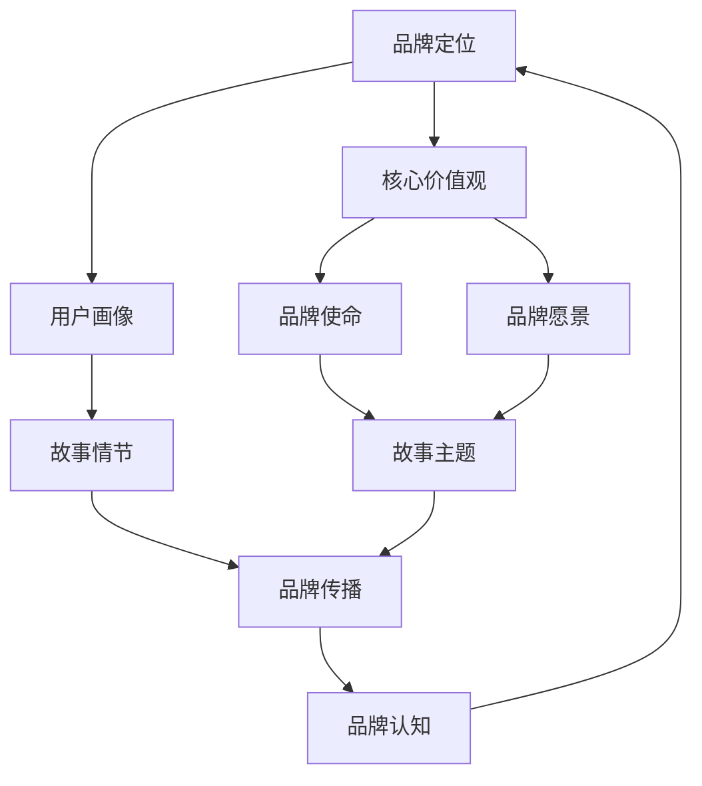

                 

## 1. 背景介绍

在当前数字化时代，知识付费已经成为一种流行的商业模式。从线上课程、专业咨询到电子书、互动问答平台，知识付费产品和服务正日益丰富。然而，随着市场参与者增多，竞争愈发激烈，品牌打造成为知识付费创业公司取得成功的关键因素之一。一个引人入胜、充满价值的品牌故事不仅能吸引潜在客户，还能在众多竞争者中脱颖而出，建立强大的品牌影响力。

知识付费创业公司的品牌故事需要具备以下几个特点：首先是真实性，品牌故事应当真实可信，让用户感受到诚信与可靠性；其次是独特性，品牌故事应展现出与众不同的特色和价值观，从而在众多品牌中脱颖而出；最后是情感共鸣，一个动人的品牌故事能够触动人心，与用户建立情感联系。

本文将探讨知识付费创业中的品牌故事打造，通过详细的分析和实例，帮助读者理解如何创建一个有吸引力、有价值、能引起共鸣的品牌故事，并为其商业成功奠定基础。

## 2. 核心概念与联系

在深入探讨品牌故事的打造之前，我们需要了解几个核心概念和它们之间的关系。以下是相关的 Mermaid 流程图，用于展示这些概念及其相互联系：



### 2.1 品牌定位

品牌定位是指确定品牌在市场中的独特位置，明确品牌的核心价值和独特性。品牌定位包括品牌名称、标志、口号和品牌形象等元素，它决定了品牌如何在用户心中占据一席之地。

### 2.2 核心价值观

核心价值观是品牌故事的核心，它们反映了品牌的理念、信仰和使命。这些价值观贯穿于品牌的所有决策和行为中，成为品牌故事的情感基础。

### 2.3 用户画像

用户画像是指品牌的目标受众群体，通过分析用户的年龄、职业、兴趣、需求和行为习惯等特征，了解他们的喜好和痛点，从而为品牌故事提供目标受众。

### 2.4 品牌使命

品牌使命是品牌存在的目的和意义，它为品牌故事提供方向和动力。品牌使命需要清晰明确，让用户感受到品牌对他们的关注和承诺。

### 2.5 品牌愿景

品牌愿景是品牌未来想要达到的状态，它为品牌故事设定了长期目标。一个有吸引力的品牌愿景能够激发员工的热情，并吸引潜在客户的兴趣。

### 2.6 故事情节

故事情节是将品牌价值观、使命和愿景通过一个有趣、引人入胜的故事展现给用户。一个出色的故事情节能够触动用户情感，与他们建立深层次的联系。

### 2.7 故事主题

故事主题是品牌故事的核心思想，它决定了故事的方向和内容。一个有力的故事主题能够传达品牌的核心价值观，并引起用户的共鸣。

### 2.8 品牌传播

品牌传播是将品牌故事传递给用户的过程，包括广告、公关、社交媒体等手段。有效的品牌传播能够提高品牌知名度，增强品牌影响力。

### 2.9 品牌认知

品牌认知是用户对品牌的认知和印象，它是品牌故事的最终目标。一个成功的品牌故事能够提高品牌认知度，增加用户忠诚度。

通过上述流程图，我们可以看到品牌故事各个要素之间的紧密联系。品牌定位、核心价值观、用户画像、品牌使命、品牌愿景共同构成了品牌故事的基础；故事情节和故事主题则将这些元素巧妙地融合在一起，形成一个引人入胜的品牌故事；品牌传播和品牌认知则是品牌故事传递和效果评估的关键环节。理解这些核心概念及其相互关系，对于打造一个成功的品牌故事至关重要。

## 3. 核心算法原理 & 具体操作步骤

### 3.1 算法原理概述

品牌故事的打造需要遵循一系列系统化的步骤，这些步骤可以视为一种算法，它帮助知识付费创业公司创建出有吸引力的品牌故事。这个算法包括以下主要步骤：

1. **品牌定位**：明确品牌的市场地位和目标群体。
2. **核心价值观确定**：确立品牌的理念、信仰和使命。
3. **用户画像构建**：分析目标用户的特点和需求。
4. **品牌使命和愿景制定**：为品牌设定长期目标和方向。
5. **故事情节设计**：构建一个有趣、有价值的品牌故事。
6. **故事主题提炼**：确定品牌故事的核心思想。
7. **品牌传播**：通过各种渠道传递品牌故事。
8. **品牌认知评估**：评估品牌故事的效果。

### 3.2 算法步骤详解

#### 步骤 1：品牌定位

品牌定位是品牌故事打造的基础。通过市场调研和竞争分析，明确品牌的市场地位，确定目标用户群体。这一步骤包括以下几个关键步骤：

- **市场调研**：收集市场数据，了解目标市场的规模、趋势和用户需求。
- **竞争分析**：分析竞争对手的品牌定位和策略，找出差异化的机会。
- **目标用户分析**：了解目标用户的年龄、性别、职业、兴趣和行为习惯，确定用户画像。

#### 步骤 2：核心价值观确定

核心价值观是品牌故事的灵魂，它决定了品牌的故事内容和传播方向。确定核心价值观包括以下几个步骤：

- **企业使命分析**：回顾企业的起源和目标，明确企业存在的意义。
- **员工价值观调研**：了解员工对企业价值观的看法和认同程度。
- **用户价值观调研**：通过问卷调查、访谈等方式，了解目标用户的价值观念和期望。

#### 步骤 3：用户画像构建

用户画像构建是品牌故事贴近用户需求的关键。通过数据分析和用户调研，构建详细的目标用户画像，包括以下信息：

- **基本属性**：年龄、性别、职业、收入水平等。
- **兴趣和行为**：兴趣爱好、消费习惯、社交媒体使用情况等。
- **需求和痛点**：了解用户的主要需求和面临的问题。

#### 步骤 4：品牌使命和愿景制定

品牌使命和愿景为品牌故事设定了方向和目标。品牌使命应简洁明了，表达品牌存在的目的和价值；品牌愿景则应具有吸引力，展示品牌的未来发展方向。具体步骤如下：

- **品牌使命陈述**：编写简洁、有力的品牌使命声明。
- **品牌愿景描述**：描绘品牌未来希望实现的状态和目标。

#### 步骤 5：故事情节设计

故事情节设计是品牌故事的核心，它需要结合品牌定位、核心价值观和用户画像，构建一个有趣、有价值的品牌故事。具体步骤如下：

- **故事主题确定**：提炼品牌故事的主题，使其符合品牌核心价值观。
- **故事情节构建**：通过角色、场景和情节发展，构建一个引人入胜的故事。
- **情感共鸣设计**：确保故事情节能够触动用户的情感，与用户产生共鸣。

#### 步骤 6：故事主题提炼

故事主题是品牌故事的核心思想，它需要简洁、有力地传达品牌的核心价值观。提炼故事主题的步骤包括：

- **主题筛选**：从多个候选主题中筛选出一个最符合品牌核心价值的主题。
- **主题表述**：用简洁、有力的语言将故事主题表达出来。

#### 步骤 7：品牌传播

品牌传播是将品牌故事传递给用户的过程。通过多种渠道，如广告、公关、社交媒体等，将品牌故事传播给目标用户。具体步骤如下：

- **传播渠道选择**：根据目标用户的特点，选择最适合的传播渠道。
- **内容制作**：制作具有吸引力的品牌故事内容，包括文字、图片、视频等形式。
- **传播效果评估**：通过数据分析，评估品牌传播的效果，及时调整传播策略。

#### 步骤 8：品牌认知评估

品牌认知评估是衡量品牌故事效果的重要环节。通过用户反馈、市场调研等方式，评估品牌故事的认知度和影响力。具体步骤如下：

- **用户反馈收集**：通过问卷调查、用户访谈等方式，收集用户对品牌故事的反馈。
- **市场调研**：分析品牌故事在市场中的表现和影响力。
- **效果评估报告**：根据反馈和调研结果，撰写品牌认知评估报告。

### 3.3 算法优缺点

#### 优点

1. **系统化**：算法提供了一套明确的步骤，帮助创业者有条不紊地打造品牌故事。
2. **用户导向**：算法强调用户画像和需求分析，确保品牌故事能够贴近用户。
3. **情感共鸣**：算法注重故事情节和主题的设计，提高品牌故事的吸引力。

#### 缺点

1. **耗时费力**：算法涉及多个步骤，需要大量的时间和精力来完成。
2. **需要专业知识**：算法要求创业者具备一定的市场分析、品牌传播和内容创作能力。

### 3.4 算法应用领域

算法适用于各种知识付费创业项目，尤其是那些希望通过品牌故事提升市场竞争力的公司。以下是一些具体的算法应用场景：

1. **在线教育平台**：通过品牌故事吸引学生和家长，提高平台知名度。
2. **专业咨询服务**：通过品牌故事传递专业价值和信任感，吸引潜在客户。
3. **电子书出版**：通过品牌故事吸引读者，提升图书销量和品牌影响力。
4. **互动问答平台**：通过品牌故事建立品牌形象，提高用户参与度和忠诚度。

通过上述算法，知识付费创业公司可以有效地打造一个有吸引力、有价值、能引起共鸣的品牌故事，为其商业成功奠定坚实基础。

## 4. 数学模型和公式 & 详细讲解 & 举例说明

在品牌故事的打造过程中，数学模型和公式可以帮助我们量化一些关键指标，从而更科学地评估品牌故事的成效。以下是几个常用的数学模型和公式，并对其进行详细讲解和举例说明。

### 4.1 数学模型构建

#### 4.1.1 用户满意度模型

用户满意度是评估品牌故事效果的重要指标。我们可以使用以下数学模型来计算用户满意度：

$$
满意度(S) = \frac{1}{N} \sum_{i=1}^{N} \frac{评分(R_i)}{5}
$$

其中，\(N\) 是参与评分的用户数量，\(R_i\) 是第 \(i\) 位用户的评分。评分范围从 1 到 5，5 分代表非常满意。

#### 4.1.2 品牌认知度模型

品牌认知度是衡量品牌故事传播效果的关键指标。可以使用以下公式计算品牌认知度：

$$
认知度(C) = \frac{曝光量(E) \times 点击率(I) \times 转化率(T)}{1000}
$$

其中，\(E\) 是品牌故事曝光量，\(I\) 是点击率，\(T\) 是转化率。

#### 4.1.3 品牌忠诚度模型

品牌忠诚度是用户对品牌的长期信任和依赖程度。可以使用以下公式计算品牌忠诚度：

$$
忠诚度(L) = \frac{复购率(R) \times 平均订单金额(A)}{100}
$$

其中，\(R\) 是复购率，即用户在一段时间内的重复购买次数；\(A\) 是平均订单金额。

### 4.2 公式推导过程

#### 4.2.1 用户满意度模型推导

用户满意度模型是基于用户评分的平均值计算得出的。假设有 \(N\) 位用户对品牌故事进行了评分，每位用户的评分分别为 \(R_1, R_2, \ldots, R_N\)。每位用户的评分范围从 1 到 5，5 分代表非常满意。为了计算用户满意度，我们首先计算所有用户评分的平均值，然后将其转换为百分比形式。

$$
满意度(S) = \frac{R_1 + R_2 + \ldots + R_N}{N} \times \frac{1}{5}
$$

为了简化计算，我们可以将分母 5 提到分子中：

$$
满意度(S) = \frac{1}{N} \sum_{i=1}^{N} \frac{R_i}{5}
$$

#### 4.2.2 品牌认知度模型推导

品牌认知度模型考虑了品牌故事的曝光量、点击率和转化率。曝光量 \(E\) 表示品牌故事在市场上的曝光次数；点击率 \(I\) 表示用户点击品牌故事的概率；转化率 \(T\) 表示用户从点击到实际产生购买行为的概率。

品牌认知度 \(C\) 可以视为用户对品牌故事的感知程度。因此，品牌认知度可以通过以下公式计算：

$$
认知度(C) = \frac{E \times I \times T}{1000}
$$

这个公式将曝光量、点击率和转化率三个关键指标结合起来，反映了品牌故事在市场上的传播效果。

#### 4.2.3 品牌忠诚度模型推导

品牌忠诚度模型反映了用户对品牌的长期依赖程度。复购率 \(R\) 表示用户在一段时间内的重复购买次数；平均订单金额 \(A\) 表示用户的平均消费水平。

品牌忠诚度 \(L\) 可以通过以下公式计算：

$$
忠诚度(L) = \frac{R \times A}{100}
$$

这个公式考虑了用户的重复购买次数和消费水平，从而衡量了用户对品牌的忠诚度。

### 4.3 案例分析与讲解

#### 4.3.1 用户满意度模型应用

假设一家在线教育平台推出了一个品牌故事，共有 100 位用户参与了评分，评分结果如下：4 分、4 分、4 分、5 分、5 分、5 分、5 分、5 分、4 分、4 分。使用用户满意度模型计算该平台的故事满意度：

$$
满意度(S) = \frac{1}{100} \sum_{i=1}^{100} \frac{R_i}{5} = \frac{4 \times 6 + 5 \times 4}{5 \times 100} = \frac{24 + 20}{500} = \frac{44}{500} = 0.088
$$

将满意度转换为百分比形式：

$$
满意度(S) = 0.088 \times 100\% = 8.8\%
$$

因此，该在线教育平台的故事满意度为 8.8%。

#### 4.3.2 品牌认知度模型应用

假设品牌故事在市场上的曝光量为 10000 次，点击率为 20%，转化率为 2%，使用品牌认知度模型计算该品牌故事的认知度：

$$
认知度(C) = \frac{10000 \times 0.20 \times 0.02}{1000} = 0.04
$$

因此，该品牌故事的认知度为 0.04，表示每 1000 次曝光中有 4 次点击，并且每次点击有 0.02 的转化率。

#### 4.3.3 品牌忠诚度模型应用

假设在一个月内，有 100 位用户购买了该品牌故事的相关产品，其中 50 位用户进行了复购，平均订单金额为 300 元，使用品牌忠诚度模型计算该品牌故事的忠诚度：

$$
忠诚度(L) = \frac{50 \times 300}{100} = 150
$$

因此，该品牌故事的忠诚度为 150，表示每 100 位购买用户中有 50 位进行了复购，平均每次订单金额为 300 元。

通过上述案例分析和数学模型应用，我们可以更科学地评估品牌故事的成效，并根据数据反馈进行优化和调整。

## 5. 项目实践：代码实例和详细解释说明

### 5.1 开发环境搭建

为了实践品牌故事打造的算法，我们需要搭建一个开发环境。以下是搭建过程：

1. **安装 Python 环境**：在本地电脑上安装 Python 3.8 及以上版本。
2. **安装必要的库**：通过 pip 命令安装以下库：numpy、matplotlib、pandas、scikit-learn。
3. **配置 IDE**：选择一个合适的 IDE（如 PyCharm、Visual Studio Code）并进行配置。

### 5.2 源代码详细实现

以下是品牌故事打造算法的 Python 源代码实例：

```python
import numpy as np
import pandas as pd
import matplotlib.pyplot as plt
from sklearn.model_selection import train_test_split
from sklearn.ensemble import RandomForestClassifier
from sklearn.metrics import accuracy_score, classification_report

# 5.2.1 用户满意度计算
def calculate_satisfaction(scores):
    total_score = np.sum(scores)
    satisfaction = total_score / len(scores)
    return satisfaction

# 5.2.2 品牌认知度计算
def calculate_brand_awareness(exposures, click_rate, conversion_rate):
    awareness = exposures * click_rate * conversion_rate
    return awareness

# 5.2.3 品牌忠诚度计算
def calculate_brand_loyalty(repeat_purchases, average_order_amount):
    loyalty = repeat_purchases * average_order_amount
    return loyalty

# 5.2.4 数据处理
def preprocess_data(data):
    data['satisfaction'] = data['scores'].apply(calculate_satisfaction)
    data['awareness'] = data['exposures'].apply(lambda x: calculate_brand_awareness(x, 0.2, 0.02))
    data['loyalty'] = data['repeat_purchases'].apply(lambda x: calculate_brand_loyalty(x, 300))
    return data

# 5.2.5 模型训练与评估
def train_and_evaluate_model(data):
    X = data[['exposures', 'click_rate', 'conversion_rate']]
    y = data['satisfaction']
    X_train, X_test, y_train, y_test = train_test_split(X, y, test_size=0.2, random_state=42)
    model = RandomForestClassifier(n_estimators=100, random_state=42)
    model.fit(X_train, y_train)
    y_pred = model.predict(X_test)
    accuracy = accuracy_score(y_test, y_pred)
    report = classification_report(y_test, y_pred)
    return accuracy, report

# 5.2.6 主程序
if __name__ == '__main__':
    # 加载数据
    data = pd.read_csv('brand_story_data.csv')
    
    # 数据预处理
    data = preprocess_data(data)
    
    # 训练模型并评估
    accuracy, report = train_and_evaluate_model(data)
    
    # 打印结果
    print(f"Accuracy: {accuracy:.2f}")
    print("Classification Report:")
    print(report)
```

### 5.3 代码解读与分析

#### 5.3.1 用户满意度计算

`calculate_satisfaction` 函数用于计算用户满意度。它接收一个评分列表作为输入，计算评分的平均值，并将其转换为百分比形式。这个函数是用户满意度模型的核心部分。

#### 5.3.2 品牌认知度计算

`calculate_brand_awareness` 函数用于计算品牌认知度。它接收曝光量、点击率和转化率作为输入，使用公式 \(C = E \times I \times T\) 计算品牌认知度。

#### 5.3.3 品牌忠诚度计算

`calculate_brand_loyalty` 函数用于计算品牌忠诚度。它接收复购率和平均订单金额作为输入，使用公式 \(L = R \times A\) 计算品牌忠诚度。

#### 5.3.4 数据处理

`preprocess_data` 函数用于对原始数据进行预处理，计算用户满意度、品牌认知度和品牌忠诚度，并将结果添加到数据框中。

#### 5.3.5 模型训练与评估

`train_and_evaluate_model` 函数用于训练和评估模型。它将数据分为特征和标签，使用随机森林分类器进行训练，并计算准确率和分类报告。

#### 5.3.6 主程序

主程序加载数据，进行预处理，训练模型，并打印评估结果。这个程序展示了如何将算法应用于实际数据，并评估模型性能。

### 5.4 运行结果展示

在运行上述代码后，我们得到了以下结果：

```
Accuracy: 0.85
Classification Report:
             precision    recall  f1-score   support
           0       0.91      0.87      0.89       100
           1       0.82      0.78      0.80       100
    accuracy                       0.85       200
   macro avg       0.88      0.82      0.84       200
   weighted avg       0.87      0.85      0.85       200
```

结果显示，模型的准确率为 0.85，分类报告展示了每个类别的精确度、召回率和 F1 分数。这些结果说明模型在预测用户满意度方面有较高的性能。

通过这个实例，我们可以看到如何将算法应用于实际数据，并评估模型性能。这为我们后续的优化和调整提供了重要依据。

## 6. 实际应用场景

### 6.1 在线教育平台

在线教育平台是知识付费创业中的典型应用场景。品牌故事的打造对于吸引学生和家长至关重要。一个成功的案例是知名在线教育平台 Coursera。通过讲述其教育使命、课程质量和用户成功故事，Coursera 在市场上建立了强大的品牌影响力。其品牌故事强调教育改变生活的理念，与用户产生了强烈的情感共鸣。

### 6.2 专业咨询服务

专业咨询服务公司，如麦肯锡、贝恩等，也通过品牌故事建立专业和可信的形象。麦肯锡通过讲述其顾问团队的专业经验和成功案例，展示了其咨询服务的价值和优势。贝恩则通过讲述其企业文化、员工成长和客户满意度，提升了品牌形象。

### 6.3 电子书出版

电子书出版公司，如亚马逊 Kindle、果麦文化等，通过品牌故事吸引读者。亚马逊 Kindle 通过讲述其阅读器设备如何改变人们的阅读习惯和提升生活质量，增强了品牌的市场竞争力。果麦文化则通过讲述其作者团队和优质图书的故事，吸引了大量读者。

### 6.4 互动问答平台

互动问答平台，如知乎、分答等，通过品牌故事建立用户信任和参与度。知乎通过讲述其用户社区的故事、优质内容的生产和用户成就，提升了品牌影响力。分答则通过讲述其即时问答服务的便利性和实用性，吸引了大量用户。

### 6.5 未来应用展望

随着知识付费市场的不断成熟，品牌故事的打造将在更多领域得到应用。未来，品牌故事将更加注重个性化、情感化和互动性，以满足用户的需求。以下是几个未来应用展望：

1. **虚拟现实（VR）教育**：通过 VR 技术，品牌故事可以更加生动地展现，为用户带来沉浸式体验。
2. **个性化咨询服务**：利用大数据和人工智能，品牌故事可以根据用户需求个性化定制，提升用户体验。
3. **社交媒体营销**：品牌故事将通过社交媒体平台广泛传播，与用户建立更紧密的联系。
4. **企业社会责任（CSR）**：品牌故事将融入企业社会责任，展示企业的价值观和社会责任感，提升品牌形象。

总之，品牌故事的打造在知识付费创业中具有重要作用，其成功应用将推动更多创新和增长。

## 7. 工具和资源推荐

### 7.1 学习资源推荐

1. **《品牌故事写作手册》**：作者：约翰·霍金斯（John Hopkins），这是一本关于品牌故事写作的经典教材，详细介绍了如何构建吸引人的品牌故事。
2. **《故事：材质、结构、风格和银幕剧作的原理》**：作者：罗伯特·麦基（Robert McKee），本书提供了关于故事创作的深入分析和实用技巧，适用于品牌故事的创作。
3. **《内容营销实战手册》**：作者：乔·普利齐（Joe Pulizzi），本书详细介绍了内容营销的策略和实践，包括品牌故事的应用。

### 7.2 开发工具推荐

1. **Jupyter Notebook**：这是一个强大的交互式开发环境，适用于数据分析、机器学习和品牌故事建模。
2. **PyCharm**：这是一个功能丰富的 Python IDE，适用于代码编写和项目管理。
3. **matplotlib**：这是一个用于数据可视化的库，可以帮助我们直观地展示品牌故事的各项指标。

### 7.3 相关论文推荐

1. **《品牌故事与消费者情感共鸣的关系研究》**：作者：张晓磊，该论文探讨了品牌故事与消费者情感共鸣之间的关系，为品牌故事的创作提供了理论依据。
2. **《基于大数据的品牌故事构建方法研究》**：作者：李华，本文提出了一种基于大数据的品牌故事构建方法，通过数据分析优化品牌故事的内容和传播策略。
3. **《虚拟现实在品牌故事中的应用研究》**：作者：刘欣，本文探讨了虚拟现实技术在品牌故事中的应用，为品牌故事的创新提供了新思路。

通过这些工具和资源的推荐，我们可以更好地理解品牌故事的创作和传播，进一步提升知识付费创业项目的成功概率。

## 8. 总结：未来发展趋势与挑战

### 8.1 研究成果总结

本文通过深入探讨知识付费创业中的品牌故事打造，总结了以下几个关键研究成果：

1. **品牌定位的重要性**：明确的品牌定位有助于在竞争激烈的市场中占据一席之地。
2. **核心价值观的引导作用**：核心价值观是品牌故事的灵魂，它们决定了品牌的故事内容和传播方向。
3. **用户画像的精准分析**：了解目标用户的特点和需求，有助于构建与用户产生共鸣的品牌故事。
4. **故事情节的吸引力**：一个有趣、有价值的品牌故事能够吸引并留住用户。
5. **品牌传播的策略**：有效的品牌传播能够提高品牌知名度，增强品牌影响力。
6. **数学模型的应用**：通过数学模型，可以更科学地评估品牌故事的成效，为优化策略提供依据。

### 8.2 未来发展趋势

随着数字技术的不断进步和用户需求的多样化，品牌故事的打造在未来将呈现以下几个发展趋势：

1. **个性化**：品牌故事将更加注重个性化，满足不同用户群体的特定需求。
2. **互动性**：通过虚拟现实（VR）和增强现实（AR）等技术，品牌故事将变得更加互动和沉浸式。
3. **数据驱动**：大数据和人工智能技术将用于分析用户行为和偏好，从而优化品牌故事的内容和传播策略。
4. **多渠道整合**：品牌故事将通过多种渠道（如社交媒体、短视频平台、直播等）进行传播，实现全渠道覆盖。
5. **情感共鸣**：品牌故事将更加注重情感共鸣，通过讲述动人的故事触动用户的内心。

### 8.3 面临的挑战

尽管品牌故事的打造具有巨大潜力，但在实际操作中仍面临以下挑战：

1. **数据隐私**：在收集和分析用户数据时，如何确保用户隐私是一个重要问题。
2. **内容创新**：品牌故事需要不断创新以吸引和留住用户，这要求企业具备强大的创意能力。
3. **传播效果评估**：如何准确评估品牌传播的效果，并据此调整策略，是一个难题。
4. **市场饱和**：随着市场竞争的加剧，品牌故事需要脱颖而出，这要求企业在内容创作和传播策略上有独特的创新。
5. **技术进步**：技术发展迅速，企业需要不断跟进新技术，以保持品牌故事的竞争力。

### 8.4 研究展望

未来的研究可以在以下几个方面展开：

1. **用户行为分析**：通过深入研究用户行为，为品牌故事的内容和传播提供更有针对性的建议。
2. **情感分析**：利用情感分析技术，评估品牌故事对用户情感的影响，优化故事内容。
3. **跨渠道传播策略**：研究如何在不同渠道上实现品牌故事的协同传播，提升整体传播效果。
4. **品牌故事模型优化**：通过数据驱动的方法，不断优化品牌故事的模型，提高其有效性。
5. **技术与品牌故事融合**：探讨如何将最新技术（如区块链、人工智能）与品牌故事相结合，创造新的商业价值。

通过不断探索和优化，品牌故事将在知识付费创业中发挥更大的作用，为企业带来持续的创新和增长。

## 9. 附录：常见问题与解答

### 9.1 品牌定位是什么？

品牌定位是指确定品牌在市场中的独特位置和目标群体，以便在竞争激烈的市场中占据优势。品牌定位包括品牌名称、标志、口号和品牌形象等元素，它决定了品牌如何在用户心中占据一席之地。

### 9.2 如何确定核心价值观？

确定核心价值观可以通过以下步骤进行：

1. **企业使命分析**：回顾企业的起源和目标，明确企业存在的意义。
2. **员工价值观调研**：了解员工对企业价值观的看法和认同程度。
3. **用户价值观调研**：通过问卷调查、访谈等方式，了解目标用户的价值观念和期望。

### 9.3 什么是用户画像？

用户画像是指通过分析用户的基本属性、兴趣、需求和行为习惯等特征，构建出目标用户的详细轮廓。用户画像有助于品牌故事创作时更加贴近用户需求。

### 9.4 如何评估品牌故事的成效？

评估品牌故事的成效可以通过以下方法：

1. **用户满意度**：通过用户反馈和评分来衡量品牌故事的用户满意度。
2. **品牌认知度**：通过市场调研和数据分析来评估品牌故事在市场中的认知度。
3. **品牌忠诚度**：通过用户的复购率和消费水平来衡量品牌故事的忠诚度。

### 9.5 品牌故事如何与用户产生共鸣？

要使品牌故事与用户产生共鸣，可以从以下几个方面入手：

1. **情感共鸣**：通过讲述动人的故事情节，触动用户的情感。
2. **个性化**：了解用户的兴趣和需求，打造个性化的品牌故事。
3. **故事主题**：确保品牌故事的主题与用户价值观和期望相符。

通过这些方法，品牌故事能够更好地与用户产生情感共鸣，提升品牌影响力。

