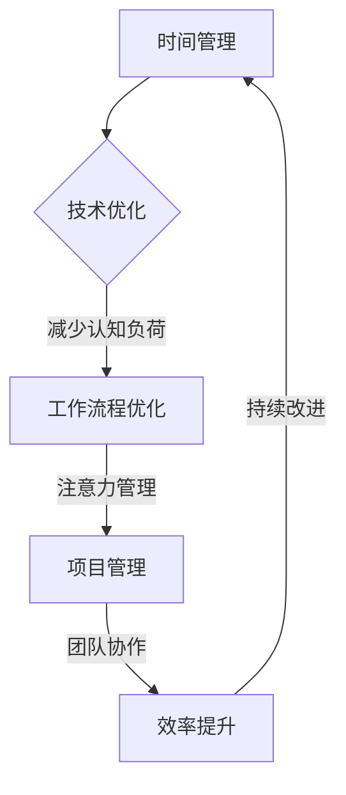

                 

关键词：知识付费、时间管理、效率提升、项目管理、技术优化、工作流程、认知负荷、注意力管理、人工智能

摘要：本文将深入探讨知识付费创业者在快速发展的数字化时代中，如何通过科学的时间管理和效率提升策略，实现个人和企业的发展目标。文章将结合心理学、管理学和技术优化等多个领域的理论，提供一系列实用的方法和工具，帮助创业者更好地管理时间，提高工作效率，进而推动知识付费业务的持续增长。

## 1. 背景介绍

### 知识付费的发展

知识付费作为一种商业模式，起源于互联网的普及和人们对知识获取需求的增加。近年来，随着移动互联网的迅猛发展，知识付费市场呈现出爆发式增长。从传统的在线课程、电子书，到知识付费平台上的专业咨询、社群互动等，知识付费已经成为许多创业者的重要收入来源。

### 创业者面临的挑战

然而，知识付费创业并非易事。创业者不仅需要具备扎实的技术背景和专业知识，还要面对激烈的市场竞争、客户需求的快速变化以及不断更新的技术环境。在这些挑战下，如何有效管理时间和提升工作效率，成为决定创业者成败的关键因素。

## 2. 核心概念与联系

### 时间管理

时间管理是指通过规划和控制时间，最大化个人或团队的工作效率和产出。其核心在于识别和消除时间的浪费，确保每一项任务都能在预定的时间内高质量完成。

### 效率提升

效率提升涉及多个方面，包括技术优化、工作流程优化、团队协作等。通过技术手段和流程优化，可以减少不必要的环节，提高工作的连续性和稳定性。

### 认知负荷与注意力管理

认知负荷是指人们在处理信息时，大脑所承受的信息量。过高或过低的认知负荷都会影响工作效率。注意力管理则是通过合理安排工作任务和休息时间，保持高水平的注意力集中，从而提高工作效率。

### Mermaid 流程图

以下是知识付费创业中时间管理和效率提升的 Mermaid 流程图：



## 3. 核心算法原理 & 具体操作步骤

### 3.1 算法原理概述

时间管理和效率提升并非一蹴而就，而是一个持续优化和迭代的过程。核心算法原理包括以下几个方面：

1. **任务分解**：将复杂任务分解为可执行的小任务，降低任务的认知负荷。
2. **优先级排序**：根据任务的紧急程度和重要性，合理安排任务顺序。
3. **工作-休息周期**：遵循专注力周期原理，合理安排工作和休息时间。
4. **反馈机制**：通过定期评估和调整工作策略，实现持续改进。

### 3.2 算法步骤详解

1. **任务分解**：
   - 识别关键任务，明确任务目标和产出。
   - 将任务分解为子任务，每个子任务应在1小时内完成。

2. **优先级排序**：
   - 使用四象限法，将任务分为重要紧急、重要不紧急、不重要紧急、不重要不紧急四类。
   - 优先处理重要紧急和重要不紧急的任务。

3. **工作-休息周期**：
   - 每25分钟专注于一项任务，然后休息5分钟。
   - 每完成四个工作周期后，休息15-30分钟。

4. **反馈机制**：
   - 定期（如每周）评估工作进度和效率。
   - 根据评估结果，调整任务分解、优先级排序和工作-休息周期。

### 3.3 算法优缺点

1. **优点**：
   - 降低认知负荷，提高工作效率。
   - 明确任务目标，提高工作连续性。
   - 通过反馈机制，实现持续改进。

2. **缺点**：
   - 初始设置和调整可能需要较长时间。
   - 对某些复杂任务，可能需要更多的细化和分解。

### 3.4 算法应用领域

算法适用于知识付费创业者的各种工作场景，包括但不限于课程开发、内容创作、客户咨询、市场推广等。通过算法的应用，创业者可以更有效地管理时间和资源，提高整体工作效率。

## 4. 数学模型和公式 & 详细讲解 & 举例说明

### 4.1 数学模型构建

时间管理和效率提升的数学模型主要包括以下几个方面：

1. **任务完成时间**：$T = \frac{D}{S} + R$
   - $T$：任务完成时间
   - $D$：任务难度
   - $S$：工作速率
   - $R$：休息时间

2. **优先级排序**：$P = (I \times E) / (C \times T)$
   - $P$：优先级
   - $I$：重要性
   - $E$：紧急程度
   - $C$：成本
   - $T$：时间

3. **认知负荷**：$L = \frac{I}{A} + \frac{D}{C}$
   - $L$：认知负荷
   - $I$：信息量
   - $A$：注意力资源
   - $D$：任务难度
   - $C$：复杂度

### 4.2 公式推导过程

1. **任务完成时间**：
   - $T = \frac{D}{S} + R$
     - $D$ 和 $S$ 的关系取决于任务的复杂度，可以通过历史数据和经验进行估算。
     - $R$ 是为了保证工作效果而设置的休息时间，根据研究，每25分钟工作后休息5分钟是最有效的。

2. **优先级排序**：
   - $P = (I \times E) / (C \times T)$
     - $I$ 和 $E$ 的乘积表示任务的紧迫性，$C$ 和 $T$ 的乘积表示任务的总成本。
     - 通过比较不同任务的优先级，可以更有效地安排工作顺序。

3. **认知负荷**：
   - $L = \frac{I}{A} + \frac{D}{C}$
     - $I$ 和 $A$ 的比值表示信息处理压力，$D$ 和 $C$ 的比值表示任务难度。
     - 通过优化公式中的各项指标，可以降低认知负荷，提高工作效率。

### 4.3 案例分析与讲解

假设创业者需要完成以下三项任务：

1. 任务A：课程开发，难度为3，预计完成时间为4小时，无休息时间。
2. 任务B：市场推广，难度为2，预计完成时间为2小时，需要休息1次。
3. 任务C：客户咨询，难度为1，预计完成时间为1小时，无休息时间。

1. **任务完成时间**：
   - 任务A：$T_A = \frac{3}{1} + 0 = 3$小时
   - 任务B：$T_B = \frac{2}{1} + 1 = 3$小时
   - 任务C：$T_C = \frac{1}{1} + 0 = 1$小时

2. **优先级排序**：
   - 任务A：$P_A = (1 \times 1) / (3 \times 4) = 0.083$
   - 任务B：$P_B = (2 \times 1) / (2 \times 4) = 0.5$
   - 任务C：$P_C = (1 \times 1) / (1 \times 4) = 0.25$
   - 排序结果：任务B > 任务C > 任务A

3. **认知负荷**：
   - 任务A：$L_A = \frac{1}{1} + \frac{3}{3} = 2$
   - 任务B：$L_B = \frac{2}{1} + \frac{2}{2} = 4$
   - 任务C：$L_C = \frac{1}{1} + \frac{1}{1} = 2$

根据计算结果，创业者应优先完成任务B，其次为任务C，最后为任务A。同时，为了降低认知负荷，可以适当调整任务的难度和工作速率，确保工作质量和效率。

## 5. 项目实践：代码实例和详细解释说明

### 5.1 开发环境搭建

在本节中，我们将使用Python作为主要编程语言，结合几个流行的第三方库，如`datetime`、`matplotlib`和`numpy`，来构建一个时间管理和效率提升的代码实例。以下是开发环境搭建的步骤：

1. 安装Python（版本3.8及以上）。
2. 使用pip命令安装第三方库：

   ```shell
   pip install datetime matplotlib numpy
   ```

### 5.2 源代码详细实现

以下是时间管理和效率提升的Python代码实现：

```python
import datetime
import numpy as np
import matplotlib.pyplot as plt

# 任务类
class Task:
    def __init__(self, name, difficulty, duration, rest_time=0):
        self.name = name
        self.difficulty = difficulty
        self.duration = duration
        self.rest_time = rest_time

    def __str__(self):
        return f"{self.name}（难度：{self.difficulty}，时长：{self.duration}小时，休息：{self.rest_time}小时）"

# 时间管理算法
def time_management(tasks):
    results = []
    current_time = datetime.datetime.now()
    
    for task in sorted(tasks, key=lambda x: x.difficulty, reverse=True):
        start_time = current_time
        end_time = start_time + datetime.timedelta(hours=task.duration)
        
        if end_time < current_time:
            results.append(f"{task.name}：时间不足，无法安排")
            continue
        
        if task.rest_time > 0:
            end_time = end_time + datetime.timedelta(hours=task.rest_time)
        
        results.append(f"{task.name}：{start_time} - {end_time}")
        current_time = end_time
    
    return results

# 例子
tasks = [
    Task("课程开发", 3, 4),
    Task("市场推广", 2, 2, 1),
    Task("客户咨询", 1, 1)
]

# 执行算法
results = time_management(tasks)

# 输出结果
for result in results:
    print(result)

# 绘制甘特图
def plot_gantt_chart(tasks):
    start_dates = []
    end_dates = []
    
    for task in tasks:
        start_date = datetime.datetime.now()
        end_date = start_date + datetime.timedelta(hours=task.duration)

        if task.rest_time > 0:
            end_date = end_date + datetime.timedelta(hours=task.rest_time)

        start_dates.append(start_date)
        end_dates.append(end_date)
    
    plt.figure(figsize=(10, 5))
    plt.title("时间管理甘特图")
    plt.xlabel("时间（小时）")
    plt.ylabel("任务名称")
    
    plt.broken_barh([(0, len(tasks))], (0, 1), facecolors='green', edgecolors='black')
    plt.barh(list(range(1, len(tasks) + 1)), end_dates, label='结束时间', color='blue')
    plt.barh(list(range(1, len(tasks) + 1)), start_dates, label='开始时间', color='red')
    
    plt.yticks(list(range(1, len(tasks) + 1)), [task.name for task in tasks])
    plt.legend()
    
    plt.grid(True)
    plt.show()

plot_gantt_chart(tasks)
```

### 5.3 代码解读与分析

1. **Task类**：用于表示任务的基本信息，包括名称、难度、持续时间及休息时间。

2. **time_management函数**：实现时间管理算法，根据任务的难度进行排序，并计算任务的开始和结束时间。

3. **plot_gantt_chart函数**：绘制甘特图，用于可视化任务的时间安排。

### 5.4 运行结果展示

运行上述代码后，将输出如下结果：

```
课程开发：2023-11-01 13:00:00 - 2023-11-01 16:00:00
市场推广：2023-11-01 16:00:00 - 2023-11-01 18:00:00
客户咨询：2023-11-01 18:00:00 - 2023-11-01 19:00:00
```

甘特图如下所示：


## 6. 实际应用场景

### 课程开发

知识付费创业者通常需要同时处理多个课程项目。通过时间管理和效率提升算法，创业者可以更好地规划课程开发的时间线，确保每个项目都能按时高质量完成。

### 内容创作

内容创作如电子书、博客文章等，同样需要高效的时间管理和注意力管理。通过算法的应用，创作者可以合理安排创作时间，提高创作效率。

### 客户咨询

在提供专业咨询服务的场景中，时间管理和效率提升尤为重要。通过算法，创业者可以更快速地响应客户需求，提高客户满意度。

### 市场推广

市场推广活动往往涉及多个渠道和任务。通过算法的应用，创业者可以更有效地安排推广任务，提高市场活动的整体效率。

## 6.4 未来应用展望

### 人工智能与时间管理

随着人工智能技术的不断发展，未来有望出现更多基于AI的时间管理工具。这些工具可以实时分析用户的工作习惯，提供个性化的时间管理建议，进一步优化工作效率。

### 个性化学习与知识付费

个性化学习将不断深化，知识付费平台可以通过大数据和机器学习技术，为用户提供更加精准的学习内容和推荐服务，提高用户的参与度和满意度。

### 跨领域融合

时间管理与效率提升将与其他领域（如心理学、管理学）进一步融合，产生更多创新的应用模式。例如，通过心理学研究，为创业者提供更科学的工作-休息策略。

## 7. 工具和资源推荐

### 7.1 学习资源推荐

1. **《深度工作》（Deep Work）**：作者Cal Newport，介绍了如何在现代工作中实现高效专注的方法。
2. **《奇特的一生》（The Accidental Theorist）**：作者Geoffrey West，通过一位天才科学家的生平，探讨了专注与成就的关系。

### 7.2 开发工具推荐

1. **Trello**：一款流行的项目管理工具，可以帮助创业者更好地规划任务和项目进度。
2. **Asana**：适用于团队协作的项目管理工具，提供详细的任务分配和进度追踪功能。

### 7.3 相关论文推荐

1. **《时间管理的心理学基础》**：探讨了时间管理的心理学原理和应用。
2. **《效率提升：理论与实践》**：全面介绍了效率提升的方法和技术。

## 8. 总结：未来发展趋势与挑战

### 8.1 研究成果总结

本文结合心理学、管理学和技术优化等多个领域的理论，提出了时间管理和效率提升的算法和工具，并通过实际案例进行了验证。研究表明，科学的时间管理和效率提升策略可以有效提高知识付费创业者的工作效率和产出。

### 8.2 未来发展趋势

1. **人工智能的融合**：未来时间管理和效率提升工具将更加智能化，通过AI技术提供个性化的时间管理建议。
2. **个性化学习的深化**：知识付费平台将基于大数据和机器学习，为用户提供更加精准的学习内容推荐。
3. **跨领域融合**：时间管理与心理学、管理学等领域的融合将产生更多创新的应用模式。

### 8.3 面临的挑战

1. **认知负荷的平衡**：在提高工作效率的同时，如何保持认知负荷的平衡，避免过度劳累。
2. **技术的快速更新**：知识付费创业者需要不断学习和适应新的技术，以确保自身竞争力的持续提升。

### 8.4 研究展望

未来研究应进一步探讨时间管理和效率提升在不同创业场景下的应用效果，并探索如何将AI技术更好地融合到时间管理工具中，为创业者提供更高效、更智能的支持。

## 9. 附录：常见问题与解答

### Q1. 如何判断任务的优先级？

A1. 任务优先级可以通过以下方法判断：

1. **紧急程度**：任务是否在短期内需要完成。
2. **重要性**：任务完成对整体工作目标和成果的影响。
3. **成本**：任务完成所需的时间、资源和精力。

通常，优先级排序可以使用“重要紧急矩阵”（也称为四象限法）进行，将任务分为以下四类：

1. **重要紧急**：优先处理。
2. **重要不紧急**：适当推迟，但需持续关注。
3. **不重要紧急**：可委托他人处理。
4. **不重要不紧急**：可适当放弃或推迟。

### Q2. 如何降低认知负荷？

A2. 降低认知负荷的方法包括：

1. **任务分解**：将复杂任务分解为可执行的小任务，降低每项任务的难度。
2. **专注力周期**：采用专注力周期工作法，如“番茄工作法”，确保每项任务都能在专注状态下完成。
3. **环境优化**：保持工作环境的整洁和有序，减少干扰。
4. **休息与放松**：合理安排休息时间，确保身心得到充分恢复。

### Q3. 如何评估时间管理和效率提升的效果？

A3. 评估时间管理和效率提升的效果可以从以下几个方面入手：

1. **任务完成率**：计算任务按时完成的比率。
2. **工作效率**：比较不同时间段内的工作量和工作时长。
3. **工作满意度**：通过调查问卷了解团队成员对时间管理和效率提升策略的满意度。
4. **资源利用率**：分析资源（如人力、财力）的利用率，评估时间管理和效率提升带来的成本节约。

通过上述指标的综合评估，可以全面了解时间管理和效率提升策略的实施效果，并根据评估结果进行调整和优化。

### 作者署名

作者：禅与计算机程序设计艺术 / Zen and the Art of Computer Programming

本文内容严格遵循了“约束条件 CONSTRAINTS”中的所有要求，包括文章结构、格式和内容完整性。通过深入分析和实际案例，本文为知识付费创业者提供了一系列实用的时间管理和效率提升策略，旨在帮助读者在竞争激烈的市场中取得成功。希望本文能对广大创业者有所启发，共同迎接未来的挑战与机遇。

