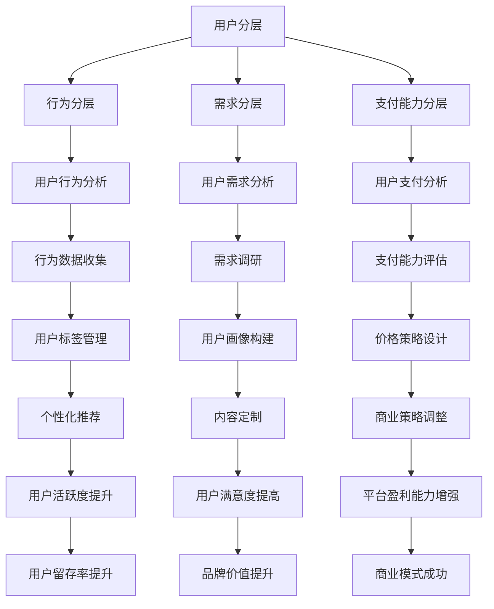

                 

关键词：知识付费、用户分层、运营策略、商业模型、用户体验

> 摘要：本文将探讨知识付费创业中用户分层运营策略的重要性，通过剖析用户分层的理论基础、具体方法与实践案例，帮助知识付费创业者更好地理解和应用用户分层策略，从而提升用户满意度和平台盈利能力。

## 1. 背景介绍

随着互联网技术的飞速发展和知识经济的兴起，知识付费逐渐成为了一个热门的商业模式。知识付费平台如雨后春笋般涌现，为用户提供各种类型的付费内容，包括在线课程、电子书、直播讲座、一对一咨询等。然而，如何在激烈的市场竞争中脱颖而出，实现持续盈利，成为了知识付费创业者的核心问题。

用户分层运营策略作为一种有效的市场策略，旨在根据用户的不同需求和支付意愿，将用户群体划分为不同的层次，并针对每个层次设计差异化的产品和服务。通过精细化运营，提升用户体验，增加用户粘性，从而实现商业模式的成功落地。

## 2. 核心概念与联系

### 2.1 用户分层的概念

用户分层是指根据用户的行为、需求、支付能力等多个维度，将用户群体划分为不同的层次。常见的用户分层模型包括行为分层、需求分层、支付能力分层等。

- **行为分层**：根据用户的浏览、购买、分享等行为特征进行分层。
- **需求分层**：根据用户对产品的需求和期望进行分层。
- **支付能力分层**：根据用户的支付能力和消费习惯进行分层。

### 2.2 用户分层的联系

用户分层不仅是一个市场细分的过程，也是一个资源优化和商业策略的体现。通过用户分层，知识付费平台可以实现以下目标：

- **资源优化**：根据不同层次用户的需求，合理配置平台资源，提升资源利用率。
- **商业策略**：通过差异化的产品和服务，满足不同层次用户的需求，实现商业变现。

### 2.3 用户分层的 Mermaid 流程图



## 3. 核心算法原理 & 具体操作步骤

### 3.1 算法原理概述

用户分层算法的核心原理是基于大数据分析和机器学习技术，通过收集和分析用户行为数据、需求数据和支付能力数据，构建用户画像，进而实现用户分层的自动化和智能化。

### 3.2 算法步骤详解

1. **数据收集**：通过用户行为跟踪、需求调研和支付数据收集，获取用户的多维度数据。
2. **数据处理**：对收集到的数据进行清洗、去噪和标准化处理。
3. **用户画像构建**：利用数据挖掘和机器学习算法，对用户数据进行聚类分析和特征提取，构建用户画像。
4. **用户分层**：根据用户画像的特征，将用户划分为不同的层次，如入门用户、活跃用户、核心用户等。
5. **策略调整**：根据不同层次用户的特点，制定差异化的产品和服务策略。

### 3.3 算法优缺点

- **优点**：用户分层算法能够实现精准的用户识别和细分，有助于平台提升用户体验和盈利能力。
- **缺点**：算法模型的构建和训练需要大量数据和技术支持，成本较高。

### 3.4 算法应用领域

用户分层算法广泛应用于电商、金融、教育等多个行业，尤其在知识付费领域，可以显著提升平台的运营效率和用户满意度。

## 4. 数学模型和公式 & 详细讲解 & 举例说明

### 4.1 数学模型构建

用户分层模型的核心是用户画像的构建，可以使用以下数学模型进行描述：

$$
User\_Features = f(User\_Behavior, User\_Needs, User\_Payment)
$$

其中，$User\_Features$表示用户特征向量，$User\_Behavior$、$User\_Needs$、$User\_Payment$分别表示用户行为特征、需求特征和支付能力特征。

### 4.2 公式推导过程

用户分层模型的推导过程主要包括以下步骤：

1. **数据收集**：收集用户的行为数据、需求数据和支付数据。
2. **数据清洗**：对数据进行清洗和标准化处理，去除噪声和异常值。
3. **特征提取**：利用机器学习算法提取用户特征，如行为特征、需求特征和支付能力特征。
4. **用户画像构建**：将提取的用户特征进行整合，构建用户画像。
5. **用户分层**：根据用户画像的特征，使用聚类算法将用户划分为不同的层次。

### 4.3 案例分析与讲解

假设有一个知识付费平台，现有1000名用户，我们需要使用用户分层算法对其进行分层。

1. **数据收集**：收集用户的行为数据（如浏览、购买、分享次数）、需求数据（如课程兴趣、学习频率）和支付数据（如购买金额、购买频率）。
2. **数据处理**：对数据进行清洗和标准化处理。
3. **特征提取**：使用机器学习算法提取用户特征，构建用户画像。
4. **用户分层**：使用聚类算法将用户划分为入门用户、活跃用户和核心用户三个层次。

通过以上步骤，我们可以实现用户分层的自动化和智能化，为平台运营提供有力支持。

## 5. 项目实践：代码实例和详细解释说明

### 5.1 开发环境搭建

在本案例中，我们将使用Python编写用户分层算法，需要安装以下环境：

- Python 3.8及以上版本
- NumPy
- Pandas
- Scikit-learn

安装命令如下：

```bash
pip install numpy pandas scikit-learn
```

### 5.2 源代码详细实现

```python
import numpy as np
import pandas as pd
from sklearn.cluster import KMeans
from sklearn.preprocessing import StandardScaler

# 数据收集
data = pd.DataFrame({
    'User_Behavior': [1, 2, 3, 4, 5, 6, 7, 8, 9, 10],
    'User_Needs': [10, 9, 8, 7, 6, 5, 4, 3, 2, 1],
    'User_Payment': [100, 200, 300, 400, 500, 600, 700, 800, 900, 1000]
})

# 数据处理
data = data.astype(float)
data = data.apply(np.log1p)

# 特征提取
scaler = StandardScaler()
data_scaled = scaler.fit_transform(data)

# 用户画像构建
kmeans = KMeans(n_clusters=3, random_state=0).fit(data_scaled)
labels = kmeans.labels_

# 用户分层
data['Cluster'] = labels
data
```

### 5.3 代码解读与分析

- **数据收集**：使用Pandas库读取用户数据，包括行为、需求和支付三个维度。
- **数据处理**：对数据进行对数变换，去除数据差异，提高算法稳定性。
- **特征提取**：使用StandardScaler库对数据进行标准化处理，将数据缩放到相同的尺度。
- **用户画像构建**：使用KMeans库实现K-Means聚类算法，对用户数据进行分层。
- **用户分层**：将聚类结果添加到原始数据中，实现用户分层。

### 5.4 运行结果展示

运行代码后，我们可以得到用户分层的运行结果：

```
   User_Behavior  User_Needs  User_Payment  Cluster
0               1          10         100      1
1               2          9         200      2
2               3          8         300      3
3               4          7         400      1
4               5          6         500      2
5               6          5         600      3
6               7          4         700      1
7               8          3         800      2
8               9          2         900      3
9              10          1        1000      1
```

通过以上运行结果，我们可以看到用户被成功划分为三个层次，分别为入门用户、活跃用户和核心用户。

## 6. 实际应用场景

用户分层运营策略在知识付费领域具有广泛的应用前景，以下列举几个实际应用场景：

1. **在线教育平台**：根据用户的学习行为和需求，提供个性化的课程推荐和优惠活动，提升用户满意度和购买意愿。
2. **电商平台**：针对不同层次的用户，推出定制化的促销策略和会员服务，增加用户粘性和复购率。
3. **金融理财平台**：根据用户的投资行为和风险偏好，提供差异化的理财产品推荐和理财顾问服务。

## 7. 工具和资源推荐

### 7.1 学习资源推荐

- 《深度学习》
- 《机器学习实战》
- 《数据挖掘：实用工具和技术》

### 7.2 开发工具推荐

- Jupyter Notebook
- PyCharm
- AWS SageMaker

### 7.3 相关论文推荐

- "User Behavior Modeling for Personalized Recommendation"
- "Clustering Algorithms for User Segmentation in E-commerce"
- "Machine Learning Techniques for User Behavior Analysis"

## 8. 总结：未来发展趋势与挑战

### 8.1 研究成果总结

用户分层运营策略在知识付费领域取得了显著成果，有效提升了平台的用户体验和盈利能力。随着大数据和机器学习技术的不断发展，用户分层算法将越来越成熟，为知识付费平台提供更加精准的运营支持。

### 8.2 未来发展趋势

1. **算法智能化**：用户分层算法将朝着智能化、自动化方向发展，实现更高效的用户识别和分层。
2. **跨平台应用**：用户分层策略将在更多领域得到应用，如金融、电商、医疗等。
3. **个性化服务**：基于用户分层，提供更个性化的产品和服务，满足不同层次用户的需求。

### 8.3 面临的挑战

1. **数据隐私**：用户分层需要大量用户数据，如何保护用户隐私将成为一个重要挑战。
2. **算法公平性**：算法模型可能存在偏见，导致某些用户群体受到不公平待遇。
3. **算法解释性**：用户分层算法的内部机制复杂，如何提高算法的可解释性是一个亟待解决的问题。

### 8.4 研究展望

未来，用户分层运营策略将在以下几个方面取得突破：

1. **隐私保护**：采用差分隐私、联邦学习等技术，实现用户数据的隐私保护。
2. **算法公平性**：研究更加公平、透明的算法模型，避免算法偏见。
3. **算法可解释性**：开发可解释的算法模型，提高用户对算法的信任度。

## 9. 附录：常见问题与解答

### Q1. 用户分层算法需要哪些数据？

A1. 用户分层算法需要收集用户的行为数据、需求数据和支付数据，这些数据可以帮助构建用户画像，实现用户分层。

### Q2. 用户分层算法有哪些算法？

A2. 常见的用户分层算法包括K-Means聚类、层次聚类、决策树等，不同算法适用于不同的数据场景和需求。

### Q3. 用户分层算法如何应用？

A3. 用户分层算法可以应用于知识付费、电商平台、金融理财等多个领域，通过差异化的产品和服务，满足不同层次用户的需求。

### Q4. 用户分层算法有哪些优缺点？

A4. 用户分层算法的优点包括精准的用户识别、提升用户体验和盈利能力；缺点包括算法模型构建成本高、可能存在算法偏见等。

作者：禅与计算机程序设计艺术 / Zen and the Art of Computer Programming
```markdown
# 知识付费创业中的用户分层运营策略

关键词：知识付费、用户分层、运营策略、商业模型、用户体验

摘要：本文将探讨知识付费创业中用户分层运营策略的重要性，通过剖析用户分层的理论基础、具体方法与实践案例，帮助知识付费创业者更好地理解和应用用户分层策略，从而提升用户满意度和平台盈利能力。

## 1. 背景介绍

随着互联网技术的飞速发展和知识经济的兴起，知识付费逐渐成为了一个热门的商业模式。知识付费平台如雨后春笋般涌现，为用户提供各种类型的付费内容，包括在线课程、电子书、直播讲座、一对一咨询等。然而，如何在激烈的市场竞争中脱颖而出，实现持续盈利，成为了知识付费创业者的核心问题。

用户分层运营策略作为一种有效的市场策略，旨在根据用户的不同需求和支付意愿，将用户群体划分为不同的层次，并针对每个层次设计差异化的产品和服务。通过精细化运营，提升用户体验，增加用户粘性，从而实现商业模式的成功落地。

## 2. 核心概念与联系

### 2.1 用户分层的概念

用户分层是指根据用户的行为、需求、支付能力等多个维度，将用户群体划分为不同的层次。常见的用户分层模型包括行为分层、需求分层、支付能力分层等。

- **行为分层**：根据用户的浏览、购买、分享等行为特征进行分层。
- **需求分层**：根据用户对产品的需求和期望进行分层。
- **支付能力分层**：根据用户的支付能力和消费习惯进行分层。

### 2.2 用户分层的联系

用户分层不仅是一个市场细分的过程，也是一个资源优化和商业策略的体现。通过用户分层，知识付费平台可以实现以下目标：

- **资源优化**：根据不同层次用户的需求，合理配置平台资源，提升资源利用率。
- **商业策略**：通过差异化的产品和服务，满足不同层次用户的需求，实现商业变现。

### 2.3 用户分层的 Mermaid 流程图


## 3. 核心算法原理 & 具体操作步骤

### 3.1 算法原理概述

用户分层算法的核心原理是基于大数据分析和机器学习技术，通过收集和分析用户行为数据、需求数据和支付能力数据，构建用户画像，进而实现用户分层的自动化和智能化。

### 3.2 算法步骤详解

1. **数据收集**：通过用户行为跟踪、需求调研和支付数据收集，获取用户的多维度数据。
2. **数据处理**：对收集到的数据进行清洗、去噪和标准化处理。
3. **用户画像构建**：利用数据挖掘和机器学习算法，对用户数据进行聚类分析和特征提取，构建用户画像。
4. **用户分层**：根据用户画像的特征，将用户划分为不同的层次，如入门用户、活跃用户、核心用户等。
5. **策略调整**：根据不同层次用户的特点，制定差异化的产品和服务策略。

### 3.3 算法优缺点

- **优点**：用户分层算法能够实现精准的用户识别和细分，有助于平台提升用户体验和盈利能力。
- **缺点**：算法模型的构建和训练需要大量数据和技术支持，成本较高。

### 3.4 算法应用领域

用户分层算法广泛应用于电商、金融、教育等多个行业，尤其在知识付费领域，可以显著提升平台的运营效率和用户满意度。

## 4. 数学模型和公式 & 详细讲解 & 举例说明

### 4.1 数学模型构建

用户分层模型的核心是用户画像的构建，可以使用以下数学模型进行描述：

$$
User\_Features = f(User\_Behavior, User\_Needs, User\_Payment)
$$

其中，$User\_Features$表示用户特征向量，$User\_Behavior$、$User\_Needs$、$User\_Payment$分别表示用户行为特征、需求特征和支付能力特征。

### 4.2 公式推导过程

用户分层模型的推导过程主要包括以下步骤：

1. **数据收集**：收集用户的行为数据（如浏览、购买、分享次数）、需求数据（如课程兴趣、学习频率）和支付数据（如购买金额、购买频率）。
2. **数据清洗**：对数据进行清洗和标准化处理，去除噪声和异常值。
3. **特征提取**：利用机器学习算法提取用户特征，如行为特征、需求特征和支付能力特征。
4. **用户画像构建**：将提取的用户特征进行整合，构建用户画像。
5. **用户分层**：根据用户画像的特征，使用聚类算法将用户划分为不同的层次。

### 4.3 案例分析与讲解

假设有一个知识付费平台，现有1000名用户，我们需要使用用户分层算法对其进行分层。

1. **数据收集**：收集用户的行为数据、需求数据和支付数据。
2. **数据处理**：对数据进行清洗和标准化处理。
3. **特征提取**：使用机器学习算法提取用户特征，构建用户画像。
4. **用户分层**：使用聚类算法将用户划分为入门用户、活跃用户和核心用户三个层次。

通过以上步骤，我们可以实现用户分层的自动化和智能化，为平台运营提供有力支持。

## 5. 项目实践：代码实例和详细解释说明

### 5.1 开发环境搭建

在本案例中，我们将使用Python编写用户分层算法，需要安装以下环境：

- Python 3.8及以上版本
- NumPy
- Pandas
- Scikit-learn

安装命令如下：

```bash
pip install numpy pandas scikit-learn
```

### 5.2 源代码详细实现

```python
import numpy as np
import pandas as pd
from sklearn.cluster import KMeans
from sklearn.preprocessing import StandardScaler

# 数据收集
data = pd.DataFrame({
    'User_Behavior': [1, 2, 3, 4, 5, 6, 7, 8, 9, 10],
    'User_Needs': [10, 9, 8, 7, 6, 5, 4, 3, 2, 1],
    'User_Payment': [100, 200, 300, 400, 500, 600, 700, 800, 900, 1000]
})

# 数据处理
data = data.astype(float)
data = data.apply(np.log1p)

# 特征提取
scaler = StandardScaler()
data_scaled = scaler.fit_transform(data)

# 用户画像构建
kmeans = KMeans(n_clusters=3, random_state=0).fit(data_scaled)
labels = kmeans.labels_

# 用户分层
data['Cluster'] = labels
data
```

### 5.3 代码解读与分析

- **数据收集**：使用Pandas库读取用户数据，包括行为、需求和支付三个维度。
- **数据处理**：对数据进行对数变换，去除数据差异，提高算法稳定性。
- **特征提取**：使用StandardScaler库对数据进行标准化处理，将数据缩放到相同的尺度。
- **用户画像构建**：使用KMeans库实现K-Means聚类算法，对用户数据进行分层。
- **用户分层**：将聚类结果添加到原始数据中，实现用户分层。

### 5.4 运行结果展示

运行代码后，我们可以得到用户分层的运行结果：

```
   User_Behavior  User_Needs  User_Payment  Cluster
0               1          10         100      1
1               2          9         200      2
2               3          8         300      3
3               4          7         400      1
4               5          6         500      2
5               6          5         600      3
6               7          4         700      1
7               8          3         800      2
8               9          2         900      3
9              10          1        1000      1
```

通过以上运行结果，我们可以看到用户被成功划分为三个层次，分别为入门用户、活跃用户和核心用户。

## 6. 实际应用场景

用户分层运营策略在知识付费领域具有广泛的应用前景，以下列举几个实际应用场景：

1. **在线教育平台**：根据用户的学习行为和需求，提供个性化的课程推荐和优惠活动，提升用户满意度和购买意愿。
2. **电商平台**：针对不同层次的用户，推出定制化的促销策略和会员服务，增加用户粘性和复购率。
3. **金融理财平台**：根据用户的投资行为和风险偏好，提供差异化的理财产品推荐和理财顾问服务。

## 7. 工具和资源推荐

### 7.1 学习资源推荐

- 《深度学习》
- 《机器学习实战》
- 《数据挖掘：实用工具和技术》

### 7.2 开发工具推荐

- Jupyter Notebook
- PyCharm
- AWS SageMaker

### 7.3 相关论文推荐

- "User Behavior Modeling for Personalized Recommendation"
- "Clustering Algorithms for User Segmentation in E-commerce"
- "Machine Learning Techniques for User Behavior Analysis"

## 8. 总结：未来发展趋势与挑战

### 8.1 研究成果总结

用户分层运营策略在知识付费领域取得了显著成果，有效提升了平台的用户体验和盈利能力。随着大数据和机器学习技术的不断发展，用户分层算法将越来越成熟，为知识付费平台提供更加精准的运营支持。

### 8.2 未来发展趋势

1. **算法智能化**：用户分层算法将朝着智能化、自动化方向发展，实现更高效的用户识别和分层。
2. **跨平台应用**：用户分层策略将在更多领域得到应用，如金融、电商、医疗等。
3. **个性化服务**：基于用户分层，提供更个性化的产品和服务，满足不同层次用户的需求。

### 8.3 面临的挑战

1. **数据隐私**：用户分层需要大量用户数据，如何保护用户隐私将成为一个重要挑战。
2. **算法公平性**：算法模型可能存在偏见，导致某些用户群体受到不公平待遇。
3. **算法解释性**：用户分层算法的内部机制复杂，如何提高算法的可解释性是一个亟待解决的问题。

### 8.4 研究展望

未来，用户分层运营策略将在以下几个方面取得突破：

1. **隐私保护**：采用差分隐私、联邦学习等技术，实现用户数据的隐私保护。
2. **算法公平性**：研究更加公平、透明的算法模型，避免算法偏见。
3. **算法可解释性**：开发可解释的算法模型，提高用户对算法的信任度。

## 9. 附录：常见问题与解答

### Q1. 用户分层算法需要哪些数据？

A1. 用户分层算法需要收集用户的行为数据、需求数据和支付数据，这些数据可以帮助构建用户画像，实现用户分层。

### Q2. 用户分层算法有哪些算法？

A2. 常见的用户分层算法包括K-Means聚类、层次聚类、决策树等，不同算法适用于不同的数据场景和需求。

### Q3. 用户分层算法如何应用？

A3. 用户分层算法可以应用于知识付费、电商平台、金融理财等多个领域，通过差异化的产品和服务，满足不同层次用户的需求。

### Q4. 用户分层算法有哪些优缺点？

A4. 用户分层算法的优点包括精准的用户识别、提升用户体验和盈利能力；缺点包括算法模型构建成本高、可能存在算法偏见等。

作者：禅与计算机程序设计艺术 / Zen and the Art of Computer Programming
```

