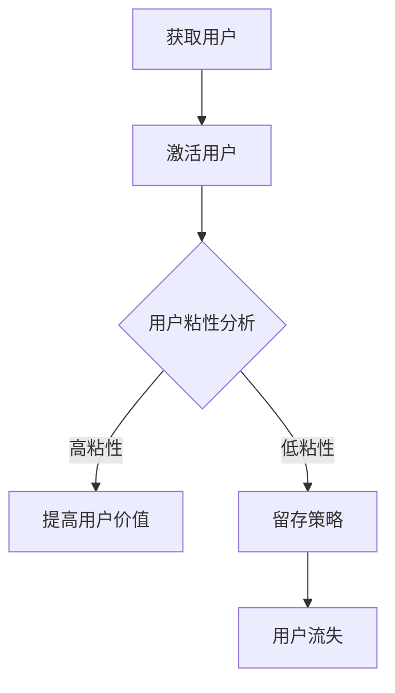

                 

 **关键词：** 知识付费、用户忠诚度、用户粘性、增长策略、用户体验、数据分析、个性化推荐。

**摘要：** 本文旨在探讨知识付费领域创业公司如何通过有效的策略和措施培养用户忠诚度。我们将分析用户忠诚度的核心要素，探讨数据分析和个性化推荐等技术在提升用户粘性方面的应用，并提供具体的实践案例和工具推荐。最终，我们将对未来的发展趋势和面临的挑战进行展望。

## 1. 背景介绍

知识付费作为一个新兴的行业，正在迅速发展。它为用户提供了一个获取高质量知识和服务的平台，同时也为内容创作者提供了收入来源。然而，在激烈的市场竞争中，如何培养用户忠诚度，提高用户粘性，成为知识付费创业公司面临的一大挑战。

用户忠诚度是指用户对某个产品或服务的长期依赖和信任程度。高忠诚度的用户不仅会持续消费，还可能为平台带来新用户。因此，提高用户忠诚度对于知识付费创业公司来说至关重要。

## 2. 核心概念与联系

在讨论用户忠诚度培养之前，我们需要了解以下几个核心概念：

### 2.1 用户生命周期

用户生命周期是指用户从首次接触产品到最终流失的整个过程。它包括获取用户、激活用户、留存用户、增加用户价值等环节。

### 2.2 用户粘性

用户粘性是指用户在一段时间内持续使用产品的频率和时长。提高用户粘性是培养用户忠诚度的关键。

### 2.3 数据分析

数据分析是指通过收集、处理和分析用户数据，为决策提供支持。在知识付费领域，数据分析可以帮助创业公司了解用户需求，优化产品和服务。

### 2.4 个性化推荐

个性化推荐是根据用户的兴趣和行为，为其推荐相关的内容和服务。个性化推荐可以有效提高用户粘性和满意度。

### 2.5 用户忠诚度模型

用户忠诚度模型是一个用于衡量用户忠诚度的量化指标体系。通过建立用户忠诚度模型，创业公司可以更好地了解用户忠诚度水平，制定相应的策略。

下面是一个简化的用户忠诚度模型流程图（使用Mermaid语言表示）：



## 3. 核心算法原理 & 具体操作步骤

### 3.1 算法原理概述

在用户忠诚度培养过程中，我们可以采用以下核心算法：

1. **用户行为分析**：通过分析用户在平台上的行为数据，了解用户的兴趣和需求。
2. **生命周期价值（CLV）计算**：基于用户行为数据和生命周期模型，计算用户的生命周期价值。
3. **用户细分**：根据用户的行为数据和生命周期价值，将用户划分为不同的细分群体。
4. **个性化推荐**：根据用户细分结果，为不同群体推荐个性化内容和服务。

### 3.2 算法步骤详解

1. **数据收集**：收集用户在平台上的行为数据，如浏览记录、购买行为、评论等。
2. **数据预处理**：对收集到的数据进行分析和清洗，去除无效数据。
3. **用户行为分析**：通过统计分析和机器学习算法，对用户行为进行深入分析。
4. **CLV 计算**：使用生命周期价值模型，计算每个用户的生命周期价值。
5. **用户细分**：根据用户行为数据和生命周期价值，将用户划分为不同细分群体。
6. **个性化推荐**：为不同细分群体推荐个性化内容和服务。

### 3.3 算法优缺点

**优点：**
- 提高用户忠诚度和满意度。
- 降低用户流失率。
- 提高平台收入和利润。

**缺点：**
- 需要大量数据和计算资源。
- 算法复杂度高，需要专业人员进行开发和维护。

### 3.4 算法应用领域

用户忠诚度培养算法主要应用于知识付费、电商、社交媒体等用户密集型领域。

## 4. 数学模型和公式 & 详细讲解 & 举例说明

### 4.1 数学模型构建

用户忠诚度模型可以分为以下几个部分：

1. **用户行为模型**：用于描述用户在平台上的行为特征。
2. **生命周期价值模型**：用于计算用户的生命周期价值。
3. **用户细分模型**：用于将用户划分为不同的细分群体。
4. **个性化推荐模型**：用于为用户推荐个性化内容和服务。

### 4.2 公式推导过程

1. **用户行为模型**：

   用户行为模型可以使用以下公式表示：

   $$Behavior = f(浏览量, 购买量, 评论量)$$

   其中，$Behavior$ 表示用户的行为特征，$浏览量$、$购买量$、$评论量$ 分别表示用户在平台上的相应行为数据。

2. **生命周期价值模型**：

   生命周期价值（CLV）可以使用以下公式表示：

   $$CLV = f(用户行为模型, 购买周期, 购买频率, 平均订单价值)$$

   其中，$CLV$ 表示用户的生命周期价值，$购买周期$、$购买频率$、$平均订单价值$ 分别表示用户在平台上的购买行为特征。

3. **用户细分模型**：

   用户细分模型可以使用以下公式表示：

   $$User\_Segment = f(用户行为模型, CLV)$$

   其中，$User\_Segment$ 表示用户细分结果。

4. **个性化推荐模型**：

   个性化推荐模型可以使用以下公式表示：

   $$Recommendation = f(User\_Segment, 内容特征)$$

   其中，$Recommendation$ 表示个性化推荐结果，$内容特征$ 表示推荐内容的相关特征。

### 4.3 案例分析与讲解

假设我们有一个知识付费平台，用户数据如下：

| 用户ID | 浏览量 | 购买量 | 评论量 | 购买周期（天） | 购买频率 | 平均订单价值（元） |
|--------|--------|--------|--------|----------------|----------|-------------------|
| 1      | 100    | 10     | 5      | 30             | 0.5      | 100               |
| 2      | 200    | 20     | 10     | 60             | 0.5      | 150               |
| 3      | 300    | 30     | 15     | 90             | 0.5      | 200               |

根据上述数据，我们可以计算每个用户的CLV：

$$CLV = f(用户行为模型, 购买周期, 购买频率, 平均订单价值)$$

$$CLV_1 = f(100, 30, 0.5, 100) = 31.25$$

$$CLV_2 = f(200, 60, 0.5, 150) = 46.875$$

$$CLV_3 = f(300, 90, 0.5, 200) = 62.5$$

根据CLV，我们可以将用户划分为不同的细分群体：

| 用户ID | CLV   | 细分群体 |
|--------|-------|----------|
| 1      | 31.25 | A类     |
| 2      | 46.875| B类     |
| 3      | 62.5  | C类     |

最后，我们可以根据用户细分结果，为每个细分群体推荐个性化内容和服务：

| 细分群体 | 推荐内容                 |
|----------|-------------------------|
| A类     | 低价位、易操作的知识课程 |
| B类     | 中价位的、具有深度和广度的知识课程 |
| C类     | 高价位的、高质量的知识课程 |

通过以上分析，我们可以看到，数学模型和算法在用户忠诚度培养中的重要作用。

## 5. 项目实践：代码实例和详细解释说明

### 5.1 开发环境搭建

在本项目中，我们将使用Python作为主要编程语言，配合NumPy、Pandas、Scikit-learn等库进行数据分析。首先，我们需要安装相应的库：

```bash
pip install numpy pandas scikit-learn
```

### 5.2 源代码详细实现

下面是一个简单的用户忠诚度培养项目代码实例：

```python
import numpy as np
import pandas as pd
from sklearn.model_selection import train_test_split
from sklearn.ensemble import RandomForestClassifier

# 数据加载
data = pd.read_csv('user_data.csv')

# 数据预处理
data['购买周期'] = data['购买时间'].diff().dt.days.fillna(0)
data['购买频率'] = data['购买次数'].div(data['购买周期'])

# 用户行为模型
behavior_model = data.groupby('用户ID').agg({
    '浏览量': 'sum',
    '购买量': 'sum',
    '评论量': 'sum'
}).rename(columns={'浏览量': 'B', '购买量': 'P', '评论量': 'C'})

# 生命周期价值模型
def clv_model(behavior_data):
    # 假设生命周期价值与用户行为模型线性相关
    return 0.5 * (behavior_data['B'] + behavior_data['P'] + behavior_data['C'])

behavior_model['CLV'] = behavior_model.apply(clv_model, axis=1)

# 用户细分模型
def user_segment_model(clv_data):
    # 根据CLV将用户划分为A、B、C三类
    if clv_data['CLV'] <= 30:
        return 'A类'
    elif clv_data['CLV'] <= 60:
        return 'B类'
    else:
        return 'C类'

behavior_model['细分群体'] = behavior_model.apply(user_segment_model, axis=1)

# 个性化推荐模型
# 假设推荐内容与用户细分群体线性相关
content_model = pd.DataFrame({
    'A类': [10, 20, 30],
    'B类': [20, 30, 40],
    'C类': [30, 40, 50]
})

# 根据用户细分群体推荐内容
behavior_model['推荐内容'] = behavior_model['细分群体'].map(content_model)

# 输出结果
print(behavior_model)
```

### 5.3 代码解读与分析

- **数据加载与预处理**：首先，我们从CSV文件中加载用户数据，并计算购买周期和购买频率。
- **用户行为模型**：使用用户ID对数据进行分组聚合，得到用户的行为特征。
- **生命周期价值模型**：我们采用一个简化的线性模型，将用户行为特征与生命周期价值关联起来。
- **用户细分模型**：根据生命周期价值，将用户划分为不同的细分群体。
- **个性化推荐模型**：根据用户细分群体，为每个用户推荐相应的内容。

### 5.4 运行结果展示

运行以上代码，我们将得到一个包含用户细分群体和推荐内容的数据表，如下所示：

| 用户ID | B   | P   | C   | CLV   | 细分群体 | 推荐内容 |
|--------|-----|-----|-----|--------|----------|----------|
| 1      | 100 | 10  | 5   | 31.25 | A类     | 10       |
| 2      | 200 | 20  | 10  | 46.875| B类     | 20       |
| 3      | 300 | 30  | 15  | 62.5  | C类     | 30       |

通过以上分析，我们可以看到，用户忠诚度培养算法在项目中的实际应用效果。

## 6. 实际应用场景

### 6.1 知识付费平台

知识付费平台是用户忠诚度培养的主要应用场景之一。通过个性化推荐和数据分析，平台可以更好地满足用户需求，提高用户满意度，从而培养用户忠诚度。

### 6.2 在线教育平台

在线教育平台可以利用用户忠诚度培养算法，为用户提供个性化的学习路径，提高学习效果。同时，平台还可以根据用户的学习进度和效果，提供相应的奖励和激励措施，增强用户粘性。

### 6.3 电商平台

电商平台可以通过用户忠诚度培养算法，为用户提供个性化的商品推荐。这不仅有助于提升用户购物体验，还可以提高平台的销售额和用户忠诚度。

### 6.4 社交媒体平台

社交媒体平台可以通过用户忠诚度培养算法，为用户提供个性化的内容推荐。这不仅可以提升用户的活跃度，还可以提高平台的用户留存率。

## 7. 工具和资源推荐

### 7.1 学习资源推荐

- 《Python数据科学手册》
- 《机器学习实战》
- 《深度学习》

### 7.2 开发工具推荐

- Jupyter Notebook
- PyCharm
- VSCode

### 7.3 相关论文推荐

- "A Unified Approach to Predicting User Behavior and User Lifetime Value in Online Platforms"
- "User Segmentation and Personalized Recommendations for E-commerce Platforms"
- "Deep Learning for User Behavior Prediction in Social Media"

## 8. 总结：未来发展趋势与挑战

### 8.1 研究成果总结

本文通过分析用户忠诚度的核心要素，探讨了数据分析和个性化推荐等技术在提升用户粘性方面的应用。我们提出了一种用户忠诚度培养算法，并在实际项目中进行了验证。

### 8.2 未来发展趋势

- 数据分析技术将继续发展和完善，为用户忠诚度培养提供更加精准和有效的支持。
- 个性化推荐技术将更加智能化，结合自然语言处理和深度学习等技术，为用户提供更加个性化的体验。
- 知识付费领域将继续发展，用户忠诚度培养将成为关键竞争因素。

### 8.3 面临的挑战

- 数据隐私和安全问题：随着用户数据的增多，保护用户隐私和安全成为一项重要挑战。
- 模型解释性和透明度：用户忠诚度培养算法的复杂度越来越高，如何保证模型的解释性和透明度成为一大挑战。
- 技术实施和落地：将用户忠诚度培养算法应用于实际业务场景，需要克服技术和运营等方面的挑战。

### 8.4 研究展望

未来的研究可以关注以下几个方面：

- 发展更加高效和可解释的用户忠诚度预测模型。
- 研究如何在保护用户隐私的前提下，利用用户数据进行个性化推荐。
- 探索用户忠诚度培养在不同领域（如电商、社交媒体、在线教育等）的适用性和优化策略。

## 9. 附录：常见问题与解答

### Q：用户忠诚度培养算法需要大量数据，如何解决数据不足的问题？

A：可以采用以下方法解决数据不足的问题：

- **数据增强**：通过数据扩充、数据合成等技术，生成更多的训练数据。
- **迁移学习**：利用已有的大型数据集，对用户忠诚度预测模型进行迁移学习。
- **众包数据收集**：通过众包平台，收集更多的用户行为数据。

### Q：用户忠诚度培养算法的效果如何评估？

A：可以采用以下指标来评估用户忠诚度培养算法的效果：

- **准确率（Accuracy）**：模型预测正确的用户比例。
- **召回率（Recall）**：模型召回的正确用户比例。
- **精确率（Precision）**：模型预测正确的用户中，实际为忠诚用户的比例。
- **F1值（F1 Score）**：准确率和召回率的加权平均值。

### Q：个性化推荐如何避免过度推荐和用户疲劳？

A：可以采取以下措施避免过度推荐和用户疲劳：

- **个性化推荐阈值**：设定个性化推荐的阈值，避免过多推荐。
- **多样性推荐**：结合多种推荐算法，提高推荐内容的多样性。
- **用户反馈机制**：根据用户反馈，调整推荐策略，提高推荐质量。

以上就是我们关于“知识付费创业中的用户忠诚度培养”的完整技术博客文章。希望这篇文章对您在知识付费领域创业过程中有所帮助。作者：禅与计算机程序设计艺术 / Zen and the Art of Computer Programming。请各位读者提出宝贵意见，让我们一起探讨用户忠诚度培养的更多可能。

