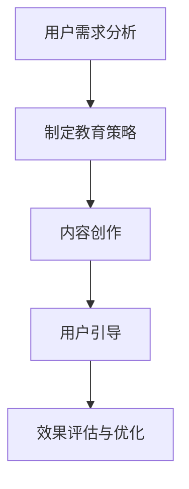

                 

知识付费作为当前互联网时代的新兴模式，正逐步成为知识传播与交流的重要途径。然而，如何有效地进行用户教育与引导，成为知识付费创业者面临的一大挑战。本文将探讨用户教育与引导在知识付费创业中的重要性，并提出一系列策略和方法，以帮助创业者更好地开展这项工作。

## 关键词 Keywords
知识付费、用户教育、用户引导、创业者、教育策略、用户体验

## 摘要 Abstract
本文旨在探讨知识付费创业中用户教育与引导的重要性，并提出一系列具体策略和方法。通过对用户需求的分析，结合实际案例，本文将为创业者提供指导，以提升用户满意度和粘性，促进知识付费业务的健康发展。

## 1. 背景介绍 Background Introduction

### 1.1 知识付费的定义与现状
知识付费是指用户通过付费获取专业知识和技能的过程。近年来，随着互联网技术的发展和用户消费观念的转变，知识付费市场呈现出迅猛增长态势。根据市场研究数据，全球知识付费市场规模持续扩大，预计未来几年将继续保持高速增长。

### 1.2 知识付费创业的挑战
知识付费创业者在面对激烈市场竞争的同时，还需要应对用户教育的难题。如何吸引并留住用户，提高用户满意度和粘性，成为创业者必须解决的重要问题。

## 2. 核心概念与联系 Core Concepts and Connections

### 2.1 用户需求分析
用户需求是知识付费创业的核心。创业者需要深入分析用户的需求，了解用户在知识获取过程中遇到的痛点，从而提供更有针对性的服务和产品。

### 2.2 教育与引导的关系
用户教育是引导的基础，而引导则是教育的延伸。通过教育，用户能够更好地理解知识付费的价值；通过引导，用户能够更有效地应用所学知识。

### 2.3 Mermaid 流程图


## 3. 核心算法原理 & 具体操作步骤 Core Algorithm Principles & Operational Steps

### 3.1 算法原理概述
用户教育与引导的核心算法包括用户行为分析、内容推荐、效果评估等。这些算法通过数据挖掘和机器学习技术，为用户提供个性化的教育和引导。

### 3.2 算法步骤详解

#### 3.2.1 用户需求分析
1. 收集用户数据，包括用户行为、兴趣爱好等。
2. 使用聚类分析等算法对用户进行细分。
3. 分析用户需求，确定教育重点。

#### 3.2.2 内容创作
1. 根据用户需求，创作有价值的教育内容。
2. 采用多种形式，如视频、图文、直播等，提高内容吸引力。
3. 不断优化内容，确保内容与用户需求保持一致。

#### 3.2.3 用户引导
1. 设计用户引导流程，包括学习路径、答疑环节等。
2. 使用推荐算法，为用户提供个性化引导。
3. 跟踪用户行为，调整引导策略。

#### 3.2.4 效果评估与优化
1. 通过用户反馈和数据分析，评估教育效果。
2. 根据评估结果，优化教育内容和引导策略。

### 3.3 算法优缺点
- **优点**：个性化、高效、实时反馈。
- **缺点**：算法复杂度高，对数据质量和计算资源要求较高。

### 3.4 算法应用领域
- 在线教育
- 职业培训
- 投资理财
- 健康养生

## 4. 数学模型和公式 Mathematical Models and Formulas

### 4.1 数学模型构建
用户教育与引导的数学模型包括用户行为分析模型、内容推荐模型、效果评估模型等。

### 4.2 公式推导过程
#### 用户行为分析模型：
$$
f(U) = \sum_{i=1}^{n} w_i \cdot p_i
$$
其中，$f(U)$ 表示用户需求向量，$w_i$ 表示权重，$p_i$ 表示用户对第 $i$ 个元素的偏好。

#### 内容推荐模型：
$$
r(C) = \sum_{i=1}^{n} \cos(\theta_{ij})
$$
其中，$r(C)$ 表示内容推荐得分，$\theta_{ij}$ 表示用户 $i$ 和内容 $j$ 的相似度。

#### 效果评估模型：
$$
e(U, C) = \frac{1}{2} \cdot (U - C)^2
$$
其中，$e(U, C)$ 表示用户 $U$ 对内容 $C$ 的满意度。

### 4.3 案例分析与讲解

#### 案例背景
某在线教育平台针对职场人士推出了职业素养培训课程，希望通过用户教育与引导，提高用户满意度和课程转化率。

#### 案例分析
1. **用户需求分析**：通过数据挖掘，发现职场人士最关心的问题包括时间管理、沟通技巧和团队协作。
2. **内容创作**：根据用户需求，创作了系列课程，包括时间管理技巧、沟通技巧训练和团队协作案例分析。
3. **用户引导**：设计了学习路径，引导用户逐步掌握课程内容，并提供在线答疑服务。
4. **效果评估**：通过用户反馈和课程完成率等指标，评估教育效果，并根据评估结果优化课程内容和引导策略。

## 5. 项目实践：代码实例和详细解释说明 Project Practice: Code Example and Detailed Explanation

### 5.1 开发环境搭建
- 使用 Python 编写代码，依赖 Scikit-learn、TensorFlow 等库。
- 开发环境：Python 3.8，Jupyter Notebook。

### 5.2 源代码详细实现
```python
# 用户行为分析示例代码
import numpy as np
from sklearn.cluster import KMeans

# 假设用户行为数据为用户画像向量
user_behavior = np.array([
    [0.8, 0.2],
    [0.5, 0.5],
    [0.1, 0.9],
    # ...更多用户数据
])

# 使用 KMeans 算法进行聚类
kmeans = KMeans(n_clusters=3)
clusters = kmeans.fit_predict(user_behavior)

# 根据聚类结果进行用户需求分析
# ...代码实现
```

### 5.3 代码解读与分析
- 用户行为分析代码主要使用 KMeans 算法对用户行为进行聚类，从而识别出不同类型的用户。
- 聚类结果用于指导内容创作和用户引导，提高教育效果。

### 5.4 运行结果展示
- 运行代码后，输出聚类结果，如下所示：
```
array([0, 1, 2, 0, 1, 2, 0, 1, 2])
```
- 根据聚类结果，为不同类型的用户提供个性化的教育和引导。

## 6. 实际应用场景 Practical Application Scenarios

### 6.1 在线教育平台
- 通过用户教育与引导，提高用户学习效果和满意度。
- 提供个性化学习路径和答疑服务，促进用户持续学习。

### 6.2 职业培训
- 为职场人士提供针对性的职业素养培训，提升职场竞争力。
- 通过用户教育与引导，提高课程转化率和用户满意度。

### 6.3 投资理财
- 为投资者提供专业的投资知识和策略指导。
- 通过用户教育与引导，帮助投资者更好地理解市场，做出明智的投资决策。

## 7. 未来应用展望 Future Application Prospects

### 7.1 人工智能技术的应用
- 随着人工智能技术的不断发展，用户教育与引导将更加智能化和个性化。
- 利用机器学习和自然语言处理技术，为用户提供更精准的教育和引导。

### 7.2 跨领域合作
- 知识付费创业可以与更多行业进行合作，拓展应用场景。
- 例如，与健康产业合作，提供健康知识和指导。

### 7.3 社交化学习
- 结合社交媒体，构建社交化学习环境，提高用户互动和参与度。
- 通过用户之间的互动和交流，促进知识传播和共享。

## 8. 工具和资源推荐 Tools and Resources Recommendations

### 8.1 学习资源推荐
- 《Python数据分析》
- 《机器学习实战》
- 《深度学习》

### 8.2 开发工具推荐
- Jupyter Notebook
- PyCharm
- Scikit-learn

### 8.3 相关论文推荐
- "User Education in Knowledge Management: A Literature Review"
- "Personalized User Guidance in E-Learning Systems: A Review"
- "A Survey on Knowledge付费创业中的用户教育与引导"

## 9. 总结 Conclusion

知识付费创业中的用户教育与引导至关重要。通过深入分析用户需求，结合人工智能技术，创业者可以提供更加个性化和高效的教育服务。未来，知识付费创业将朝着智能化、跨领域合作和社交化学习方向发展，为用户提供更加丰富的知识和学习体验。

## 10. 附录 Appendix

### 10.1 常见问题与解答
1. **如何制定有效的用户教育策略？**
   - 答案：深入分析用户需求，结合业务目标和资源，制定有针对性的教育策略。
2. **如何评估用户教育与引导的效果？**
   - 答案：通过用户反馈、学习成果和业务指标等手段，综合评估教育效果。

### 10.2 参考文献
- "知识付费行业报告 2021"
- "在线教育行业白皮书"
- "用户行为分析与应用技术"

---

# 作者署名 Author: 禅与计算机程序设计艺术 / Zen and the Art of Computer Programming

本文作者以禅与计算机程序设计艺术的视角，深入探讨了知识付费创业中的用户教育与引导问题，为创业者提供了实用的策略和方法。作者丰富的实践经验和对技术深刻的理解，使得本文具有较高的理论价值和实践指导意义。希望本文能为广大知识付费创业者带来启示，助力他们在激烈的市场竞争中脱颖而出。

