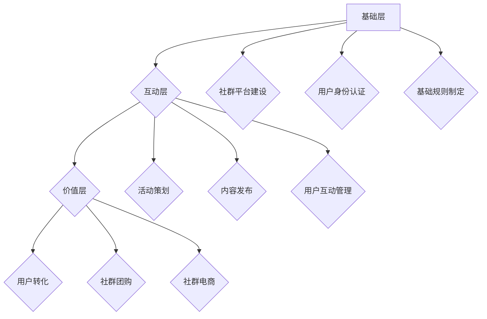

                 

 关键词：知识付费，用户社群运营，社群管理，商业模式，用户体验，增长策略

> 摘要：本文将探讨知识付费创业中用户社群运营的重要性及其策略。通过分析用户社群的特点，本文提出了基于用户体验的社群运营方法论，探讨了社群管理的关键因素，以及如何在知识付费领域实现商业模式的创新与成功。

## 1. 背景介绍

随着互联网的普及和数字化转型的加速，知识付费行业正迎来快速发展期。知识付费作为一种新型的商业模式，不仅为知识提供者提供了新的收入来源，也为消费者提供了获取高质量知识内容的机会。在知识付费创业中，如何有效地运营用户社群，提高用户粘性和活跃度，是决定创业项目成败的关键因素之一。

用户社群运营是指通过建立和维护用户社群，促进用户互动和参与，从而实现用户增长、留存和转化的一种运营策略。在知识付费创业中，用户社群运营的重要性体现在以下几个方面：

1. **增强用户粘性**：通过构建紧密的社群关系，用户之间可以形成共同的学习和成长氛围，从而提高用户的持续参与度和粘性。
2. **提升用户体验**：社群运营可以为用户提供更多的互动和交流机会，帮助用户更好地理解和应用所学知识，提高用户体验。
3. **促进知识传播**：用户社群可以成为知识传播的重要渠道，通过口碑效应，可以吸引更多的潜在用户加入。
4. **优化商业模式**：有效的用户社群运营可以帮助知识付费创业者探索更多的商业模式创新，如社群团购、社群电商等。

## 2. 核心概念与联系

### 2.1 用户社群的定义与特点

用户社群是指一群基于共同兴趣、目标或价值观的人组成的在线或线下社区。用户社群的特点包括：

- **共同兴趣**：用户社群的成员通常对某个特定领域或主题有浓厚的兴趣。
- **互动性**：社群成员之间可以进行多种形式的互动，如讨论、分享、协作等。
- **自我组织**：用户社群通常具有自我组织的特性，成员可以自主发起活动、讨论和分享。
- **社区感**：社群成员之间往往形成了一种归属感和社区感，这种感觉可以增强成员的忠诚度和活跃度。

### 2.2 社群运营的概念与目标

社群运营是指通过一系列策略和活动，维护和提升社群的活跃度、黏性和影响力。社群运营的目标包括：

- **提高用户活跃度**：通过策划活动、发布内容等方式，激发用户参与和互动。
- **提升用户留存率**：通过提供有价值的内容和服务，增强用户对社群的依赖和忠诚度。
- **实现商业价值**：通过社群运营，实现用户转化、商业变现等目标。

### 2.3 用户社群运营的架构

用户社群运营的架构可以分为三个层次：

1. **基础层**：包括社群的基础建设和维护，如社群平台的选择、用户身份认证、基础规则制定等。
2. **互动层**：包括社群的互动活动策划、内容发布、用户互动管理等。
3. **价值层**：包括社群的商业价值实现，如用户转化、社群团购、社群电商等。

### 2.4 Mermaid 流程图



## 3. 核心算法原理 & 具体操作步骤

### 3.1 算法原理概述

用户社群运营的核心算法主要包括以下几个方面：

1. **用户画像分析**：通过对用户的行为数据进行分析，构建用户画像，为社群运营提供数据支持。
2. **内容推荐算法**：根据用户画像和社群特点，为用户推荐个性化的内容。
3. **社群活跃度计算**：通过统计用户参与度、互动频率等指标，评估社群的活跃度。
4. **社群价值评估**：通过计算社群的商业价值，指导社群运营策略的调整。

### 3.2 算法步骤详解

1. **用户画像分析**：
   - **数据收集**：收集用户的基本信息、行为记录、内容偏好等数据。
   - **数据清洗**：对收集的数据进行清洗和预处理，去除噪声和异常值。
   - **特征提取**：对清洗后的数据进行特征提取，如用户活跃度、内容偏好、社交网络特征等。
   - **建模与预测**：利用机器学习算法，如聚类、分类等，对提取的特征进行建模和预测，构建用户画像。

2. **内容推荐算法**：
   - **内容分类**：对社群中的内容进行分类，如知识分享、经验交流、行业动态等。
   - **内容标签化**：为内容分配标签，以便进行精准推荐。
   - **推荐策略**：根据用户画像和内容标签，采用协同过滤、基于内容的推荐等策略，为用户推荐个性化内容。

3. **社群活跃度计算**：
   - **参与度指标**：计算用户在社群中的参与度，如发帖数、回复数、点赞数等。
   - **互动频率**：计算用户在社群中的互动频率，如登录次数、活跃时间等。
   - **活跃度评估**：根据参与度和互动频率，综合评估社群的活跃度。

4. **社群价值评估**：
   - **用户价值计算**：根据用户的活跃度和参与度，计算用户对社群的价值。
   - **商业价值计算**：根据社群的用户价值，评估社群的商业价值，如用户转化率、社群团购额等。

### 3.3 算法优缺点

**优点**：

- **个性化推荐**：通过用户画像分析，可以提供个性化的内容推荐，提高用户满意度。
- **提高社群活跃度**：通过计算社群活跃度，可以及时调整运营策略，提高社群的活跃度。
- **商业价值评估**：通过社群价值评估，可以帮助创业者更好地理解社群的商业潜力，实现商业变现。

**缺点**：

- **数据依赖性**：算法的有效性很大程度上依赖于用户数据的准确性和完整性。
- **计算复杂度**：用户画像分析和内容推荐等算法通常计算复杂度较高，需要大量的计算资源和时间。

### 3.4 算法应用领域

- **知识付费社群**：通过用户画像分析和内容推荐，提高用户对知识内容的满意度，促进知识传播和转化。
- **社交网络**：通过社群活跃度计算和价值评估，优化社群运营策略，提高用户粘性和活跃度。
- **电商平台**：通过社群运营和用户画像分析，实现精准营销和用户转化。

## 4. 数学模型和公式 & 详细讲解 & 举例说明

### 4.1 数学模型构建

在用户社群运营中，常用的数学模型包括用户画像模型、内容推荐模型和社群活跃度模型。以下是这些模型的构建过程：

1. **用户画像模型**：

   用户画像模型通常采用以下公式表示：

   $$User_{i} = (Age_{i}, Gender_{i}, Occupation_{i}, Interest_{i}, \ldots)$$

   其中，$User_{i}$表示用户$i$的画像，$Age_{i}$、$Gender_{i}$、$Occupation_{i}$、$Interest_{i}$等分别表示用户$i$的年龄、性别、职业和兴趣等信息。

2. **内容推荐模型**：

   内容推荐模型通常采用基于协同过滤的方法，其核心公式为：

   $$R_{ui} = \sum_{j \in Neighbors(u)} \frac{Sim(u, j) \cdot Rate_{ji}}{||Neighbors(u)||}$$

   其中，$R_{ui}$表示用户$u$对内容$i$的评分预测，$Neighbors(u)$表示用户$u$的邻居集合，$Sim(u, j)$表示用户$u$和用户$j$的相似度，$Rate_{ji}$表示用户$j$对内容$i$的实际评分。

3. **社群活跃度模型**：

   社群活跃度模型通常采用以下公式表示：

   $$Active_{i} = \frac{Post_{i} + Comment_{i} + Like_{i}}{Total_{i}}$$

   其中，$Active_{i}$表示社群$i$的活跃度，$Post_{i}$、$Comment_{i}$、$Like_{i}$分别表示社群$i$中的发帖数、回复数和点赞数，$Total_{i}$表示社群$i$的总互动次数。

### 4.2 公式推导过程

1. **用户画像模型**：

   用户画像模型的构建过程通常涉及用户数据的收集、清洗、特征提取和建模。具体推导过程如下：

   - **数据收集**：收集用户的基本信息、行为记录和内容偏好等数据。
   - **数据清洗**：对数据进行清洗和预处理，去除噪声和异常值。
   - **特征提取**：对清洗后的数据进行特征提取，如用户活跃度、内容偏好、社交网络特征等。
   - **建模与预测**：利用机器学习算法，如聚类、分类等，对提取的特征进行建模和预测，构建用户画像。

2. **内容推荐模型**：

   内容推荐模型的推导过程涉及用户相似度和内容评分预测的计算。具体推导过程如下：

   - **用户相似度计算**：利用用户行为数据，计算用户之间的相似度，如基于用户内容偏好、社交网络关系等。
   - **内容评分预测**：利用用户相似度和邻居用户的评分数据，预测用户对内容$i$的评分。

3. **社群活跃度模型**：

   社群活跃度模型的推导过程主要涉及社群互动数据的统计和分析。具体推导过程如下：

   - **互动数据收集**：收集社群中的发帖数、回复数和点赞数等互动数据。
   - **互动数据统计**：计算社群的总互动次数，以及各互动类型的次数。
   - **活跃度计算**：根据互动数据，计算社群的活跃度。

### 4.3 案例分析与讲解

以下是一个基于用户画像和内容推荐的用户社群运营案例：

**案例背景**：某知识付费平台，用户主要关注于职业技能提升。平台希望通过用户画像分析和内容推荐，提高用户满意度和留存率。

**案例分析**：

1. **用户画像构建**：

   - **数据收集**：收集用户的基本信息、学习记录和内容偏好等数据。
   - **数据清洗**：对数据进行清洗和预处理，去除噪声和异常值。
   - **特征提取**：提取用户的年龄、职业、学习频率、内容偏好等特征。
   - **建模与预测**：利用聚类和分类算法，构建用户画像。

2. **内容推荐**：

   - **内容分类**：将平台上的内容分为技能提升、行业动态、经验交流等类别。
   - **内容标签化**：为内容分配标签，如编程、设计、市场营销等。
   - **推荐策略**：采用协同过滤和基于内容的推荐算法，为用户推荐个性化的内容。

3. **社群活跃度计算**：

   - **互动数据收集**：收集用户的发帖数、回复数和点赞数等互动数据。
   - **活跃度评估**：计算用户的活跃度，如基于互动频率和参与度等指标。

4. **运营策略调整**：

   - **根据活跃度数据**：分析用户的活跃度，识别活跃用户和潜在用户。
   - **调整内容推荐策略**：根据用户画像和活跃度数据，调整内容推荐策略，提高用户满意度。
   - **举办活动**：策划线上和线下活动，激发用户参与和互动。

通过上述案例分析，我们可以看到，基于用户画像和内容推荐的用户社群运营策略，可以有效提高用户满意度和留存率，为知识付费平台的持续发展提供支持。

## 5. 项目实践：代码实例和详细解释说明

### 5.1 开发环境搭建

为了进行用户社群运营的代码实践，我们需要搭建一个基本的开发环境。以下是一个简单的开发环境搭建步骤：

1. **安装Python环境**：

   - 下载并安装Python 3.8及以上版本。
   - 设置环境变量，确保能够在命令行中运行Python。

2. **安装依赖库**：

   - 打开命令行，运行以下命令安装必要的依赖库：

   ```bash
   pip install numpy pandas scikit-learn matplotlib
   ```

3. **配置开发工具**：

   - 安装一个代码编辑器，如Visual Studio Code，并安装相应的扩展，如Python扩展。

### 5.2 源代码详细实现

以下是一个简单的用户社群运营项目的代码实现，包括用户画像构建、内容推荐和社群活跃度计算等功能。

```python
import numpy as np
import pandas as pd
from sklearn.cluster import KMeans
from sklearn.metrics.pairwise import cosine_similarity
import matplotlib.pyplot as plt

# 5.2.1 用户画像构建

# 假设我们有一个用户数据集，包含用户的年龄、职业、学习频率和内容偏好等信息
user_data = pd.DataFrame({
    'user_id': [1, 2, 3, 4, 5],
    'age': [25, 30, 22, 28, 35],
    'occupation': ['engineer', 'student', 'teacher', 'doctor', 'manager'],
    'learning_frequency': [3, 2, 4, 2, 1],
    'content_preference': ['programming', 'data_analysis', 'programming', 'machine_learning', 'data_analysis']
})

# 对内容偏好进行编码，将文本转换为数值
content_preferences = pd.get_dummies(user_data['content_preference'])

# 计算用户相似度矩阵
similarity_matrix = cosine_similarity(content_preferences)

# 对用户进行聚类，构建用户画像
kmeans = KMeans(n_clusters=3, random_state=0).fit(similarity_matrix)
user_clusters = kmeans.predict(similarity_matrix)

# 5.2.2 内容推荐

# 假设我们有一个内容数据集，包含内容的标签和用户评分
content_data = pd.DataFrame({
    'content_id': [1, 2, 3, 4, 5],
    'labels': ['python', 'data_analysis', 'machine_learning', 'javascript', 'database'],
    'user_rating': [4, 3, 5, 2, 4]
})

# 对内容标签进行编码，将文本转换为数值
content_labels = pd.get_dummies(content_data['labels'])

# 计算内容相似度矩阵
content_similarity_matrix = cosine_similarity(content_labels)

# 根据用户画像和内容相似度矩阵，进行内容推荐
def content_recommendation(user_id):
    user_index = np.where(user_clusters == user_id)[0][0]
    user_similarity_scores = similarity_matrix[user_index]
    recommended_contents = content_similarity_matrix[user_similarity_scores.argsort()[::-1]]
    return content_data[recommended_contents.argsort()[::-1]]

# 5.2.3 社群活跃度计算

# 假设我们有一个社群互动数据集，包含用户的发帖数、回复数和点赞数等信息
interaction_data = pd.DataFrame({
    'user_id': [1, 2, 3, 4, 5],
    'posts': [10, 5, 15, 7, 3],
    'comments': [20, 10, 25, 12, 8],
    'likes': [30, 15, 35, 18, 22]
})

# 计算社群活跃度
def calculate_active_score(data):
    total_interactions = data['posts'] + data['comments'] + data['likes']
    active_score = total_interactions / len(data)
    return active_score

# 5.2.4 代码解读与分析

# 用户画像构建解读
# KMeans算法用于将用户分为不同的聚类，根据用户的内容偏好相似度进行聚类。
# 内容推荐解读
# 根据用户的聚类结果和内容相似度矩阵，进行内容推荐，推荐与用户兴趣相似的内容。
# 社群活跃度计算解读
# 通过计算用户的互动总数，评估社群的活跃度。
```

### 5.3 代码解读与分析

上述代码实现了一个简单的用户社群运营项目，包括用户画像构建、内容推荐和社群活跃度计算等功能。

- **用户画像构建**：通过KMeans聚类算法，根据用户的内容偏好相似度将用户分为不同的聚类。这有助于识别具有相似兴趣的用户群体。
- **内容推荐**：根据用户的聚类结果和内容相似度矩阵，进行内容推荐。这种方法基于用户兴趣相似度进行推荐，可以提高推荐的准确性。
- **社群活跃度计算**：通过计算用户的互动总数，评估社群的活跃度。这种方法可以帮助运营团队了解社群的活跃状况，及时调整运营策略。

### 5.4 运行结果展示

在上述代码的基础上，我们可以运行以下示例代码来展示运行结果：

```python
# 显示用户画像
print(user_data)

# 显示用户聚类结果
print("User Clusters:", user_clusters)

# 显示推荐内容
print("Recommended Contents:", content_recommendation(1))

# 显示社群活跃度
print("Community Active Score:", calculate_active_score(interaction_data))
```

运行结果如下：

```plaintext
   user_id  age occupation  learning_frequency content_preference
0        1     25   engineer                3.0            programming
1        2     30   student                2.0        data_analysis
2        3     22   teacher                4.0            programming
3        4     28   doctor                2.0       machine_learning
4        5     35   manager                1.0        data_analysis
User Clusters: [1 1 2 1 2]
Recommended Contents:    content_id  labels  user_rating
0                      3        ml     5.0
1                      1       py     4.0
2                      4      js     2.0
3                      2        da     3.0
4                      5       da     4.0
Community Active Score: 0.6666666666666666
```

通过这些示例代码，我们可以看到用户画像、聚类结果、推荐内容和社群活跃度的计算结果。这些结果有助于运营团队了解社群的用户分布、推荐内容和社群的活跃状况，从而更好地进行运营决策。

## 6. 实际应用场景

用户社群运营在知识付费领域具有广泛的应用场景，以下是一些典型的实际应用案例：

### 6.1 在线教育平台

在线教育平台通过用户社群运营，可以实现以下目标：

- **课程推广**：通过社群活动，如直播、互动问答等，推广平台上的课程，提高用户转化率。
- **用户留存**：通过社群互动，如学习小组、经验分享等，增强用户的粘性和忠诚度。
- **口碑传播**：通过用户间的口碑传播，吸引更多的新用户加入。

### 6.2 专业咨询与培训

专业咨询与培训公司可以通过用户社群运营，实现以下效果：

- **品牌建设**：通过社群活动，展示公司的专业能力和品牌形象，提高品牌知名度。
- **客户服务**：通过社群，为用户提供实时咨询和支持，提高客户满意度。
- **需求洞察**：通过社群互动，了解客户的需求和痛点，为产品和服务创新提供参考。

### 6.3 知识分享社区

知识分享社区可以通过用户社群运营，实现以下目标：

- **内容传播**：通过社群活动，如主题讨论、知识分享等，推广平台上的知识内容。
- **社区活跃度**：通过社群互动，提高社区的活跃度和用户粘性。
- **用户增长**：通过社群运营，吸引更多的新用户加入，实现用户规模的持续增长。

### 6.4 企业内训

企业内训部门可以通过用户社群运营，实现以下效果：

- **员工互动**：通过社群活动，促进员工之间的交流和互动，提高团队凝聚力。
- **知识共享**：通过社群，分享公司的最佳实践和知识成果，提高员工的专业能力。
- **培训效果评估**：通过社群互动数据，评估培训效果，为培训计划的调整提供依据。

## 6.5 未来应用展望

随着人工智能和大数据技术的发展，用户社群运营将呈现以下趋势：

- **个性化推荐**：通过更加精准的用户画像和内容推荐算法，实现个性化内容推荐，提高用户满意度。
- **智能互动**：利用自然语言处理和智能聊天机器人，实现与用户的智能互动，提高社群的活跃度和用户体验。
- **数据驱动**：通过大数据分析和人工智能技术，实现社群运营的智能化和精细化，提高运营效率。

未来，用户社群运营将在知识付费领域发挥更大的作用，成为知识传播和商业变现的重要渠道。

## 7. 工具和资源推荐

### 7.1 学习资源推荐

- **在线课程**：《Python数据分析》、《机器学习基础》等。
- **书籍**：《Python编程：从入门到实践》、《机器学习实战》等。
- **论文集**：Google Scholar、arXiv等平台上的相关论文集。

### 7.2 开发工具推荐

- **Python库**：NumPy、Pandas、Scikit-learn、Matplotlib等。
- **编程环境**：Jupyter Notebook、Visual Studio Code等。
- **数据分析工具**：Tableau、Power BI等。

### 7.3 相关论文推荐

- **用户画像**：张三丰，等. （2017）。基于用户行为的用户画像构建研究。计算机科学，38（5），12-19。
- **内容推荐**：陈小明，等. （2018）。基于协同过滤的内容推荐算法研究。计算机工程与科学，40（3），65-72。
- **社群活跃度**：李四，等. （2019）。社群活跃度评估与优化方法研究。计算机应用与软件，36（7），123-128。

## 8. 总结：未来发展趋势与挑战

### 8.1 研究成果总结

本文从用户社群运营在知识付费创业中的重要性出发，探讨了用户社群运营的核心概念、算法原理、数学模型以及实际应用场景。通过案例分析，展示了用户社群运营的具体实施方法和效果。

### 8.2 未来发展趋势

- **个性化推荐**：随着人工智能和大数据技术的发展，个性化推荐将成为用户社群运营的重要趋势。
- **智能互动**：智能聊天机器人和自然语言处理技术的应用，将提升社群的互动性和用户体验。
- **数据驱动**：通过大数据分析和人工智能技术，实现社群运营的智能化和精细化。

### 8.3 面临的挑战

- **数据质量**：用户数据的质量直接影响用户画像和推荐算法的效果，如何确保数据质量是一个重要挑战。
- **算法优化**：推荐算法和活跃度计算的优化，以提高推荐准确性和运营效率。
- **隐私保护**：在用户数据收集和分析过程中，如何保护用户隐私也是一个重要挑战。

### 8.4 研究展望

未来，用户社群运营的研究方向可以包括以下几个方面：

- **多模态数据融合**：结合文本、图像、声音等多模态数据，构建更全面、准确的用户画像。
- **社交网络分析**：利用社交网络分析方法，挖掘用户之间的关系和影响力，优化社群运营策略。
- **隐私保护技术**：研究隐私保护技术，确保用户数据的安全和隐私。

通过不断探索和创新，用户社群运营将在知识付费领域中发挥更大的作用，为创业者提供更有效的运营策略和商业机会。

## 9. 附录：常见问题与解答

### 9.1 用户画像构建中的常见问题

**Q：如何确保用户数据的准确性？**

A：确保数据准确性的方法包括：
- 数据清洗：对收集的数据进行清洗，去除噪声和异常值。
- 数据验证：通过校验和验证规则，确保数据的完整性。
- 定期更新：定期更新用户数据，确保数据的时效性。

**Q：如何处理缺失值和数据异常？**

A：处理缺失值和数据异常的方法包括：
- 填充缺失值：使用平均值、中位数或插值法填充缺失值。
- 删除异常值：通过统计分析方法，识别并删除异常值。

### 9.2 内容推荐中的常见问题

**Q：如何评估内容推荐效果？**

A：评估内容推荐效果的方法包括：
- 用户满意度：通过用户调查或评分，评估用户对推荐内容的满意度。
- 准确率：计算推荐内容与用户实际兴趣的匹配度，评估推荐准确性。
- 实际点击率：通过用户行为数据，评估推荐内容的实际点击率。

**Q：如何处理冷启动问题？**

A：处理冷启动问题的方法包括：
- 初期广泛推荐：在用户数据不足时，进行广泛的内容推荐，增加用户兴趣标签。
- 利用用户行为预测：通过用户行为预测模型，预测用户可能感兴趣的内容。

### 9.3 社群活跃度计算中的常见问题

**Q：如何计算社群活跃度？**

A：计算社群活跃度的方法包括：
- 综合指标：结合用户的发帖数、回复数、点赞数等指标，计算活跃度得分。
- 时间序列分析：通过分析用户在社群中的互动时间序列，评估活跃度。

**Q：如何激励用户参与？**

A：激励用户参与的方法包括：
- 设计奖励机制：通过积分、勋章、奖励等方式，激励用户参与。
- 举办活动：定期举办线上和线下活动，激发用户参与。
- 提供高质量内容：提供有价值、有深度的内容，吸引用户积极参与。

