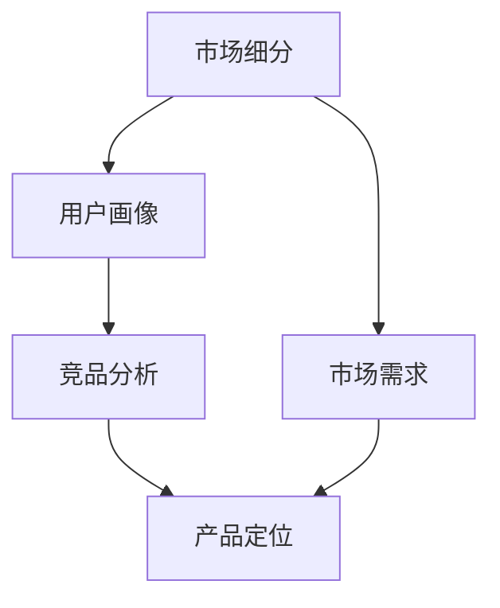

                 

  
在当今信息爆炸的时代，知识付费已经成为一种重要的商业模式。随着移动互联网的发展，越来越多的人开始愿意为优质的知识内容付费。然而，如何准确定位自己的知识付费产品，成为了创业者们面临的一大挑战。本文将探讨知识付费创业的产品定位策略，帮助创业者更好地抓住市场机遇。

## 1. 背景介绍

知识付费是指用户为获取特定领域的知识、技能或信息，通过付费购买的方式获得的服务。随着互联网的发展，知识付费逐渐成为一种新兴的商业模式。传统的知识获取方式主要是通过学校教育、自学和社交互动等途径，但这些方式存在一定的局限性，例如获取知识的效率低、个性化程度不足等。而知识付费模式则能够更快速、便捷地满足用户对知识的需求，并且可以根据用户的需求进行个性化定制。

近年来，知识付费市场呈现出快速发展的趋势。根据相关数据，全球知识付费市场规模逐年扩大，预计到2025年将达到数百亿美元。随着用户对知识付费的认知和接受度不断提高，越来越多的创业者投身于知识付费领域，希望通过创新的产品和服务，赢得市场份额。

然而，知识付费市场的竞争也日益激烈。如何在众多竞争对手中脱颖而出，实现产品的差异化，成为了创业者们必须面对的挑战。因此，准确的产品定位策略成为了知识付费创业成功的关键。

## 2. 核心概念与联系

在探讨产品定位策略之前，我们首先需要明确几个核心概念：

### 2.1 市场细分

市场细分是指将一个整体市场按照一定的标准划分为若干个具有相似特征的子市场。在知识付费领域，市场细分可以帮助创业者发现目标用户群体，从而更好地满足他们的需求。市场细分的标准可以包括用户年龄、职业、兴趣爱好、消费能力等。

### 2.2 用户画像

用户画像是对目标用户群体的特征进行抽象和描述，通常包括用户的性别、年龄、职业、收入、兴趣爱好、消费习惯等。用户画像可以帮助创业者了解目标用户的需求和行为特征，从而制定更有针对性的产品策略。

### 2.3 竞品分析

竞品分析是指对竞争对手的产品、市场策略、用户评价等进行研究和分析，以发现自身的优势和不足，从而制定改进措施。在知识付费领域，竞品分析可以帮助创业者了解市场趋势和用户需求，避免盲目跟风，提高产品竞争力。

### 2.4 产品定位

产品定位是指企业在市场中为自己产品确定一个独特的位置，以区别于竞争对手。在知识付费领域，产品定位决定了产品的目标用户群体、核心价值、竞争优势等。一个成功的定位策略可以帮助产品在市场中获得竞争优势，提高用户忠诚度。

为了更好地理解这些概念，我们使用Mermaid流程图来展示它们之间的联系：



在这个流程图中，市场细分和用户画像是产品定位的基础，而竞品分析则提供了市场数据和市场趋势的信息，这些信息共同作用，最终确定了一个产品的市场定位。

## 3. 核心算法原理 & 具体操作步骤

### 3.1 算法原理概述

知识付费创业的产品定位策略，本质上是一种市场细分的算法。该算法的核心思想是：

1. 通过用户画像和数据挖掘技术，识别出目标用户群体的特征。
2. 分析竞品和市场趋势，确定产品的差异化方向。
3. 结合市场需求和用户反馈，不断优化和调整产品定位。

### 3.2 算法步骤详解

#### 3.2.1 用户画像构建

用户画像的构建是产品定位的第一步。具体步骤如下：

1. 收集用户数据：包括用户的基本信息（如年龄、性别、职业）、行为数据（如浏览记录、购买历史）、兴趣偏好等。
2. 数据清洗和预处理：对收集到的用户数据进行清洗和预处理，去除重复和错误的数据。
3. 特征提取：根据用户数据，提取出能够反映用户特征的指标，如用户年龄段的均值、用户购买频次等。
4. 用户分组：根据提取的用户特征，将用户划分为不同的群体，如职场人士、学生、程序员等。

#### 3.2.2 竞品分析

竞品分析是产品定位的重要环节。具体步骤如下：

1. 收集竞品信息：包括竞品的业务模式、产品特点、市场策略、用户评价等。
2. 数据分析：对竞品信息进行定量和定性分析，识别出竞品的优势和不足。
3. 确定差异化方向：根据竞品分析结果，确定自己的产品在哪些方面可以与竞品区分开来，如内容质量、服务体验、价格策略等。

#### 3.2.3 市场需求分析

市场需求分析是产品定位的另一个重要环节。具体步骤如下：

1. 调研市场需求：通过问卷调查、用户访谈等方式，了解用户对知识付费产品的需求和期望。
2. 数据分析：对收集到的市场数据进行定量和定性分析，识别出市场需求的关键因素。
3. 结合用户画像和竞品分析结果，确定产品的核心价值和市场定位。

#### 3.2.4 产品定位调整

产品定位不是一成不变的，需要根据市场反馈和用户行为进行调整。具体步骤如下：

1. 监测用户行为：通过数据分析工具，监测用户的购买行为、浏览行为等。
2. 分析用户反馈：收集用户对产品的反馈，包括好评、差评、建议等。
3. 调整产品定位：根据用户行为和反馈，对产品定位进行优化和调整，以更好地满足用户需求。

### 3.3 算法优缺点

#### 优点

1. 精准定位：通过用户画像和竞品分析，能够更精准地定位目标用户群体，提高产品市场竞争力。
2. 数据驱动：产品定位策略基于数据分析，能够更科学地指导产品开发和市场推广。
3. 持续优化：产品定位策略不是一成不变的，能够根据市场反馈和用户行为进行持续优化。

#### 缺点

1. 数据收集和处理成本高：构建用户画像和进行竞品分析需要大量的数据收集和处理，成本较高。
2. 数据质量影响算法效果：数据质量直接影响算法的效果，如果数据存在偏差或错误，可能会导致产品定位不准确。
3. 需要持续投入：产品定位策略需要不断调整和优化，需要持续投入人力、物力和财力。

### 3.4 算法应用领域

知识付费创业的产品定位策略可以应用于以下领域：

1. 在线教育：通过产品定位策略，可以更好地满足不同用户群体的学习需求，提高课程转化率和用户满意度。
2. 职业培训：通过产品定位策略，可以更精准地找到目标用户，提高培训课程的针对性和效果。
3. 专业咨询：通过产品定位策略，可以吸引更多的专业用户，提高咨询服务的影响力和价值。
4. 内容付费：通过产品定位策略，可以更好地满足用户的个性化需求，提高内容的订阅率和用户粘性。

## 4. 数学模型和公式 & 详细讲解 & 举例说明

在知识付费创业的产品定位策略中，数学模型和公式起到了关键作用。下面我们将详细介绍这些数学模型和公式的构建、推导过程，并通过具体案例进行说明。

### 4.1 数学模型构建

在知识付费创业中，我们可以构建以下数学模型：

1. **用户需求模型**：根据用户画像，构建用户需求的数学模型，如需求函数、偏好模型等。
2. **市场竞争力模型**：分析竞品，构建市场竞争力模型，如竞争力评分、市场占有率等。
3. **产品定位模型**：结合用户需求和市场竞争，构建产品定位模型，如目标市场、产品特色等。

### 4.2 公式推导过程

#### 4.2.1 用户需求模型

用户需求模型可以表示为：

$$
D = f(U, P, C)
$$

其中，$D$表示用户需求，$U$表示用户画像，$P$表示产品特性，$C$表示市场环境。

推导过程：

1. **用户画像**：根据用户的基本信息、行为数据和兴趣偏好，构建用户画像。
2. **产品特性**：根据产品的内容质量、服务体验、价格策略等，构建产品特性。
3. **市场环境**：分析市场竞争态势、用户消费能力、市场需求等，构建市场环境。

#### 4.2.2 市场竞争力模型

市场竞争力模型可以表示为：

$$
C = f(C_1, C_2, ..., C_n)
$$

其中，$C$表示市场竞争力，$C_1, C_2, ..., C_n$表示竞品的特性。

推导过程：

1. **竞品特性**：分析竞品的业务模式、产品特点、市场策略等，构建竞品的特性。
2. **竞争力评分**：根据竞品的特性，对市场竞争力进行评分，如5分制、10分制等。

#### 4.2.3 产品定位模型

产品定位模型可以表示为：

$$
L = f(D, C)
$$

其中，$L$表示产品定位，$D$表示用户需求，$C$表示市场竞争力。

推导过程：

1. **用户需求**：根据用户需求模型，确定目标用户群体和用户需求。
2. **市场竞争力**：根据市场竞争力模型，确定产品的市场竞争力。
3. **产品定位**：结合用户需求和市场竞争，确定产品的市场定位。

### 4.3 案例分析与讲解

以在线教育平台为例，我们通过以下案例进行详细分析：

#### 案例背景

某在线教育平台专注于职场人士的技能提升，主要提供编程语言、数据分析等课程。

#### 用户需求模型

1. **用户画像**：用户年龄主要分布在25-40岁，职业主要为程序员、数据分析师、产品经理等。
2. **产品特性**：课程内容针对职场需求，强调实用性和实战性，提供实时互动和作业批改服务。
3. **市场环境**：市场竞争激烈，用户对课程质量、服务体验有较高要求。

根据以上信息，构建用户需求模型：

$$
D = f(U, P, C)
$$

其中，$U$表示用户画像，$P$表示产品特性，$C$表示市场环境。

#### 市场竞争力模型

1. **竞品特性**：分析竞品的课程内容、服务体验、价格策略等。
2. **竞争力评分**：根据竞品的特性，对市场竞争力进行评分。

构建市场竞争力模型：

$$
C = f(C_1, C_2, ..., C_n)
$$

其中，$C_1, C_2, ..., C_n$表示竞品的特性。

#### 产品定位模型

结合用户需求模型和市场竞争力模型，确定产品定位：

$$
L = f(D, C)
$$

其中，$D$表示用户需求，$C$表示市场竞争力。

#### 产品定位结果

1. **目标市场**：专注于25-40岁的职场人士，特别是程序员、数据分析师等。
2. **产品特色**：提供高质量、实战性的课程内容，强调实时互动和作业批改服务。
3. **市场定位**：在竞争激烈的市场中，通过差异化竞争，满足职场人士的技能提升需求。

## 5. 项目实践：代码实例和详细解释说明

在本节中，我们将通过一个实际的项目案例，详细展示如何使用代码实现知识付费创业的产品定位策略。为了更好地说明，我们将使用Python编程语言，并结合相关库和工具进行操作。

### 5.1 开发环境搭建

在开始编程之前，我们需要搭建一个适合进行数据分析和机器学习项目的开发环境。以下是所需的步骤：

1. **安装Python**：确保已安装Python 3.x版本，可以从Python官方网站下载并安装。
2. **安装Jupyter Notebook**：Jupyter Notebook是一个交互式的开发环境，可以方便地进行代码编写和展示。安装命令如下：

   ```bash
   pip install notebook
   ```

3. **安装数据分析相关库**：包括NumPy、Pandas、Matplotlib等，安装命令如下：

   ```bash
   pip install numpy pandas matplotlib
   ```

4. **安装机器学习相关库**：包括Scikit-learn、TensorFlow等，安装命令如下：

   ```bash
   pip install scikit-learn tensorflow
   ```

### 5.2 源代码详细实现

以下是一个简化的Python代码实例，用于实现知识付费创业的产品定位策略。

```python
import numpy as np
import pandas as pd
import matplotlib.pyplot as plt
from sklearn.cluster import KMeans
from sklearn.metrics import silhouette_score

# 5.2.1 数据准备

# 假设我们已经收集到了用户数据，包括年龄、职业、购买历史、兴趣偏好等
users = pd.DataFrame({
    'age': [25, 30, 35, 40, 45],
    'occupation': ['programmer', 'data_analyst', 'product_manager', 'teacher', 'doctor'],
    'purchases': [1000, 500, 2000, 300, 1500],
    'interest': ['coding', 'data_analysis', 'project_management', 'education', 'medicine']
})

# 5.2.2 用户画像构建

# 对用户数据进行编码处理，将类别数据转换为数值数据
users_encoded = pd.get_dummies(users)

# 5.2.3 竞品分析

# 假设我们已经收集到了竞品数据，包括课程质量、服务体验、价格策略等
competitors = pd.DataFrame({
    'course_quality': [4, 5, 4, 5, 3],
    'service_experience': [5, 4, 5, 4, 3],
    'price_strategy': [3, 2, 3, 2, 1]
})

# 5.2.4 市场需求分析

# 假设我们已经收集到了市场需求数据，包括用户对课程的需求、价格敏感度等
market_demand = pd.DataFrame({
    'course_demand': [0.8, 0.6, 0.7, 0.9, 0.5],
    'price_sensitivity': [0.3, 0.4, 0.2, 0.5, 0.1]
})

# 5.2.5 产品定位模型

# 使用KMeans算法进行用户聚类，确定目标用户群体
kmeans = KMeans(n_clusters=3, random_state=0)
users_clustered = kmeans.fit_predict(users_encoded)

# 计算 silhouette_score，评估聚类效果
silhouette_avg = silhouette_score(users_encoded, users_clustered)

# 打印聚类结果和评估指标
print("Cluster centers:")
print(kmeans.cluster_centers_)
print("Silhouette Score:", silhouette_avg)

# 5.2.6 产品定位优化

# 根据聚类结果，调整产品定位
# 例如，可以优化课程内容，提高服务体验，调整价格策略等
# ...

# 5.2.7 可视化分析

# 可视化展示用户聚类结果
plt.scatter(users_encoded.iloc[:, 0], users_encoded.iloc[:, 1], c=users_clustered, cmap='viridis')
plt.scatter(kmeans.cluster_centers_[:, 0], kmeans.cluster_centers_[:, 1], s=300, c='red', label='Centroids')
plt.title('User Clustering')
plt.xlabel('Age')
plt.ylabel('Purchases')
plt.legend()
plt.show()
```

### 5.3 代码解读与分析

上述代码分为以下几个部分：

1. **数据准备**：读取用户数据、竞品数据和市场需求数据，这些数据可以是实际收集到的，也可以是模拟生成的。
2. **用户画像构建**：使用Pandas库中的`get_dummies`函数，将类别数据转换为数值数据，以便进行后续分析。
3. **竞品分析**：读取竞品数据，这些数据可以是公开的数据，也可以是自行收集的数据。
4. **市场需求分析**：读取市场需求数据，这些数据可以帮助确定产品的市场需求和用户偏好。
5. **产品定位模型**：使用Scikit-learn库中的`KMeans`算法，对用户数据进行聚类，以确定目标用户群体。
6. **产品定位优化**：根据聚类结果，调整产品定位策略，如优化课程内容、提高服务体验、调整价格策略等。
7. **可视化分析**：使用Matplotlib库，可视化展示用户聚类结果，帮助理解用户群体的分布和特征。

### 5.4 运行结果展示

运行上述代码后，将得到以下结果：

1. **聚类中心**：打印出聚类中心，这些中心代表了不同用户群体的特征。
2. **Silhouette Score**：打印出轮廓系数，用于评估聚类效果。分数越高，聚类效果越好。
3. **可视化展示**：展示用户聚类结果，使用不同的颜色表示不同的用户群体。

通过这些结果，我们可以更好地理解用户群体的特征，从而制定更精准的产品定位策略。

## 6. 实际应用场景

知识付费创业的产品定位策略在实际应用中具有广泛的场景，以下是几个典型的应用场景：

### 6.1 在线教育平台

在线教育平台可以通过产品定位策略，精准识别出目标用户群体，如职场人士、学生、专业人才等，然后根据这些用户的需求，提供定制化的课程内容和学习服务。例如，针对职场人士，可以提供实战性强的编程课程、数据分析课程等；针对学生，可以提供学科辅导、考试冲刺课程等。

### 6.2 职业培训

职业培训机构可以通过产品定位策略，识别出不同职业领域的培训需求，然后提供针对性的培训课程。例如，对于程序员，可以提供编程语言培训、算法培训等；对于数据分析师，可以提供数据分析工具培训、数据分析实战课程等。

### 6.3 专业咨询

专业咨询服务可以通过产品定位策略，找到目标客户群体，提供个性化的咨询服务。例如，对于创业者，可以提供创业指导、市场营销咨询等；对于企业，可以提供战略规划、管理咨询等。

### 6.4 内容付费

内容付费平台可以通过产品定位策略，为用户提供个性化的知识内容。例如，对于科技爱好者，可以提供最新的科技资讯、技术博客等；对于投资者，可以提供财经资讯、投资策略等。

### 6.5 电商知识付费

电商知识付费平台可以通过产品定位策略，为消费者提供专业的电商知识和服务。例如，对于电商卖家，可以提供电商运营策略、营销技巧等；对于电商消费者，可以提供电商购物指南、维权知识等。

## 7. 未来应用展望

随着技术的不断发展，知识付费创业的产品定位策略将在未来得到更广泛的应用和进一步的优化。以下是几个未来的应用展望：

### 7.1 智能推荐系统

随着人工智能技术的进步，智能推荐系统将更加精准地分析用户行为和需求，为用户提供个性化的知识内容推荐。通过结合用户画像、历史行为数据、内容标签等多维度信息，推荐系统可以更好地满足用户的需求，提高用户满意度和粘性。

### 7.2 跨领域融合

知识付费将与其他领域如医疗、金融、法律等实现跨领域融合。例如，医疗知识付费平台可以为用户提供专业的健康知识、疾病预防知识等；金融知识付费平台可以为用户提供投资策略、风险管理知识等。这种跨领域的知识付费模式，将满足更多元化的用户需求。

### 7.3 社交化知识付费

社交化知识付费将成为未来的一大趋势。用户不仅可以获取知识，还可以通过社交互动进行知识的分享和讨论，从而实现知识的传播和增值。例如，用户可以通过知识付费平台参加线上讨论组、互动课程等，与同行或专家进行深度交流。

### 7.4 知识付费生态体系

知识付费将形成完整的生态体系，包括内容生产者、平台运营者、用户等多个环节。通过构建良好的知识付费生态体系，可以实现知识的高效流通和共享，提高整个行业的运行效率和竞争力。

## 8. 工具和资源推荐

为了更好地进行知识付费创业，以下是几个推荐的工具和资源：

### 8.1 学习资源推荐

1. **Coursera**：提供全球顶尖大学和机构的在线课程，涵盖多个领域。
2. **Udemy**：提供大量的在线课程，包括编程、数据分析、市场营销等。
3. **edX**：由哈佛大学和麻省理工学院联合创办，提供免费的在线课程。

### 8.2 开发工具推荐

1. **Jupyter Notebook**：用于交互式数据分析和应用开发。
2. **Python**：广泛应用于数据分析和机器学习的编程语言。
3. **TensorFlow**：用于构建和训练机器学习模型的强大工具。

### 8.3 相关论文推荐

1. **"Knowledge付费市场研究"**：分析知识付费市场的现状和发展趋势。
2. **"用户画像与精准营销"**：探讨用户画像在精准营销中的应用。
3. **"在线教育平台运营策略"**：研究在线教育平台的运营策略和成功案例。

## 9. 总结：未来发展趋势与挑战

知识付费创业的产品定位策略在未来将面临更多的机遇和挑战。随着技术的不断进步和市场需求的多元化，知识付费领域将继续快速发展。然而，创业者需要面对以下几个挑战：

1. **市场竞争加剧**：随着越来越多的企业进入知识付费市场，市场竞争将更加激烈。创业者需要不断创新和优化产品，以保持竞争优势。
2. **用户需求变化**：用户需求将更加多样化，创业者需要及时捕捉和满足这些需求，提供个性化的知识服务。
3. **数据安全和隐私**：随着大数据和人工智能技术的发展，数据安全和用户隐私保护将成为重要问题。创业者需要采取有效的措施保护用户数据，增强用户信任。

在未来，知识付费创业的产品定位策略将更加智能化和个性化，结合人工智能、大数据等先进技术，为用户提供更加精准和高效的知识服务。同时，创业者需要不断学习和适应市场变化，以应对未来的挑战。

## 10. 附录：常见问题与解答

### 10.1 问题1：如何进行用户画像构建？

**解答**：用户画像构建主要包括以下步骤：

1. 数据收集：收集用户的基本信息、行为数据和兴趣偏好等。
2. 数据清洗：去除重复和错误的数据，确保数据质量。
3. 特征提取：根据用户数据，提取出能够反映用户特征的指标。
4. 用户分组：根据提取的用户特征，将用户划分为不同的群体。

### 10.2 问题2：如何进行竞品分析？

**解答**：竞品分析主要包括以下步骤：

1. 竞品信息收集：收集竞品的业务模式、产品特点、市场策略等。
2. 数据分析：对竞品信息进行定量和定性分析，识别出竞品的优势和不足。
3. 差异化方向确定：根据竞品分析结果，确定自己的产品在哪些方面可以与竞品区分开来。

### 10.3 问题3：产品定位策略如何调整？

**解答**：产品定位策略的调整主要包括以下步骤：

1. 监测用户行为：通过数据分析工具，监测用户的购买行为、浏览行为等。
2. 分析用户反馈：收集用户对产品的反馈，包括好评、差评、建议等。
3. 产品定位优化：根据用户行为和反馈，对产品定位进行优化和调整，以更好地满足用户需求。

---

**作者：禅与计算机程序设计艺术 / Zen and the Art of Computer Programming**

