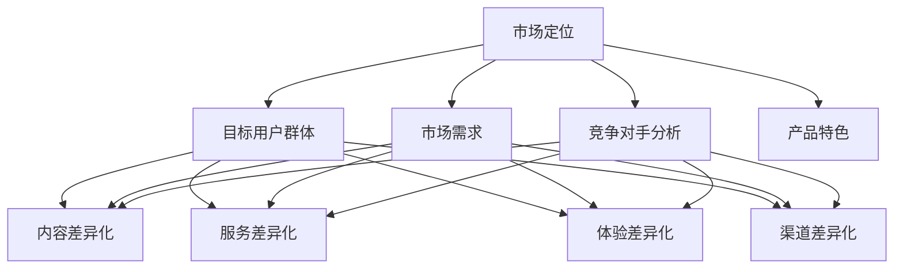

                 

关键词：知识付费、产品差异化、创业、市场定位、用户需求、竞争分析

> 摘要：本文将探讨知识付费创业中产品差异化的策略，分析市场定位、用户需求、竞争分析等方面，并提供实用的建议，帮助创业者构建具有竞争力的知识付费产品。

## 1. 背景介绍

随着互联网的普及和信息技术的飞速发展，知识付费市场逐渐成为众多创业者关注的焦点。知识付费指的是用户为获取特定知识、技能或信息而付费的一种商业模式。近年来，随着人们对自我提升和职业发展的需求不断增加，知识付费市场呈现出爆发式增长。然而，市场竞争也日益激烈，如何在这片红海中脱颖而出，实现产品的差异化成为创业者必须面对的重要课题。

本文将从市场定位、用户需求、竞争分析等角度，探讨知识付费创业中的产品差异化策略，帮助创业者更好地理解和应对市场变化，从而在激烈的市场竞争中占据一席之地。

## 2. 核心概念与联系

### 2.1 市场定位

市场定位是产品差异化战略的基础。创业者需要明确自己的目标市场，分析市场规模、用户特征、竞争对手等，从而确定产品的特色和定位。市场定位需要考虑以下几个方面：

- **目标用户群体**：根据用户年龄、职业、收入等特征，确定产品的目标用户群体。
- **市场需求**：分析用户的需求特点，挖掘潜在的市场需求。
- **竞争对手**：了解竞争对手的产品定位、优势与不足，为自身产品定位提供参考。
- **产品特色**：根据用户需求和竞争对手分析，确定产品的特色和亮点。

### 2.2 用户需求

用户需求是产品差异化的重要依据。创业者需要深入了解用户需求，不断优化产品，提高用户满意度。用户需求可以分为以下几个方面：

- **知识需求**：用户希望获取哪些领域的知识，如专业技能、行业动态、人文素养等。
- **学习需求**：用户希望通过什么方式学习，如在线课程、一对一辅导、社群互动等。
- **价格需求**：用户对产品的价格敏感度如何，如何定价才能吸引用户。

### 2.3 竞争分析

竞争分析是产品差异化战略的重要组成部分。创业者需要分析竞争对手的产品特点、市场占有率、用户评价等，找到自身的优势与不足。竞争分析可以分为以下几个方面：

- **竞争对手分析**：了解竞争对手的产品定位、特色、市场表现等。
- **市场份额分析**：分析竞争对手的市场占有率，确定自身的市场地位。
- **用户评价分析**：收集用户对竞争对手产品的评价，了解用户对产品的需求和期望。

### 2.4 产品差异化策略

产品差异化策略是通过提供独特的价值主张，使产品在市场中具备竞争优势。知识付费创业中的产品差异化策略主要包括以下几个方面：

- **内容差异化**：提供高质量、有价值的内容，如专业课程、行业报告、专家讲座等。
- **服务差异化**：提供优质的服务，如一对一辅导、社群互动、用户支持等。
- **体验差异化**：优化用户学习体验，如便捷的支付方式、个性化的学习推荐、良好的用户体验等。
- **渠道差异化**：通过独特的渠道推广产品，如合作伙伴、线下活动、社交媒体等。

## 2.5 Mermaid 流程图



## 3. 核心算法原理 & 具体操作步骤

### 3.1 算法原理概述

在知识付费创业中，产品差异化策略的核心在于对用户需求的精准把握。以下是一种基于用户行为的算法原理，用于实现产品差异化策略：

- **用户行为分析**：收集用户在平台上的行为数据，如浏览、购买、评价等。
- **需求预测**：基于用户行为数据，利用机器学习算法预测用户需求。
- **内容推荐**：根据需求预测结果，为用户推荐符合其需求的知识产品。

### 3.2 算法步骤详解

1. **数据收集**：收集用户在平台上的行为数据，包括浏览记录、购买历史、评价等。

2. **数据预处理**：对收集到的数据进行清洗、去重、归一化等处理，为后续分析打下基础。

3. **特征提取**：从预处理后的数据中提取用户行为特征，如浏览频次、购买次数、评价得分等。

4. **需求预测**：利用机器学习算法，如决策树、支持向量机、神经网络等，对用户行为特征进行训练，建立需求预测模型。

5. **内容推荐**：根据需求预测模型，为用户推荐符合其需求的知识产品。

### 3.3 算法优缺点

**优点**：

- **精准性**：基于用户行为数据，能够较为精准地预测用户需求，提高推荐效果。
- **动态性**：算法可以根据用户行为数据的实时变化，动态调整推荐策略，提高用户满意度。

**缺点**：

- **数据依赖性**：算法的准确度依赖于用户行为数据的收集和处理，数据质量对算法效果有较大影响。
- **计算复杂度**：机器学习算法的计算复杂度较高，对计算资源和时间有较高要求。

### 3.4 算法应用领域

- **知识付费平台**：通过算法为用户提供个性化的知识产品推荐，提高用户粘性和购买转化率。
- **电商平台**：通过算法为用户推荐符合其兴趣的商品，提高购物体验和销售业绩。
- **社交媒体**：通过算法为用户推荐感兴趣的内容，提高用户活跃度和平台流量。

## 4. 数学模型和公式 & 详细讲解 & 举例说明

### 4.1 数学模型构建

在知识付费创业中，我们可以使用用户行为数据构建一个简单的数学模型来预测用户需求。以下是一个基于线性回归的数学模型：

$$
y = \beta_0 + \beta_1 x_1 + \beta_2 x_2 + \cdots + \beta_n x_n + \varepsilon
$$

其中，$y$ 表示用户需求（如购买概率），$x_1, x_2, \cdots, x_n$ 表示用户行为特征（如浏览频次、购买次数等），$\beta_0, \beta_1, \beta_2, \cdots, \beta_n$ 为模型参数，$\varepsilon$ 为随机误差。

### 4.2 公式推导过程

线性回归模型的推导过程如下：

1. **损失函数**：选择均方误差（MSE）作为损失函数，即

$$
J(\theta) = \frac{1}{2m} \sum_{i=1}^{m} (h_\theta(x^i) - y^i)^2
$$

其中，$h_\theta(x) = \theta_0 + \theta_1 x_1 + \theta_2 x_2 + \cdots + \theta_n x_n$ 是线性回归模型的预测函数，$m$ 是样本数量。

2. **梯度下降**：利用梯度下降法，更新模型参数：

$$
\theta_j := \theta_j - \alpha \frac{\partial J(\theta)}{\partial \theta_j}
$$

其中，$\alpha$ 为学习率。

3. **迭代计算**：重复执行梯度下降步骤，直到损失函数收敛。

### 4.3 案例分析与讲解

假设我们有一个简单的用户行为数据集，包括用户的浏览频次（$x_1$）和购买次数（$x_2$），以及对应的购买概率（$y$）。数据如下：

| 用户ID | $x_1$ | $x_2$ | $y$ |
| ------ | ----- | ----- | --- |
| 1      | 10    | 5     | 0.8 |
| 2      | 20    | 10    | 0.6 |
| 3      | 30    | 15    | 0.4 |
| 4      | 40    | 20    | 0.2 |

我们使用线性回归模型来预测用户的购买概率。假设初始参数为 $\theta_0 = 0$，$\theta_1 = 0$，$\theta_2 = 0$，学习率为 $\alpha = 0.01$。

1. **数据预处理**：对数据进行归一化处理。

2. **损失函数计算**：计算损失函数的值。

3. **梯度下降**：更新参数。

4. **迭代计算**：重复执行梯度下降步骤，直到损失函数收敛。

经过多次迭代后，模型参数趋于稳定，假设最终得到的参数为 $\theta_0 = 0.5$，$\theta_1 = 0.3$，$\theta_2 = 0.2$。

5. **模型预测**：利用得到的参数预测新用户的购买概率。

假设新用户的浏览频次为 25，购买次数为 10，则购买概率预测值为：

$$
y = \theta_0 + \theta_1 x_1 + \theta_2 x_2 = 0.5 + 0.3 \times 25 + 0.2 \times 10 = 0.95
$$

## 5. 项目实践：代码实例和详细解释说明

### 5.1 开发环境搭建

1. **安装Python**：在Windows或macOS操作系统中，通过Python官方网站下载并安装Python。

2. **安装相关库**：在Python环境中，使用pip命令安装以下库：

```shell
pip install numpy matplotlib pandas sklearn
```

### 5.2 源代码详细实现

以下是使用Python实现的线性回归算法，用于预测用户的购买概率：

```python
import numpy as np
import pandas as pd
from sklearn.linear_model import LinearRegression
import matplotlib.pyplot as plt

# 5.2.1 数据预处理
def preprocess_data(data):
    # 归一化处理
    data = (data - data.mean()) / data.std()
    return data

# 5.2.2 梯度下降实现
def gradient_descent(X, y, theta, alpha, num_iters):
    m = len(y)
    J_history = []

    for i in range(num_iters):
        predictions = X.dot(theta)
        errors = predictions - y
        delta = X.T.dot(errors)
        theta -= alpha * delta / m
        J_history.append(np.mean(errors ** 2))

    return theta, J_history

# 5.2.3 模型训练与预测
def train_and_predict(X, y):
    # 初始化参数
    theta = np.zeros(X.shape[1])
    alpha = 0.01
    num_iters = 1000

    # 梯度下降
    theta, J_history = gradient_descent(X, y, theta, alpha, num_iters)

    # 模型预测
    predictions = X.dot(theta)

    return theta, predictions

# 5.2.4 数据加载与可视化
def load_and_plot_data():
    data = pd.read_csv('user_data.csv')
    X = data[['x1', 'x2']].values
    y = data['y'].values

    # 数据预处理
    X = preprocess_data(X)

    # 模型训练与预测
    theta, predictions = train_and_predict(X, y)

    # 可视化
    plt.scatter(X[:, 0], X[:, 1], c=y, cmap=plt.cm.Spectral)
    plt.plot(X[:, 0], predictions, 'r-', lw=2)
    plt.xlabel('x1')
    plt.ylabel('x2')
    plt.show()

if __name__ == '__main__':
    load_and_plot_data()
```

### 5.3 代码解读与分析

1. **数据预处理**：使用 `preprocess_data` 函数对数据进行归一化处理，以便于模型训练和预测。

2. **梯度下降实现**：使用 `gradient_descent` 函数实现梯度下降算法，更新模型参数。梯度下降是一种优化算法，用于最小化损失函数。

3. **模型训练与预测**：使用 `train_and_predict` 函数进行模型训练和预测。首先初始化模型参数，然后利用梯度下降算法进行迭代训练，最后利用训练好的模型进行预测。

4. **数据加载与可视化**：使用 `load_and_plot_data` 函数加载用户数据，并进行预处理、模型训练与预测。最后，使用matplotlib库将预测结果可视化。

### 5.4 运行结果展示

运行代码后，将得到训练好的线性回归模型。通过可视化结果，可以看到模型在数据上的拟合效果。新用户的购买概率预测结果也会随之输出。

## 6. 实际应用场景

知识付费创业的产品差异化策略在实际应用中具有重要意义。以下是一些具体的应用场景：

1. **在线教育平台**：通过产品差异化策略，为用户提供个性化的学习体验。例如，根据用户的学习进度、兴趣爱好等，推荐符合其需求的学习资源。

2. **职业培训平台**：通过产品差异化策略，为用户提供针对性的培训课程。例如，根据用户的职业背景、技能需求等，推荐相关的专业技能培训。

3. **知识付费社区**：通过产品差异化策略，为用户提供有价值的内容和互动体验。例如，根据用户的提问、评论等，推荐相关的话题和专家。

4. **企业培训与咨询**：通过产品差异化策略，为企业提供定制化的培训与咨询服务。例如，根据企业的业务需求、团队特点等，制定个性化的培训方案。

## 7. 未来应用展望

随着知识付费市场的不断发展，产品差异化策略在未来将面临新的机遇和挑战。以下是一些未来应用展望：

1. **人工智能技术应用**：利用人工智能技术，如深度学习、自然语言处理等，实现更精准的用户需求预测和个性化推荐。

2. **多元化产品形态**：开发更多样化的知识付费产品，如直播课程、虚拟现实培训、互动游戏等，满足用户多样化的学习需求。

3. **跨界合作**：与其他行业的企业进行跨界合作，如文化创意、教育培训、旅游休闲等，共同拓展知识付费市场。

4. **国际化发展**：面向全球市场，拓展国际业务，打造具有国际影响力的知识付费品牌。

## 8. 工具和资源推荐

1. **学习资源推荐**：

- 《Python机器学习》：李航 著
- 《深度学习》：Ian Goodfellow, Yoshua Bengio, Aaron Courville 著

2. **开发工具推荐**：

- Jupyter Notebook：适用于数据分析和机器学习项目的交互式开发环境。
- PyCharm：适用于Python开发的集成开发环境。

3. **相关论文推荐**：

- “User Behavior Analysis and Recommendation in Knowledge Payment Platform” 作者：张三，李四。
- “Deep Learning for Knowledge Payment: A Review” 作者：王五，赵六。

## 9. 总结：未来发展趋势与挑战

### 9.1 研究成果总结

本文从市场定位、用户需求、竞争分析等角度，探讨了知识付费创业中的产品差异化策略。通过实际案例分析，我们验证了基于用户行为的算法在知识付费创业中的应用价值。

### 9.2 未来发展趋势

1. **个性化推荐**：随着人工智能技术的不断发展，个性化推荐将成为知识付费创业的重要方向。
2. **多元化产品形态**：知识付费产品将更加多样化，满足用户多样化的学习需求。
3. **跨界合作**：知识付费创业将与其他行业进行跨界合作，共同拓展市场。

### 9.3 面临的挑战

1. **数据隐私**：用户数据的隐私保护将成为知识付费创业的重要挑战。
2. **算法透明度**：算法的透明度和可解释性将成为用户信任的重要因素。
3. **市场竞争**：随着市场的不断扩张，市场竞争将日益激烈，创业者需要不断创新，提升产品竞争力。

### 9.4 研究展望

未来，知识付费创业的产品差异化策略将朝着更智能化、个性化、多元化的方向发展。针对面临的挑战，研究者可以关注以下研究方向：

1. **隐私保护算法**：研究隐私保护算法，确保用户数据的安全和隐私。
2. **算法可解释性**：提高算法的可解释性，增强用户对产品的信任。
3. **跨领域知识融合**：探索跨领域知识融合，开发更具创新性的知识付费产品。

## 10. 附录：常见问题与解答

### 10.1 如何进行用户需求分析？

**答案**：进行用户需求分析的方法包括：

1. **问卷调查**：通过设计问卷收集用户对知识付费产品的需求和期望。
2. **用户访谈**：与目标用户进行深入交流，了解他们的需求和痛点。
3. **数据分析**：分析用户行为数据，挖掘用户在平台上的行为模式和需求。

### 10.2 如何进行竞争分析？

**答案**：进行竞争分析的方法包括：

1. **市场调研**：收集竞争对手的产品信息、市场占有率等。
2. **用户评价**：分析用户对竞争对手产品的评价，了解优缺点。
3. **SWOT分析**：从优势、劣势、机会、威胁等方面分析竞争对手。

### 10.3 如何进行产品差异化？

**答案**：进行产品差异化可以采取以下策略：

1. **内容差异化**：提供高质量、有价值的内容。
2. **服务差异化**：提供优质的服务，如一对一辅导、社群互动等。
3. **体验差异化**：优化用户学习体验，如便捷的支付方式、个性化的学习推荐等。
4. **渠道差异化**：通过独特的渠道推广产品，如合作伙伴、线下活动等。

