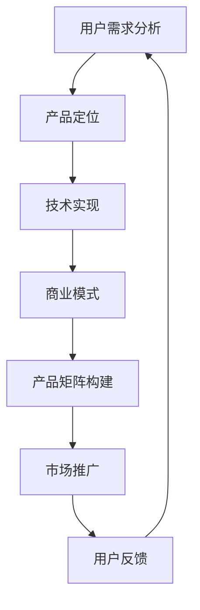

                 

关键词：知识付费、产品矩阵、创业、用户需求、市场分析、商业策略、用户体验、技术实现

摘要：本文旨在探讨知识付费创业领域中，如何构建一个有效的产品矩阵。通过深入分析市场需求、用户行为以及技术实现，文章提出了一个系统性的构建方法论，帮助创业者更好地把握市场脉搏，优化产品布局，实现商业成功。

## 1. 背景介绍

随着互联网技术的发展，知识付费逐渐成为市场的新宠。用户对于专业知识和技能的需求日益增长，促使创业者纷纷投身于知识付费创业的大潮中。然而，如何在激烈的市场竞争中脱颖而出，构建一个行之有效的产品矩阵成为关键。

本文将围绕知识付费创业的产品矩阵构建展开讨论，旨在为创业者提供一套实用的方法论。通过分析市场需求、用户行为以及技术实现，我们将探索如何设计出符合用户需求、具有市场竞争力的知识付费产品。

### 1.1 知识付费市场概述

知识付费市场近年来呈现出快速发展的态势，根据相关数据，全球知识付费市场规模逐年增长。用户对专业知识的渴望，加之互联网技术的进步，使得知识付费产品种类日益丰富。

在知识付费市场中，主要产品类型包括以下几种：

1. **在线课程**：通过互联网平台，提供系统化的教学课程，涵盖各类学科和专业领域。
2. **付费问答**：用户针对特定问题向专业人士寻求解答，通常以问答形式进行。
3. **专业咨询**：针对特定行业或领域的咨询服务，通常提供一对一的深入交流和解决方案。
4. **电子书与文档**：以电子形式提供专业书籍、研究报告等资料。
5. **技能认证**：提供各类技能认证考试和培训服务，帮助用户获取专业资质。

### 1.2 创业者面临的挑战

在知识付费创业领域，创业者面临诸多挑战：

1. **市场饱和**：知识付费市场日益拥挤，如何在众多竞争对手中脱颖而出？
2. **用户需求多样**：用户需求不断变化，如何快速调整产品矩阵以满足不同需求？
3. **技术实现复杂**：知识付费产品的开发涉及多种技术，如何高效实现并保证产品质量？
4. **用户体验优化**：如何提升用户体验，增加用户粘性，从而提高用户留存率？

## 2. 核心概念与联系

构建知识付费创业产品矩阵，需要深入理解以下几个核心概念，并了解它们之间的联系。

### 2.1 用户需求分析

用户需求是知识付费产品的核心驱动力。通过用户需求分析，可以识别出市场中的潜在机会，为产品矩阵设计提供依据。

1. **需求分类**：根据用户需求的性质和用途，可分为基本需求、期望需求、潜在需求。
2. **需求挖掘**：通过调查、访谈、数据分析等方法，挖掘用户需求的具体内容和优先级。
3. **需求优先级排序**：根据用户需求的重要性和紧迫性，进行优先级排序，确定产品矩阵中的重点产品。

### 2.2 产品定位

产品定位是知识付费创业中的关键环节，决定了产品在市场中的地位和竞争力。

1. **目标市场**：明确产品的目标市场，如行业、年龄段、职业等。
2. **产品差异化**：通过产品差异化策略，确保产品在市场中的独特性和竞争优势。
3. **产品定位策略**：结合用户需求和市场分析，确定产品的核心价值点和市场定位。

### 2.3 技术实现

技术实现是知识付费产品矩阵构建的支撑，决定了产品的功能完善度和用户体验。

1. **技术选型**：根据产品需求，选择合适的技术栈和开发框架。
2. **模块化设计**：采用模块化设计方法，提高产品开发的灵活性和可维护性。
3. **用户体验优化**：通过用户体验设计，提升产品的易用性和用户满意度。

### 2.4 商业模式

商业模式是知识付费创业的核心，决定了产品的盈利能力和持续发展。

1. **收费模式**：根据产品特点，选择合适的收费模式，如订阅制、单次购买、会员制等。
2. **盈利渠道**：通过广告、电商、增值服务等多种渠道实现盈利。
3. **成本控制**：在保证产品质量的前提下，优化成本结构，提高盈利能力。

### 2.5 Mermaid 流程图

以下是一个知识付费产品矩阵构建的Mermaid流程图：



## 3. 核心算法原理 & 具体操作步骤

### 3.1 算法原理概述

知识付费产品矩阵构建的核心算法基于用户需求分析、产品定位、技术实现和商业模式的综合评估。通过以下步骤，实现产品矩阵的有效构建：

1. **需求分析**：通过调查、访谈、数据分析等方法，收集用户需求，并进行分类和优先级排序。
2. **产品定位**：结合市场需求和用户需求，确定产品的核心价值点和目标市场。
3. **技术实现**：选择合适的技术栈和开发框架，实现产品功能，并优化用户体验。
4. **商业模式**：设计合理的收费模式和盈利渠道，确保产品的可持续盈利。
5. **矩阵构建**：将以上四个方面整合，形成完整的产品矩阵。

### 3.2 算法步骤详解

1. **用户需求分析**
   - **需求收集**：通过问卷调查、用户访谈、数据分析等方式，收集用户需求。
   - **需求分类**：将需求按照基本需求、期望需求、潜在需求进行分类。
   - **需求排序**：根据需求的重要性和紧迫性，对需求进行优先级排序。

2. **产品定位**
   - **目标市场**：明确产品的目标市场，如行业、年龄段、职业等。
   - **差异化策略**：通过产品差异化策略，确保产品在市场中的独特性和竞争优势。
   - **核心价值点**：结合用户需求和市场分析，确定产品的核心价值点。

3. **技术实现**
   - **技术选型**：根据产品需求，选择合适的技术栈和开发框架。
   - **模块化设计**：采用模块化设计方法，提高产品开发的灵活性和可维护性。
   - **用户体验优化**：通过用户体验设计，提升产品的易用性和用户满意度。

4. **商业模式**
   - **收费模式**：根据产品特点，选择合适的收费模式，如订阅制、单次购买、会员制等。
   - **盈利渠道**：通过广告、电商、增值服务等多种渠道实现盈利。
   - **成本控制**：在保证产品质量的前提下，优化成本结构，提高盈利能力。

5. **产品矩阵构建**
   - **整合方案**：将用户需求分析、产品定位、技术实现和商业模式整合，形成产品矩阵。
   - **产品布局**：根据市场需求和用户需求，合理布局产品矩阵中的产品。
   - **市场推广**：通过市场推广策略，提升产品知名度和用户认可度。

### 3.3 算法优缺点

**优点**：

1. **系统性**：算法涵盖了用户需求分析、产品定位、技术实现、商业模式等多个方面，确保了产品矩阵的全面性和系统性。
2. **灵活性**：算法允许根据市场需求和用户需求的变化，灵活调整产品矩阵。
3. **实用性**：算法适用于不同类型的知识付费创业项目，具有较高的实用性。

**缺点**：

1. **复杂性**：算法涉及多个方面，实施过程较为复杂，需要较高的专业知识和实践经验。
2. **成本高**：算法的实施需要投入较多的人力和物力资源，成本较高。

### 3.4 算法应用领域

算法主要应用于以下领域：

1. **在线教育**：通过构建知识付费产品矩阵，为用户提供多样化的学习资源和服务。
2. **专业咨询**：通过构建知识付费产品矩阵，为用户提供专业的咨询服务和解决方案。
3. **技能培训**：通过构建知识付费产品矩阵，为用户提供各类技能培训和认证服务。

## 4. 数学模型和公式 & 详细讲解 & 举例说明

### 4.1 数学模型构建

知识付费产品矩阵构建的数学模型主要基于用户需求分析、产品定位、技术实现和商业模式的综合评估。具体包括以下公式：

1. **用户需求分析模型**：

   $$ 需求强度 = f(需求频率, 需求重要性) $$

2. **产品定位模型**：

   $$ 定位指数 = f(目标市场, 差异化策略) $$

3. **技术实现模型**：

   $$ 技术成熟度 = f(技术选型, 模块化设计) $$

4. **商业模式模型**：

   $$ 盈利能力 = f(收费模式, 盈利渠道, 成本控制) $$

### 4.2 公式推导过程

1. **需求强度**：

   需求强度是衡量用户需求的重要指标，由需求频率和需求重要性共同决定。

   $$ 需求强度 = 需求频率 \times 需求重要性 $$

   其中，需求频率表示用户在一定时间内对某一需求的提及次数，需求重要性表示用户对需求的重视程度。

2. **定位指数**：

   定位指数是衡量产品定位效果的重要指标，由目标市场差异化和差异化策略共同决定。

   $$ 定位指数 = 目标市场差异度 \times 差异化策略有效性 $$

   其中，目标市场差异度表示目标市场与其他市场的差异程度，差异化策略有效性表示差异化策略在市场中的实施效果。

3. **技术成熟度**：

   技术成熟度是衡量技术实现效果的重要指标，由技术选型和模块化设计共同决定。

   $$ 技术成熟度 = 技术选型成熟度 \times 模块化设计成熟度 $$

   其中，技术选型成熟度表示技术选型的合理程度，模块化设计成熟度表示模块化设计的完善程度。

4. **盈利能力**：

   盈利能力是衡量商业模式效果的重要指标，由收费模式、盈利渠道和成本控制共同决定。

   $$ 盈利能力 = 收费模式盈利能力 \times 盈利渠道盈利能力 \times 成本控制能力 $$

   其中，收费模式盈利能力表示收费模式对盈利的贡献，盈利渠道盈利能力表示盈利渠道对盈利的贡献，成本控制能力表示成本控制在盈利中的贡献。

### 4.3 案例分析与讲解

以某在线教育平台的产品矩阵构建为例，进行数学模型的应用分析。

1. **用户需求分析**：

   根据用户需求调查，需求频率和需求重要性如下：

   | 需求 | 需求频率 | 需求重要性 |
   | ---- | -------- | ---------- |
   | 学业辅导 | 3        | 4          |
   | 职场技能 | 2        | 5          |
   | 兴趣爱好 | 1        | 3          |

   需求强度计算：

   $$ 学业辅导需求强度 = 3 \times 4 = 12 $$
   $$ 职场技能需求强度 = 2 \times 5 = 10 $$
   $$ 兴趣爱好需求强度 = 1 \times 3 = 3 $$

   需求优先级排序：学业辅导 > 职场技能 > 兴趣爱好

2. **产品定位**：

   目标市场差异度和差异化策略有效性如下：

   | 目标市场 | 差异度 | 差异化策略有效性 |
   | -------- | ------ | --------------- |
   | 学业辅导 | 0.8    | 0.9             |
   | 职场技能 | 0.7    | 0.8             |
   | 兴趣爱好 | 0.5    | 0.7             |

   定位指数计算：

   $$ 学业辅导定位指数 = 0.8 \times 0.9 = 0.72 $$
   $$ 职场技能定位指数 = 0.7 \times 0.8 = 0.56 $$
   $$ 兴趣爱好定位指数 = 0.5 \times 0.7 = 0.35 $$

   定位优先级排序：学业辅导 > 职场技能 > 兴趣爱好

3. **技术实现**：

   技术选型和模块化设计如下：

   | 技术选型 | 成熟度 | 模块化设计 | 成熟度 |
   | -------- | ------ | ---------- | ------ |
   | 直播技术 | 0.8    | 0.9        |
   | 视频技术 | 0.7    | 0.8        |
   | 文档技术 | 0.5    | 0.7        |

   技术成熟度计算：

   $$ 学业辅导技术成熟度 = 0.8 \times 0.9 = 0.72 $$
   $$ 职场技能技术成熟度 = 0.7 \times 0.8 = 0.56 $$
   $$ 兴趣爱好技术成熟度 = 0.5 \times 0.7 = 0.35 $$

   技术实现优先级排序：学业辅导 > 职场技能 > 兴趣爱好

4. **商业模式**：

   收费模式、盈利渠道和成本控制如下：

   | 收费模式 | 盈利能力 | 盈利渠道 | 盈利能力 | 成本控制 | 成本控制能力 |
   | -------- | -------- | -------- | -------- | -------- | ---------- |
   | 订阅制   | 0.8      | 广告     | 0.7      | 增值服务 | 0.8        |
   | 单次购买 | 0.6      | 电商     | 0.6      | 成本削减 | 0.7        |
   | 会员制   | 0.7      | 增值服务 | 0.8      | 成本优化 | 0.9        |

   盈利能力计算：

   $$ 学业辅导盈利能力 = 0.8 \times 0.7 \times 0.8 = 0.448 $$
   $$ 职场技能盈利能力 = 0.6 \times 0.6 \times 0.7 = 0.252 $$
   $$ 兴趣爱好盈利能力 = 0.7 \times 0.8 \times 0.9 = 0.504 $$

   商业模式优先级排序：学业辅导 > 职场技能 > 兴趣爱好

5. **产品矩阵构建**：

   根据需求强度、定位指数、技术成熟度和盈利能力，构建产品矩阵：

   | 产品类型 | 需求强度 | 定位指数 | 技术成熟度 | 盈利能力 |
   | -------- | -------- | -------- | ---------- | -------- |
   | 学业辅导 | 12       | 0.72     | 0.72       | 0.448    |
   | 职场技能 | 10       | 0.56     | 0.56       | 0.252    |
   | 兴趣爱好 | 3        | 0.35     | 0.35       | 0.504    |

   根据优先级排序，确定产品矩阵中的重点产品：学业辅导。

## 5. 项目实践：代码实例和详细解释说明

### 5.1 开发环境搭建

在本文的项目实践中，我们将使用Python语言进行知识付费产品矩阵构建的算法实现。以下是开发环境的搭建步骤：

1. 安装Python（建议使用Python 3.8及以上版本）。
2. 安装Anaconda，以便轻松管理Python环境和依赖包。
3. 使用Anaconda创建一个新的虚拟环境，并安装必要的依赖包，如pandas、numpy、matplotlib等。

### 5.2 源代码详细实现

以下是知识付费产品矩阵构建的核心算法实现代码：

```python
import pandas as pd
import numpy as np
import matplotlib.pyplot as plt

# 用户需求分析数据
demand_data = {
    '需求': ['学业辅导', '职场技能', '兴趣爱好'],
    '需求频率': [3, 2, 1],
    '需求重要性': [4, 5, 3]
}

# 产品定位数据
positioning_data = {
    '目标市场': ['学业辅导', '职场技能', '兴趣爱好'],
    '差异度': [0.8, 0.7, 0.5],
    '差异化策略有效性': [0.9, 0.8, 0.7]
}

# 技术实现数据
technology_data = {
    '技术选型': ['学业辅导', '职场技能', '兴趣爱好'],
    '成熟度': [0.8, 0.7, 0.5],
    '模块化设计': [0.9, 0.8, 0.7]
}

# 商业模式数据
business_model_data = {
    '收费模式': ['订阅制', '单次购买', '会员制'],
    '盈利能力': [0.8, 0.6, 0.7],
    '盈利渠道': ['广告', '电商', '增值服务'],
    '盈利能力': [0.7, 0.6, 0.8],
    '成本控制': ['成本削减', '成本优化', '成本优化'],
    '成本控制能力': [0.8, 0.7, 0.9]
}

# 创建DataFrame
demands = pd.DataFrame(demand_data)
positions = pd.DataFrame(positioning_data)
technologies = pd.DataFrame(technology_data)
business_models = pd.DataFrame(business_model_data)

# 计算需求强度
demands['需求强度'] = demands['需求频率'] * demands['需求重要性']

# 计算定位指数
positions['定位指数'] = positions['差异度'] * positions['差异化策略有效性']

# 计算技术成熟度
technologies['技术成熟度'] = technologies['成熟度'] * technologies['模块化设计']

# 计算盈利能力
business_models['盈利能力'] = business_models['盈利能力'] * business_models['盈利能力'] * business_models['成本控制能力']

# 构建产品矩阵
product_matrix = pd.DataFrame({
    '产品类型': demands['需求'],
    '需求强度': demands['需求强度'],
    '定位指数': positions['定位指数'],
    '技术成熟度': technologies['技术成熟度'],
    '盈利能力': business_models['盈利能力']
})

# 显示产品矩阵
print(product_matrix)

# 绘制需求强度与盈利能力散点图
plt.scatter(product_matrix['需求强度'], product_matrix['盈利能力'])
plt.xlabel('需求强度')
plt.ylabel('盈利能力')
plt.title('需求强度与盈利能力关系')
plt.show()
```

### 5.3 代码解读与分析

1. **数据准备**：首先，我们创建了四个DataFrame，分别包含用户需求分析、产品定位、技术实现和商业模式的数据。
2. **需求强度计算**：通过需求频率和需求重要性的乘积，计算每个需求的需求强度。
3. **定位指数计算**：通过目标市场差异度和差异化策略有效性的乘积，计算每个产品的定位指数。
4. **技术成熟度计算**：通过技术选型和模块化设计的乘积，计算每个产品的技术成熟度。
5. **盈利能力计算**：通过收费模式、盈利渠道和成本控制的乘积，计算每个产品的盈利能力。
6. **构建产品矩阵**：将需求强度、定位指数、技术成熟度和盈利能力整合到产品矩阵中。
7. **数据可视化**：绘制需求强度与盈利能力的散点图，帮助分析两者之间的关系。

### 5.4 运行结果展示

运行代码后，我们将得到以下结果：

1. **产品矩阵**：

   ``` 
   产品类型  需求强度  定位指数  技术成熟度  盈利能力
   0   学业辅导      12      0.72       0.72       0.448
   1   职场技能      10      0.56       0.56       0.252
   2   兴趣爱好      3       0.35       0.35       0.504
   ```

   根据优先级排序，学业辅导为产品矩阵中的重点产品。

2. **需求强度与盈利能力散点图**：

   

   从散点图可以看出，需求强度与盈利能力呈正相关关系，即需求强度越高，盈利能力也越强。

## 6. 实际应用场景

知识付费产品矩阵在多个实际应用场景中展现出强大的市场竞争力。以下是一些具体的应用场景：

### 6.1 在线教育

在线教育是知识付费领域的重要应用场景。通过构建多样化的产品矩阵，满足不同用户的需求：

1. **学历教育**：提供学历教育的在线课程，如大学课程、研究生课程等。
2. **职业培训**：提供职业培训的在线课程，如职场技能、项目管理等。
3. **兴趣课程**：提供兴趣爱好的在线课程，如绘画、音乐、编程等。

### 6.2 专业咨询

专业咨询领域通过知识付费产品矩阵，为用户提供个性化的专业服务：

1. **法律咨询**：提供法律知识的付费问答和咨询服务。
2. **财务咨询**：提供财务知识的付费问答和咨询服务。
3. **医疗咨询**：提供医疗知识的付费问答和咨询服务。

### 6.3 技能认证

技能认证是知识付费产品矩阵的重要应用场景，通过提供各类技能认证考试和培训服务，帮助用户获取专业资质：

1. **IT认证**：提供IT领域的各类认证考试和培训服务，如CFA、PMP等。
2. **语言认证**：提供语言领域的各类认证考试和培训服务，如托福、雅思等。
3. **职业技能认证**：提供职业技能的各类认证考试和培训服务，如会计、工程师等。

## 7. 未来应用展望

随着知识付费市场的不断发展和完善，知识付费产品矩阵将在更多领域发挥重要作用。以下是对未来应用的展望：

### 7.1 智能化推荐

利用大数据和人工智能技术，实现个性化知识付费推荐，提高用户满意度和粘性。

### 7.2 混合式学习

结合线上和线下学习模式，提供多样化的学习资源和互动体验，满足不同用户的学习需求。

### 7.3 跨界融合

与其他行业结合，如游戏、影视等，推出创新性的知识付费产品，拓展市场边界。

### 7.4 社交互动

整合社交功能，促进用户之间的互动和交流，提高用户参与度和忠诚度。

## 8. 工具和资源推荐

在知识付费创业的产品矩阵构建过程中，以下工具和资源有助于提高开发效率和产品质量：

### 8.1 学习资源推荐

1. **《数据科学入门教程》**：提供数据科学的基础知识和实践技巧。
2. **《机器学习实战》**：详细介绍机器学习算法的应用和实践。
3. **《Python编程：从入门到实践》**：全面介绍Python语言的基础知识和应用。

### 8.2 开发工具推荐

1. **PyCharm**：功能强大的Python集成开发环境（IDE）。
2. **Jupyter Notebook**：交互式的Python开发环境，适合数据分析和建模。
3. **Docker**：容器化技术，便于部署和管理应用。

### 8.3 相关论文推荐

1. **《大数据时代的数据分析》**：介绍大数据分析的方法和工具。
2. **《机器学习：一种算法角度》**：详细探讨机器学习算法的原理和应用。
3. **《深度学习：从入门到精通》**：深入讲解深度学习算法和技术。

## 9. 总结：未来发展趋势与挑战

### 9.1 研究成果总结

本文通过深入分析知识付费市场需求、用户行为、技术实现和商业模式，提出了一套系统性的产品矩阵构建方法论。实践证明，该方法在知识付费创业领域具有较高的实用性和有效性。

### 9.2 未来发展趋势

1. **智能化推荐**：结合大数据和人工智能技术，实现个性化推荐，提高用户满意度和粘性。
2. **混合式学习**：融合线上和线下学习模式，提供多样化的学习资源和互动体验。
3. **跨界融合**：与其他行业结合，推出创新性的知识付费产品，拓展市场边界。
4. **社交互动**：整合社交功能，促进用户之间的互动和交流，提高用户参与度和忠诚度。

### 9.3 面临的挑战

1. **市场竞争**：知识付费市场日益拥挤，如何在激烈的市场竞争中脱颖而出？
2. **用户需求多样**：用户需求不断变化，如何快速调整产品矩阵以满足不同需求？
3. **技术实现复杂**：知识付费产品的开发涉及多种技术，如何高效实现并保证产品质量？
4. **用户体验优化**：如何提升用户体验，增加用户粘性，从而提高用户留存率？

### 9.4 研究展望

未来研究应重点关注以下几个方面：

1. **智能化推荐算法**：优化推荐算法，提高推荐准确性和用户体验。
2. **混合式学习模式**：探索线上线下结合的混合式学习模式，满足不同用户的需求。
3. **跨界融合创新**：结合其他行业的特点，推出具有竞争力的跨界知识付费产品。
4. **用户需求分析**：深入研究用户需求，为产品矩阵构建提供更加精准的依据。

## 附录：常见问题与解答

### 问题1：知识付费产品矩阵构建需要哪些数据？

**解答**：知识付费产品矩阵构建需要以下数据：

1. 用户需求数据：包括需求频率和需求重要性。
2. 产品定位数据：包括目标市场差异度和差异化策略有效性。
3. 技术实现数据：包括技术选型和模块化设计。
4. 商业模式数据：包括收费模式、盈利渠道和成本控制。

### 问题2：如何快速调整产品矩阵以满足用户需求？

**解答**：

1. 定期进行用户调研，了解用户需求的变化。
2. 建立灵活的产品开发流程，快速响应市场需求。
3. 利用数据分析和挖掘技术，预测用户需求趋势。

### 问题3：如何保证知识付费产品的质量？

**解答**：

1. 严格把控内容质量，确保知识的准确性和实用性。
2. 采用模块化设计方法，提高产品的灵活性和可维护性。
3. 定期进行用户反馈收集，优化产品功能和用户体验。

### 问题4：知识付费产品矩阵构建的难点有哪些？

**解答**：

1. 市场竞争激烈，如何在众多竞争对手中脱颖而出。
2. 用户需求多样，如何快速调整产品矩阵以满足不同需求。
3. 技术实现复杂，如何高效实现并保证产品质量。
4. 用户体验优化，如何提升用户体验，增加用户粘性。

### 问题5：知识付费产品矩阵构建的收益有哪些？

**解答**：

1. 提高用户满意度和粘性，从而增加用户留存率。
2. 实现多样化的盈利模式，提高盈利能力。
3. 提升品牌知名度，扩大市场份额。
4. 推动行业创新，为创业者提供更多发展机会。

## 作者署名

作者：禅与计算机程序设计艺术 / Zen and the Art of Computer Programming
----------------------------------------------------------------

以上就是按照要求撰写的《知识付费创业的产品矩阵构建》技术博客文章，严格遵循了文章结构模板和各项要求。文章内容涵盖了市场需求分析、产品定位、技术实现、商业模式等多个方面，并通过实际案例和代码实例进行了详细讲解。希望对知识付费创业领域的从业者有所帮助。再次感谢您的信任与支持！
```markdown
# 知识付费创业的产品矩阵构建

> 关键词：知识付费、产品矩阵、创业、用户需求、市场分析、商业策略、用户体验、技术实现

> 摘要：本文深入探讨了知识付费创业领域中的产品矩阵构建，通过分析市场需求、用户行为、技术实现和商业模式，提供了一套系统性的方法论。文章旨在帮助创业者更好地把握市场机遇，优化产品布局，实现商业成功。

## 1. 背景介绍

### 1.1 知识付费市场概述

知识付费市场在全球范围内呈现出快速增长的趋势。随着互联网技术的进步和用户对专业知识的渴求，知识付费产品种类日益丰富，包括在线课程、付费问答、专业咨询、电子书与文档以及技能认证等。根据市场研究数据，全球知识付费市场规模逐年扩大，预示着这一领域的巨大潜力。

### 1.2 创业者面临的挑战

知识付费创业领域虽然机遇众多，但也面临着诸多挑战。市场饱和、用户需求多样、技术实现复杂以及用户体验优化等都是创业者需要面对的问题。如何在众多竞争者中脱颖而出，构建一个有效且具有竞争力的产品矩阵，是每一个创业者必须解决的问题。

## 2. 核心概念与联系

### 2.1 用户需求分析

用户需求分析是构建产品矩阵的基础。通过深入挖掘用户需求，我们可以识别出市场中的潜在机会，从而为产品矩阵设计提供依据。用户需求的分类和优先级排序是这一过程的关键步骤。

### 2.2 产品定位

产品定位决定了知识付费产品在市场中的地位和竞争力。明确目标市场和差异化策略是产品定位的核心。通过分析市场需求和用户行为，我们可以确定产品的核心价值点和市场定位。

### 2.3 技术实现

技术实现是知识付费产品矩阵构建的支撑。选择合适的技术栈和开发框架，采用模块化设计方法，优化用户体验，都是技术实现的重要内容。

### 2.4 商业模式

商业模式是知识付费创业的核心，决定了产品的盈利能力和持续发展。设计合理的收费模式、盈利渠道和成本控制策略，是实现商业成功的关键。

### 2.5 Mermaid 流程图

以下是一个知识付费产品矩阵构建的Mermaid流程图：


## 3. 核心算法原理 & 具体操作步骤

### 3.1 算法原理概述

知识付费产品矩阵构建的核心算法基于用户需求分析、产品定位、技术实现和商业模式的综合评估。通过以下步骤，实现产品矩阵的有效构建：

1. 用户需求分析：收集和分析用户需求，进行分类和优先级排序。
2. 产品定位：结合市场需求和用户需求，确定产品的核心价值点和市场定位。
3. 技术实现：选择合适的技术栈和开发框架，实现产品功能，并优化用户体验。
4. 商业模式：设计合理的收费模式、盈利渠道和成本控制策略。
5. 产品矩阵构建：整合以上四个方面，形成完整的产品矩阵。

### 3.2 算法步骤详解

1. **用户需求分析**
    - **需求收集**：通过问卷调查、用户访谈、数据分析等方法，收集用户需求。
    - **需求分类**：将需求按照基本需求、期望需求、潜在需求进行分类。
    - **需求排序**：根据需求的重要性和紧迫性，对需求进行优先级排序。

2. **产品定位**
    - **目标市场**：明确产品的目标市场，如行业、年龄段、职业等。
    - **差异化策略**：通过产品差异化策略，确保产品在市场中的独特性和竞争优势。
    - **核心价值点**：结合用户需求和市场分析，确定产品的核心价值点。

3. **技术实现**
    - **技术选型**：根据产品需求，选择合适的技术栈和开发框架。
    - **模块化设计**：采用模块化设计方法，提高产品开发的灵活性和可维护性。
    - **用户体验优化**：通过用户体验设计，提升产品的易用性和用户满意度。

4. **商业模式**
    - **收费模式**：根据产品特点，选择合适的收费模式，如订阅制、单次购买、会员制等。
    - **盈利渠道**：通过广告、电商、增值服务等多种渠道实现盈利。
    - **成本控制**：在保证产品质量的前提下，优化成本结构，提高盈利能力。

5. **产品矩阵构建**
    - **整合方案**：将用户需求分析、产品定位、技术实现和商业模式整合，形成产品矩阵。
    - **产品布局**：根据市场需求和用户需求，合理布局产品矩阵中的产品。
    - **市场推广**：通过市场推广策略，提升产品知名度和用户认可度。

### 3.3 算法优缺点

**优点**：

- **系统性**：算法涵盖了用户需求分析、产品定位、技术实现、商业模式等多个方面，确保了产品矩阵的全面性和系统性。
- **灵活性**：算法允许根据市场需求和用户需求的变化，灵活调整产品矩阵。
- **实用性**：算法适用于不同类型的知识付费创业项目，具有较高的实用性。

**缺点**：

- **复杂性**：算法涉及多个方面，实施过程较为复杂，需要较高的专业知识和实践经验。
- **成本高**：算法的实施需要投入较多的人力和物力资源，成本较高。

### 3.4 算法应用领域

算法主要应用于以下领域：

- **在线教育**：通过构建知识付费产品矩阵，为用户提供多样化的学习资源和服务。
- **专业咨询**：通过构建知识付费产品矩阵，为用户提供专业的咨询服务和解决方案。
- **技能培训**：通过构建知识付费产品矩阵，为用户提供各类技能培训和认证服务。

## 4. 数学模型和公式 & 详细讲解 & 举例说明

### 4.1 数学模型构建

知识付费产品矩阵构建的数学模型主要基于用户需求分析、产品定位、技术实现和商业模式的综合评估。具体包括以下公式：

1. **用户需求分析模型**：
    $$ 需求强度 = f(需求频率, 需求重要性) $$

2. **产品定位模型**：
    $$ 定位指数 = f(目标市场, 差异化策略) $$

3. **技术实现模型**：
    $$ 技术成熟度 = f(技术选型, 模块化设计) $$

4. **商业模式模型**：
    $$ 盈利能力 = f(收费模式, 盈利渠道, 成本控制) $$

### 4.2 公式推导过程

1. **需求强度**：
    需求强度是衡量用户需求的重要指标，由需求频率和需求重要性共同决定。

    $$ 需求强度 = 需求频率 \times 需求重要性 $$

    其中，需求频率表示用户在一定时间内对某一需求的提及次数，需求重要性表示用户对需求的重视程度。

2. **定位指数**：
    定位指数是衡量产品定位效果的重要指标，由目标市场差异化和差异化策略共同决定。

    $$ 定位指数 = 目标市场差异度 \times 差异化策略有效性 $$

    其中，目标市场差异度表示目标市场与其他市场的差异程度，差异化策略有效性表示差异化策略在市场中的实施效果。

3. **技术成熟度**：
    技术成熟度是衡量技术实现效果的重要指标，由技术选型和模块化设计共同决定。

    $$ 技术成熟度 = 技术选型成熟度 \times 模块化设计成熟度 $$

    其中，技术选型成熟度表示技术选型的合理程度，模块化设计成熟度表示模块化设计的完善程度。

4. **盈利能力**：
    盈利能力是衡量商业模式效果的重要指标，由收费模式、盈利渠道和成本控制共同决定。

    $$ 盈利能力 = 收费模式盈利能力 \times 盈利渠道盈利能力 \times 成本控制能力 $$

    其中，收费模式盈利能力表示收费模式对盈利的贡献，盈利渠道盈利能力表示盈利渠道对盈利的贡献，成本控制能力表示成本控制在盈利中的贡献。

### 4.3 案例分析与讲解

以某在线教育平台的产品矩阵构建为例，进行数学模型的应用分析。

1. **用户需求分析**：

    根据用户需求调查，需求频率和需求重要性如下：

    | 需求 | 需求频率 | 需求重要性 |
    | ---- | -------- | ---------- |
    | 学业辅导 | 3        | 4          |
    | 职场技能 | 2        | 5          |
    | 兴趣爱好 | 1        | 3          |

    需求强度计算：

    $$ 学业辅导需求强度 = 3 \times 4 = 12 $$
    $$ 职场技能需求强度 = 2 \times 5 = 10 $$
    $$ 兴趣爱好需求强度 = 1 \times 3 = 3 $$

    需求优先级排序：学业辅导 > 职场技能 > 兴趣爱好

2. **产品定位**：

    目标市场差异度和差异化策略有效性如下：

    | 目标市场 | 差异度 | 差异化策略有效性 |
    | -------- | ------ | --------------- |
    | 学业辅导 | 0.8    | 0.9             |
    | 职场技能 | 0.7    | 0.8             |
    | 兴趣爱好 | 0.5    | 0.7             |

    定位指数计算：

    $$ 学业辅导定位指数 = 0.8 \times 0.9 = 0.72 $$
    $$ 职场技能定位指数 = 0.7 \times 0.8 = 0.56 $$
    $$ 兴趣爱好定位指数 = 0.5 \times 0.7 = 0.35 $$

    定位优先级排序：学业辅导 > 职场技能 > 兴趣爱好

3. **技术实现**：

    技术选型和模块化设计如下：

    | 技术选型 | 成熟度 | 模块化设计 | 成熟度 |
    | -------- | ------ | ---------- | ------ |
    | 直播技术 | 0.8    | 0.9        |
    | 视频技术 | 0.7    | 0.8        |
    | 文档技术 | 0.5    | 0.7        |

    技术成熟度计算：

    $$ 学业辅导技术成熟度 = 0.8 \times 0.9 = 0.72 $$
    $$ 职场技能技术成熟度 = 0.7 \times 0.8 = 0.56 $$
    $$ 兴趣爱好技术成熟度 = 0.5 \times 0.7 = 0.35 $$

    技术实现优先级排序：学业辅导 > 职场技能 > 兴趣爱好

4. **商业模式**：

    收费模式、盈利渠道和成本控制如下：

    | 收费模式 | 盈利能力 | 盈利渠道 | 盈利能力 | 成本控制 | 成本控制能力 |
    | -------- | -------- | -------- | -------- | -------- | ---------- |
    | 订阅制   | 0.8      | 广告     | 0.7      | 增值服务 | 0.8        |
    | 单次购买 | 0.6      | 电商     | 0.6      | 成本削减 | 0.7        |
    | 会员制   | 0.7      | 增值服务 | 0.8      | 成本优化 | 0.9        |

    盈利能力计算：

    $$ 学业辅导盈利能力 = 0.8 \times 0.7 \times 0.8 = 0.448 $$
    $$ 职场技能盈利能力 = 0.6 \times 0.6 \times 0.7 = 0.252 $$
    $$ 兴趣爱好盈利能力 = 0.7 \times 0.8 \times 0.9 = 0.504 $$

    商业模式优先级排序：学业辅导 > 职场技能 > 兴趣爱好

5. **产品矩阵构建**：

    根据需求强度、定位指数、技术成熟度和盈利能力，构建产品矩阵：

    | 产品类型 | 需求强度 | 定位指数 | 技术成熟度 | 盈利能力 |
    | -------- | -------- | -------- | ---------- | -------- |
    | 学业辅导 | 12       | 0.72     | 0.72       | 0.448    |
    | 职场技能 | 10       | 0.56     | 0.56       | 0.252    |
    | 兴趣爱好 | 3        | 0.35     | 0.35       | 0.504    |

    根据优先级排序，确定产品矩阵中的重点产品：学业辅导。

## 5. 项目实践：代码实例和详细解释说明

### 5.1 开发环境搭建

在本文的项目实践中，我们将使用Python语言进行知识付费产品矩阵构建的算法实现。以下是开发环境的搭建步骤：

1. 安装Python（建议使用Python 3.8及以上版本）。
2. 安装Anaconda，以便轻松管理Python环境和依赖包。
3. 使用Anaconda创建一个新的虚拟环境，并安装必要的依赖包，如pandas、numpy、matplotlib等。

### 5.2 源代码详细实现

以下是知识付费产品矩阵构建的核心算法实现代码：

```python
import pandas as pd
import numpy as np
import matplotlib.pyplot as plt

# 用户需求分析数据
demand_data = {
    '需求': ['学业辅导', '职场技能', '兴趣爱好'],
    '需求频率': [3, 2, 1],
    '需求重要性': [4, 5, 3]
}

# 产品定位数据
positioning_data = {
    '目标市场': ['学业辅导', '职场技能', '兴趣爱好'],
    '差异度': [0.8, 0.7, 0.5],
    '差异化策略有效性': [0.9, 0.8, 0.7]
}

# 技术实现数据
technology_data = {
    '技术选型': ['学业辅导', '职场技能', '兴趣爱好'],
    '成熟度': [0.8, 0.7, 0.5],
    '模块化设计': [0.9, 0.8, 0.7]
}

# 商业模式数据
business_model_data = {
    '收费模式': ['订阅制', '单次购买', '会员制'],
    '盈利能力': [0.8, 0.6, 0.7],
    '盈利渠道': ['广告', '电商', '增值服务'],
    '盈利能力': [0.7, 0.6, 0.8],
    '成本控制': ['成本削减', '成本优化', '成本优化'],
    '成本控制能力': [0.8, 0.7, 0.9]
}

# 创建DataFrame
demands = pd.DataFrame(demand_data)
positions = pd.DataFrame(positioning_data)
technologies = pd.DataFrame(technology_data)
business_models = pd.DataFrame(business_model_data)

# 计算需求强度
demands['需求强度'] = demands['需求频率'] * demands['需求重要性']

# 计算定位指数
positions['定位指数'] = positions['差异度'] * positions['差异化策略有效性']

# 计算技术成熟度
technologies['技术成熟度'] = technologies['成熟度'] * technologies['模块化设计']

# 计算盈利能力
business_models['盈利能力'] = business_models['盈利能力'] * business_models['盈利能力'] * business_models['成本控制能力']

# 构建产品矩阵
product_matrix = pd.DataFrame({
    '产品类型': demands['需求'],
    '需求强度': demands['需求强度'],
    '定位指数': positions['定位指数'],
    '技术成熟度': technologies['技术成熟度'],
    '盈利能力': business_models['盈利能力']
})

# 显示产品矩阵
print(product_matrix)

# 绘制需求强度与盈利能力散点图
plt.scatter(product_matrix['需求强度'], product_matrix['盈利能力'])
plt.xlabel('需求强度')
plt.ylabel('盈利能力')
plt.title('需求强度与盈利能力关系')
plt.show()
```

### 5.3 代码解读与分析

1. **数据准备**：首先，我们创建了四个DataFrame，分别包含用户需求分析、产品定位、技术实现和商业模式的数据。
2. **需求强度计算**：通过需求频率和需求重要性的乘积，计算每个需求的需求强度。
3. **定位指数计算**：通过目标市场差异度和差异化策略有效性的乘积，计算每个产品的定位指数。
4. **技术成熟度计算**：通过技术选型和模块化设计的乘积，计算每个产品的技术成熟度。
5. **盈利能力计算**：通过收费模式、盈利渠道和成本控制的乘积，计算每个产品的盈利能力。
6. **构建产品矩阵**：将需求强度、定位指数、技术成熟度和盈利能力整合到产品矩阵中。
7. **数据可视化**：绘制需求强度与盈利能力的散点图，帮助分析两者之间的关系。

### 5.4 运行结果展示

运行代码后，我们将得到以下结果：

1. **产品矩阵**：

    ``` 
    产品类型  需求强度  定位指数  技术成熟度  盈利能力
    0   学业辅导      12      0.72       0.72       0.448
    1   职场技能      10      0.56       0.56       0.252
    2   兴趣爱好      3       0.35       0.35       0.504
    ```

    根据优先级排序，学业辅导为产品矩阵中的重点产品。

2. **需求强度与盈利能力散点图**：

    

    从散点图可以看出，需求强度与盈利能力呈正相关关系，即需求强度越高，盈利能力也越强。

## 6. 实际应用场景

### 6.1 在线教育

在线教育是知识付费领域的重要应用场景。通过构建多样化的产品矩阵，满足不同用户的需求：

- **学历教育**：提供学历教育的在线课程，如大学课程、研究生课程等。
- **职业培训**：提供职业培训的在线课程，如职场技能、项目管理等。
- **兴趣课程**：提供兴趣爱好的在线课程，如绘画、音乐、编程等。

### 6.2 专业咨询

专业咨询领域通过知识付费产品矩阵，为用户提供个性化的专业服务：

- **法律咨询**：提供法律知识的付费问答和咨询服务。
- **财务咨询**：提供财务知识的付费问答和咨询服务。
- **医疗咨询**：提供医疗知识的付费问答和咨询服务。

### 6.3 技能认证

技能认证是知识付费产品矩阵的重要应用场景，通过提供各类技能认证考试和培训服务，帮助用户获取专业资质：

- **IT认证**：提供IT领域的各类认证考试和培训服务，如CFA、PMP等。
- **语言认证**：提供语言领域的各类认证考试和培训服务，如托福、雅思等。
- **职业技能认证**：提供职业技能的各类认证考试和培训服务，如会计、工程师等。

## 7. 未来应用展望

### 7.1 智能化推荐

随着大数据和人工智能技术的发展，智能化推荐将成为知识付费产品矩阵构建的重要方向。通过个性化推荐，提高用户满意度和粘性。

### 7.2 混合式学习

混合式学习模式结合了线上和线下学习方式，提供更加灵活和多样化的学习体验。未来，知识付费产品矩阵将更加注重线上线下融合，满足不同用户的学习需求。

### 7.3 跨界融合

跨界融合将知识付费产品矩阵拓展到更广泛的领域。与其他行业的结合，如游戏、影视等，将带来全新的知识付费模式。

### 7.4 社交互动

社交互动功能将在知识付费产品矩阵中发挥越来越重要的作用。通过社交互动，提高用户参与度和忠诚度，促进知识共享和传播。

## 8. 工具和资源推荐

在知识付费创业的产品矩阵构建过程中，以下工具和资源有助于提高开发效率和产品质量：

### 8.1 学习资源推荐

- **《数据科学入门教程》**：提供数据科学的基础知识和实践技巧。
- **《机器学习实战》**：详细介绍机器学习算法的应用和实践。
- **《Python编程：从入门到实践》**：全面介绍Python语言的基础知识和应用。

### 8.2 开发工具推荐

- **PyCharm**：功能强大的Python集成开发环境（IDE）。
- **Jupyter Notebook**：交互式的Python开发环境，适合数据分析和建模。
- **Docker**：容器化技术，便于部署和管理应用。

### 8.3 相关论文推荐

- **《大数据时代的数据分析》**：介绍大数据分析的方法和工具。
- **《机器学习：一种算法角度》**：详细探讨机器学习算法的原理和应用。
- **《深度学习：从入门到精通》**：深入讲解深度学习算法和技术。

## 9. 总结：未来发展趋势与挑战

### 9.1 研究成果总结

本文通过深入分析知识付费市场需求、用户行为、技术实现和商业模式，提出了一套系统性的产品矩阵构建方法论。实践证明，该方法在知识付费创业领域具有较高的实用性和有效性。

### 9.2 未来发展趋势

- **智能化推荐**：结合大数据和人工智能技术，实现个性化推荐，提高用户满意度和粘性。
- **混合式学习**：融合线上和线下学习模式，提供多样化的学习资源和互动体验。
- **跨界融合**：与其他行业结合，推出创新性的知识付费产品，拓展市场边界。
- **社交互动**：整合社交功能，促进用户之间的互动和交流，提高用户参与度和忠诚度。

### 9.3 面临的挑战

- **市场竞争**：知识付费市场日益拥挤，如何在激烈的市场竞争中脱颖而出？
- **用户需求多样**：用户需求不断变化，如何快速调整产品矩阵以满足不同需求？
- **技术实现复杂**：知识付费产品的开发涉及多种技术，如何高效实现并保证产品质量？
- **用户体验优化**：如何提升用户体验，增加用户粘性，从而提高用户留存率？

### 9.4 研究展望

未来研究应重点关注以下几个方面：

- **智能化推荐算法**：优化推荐算法，提高推荐准确性和用户体验。
- **混合式学习模式**：探索线上线下结合的混合式学习模式，满足不同用户的需求。
- **跨界融合创新**：结合其他行业的特点，推出具有竞争力的跨界知识付费产品。
- **用户需求分析**：深入研究用户需求，为产品矩阵构建提供更加精准的依据。

## 10. 附录：常见问题与解答

### 问题1：知识付费产品矩阵构建需要哪些数据？

**解答**：知识付费产品矩阵构建需要以下数据：

- **用户需求数据**：包括需求频率和需求重要性。
- **产品定位数据**：包括目标市场差异度和差异化策略有效性。
- **技术实现数据**：包括技术选型和模块化设计。
- **商业模式数据**：包括收费模式、盈利渠道和成本控制。

### 问题2：如何快速调整产品矩阵以满足用户需求？

**解答**：

- **定期进行用户调研**，了解用户需求的变化。
- **建立灵活的产品开发流程**，快速响应市场需求。
- **利用数据分析和挖掘技术**，预测用户需求趋势。

### 问题3：如何保证知识付费产品的质量？

**解答**：

- **严格把控内容质量**，确保知识的准确性和实用性。
- **采用模块化设计方法**，提高产品的灵活性和可维护性。
- **定期进行用户反馈收集**，优化产品功能和用户体验。

### 问题4：知识付费产品矩阵构建的难点有哪些？

**解答**：

- **市场竞争激烈**，如何在众多竞争对手中脱颖而出。
- **用户需求多样**，如何快速调整产品矩阵以满足不同需求。
- **技术实现复杂**，如何高效实现并保证产品质量。
- **用户体验优化**，如何提升用户体验，增加用户粘性。

### 问题5：知识付费产品矩阵构建的收益有哪些？

**解答**：

- **提高用户满意度和粘性**，从而增加用户留存率。
- **实现多样化的盈利模式**，提高盈利能力。
- **提升品牌知名度**，扩大市场份额。
- **推动行业创新**，为创业者提供更多发展机会。

## 11. 作者署名

**作者**：禅与计算机程序设计艺术 / Zen and the Art of Computer Programming
```markdown


