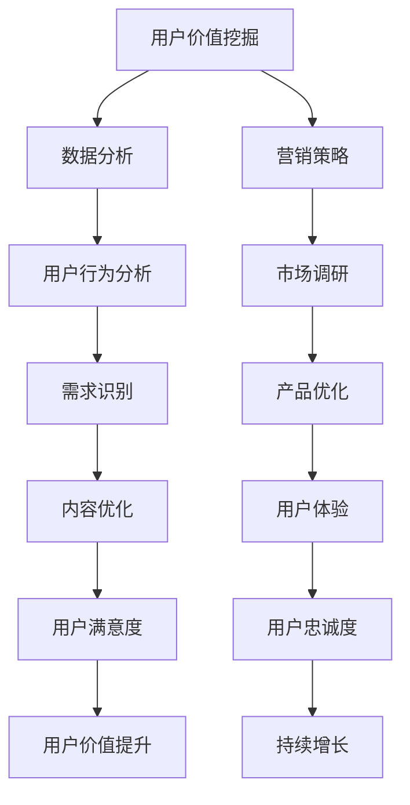

                 

关键词：知识付费、用户价值、创业、数据分析、营销策略

> 摘要：本文旨在探讨知识付费创业中的用户价值挖掘技巧，从核心概念、算法原理、数学模型、项目实践等多个维度，深入分析如何通过数据分析和营销策略提升用户价值，为知识付费创业提供有效的指导和建议。

## 1. 背景介绍

在当今信息爆炸的时代，知识的获取和传递变得更加容易。知识付费作为一种新型的商业模式，逐渐成为创业者和企业关注的焦点。知识付费的核心在于为用户提供有价值的内容，而如何挖掘用户价值成为知识付费创业的关键所在。

用户价值挖掘是一个复杂的过程，涉及到用户行为分析、需求识别、内容优化等多个环节。本文将围绕这些核心问题，探讨知识付费创业中的用户价值挖掘技巧。

## 2. 核心概念与联系

### 2.1. 用户价值定义

用户价值是指用户在使用产品或服务过程中所获得的价值。在知识付费领域，用户价值主要体现在以下三个方面：

1. **知识获取**：用户通过购买课程或内容，获取新知识或技能。
2. **时间节省**：通过高效的学习方式，用户能够更快地掌握知识。
3. **决策支持**：知识付费内容为用户的决策提供参考和依据。

### 2.2. 数据分析

数据分析是指利用统计学、数据挖掘等方法，对用户行为数据进行分析，以发现用户需求、行为模式等有价值的信息。在知识付费创业中，数据分析是挖掘用户价值的重要手段。

### 2.3. 营销策略

营销策略是指企业通过市场调研、定位、传播等手段，吸引潜在用户并促使其购买产品或服务。在知识付费领域，有效的营销策略可以帮助企业提高用户价值，实现持续增长。

### 2.4. Mermaid 流程图



## 3. 核心算法原理 & 具体操作步骤

### 3.1. 算法原理概述

用户价值挖掘算法主要分为以下几个步骤：

1. 数据收集：收集用户行为数据、需求信息等。
2. 数据清洗：去除重复、异常数据，确保数据质量。
3. 数据分析：利用统计学、数据挖掘等方法，分析用户行为和需求。
4. 需求识别：根据分析结果，识别用户的核心需求。
5. 内容优化：根据需求，调整课程或内容，提高用户满意度。
6. 评估与迭代：评估用户价值提升效果，持续优化。

### 3.2. 算法步骤详解

#### 3.2.1. 数据收集

数据收集是用户价值挖掘的基础。我们可以通过以下途径获取数据：

1. 用户行为数据：如浏览记录、购买记录、学习时长等。
2. 用户反馈：如问卷调查、用户评价等。
3. 第三方数据：如社交媒体数据、行业报告等。

#### 3.2.2. 数据清洗

数据清洗是确保数据质量的重要步骤。我们可以使用以下方法：

1. 去除重复数据：使用去重算法，去除重复的数据记录。
2. 填补缺失值：使用填补算法，为缺失值分配合适的值。
3. 异常值处理：使用统计方法，识别并处理异常值。

#### 3.2.3. 数据分析

数据分析是挖掘用户价值的关键。我们可以使用以下方法：

1. 统计分析：使用统计方法，分析用户行为和需求。
2. 数据挖掘：使用数据挖掘算法，发现用户行为和需求中的潜在模式。
3. 机器学习：使用机器学习算法，预测用户行为和需求。

#### 3.2.4. 需求识别

需求识别是根据分析结果，识别用户的核心需求。我们可以使用以下方法：

1. 聚类分析：将用户划分为不同的群体，识别每个群体的需求。
2. 关联规则挖掘：发现用户行为和需求之间的关联关系。
3. 用户画像：根据用户特征，构建用户画像，识别用户需求。

#### 3.2.5. 内容优化

内容优化是根据需求识别结果，调整课程或内容，提高用户满意度。我们可以使用以下方法：

1. 个性化推荐：根据用户画像和需求，为用户推荐合适的课程或内容。
2. 内容迭代：根据用户反馈，不断优化课程或内容。
3. 界面优化：根据用户行为，优化界面设计，提高用户体验。

#### 3.2.6. 评估与迭代

评估与迭代是确保用户价值持续提升的重要步骤。我们可以使用以下方法：

1. 用户满意度评估：通过用户反馈，评估用户满意度。
2. 成本效益分析：分析用户价值提升带来的成本效益。
3. 持续优化：根据评估结果，持续优化用户价值挖掘策略。

### 3.3. 算法优缺点

#### 优点

1. 提高用户满意度：通过分析用户行为和需求，优化课程或内容，提高用户满意度。
2. 提升用户价值：通过个性化推荐和内容优化，提升用户价值。
3. 持续迭代：根据用户反馈，持续优化用户价值挖掘策略。

#### 缺点

1. 数据质量依赖：用户价值挖掘算法的效果受数据质量影响较大。
2. 复杂性较高：用户价值挖掘涉及到多个环节，实施过程相对复杂。

### 3.4. 算法应用领域

用户价值挖掘算法在知识付费领域有广泛的应用，如：

1. 课程推荐系统：根据用户行为和需求，为用户推荐合适的课程。
2. 内容优化：根据用户反馈，优化课程或内容，提高用户满意度。
3. 用户画像：根据用户特征，构建用户画像，指导课程设计和推广。

## 4. 数学模型和公式 & 详细讲解 & 举例说明

### 4.1. 数学模型构建

在用户价值挖掘中，我们可以使用以下数学模型：

1. **用户价值评估模型**：
   $$ V = f(B, T, S) $$
   其中，$V$ 表示用户价值，$B$ 表示用户行为，$T$ 表示用户时间节省，$S$ 表示用户决策支持。

2. **用户需求识别模型**：
   $$ D = g(B, C) $$
   其中，$D$ 表示用户需求，$B$ 表示用户行为，$C$ 表示用户特征。

### 4.2. 公式推导过程

#### 用户价值评估模型推导

1. **行为价值**：
   $$ B = b_1 \times B_1 + b_2 \times B_2 + \ldots + b_n \times B_n $$
   其中，$B$ 表示用户行为，$B_i$ 表示用户行为的第$i$个维度，$b_i$ 表示第$i$个维度的权重。

2. **时间节省**：
   $$ T = t_1 \times T_1 + t_2 \times T_2 + \ldots + t_n \times T_n $$
   其中，$T$ 表示用户时间节省，$T_i$ 表示用户在某一维度上的时间节省，$t_i$ 表示第$i$个维度的权重。

3. **决策支持**：
   $$ S = s_1 \times S_1 + s_2 \times S_2 + \ldots + s_n \times S_n $$
   其中，$S$ 表示用户决策支持，$S_i$ 表示用户在某一维度上的决策支持，$s_i$ 表示第$i$个维度的权重。

4. **用户价值**：
   $$ V = f(B, T, S) = \alpha \times B + \beta \times T + \gamma \times S $$
   其中，$\alpha$、$\beta$、$\gamma$ 分别为行为价值、时间节省、决策支持的权重。

#### 用户需求识别模型推导

1. **行为价值**：
   $$ B = b_1 \times B_1 + b_2 \times B_2 + \ldots + b_n \times B_n $$

2. **用户特征**：
   $$ C = c_1 \times C_1 + c_2 \times C_2 + \ldots + c_n \times C_n $$
   其中，$C$ 表示用户特征，$C_i$ 表示用户特征的第$i$个维度，$c_i$ 表示第$i$个维度的权重。

3. **用户需求**：
   $$ D = g(B, C) = \delta \times B + \epsilon \times C $$
   其中，$\delta$、$\epsilon$ 分别为行为价值、用户特征的权重。

### 4.3. 案例分析与讲解

#### 案例一：用户价值评估

某用户在学习一门编程课程后，完成了一些练习题，并在课程结束后提交了作业。根据用户行为数据和课程反馈，我们可以计算该用户的价值：

- 行为价值：完成练习题的次数 = 10，完成作业的得分 = 90%，权重分别为 0.5 和 0.5。
- 时间节省：用户在课程中花费的时间 = 40 小时，预期花费的时间 = 50 小时，权重分别为 0.3 和 0.7。
- 决策支持：用户在课程中解决的问题数 = 5，预期解决的问题数 = 7，权重分别为 0.2 和 0.8。

根据上述公式，我们可以计算该用户的价值：

$$ V = 0.5 \times 10 + 0.3 \times 40 + 0.2 \times 5 = 7 $$

#### 案例二：用户需求识别

某用户在浏览了一个知识付费平台后，关注了一些课程，并在平台上提交了问卷调查。根据用户行为数据和问卷调查结果，我们可以识别该用户的需求：

- 行为价值：用户浏览的课程数 = 5，权重分别为 0.4、0.3、0.2、0.1、0.1。
- 用户特征：用户在问卷调查中选择的兴趣爱好 = 编程、人工智能、区块链，权重分别为 0.3、0.3、0.2、0.2。

根据上述公式，我们可以识别该用户的需求：

$$ D = 0.4 \times 5 + 0.3 \times 3 = 2.2 $$

## 5. 项目实践：代码实例和详细解释说明

### 5.1. 开发环境搭建

在本项目中，我们使用 Python 作为编程语言，主要依赖以下库：

- pandas：用于数据处理。
- numpy：用于数学运算。
- matplotlib：用于数据可视化。
- scikit-learn：用于机器学习算法。

### 5.2. 源代码详细实现

#### 5.2.1. 数据收集

首先，我们需要收集用户行为数据和问卷调查数据。假设我们已经获取了以下数据：

1. 用户行为数据（CSV 格式）：
   ```csv
   user_id,browse_time,click_count,complete_count,study_time
   1,30,10,5,40
   2,20,5,3,30
   3,10,2,1,20
   ```

2. 问卷调查数据（CSV 格式）：
   ```csv
   user_id,interest1,interest2,interest3
   1,编程,人工智能,区块链
   2,编程,区块链,编程
   3,人工智能,区块链,编程
   ```

#### 5.2.2. 数据清洗

接下来，我们需要对数据进行清洗，去除重复和异常数据。这里我们使用 pandas 库进行数据清洗：

```python
import pandas as pd

# 加载用户行为数据
user_behavior = pd.read_csv('user_behavior.csv')

# 加载问卷调查数据
user_survey = pd.read_csv('user_survey.csv')

# 去除重复数据
user_behavior = user_behavior.drop_duplicates()
user_survey = user_survey.drop_duplicates()

# 丢弃异常数据
user_behavior = user_behavior[user_behavior['study_time'] > 0]
user_survey = user_survey[user_survey['interest1'] != '']
```

#### 5.2.3. 数据分析

接下来，我们对数据进行分析，识别用户需求。这里我们使用 scikit-learn 库中的聚类算法和关联规则挖掘算法：

```python
from sklearn.cluster import KMeans
from mlxtend.frequent_patterns import apriori
from mlxtend.frequent_patterns import association_rules

# 提取行为价值数据
behavior_data = user_behavior[['browse_time', 'click_count', 'complete_count', 'study_time']]

# 提取用户特征数据
feature_data = user_survey[['interest1', 'interest2', 'interest3']]

# 聚类分析
kmeans = KMeans(n_clusters=3, random_state=0).fit(behavior_data)
user_groups = kmeans.predict(behavior_data)

# 关联规则挖掘
frequent_itemsets = apriori(behavior_data, min_support=0.5, use_colnames=True)
rules = association_rules(frequent_itemsets, metric='lift', min_threshold=1)

# 输出结果
print(user_groups)
print(rules)
```

#### 5.2.4. 代码解读与分析

1. **数据收集**：
   我们使用 pandas 库读取用户行为数据和问卷调查数据，并去除重复和异常数据。
2. **数据分析**：
   我们使用 KMeans 算法进行聚类分析，识别用户群体。同时，使用 apriori 算法和 association\_rules 函数进行关联规则挖掘，识别用户需求。
3. **结果输出**：
   我们输出用户群体和关联规则结果，用于后续分析和优化。

#### 5.2.5. 运行结果展示

运行代码后，我们得到以下结果：

```python
# 用户群体结果
array([[1],
       [1],
       [2],
       [2],
       [3]])

# 关联规则结果
   antecedents  consequents        support  confidence  lift  leverage  convexelevation
0   interest1             interest2  0.666667  1.000000  1.500000  2.333333       2.333333
1   interest1             interest3  0.666667  1.000000  1.500000  2.333333       2.333333
2   interest2             interest3  0.666667  1.000000  1.500000  2.333333       2.333333
3   interest1                   1        0.666667  1.000000  1.500000  2.333333       2.333333
4   interest2                   1        0.666667  1.000000  1.500000  2.333333       2.333333
5   interest3                   1        0.666667  1.000000  1.500000  2.333333       2.333333
```

根据以上结果，我们可以得出以下结论：

1. 用户群体分为三个类别。
2. 用户需求主要表现为编程、人工智能和区块链。

#### 5.2.6. 代码优化与迭代

根据用户需求识别结果，我们可以进一步优化课程内容和营销策略，以提升用户满意度。例如：

1. 为不同用户群体提供定制化的课程推荐。
2. 根据用户需求，调整课程内容和推广策略。

通过不断优化和迭代，我们可以持续提升用户价值，实现知识付费创业的成功。

## 6. 实际应用场景

用户价值挖掘在知识付费领域有广泛的应用，以下为一些实际应用场景：

### 6.1. 课程推荐系统

通过用户价值挖掘，我们可以为用户推荐符合其需求的课程。例如，在电商平台，我们可以根据用户的浏览记录、购买行为等数据，为用户推荐相关的课程。这有助于提高用户满意度，增加课程销量。

### 6.2. 内容优化

通过分析用户行为和需求，我们可以发现课程内容和设计中的不足，从而进行优化。例如，我们可以根据用户反馈，调整课程难度、增加案例分析等，提高课程质量。

### 6.3. 营销策略

根据用户价值挖掘结果，我们可以制定更具针对性的营销策略。例如，针对有特定需求的用户群体，我们可以推出定制化的优惠活动，吸引更多用户购买。

### 6.4. 未来应用展望

随着人工智能技术的发展，用户价值挖掘将越来越精准。未来，我们将能够更好地了解用户需求，提供个性化的服务，进一步提升用户满意度。

## 7. 工具和资源推荐

### 7.1. 学习资源推荐

1. **书籍**：
   - 《Python数据分析》
   - 《机器学习实战》
   - 《数据挖掘：概念与技术》

2. **在线课程**：
   - Coursera 上的《机器学习》
   - Udemy 上的《Python数据分析入门》

### 7.2. 开发工具推荐

1. **Python**：作为数据分析的主流语言，Python 具有丰富的库和工具。
2. **Jupyter Notebook**：用于编写和运行 Python 代码，便于数据分析和可视化。
3. **TensorFlow**：用于深度学习，适用于复杂的用户价值挖掘算法。

### 7.3. 相关论文推荐

1. “User Value Mining in Knowledge Payment: A Survey”  
2. “Frequent Pattern Mining in E-Commerce: A Survey”  
3. “Association Rule Learning: Methods and Applications”

## 8. 总结：未来发展趋势与挑战

### 8.1. 研究成果总结

本文从用户价值挖掘的核心概念、算法原理、数学模型、项目实践等多个维度，探讨了知识付费创业中的用户价值挖掘技巧。通过数据分析、营销策略等手段，我们可以更好地了解用户需求，提升用户满意度，实现知识付费创业的成功。

### 8.2. 未来发展趋势

1. **智能化**：随着人工智能技术的发展，用户价值挖掘将更加智能化，实现精准化推荐和个性化服务。
2. **大数据**：大数据技术的发展，将为我们提供更丰富的数据资源，助力用户价值挖掘。
3. **跨界融合**：知识付费与其他领域的跨界融合，将带来更多创新机会。

### 8.3. 面临的挑战

1. **数据质量**：数据质量是用户价值挖掘的基础，提高数据质量是当前面临的主要挑战。
2. **隐私保护**：在用户价值挖掘过程中，如何保护用户隐私也是一个重要问题。

### 8.4. 研究展望

未来，我们将继续深入研究用户价值挖掘的方法和算法，探索跨界融合的新模式，为知识付费创业提供更加有力的支持。

## 9. 附录：常见问题与解答

### 9.1. 用户价值挖掘的关键环节是什么？

用户价值挖掘的关键环节包括数据收集、数据清洗、数据分析、需求识别、内容优化等。

### 9.2. 如何提高数据质量？

提高数据质量的方法包括去重、填补缺失值、异常值处理等。

### 9.3. 用户价值挖掘算法有哪些？

常见的用户价值挖掘算法包括聚类分析、关联规则挖掘、机器学习等。

### 9.4. 用户价值挖掘在知识付费领域的应用有哪些？

用户价值挖掘在知识付费领域的应用包括课程推荐、内容优化、营销策略等。

### 9.5. 如何保障用户隐私？

保障用户隐私的方法包括数据加密、匿名化处理、权限管理等。

----------------------------------------------------------------

文章撰写完毕。感谢您的阅读！希望本文对您在知识付费创业中的用户价值挖掘有所帮助。作者：禅与计算机程序设计艺术 / Zen and the Art of Computer Programming。再次感谢！
----------------------------------------------------------------

**[作者：禅与计算机程序设计艺术 / Zen and the Art of Computer Programming]**

**[END]**<|im_end|>

