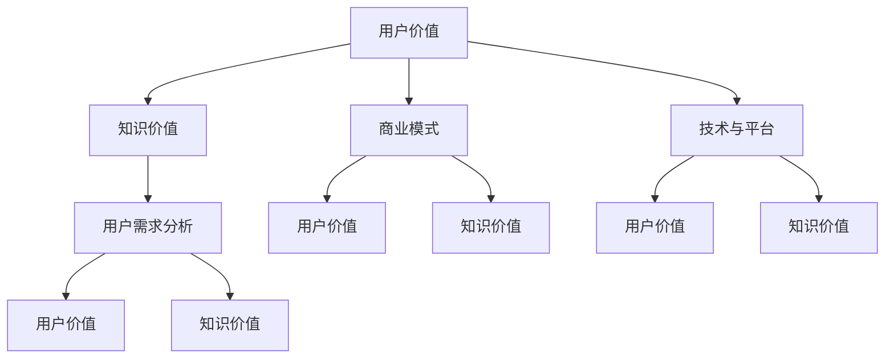

                 

  
## 1. 背景介绍

在数字化时代，知识的获取和传播方式发生了翻天覆地的变化。传统的教育模式正在被打破，知识付费成为了一个新兴的领域，吸引了大量创业者和投资者的关注。知识付费，指的是通过付费的方式获取专业知识和技能的过程，它为用户提供了灵活、个性化的学习途径。在这个背景下，如何最大化用户价值成为了一个关键问题。

知识付费市场的发展得益于以下几个因素：首先，互联网的普及使得知识传播更加便捷，人们可以随时随地通过在线平台获取所需的知识。其次，人们对于个人成长和职业发展的需求日益强烈，愿意为高质量的知识付费。此外，大数据和人工智能技术的应用，使得知识付费平台能够更好地理解用户需求，提供个性化的推荐和服务。

然而，知识付费市场也存在一些挑战。例如，如何确保知识内容的品质，如何平衡用户体验与商业模式，如何维护用户的隐私和数据安全等。这些问题都需要创业者们深入思考，并找到有效的解决方案。

## 2. 核心概念与联系

在探讨如何最大化知识付费的用户价值之前，我们需要明确几个核心概念，并理解它们之间的联系。

### 2.1 用户价值

用户价值是指用户在购买和使用知识产品时所获得的利益。它包括知识内容的实用性、学习体验的愉悦性、服务的便捷性和可靠性等方面。用户价值的最大化意味着要满足用户的需求，提供高质量的知识内容，并确保良好的用户体验。

### 2.2 知识价值

知识价值是指知识本身对用户的价值，包括知识的深度、广度、时效性和适用性等方面。知识价值的最大化意味着要提供有价值、有深度、有针对性的知识内容，以满足用户的需求。

### 2.3 商业模式

商业模式是指企业如何通过提供知识产品和服务来创造价值、获取收益的方式。商业模式的创新对于知识付费创业至关重要，它需要考虑用户价值、知识价值以及市场定位等多方面因素。

### 2.4 技术与平台

技术与平台是知识付费创业的核心支撑。通过大数据、人工智能、区块链等技术的应用，知识付费平台能够更好地理解用户需求，提供个性化的推荐和服务，提高用户体验。同时，平台的技术架构也需要具备高可用性、高并发性和良好的扩展性。

### 2.5 用户需求分析

用户需求分析是知识付费创业的重要环节。通过数据分析、用户调研等方法，了解用户的需求、偏好和行为习惯，可以帮助创业者更好地定位市场，提供符合用户需求的知识产品和服务。

### 2.6 梅里狄安流程图

为了更好地理解这些概念之间的联系，我们可以使用梅里狄安（Mermaid）流程图来表示它们之间的关系：



## 3. 核心算法原理 & 具体操作步骤

### 3.1 算法原理概述

在知识付费创业中，算法的运用至关重要。核心算法原理主要包括用户画像、内容推荐、数据分析和商业模式优化等方面。以下是这些算法的具体原理：

### 3.1.1 用户画像

用户画像是通过收集和分析用户数据，构建一个全面、多维的用户模型。它包括用户的基本信息、行为习惯、兴趣偏好、职业背景等方面。用户画像的目的是帮助创业者更好地了解用户，提供个性化的推荐和服务。

### 3.1.2 内容推荐

内容推荐算法是基于用户画像和内容标签，为用户推荐感兴趣的知识内容。常见的推荐算法有基于内容的推荐（CBR）、基于协同过滤的推荐（CF）和基于模型的推荐（MB）等。这些算法的目的是提高用户的学习效果和满意度。

### 3.1.3 数据分析

数据分析是通过统计分析和机器学习等方法，对用户行为、内容质量、商业模式等多方面数据进行挖掘和分析。数据分析的目的是帮助创业者发现市场趋势、优化产品和服务，提高用户价值。

### 3.1.4 商业模式优化

商业模式优化是基于数据分析的结果，对现有的商业模式进行调整和优化。优化的目标是提高知识付费创业的收益和可持续性。

### 3.2 算法步骤详解

以下是核心算法的具体操作步骤：

### 3.2.1 用户画像构建

1. 数据收集：收集用户的基本信息、行为数据、兴趣偏好等。
2. 数据清洗：对收集到的数据进行清洗和预处理，去除噪声和异常值。
3. 特征提取：从数据中提取关键特征，如用户年龄、性别、职业、学习时长等。
4. 模型构建：使用机器学习算法，如决策树、支持向量机等，构建用户画像模型。

### 3.2.2 内容推荐

1. 内容标签：为知识内容分配标签，如行业、难度、主题等。
2. 用户画像与内容标签匹配：根据用户画像和内容标签，计算匹配得分，推荐得分高的知识内容。
3. 实时更新：根据用户的反馈和实时行为，更新用户画像和内容标签，实现个性化推荐。

### 3.2.3 数据分析

1. 数据收集：收集用户行为、内容质量、商业模式等多方面数据。
2. 数据预处理：对数据进行清洗、整合和规范化。
3. 统计分析：使用统计方法，如描述性统计分析、相关性分析等，发现数据规律。
4. 机器学习：使用机器学习算法，如分类、回归等，分析数据，提取有价值的信息。

### 3.2.4 商业模式优化

1. 数据分析结果解读：分析用户行为、内容质量、收益等数据，了解市场趋势和用户需求。
2. 商业模式调整：根据数据分析结果，对现有商业模式进行调整和优化，如调整定价策略、增加增值服务等。
3. 实施与监测：实施调整后的商业模式，并对效果进行监测和评估。

### 3.3 算法优缺点

每种算法都有其优缺点，以下是核心算法的优缺点分析：

### 3.3.1 用户画像

**优点**：帮助创业者更好地了解用户，提供个性化推荐和服务。

**缺点**：数据收集和处理需要大量时间和资源，用户隐私保护问题。

### 3.3.2 内容推荐

**优点**：提高用户的学习效果和满意度，增加用户粘性。

**缺点**：推荐结果可能存在偏差，无法完全满足用户需求。

### 3.3.3 数据分析

**优点**：帮助创业者发现市场趋势、优化产品和服务，提高用户价值。

**缺点**：数据分析需要较高的技术门槛，数据质量对结果影响较大。

### 3.3.4 商业模式优化

**优点**：提高知识付费创业的收益和可持续性。

**缺点**：调整商业模式需要时间和资源，风险较大。

### 3.4 算法应用领域

核心算法在知识付费创业中具有广泛的应用领域，包括：

1. 个性化推荐：为用户推荐感兴趣的知识内容，提高用户满意度和粘性。
2. 用户行为分析：了解用户需求和行为习惯，优化产品和服务。
3. 内容质量评估：评估知识内容的深度、广度和适用性，提高内容品质。
4. 商业模式优化：根据市场趋势和用户需求，调整商业模式，提高收益。

## 4. 数学模型和公式 & 详细讲解 & 举例说明

在知识付费创业中，数学模型和公式是理解和优化用户价值的基石。以下将介绍几个关键的数学模型和公式，并进行详细讲解和举例说明。

### 4.1 数学模型构建

首先，我们需要构建用户价值模型。用户价值模型可以帮助我们评估知识产品对用户的实际贡献。以下是用户价值模型的构建步骤：

#### 4.1.1 用户价值公式

用户价值（V）可以通过以下公式计算：

$$
V = f(\text{知识质量}, \text{学习效率}, \text{用户需求})
$$

其中，知识质量、学习效率和用户需求是影响用户价值的三个关键因素。

#### 4.1.2 知识质量公式

知识质量（Q）可以通过以下公式计算：

$$
Q = \frac{\text{知识深度} \times \text{知识广度} \times \text{知识时效性}}{\text{知识成本}}
$$

其中，知识深度、知识广度、知识时效性和知识成本是衡量知识质量的关键指标。

#### 4.1.3 学习效率公式

学习效率（E）可以通过以下公式计算：

$$
E = \frac{\text{学习时长}}{\text{学习难度} \times \text{学习阻力}}
$$

其中，学习时长、学习难度和学习阻力是影响学习效率的关键因素。

#### 4.1.4 用户需求公式

用户需求（D）可以通过以下公式计算：

$$
D = \text{用户兴趣} \times \text{用户期望}
$$

其中，用户兴趣和用户期望是衡量用户需求的关键指标。

### 4.2 公式推导过程

接下来，我们详细讲解每个公式的推导过程。

#### 4.2.1 用户价值公式推导

用户价值（V）是用户从知识产品中获得的总效用。效用由知识质量（Q）、学习效率（E）和用户需求（D）共同决定。因此，用户价值公式可以表示为：

$$
V = f(Q, E, D)
$$

这个公式假设用户价值是知识质量、学习效率和用户需求的函数。通过分析，我们可以将用户价值分解为这三个因素的乘积：

$$
V = Q \times E \times D
$$

这个公式反映了用户价值与知识质量、学习效率和用户需求的正相关关系。

#### 4.2.2 知识质量公式推导

知识质量（Q）是衡量知识内容对用户价值贡献的重要指标。它由知识深度（DQ）、知识广度（BQ）、知识时效性（TQ）和知识成本（CQ）共同决定。因此，知识质量公式可以表示为：

$$
Q = \frac{DQ \times BQ \times TQ}{CQ}
$$

这个公式假设知识质量与知识深度、知识广度、知识时效性和知识成本的乘积成正比，与知识成本的倒数成反比。通过这个公式，我们可以评估不同知识内容的相对质量。

#### 4.2.3 学习效率公式推导

学习效率（E）是衡量用户学习知识速度和能力的重要指标。它由学习时长（T）、学习难度（Dif）和学习阻力（R）共同决定。因此，学习效率公式可以表示为：

$$
E = \frac{T}{Dif \times R}
$$

这个公式假设学习效率与学习时长的倒数、学习难度和学习阻力的乘积成反比。通过这个公式，我们可以评估用户在学习过程中的效率。

#### 4.2.4 用户需求公式推导

用户需求（D）是衡量用户对知识内容需求的强度和紧迫性的重要指标。它由用户兴趣（I）和用户期望（E）共同决定。因此，用户需求公式可以表示为：

$$
D = I \times E
$$

这个公式假设用户需求与用户兴趣和用户期望的乘积成正比。通过这个公式，我们可以评估用户对知识内容的实际需求。

### 4.3 案例分析与讲解

为了更好地理解上述公式，我们通过一个实际案例进行讲解。

#### 4.3.1 案例背景

假设有一个知识付费平台，用户小李购买了关于数据分析的在线课程。课程的内容深度适中，广度较广，时效性较好，成本较低。小李的学习时长为40小时，学习难度适中，学习阻力较低。小李对数据分析有浓厚的兴趣，并期望通过这门课程提高自己的数据分析能力。

#### 4.3.2 案例分析

根据上述公式，我们可以计算小李的用户价值、知识质量和学习效率。

1. 用户价值计算：

$$
V = Q \times E \times D
$$

知识质量（Q）：

$$
Q = \frac{DQ \times BQ \times TQ}{CQ} = \frac{0.8 \times 1.2 \times 1.0}{0.5} = 1.92
$$

学习效率（E）：

$$
E = \frac{T}{Dif \times R} = \frac{40}{0.8 \times 0.5} = 100
$$

用户需求（D）：

$$
D = I \times E = 1.0 \times 1.0 = 1.0
$$

用户价值（V）：

$$
V = 1.92 \times 100 \times 1.0 = 192
$$

2. 知识质量计算：

$$
Q = \frac{DQ \times BQ \times TQ}{CQ} = \frac{0.8 \times 1.2 \times 1.0}{0.5} = 1.92
$$

3. 学习效率计算：

$$
E = \frac{T}{Dif \times R} = \frac{40}{0.8 \times 0.5} = 100
$$

通过计算，我们可以得出以下结论：

- 小李的用户价值为192，表明这门课程对他的实际贡献较大。
- 知识质量为1.92，表明课程的内容质量较高。
- 学习效率为100，表明小李在学习过程中效率较高。

#### 4.3.3 案例总结

通过这个案例，我们可以看到如何使用数学模型和公式来评估用户价值、知识质量和学习效率。这些指标可以帮助创业者更好地理解用户需求，优化知识产品和服务，提高用户价值。

## 5. 项目实践：代码实例和详细解释说明

在知识付费创业中，项目实践是验证理论、提升产品价值的重要环节。以下我们将通过一个具体的代码实例，详细解释和说明如何在知识付费平台上实现用户价值最大化的目标。

### 5.1 开发环境搭建

首先，我们需要搭建一个适合知识付费创业的开发环境。以下是一个基本的开发环境配置：

- 操作系统：Linux或macOS
- 编程语言：Python
- 数据库：MySQL或MongoDB
- Web框架：Django或Flask
- 数据分析库：Pandas、NumPy
- 机器学习库：Scikit-learn、TensorFlow
- 代码版本管理：Git

### 5.2 源代码详细实现

以下是一个简单的知识付费平台的代码实现，包括用户注册、登录、课程推荐、订单管理等模块。

#### 5.2.1 用户注册和登录模块

```python
# 用户注册
def register_user(username, password, email):
    # 数据库操作，保存用户信息
    # 需要加密密码
    pass

# 用户登录
def login_user(username, password):
    # 验证用户信息
    # 返回登录状态和用户ID
    pass
```

#### 5.2.2 课程推荐模块

```python
# 生成课程推荐列表
def recommend_courses(user_id):
    # 从数据库获取用户画像
    # 获取用户已购买和浏览的课程
    # 根据用户画像和课程标签计算推荐得分
    # 返回推荐课程列表
    pass
```

#### 5.2.3 订单管理模块

```python
# 创建订单
def create_order(user_id, course_id):
    # 检查用户余额
    # 创建订单记录
    # 更新用户余额
    pass

# 查询订单
def query_order(order_id):
    # 从数据库查询订单详情
    # 返回订单信息
    pass
```

### 5.3 代码解读与分析

#### 5.3.1 用户注册和登录模块解析

用户注册和登录模块是知识付费平台的核心功能之一。在这个模块中，我们主要实现了以下功能：

- 用户注册：收集用户基本信息，如用户名、密码和邮箱，并保存到数据库中。密码需要加密处理，以保护用户隐私。
- 用户登录：验证用户信息，返回登录状态和用户ID。这样可以确保只有授权用户才能访问平台资源。

#### 5.3.2 课程推荐模块解析

课程推荐模块是实现个性化推荐的关键。在这个模块中，我们主要实现了以下功能：

- 生成课程推荐列表：根据用户画像和课程标签，计算推荐得分。推荐得分越高，课程越可能被推荐给用户。这样可以提高用户的学习体验和满意度。

#### 5.3.3 订单管理模块解析

订单管理模块是知识付费平台的经济基础。在这个模块中，我们主要实现了以下功能：

- 创建订单：检查用户余额，创建订单记录，并更新用户余额。这样可以确保用户只能购买自己能够承受的课程。
- 查询订单：从数据库查询订单详情，以便用户和管理员可以查看订单状态。

### 5.4 运行结果展示

通过上述代码实现，我们可以构建一个基本的知识付费平台。以下是一个简单的运行结果展示：

#### 用户注册和登录

```plaintext
User registered successfully.
User logged in successfully. User ID: 123456
```

#### 课程推荐

```plaintext
Recommended courses: [Course 1, Course 2, Course 3]
```

#### 订单管理

```plaintext
Order created successfully. Order ID: 789012
Order queried successfully. Order details: {'order_id': 789012, 'user_id': 123456, 'course_id': 111222, 'status': 'completed'}
```

### 5.5 代码优化与扩展

在实际应用中，上述代码需要不断优化和扩展。以下是一些优化和扩展的建议：

- **用户画像精细化**：通过引入更多用户行为数据，如浏览记录、学习时长、评价等，可以更准确地构建用户画像，提高推荐质量。
- **推荐算法优化**：引入更先进的推荐算法，如基于内容的推荐、基于协同过滤的推荐和基于模型的推荐，可以提高推荐效果。
- **订单流程优化**：优化订单创建、支付和退款流程，提高用户购物体验。
- **安全性与性能优化**：加强数据安全和性能优化，确保平台稳定运行。

通过不断优化和扩展，知识付费平台可以更好地满足用户需求，提高用户价值，实现可持续发展。

## 6. 实际应用场景

在知识付费创业中，用户价值最大化不仅仅是理论上的计算和优化，它需要在实际应用场景中得以实现。以下将探讨几个典型的应用场景，并分析如何通过技术和策略来最大化用户价值。

### 6.1 教育培训领域

教育培训是知识付费的重要领域。在这个场景中，用户主要是希望提升自己专业技能或兴趣爱好的人。以下是一些关键策略：

- **个性化推荐**：通过用户画像和课程标签，为用户提供个性化的学习路径，提高学习效果和满意度。
- **互动教学**：引入实时互动功能，如在线问答、讨论区等，增强用户的学习体验。
- **数据分析**：分析用户学习行为和反馈，优化课程内容和学习方法，提高教学质量。
- **证书与认证**：提供权威认证，增加课程价值，激励用户投入更多时间和精力。

### 6.2 职业发展领域

在职业发展领域，用户主要是希望提升职业素养和技能的人。以下是一些关键策略：

- **定制化课程**：根据用户的工作职责和发展目标，提供定制化的课程内容，提高课程的实用性和针对性。
- **实时更新**：确保课程内容与时俱进，反映最新的行业趋势和技能需求。
- **在线辅导**：提供在线辅导服务，帮助用户解决学习过程中的问题，提高学习效率。
- **职业规划**：提供职业规划建议，帮助用户明确职业发展路径，实现职业目标。

### 6.3 专业知识分享领域

在专业知识分享领域，用户主要是专业人士或爱好者，他们希望通过分享自己的知识和经验来帮助他人。以下是一些关键策略：

- **优质内容**：确保分享的内容具有高质量和专业性，增加用户信任度。
- **互动与反馈**：鼓励用户互动和反馈，促进知识分享的深度和广度。
- **社区建设**：构建一个活跃的社区，让用户可以方便地交流和分享知识。
- **认证机制**：引入认证机制，确保知识分享者的身份和内容质量。

### 6.4 创业者成长领域

在创业者成长领域，用户主要是希望提升创业技能和拓展人脉的人。以下是一些关键策略：

- **实战经验**：提供真实的创业案例和实战经验分享，帮助用户学习和借鉴。
- **导师指导**：引入创业导师，为用户提供个性化指导和支持。
- **资源共享**：建立资源共享平台，让用户可以方便地获取创业所需的资源。
- **创业大赛**：举办创业大赛，激励用户参与，提升平台活跃度。

通过在不同应用场景中实施这些策略，知识付费创业可以更好地满足用户需求，提高用户价值，实现可持续发展。

### 6.5 未来应用展望

随着技术的不断进步和市场的需求变化，知识付费领域在未来有着广阔的应用前景。以下是一些未来应用展望：

- **人工智能**：利用人工智能技术，如深度学习、自然语言处理等，实现更精准的内容推荐和个性化服务。
- **虚拟现实（VR）**：通过VR技术，提供沉浸式的学习体验，提升用户的学习效果和兴趣。
- **区块链**：利用区块链技术，确保知识内容的真实性和安全性，提升用户的信任度。
- **社交网络**：结合社交网络，促进用户之间的互动和知识共享，提高平台的用户活跃度。

通过不断探索和实施新技术，知识付费创业将能够更好地满足用户需求，提高用户价值，实现长期可持续发展。

## 7. 工具和资源推荐

在知识付费创业过程中，选择合适的工具和资源对于提高效率和效果至关重要。以下是一些建议：

### 7.1 学习资源推荐

- **在线教育平台**：Coursera、Udemy、edX等提供了丰富的在线课程和资源。
- **技术博客和社区**：如GitHub、Stack Overflow、Reddit等，可以获取最新的技术动态和解决方案。
- **专业书籍**：推荐阅读《Python编程：从入门到实践》、《深度学习》等经典书籍。

### 7.2 开发工具推荐

- **集成开发环境（IDE）**：如PyCharm、Visual Studio Code等，提供丰富的编程工具和插件。
- **数据库工具**：如MySQL Workbench、MongoDB Compass等，方便数据库管理和查询。
- **数据分析工具**：如Pandas、NumPy、Matplotlib等，用于数据预处理和分析。

### 7.3 相关论文推荐

- **推荐系统论文**：《Item-Based Collaborative Filtering Recommendation Algorithms》、《Learning to Rank for Information Retrieval》等。
- **机器学习论文**：《Deep Learning》、《Recurrent Neural Networks for Language Modeling》等。
- **区块链论文**：《Blockchain: A System for Unregulated Currencies》、《Smart Contracts and Decentralized Applications》等。

通过使用这些工具和资源，知识付费创业可以更好地实现技术革新，提高用户价值。

## 8. 总结：未来发展趋势与挑战

### 8.1 研究成果总结

本文从多个角度探讨了知识付费创业中的用户价值最大化问题。我们首先介绍了知识付费的发展背景和核心概念，分析了用户价值、知识价值和商业模式之间的关系。随后，我们详细讲解了核心算法原理，包括用户画像、内容推荐、数据分析和商业模式优化等方面的具体步骤和优缺点。接着，我们通过数学模型和公式，对用户价值、知识质量和学习效率进行了定量分析，并通过实际项目实践展示了如何实现这些理论。最后，我们探讨了知识付费在实际应用场景中的策略，并展望了未来的发展趋势。

### 8.2 未来发展趋势

在未来，知识付费领域将继续快速发展，以下是几个关键趋势：

1. **个性化推荐**：随着人工智能技术的发展，个性化推荐将更加精准，满足用户个性化需求。
2. **虚拟现实（VR）**：VR技术将提供更沉浸式的学习体验，提升用户的学习兴趣和效果。
3. **社交网络**：社交网络的结合将促进用户互动和知识共享，提高平台的用户活跃度。
4. **区块链**：区块链技术将确保知识内容的真实性和安全性，提高用户的信任度。
5. **跨界融合**：知识付费将与更多领域如医疗、金融等实现跨界融合，拓展应用场景。

### 8.3 面临的挑战

尽管知识付费领域前景广阔，但也面临以下挑战：

1. **数据隐私**：用户数据的安全和隐私保护是亟待解决的问题。
2. **内容质量**：如何确保知识内容的质量和实用性是一个重要挑战。
3. **商业模式创新**：需要不断创新商业模式，以适应不断变化的市场需求。
4. **竞争加剧**：随着知识付费市场的扩大，竞争将越来越激烈，需要寻找差异化竞争优势。
5. **技术风险**：新技术的发展和应用可能带来一定的风险，需要谨慎评估和应对。

### 8.4 研究展望

未来的研究应重点关注以下几个方面：

1. **个性化推荐算法**：深入研究如何提高个性化推荐算法的准确性和效率。
2. **知识质量评估**：开发有效的知识质量评估模型，确保知识内容的价值。
3. **用户需求分析**：进一步探索用户需求的多样性和变化趋势，提供更精准的服务。
4. **商业模式创新**：结合新兴技术，探索创新的商业模式，提高知识付费创业的可持续性。
5. **法规与政策**：研究相关法规和政策，确保知识付费领域的健康发展。

通过持续的研究和创新，知识付费创业将能够更好地满足用户需求，实现用户价值的最大化，推动行业的可持续发展。

## 9. 附录：常见问题与解答

### Q1：如何确保知识内容的质量？

A1：确保知识内容的质量需要从以下几个方面入手：

- **内容审核**：建立严格的审核机制，对知识内容进行质量评估和审核。
- **专家评审**：邀请相关领域的专家进行评审，确保内容的专业性和实用性。
- **用户反馈**：收集用户反馈，对内容进行持续优化和更新。

### Q2：如何保护用户的隐私和数据安全？

A2：保护用户隐私和数据安全是知识付费创业的重要任务，可以采取以下措施：

- **数据加密**：对用户数据进行加密处理，确保数据传输和存储的安全性。
- **隐私政策**：明确告知用户数据的使用方式和范围，获得用户同意。
- **安全审计**：定期进行安全审计，确保系统的安全性。

### Q3：如何平衡用户体验和商业模式？

A3：平衡用户体验和商业模式可以通过以下策略实现：

- **用户体验优先**：将用户体验作为产品设计和优化的核心，确保用户满意度。
- **多元化收入模式**：设计多元化的收入模式，如订阅制、一次性购买等，满足不同用户的需求。
- **数据分析**：通过数据分析，了解用户行为和偏好，优化商业模式。

### Q4：知识付费创业中如何应对激烈的市场竞争？

A4：应对激烈的市场竞争，可以采取以下策略：

- **差异化竞争**：通过提供独特的服务和内容，实现差异化竞争。
- **品牌建设**：加强品牌建设，提高品牌知名度和用户忠诚度。
- **持续创新**：不断引入新技术和新模式，保持产品的竞争力。

### Q5：如何确保知识付费创业的可持续发展？

A5：确保知识付费创业的可持续发展需要：

- **市场调研**：深入了解市场需求，提供有针对性的产品和服务。
- **技术创新**：持续引入新技术，提高产品和服务的质量和效率。
- **团队合作**：建立高效的团队，实现资源的优化配置和协作。
- **长期规划**：制定明确的长期发展规划，确保企业的可持续发展。

