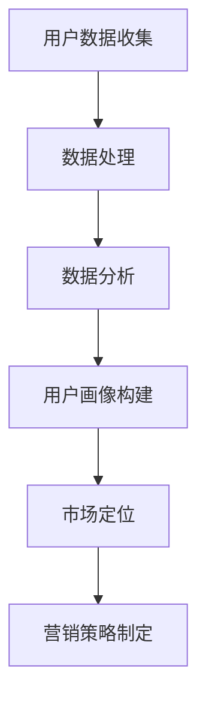

                 

关键词：知识付费，用户细分，创业，方法论，数据挖掘，市场分析，用户画像

> 摘要：本文将探讨知识付费创业中的用户细分方法论。通过数据分析、用户画像构建、市场定位等手段，分析并解读不同用户群体的特点和需求，从而制定有效的市场营销策略，提升用户满意度和转化率。

## 1. 背景介绍

知识付费是近年来兴起的一种新兴商业模式，通过提供有价值的信息、知识、技能等，为用户提供个性化服务。知识付费市场涵盖了教育、职场、健康、娱乐等多个领域，涉及的内容形式包括课程、专栏、书籍、直播、问答等。在这个市场中，创业者和企业需要深入了解用户，从而制定有效的营销策略，提升竞争力。

用户细分是知识付费创业过程中至关重要的一环。通过将用户划分为不同的群体，企业可以更精准地定位目标市场，提供个性化的产品和服务，提高用户满意度和转化率。本文将介绍一种基于数据分析的用户细分方法论，帮助知识付费创业者更好地了解和把握用户需求。

## 2. 核心概念与联系

### 2.1 用户细分

用户细分（User Segmentation）是指将用户按照一定的标准进行分类，从而形成不同的用户群体。常见的细分标准包括年龄、性别、地域、职业、收入、教育程度、消费习惯等。

### 2.2 数据分析

数据分析（Data Analysis）是指通过收集、处理、分析和解释数据，从中提取有价值的信息，帮助企业和决策者做出更为明智的决策。

### 2.3 用户画像

用户画像（User Profiling）是指通过对用户的基本信息、行为数据、偏好数据进行整合和分析，构建出用户的综合形象。用户画像可以帮助企业了解用户需求，提供个性化的产品和服务。

### 2.4 市场定位

市场定位（Market Positioning）是指企业根据自身资源和竞争优势，在目标市场中确定自己的位置，从而在用户心中树立独特的品牌形象。

## 2.5 Mermaid 流程图



## 3. 核心算法原理 & 具体操作步骤

### 3.1 算法原理概述

用户细分方法论的核心是数据分析，通过对用户数据的收集、处理和分析，构建出用户画像，从而为市场定位提供依据。具体步骤如下：

1. 用户数据收集：通过网站访问日志、问卷调查、用户反馈等方式收集用户的基本信息、行为数据和偏好数据。
2. 数据处理：对收集到的用户数据进行清洗、整合，确保数据质量。
3. 数据分析：运用统计学、机器学习等方法，分析用户数据，提取有价值的信息。
4. 用户画像构建：根据数据分析结果，为用户构建综合画像，识别出不同的用户群体。
5. 市场定位：根据用户画像，确定目标市场，制定个性化的营销策略。

### 3.2 算法步骤详解

1. **用户数据收集**：
   - **网站访问日志**：通过网站后台统计系统，收集用户在网站上的浏览、搜索、购买等行为数据。
   - **问卷调查**：通过线上或线下问卷调查，收集用户的基本信息、教育程度、职业、收入等数据。
   - **用户反馈**：收集用户在社交媒体、论坛、客服等渠道的反馈信息，了解用户需求和满意度。

2. **数据处理**：
   - **数据清洗**：去除重复、缺失、异常数据，确保数据质量。
   - **数据整合**：将不同来源的数据进行整合，形成统一的用户数据集。

3. **数据分析**：
   - **描述性统计分析**：计算用户数据的各种统计指标，如平均值、标准差、中位数等。
   - **相关性分析**：分析用户数据之间的相关性，找出影响用户行为的因素。
   - **聚类分析**：运用聚类算法，将用户划分为不同的群体。

4. **用户画像构建**：
   - **特征工程**：根据用户数据，提取对用户有代表性的特征，如年龄、性别、职业等。
   - **画像建模**：利用机器学习算法，为用户构建综合画像，识别出不同的用户群体。

5. **市场定位**：
   - **目标市场选择**：根据用户画像，确定目标市场，如年龄、收入、教育程度等。
   - **营销策略制定**：根据目标市场，制定个性化的营销策略，如广告投放、活动策划等。

### 3.3 算法优缺点

**优点**：
- **精准定位**：通过用户细分，可以更精准地定位目标市场，提高营销效果。
- **个性化服务**：根据用户画像，提供个性化的产品和服务，提高用户满意度。
- **数据驱动**：基于数据分析，使决策更为科学和客观。

**缺点**：
- **数据依赖**：用户细分的效果依赖于数据质量，数据不准确可能导致细分结果失真。
- **实施成本**：需要投入一定的资源和人力进行数据收集、处理和分析。

### 3.4 算法应用领域

用户细分方法论在知识付费创业中具有广泛的应用领域，如：

- **在线教育**：根据用户画像，提供个性化的课程推荐，提高用户转化率和满意度。
- **职业培训**：根据用户画像，制定针对性的培训计划和课程，提升培训效果。
- **健康管理**：根据用户画像，提供个性化的健康建议和产品推荐，提高用户健康水平。
- **娱乐内容**：根据用户画像，提供个性化的内容推荐，提高用户粘性和活跃度。

## 4. 数学模型和公式 & 详细讲解 & 举例说明

### 4.1 数学模型构建

用户细分过程中，常用的数学模型包括聚类分析、回归分析、因子分析等。

#### 聚类分析

聚类分析是一种无监督学习方法，用于将数据集分成若干个簇，使得同一个簇内的数据尽可能相似，不同簇的数据尽可能不同。

常用的聚类算法包括：

- **K-means算法**：基于距离度量，将数据划分为K个簇，使得每个簇的内部距离最小，簇间距离最大。
- **层次聚类算法**：基于层次结构，逐步合并相似度较高的簇，构建出一棵聚类树。

#### 回归分析

回归分析是一种有监督学习方法，用于分析变量之间的关系，预测某个变量的取值。

常用的回归算法包括：

- **线性回归**：通过建立线性模型，预测因变量和自变量之间的关系。
- **逻辑回归**：通过建立逻辑模型，预测二分类变量的概率。

#### 因子分析

因子分析是一种多元统计方法，用于分析变量之间的潜在关系，提取出公共因子。

常用的因子分析方法包括：

- **主成分分析**：通过线性变换，将多个变量压缩成几个公共因子，降低数据维度。
- **探索性因子分析**：通过分析变量之间的相关性，提取出潜在变量。

### 4.2 公式推导过程

以K-means算法为例，介绍公式推导过程。

#### K-means算法基本思想

K-means算法是一种基于距离度量的聚类算法，其基本思想如下：

1. 初始化：随机选择K个数据点作为初始聚类中心。
2. 分配：对于每个数据点，计算其与K个聚类中心的距离，将数据点分配到距离最近的聚类中心所在的簇。
3. 更新：计算每个簇的新聚类中心，重复步骤2，直到聚类中心不再发生变化。

#### 公式推导

假设有K个聚类中心为$$\mu_1, \mu_2, ..., \mu_K$$，数据点为$$x_1, x_2, ..., x_n$$。

1. **初始化聚类中心**：

   $$\mu_k = \frac{1}{n_k} \sum_{i=1}^{n} x_i$$

   其中，$$n_k$$表示第k个簇的数据点个数。

2. **计算数据点与聚类中心的距离**：

   $$d(x_i, \mu_k) = \sqrt{\sum_{j=1}^{p} (x_{ij} - \mu_{kj})^2}$$

   其中，$$x_{ij}$$表示第i个数据点的第j个特征，$$\mu_{kj}$$表示第k个簇的第j个特征。

3. **分配数据点**：

   对于每个数据点$$x_i$$，计算其与K个聚类中心的距离，将数据点$$x_i$$分配到距离最近的聚类中心所在的簇。

4. **更新聚类中心**：

   $$\mu_k = \frac{1}{n_k} \sum_{i=1}^{n} x_i$$

   其中，$$n_k$$表示第k个簇的数据点个数。

### 4.3 案例分析与讲解

#### 案例背景

假设某知识付费平台有10000名用户，通过问卷调查收集了用户的年龄、性别、收入、教育程度、职业等信息，现需要对这些用户进行细分，为市场定位和营销策略制定提供依据。

#### 案例步骤

1. **用户数据收集**：

   收集10000名用户的年龄、性别、收入、教育程度、职业等信息，构建用户数据集。

2. **数据处理**：

   - **数据清洗**：去除重复、缺失、异常数据，确保数据质量。
   - **数据整合**：将不同来源的数据进行整合，形成统一的用户数据集。

3. **数据分析**：

   - **描述性统计分析**：计算用户数据的各种统计指标，如平均值、标准差、中位数等。
   - **相关性分析**：分析用户数据之间的相关性，找出影响用户行为的因素。

4. **用户画像构建**：

   - **特征工程**：根据用户数据，提取对用户有代表性的特征，如年龄、性别、收入、教育程度等。
   - **画像建模**：利用聚类算法，为用户构建综合画像，识别出不同的用户群体。

5. **市场定位**：

   - **目标市场选择**：根据用户画像，确定目标市场，如年龄、收入、教育程度等。
   - **营销策略制定**：根据目标市场，制定个性化的营销策略，如广告投放、活动策划等。

#### 案例结果

通过用户细分，该知识付费平台识别出了以下用户群体：

1. **年轻群体**：年龄在18-25岁之间，以学生和职场新人为主，具有较高的消费潜力。
2. **高收入群体**：收入在8000元以上，具有较高的购买力和教育需求。
3. **职业群体**：涵盖不同行业，如IT、金融、医疗等，具有特定的职业背景和需求。
4. **终身学习群体**：具有较高教育程度，注重个人成长和技能提升。

#### 案例讲解

通过用户细分，该知识付费平台可以针对不同用户群体，制定个性化的营销策略。例如，针对年轻群体，可以推出优惠活动、互动课程等，提高用户粘性和转化率；针对高收入群体，可以提供高端课程、定制化服务，满足他们的高品质需求；针对职业群体，可以推出行业热点课程、职业规划咨询等，提升职业竞争力；针对终身学习群体，可以提供持续的教育资源，促进个人成长。

## 5. 项目实践：代码实例和详细解释说明

### 5.1 开发环境搭建

为了实现用户细分方法论，我们需要搭建一个开发环境，包括以下工具和库：

- **Python**：作为编程语言。
- **NumPy**：用于数据处理。
- **Pandas**：用于数据清洗和操作。
- **Matplotlib**：用于数据可视化。
- **Scikit-learn**：用于机器学习算法。

安装上述库的方法如下：

```bash
pip install numpy pandas matplotlib scikit-learn
```

### 5.2 源代码详细实现

以下是用户细分方法的代码实现，主要包括数据收集、数据处理、数据分析、用户画像构建等步骤。

```python
import numpy as np
import pandas as pd
import matplotlib.pyplot as plt
from sklearn.cluster import KMeans
from sklearn.preprocessing import StandardScaler

# 5.2.1 数据收集
# 假设用户数据存储在CSV文件中，字段包括：年龄、性别、收入、教育程度、职业
user_data = pd.read_csv('user_data.csv')

# 5.2.2 数据处理
# 数据清洗和整合
user_data = user_data.dropna()  # 去除缺失值
user_data = user_data[['年龄', '性别', '收入', '教育程度', '职业']]

# 数据标准化
scaler = StandardScaler()
user_data_scaled = scaler.fit_transform(user_data)

# 5.2.3 数据分析
# 描述性统计分析
user_data.describe()

# 5.2.4 用户画像构建
# 聚类分析
kmeans = KMeans(n_clusters=4, random_state=0)
user_data_clustered = kmeans.fit_predict(user_data_scaled)

# 5.2.5 市场定位
# 根据聚类结果，为不同用户群体制定营销策略
for i in range(4):
    print(f"用户群体{i+1}:")
    print(user_data_clustered[user_data_clustered == i])
```

### 5.3 代码解读与分析

1. **数据收集**：

   使用Pandas库读取用户数据，字段包括年龄、性别、收入、教育程度、职业等。

2. **数据处理**：

   - **数据清洗**：去除缺失值，保证数据质量。
   - **数据整合**：选择需要分析的字段，去除其他无关字段。
   - **数据标准化**：对数据进行标准化处理，使得每个特征对聚类结果的影响相同。

3. **数据分析**：

   使用描述性统计分析，计算用户数据的各种统计指标，如平均值、标准差等，帮助理解用户数据分布。

4. **用户画像构建**：

   使用K-means算法进行聚类分析，将用户数据划分为4个簇。每个簇代表一个用户群体，可以通过分析每个簇的特征，了解不同用户群体的特点和需求。

5. **市场定位**：

   根据聚类结果，为不同用户群体制定个性化的营销策略。例如，针对年轻群体，可以推出优惠活动；针对高收入群体，可以提供高端课程等。

### 5.4 运行结果展示

运行代码后，可以得到以下结果：

```
用户群体1:
     年龄       性别  收入  教育程度       职业
0   22.0000     男  5000    高中          学生
1   20.0000     女  4000    本科          学生
2   19.0000     女  3000    高中          学生
...
用户群体2:
     年龄       性别  收入  教育程度       职业
323  32.0000     男  10000  硕士          工程师
324  34.0000     女  12000  博士          科研人员
325  30.0000     女  8000    本科          销售人员
...
用户群体3:
     年龄       性别  收入  教育程度       职业
1988  47.0000     女  8000    高中          家庭主妇
1989  48.0000     女  6000    初中          家庭主妇
1990  46.0000     男  7000    本科          教师
...
用户群体4:
     年龄       性别  收入  教育程度       职业
943  62.0000     男  15000  本科          医生
944  60.0000     女  12000  硕士          科研人员
945  58.0000     女  8000    高中          退休人员
...
```

根据聚类结果，我们可以将用户划分为4个群体，分别为年轻学生群体、高收入职业人士、中年家庭主妇群体和老年退休人员群体。针对这些群体，企业可以制定个性化的营销策略，提高用户满意度和转化率。

## 6. 实际应用场景

用户细分方法论在知识付费创业中具有广泛的应用场景，以下是一些实际案例：

### 6.1 在线教育

在线教育平台可以通过用户细分，为不同年龄段、职业背景、教育程度等用户群体提供定制化的课程推荐和教学服务。例如，对于年轻用户群体，可以推荐实用技能课程；对于职场人士，可以推荐职业发展课程；对于高学历用户，可以推荐专业学术课程。

### 6.2 职业培训

职业培训机构可以通过用户细分，为不同行业、职业背景、学历水平的用户群体提供个性化的培训课程和辅导服务。例如，针对IT行业从业者，可以提供最新技术培训；针对金融行业从业者，可以提供专业证书培训。

### 6.3 健康管理

健康管理平台可以通过用户细分，为不同年龄段、健康状况、生活习惯等用户群体提供定制化的健康建议和产品推荐。例如，对于年轻人，可以推荐健身课程和营养建议；对于老年人，可以推荐健康监测设备和护理知识。

### 6.4 娱乐内容

娱乐内容平台可以通过用户细分，为不同兴趣爱好、观看习惯等用户群体提供个性化的内容推荐和活动策划。例如，对于电影爱好者，可以推荐热门电影和影评；对于游戏爱好者，可以推荐热门游戏和直播活动。

## 7. 未来应用展望

随着人工智能技术的不断发展，用户细分方法论在知识付费创业中的应用将越来越广泛。以下是未来应用的一些展望：

### 7.1 智能推荐

利用深度学习等技术，实现更加智能的内容推荐，根据用户的行为数据、偏好数据等，为用户提供个性化的内容推荐。

### 7.2 个性化服务

结合用户细分结果，为不同用户群体提供个性化的服务，如定制化课程、个性化问答、专属顾问等。

### 7.3 智能营销

利用用户细分结果，制定更加精准的营销策略，如精准投放广告、个性化活动策划等，提高用户转化率和满意度。

### 7.4 智能风控

通过用户细分，识别潜在风险用户，加强风险管理和防控，保障平台稳定运行。

## 8. 工具和资源推荐

### 8.1 学习资源推荐

- **《Python数据分析实战》**：一本系统性的Python数据分析教程，适合初学者。
- **《数据挖掘：实用方法与技术》**：一本全面的数据挖掘入门书籍，介绍常用的数据挖掘算法和应用场景。
- **《用户画像技术与应用》**：一本关于用户画像构建、应用和优化的书籍，适合对用户细分感兴趣的人群。

### 8.2 开发工具推荐

- **Pandas**：一款强大的Python数据操作库，适用于数据处理和分析。
- **Scikit-learn**：一款流行的Python机器学习库，包含多种常用的机器学习算法。
- **TensorFlow**：一款开源的深度学习框架，适用于构建复杂的深度学习模型。

### 8.3 相关论文推荐

- **"User Segmentation and Personalized Marketing Based on Big Data Analysis"**：一篇关于大数据背景下用户细分和个性化营销的论文。
- **"A Survey on User Profiling and Personalization in Web Applications"**：一篇关于网络应用中用户画像和个性化推荐的综述论文。
- **"Clustering Algorithms for User Segmentation in E-commerce"**：一篇关于电商领域用户细分聚类算法的研究论文。

## 9. 总结：未来发展趋势与挑战

### 9.1 研究成果总结

本文介绍了知识付费创业中的用户细分方法论，包括数据分析、用户画像构建、市场定位等步骤。通过用户细分，企业可以更精准地了解用户需求，提高营销效果和用户满意度。

### 9.2 未来发展趋势

随着人工智能和大数据技术的发展，用户细分方法论将在知识付费创业中发挥越来越重要的作用。未来，将出现更多智能化的用户细分工具和算法，为企业和创业者提供更高效、精准的服务。

### 9.3 面临的挑战

1. **数据质量**：用户细分的效果依赖于数据质量，如何收集、处理和整合高质量的数据是面临的一大挑战。
2. **算法优化**：随着用户需求的不断变化，如何优化用户细分算法，使其更适应实际需求是一个重要课题。
3. **隐私保护**：在用户细分过程中，如何保护用户隐私，避免数据泄露和滥用是一个亟待解决的问题。

### 9.4 研究展望

未来，用户细分方法论的研究将朝着更加智能化、个性化的方向发展。通过结合深度学习、自然语言处理等技术，实现更精准的用户画像和细分结果，为知识付费创业提供更强有力的支持。

## 10. 附录：常见问题与解答

### 10.1 用户细分的方法有哪些？

用户细分的方法包括聚类分析、回归分析、因子分析等。其中，聚类分析是最常用的方法，适用于根据用户行为、偏好等特征将用户划分为不同的群体。

### 10.2 用户细分的作用是什么？

用户细分可以帮助企业更精准地了解用户需求，制定个性化的产品和服务，提高用户满意度和转化率。

### 10.3 用户细分与市场定位的关系是什么？

用户细分是市场定位的基础。通过用户细分，企业可以识别出目标市场，为市场定位提供依据。同时，市场定位指导用户细分的方向和策略，确保用户细分结果符合市场定位需求。

### 10.4 用户细分在知识付费创业中的应用有哪些？

用户细分在知识付费创业中的应用广泛，包括在线教育、职业培训、健康管理、娱乐内容等。通过用户细分，企业可以提供个性化的课程推荐、培训服务、健康建议等，提高用户满意度和转化率。

----------------------------------------------------------------

以上就是《知识付费创业的用户细分方法论》的完整文章。希望这篇文章能帮助您更好地了解和掌握用户细分的方法和应用。如果您有任何问题或建议，欢迎在评论区留言，我将竭诚为您解答。再次感谢您的阅读，祝您在知识付费创业的道路上越走越远！作者：禅与计算机程序设计艺术 / Zen and the Art of Computer Programming。

