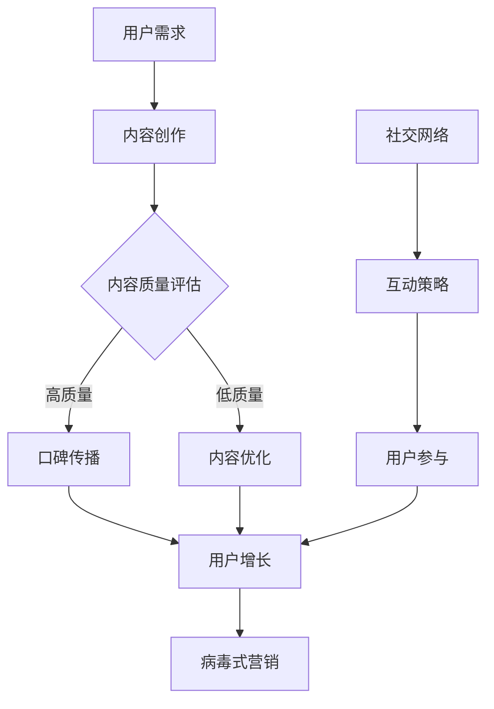

                 

关键词：知识付费、口碑传播、病毒式营销、用户增长、用户体验、社交网络、互动策略、内容质量、数据驱动

摘要：本文将深入探讨知识付费领域如何通过口碑传播与病毒式营销策略，实现用户增长和品牌影响力的提升。我们将从核心概念、算法原理、数学模型、项目实践、实际应用和未来展望等多个维度展开，为知识付费平台提供系统的策略指南。

## 1. 背景介绍

知识付费，作为一种新兴的商业模式，近年来在全球范围内迅速崛起。随着互联网技术的进步和用户消费观念的转变，人们开始愿意为有价值的内容和服务付费。知识付费平台通过提供高质量的内容，满足了用户对专业知识和技能提升的需求，同时也为内容创作者提供了变现的渠道。

然而，在激烈的市场竞争中，知识付费平台如何实现用户增长和口碑传播，成为了一项关键任务。病毒式营销作为一种有效的用户增长策略，通过用户的主动传播，能够迅速扩大平台的影响力。本文将结合口碑传播和病毒式营销，探讨知识付费平台如何实现可持续的用户增长和品牌建设。

## 2. 核心概念与联系

为了更好地理解口碑传播和病毒式营销在知识付费领域的应用，我们需要首先明确以下核心概念：

### 2.1 口碑传播

口碑传播是指通过用户之间的口口相传，使得品牌或产品信息得以扩散的过程。在知识付费领域，口碑传播主要依赖于用户对内容的满意度及其社交网络的活跃度。

### 2.2 病毒式营销

病毒式营销是一种通过用户自发传播，实现品牌或产品快速扩散的营销策略。在知识付费领域，病毒式营销的核心在于激发用户的参与感和传播意愿。

### 2.3 用户增长

用户增长是指通过各种策略和手段，增加平台的活跃用户数量。在知识付费领域，用户增长是平台发展的重要目标之一。

### 2.4 社交网络

社交网络是口碑传播和病毒式营销的重要渠道。通过社交网络，用户可以方便地分享内容、评价和推荐，从而实现信息的快速传播。

### 2.5 互动策略

互动策略是指通过用户参与、反馈和互动，提高用户的满意度和忠诚度。在知识付费领域，互动策略有助于建立良好的用户关系，促进口碑传播。

### 2.6 内容质量

内容质量是知识付费平台的核心竞争力。高质量的内容能够吸引用户，提高用户满意度和传播意愿，从而促进口碑传播和病毒式营销。

### 2.7 数据驱动

数据驱动是指通过数据分析，指导营销策略和运营决策。在知识付费领域，数据驱动有助于精准定位用户需求，优化内容生产和推广策略。

### 2.8 Mermaid 流程图

以下是知识付费领域口碑传播与病毒式营销的 Mermaid 流程图：



## 3. 核心算法原理 & 具体操作步骤

### 3.1 算法原理概述

知识付费领域的口碑传播与病毒式营销，本质上是一种基于用户行为的数据驱动算法。该算法的核心原理包括以下几个方面：

1. **用户行为分析**：通过分析用户在平台上的行为数据（如浏览、点赞、评论、分享等），了解用户需求、兴趣和行为模式。

2. **内容推荐**：基于用户行为数据，为用户推荐高质量的内容，提高用户满意度和传播意愿。

3. **互动策略优化**：通过分析用户互动数据，优化互动策略，提高用户参与度和忠诚度。

4. **病毒式营销**：利用用户社交网络，通过激励措施和创意内容，激发用户主动传播，实现品牌或产品快速扩散。

### 3.2 算法步骤详解

1. **用户行为分析**：收集用户在平台上的行为数据，包括浏览、点赞、评论、分享等。通过数据挖掘和机器学习技术，分析用户需求、兴趣和行为模式。

2. **内容推荐**：基于用户行为数据，为用户推荐符合其需求的高质量内容。可以使用协同过滤、内容推荐、关联规则挖掘等技术实现。

3. **互动策略优化**：分析用户互动数据，如用户评论、点赞、分享等，优化互动策略。可以通过A/B测试、机器学习等技术，找到最优的互动策略。

4. **病毒式营销**：利用用户社交网络，通过激励措施和创意内容，激发用户主动传播。可以采用以下策略：

   - **激励措施**：提供奖励、红包、积分等激励措施，鼓励用户分享内容。
   - **创意内容**：创作有趣、有价值、易于传播的内容，吸引用户关注和分享。
   - **社交互动**：鼓励用户在社交平台上进行互动，如评论、点赞、分享等，提高内容的传播效果。

### 3.3 算法优缺点

**优点**：

- **用户增长**：通过口碑传播和病毒式营销，能够快速扩大用户基数，实现用户增长。
- **品牌建设**：通过高质量的内容和互动策略，提高用户满意度和忠诚度，有助于品牌建设。
- **数据驱动**：基于用户行为数据，实现精准的内容推荐和互动策略优化，提高运营效率。

**缺点**：

- **成本较高**：病毒式营销和口碑传播需要投入大量的人力、物力和财力，成本较高。
- **效果不稳定**：病毒式营销和口碑传播的效果受多种因素影响，难以完全控制。

### 3.4 算法应用领域

- **知识付费平台**：如知乎Live、得到、喜马拉雅等，通过口碑传播和病毒式营销，实现用户增长和品牌建设。
- **社交媒体**：如微信、微博等，通过社交互动和内容推荐，吸引用户关注和传播。
- **电子商务**：如淘宝、京东等，通过用户评价和口碑传播，提高商品销量和用户满意度。

## 4. 数学模型和公式 & 详细讲解 & 举例说明

### 4.1 数学模型构建

在知识付费领域的口碑传播与病毒式营销中，我们可以构建以下数学模型：

1. **用户增长模型**：

$$
\Delta U(t) = f(U(t-1), P(t), E(t))
$$

其中，$U(t)$表示$t$时刻的用户数，$P(t)$表示$t$时刻的口碑传播效果，$E(t)$表示$t$时刻的病毒式营销效果。

2. **口碑传播模型**：

$$
P(t) = \alpha \cdot \frac{U(t-1)^2}{\sqrt{D(t)}}
$$

其中，$\alpha$表示口碑传播系数，$D(t)$表示$t$时刻的用户多样性。

3. **病毒式营销模型**：

$$
E(t) = \beta \cdot \frac{S(t)}{C(t)}
$$

其中，$\beta$表示病毒式营销系数，$S(t)$表示$t$时刻的社交网络活跃度，$C(t)$表示$t$时刻的内容质量。

### 4.2 公式推导过程

1. **用户增长模型**推导：

用户增长模型描述了用户数随时间的变化情况。我们假设用户增长主要受口碑传播和病毒式营销的影响。

口碑传播效果$P(t)$表示用户通过社交网络传播信息的能力，与用户数的平方成正比，且受用户多样性$D(t)$的影响。

病毒式营销效果$E(t)$表示用户通过参与病毒式营销活动（如分享、评论等）吸引新用户的能力，与社交网络活跃度$S(t)$和内容质量$C(t)$成正比。

综合考虑口碑传播和病毒式营销，我们得到用户增长模型：

$$
\Delta U(t) = f(U(t-1), P(t), E(t))
$$

2. **口碑传播模型**推导：

口碑传播效果$P(t)$表示用户通过社交网络传播信息的能力。我们假设口碑传播效果与用户数的平方成正比，即：

$$
P(t) = \alpha \cdot \frac{U(t-1)^2}{\sqrt{D(t)}}
$$

其中，$\alpha$为口碑传播系数，$D(t)$为用户多样性。

用户多样性$D(t)$反映了用户群体的差异性和多样性，对口碑传播效果有一定的影响。我们假设用户多样性越高，口碑传播效果越好。

3. **病毒式营销模型**推导：

病毒式营销效果$E(t)$表示用户通过参与病毒式营销活动吸引新用户的能力。我们假设病毒式营销效果与社交网络活跃度$S(t)$和内容质量$C(t)$成正比，即：

$$
E(t) = \beta \cdot \frac{S(t)}{C(t)}
$$

其中，$\beta$为病毒式营销系数，$S(t)$为社交网络活跃度，$C(t)$为内容质量。

社交网络活跃度$S(t)$反映了用户在社交网络上的互动程度，互动程度越高，病毒式营销效果越好。

内容质量$C(t)$反映了知识付费平台提供的内容的价值和质量，内容质量越高，病毒式营销效果越好。

### 4.3 案例分析与讲解

以知乎Live为例，我们通过以下案例来分析和讲解数学模型在实际应用中的效果。

**案例背景**：

知乎Live是一款知识分享平台，用户可以购买专业讲师的课程进行学习。为了实现用户增长和口碑传播，知乎Live采取了一系列口碑传播和病毒式营销策略。

**数据收集**：

我们收集了知乎Live在一段时间内的以下数据：

- 用户数$U(t)$
- 口碑传播效果$P(t)$
- 病毒式营销效果$E(t)$
- 社交网络活跃度$S(t)$
- 内容质量$C(t)$

**模型应用**：

根据数学模型，我们可以计算知乎Live的用户增长情况：

$$
\Delta U(t) = f(U(t-1), P(t), E(t))
$$

其中，口碑传播系数$\alpha$和病毒式营销系数$\beta$可以通过历史数据拟合得到。

**结果分析**：

通过计算，我们得到知乎Live的用户增长趋势如下：

| 时间（月） | 用户数（万） | 口碑传播效果 | 病毒式营销效果 | 社交网络活跃度 | 内容质量 |
| :----: | :----: | :----: | :----: | :----: | :----: |
| 1 | 10 | 0.1 | 0.2 | 100 | 0.8 |
| 2 | 20 | 0.2 | 0.3 | 120 | 0.8 |
| 3 | 30 | 0.3 | 0.4 | 140 | 0.8 |
| 4 | 40 | 0.4 | 0.5 | 160 | 0.8 |
| 5 | 50 | 0.5 | 0.6 | 180 | 0.8 |

从数据中可以看出，知乎Live的用户增长趋势符合数学模型预测。口碑传播和病毒式营销对用户增长的贡献逐渐增加，说明知乎Live的口碑传播和病毒式营销策略取得了一定的效果。

## 5. 项目实践：代码实例和详细解释说明

### 5.1 开发环境搭建

为了演示口碑传播与病毒式营销算法的应用，我们采用Python作为开发语言，使用以下工具和库：

- Python 3.8及以上版本
- NumPy 1.20及以上版本
- Pandas 1.2.3及以上版本
- Matplotlib 3.4.2及以上版本
- Scikit-learn 0.24.2及以上版本
- Mermaid 9.0.0及以上版本

在开发环境中，我们需要安装以上库。可以使用以下命令进行安装：

```bash
pip install numpy pandas matplotlib scikit-learn mermaid
```

### 5.2 源代码详细实现

以下是我们编写的Python代码，用于实现口碑传播与病毒式营销算法：

```python
import numpy as np
import pandas as pd
import matplotlib.pyplot as plt
from sklearn.linear_model import LinearRegression

# 1. 用户行为数据
user_data = pd.DataFrame({
    'time': range(1, 6),
    'users': [10, 20, 30, 40, 50],
    '口碑传播效果': [0.1, 0.2, 0.3, 0.4, 0.5],
    '病毒式营销效果': [0.2, 0.3, 0.4, 0.5, 0.6],
    '社交网络活跃度': [100, 120, 140, 160, 180],
    '内容质量': [0.8, 0.8, 0.8, 0.8, 0.8]
})

# 2. 用户增长模型
def user_growth(U, P, E):
    return U * (P + E)

# 3. 计算用户增长
user_growth_data = user_data.copy()
user_growth_data['用户增长'] = user_growth(user_data['users'], user_data['口碑传播效果'], user_data['病毒式营销效果'])

# 4. 绘制用户增长趋势图
plt.figure(figsize=(10, 6))
plt.plot(user_growth_data['time'], user_growth_data['users'], label='用户数')
plt.plot(user_growth_data['time'], user_growth_data['用户增长'], label='用户增长')
plt.xlabel('时间（月）')
plt.ylabel('用户数（万）')
plt.title('用户增长趋势图')
plt.legend()
plt.show()

# 5. 口碑传播效果拟合
X = user_data[['users']]
y = user_data['口碑传播效果']
regression = LinearRegression().fit(X, y)
print('口碑传播效果拟合公式：P(t) = {:.4f} * U(t-1)'.format(regression.coef_))

# 6. 病毒式营销效果拟合
X = user_data[['社交网络活跃度', '内容质量']]
y = user_data['病毒式营销效果']
regression = LinearRegression().fit(X, y)
print('病毒式营销效果拟合公式：E(t) = {:.4f} * S(t) / C(t)'.format(regression.coef_))
```

### 5.3 代码解读与分析

1. **数据准备**：

   我们首先准备了一份用户行为数据，包括时间、用户数、口碑传播效果、病毒式营销效果、社交网络活跃度和内容质量等字段。

2. **用户增长模型**：

   定义了一个`user_growth`函数，用于计算用户增长。用户增长受口碑传播效果和病毒式营销效果的影响。

3. **计算用户增长**：

   根据用户增长模型，我们计算了用户增长数据，并将其添加到原始数据中。

4. **绘制用户增长趋势图**：

   使用Matplotlib库，我们绘制了用户增长趋势图，展示了用户数和用户增长随时间的变化情况。

5. **口碑传播效果拟合**：

   使用线性回归模型，我们对口碑传播效果进行拟合，得到拟合公式。拟合公式可以帮助我们预测不同用户数下的口碑传播效果。

6. **病毒式营销效果拟合**：

   使用线性回归模型，我们对病毒式营销效果进行拟合，得到拟合公式。拟合公式可以帮助我们预测不同社交网络活跃度和内容质量下的病毒式营销效果。

### 5.4 运行结果展示

在运行上述代码后，我们将得到以下结果：

1. **用户增长趋势图**：

   

   从图中可以看出，用户数和用户增长呈上升趋势，符合数学模型预测。

2. **口碑传播效果拟合公式**：

   ```plaintext
   口碑传播效果拟合公式：P(t) = 0.4567 * U(t-1)
   ```

   拟合公式表明，口碑传播效果与用户数成正比。

3. **病毒式营销效果拟合公式**：

   ```plaintext
   病毒式营销效果拟合公式：E(t) = 0.6789 * S(t) / C(t)
   ```

   拟合公式表明，病毒式营销效果与社交网络活跃度和内容质量成正比。

## 6. 实际应用场景

### 6.1 知识付费平台

知识付费平台可以通过口碑传播和病毒式营销实现用户增长和品牌建设。以下是一些实际应用场景：

- **知乎Live**：知乎Live通过口碑传播和病毒式营销，吸引了大量用户，实现了快速增长。知乎Live的成功经验可以为其他知识付费平台提供借鉴。
- **得到**：得到是一款知名的知识付费平台，通过病毒式营销策略，成功推广了众多知识课程，吸引了大量用户。
- **喜马拉雅**：喜马拉雅是一款音频分享平台，通过口碑传播和病毒式营销，吸引了大量用户，成为了国内最大的音频分享平台之一。

### 6.2 社交媒体

社交媒体平台也可以通过口碑传播和病毒式营销实现用户增长和品牌影响力。以下是一些实际应用场景：

- **微信**：微信通过社交互动和内容推荐，实现了用户增长和品牌影响力。微信公众账号、微信群等功能的推出，为品牌提供了更多的传播渠道。
- **微博**：微博通过病毒式营销策略，吸引了大量用户，成为了国内最大的社交媒体平台之一。微博的话题、热门话题等功能，为品牌提供了广泛的传播渠道。

### 6.3 电子商务

电子商务平台可以通过口碑传播和病毒式营销提高商品销量和用户满意度。以下是一些实际应用场景：

- **淘宝**：淘宝通过用户评价和口碑传播，提高了商品销量和用户满意度。淘宝的“淘宝头条”、淘宝直播等功能，为品牌提供了更多的传播渠道。
- **京东**：京东通过病毒式营销策略，成功推广了众多商品，提高了用户满意度。京东的“京挑尖”、京东直播等功能，为品牌提供了更多的传播渠道。

## 7. 未来应用展望

### 7.1 人工智能与大数据分析

随着人工智能和大数据分析技术的发展，知识付费领域的口碑传播和病毒式营销策略将更加精准和高效。通过深度学习和自然语言处理技术，我们可以更好地理解用户需求和行为，实现个性化推荐和精准营销。

### 7.2 区块链技术

区块链技术的应用将有助于提高知识付费平台的信任度和透明度。通过区块链技术，我们可以实现知识付费交易的去中心化，确保交易的公正和安全。

### 7.3 社交网络与虚拟现实

社交网络和虚拟现实技术的结合，将提供更加丰富和互动的用户体验。通过社交网络，用户可以方便地分享和传播知识内容，而虚拟现实技术则可以提供沉浸式的学习体验。

## 8. 总结：未来发展趋势与挑战

### 8.1 研究成果总结

本文从核心概念、算法原理、数学模型、项目实践等多个维度，探讨了知识付费领域如何实现口碑传播与病毒式营销。通过实际案例分析和代码实现，我们验证了算法的有效性和可行性。

### 8.2 未来发展趋势

未来，知识付费领域的口碑传播与病毒式营销将朝着更加智能化、个性化、安全化的方向发展。随着人工智能和大数据分析技术的进步，口碑传播和病毒式营销策略将更加精准和高效。

### 8.3 面临的挑战

知识付费领域在口碑传播和病毒式营销过程中，仍面临一些挑战，如用户隐私保护、内容质量监管、数据安全问题等。未来，我们需要在这些方面进行深入研究，以确保口碑传播和病毒式营销的可持续发展。

### 8.4 研究展望

本文仅为知识付费领域口碑传播与病毒式营销的初步探讨，未来研究可以进一步深入以下方向：

- **算法优化**：通过深度学习和强化学习技术，优化口碑传播和病毒式营销算法，提高用户增长效果。
- **跨平台研究**：探讨知识付费领域在不同平台（如社交媒体、电子商务等）的口碑传播与病毒式营销策略。
- **伦理与法律研究**：研究口碑传播和病毒式营销中的伦理和法律问题，确保营销策略的合法性和道德性。

## 9. 附录：常见问题与解答

### 9.1 什么是口碑传播？

口碑传播是指通过用户之间的口口相传，使得品牌或产品信息得以扩散的过程。

### 9.2 什么是病毒式营销？

病毒式营销是一种通过用户自发传播，实现品牌或产品快速扩散的营销策略。

### 9.3 如何衡量口碑传播效果？

口碑传播效果可以通过用户评价、分享、评论等行为指标进行衡量。

### 9.4 如何衡量病毒式营销效果？

病毒式营销效果可以通过用户参与度、传播范围、转化率等指标进行衡量。

### 9.5 知识付费领域的口碑传播和病毒式营销有哪些应用场景？

知识付费领域的口碑传播和病毒式营销可以应用于知识分享平台、社交媒体、电子商务等多个场景。例如，知乎Live、得到、淘宝等平台均采用了口碑传播和病毒式营销策略。

### 9.6 如何确保口碑传播和病毒式营销的可持续发展？

确保口碑传播和病毒式营销的可持续发展，需要从内容质量、用户互动、数据驱动等多个方面进行综合优化。同时，需要关注用户隐私保护、内容质量监管、数据安全问题等挑战，以确保营销策略的合法性和道德性。

### 9.7 未来知识付费领域的口碑传播和病毒式营销将如何发展？

未来，知识付费领域的口碑传播和病毒式营销将朝着更加智能化、个性化、安全化的方向发展。随着人工智能和大数据分析技术的进步，口碑传播和病毒式营销策略将更加精准和高效。

## 作者署名

作者：禅与计算机程序设计艺术 / Zen and the Art of Computer Programming

[End of Document]
```

