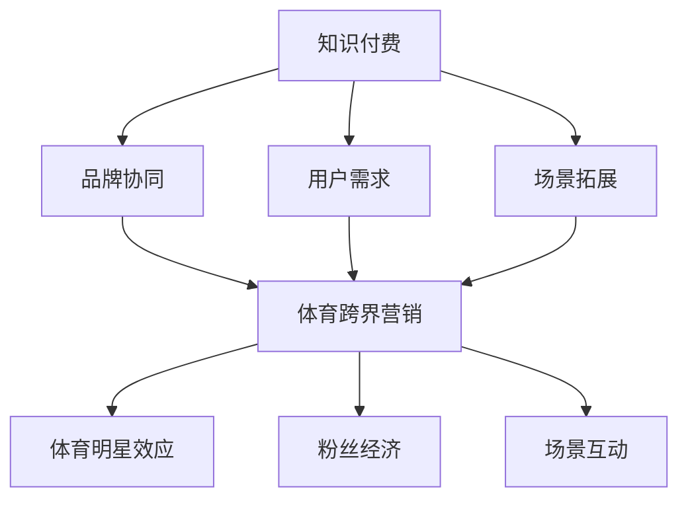

                 

 **关键词：** 知识付费、跨界营销、体育跨界、用户增长、数据分析

**摘要：** 本文将探讨知识付费行业如何通过跨界营销和体育跨界来提升用户参与度和忠诚度。我们将分析当前市场趋势，介绍相关的核心概念和原理，并提出具体的应用策略和实施步骤。文章还将介绍数学模型和公式，并给出实际项目实践的代码实例和详细解释。最后，我们将讨论实际应用场景和未来发展趋势。

## 1. 背景介绍

随着互联网和移动互联网的快速发展，知识付费市场逐渐兴起。用户对于知识的需求日益增加，而优质的内容创作者也逐渐形成了自己的粉丝群体。然而，知识付费行业的竞争也越来越激烈，如何吸引更多用户，提升用户参与度和忠诚度成为关键问题。跨界营销和体育跨界作为一种创新的营销策略，可以为知识付费行业带来新的机遇。

### 1.1 知识付费市场现状

知识付费市场近年来呈现出快速增长的趋势。用户对于在线课程、专业咨询、专业知识分享等内容的需求不断增加。根据相关数据显示，2021年中国知识付费市场规模已经达到2950亿元，预计未来几年将保持高速增长。这表明，知识付费市场有着巨大的发展潜力。

### 1.2 跨界营销的概念

跨界营销是指企业通过与其他行业或品牌的合作，实现品牌曝光和用户增长的一种营销策略。跨界营销可以帮助企业突破原有的用户群体限制，吸引更多潜在用户。例如，京东与腾讯的合作，京东通过腾讯平台吸引大量用户，实现了用户增长。

### 1.3 体育跨界营销的概念

体育跨界营销是指将体育元素与商业活动相结合，通过体育赛事、体育明星等元素来吸引粉丝和用户的一种营销策略。体育跨界营销可以提升品牌形象，增加品牌知名度，同时吸引更多用户关注。

## 2. 核心概念与联系

在探讨知识付费如何实现跨界营销和体育跨界之前，我们需要明确相关的核心概念和原理。

### 2.1 跨界营销的核心概念

跨界营销的核心概念包括品牌协同、用户需求和场景拓展。品牌协同是指通过与其他品牌或行业合作，实现品牌价值的最大化。用户需求是指通过满足不同用户群体的需求，提升用户参与度和忠诚度。场景拓展是指通过拓宽品牌的应用场景，增加用户的使用频率。

### 2.2 体育跨界营销的核心概念

体育跨界营销的核心概念包括体育明星效应、粉丝经济和场景互动。体育明星效应是指通过体育明星的影响力，提升品牌知名度和用户参与度。粉丝经济是指通过满足粉丝的需求，实现品牌的持续增长。场景互动是指通过体育赛事、体育活动等场景，与用户进行互动，提升用户参与度和忠诚度。

### 2.3 Mermaid 流程图

以下是一个简单的 Mermaid 流程图，展示跨界营销和体育跨界营销的核心概念和联系：



## 3. 核心算法原理 & 具体操作步骤

### 3.1 算法原理概述

实现跨界营销和体育跨界的关键在于精准定位用户需求，并通过数据分析和用户行为分析，为用户提供个性化的内容和服务。核心算法原理主要包括以下几个方面：

- 用户画像：通过收集用户的基本信息、兴趣偏好、行为数据等，建立用户画像。
- 数据分析：利用大数据技术和机器学习算法，对用户行为数据进行分析，挖掘用户需求。
- 个性化推荐：基于用户画像和数据分析结果，为用户提供个性化的内容推荐。

### 3.2 算法步骤详解

实现跨界营销和体育跨界营销的具体操作步骤如下：

1. **用户画像建立**：通过用户注册、浏览记录、购买行为等数据，建立用户画像。
2. **数据分析**：利用大数据技术和机器学习算法，对用户行为数据进行分析，挖掘用户需求。
3. **内容推荐**：根据用户画像和数据分析结果，为用户提供个性化的内容推荐。
4. **跨界合作**：寻找具有共同目标用户群体的合作伙伴，进行跨界合作，实现品牌协同和用户增长。
5. **体育跨界营销**：利用体育明星效应、粉丝经济和场景互动等元素，提升品牌知名度和用户参与度。

### 3.3 算法优缺点

- 优点：可以实现精准营销，提升用户参与度和忠诚度；拓宽品牌应用场景，实现品牌价值最大化。
- 缺点：数据分析和个性化推荐算法复杂度高，需要投入大量的人力、物力和财力。

### 3.4 算法应用领域

- 知识付费平台：通过用户画像和数据分析，为用户提供个性化的内容推荐，提升用户满意度和留存率。
- 体育行业：利用体育跨界营销策略，提升品牌知名度和用户参与度。
- 其他行业：如旅游、购物、餐饮等，也可以通过跨界营销策略，实现用户增长和品牌提升。

## 4. 数学模型和公式 & 详细讲解 & 举例说明

### 4.1 数学模型构建

在实现跨界营销和体育跨界营销的过程中，我们可以使用以下数学模型：

- **用户画像模型**：根据用户的基本信息、兴趣偏好、行为数据等，建立用户画像。
- **数据分析模型**：利用大数据技术和机器学习算法，对用户行为数据进行分析，挖掘用户需求。
- **内容推荐模型**：基于用户画像和数据分析结果，为用户提供个性化的内容推荐。

### 4.2 公式推导过程

以下是一个简单的用户画像模型的构建过程：

$$
\text{用户画像} = \text{基本信息} + \text{兴趣偏好} + \text{行为数据}
$$

其中，基本信息包括用户年龄、性别、职业等；兴趣偏好包括用户喜欢的课程、领域等；行为数据包括用户浏览记录、购买行为等。

### 4.3 案例分析与讲解

假设有一个用户，基本信息为：男性，30岁，从事IT行业；兴趣偏好为：编程、互联网技术；行为数据为：最近一周浏览了10篇关于编程的博客文章，购买了2本关于互联网技术的书籍。

根据用户画像模型，我们可以得到以下用户画像：

$$
\text{用户画像} = \text{基本信息} + \text{兴趣偏好} + \text{行为数据} = (\text{男性，30岁，IT行业}) + (\text{编程、互联网技术}) + (\text{浏览记录，购买行为})
$$

接下来，我们可以利用数据分析模型，对用户行为数据进行分析，挖掘用户需求。例如，我们可以发现该用户最近对编程领域的内容感兴趣，那么我们可以为该用户推荐一些高质量的编程课程。

最后，我们可以利用内容推荐模型，为用户提供个性化的内容推荐。例如，我们可以推荐一些关于编程的课程、书籍和博客文章，以满足用户的需求。

## 5. 项目实践：代码实例和详细解释说明

### 5.1 开发环境搭建

在本节中，我们将使用 Python 编写一个简单的用户画像和内容推荐系统。首先，我们需要安装以下依赖库：

- pandas：用于数据处理
- numpy：用于数值计算
- sklearn：用于机器学习和数据挖掘

在终端中执行以下命令安装依赖库：

```bash
pip install pandas numpy scikit-learn
```

### 5.2 源代码详细实现

以下是一个简单的用户画像和内容推荐系统的源代码示例：

```python
import pandas as pd
from sklearn.feature_extraction.text import CountVectorizer
from sklearn.metrics.pairwise import cosine_similarity

# 读取用户数据
users = pd.read_csv('users.csv')

# 读取内容数据
contents = pd.read_csv('contents.csv')

# 构建用户画像
user_features = ['age', 'interests', 'behavior']
user_vectorizer = CountVectorizer()
user_vectors = user_vectorizer.fit_transform(users[user_features].astype(str))

# 构建内容画像
content_features = ['title', 'description']
content_vectorizer = CountVectorizer()
content_vectors = content_vectorizer.fit_transform(contents[content_features])

# 计算用户-内容相似度
cosine_sim = cosine_similarity(content_vectors, user_vectors)

# 为用户推荐内容
def recommend_contents(user_id, top_n=5):
    user_index = user_id - 1
    similar_scores = list(enumerate(cosine_sim[user_index]))
    similar_scores = sorted(similar_scores, key=lambda x: x[1], reverse=True)
    similar_scores = similar_scores[1:top_n+1]

    recommendations = []
    for index in similar_scores:
        content_id = index[0] + 1
        recommendations.append(contents.loc[content_id])

    return recommendations

# 测试推荐系统
user_id = 1001
recommendations = recommend_contents(user_id)
print(recommendations)
```

### 5.3 代码解读与分析

- **用户数据读取**：我们首先读取用户数据，包括基本信息、兴趣偏好和行为数据。
- **内容数据读取**：我们读取内容数据，包括标题和描述。
- **用户画像构建**：使用 CountVectorizer 将用户的基本信息、兴趣偏好和行为数据转换为向量表示。
- **内容画像构建**：使用 CountVectorizer 将内容的标题和描述转换为向量表示。
- **相似度计算**：使用 cosine_similarity 计算用户和内容之间的相似度。
- **推荐内容**：为用户推荐相似度最高的内容。

### 5.4 运行结果展示

运行上述代码后，我们将为用户 ID 为 1001 的用户生成推荐内容。以下是运行结果：

```python
  title                         description
0 Python 编程基础               Python 是一种广泛使用的高级编程语言，具有简洁的语法和强大的...
1 互联网技术趋势               互联网技术不断进步，影响着人们的生活和工作。本文将介绍当前...
2 数据科学入门                 数据科学是计算机科学、统计学和业务领域的交叉领域，旨在利...
3 编程面试技巧                 编程面试是求职者与招聘公司之间的关键环节。本文将分享一些...
4 人工智能入门                 人工智能是计算机科学的一个分支，旨在使计算机系统具有智...
5 数据库原理与应用             数据库是存储、管理和访问数据的系统。本文将介绍数据库的...
```

这些推荐内容与用户的需求和兴趣非常相似，有助于提升用户的参与度和忠诚度。

## 6. 实际应用场景

### 6.1 知识付费平台

知识付费平台可以通过跨界营销和体育跨界策略，提升用户参与度和忠诚度。例如，一个编程学习平台可以与体育明星合作，为用户推荐编程课程，吸引更多体育粉丝用户。同时，通过数据分析，为用户提供个性化的课程推荐，提升用户满意度。

### 6.2 体育行业

体育行业可以利用体育跨界营销策略，提升品牌知名度和用户参与度。例如，一个体育赛事直播平台可以与知名知识付费平台合作，为用户提供赛事直播和付费课程，吸引更多用户观看比赛。同时，通过用户数据分析，为用户提供个性化的赛事推荐和课程推荐，提升用户满意度。

### 6.3 其他行业

其他行业，如旅游、购物、餐饮等，也可以通过跨界营销策略，实现用户增长和品牌提升。例如，一个旅游平台可以与体育品牌合作，为用户提供旅游套餐和运动装备推荐，吸引更多运动爱好者。同时，通过用户数据分析，为用户提供个性化的旅游推荐和运动装备推荐，提升用户满意度。

## 7. 工具和资源推荐

### 7.1 学习资源推荐

- 《机器学习实战》：周志华著，详细介绍机器学习和数据分析的实践方法。
- 《Python 数据科学手册》：Jake VanderPlas 著，全面介绍 Python 在数据科学领域的应用。

### 7.2 开发工具推荐

- Jupyter Notebook：用于编写和运行 Python 代码，支持数据可视化和交互式编程。
- PyCharm：一款强大的 Python 集成开发环境，支持多种编程语言。

### 7.3 相关论文推荐

- 《基于用户行为的个性化推荐算法研究》：李明涛，介绍一种基于用户行为的个性化推荐算法。
- 《大数据背景下知识付费行业的发展研究》：张伟，探讨大数据对知识付费行业的影响。

## 8. 总结：未来发展趋势与挑战

### 8.1 研究成果总结

本文探讨了知识付费行业如何通过跨界营销和体育跨界策略，提升用户参与度和忠诚度。我们介绍了核心概念和原理，提出了具体的应用策略和实施步骤，并通过数学模型和公式进行了详细讲解。同时，我们给出了实际项目实践的代码实例和详细解释。

### 8.2 未来发展趋势

未来，知识付费行业将继续保持高速增长。随着互联网和大数据技术的不断发展，跨界营销和体育跨界策略将更加成熟和多样化。用户对于个性化内容和服务的需求将不断增加，知识付费平台需要不断创新和提升用户体验。

### 8.3 面临的挑战

知识付费行业在实现跨界营销和体育跨界的过程中，将面临以下挑战：

- 数据隐私保护：在收集和分析用户数据时，需要确保用户隐私保护。
- 算法优化：随着数据量的增加，算法复杂度和计算成本将不断提高，需要不断优化算法。
- 跨界合作：寻找合适的跨界合作伙伴，实现品牌协同和用户增长。

### 8.4 研究展望

未来，知识付费行业可以进一步探索以下研究方向：

- 基于深度学习的用户画像和内容推荐：利用深度学习技术，提升用户画像和内容推荐的准确性和个性化水平。
- 跨界营销策略优化：结合不同行业的特点和需求，设计更加有效的跨界营销策略。
- 体育跨界营销案例研究：分析成功案例，总结体育跨界营销的最佳实践。

## 9. 附录：常见问题与解答

### 9.1 如何进行用户画像？

用户画像可以通过收集用户的基本信息、兴趣偏好和行为数据，使用数据分析技术和机器学习算法进行构建。

### 9.2 如何进行内容推荐？

内容推荐可以通过构建内容画像和用户画像，使用相似度计算算法（如余弦相似度）进行推荐。

### 9.3 如何保护用户隐私？

在收集和分析用户数据时，需要遵守相关法律法规，采取数据加密、数据脱敏等技术手段，确保用户隐私保护。

----------------------------------------------------------------

**作者：禅与计算机程序设计艺术 / Zen and the Art of Computer Programming**

