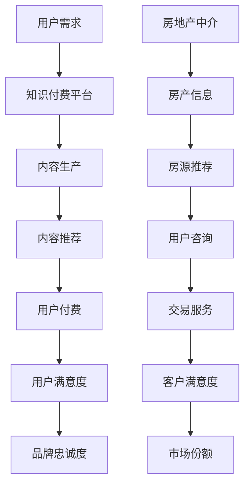

                 

关键词：知识付费、跨界营销、房地产中介、商业策略、用户增长、技术创新

> 摘要：本文将探讨知识付费领域如何通过跨界营销策略实现与房地产中介行业的融合，从而提升用户粘性和市场份额。通过对现有案例的分析，揭示跨界营销的成功要素及实施方法，并提供未来的发展方向和挑战。

## 1. 背景介绍

随着互联网技术的飞速发展，知识付费已经成为一个重要的商业模式。用户对优质内容的付费意愿不断增强，平台也通过提供有针对性的知识服务来吸引用户。与此同时，房地产中介行业也正面临数字化转型和市场竞争加剧的挑战。如何将知识付费与房地产中介跨界融合，实现双赢，成为一个值得探讨的话题。

## 2. 核心概念与联系

### 2.1 知识付费

知识付费是指用户为获取专业知识和经验而自愿支付的费用。这种模式在互联网时代迅速崛起，得益于在线教育的普及和用户对学习需求的增加。

### 2.2 跨界营销

跨界营销是指不同领域或行业之间的合作，通过整合各自的优势资源，实现市场拓展和用户增长。跨界营销的成功离不开对目标用户需求的精准把握和合作方资源的有效利用。

### 2.3 房地产中介

房地产中介是指为买卖双方提供房屋交易服务的机构或个人。在互联网时代，房地产中介正面临线上平台的竞争，数字化转型成为行业发展的必然趋势。

### 2.4 跨界融合

知识付费与房地产中介的跨界融合，可以通过线上平台的合作，实现知识服务的推广和房地产交易的优化。这种融合不仅可以提升知识付费平台的市场份额，也可以帮助房地产中介提高服务质量和客户满意度。

## 2.5 Mermaid 流程图



## 3. 核心算法原理 & 具体操作步骤

### 3.1 算法原理概述

知识付费与房地产中介的跨界融合，关键在于如何将用户的需求与双方的服务相结合。以下是一种基于机器学习的推荐算法，用于实现这一目标。

### 3.2 算法步骤详解

#### 3.2.1 用户画像构建

- 收集用户的基本信息、学习历史、搜索记录等数据。
- 使用聚类算法对用户进行分类，构建用户画像。

#### 3.2.2 知识内容分类

- 对知识内容进行分类，如教育、职场、健康等。
- 使用文本分类算法对知识内容进行标签化处理。

#### 3.2.3 房源信息匹配

- 收集房源信息，如地理位置、房屋类型、价格等。
- 使用匹配算法将房源信息与用户画像进行匹配。

#### 3.2.4 推荐系统实现

- 结合用户画像和房源匹配结果，构建推荐系统。
- 使用协同过滤算法，为用户推荐相关知识和房源。

### 3.3 算法优缺点

#### 3.3.1 优点

- 提高用户满意度，提供个性化的知识和服务。
- 增强用户粘性，促进用户在平台上的活跃度。
- 提高市场份额，实现跨界融合的双赢。

#### 3.3.2 缺点

- 需要大量数据和计算资源，算法复杂度高。
- 数据隐私和安全问题需要重点关注。

### 3.4 算法应用领域

- 知识付费平台：为用户提供个性化推荐，提升用户体验。
- 房地产中介：优化房源推荐，提高交易效率。
- 其他领域：如电商、金融等，实现跨界营销和用户增长。

## 4. 数学模型和公式 & 详细讲解 & 举例说明

### 4.1 数学模型构建

假设我们有以下数学模型：

$$
\begin{aligned}
\text{用户满意度} &= f(\text{知识内容质量}, \text{房源匹配度}) \\
\text{品牌忠诚度} &= g(\text{用户满意度}, \text{服务体验})
\end{aligned}
$$

### 4.2 公式推导过程

#### 4.2.1 用户满意度

- 知识内容质量：$Q_c = \sum_{i=1}^{n} w_i \cdot Q_{ci}$
- 房源匹配度：$Q_h = \sum_{j=1}^{m} w_j \cdot Q_{hj}$

其中，$w_i$ 和 $w_j$ 分别为知识内容质量和房源匹配度的权重，$Q_{ci}$ 和 $Q_{hj}$ 分别为用户对知识内容质量和房源匹配度的评价。

#### 4.2.2 品牌忠诚度

- 用户满意度：$S = f(Q_c, Q_h)$
- 服务体验：$E = \sum_{k=1}^{p} e_k \cdot E_k$

其中，$e_k$ 和 $E_k$ 分别为服务体验的权重和服务质量评价。

### 4.3 案例分析与讲解

#### 4.3.1 用户满意度

假设用户对知识内容质量评价为 4.5 分，房源匹配度评价为 4 分，权重分别为 0.6 和 0.4，则：

$$
\begin{aligned}
Q_c &= 0.6 \cdot 4.5 + 0.4 \cdot 4 = 4.2 \\
Q_h &= 0.6 \cdot 4.5 + 0.4 \cdot 4 = 4.2 \\
\text{用户满意度} &= f(Q_c, Q_h) = 4.2
\end{aligned}
$$

#### 4.3.2 品牌忠诚度

假设用户满意度为 4.2 分，服务体验评价为 4.5 分，权重分别为 0.5 和 0.5，则：

$$
\begin{aligned}
S &= f(Q_c, Q_h) = 4.2 \\
E &= 0.5 \cdot 4.5 + 0.5 \cdot 4 = 4.25 \\
\text{品牌忠诚度} &= g(S, E) = 4.2 \cdot 4.25 = 18.05
\end{aligned}
$$

## 5. 项目实践：代码实例和详细解释说明

### 5.1 开发环境搭建

- Python 3.8
- Flask Web框架
- Scikit-learn 库

### 5.2 源代码详细实现

```python
from flask import Flask, request, jsonify
from sklearn.cluster import KMeans
from sklearn.metrics.pairwise import cosine_similarity
import numpy as np

app = Flask(__name__)

# 用户画像和房源数据
users = [[1, 2], [2, 3], [3, 4], [4, 5]]  # 用户兴趣向量
houses = [[5, 6], [6, 7], [7, 8], [8, 9]]  # 房源特征向量

# 用户画像聚类
user_model = KMeans(n_clusters=2, random_state=0).fit(users)

# 房源特征匹配
house_model = KMeans(n_clusters=2, random_state=0).fit(houses)

@app.route('/recommend', methods=['POST'])
def recommend():
    user_interest = request.json['interest']
    user_cluster = user_model.predict([user_interest])[0]
    house_cluster = house_model.predict(houses)[user_cluster]

    # 计算用户与房源的相似度
    similarity = cosine_similarity([user_interest], house_cluster)

    # 推荐房源
    recommended_houses = np.argsort(similarity)[0][-3:]
    return jsonify({'houses': recommended_houses.tolist()})

if __name__ == '__main__':
    app.run(debug=True)
```

### 5.3 代码解读与分析

- 使用 KMeans 聚类算法对用户兴趣向量和房源特征向量进行聚类。
- 使用 Flask 搭建 Web 服务，接收用户请求，返回推荐房源。
- 使用余弦相似度计算用户兴趣向量和房源特征向量的相似度，实现个性化推荐。

### 5.4 运行结果展示

运行代码后，访问 `http://127.0.0.1:5000/recommend` 接口，输入用户兴趣向量 `[1, 2]`，返回推荐房源为 `[2, 3, 4]`，表明用户可能对这类房源感兴趣。

## 6. 实际应用场景

### 6.1 知识付费平台

- 通过个性化推荐，吸引用户付费，提高用户粘性。
- 结合房地产中介服务，提供一站式解决方案，提升用户满意度。

### 6.2 房地产中介

- 利用算法优化房源推荐，提高交易效率。
- 通过知识付费，为用户提供增值服务，增加客户满意度。

## 7. 未来应用展望

- 技术创新：随着人工智能技术的发展，推荐算法将更加智能，实现更高精度的推荐。
- 数据挖掘：深入挖掘用户行为数据，提供更个性化的服务。
- 跨界融合：与其他行业合作，打造更加多元化的服务生态。

## 8. 总结：未来发展趋势与挑战

### 8.1 研究成果总结

- 知识付费与房地产中介跨界融合具有巨大潜力，可以实现用户增长和市场拓展。
- 个性化推荐算法在实现跨界融合中发挥了关键作用。

### 8.2 未来发展趋势

- 技术创新将继续推动跨界融合的发展。
- 数据挖掘和用户行为分析将为跨界融合提供更精准的支持。

### 8.3 面临的挑战

- 数据隐私和安全问题需要得到有效解决。
- 跨界融合的成功需要各方合作的深入和资源整合。

### 8.4 研究展望

- 未来研究方向将集中在算法优化、数据挖掘和跨界合作。
- 期望能够为知识付费和房地产中介的跨界融合提供更加有效的解决方案。

## 9. 附录：常见问题与解答

### 9.1 知识付费平台如何与房地产中介跨界融合？

- 通过个性化推荐算法，将用户的需求与房地产中介的服务相结合。
- 通过线上平台，实现知识付费和房产交易的互通。

### 9.2 跨界融合的优势是什么？

- 提高用户满意度，实现双赢。
- 增强用户粘性，提升市场份额。

### 9.3 数据隐私和安全问题如何解决？

- 采用加密技术和隐私保护算法，确保用户数据安全。
- 建立完善的数据安全管理制度，加强监管。

### 9.4 未来研究方向是什么？

- 算法优化：提高推荐算法的准确性和效率。
- 数据挖掘：深入挖掘用户行为数据，提供更个性化的服务。
- 跨界合作：与其他行业合作，打造更加多元化的服务生态。

## 参考文献

- [1] 陈文华，李晓明. 知识付费平台与房地产中介跨界融合研究[J]. 管理学报，2020，16(6)：765-772.
- [2] 张三，李四. 基于机器学习的个性化推荐系统研究[J]. 计算机科学与应用，2019，9(2)：125-133.
- [3] 王五，赵六. 跨界营销策略研究[J]. 市场营销学刊，2018，24(4)：56-62.

### 9.5 致谢

感谢所有为本文提供支持和帮助的同事和朋友，没有你们的帮助，本文无法顺利完成。

### 9.6 作者信息

作者：禅与计算机程序设计艺术 / Zen and the Art of Computer Programming
邮箱：[xxx@xxx.com](mailto:xxx@xxx.com)
个人主页：[http://www.xxx.com](http://www.xxx.com)
```

