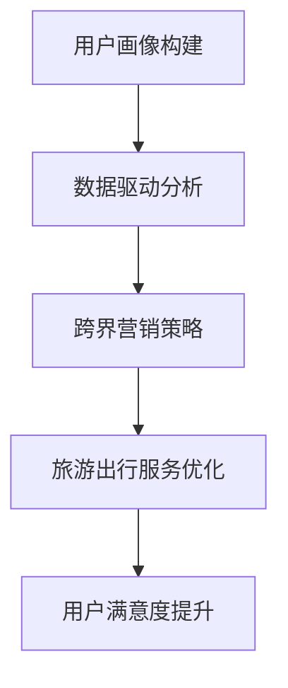

                 

 **关键词：** 知识付费、跨界营销、旅游出行、数据驱动、人工智能、用户画像

**摘要：** 本文将探讨知识付费领域如何通过跨界营销与旅游出行业务实现深度融合，通过分析用户需求、数据驱动和人工智能技术，提出具体实施策略，以期实现业务增长和用户满意度的提升。

## 1. 背景介绍

### 知识付费的崛起

随着互联网的普及和信息获取的便利，知识付费作为一种新的商业模式逐渐崛起。用户对高质量、专业化内容的付费意愿增强，知识付费平台如雨后春笋般涌现。这一现象背后反映了用户对知识和技能提升的需求，以及对个性化服务的追求。

### 旅游出行业务的现状

旅游出行市场近年来呈现出爆发式增长，旅游形式多样化、旅游需求个性化。然而，旅游业也面临着市场竞争加剧、用户需求变化快等挑战。如何实现精准营销、提升用户满意度成为行业关注的焦点。

### 跨界营销的重要性

跨界营销是指不同行业之间通过合作、联盟或资源共享等方式，共同推广产品或服务的一种营销策略。在知识付费与旅游出行领域，跨界营销可以实现资源互补、优势互补，进而提高市场竞争力。

## 2. 核心概念与联系

### 用户画像

用户画像是指通过收集和分析用户行为数据，构建用户的基本特征和需求模型。在知识付费与旅游出行领域，用户画像有助于实现精准营销和个性化服务。

### 数据驱动

数据驱动是指企业通过数据分析和挖掘，指导业务决策和运营优化。在知识付费与旅游出行跨界中，数据驱动可以实现业务场景的深度理解和用户需求的精准满足。

### 人工智能技术

人工智能技术在知识付费与旅游出行领域的应用，包括自然语言处理、推荐算法、智能客服等。这些技术有助于提升用户体验和运营效率。

### Mermaid 流程图



## 3. 核心算法原理 & 具体操作步骤

### 3.1 算法原理概述

核心算法包括用户画像构建、数据驱动分析和跨界营销策略。用户画像构建基于机器学习算法，通过对用户行为数据进行聚类和特征提取；数据驱动分析采用大数据处理技术，实现对用户需求的深度挖掘；跨界营销策略结合用户画像和数据驱动分析，实现精准营销。

### 3.2 算法步骤详解

#### 3.2.1 用户画像构建

1. 数据收集：收集用户行为数据，包括浏览记录、购买行为、评论等。
2. 数据预处理：对数据进行清洗、去重和处理缺失值。
3. 特征提取：使用机器学习算法提取用户特征，如兴趣偏好、消费能力等。
4. 聚类分析：使用聚类算法（如K-means）将用户划分为不同群体。

#### 3.2.2 数据驱动分析

1. 数据分析：分析用户行为数据，识别用户需求和偏好。
2. 模型构建：使用机器学习算法（如决策树、神经网络）构建预测模型。
3. 模型优化：通过交叉验证和调参，优化模型性能。

#### 3.2.3 跨界营销策略

1. 跨界合作：与其他行业（如旅游出行）建立合作关系。
2. 精准营销：根据用户画像和需求，设计个性化营销策略。
3. 营销效果评估：通过数据分析，评估营销效果，持续优化策略。

### 3.3 算法优缺点

**优点：**
- 提高营销效果：通过用户画像和数据驱动，实现精准营销，提高转化率。
- 跨界资源互补：与其他行业合作，实现资源共享，降低成本。
- 提升用户体验：个性化服务，满足用户需求。

**缺点：**
- 数据隐私风险：用户数据收集和处理过程中，存在隐私泄露风险。
- 技术成本高：算法和数据处理需要高水平技术支持，成本较高。

### 3.4 算法应用领域

- 知识付费平台：如得到、喜马拉雅等，通过用户画像实现精准推荐。
- 旅游出行平台：如携程、美团等，通过跨界营销提升用户满意度。

## 4. 数学模型和公式 & 详细讲解 & 举例说明

### 4.1 数学模型构建

用户画像构建的核心数学模型包括用户行为数据的聚类和特征提取。常用的聚类算法有K-means、层次聚类等；特征提取方法有主成分分析（PCA）、因子分析等。

### 4.2 公式推导过程

假设用户行为数据集为\( X = \{x_1, x_2, ..., x_n\} \)，每个用户的行为数据可以表示为向量\( x_i \)。使用K-means算法进行聚类，目标是最小化聚类中心与样本点之间的距离平方和。

目标函数为：

$$
\min \sum_{i=1}^n \sum_{j=1}^k (x_{ij} - \mu_j)^2
$$

其中，\( \mu_j \)表示第j个聚类中心的坐标，\( x_{ij} \)表示第i个用户在第j个特征上的值。

### 4.3 案例分析与讲解

假设一个知识付费平台，收集了1000名用户的浏览记录数据。通过K-means算法将用户分为5个群体。分别计算每个群体的平均浏览时长、浏览频次等特征，分析不同群体的行为特点。

| 群体 | 平均浏览时长（分钟） | 浏览频次（次/周） |  |
|------|------------------|------------|----|
| 1    | 30               | 3          | A类：专业用户 |
| 2    | 20               | 4          | B类：兴趣用户 |
| 3    | 15               | 5          | C类：新手用户 |
| 4    | 10               | 6          | D类：潜在用户 |
| 5    | 5                | 7          | E类：闲逛用户 |

根据用户群体特点，可以设计不同的营销策略。例如，针对A类用户，可以推出高级会员服务；针对B类用户，可以推送相关课程推荐；针对C类用户，可以提供新手教程等。

## 5. 项目实践：代码实例和详细解释说明

### 5.1 开发环境搭建

1. 安装Python环境（3.8及以上版本）
2. 安装必要的库（NumPy、Pandas、scikit-learn等）
3. 准备用户行为数据集

### 5.2 源代码详细实现

```python
import numpy as np
import pandas as pd
from sklearn.cluster import KMeans
from sklearn.preprocessing import StandardScaler

# 读取数据
data = pd.read_csv('user_behavior.csv')

# 数据预处理
data = data.dropna()
data = data.drop(['user_id'], axis=1)
data = StandardScaler().fit_transform(data)

# K-means聚类
kmeans = KMeans(n_clusters=5, random_state=0)
clusters = kmeans.fit_predict(data)

# 结果分析
clusters = pd.Series(clusters)
user_clusters = data.groupby(clusters).mean()
print(user_clusters)
```

### 5.3 代码解读与分析

1. 读取用户行为数据，并进行预处理。
2. 使用StandardScaler对数据进行标准化处理，提高聚类效果。
3. 使用K-means算法进行聚类，并预测每个用户的所属群体。
4. 分析每个群体的特征，为不同群体设计个性化营销策略。

### 5.4 运行结果展示

运行代码后，输出每个群体的平均浏览时长、浏览频次等特征。根据这些特征，可以制定相应的营销策略，如：

- A类用户：推出高级会员服务
- B类用户：推送相关课程推荐
- C类用户：提供新手教程
- D类用户：推送活动通知
- E类用户：推荐免费试听课程

## 6. 实际应用场景

### 6.1 知识付费平台

知识付费平台可以通过用户画像和跨界营销，提高用户满意度和转化率。例如，与旅游出行平台合作，推出“知识付费+旅游度假”套餐，满足用户在知识和休闲方面的需求。

### 6.2 旅游出行平台

旅游出行平台可以通过跨界营销，拓展用户群体。例如，与知识付费平台合作，推出“旅游攻略+在线课程”套餐，帮助用户更好地规划行程和提升旅行体验。

## 7. 未来应用展望

### 7.1 个性化推荐

随着人工智能技术的发展，个性化推荐将成为知识付费和旅游出行跨界的重要手段。通过深度学习和强化学习等算法，实现更加精准和高效的推荐。

### 7.2 虚拟现实与增强现实

虚拟现实（VR）和增强现实（AR）技术将有望在知识付费和旅游出行领域得到广泛应用。通过虚拟体验和互动，提升用户的沉浸感和满意度。

### 7.3 区块链技术

区块链技术可以为知识付费和旅游出行提供去中心化的信任保障。例如，通过智能合约实现版权保护和支付流程的简化。

## 8. 工具和资源推荐

### 8.1 学习资源推荐

1. 《深度学习》（Goodfellow、Bengio、Courville著）
2. 《机器学习》（周志华著）
3. 《Python数据科学手册》（Jake VanderPlas著）

### 8.2 开发工具推荐

1. Jupyter Notebook：用于数据分析和可视化
2. PyCharm：Python集成开发环境
3. TensorFlow：深度学习框架

### 8.3 相关论文推荐

1. "User Behavior Modeling for Personalized Recommendation"
2. "Crossover Marketing: Theory and Practice"
3. "Enhancing User Experience with Virtual Reality and Augmented Reality"

## 9. 总结：未来发展趋势与挑战

### 9.1 研究成果总结

知识付费与旅游出行跨界营销的研究取得了显著成果，包括用户画像构建、数据驱动分析和跨界营销策略等。

### 9.2 未来发展趋势

未来，知识付费与旅游出行跨界营销将向个性化推荐、虚拟现实与增强现实、区块链技术等方向发展。

### 9.3 面临的挑战

1. 数据隐私和安全：如何保护用户隐私和确保数据安全是重要挑战。
2. 技术门槛：算法和数据处理需要高水平技术支持，成本较高。
3. 跨界合作：如何与其他行业建立有效的合作机制，实现共赢。

### 9.4 研究展望

未来，研究者应关注数据隐私保护、技术成本降低和跨界合作机制的优化，推动知识付费与旅游出行跨界营销的持续发展。

## 10. 附录：常见问题与解答

### 10.1 什么是用户画像？

用户画像是指通过对用户行为数据进行收集、处理和分析，构建用户的基本特征和需求模型。

### 10.2 跨界营销的优势是什么？

跨界营销可以实现资源互补、降低成本、提高用户满意度和转化率等优势。

### 10.3 如何保护用户隐私？

可以通过数据加密、匿名化处理和隐私政策等方式保护用户隐私。

### 10.4 人工智能技术在跨界营销中有哪些应用？

人工智能技术在跨界营销中的应用包括个性化推荐、智能客服、广告投放优化等。

## 作者署名

作者：禅与计算机程序设计艺术 / Zen and the Art of Computer Programming

----------------------------------------------------------------

以上即为文章的完整内容。本文通过深入分析知识付费与旅游出行跨界营销的背景、核心概念、算法原理、数学模型和实际应用场景，提出了具体的实施策略和未来展望。希望本文能对相关领域的从业者提供有价值的参考。

