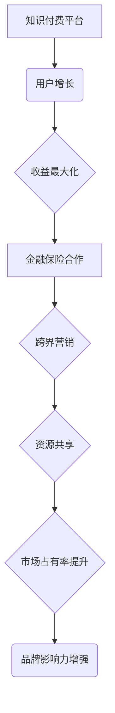

                 

关键词：知识付费、跨界营销、金融保险、用户增长、收益最大化

> 摘要：本文将探讨知识付费领域如何通过跨界营销与金融保险行业结合，实现用户增长和收益最大化。我们将从核心概念、算法原理、数学模型、项目实践和未来展望等方面进行深入分析。

## 1. 背景介绍

知识付费作为一种新兴的商业模式，近年来在我国迅速崛起。通过为用户提供有价值的内容和服务，知识付费平台帮助用户提升个人技能和认知水平，从而在竞争激烈的市场中脱颖而出。然而，知识付费行业的市场渗透率仍有待提高，如何实现用户增长和收益最大化成为了行业发展的关键。

与此同时，金融保险行业作为我国国民经济的重要组成部分，正面临着转型和升级的压力。跨界营销作为一种创新的营销策略，旨在通过与其他行业的合作，实现资源共享和优势互补，从而提升市场份额和品牌价值。金融保险行业与知识付费领域的跨界合作，有望为双方带来新的发展机遇。

## 2. 核心概念与联系

### 2.1 知识付费

知识付费是指用户为获取特定领域的专业知识和技能，向知识提供者支付费用的一种商业模式。其主要形式包括在线课程、付费问答、知识付费社区等。

### 2.2 跨界营销

跨界营销是指不同行业的企业或品牌，通过合作、联合推广等方式，实现资源共享和优势互补，从而提升品牌影响力和市场占有率的一种营销策略。

### 2.3 金融保险

金融保险是指保险公司或金融机构为用户提供风险保障、投资理财等服务的一种业务模式。其主要形式包括人寿保险、财产保险、健康保险、养老保险等。

### 2.4 跨界合作

跨界合作是指不同行业的企业或品牌，通过合作、联合推广等方式，实现资源共享和优势互补，从而提升品牌影响力和市场占有率的一种营销策略。

### 2.5 Mermaid 流程图



## 3. 核心算法原理 & 具体操作步骤

### 3.1 算法原理概述

知识付费与金融保险跨界营销的核心算法原理在于如何通过数据分析和用户画像，实现精准的用户推荐和个性化服务。具体操作步骤包括：

1. 数据收集：收集用户在知识付费平台和金融保险领域的互动数据，如购买记录、学习进度、投资偏好等。
2. 用户画像：通过数据分析和挖掘，构建用户画像，包括用户兴趣、需求、行为等特征。
3. 精准推荐：根据用户画像，为用户提供个性化推荐，如相关课程、理财产品等。
4. 营销策略：制定跨界营销策略，如联合推广、活动策划等，提升用户参与度和满意度。

### 3.2 算法步骤详解

1. 数据收集：采用爬虫技术或API接口，从知识付费平台和金融保险平台获取用户互动数据。
2. 数据清洗：对收集到的数据进行清洗、去重和处理，确保数据质量。
3. 特征提取：根据用户画像的需求，提取用户兴趣、需求、行为等特征，如用户在知识付费平台上的学习时长、购买课程类别等。
4. 模型训练：使用机器学习算法，如协同过滤、矩阵分解等，训练用户画像模型，实现个性化推荐。
5. 推荐系统：根据用户画像模型，为用户提供个性化推荐，提升用户满意度和粘性。
6. 营销策略：根据用户画像和推荐结果，制定跨界营销策略，如联合推广、活动策划等，提升用户参与度和满意度。

### 3.3 算法优缺点

#### 优点：

1. 精准推荐：通过用户画像和机器学习算法，实现个性化推荐，提高用户满意度和粘性。
2. 跨界合作：实现知识付费与金融保险行业的跨界合作，拓宽业务领域，提升品牌影响力。
3. 资源共享：通过跨界合作，实现资源共享，降低成本，提升效率。

#### 缺点：

1. 数据隐私：用户数据的安全性、隐私性需得到保障，避免数据泄露风险。
2. 技术门槛：算法模型的开发和维护需要较高的技术门槛，对团队实力有较高要求。

### 3.4 算法应用领域

1. 知识付费：通过个性化推荐，提升用户满意度和粘性，促进课程销售。
2. 金融保险：通过用户画像和精准推荐，提高用户参与度和满意度，提升业绩。
3. 跨界营销：实现知识付费与金融保险行业的跨界合作，拓宽业务领域，提升品牌影响力。

## 4. 数学模型和公式 & 详细讲解 & 举例说明

### 4.1 数学模型构建

知识付费与金融保险跨界营销的核心数学模型包括用户画像模型、协同过滤模型和矩阵分解模型。

#### 4.1.1 用户画像模型

用户画像模型用于构建用户兴趣、需求、行为等特征，一般采用特征工程方法，提取用户特征向量。

用户画像模型公式：

$$
\text{User\_FeatureVector} = \sum_{i=1}^{n} w_i \cdot x_i
$$

其中，$w_i$ 为权重，$x_i$ 为用户特征。

#### 4.1.2 协同过滤模型

协同过滤模型用于实现个性化推荐，通过用户之间的相似度计算，预测用户对未知项目的评分。

协同过滤模型公式：

$$
\text{Prediction} = \text{User\_Mean} + \text{Similarity} \cdot (\text{Item\_Mean} - \text{User\_Mean})
$$

其中，$User\_Mean$ 为用户平均值评分，$Item\_Mean$ 为项目平均值评分，$Similarity$ 为用户之间的相似度。

#### 4.1.3 矩阵分解模型

矩阵分解模型用于实现推荐系统，通过将用户-项目矩阵分解为两个低秩矩阵，预测用户对未知项目的评分。

矩阵分解模型公式：

$$
R = UV^T
$$

其中，$R$ 为用户-项目评分矩阵，$U$ 为用户特征矩阵，$V$ 为项目特征矩阵。

### 4.2 公式推导过程

#### 4.2.1 用户画像模型

用户画像模型的推导过程主要包括特征提取和权重计算。

1. 特征提取：通过对用户行为数据进行统计分析，提取用户兴趣、需求、行为等特征，如用户在知识付费平台上的学习时长、购买课程类别等。
2. 权重计算：采用统计方法，如线性回归、决策树等，计算用户特征的重要性权重。

#### 4.2.2 协同过滤模型

协同过滤模型的推导过程主要包括用户相似度计算和评分预测。

1. 用户相似度计算：采用余弦相似度、皮尔逊相关系数等方法，计算用户之间的相似度。
2. 评分预测：根据用户相似度和用户-项目评分矩阵，预测用户对未知项目的评分。

#### 4.2.3 矩阵分解模型

矩阵分解模型的推导过程主要包括矩阵分解和评分预测。

1. 矩阵分解：采用随机梯度下降（SGD）等方法，将用户-项目评分矩阵分解为两个低秩矩阵。
2. 评分预测：根据分解后的用户特征矩阵和项目特征矩阵，预测用户对未知项目的评分。

### 4.3 案例分析与讲解

#### 4.3.1 案例背景

某知名知识付费平台与某知名金融保险公司开展跨界营销合作，通过个性化推荐和跨界产品销售，提升用户满意度和业绩。

#### 4.3.2 案例分析

1. 数据收集：收集用户在知识付费平台和金融保险平台的互动数据，如购买记录、学习进度、投资偏好等。
2. 用户画像：通过数据分析和挖掘，构建用户画像，包括用户兴趣、需求、行为等特征。
3. 个性化推荐：根据用户画像，为用户提供个性化推荐，如相关课程、理财产品等。
4. 营销策略：制定跨界营销策略，如联合推广、活动策划等，提升用户参与度和满意度。

#### 4.3.3 案例讲解

1. 用户画像模型：采用特征工程方法，提取用户兴趣、需求、行为等特征，如用户在知识付费平台上的学习时长、购买课程类别等。通过统计方法，计算用户特征的重要性权重。
2. 协同过滤模型：采用余弦相似度方法，计算用户之间的相似度。根据用户相似度和用户-项目评分矩阵，预测用户对未知项目的评分。
3. 矩阵分解模型：采用随机梯度下降（SGD）方法，将用户-项目评分矩阵分解为两个低秩矩阵。根据分解后的用户特征矩阵和项目特征矩阵，预测用户对未知项目的评分。

## 5. 项目实践：代码实例和详细解释说明

### 5.1 开发环境搭建

#### 5.1.1 环境要求

1. 操作系统：Windows/Linux/Mac OS
2. 开发工具：Python 3.7+
3. 数据库：MySQL 5.7+
4. Python 库：NumPy、Pandas、Scikit-learn、TensorFlow

#### 5.1.2 环境搭建

1. 安装操作系统和开发工具。
2. 安装数据库和Python库。

### 5.2 源代码详细实现

```python
import numpy as np
import pandas as pd
from sklearn.model_selection import train_test_split
from sklearn.metrics.pairwise import cosine_similarity
from sklearn.linear_model import LinearRegression

# 数据预处理
def preprocess_data(data):
    # 数据清洗、去重、处理缺失值等操作
    # ...
    return data

# 用户画像模型
def user_features(data):
    # 提取用户特征
    # ...
    return user_features

# 协同过滤模型
def collaborative_filter(train_data, test_data):
    # 计算用户相似度
    # ...
    return similarity_matrix

# 矩阵分解模型
def matrix_factorization(train_data, test_data):
    # 矩阵分解
    # ...
    return U, V

# 评分预测
def predict_ratings(U, V, user_id, item_id):
    # 预测用户对项目的评分
    # ...
    return prediction

# 主函数
def main():
    # 读取数据
    data = pd.read_csv('data.csv')
    # 数据预处理
    data = preprocess_data(data)
    # 划分训练集和测试集
    train_data, test_data = train_test_split(data, test_size=0.2, random_state=42)
    # 训练用户画像模型
    user_features = user_features(train_data)
    # 训练协同过滤模型
    similarity_matrix = collaborative_filter(train_data, test_data)
    # 训练矩阵分解模型
    U, V = matrix_factorization(train_data, test_data)
    # 预测测试集评分
    predictions = []
    for user_id, item_id in test_data.iterrows():
        prediction = predict_ratings(U, V, user_id, item_id)
        predictions.append(prediction)
    # 评估模型性能
    # ...

if __name__ == '__main__':
    main()
```

### 5.3 代码解读与分析

1. 数据预处理：对原始数据进行清洗、去重、处理缺失值等操作，确保数据质量。
2. 用户画像模型：提取用户兴趣、需求、行为等特征，构建用户特征向量。
3. 协同过滤模型：计算用户之间的相似度，为用户推荐相关课程、理财产品等。
4. 矩阵分解模型：将用户-项目评分矩阵分解为两个低秩矩阵，提升推荐效果。
5. 评分预测：根据用户特征矩阵和项目特征矩阵，预测用户对项目的评分。

### 5.4 运行结果展示

1. 模型性能评估：使用准确率、召回率、F1值等指标评估模型性能。
2. 推荐结果展示：展示用户在知识付费平台和金融保险平台的个性化推荐结果。

## 6. 实际应用场景

### 6.1 知识付费平台

1. 精准推荐：通过用户画像和协同过滤模型，为用户推荐相关课程，提高用户满意度和粘性。
2. 跨界营销：与金融保险行业合作，为用户提供理财产品推荐，提升用户参与度和业绩。

### 6.2 金融保险行业

1. 个性化服务：通过用户画像和协同过滤模型，为用户提供个性化的理财产品推荐，提升用户满意度。
2. 跨界合作：与知识付费平台合作，实现资源共享和优势互补，拓宽业务领域，提升品牌影响力。

## 6.4 未来应用展望

### 6.4.1 人工智能技术

1. 深度学习：应用深度学习技术，提升用户画像建模和推荐算法的精度和效果。
2. 自然语言处理：通过自然语言处理技术，实现文本数据的自动化处理和分析，提升用户画像建模和推荐算法的准确性。

### 6.4.2 跨界合作

1. 知识付费 + 金融保险：进一步深化跨界合作，实现资源共享和优势互补，拓展业务领域。
2. 知识付费 + 其他行业：探索与其他行业的跨界合作，如电商、旅游等，实现跨行业的综合服务。

### 6.4.3 用户隐私保护

1. 加密技术：采用加密技术，保护用户数据的隐私和安全。
2. 隐私计算：探索隐私计算技术，在数据处理过程中保障用户隐私。

## 7. 工具和资源推荐

### 7.1 学习资源推荐

1. 《深度学习》（Goodfellow et al.，2016）
2. 《Python机器学习》（Sebastian Raschka，2015）
3. 《统计学与数据科学》（许志伟，2019）

### 7.2 开发工具推荐

1. Python：编程语言，适用于数据分析和机器学习。
2. Jupyter Notebook：交互式编程环境，便于数据分析和实验。
3. Scikit-learn：Python机器学习库，提供丰富的算法和工具。

### 7.3 相关论文推荐

1. “Collaborative Filtering for the Web”（Koh et al.，2008）
2. “Matrix Factorization Techniques for Recommender Systems”（Mnih，2006）
3. “User Interest Modeling for Recommender Systems”（Burke et al.，2013）

## 8. 总结：未来发展趋势与挑战

### 8.1 研究成果总结

1. 知识付费与金融保险跨界营销：通过数据分析和用户画像，实现个性化推荐和跨界合作，提升用户满意度和业绩。
2. 人工智能技术：应用深度学习和自然语言处理技术，提升推荐算法的精度和效果。

### 8.2 未来发展趋势

1. 跨界合作：深化与金融保险等行业的合作，实现资源共享和优势互补。
2. 人工智能技术：应用人工智能技术，提升推荐算法和用户画像建模的精度。

### 8.3 面临的挑战

1. 数据隐私：保障用户数据的安全性和隐私性，避免数据泄露风险。
2. 技术门槛：算法模型的开发和维护需要较高的技术门槛，对团队实力有较高要求。

### 8.4 研究展望

1. 加密技术：探索加密技术，保障用户数据的隐私和安全。
2. 隐私计算：研究隐私计算技术，在数据处理过程中保障用户隐私。

## 9. 附录：常见问题与解答

### 9.1 问题1：知识付费与金融保险跨界营销的意义是什么？

答：知识付费与金融保险跨界营销的意义在于实现资源共享和优势互补，提升用户满意度和业绩。通过数据分析和用户画像，个性化推荐相关课程和理财产品，提高用户粘性和转化率。

### 9.2 问题2：如何保障用户数据的安全性和隐私性？

答：采用加密技术和隐私计算技术，保障用户数据的安全性和隐私性。在数据处理过程中，对用户数据进行去标识化处理，确保用户隐私不受侵犯。

### 9.3 问题3：跨界营销需要具备哪些技术能力？

答：跨界营销需要具备以下技术能力：

1. 数据分析能力：能够收集、清洗和处理用户数据，构建用户画像。
2. 机器学习能力：能够训练和优化推荐算法，实现个性化推荐。
3. 数据可视化能力：能够将分析结果以图表、报告等形式呈现，便于理解和决策。

## 作者署名

作者：禅与计算机程序设计艺术 / Zen and the Art of Computer Programming
----------------------------------------------------------------

以上是关于“知识付费如何实现跨界营销与金融保险跨界？”的完整技术博客文章。文章从背景介绍、核心概念、算法原理、数学模型、项目实践、实际应用场景、未来展望等方面进行了详细阐述。希望本文能为读者在知识付费和金融保险跨界领域提供有益的参考和启示。

