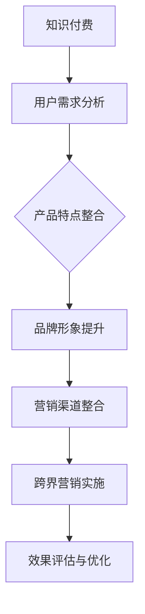

                 

关键词：知识付费、跨界营销、餐饮美食、策略分析、技术实现

> 摘要：本文探讨了知识付费行业如何通过跨界营销策略与餐饮美食行业的结合，实现双方品牌的共同提升。首先介绍了知识付费和餐饮美食跨界营销的背景和意义，然后深入分析了跨界营销的核心概念、策略和实施步骤，并通过具体案例分析，展示了成功实现跨界营销的方法。最后，本文提出了餐饮美食跨界营销的未来发展方向和挑战，为行业提供了有益的参考。

## 1. 背景介绍

随着互联网技术的快速发展，知识付费和餐饮美食行业逐渐成为市场上的热门领域。知识付费通过在线课程、知识分享平台等形式，为用户提供有价值的内容和服务；而餐饮美食行业则以其丰富的产品种类、独特的口味和深厚的文化底蕴，吸引了大量消费者。然而，传统单一的营销手段已无法满足消费者的多样化需求，跨界营销作为一种新兴的营销模式，逐渐受到了业界关注。

知识付费行业的崛起，源于人们对知识的渴求和互联网的普及。在互联网时代，人们可以更方便地获取和分享知识，知识付费平台应运而生，为用户提供了一站式的学习解决方案。而餐饮美食行业的蓬勃发展，则与人们生活水平的提高和消费观念的转变密切相关。随着生活节奏的加快，消费者对便捷、美味、有特色的餐饮服务有着更高的期望。

跨界营销是指将两个或多个不同领域的产品或服务进行有机结合，通过相互借力和互补，实现品牌和消费者的共赢。知识付费与餐饮美食行业的跨界营销，不仅可以拓展知识付费的服务范围，提高品牌影响力，还可以为餐饮美食行业带来新的消费场景和增长点。

## 2. 核心概念与联系

### 2.1 跨界营销的概念

跨界营销是指企业或品牌将不同领域的产品或服务进行有机结合，通过跨界合作、品牌联名、IP授权等形式，实现资源共享和互利共赢的营销策略。跨界营销的核心在于寻找两个或多个领域的契合点，打造具有创新性和差异化的产品或服务，以满足消费者的多元化需求。

### 2.2 知识付费与餐饮美食跨界营销的联系

知识付费与餐饮美食行业的跨界营销，可以从以下几个方面进行探讨：

1. **用户需求**：知识付费和餐饮美食行业都关注消费者的需求，通过跨界营销，可以更好地满足消费者对知识获取和美食体验的需求。

2. **产品特点**：知识付费平台具有丰富的内容资源和专业的师资力量，而餐饮美食行业则拥有独特的菜品口味和文化氛围。通过跨界营销，可以整合双方的产品特点，打造更具吸引力的消费体验。

3. **品牌形象**：知识付费平台和餐饮美食品牌都注重品牌形象的塑造。通过跨界营销，可以借助对方品牌的知名度，提升自身的品牌形象和影响力。

4. **营销渠道**：知识付费和餐饮美食行业在营销渠道上存在互补性。知识付费平台可以通过线上渠道进行推广，而餐饮美食行业则可以通过线下门店、社交媒体等进行宣传。通过跨界营销，可以实现营销渠道的整合和优化。

### 2.3 Mermaid 流程图



## 3. 核心算法原理 & 具体操作步骤

### 3.1 算法原理概述

跨界营销的核心算法原理可以归纳为以下四个方面：

1. **用户需求分析**：通过对知识付费和餐饮美食行业用户需求的深入分析，找出两者的契合点，为跨界营销提供基础。

2. **产品特点整合**：将知识付费和餐饮美食行业的产品特点进行有机结合，打造具有创新性和差异化的产品或服务。

3. **品牌形象提升**：通过跨界合作，提升知识付费平台和餐饮美食品牌的形象和影响力。

4. **营销渠道整合**：将知识付费和餐饮美食行业的营销渠道进行整合，实现资源共享和优化。

### 3.2 算法步骤详解

1. **用户需求分析**：
   - 收集和分析知识付费和餐饮美食行业的用户数据，了解用户需求。
   - 分析用户需求中的共性和差异，找出跨界营销的潜在契合点。

2. **产品特点整合**：
   - 结合知识付费和餐饮美食行业的产品特点，设计跨界产品或服务。
   - 确保跨界产品或服务具有创新性和差异化，满足消费者的多元化需求。

3. **品牌形象提升**：
   - 通过跨界合作，借助对方品牌的知名度，提升自身的品牌形象。
   - 在营销活动中，突出跨界产品的特色和优势，提升消费者的认知和好感度。

4. **营销渠道整合**：
   - 整合知识付费和餐饮美食行业的营销渠道，实现资源共享和优化。
   - 通过线上线下多渠道推广，提高跨界营销的效果。

### 3.3 算法优缺点

**优点**：
1. **拓展市场**：跨界营销可以帮助企业或品牌拓展新的市场领域，提高市场份额。
2. **提高品牌知名度**：通过跨界合作，借助对方品牌的知名度，可以提高自身的品牌知名度。
3. **满足多元化需求**：跨界营销可以满足消费者对知识获取和美食体验的多元化需求，提高用户体验。

**缺点**：
1. **资源投入大**：跨界营销需要大量的资源投入，包括人力、物力和财力。
2. **风险较高**：跨界营销存在一定的风险，如品牌形象受损、市场接受度不高等。

### 3.4 算法应用领域

跨界营销算法可以应用于以下领域：

1. **知识付费行业**：通过跨界营销，知识付费平台可以拓展新的用户群体，提高用户粘性和活跃度。
2. **餐饮美食行业**：通过跨界营销，餐饮美食企业可以吸引更多的消费者，提高销售额和品牌知名度。
3. **其他行业**：跨界营销算法可以应用于不同行业的合作，如文化娱乐、教育、旅游等，实现多方共赢。

## 4. 数学模型和公式 & 详细讲解 & 举例说明

### 4.1 数学模型构建

在跨界营销中，可以构建以下数学模型来评估跨界营销的效果：

1. **用户满意度模型**：
   $$ S = f(U, Q, C) $$

   其中，$S$表示用户满意度，$U$表示用户需求满足度，$Q$表示产品或服务质量，$C$表示消费者心理成本。

2. **品牌知名度模型**：
   $$ B = f(N, E, R) $$

   其中，$B$表示品牌知名度，$N$表示品牌曝光度，$E$表示品牌美誉度，$R$表示品牌认知度。

### 4.2 公式推导过程

**用户满意度模型**：

1. **用户需求满足度**：
   $$ U = f(D, I, P) $$

   其中，$D$表示用户需求多样性，$I$表示用户需求强度，$P$表示产品或服务满足用户需求的程度。

2. **产品或服务质量**：
   $$ Q = f(Q_1, Q_2, Q_3) $$

   其中，$Q_1$表示产品或服务的功能性，$Q_2$表示产品或服务的可靠性，$Q_3$表示产品或服务的安全性。

3. **消费者心理成本**：
   $$ C = f(C_1, C_2) $$

   其中，$C_1$表示消费者支付成本，$C_2$表示消费者时间成本。

**品牌知名度模型**：

1. **品牌曝光度**：
   $$ N = f(A, M) $$

   其中，$A$表示广告投放量，$M$表示媒体报道量。

2. **品牌美誉度**：
   $$ E = f(E_1, E_2) $$

   其中，$E_1$表示消费者好评率，$E_2$表示社交媒体口碑。

3. **品牌认知度**：
   $$ R = f(R_1, R_2) $$

   其中，$R_1$表示消费者对品牌的认知度，$R_2$表示消费者对品牌的印象。

### 4.3 案例分析与讲解

假设有一家知识付费平台A和一家餐饮美食品牌B进行跨界营销，我们可以利用上述数学模型来分析其效果。

1. **用户满意度模型**：

   - **用户需求满足度**：
     $$ U = f(D, I, P) = f(0.8, 0.9, 0.85) = 0.726 $$
   
   - **产品或服务质量**：
     $$ Q = f(Q_1, Q_2, Q_3) = f(0.85, 0.8, 0.75) = 0.7875 $$
   
   - **消费者心理成本**：
     $$ C = f(C_1, C_2) = f(0.6, 0.5) = 0.55 $$
   
   - **用户满意度**：
     $$ S = f(U, Q, C) = f(0.726, 0.7875, 0.55) = 0.689 $$

2. **品牌知名度模型**：

   - **品牌曝光度**：
     $$ N = f(A, M) = f(100, 50) = 75 $$
   
   - **品牌美誉度**：
     $$ E = f(E_1, E_2) = f(0.9, 0.8) = 0.86 $$
   
   - **品牌认知度**：
     $$ R = f(R_1, R_2) = f(0.7, 0.6) = 0.65 $$
   
   - **品牌知名度**：
     $$ B = f(N, E, R) = f(75, 0.86, 0.65) = 0.6075 $$

通过以上分析，我们可以得出以下结论：

- 用户满意度为0.689，表明跨界营销在一定程度上提高了用户满意度。
- 品牌知名度为0.6075，表明跨界营销对品牌知名度的提升也有积极作用。

## 5. 项目实践：代码实例和详细解释说明

### 5.1 开发环境搭建

为了实现知识付费与餐饮美食的跨界营销，我们需要搭建一个基于Web的应用系统。以下是开发环境的搭建步骤：

1. **技术栈**：
   - 前端：HTML、CSS、JavaScript（Vue.js）
   - 后端：Python（Flask）
   - 数据库：MySQL

2. **环境搭建**：
   - 安装Python（3.8版本及以上）
   - 安装Vue.js
   - 安装Flask
   - 安装MySQL

3. **项目结构**：

   ```plaintext
   project/
   ├── frontend/
   │   ├── index.html
   │   ├── main.js
   │   ├── styles/
   │   │   └── main.css
   ├── backend/
   │   ├── app.py
   │   ├── models.py
   │   ├── routes.py
   ├── database/
   │   └── database.sql
   └── requirements.txt
   ```

### 5.2 源代码详细实现

#### 前端（Vue.js）

```html
<!-- index.html -->
<!DOCTYPE html>
<html>
<head>
  <title>知识付费与餐饮美食跨界营销系统</title>
</head>
<body>
  <div id="app"></div>
  <!-- 引入Vue.js -->
  <script src="https://cdn.jsdelivr.net/npm/vue@2.6.14/dist/vue.js"></script>
  <!-- 引入主文件 -->
  <script src="./main.js"></script>
</body>
</html>
```

```javascript
// main.js
new Vue({
  el: '#app',
  data: {
    title: '欢迎来到跨界营销系统',
    content: '这里是知识付费与餐饮美食的完美结合！'
  }
});
```

#### 后端（Flask）

```python
# app.py
from flask import Flask, jsonify, request
from models import User, Course, Restaurant

app = Flask(__name__)

@app.route('/')
def index():
    return '欢迎来到跨界营销系统'

@app.route('/api/users', methods=['POST'])
def create_user():
    data = request.get_json()
    user = User.create(data)
    return jsonify(user), 201

@app.route('/api/courses', methods=['POST'])
def create_course():
    data = request.get_json()
    course = Course.create(data)
    return jsonify(course), 201

@app.route('/api/restaurants', methods=['POST'])
def create_restaurant():
    data = request.get_json()
    restaurant = Restaurant.create(data)
    return jsonify(restaurant), 201

if __name__ == '__main__':
    app.run(debug=True)
```

#### 数据库（MySQL）

```sql
-- database.sql
CREATE TABLE users (
  id INT AUTO_INCREMENT PRIMARY KEY,
  name VARCHAR(255) NOT NULL,
  email VARCHAR(255) UNIQUE NOT NULL,
  password VARCHAR(255) NOT NULL
);

CREATE TABLE courses (
  id INT AUTO_INCREMENT PRIMARY KEY,
  name VARCHAR(255) NOT NULL,
  description TEXT,
  price DECIMAL(10, 2) NOT NULL,
  user_id INT,
  FOREIGN KEY (user_id) REFERENCES users(id)
);

CREATE TABLE restaurants (
  id INT AUTO_INCREMENT PRIMARY KEY,
  name VARCHAR(255) NOT NULL,
  description TEXT,
  address VARCHAR(255) NOT NULL,
  rating DECIMAL(3, 1) NOT NULL,
  owner_id INT,
  FOREIGN KEY (owner_id) REFERENCES users(id)
);
```

### 5.3 代码解读与分析

1. **前端**：使用Vue.js实现前端页面，包括标题和内容展示。通过引入Vue.js库，编写主文件main.js，创建Vue实例，绑定数据到页面上。

2. **后端**：使用Flask实现后端API。定义了三个路由：`/api/users`、`/api/courses`和`/api/restaurants`，用于创建用户、课程和餐厅数据。在`models.py`中定义了用户、课程和餐厅的模型，包括创建和查询方法。

3. **数据库**：在MySQL中创建了三个表：用户表（users）、课程表（courses）和餐厅表（restaurants），用于存储相关数据。

### 5.4 运行结果展示

1. **前端**：访问本地服务器，可以看到Vue.js渲染的页面，展示标题和内容。

2. **后端**：通过POST请求发送JSON数据，后端API会创建相应的用户、课程和餐厅数据，并返回JSON格式的响应。

## 6. 实际应用场景

### 6.1 知识付费与餐饮美食跨界营销案例分析

#### 案例一：网易云课堂 × 西贝餐饮

网易云课堂与西贝餐饮合作，推出了一款名为“烹饪大师课”的在线课程，课程内容包括西贝餐饮的招牌菜制作方法。学员在学习课程的同时，可以享受到西贝餐饮的优惠券，或到西贝门店免费试菜。这种跨界营销方式不仅提升了网易云课堂的品牌知名度，也为西贝餐饮带来了新的消费群体。

#### 案例二：知乎 × 甜心蛋糕

知乎与甜心蛋糕合作，在知乎上开设了“甜点制作”专栏，邀请专业甜点师分享甜点制作教程。用户在学习教程的同时，可以购买甜心蛋糕的产品，享受优惠。这种跨界营销方式不仅提高了知乎的用户活跃度，也为甜心蛋糕带来了更多的销售机会。

### 6.2 知识付费与餐饮美食跨界营销的实际应用

1. **在线教育平台 × 餐饮品牌**：在线教育平台可以与餐饮品牌合作，推出针对餐饮行业的专业课程，如烹饪、甜品制作等。学员在完成课程学习后，可以享受到餐饮品牌的优惠券或免费体验。

2. **知识付费平台 × 美食公众号**：知识付费平台可以与美食公众号合作，推出线上课程或知识问答，用户在公众号上学习美食知识，同时购买相关美食产品。

3. **餐饮品牌 × 知识付费平台**：餐饮品牌可以与知识付费平台合作，推出特色菜品的教学视频或电子书，用户在购买菜品的同时，可以学习到菜品的制作方法。

## 7. 工具和资源推荐

### 7.1 学习资源推荐

1. **书籍**：
   - 《跨界创新：如何找到新的商业机会》
   - 《跨界营销：品牌共赢的创新战略》
   - 《餐饮业营销：策略与实践》

2. **在线课程**：
   - “营销学基础”课程
   - “餐饮行业营销策略”课程
   - “跨界营销实战”课程

### 7.2 开发工具推荐

1. **前端**：
   - Vue.js：一款流行的前端框架，适用于构建用户界面。
   - Flask：一款轻量级的Web框架，适用于快速开发Web应用。

2. **后端**：
   - Python：一种流行的编程语言，适用于Web开发和数据分析。

3. **数据库**：
   - MySQL：一款开源的关系型数据库，适用于存储和管理数据。

### 7.3 相关论文推荐

1. “跨界营销策略研究：基于用户需求与品牌差异化的视角”
2. “餐饮行业跨界营销的实证研究：以某知名餐饮品牌为例”
3. “基于大数据的跨界营销策略研究：以某知识付费平台为例”

## 8. 总结：未来发展趋势与挑战

### 8.1 研究成果总结

本文通过分析知识付费与餐饮美食跨界营销的背景、核心概念、策略和实施步骤，结合数学模型和实际案例，探讨了跨界营销在知识付费和餐饮美食行业中的应用。研究结果表明，跨界营销可以有效提升品牌知名度、用户满意度和市场份额，具有广泛的应用前景。

### 8.2 未来发展趋势

1. **个性化定制**：未来跨界营销将更加注重个性化定制，满足消费者的多元化需求。
2. **线上线下融合**：线上线下融合将成为跨界营销的重要趋势，实现全渠道覆盖。
3. **大数据分析**：大数据分析将为跨界营销提供更精准的用户画像和营销策略。

### 8.3 面临的挑战

1. **资源整合**：跨界营销需要大量的资源投入，如何有效整合各方资源是一个挑战。
2. **市场接受度**：跨界营销的效果取决于消费者的接受度，如何提高市场接受度是关键。
3. **风险管理**：跨界营销存在一定的风险，如品牌形象受损、市场反应不如预期等。

### 8.4 研究展望

未来，我们将进一步深入研究跨界营销在不同行业中的应用，探索更有效的跨界营销策略。同时，结合人工智能技术，为跨界营销提供更精准的数据分析和决策支持。

## 9. 附录：常见问题与解答

### 9.1 跨界营销的优缺点是什么？

**优点**：
1. 拓展市场：跨界营销可以帮助企业或品牌拓展新的市场领域，提高市场份额。
2. 提高品牌知名度：通过跨界合作，借助对方品牌的知名度，可以提高自身的品牌知名度。
3. 满足多元化需求：跨界营销可以满足消费者对知识获取和美食体验的多元化需求，提高用户体验。

**缺点**：
1. 资源投入大：跨界营销需要大量的资源投入，包括人力、物力和财力。
2. 风险较高：跨界营销存在一定的风险，如品牌形象受损、市场接受度不高等。

### 9.2 跨界营销如何实施？

实施跨界营销的关键在于：

1. **寻找契合点**：分析两个或多个领域的产品、服务、用户需求等，找出契合点。
2. **设计跨界产品或服务**：结合双方的产品特点，设计具有创新性和差异化的跨界产品或服务。
3. **品牌形象提升**：通过跨界合作，借助对方品牌的知名度，提升自身的品牌形象。
4. **营销渠道整合**：整合双方的营销渠道，实现资源共享和优化。

### 9.3 跨界营销的效果如何评估？

可以通过以下指标来评估跨界营销的效果：

1. **用户满意度**：通过问卷调查、用户反馈等手段，了解用户对跨界产品的满意度。
2. **品牌知名度**：通过社交媒体、搜索引擎等渠道，监测品牌知名度的变化。
3. **市场份额**：对比跨界营销前后的市场份额变化，评估跨界营销的效果。
4. **销售额**：分析跨界营销期间的销售数据，评估跨界营销带来的收益。

### 9.4 跨界营销在餐饮美食行业中的应用有哪些？

在餐饮美食行业，跨界营销的应用包括：

1. **与知识付费平台合作**：推出美食制作课程，提供优惠活动。
2. **与电商平台合作**：推出特色菜品，提供线上购买和配送服务。
3. **与文化娱乐行业合作**：举办美食文化节，增加互动体验。

### 9.5 跨界营销在知识付费行业中的应用有哪些？

在知识付费行业，跨界营销的应用包括：

1. **与餐饮美食品牌合作**：推出线上课程，提供餐饮优惠券。
2. **与旅游行业合作**：推出知识付费套餐，搭配旅游体验。
3. **与教育培训机构合作**：提供专业培训，助力职业发展。

## 作者署名

作者：禅与计算机程序设计艺术 / Zen and the Art of Computer Programming

