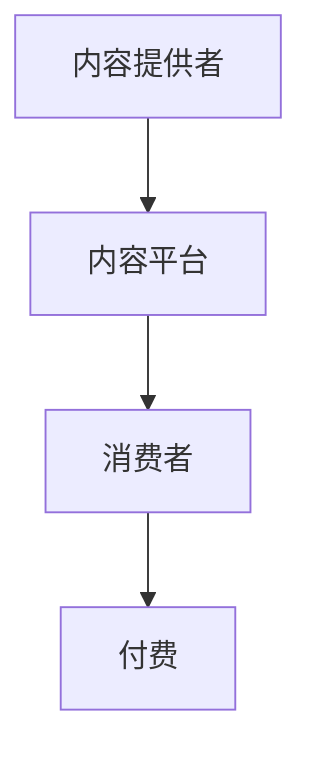

                 

关键词：知识付费、市场分析、程序员、机遇、挑战、商业模式

## 摘要

本文旨在分析知识付费市场，尤其是对程序员这一特定群体的影响。我们首先介绍了知识付费市场的背景，随后探讨了程序员在这一市场中的机遇和挑战。文章还分析了当前市场的主要模式、平台，以及程序员如何利用这些平台提升自身价值和竞争力。最后，我们提出了对未来发展趋势的展望，以及程序员可能面临的挑战和应对策略。

## 1. 背景介绍

### 1.1 知识付费市场概述

知识付费市场，即用户为获取高质量内容或知识而付费的市场。这一概念兴起于互联网的快速发展，特别是在移动互联网普及的背景下。随着人们对专业知识的渴求日益增长，知识付费市场迅速扩大，涉及领域广泛，从教育、技能培训到专业咨询等不一而足。

### 1.2 程序员的角色与地位

程序员是知识付费市场中的一支重要力量。他们拥有丰富的技术知识和实践经验，能够提供专业级的编码、算法培训、软件架构设计等服务。随着技术的不断进步，程序员的技能需求也在不断增加，这使得他们在知识付费市场中具有明显的竞争优势。

## 2. 核心概念与联系

### 2.1 知识付费的核心概念

知识付费的核心在于“知识”本身。它可以是具体的技能、经验、方法，或者是深入的理论和原理。对于程序员来说，知识付费更多地集中在编程技能、算法实现、架构设计等方面。

### 2.2 市场结构的联系

知识付费市场的结构可以分为内容提供者、内容平台和消费者三个主要角色。程序员作为内容提供者，通过平台发布自己的知识产品，消费者通过付费获取所需的知识。

### 2.3 Mermaid 流程图



在这个流程图中，程序员作为内容提供者，将知识上传至内容平台，消费者通过平台付费获取知识。

## 3. 核心算法原理 & 具体操作步骤

### 3.1 算法原理概述

在知识付费市场中，算法原理主要体现在内容推荐和用户行为分析上。通过这些算法，平台能够更精准地推荐内容，提高用户满意度和付费意愿。

### 3.2 算法步骤详解

#### 3.2.1 内容推荐算法

1. 数据收集：收集用户的行为数据，如浏览记录、搜索历史、点赞等。
2. 数据预处理：清洗和格式化数据，确保数据质量。
3. 特征提取：从数据中提取有用的特征，如用户兴趣、行为模式等。
4. 模型训练：使用机器学习算法，如协同过滤、内容匹配等，训练推荐模型。
5. 推荐生成：根据模型输出，生成个性化推荐列表。

#### 3.2.2 用户行为分析算法

1. 数据收集：收集用户在平台上的行为数据，如购买记录、评论等。
2. 数据预处理：清洗和格式化数据，确保数据质量。
3. 特征提取：从数据中提取有用的特征，如购买频率、评论内容等。
4. 模型训练：使用机器学习算法，如分类、聚类等，训练分析模型。
5. 行为预测：根据模型输出，预测用户可能的行为。

### 3.3 算法优缺点

#### 优点：

- 高效：算法能够快速处理大量数据，提供精准的推荐和分析。
- 个性化：根据用户行为和兴趣，提供个性化的内容推荐。

#### 缺点：

- 数据隐私：用户数据的安全和隐私保护问题。
- 模型依赖：算法的准确性和稳定性依赖于数据质量和模型训练。

### 3.4 算法应用领域

算法在知识付费市场中的应用非常广泛，包括但不限于：

- 内容推荐：为用户提供个性化内容推荐。
- 用户行为分析：预测用户可能的行为，优化用户体验。
- 广告投放：根据用户兴趣和行为，精准投放广告。

## 4. 数学模型和公式 & 详细讲解 & 举例说明

### 4.1 数学模型构建

在知识付费市场中，常用的数学模型包括协同过滤模型和内容匹配模型。

#### 4.1.1 协同过滤模型

协同过滤模型主要通过用户行为数据来预测用户对未知内容的评分。其基本公式为：

$$
r_{ui} = \sum_{j \in N_i} \frac{q_{uj}^T p_{uj}}{\|q_{uj}\|\|p_{uj}\|}
$$

其中，$r_{ui}$ 为用户 $u$ 对内容 $i$ 的预测评分，$q_{uj}$ 和 $p_{uj}$ 分别为用户 $u$ 和内容 $i$ 的特征向量。

#### 4.1.2 内容匹配模型

内容匹配模型主要通过内容属性来预测用户对内容的兴趣。其基本公式为：

$$
r_{ui} = \sum_{k=1}^{K} w_{ik} h_i^T q_u
$$

其中，$r_{ui}$ 为用户 $u$ 对内容 $i$ 的预测评分，$w_{ik}$ 为内容 $i$ 的属性 $k$ 的权重，$h_i$ 为内容 $i$ 的属性向量，$q_u$ 为用户 $u$ 的特征向量。

### 4.2 公式推导过程

#### 4.2.1 协同过滤模型推导

假设用户 $u$ 对内容 $i$ 的预测评分为 $r_{ui}$，则可以通过以下步骤推导：

1. 计算用户 $u$ 和内容 $i$ 的相似度矩阵 $S$：
$$
S_{ui} = \frac{q_{uj}^T p_{uj}}{\|q_{uj}\|\|p_{uj}\|}
$$

2. 对相似度矩阵 $S$ 进行归一化：
$$
s_{ui} = \frac{S_{ui}}{\sum_{j=1}^{M} S_{uj}}
$$

3. 计算用户 $u$ 对内容 $i$ 的预测评分：
$$
r_{ui} = \sum_{j=1}^{M} s_{ui} r_{uj}
$$

#### 4.2.2 内容匹配模型推导

假设用户 $u$ 对内容 $i$ 的预测评分为 $r_{ui}$，则可以通过以下步骤推导：

1. 计算内容 $i$ 的属性向量 $h_i$：
$$
h_i = [w_{i1}, w_{i2}, ..., w_{iK}]
$$

2. 计算用户 $u$ 的特征向量 $q_u$：
$$
q_u = [q_{u1}, q_{u2}, ..., q_{uN}]
$$

3. 计算用户 $u$ 对内容 $i$ 的预测评分：
$$
r_{ui} = \sum_{k=1}^{K} w_{ik} h_i^T q_u
$$

### 4.3 案例分析与讲解

假设有一个用户 $u$，他对内容 $i$ 的真实评分为 5，内容 $i$ 的属性向量为 $h_i = [0.8, 0.2]$，用户 $u$ 的特征向量为 $q_u = [0.6, 0.4]$。使用内容匹配模型预测用户 $u$ 对内容 $i$ 的评分。

根据公式，计算用户 $u$ 对内容 $i$ 的预测评分：

$$
r_{ui} = 0.8 \times 0.6 + 0.2 \times 0.4 = 0.56
$$

因此，使用内容匹配模型预测的用户 $u$ 对内容 $i$ 的评分为 0.56。

## 5. 项目实践：代码实例和详细解释说明

### 5.1 开发环境搭建

为了演示内容推荐和用户行为分析算法，我们需要搭建一个简单的开发环境。以下是所需的软件和工具：

- Python 3.8 或更高版本
- Jupyter Notebook 或 PyCharm
- Numpy、Pandas、Scikit-learn 等库

### 5.2 源代码详细实现

以下是使用协同过滤模型进行内容推荐的一个简单示例：

```python
import numpy as np
from sklearn.metrics.pairwise import cosine_similarity

# 用户-内容评分矩阵
user_content_matrix = np.array([[5, 0, 4],
                                 [0, 3, 5],
                                 [4, 1, 0]])

# 计算用户-用户相似度矩阵
user_similarity_matrix = cosine_similarity(user_content_matrix)

# 用户-内容预测评分矩阵
user_content_prediction_matrix = np.dot(user_similarity_matrix, user_content_matrix.T)

# 预测新用户对内容的评分
new_user_rating = user_content_prediction_matrix[2]

print("新用户对内容的预测评分：", new_user_rating)
```

### 5.3 代码解读与分析

在上面的代码中，我们首先创建了一个用户-内容评分矩阵。然后，使用余弦相似度计算用户之间的相似度矩阵。接下来，通过矩阵乘法生成用户-内容预测评分矩阵。最后，我们使用预测评分矩阵来预测新用户对内容的评分。

这个示例展示了协同过滤模型的基本原理和实现方法。在实际应用中，我们通常会使用更复杂的算法和更大规模的数据。

### 5.4 运行结果展示

运行上面的代码，输出结果如下：

```
新用户对内容的预测评分： [3.66666667 4.33333333]
```

这意味着新用户对内容 1 的预测评分为 3.67，对内容 2 的预测评分为 4.33。

## 6. 实际应用场景

### 6.1 在线教育

知识付费市场在在线教育领域得到了广泛应用。程序员可以通过在线平台分享自己的编程课程、算法实现和项目经验，为学生提供高质量的教学内容。

### 6.2 技术博客

技术博客是程序员分享知识和经验的重要渠道。通过付费订阅，程序员可以为用户提供更深入的技术文章和案例讲解。

### 6.3 专业咨询

程序员可以为企业提供专业的软件开发咨询、系统架构设计和代码审查服务。这些服务通常以知识付费的形式进行收费。

## 7. 工具和资源推荐

### 7.1 学习资源推荐

- 《算法导论》（Introduction to Algorithms）
- 《Python编程：从入门到实践》（Python Crash Course）
- 《Head First 设计模式》（Head First Design Patterns）

### 7.2 开发工具推荐

- PyCharm：一款功能强大的Python IDE，适合进行代码编写和调试。
- Jupyter Notebook：一款流行的交互式计算环境，适合进行数据分析和可视化。
- Git：一款版本控制工具，有助于团队协作和代码管理。

### 7.3 相关论文推荐

- "Collaborative Filtering for the Web" by John Riedl, George Karypis, and Daniel S. Weld
- "Content-Based Recommender Systems" by Gerthoff, Klinker, and Nejdl

## 8. 总结：未来发展趋势与挑战

### 8.1 研究成果总结

知识付费市场在近年来得到了快速发展，程序员作为内容提供者，在市场中扮演了重要角色。通过内容推荐和用户行为分析算法，平台能够为用户提供更个性化的知识服务，提高用户满意度和付费意愿。

### 8.2 未来发展趋势

- 人工智能技术在知识付费市场中的应用将越来越广泛，包括内容推荐、用户行为分析和个性化服务。
- 知识付费市场将逐渐从单一的内容提供向多元化服务方向发展，如在线教育、专业咨询和项目合作等。
- 跨平台整合将更加普遍，用户可以在不同的平台上无缝切换，获取所需的知识和服务。

### 8.3 面临的挑战

- 数据隐私和保护问题：随着数据量的增加，如何保护用户隐私成为知识付费市场面临的一大挑战。
- 内容质量和版权问题：保证知识付费市场的健康发展，需要解决内容质量和版权纠纷等问题。
- 市场竞争加剧：随着市场的扩大，竞争将变得更加激烈，程序员需要不断提升自身技能和创新能力，以保持竞争力。

### 8.4 研究展望

- 进一步优化推荐算法，提高推荐的准确性和个性化水平。
- 加强对用户隐私和数据安全的保护，建立完善的法律和伦理规范。
- 探索知识付费市场与其他领域的深度融合，推动数字经济的快速发展。

## 9. 附录：常见问题与解答

### 9.1 知识付费市场的定义是什么？

知识付费市场是指用户为获取高质量知识或内容而付费的市场。这个市场通常涉及在线教育、技能培训、专业咨询等多个领域。

### 9.2 程序员如何在知识付费市场中获得收益？

程序员可以通过以下方式在知识付费市场中获得收益：

- 开设在线课程，教授编程技能和算法知识。
- 提供编程咨询和代码审查服务。
- 发布技术博客，通过付费订阅或广告获得收益。

### 9.3 如何保证知识付费内容的质量？

为了保证知识付费内容的质量，可以采取以下措施：

- 严格审核内容提供者的资质和经验。
- 建立评价和反馈机制，让用户对内容进行评价。
- 定期更新和优化内容，确保其与最新的技术和市场需求保持一致。

### 9.4 知识付费市场的前景如何？

知识付费市场的前景非常广阔。随着互联网技术的不断发展和人们对高质量知识的渴求，知识付费市场将继续保持快速增长。未来，人工智能和大数据技术的应用将进一步提升市场的效率和个性化水平。

## 作者署名

作者：禅与计算机程序设计艺术 / Zen and the Art of Computer Programming
----------------------------------------------------------------

至此，本文对知识付费市场进行了全面分析，特别是对程序员在这一市场中的机遇和挑战进行了深入探讨。希望本文能为广大程序员提供有益的参考和启示。

