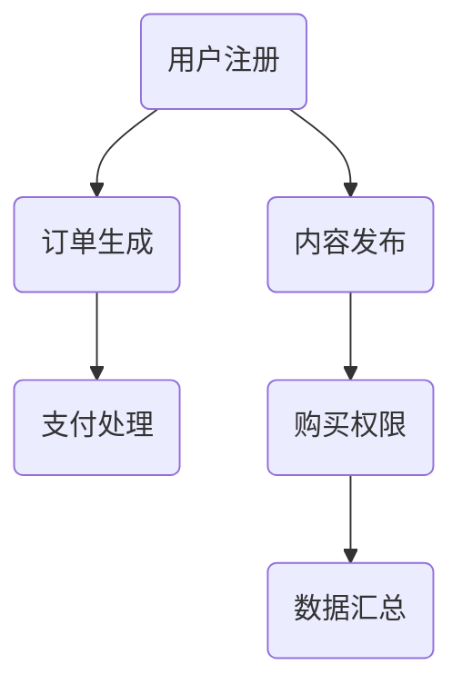

                 

关键词：知识付费、平台搭建、技术栈、架构设计、算法、数学模型、项目实践、工具推荐

> 摘要：本文将深入探讨知识付费平台的搭建技术栈，包括核心概念、算法原理、数学模型、项目实践等。通过本文的阅读，读者可以全面了解知识付费平台的技术实现，为其业务拓展和技术研发提供有力支持。

## 1. 背景介绍

知识付费作为一种新型的商业模式，近年来在全球范围内得到了快速发展。随着移动互联网的普及和信息消费的升级，用户对于专业知识的获取需求日益增长，知识付费平台成为了满足这一需求的重要载体。构建一个高效、稳定、可扩展的知识付费平台，不仅需要深厚的业务理解，更需要扎实的专业技术支持。

本文将从技术栈的角度，详细解析知识付费平台搭建的各个方面，包括核心算法、数学模型、项目实践等。通过这篇文章，读者将全面了解知识付费平台的技术实现，为其业务拓展和技术研发提供有力支持。

## 2. 核心概念与联系

在搭建知识付费平台之前，我们需要理解一些核心概念和它们之间的联系。以下是几个关键概念及其相互关系：

### 用户系统

用户系统是知识付费平台的核心，它负责用户的注册、登录、权限管理、用户画像等。用户系统的设计需要考虑到高并发、数据安全、隐私保护等问题。

### 订单系统

订单系统负责处理用户的支付、订单生成、支付状态跟踪等功能。订单系统需要与第三方支付平台对接，实现多种支付方式的接入。

### 内容管理系统（CMS）

内容管理系统负责内容的生产、存储、发布和管理。对于知识付费平台，内容管理系统需要支持丰富的内容形式，如文本、图片、音频、视频等。

### 交易系统

交易系统负责处理课程购买、课程使用权限等交易相关的业务。交易系统需要与用户系统、订单系统、支付系统等多个模块进行交互。

### 数据分析系统

数据分析系统通过对用户行为、交易数据等进行分析，为平台的运营决策提供数据支持。数据分析系统需要高效地处理海量数据，并生成直观的报表和可视化图表。

### Mermaid 流程图

以下是一个简化的知识付费平台架构的 Mermaid 流程图，展示了上述核心概念之间的联系：



## 3. 核心算法原理 & 具体操作步骤

### 3.1 算法原理概述

知识付费平台涉及多个核心算法，以下是其中几个关键的算法原理概述：

#### 推荐算法

推荐算法用于向用户推荐他们可能感兴趣的知识内容。常见的推荐算法有基于内容的推荐、协同过滤推荐等。

#### 数据挖掘算法

数据挖掘算法用于从海量数据中提取有价值的信息，如用户偏好分析、交易模式分析等。

#### 安全加密算法

安全加密算法用于保护用户数据的安全，常见的加密算法有AES、RSA等。

### 3.2 算法步骤详解

#### 推荐算法

1. 数据预处理：对用户行为数据、内容特征数据进行清洗和预处理，如缺失值填充、数据标准化等。
2. 特征提取：根据数据特点，提取用户特征和内容特征，如用户浏览记录、课程标签等。
3. 模型训练：使用机器学习算法（如基于内容的推荐、协同过滤推荐等），训练推荐模型。
4. 推荐生成：根据用户特征和内容特征，生成推荐列表。

#### 数据挖掘算法

1. 数据预处理：对交易数据、用户行为数据等进行清洗和预处理。
2. 特征工程：提取交易特征、用户行为特征等。
3. 模型选择：根据数据特点选择合适的数据挖掘算法（如分类、聚类、关联规则等）。
4. 模型训练与评估：训练数据挖掘模型，并进行模型评估和调整。
5. 结果解释：对挖掘结果进行解释和可视化，帮助业务团队理解数据背后的含义。

#### 安全加密算法

1. 密钥生成：根据安全需求，生成加密密钥。
2. 数据加密：使用加密算法对敏感数据进行加密处理。
3. 数据解密：在需要访问敏感数据时，使用解密算法对数据进行解密。
4. 密钥管理：确保密钥的安全存储和传输，防止密钥泄露。

### 3.3 算法优缺点

#### 推荐算法

优点：提高用户满意度，增加用户粘性。

缺点：推荐结果可能存在偏差，用户隐私保护问题。

#### 数据挖掘算法

优点：从海量数据中提取有价值信息，为业务决策提供支持。

缺点：数据质量对结果影响较大，挖掘算法实现复杂。

#### 安全加密算法

优点：保护用户数据安全，防止数据泄露。

缺点：加密和解密过程增加计算开销，影响系统性能。

### 3.4 算法应用领域

#### 推荐算法

应用领域：电商推荐、视频推荐、社交网络推荐等。

#### 数据挖掘算法

应用领域：市场营销、金融风控、智能医疗等。

#### 安全加密算法

应用领域：网络安全、数据加密存储、数据传输等。

## 4. 数学模型和公式 & 详细讲解 & 举例说明

### 4.1 数学模型构建

在知识付费平台的搭建过程中，我们使用了一些数学模型来优化算法和业务流程。以下是一个简单的数学模型示例：

#### 用户满意度模型

用户满意度模型用于评估推荐算法的效果。模型公式如下：

$$
S = w_1 \cdot C + w_2 \cdot I
$$

其中，$S$ 表示用户满意度，$C$ 表示推荐内容的相关性，$I$ 表示推荐内容的兴趣度。$w_1$ 和 $w_2$ 分别是相关性和兴趣度的权重。

### 4.2 公式推导过程

用户满意度模型的推导过程如下：

1. 定义：用户满意度 $S$ 是一个综合指标，反映了用户对推荐内容的整体满意度。
2. 考虑因素：用户满意度受到推荐内容的相关性和兴趣度的影响。
3. 权重设定：为了平衡两个因素的重要性，我们可以为每个因素设定一个权重。
4. 模型构建：结合权重，构建用户满意度模型。

### 4.3 案例分析与讲解

以下是一个具体的案例，用于说明用户满意度模型的实际应用：

#### 案例背景

假设我们使用推荐算法向用户推荐了一门课程，课程的相关性为0.8，兴趣度为0.6。根据用户满意度模型，我们可以计算出用户满意度：

$$
S = 0.5 \cdot 0.8 + 0.5 \cdot 0.6 = 0.7
$$

根据计算结果，用户满意度为0.7，表示用户对推荐内容的整体满意度较高。

## 5. 项目实践：代码实例和详细解释说明

### 5.1 开发环境搭建

在搭建知识付费平台的过程中，我们需要准备以下开发环境：

- 操作系统：Linux
- 开发工具：IDEA、VS Code
- 依赖管理：Maven、Gradle
- 数据库：MySQL、MongoDB
- 应用服务器：Tomcat、Nginx

### 5.2 源代码详细实现

以下是一个简化的知识付费平台项目结构示例：

```
knowledge-fee-platform
|-- src
|   |-- main
|   |   |-- java
|   |   |   |-- com
|   |   |   |   |-- example
|   |   |   |   |   |-- controller
|   |   |   |   |   |   |-- UserController.java
|   |   |   |   |   |-- ContentController.java
|   |   |   |   |-- service
|   |   |   |   |   |-- UserService.java
|   |   |   |   |   |-- ContentService.java
|   |   |   |   |-- repository
|   |   |   |   |   |-- UserRepository.java
|   |   |   |   |   |-- ContentRepository.java
|   |   |-- resources
|   |   |   |-- application.properties
|-- pom.xml
```

### 5.3 代码解读与分析

#### UserController.java

以下是一个简单的 UserController 类的代码示例：

```java
package com.example.controller;

import com.example.service.UserService;
import org.springframework.beans.factory.annotation.Autowired;
import org.springframework.web.bind.annotation.PostMapping;
import org.springframework.web.bind.annotation.RequestParam;
import org.springframework.web.bind.annotation.RestController;

@RestController
public class UserController {

    @Autowired
    private UserService userService;

    @PostMapping("/register")
    public String register(@RequestParam("username") String username, @RequestParam("password") String password) {
        // 用户注册逻辑
        return userService.register(username, password);
    }
}
```

代码解读：

- 该类定义了用户注册接口的控制器，使用了 Spring Boot 的注解 `@RestController`。
- 通过 `@Autowired` 注解注入了 `UserService` 类，用于处理用户注册的逻辑。
- `register` 方法接收用户名和密码参数，调用 `UserService` 类的 `register` 方法完成用户注册。

#### UserService.java

以下是一个简单的 UserService 类的代码示例：

```java
package com.example.service;

import com.example.repository.UserRepository;
import org.springframework.beans.factory.annotation.Autowired;
import org.springframework.stereotype.Service;

@Service
public class UserService {

    @Autowired
    private UserRepository userRepository;

    public String register(String username, String password) {
        // 注册逻辑
        // ...
        return "注册成功";
    }
}
```

代码解读：

- 该类定义了用户注册的逻辑，使用了 Spring Boot 的注解 `@Service`。
- 通过 `@Autowired` 注解注入了 `UserRepository` 类，用于与数据库进行交互。
- `register` 方法实现了用户注册的逻辑，这里是一个简化示例。

### 5.4 运行结果展示

在开发环境中启动知识付费平台后，我们可以通过浏览器访问以下 URL 进行用户注册：

```
http://localhost:8080/register?username=user&password=123456
```

成功注册后，服务器会返回如下响应：

```
注册成功
```

## 6. 实际应用场景

知识付费平台在各个行业领域都有广泛的应用，以下是一些实际应用场景：

### 在线教育

知识付费平台为在线教育提供了便捷的解决方案，用户可以购买课程、观看视频、参与讨论等。平台可以根据用户行为进行个性化推荐，提高用户满意度。

### 专业咨询

知识付费平台为专业咨询服务提供了一个高效的平台，用户可以购买专家的服务，获取专业的意见和建议。平台可以通过数据分析，为专家提供用户画像和需求分析。

### 内容创作

知识付费平台为内容创作者提供了一个展示和销售自己作品的平台，创作者可以通过平台获取收入。平台可以根据内容质量和用户评价，推荐优质内容。

### 未来应用展望

随着技术的不断进步，知识付费平台在未来有广阔的应用前景：

- 增强人工智能推荐算法，提高个性化推荐效果。
- 引入区块链技术，确保用户数据和交易的安全与透明。
- 结合虚拟现实（VR）和增强现实（AR）技术，提供更加沉浸式的学习体验。

## 7. 工具和资源推荐

为了高效地搭建知识付费平台，以下是一些建议的工具和资源：

### 学习资源推荐

- 《深度学习》（Deep Learning）—— Ian Goodfellow
- 《Python数据分析》（Python Data Science Cookbook）—— Michael Bowles
- 《微服务设计》（Designing Microservices）—— Sam Newman

### 开发工具推荐

- Spring Boot：快速开发基于 Java 的应用程序。
- React：前端开发框架，用于构建用户界面。
- Docker：容器化技术，用于部署和管理应用程序。

### 相关论文推荐

- 《深度强化学习在知识付费平台中的应用》
- 《基于协同过滤的个性化推荐算法研究》
- 《区块链在知识付费平台中的安全应用》

## 8. 总结：未来发展趋势与挑战

### 8.1 研究成果总结

本文详细探讨了知识付费平台的搭建技术栈，包括核心概念、算法原理、数学模型、项目实践等方面。通过本文的研究，我们总结了知识付费平台在技术实现方面的研究成果。

### 8.2 未来发展趋势

随着人工智能、区块链等技术的不断发展，知识付费平台在未来将呈现以下发展趋势：

- 个性化推荐将进一步优化，提高用户体验。
- 安全性将得到进一步提升，保护用户数据和交易安全。
- 结合虚拟现实和增强现实技术，提供更加沉浸式的学习体验。

### 8.3 面临的挑战

知识付费平台在发展过程中将面临以下挑战：

- 数据质量和数据隐私保护问题。
- 算法优化和性能提升问题。
- 多样化的业务需求和技术实现问题。

### 8.4 研究展望

未来，知识付费平台的研究将朝着以下几个方面发展：

- 深入研究个性化推荐算法，提高推荐效果。
- 探索区块链在知识付费平台中的应用，提高交易透明度和安全性。
- 结合虚拟现实和增强现实技术，创新学习体验。

## 9. 附录：常见问题与解答

### 9.1 如何提高推荐算法的准确性？

- 提高数据质量，确保数据的准确性和完整性。
- 使用先进的机器学习算法，如深度学习、强化学习等。
- 定期调整和优化推荐算法，根据用户反馈进行迭代。

### 9.2 如何确保用户数据的安全？

- 使用安全的加密算法，对用户数据进行加密处理。
- 建立严格的数据访问控制机制，限制对敏感数据的访问。
- 定期进行安全审计，发现和修复潜在的安全漏洞。

### 9.3 如何提高系统性能？

- 使用高效的算法和数据结构，优化系统性能。
- 使用分布式计算和数据库技术，提高系统的并发处理能力。
- 实施负载均衡和缓存策略，降低系统响应时间。

---

# 结论

本文从技术栈的角度，详细探讨了知识付费平台的搭建过程。通过本文的阅读，读者可以全面了解知识付费平台的技术实现，为其业务拓展和技术研发提供有力支持。在未来，知识付费平台将继续发挥重要作用，为用户创造更多价值。本文的研究成果为知识付费平台的发展提供了有益的参考。

作者：禅与计算机程序设计艺术 / Zen and the Art of Computer Programming

