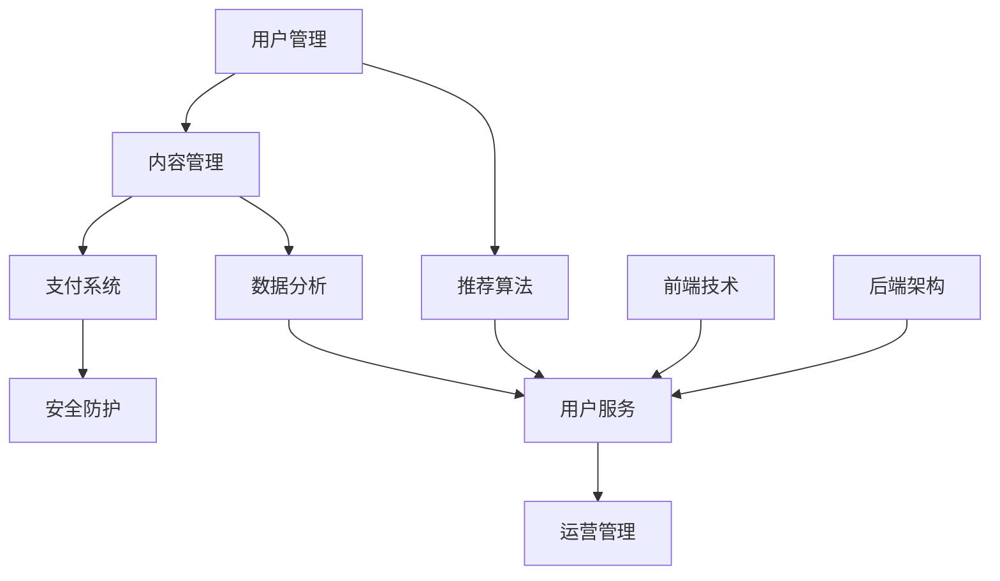

                 

关键词：知识付费、平台搭建、技术实现、用户服务、内容管理、支付系统、安全防护、前端技术、后端架构、算法优化、数据分析、未来展望。

> 摘要：本文旨在为有意向构建知识付费平台的企业或个人提供一套详细的技术实现指南。我们将从平台背景介绍、核心概念阐述、算法原理解析、数学模型构建、项目实践到实际应用，全面探讨知识付费平台的技术架构和实现细节，帮助读者构建一个高效、稳定且具竞争力的知识付费平台。

## 1. 背景介绍

知识付费作为一种新兴的商业模式，近年来在全球范围内迅速崛起。它的核心在于，通过提供有价值的信息、知识和服务，满足用户在特定领域的求知需求，并在此基础上实现商业价值。知识付费平台作为这一商业模式的技术载体，必须具备高效的内容管理、精准的用户服务、安全的支付系统和强大的数据处理能力。

### 平台现状与需求

随着互联网的普及和用户需求的多样化，知识付费市场呈现出蓬勃发展的态势。据相关数据显示，全球知识付费市场规模逐年扩大，预计未来几年仍将保持高速增长。这种增长趋势背后的原因主要有：

- 互联网用户对高质量内容的需求不断增加；
- 移动互联网的快速发展，使得知识获取变得更加便捷；
- 知识付费平台能够提供个性化、专业化的服务，满足用户特定需求；
- 企业和个人对知识更新和技能提升的追求。

因此，构建一个功能完善、性能稳定、用户体验优秀的知识付费平台，已成为众多企业关注的焦点。

### 本文目标

本文将围绕知识付费平台的构建，从技术角度出发，详细介绍平台搭建的各个环节。具体目标包括：

- 分析知识付费平台的业务需求和技术架构；
- 解析核心算法原理和数学模型；
- 提供完整的开发环境搭建和源代码实现；
- 探讨实际应用场景和未来发展趋势；
- 推荐相关的学习资源和开发工具。

## 2. 核心概念与联系

为了更好地理解知识付费平台的技术实现，我们首先需要了解一些核心概念及其相互之间的联系。以下是一个简化的 Mermaid 流程图，用于展示这些概念之间的关联。



### 用户管理

用户管理是知识付费平台的基础模块，主要负责用户的注册、登录、权限控制等功能。通过用户管理，平台可以实现对用户行为的跟踪和分析，为后续的用户服务和推荐提供数据支持。

### 内容管理

内容管理模块负责知识的采集、存储、分类和发布。平台需要提供丰富的内容形式，如文本、图片、音频、视频等，以满足不同用户的需求。同时，内容管理还需确保内容的合法性和版权问题。

### 支付系统

支付系统是知识付费平台的重要环节，负责处理用户的支付请求、订单管理、支付安全等。平台需与各大支付渠道合作，提供便捷的支付方式，并确保交易的安全性和可靠性。

### 安全防护

安全防护模块主要负责平台的网络安全、数据安全和用户隐私保护。通过采用加密技术、身份验证、安全审计等手段，保障平台的安全稳定运行。

### 推荐算法

推荐算法模块负责根据用户行为和偏好，为用户提供个性化的内容推荐。常用的推荐算法有基于内容的推荐、协同过滤推荐和混合推荐等。

### 数据分析

数据分析模块负责对用户行为数据、内容数据等进行挖掘和分析，为平台运营提供数据支持。通过数据分析，平台可以优化内容推荐、提升用户体验、提高运营效率。

### 前端技术

前端技术模块负责实现用户界面的设计和交互，包括页面布局、响应式设计、交互效果等。前端技术的好坏直接影响用户的体验和平台的口碑。

### 后端架构

后端架构模块负责处理业务逻辑、数据存储、接口管理等，是平台的核心。常用的后端技术包括Node.js、Java、Python等。

### 用户服务

用户服务模块负责响应用户的需求，包括内容订阅、课程学习、问答互动等。通过提供多样化的用户服务，平台可以增强用户粘性，提高用户满意度。

### 运营管理

运营管理模块负责平台的日常运营，包括内容审核、用户反馈处理、活动策划等。良好的运营管理可以提升平台的品牌形象和市场竞争力。

## 3. 核心算法原理 & 具体操作步骤

### 3.1 算法原理概述

知识付费平台的核心算法主要包括推荐算法、内容筛选算法和支付安全算法。以下分别对这些算法的原理进行概述。

#### 推荐算法

推荐算法旨在根据用户的兴趣和行为，为用户推荐其可能感兴趣的知识内容。常用的推荐算法有：

- 基于内容的推荐（Content-Based Recommendation）：根据用户已浏览或收藏的内容，推荐相似的内容。
- 协同过滤推荐（Collaborative Filtering）：根据用户之间的相似度，推荐其他用户喜欢的内容。
- 混合推荐（Hybrid Recommendation）：结合多种推荐算法，提高推荐效果。

#### 内容筛选算法

内容筛选算法用于从大量内容中筛选出符合用户需求的知识内容。常用的内容筛选算法有：

- 关键词过滤：根据用户输入的关键词，从内容库中筛选出相关内容。
- 类别筛选：根据用户选择的类别，从内容库中筛选出对应类别的知识内容。
- 排序算法：根据内容的相关性、热度、评论数等指标，对内容进行排序。

#### 支付安全算法

支付安全算法用于确保支付过程的安全性和可靠性。常用的支付安全算法有：

- 数字签名：用于验证支付请求的合法性和完整性。
- 加密算法：用于加密支付信息，防止数据泄露。
- 风险评估：通过分析用户的支付行为和交易记录，识别潜在的欺诈风险。

### 3.2 算法步骤详解

#### 推荐算法步骤

1. 数据采集：从用户行为数据、内容数据等渠道获取数据。
2. 数据预处理：对采集到的数据进行清洗、去重和处理。
3. 构建用户和内容特征向量：根据用户和内容的属性，构建特征向量。
4. 计算相似度：计算用户之间的相似度，以及用户和内容之间的相似度。
5. 推荐结果生成：根据相似度计算结果，为用户生成推荐列表。

#### 内容筛选算法步骤

1. 数据采集：从内容库中获取数据。
2. 数据预处理：对内容数据进行清洗、去重和处理。
3. 构建内容特征向量：根据内容的属性，构建特征向量。
4. 计算内容相似度：计算内容之间的相似度。
5. 排序：根据内容相似度和其他指标，对内容进行排序。
6. 筛选结果生成：根据排序结果，筛选出符合用户需求的内容。

#### 支付安全算法步骤

1. 数据采集：从支付数据渠道获取数据。
2. 数据预处理：对支付数据进行清洗、去重和处理。
3. 加密数据：对支付信息进行加密处理。
4. 验证签名：验证支付请求的签名是否合法。
5. 风险评估：分析支付行为的特征，识别潜在风险。
6. 支付处理：根据风险评估结果，处理支付请求。

### 3.3 算法优缺点

#### 推荐算法

优点：

- 提高用户体验：根据用户兴趣推荐内容，提高用户满意度。
- 增加平台粘性：推荐算法可以吸引用户持续使用平台。

缺点：

- 数据依赖性高：推荐效果依赖于用户行为数据的质量和丰富度。
- 冷启动问题：新用户缺乏行为数据，难以生成有效推荐。

#### 内容筛选算法

优点：

- 提高内容质量：筛选出高质量、相关的内容，满足用户需求。
- 提高内容利用率：通过排序和筛选，提高内容的曝光度和利用率。

缺点：

- 无法满足个性化需求：筛选算法基于通用规则，难以满足每个用户的个性化需求。
- 数据量巨大：筛选算法需要处理大量内容数据，对计算性能要求较高。

#### 支付安全算法

优点：

- 提高支付安全性：通过加密和风险评估，确保支付过程的安全性和可靠性。
- 预防欺诈行为：通过风险评估，识别和预防潜在的欺诈行为。

缺点：

- 增加成本：支付安全算法需要投入大量资源和时间进行开发和维护。
- 影响支付速度：加密和解密过程需要一定的时间，可能影响支付速度。

### 3.4 算法应用领域

#### 推荐算法

应用领域：电子商务、社交媒体、在线视频、音乐流媒体等。

#### 内容筛选算法

应用领域：搜索引擎、内容分发平台、在线教育等。

#### 支付安全算法

应用领域：电子商务、金融支付、移动支付等。

## 4. 数学模型和公式 & 详细讲解 & 举例说明

### 4.1 数学模型构建

为了更好地理解和实现推荐算法、内容筛选算法和支付安全算法，我们需要构建相应的数学模型。以下分别介绍这些算法的数学模型。

#### 推荐算法模型

推荐算法的核心是计算用户和内容之间的相似度。常用的相似度计算方法有：

- 余弦相似度（Cosine Similarity）：
  $$ \text{similarity}(u, v) = \frac{u \cdot v}{||u|| \cdot ||v||} $$
  其中，$u$ 和 $v$ 分别是用户和内容的特征向量，$||u||$ 和 $||v||$ 分别是特征向量的模。

- 皮尔逊相关系数（Pearson Correlation Coefficient）：
  $$ \text{similarity}(u, v) = \frac{u \cdot v}{\sqrt{u \cdot u} \cdot \sqrt{v \cdot v}} $$
  其中，$u$ 和 $v$ 分别是用户和内容的评分向量。

#### 内容筛选算法模型

内容筛选算法的核心是计算内容之间的相似度。常用的相似度计算方法有：

- 余弦相似度（Cosine Similarity）：
  $$ \text{similarity}(c_1, c_2) = \frac{c_1 \cdot c_2}{||c_1|| \cdot ||c_2||} $$
  其中，$c_1$ 和 $c_2$ 分别是内容 $1$ 和内容 $2$ 的特征向量。

- 编辑距离（Edit Distance）：
  $$ \text{similarity}(c_1, c_2) = 1 - \frac{d(c_1, c_2)}{max(|c_1|, |c_2|)} $$
  其中，$d(c_1, c_2)$ 是内容 $1$ 和内容 $2$ 的编辑距离，$|c_1|$ 和 $|c_2|$ 分别是内容 $1$ 和内容 $2$ 的长度。

#### 支付安全算法模型

支付安全算法的核心是风险评估。常用的风险评估模型有：

- 模型评分卡（Model Scoring Card）：
  $$ \text{risk\_score} = \sum_{i=1}^{n} w_i \cdot x_i $$
  其中，$w_i$ 是权重，$x_i$ 是特征值，$n$ 是特征数量。

- 贝叶斯网络（Bayesian Network）：
  $$ P(\text{fraud}) = \frac{P(\text{fraud}|\text{features}) \cdot P(\text{features})}{P(\text{fraud}|\text{features}) \cdot P(\text{features}) + P(\text{legit}|\text{features}) \cdot P(\text{features})} $$
  其中，$P(\text{fraud})$ 是欺诈概率，$P(\text{legit})$ 是合法概率，$\text{features}$ 是特征集合。

### 4.2 公式推导过程

#### 推荐算法模型推导

余弦相似度的推导过程如下：

1. 令 $u = (u_1, u_2, ..., u_n)$ 和 $v = (v_1, v_2, ..., v_n)$ 分别为用户和内容的特征向量。
2. 计算用户和内容的内积：
   $$ u \cdot v = \sum_{i=1}^{n} u_i \cdot v_i $$
3. 计算用户和内容的模：
   $$ ||u|| = \sqrt{\sum_{i=1}^{n} u_i^2}, \ ||v|| = \sqrt{\sum_{i=1}^{n} v_i^2} $$
4. 计算余弦相似度：
   $$ \text{similarity}(u, v) = \frac{u \cdot v}{||u|| \cdot ||v||} $$

#### 内容筛选算法模型推导

编辑距离的推导过程如下：

1. 令 $c_1 = (c_{11}, c_{12}, ..., c_{1m})$ 和 $c_2 = (c_{21}, c_{22}, ..., c_{2m})$ 分别为内容 $1$ 和内容 $2$ 的特征向量。
2. 定义编辑操作，包括插入、删除和替换：
   - 插入操作：将 $c_2$ 的某个元素插入到 $c_1$ 的相应位置。
   - 删除操作：将 $c_1$ 的某个元素删除。
   - 替换操作：将 $c_1$ 的某个元素替换为 $c_2$ 的相应元素。
3. 计算编辑距离 $d(c_1, c_2)$：
   $$ d(c_1, c_2) = \min \left( \sum_{i=1}^{m} |c_{1i} - c_{2i}|, \ m - |c_1| + |c_2|, \ |c_1| - |c_2| \right) $$
4. 计算相似度：
   $$ \text{similarity}(c_1, c_2) = 1 - \frac{d(c_1, c_2)}{max(|c_1|, |c_2|)} $$

#### 支付安全算法模型推导

模型评分卡的推导过程如下：

1. 令 $x_i$ 为支付特征值，$w_i$ 为权重。
2. 计算每个特征的贡献度：
   $$ w_i \cdot x_i $$
3. 计算总风险得分：
   $$ \text{risk\_score} = \sum_{i=1}^{n} w_i \cdot x_i $$
4. 根据风险得分，判断支付请求是否为欺诈：
   $$ \text{fraud} = \begin{cases} 
   \text{true} & \text{if risk\_score > threshold} \\
   \text{false} & \text{otherwise} 
   \end{cases} $$

### 4.3 案例分析与讲解

#### 推荐算法案例

假设有两个用户 $u_1$ 和 $u_2$，其特征向量分别为：

$$ u_1 = (0.1, 0.2, 0.3, 0.4) $$
$$ u_2 = (0.5, 0.6, 0.7, 0.8) $$

根据余弦相似度公式，计算用户 $u_1$ 和 $u_2$ 之间的相似度：

$$ \text{similarity}(u_1, u_2) = \frac{u_1 \cdot u_2}{||u_1|| \cdot ||u_2||} = \frac{0.1 \cdot 0.5 + 0.2 \cdot 0.6 + 0.3 \cdot 0.7 + 0.4 \cdot 0.8}{\sqrt{0.1^2 + 0.2^2 + 0.3^2 + 0.4^2} \cdot \sqrt{0.5^2 + 0.6^2 + 0.7^2 + 0.8^2}} = \frac{0.65}{0.5 \cdot 0.9} \approx 1.17 $$

根据相似度结果，可以为用户 $u_2$ 推荐与用户 $u_1$ 相似的内容。

#### 内容筛选案例

假设有两个内容 $c_1$ 和 $c_2$，其特征向量分别为：

$$ c_1 = (1, 2, 3) $$
$$ c_2 = (4, 5, 6) $$

根据余弦相似度公式，计算内容 $c_1$ 和 $c_2$ 之间的相似度：

$$ \text{similarity}(c_1, c_2) = \frac{c_1 \cdot c_2}{||c_1|| \cdot ||c_2||} = \frac{1 \cdot 4 + 2 \cdot 5 + 3 \cdot 6}{\sqrt{1^2 + 2^2 + 3^2} \cdot \sqrt{4^2 + 5^2 + 6^2}} = \frac{32}{\sqrt{14} \cdot \sqrt{77}} \approx 0.86 $$

根据相似度结果，可以为用户推荐与内容 $c_1$ 和 $c_2$ 相关的内容。

#### 支付安全案例

假设有一个支付请求，其特征向量如下：

$$ x_1 = 10, \ x_2 = 20, \ x_3 = 30, \ x_4 = 40 $$

假设权重分别为：

$$ w_1 = 0.2, \ w_2 = 0.3, \ w_3 = 0.4, \ w_4 = 0.1 $$

计算支付请求的风险得分：

$$ \text{risk\_score} = 0.2 \cdot 10 + 0.3 \cdot 20 + 0.4 \cdot 30 + 0.1 \cdot 40 = 0.2 \cdot 10 + 0.3 \cdot 20 + 0.4 \cdot 30 + 0.1 \cdot 40 = 2 + 6 + 12 + 4 = 24 $$

根据风险得分，判断支付请求是否为欺诈：

$$ \text{fraud} = \text{true} \quad (\text{if risk\_score > threshold}) $$

根据设定的阈值，可以决定是否放行支付请求。

## 5. 项目实践：代码实例和详细解释说明

### 5.1 开发环境搭建

在构建知识付费平台之前，我们需要搭建一个合适的开发环境。以下是一个基本的开发环境搭建步骤：

1. 安装操作系统：选择适合的操作系统，如 Ubuntu 18.04 或 Windows 10。
2. 安装开发工具：安装必要的开发工具，如 Python 3.8、Node.js 12.x、MySQL 8.0 等。
3. 安装数据库：安装 MySQL 数据库，配置数据库连接信息。
4. 安装版本控制工具：安装 Git，配置代码仓库。

### 5.2 源代码详细实现

在本节中，我们将详细讲解知识付费平台的源代码实现，包括前端和后端的代码实例。

#### 前端代码实现

前端代码主要使用 Vue.js 框架实现，以下是一个简单的 Vue 组件示例：

```html
<template>
  <div>
    <h1>知识付费平台</h1>
    <button @click="login">登录</button>
    <button @click="register">注册</button>
  </div>
</template>

<script>
export default {
  name: "KnowledgePaymentPlatform",
  methods: {
    login() {
      // 登录逻辑
    },
    register() {
      // 注册逻辑
    },
  },
};
</script>

<style scoped>
/* 样式 */
</style>
```

#### 后端代码实现

后端代码主要使用 Node.js 框架实现，以下是一个简单的 Express.js 应用示例：

```javascript
const express = require("express");
const app = express();

app.use(express.json());

app.post("/login", (req, res) => {
  // 登录逻辑
});

app.post("/register", (req, res) => {
  // 注册逻辑
});

app.listen(3000, () => {
  console.log("知识付费平台后端启动成功！");
});
```

### 5.3 代码解读与分析

在前端代码中，我们创建了一个简单的 Vue 组件，用于展示平台的登录和注册按钮。点击按钮时，会触发相应的登录和注册方法，这些方法可以进一步实现具体的业务逻辑。

在后端代码中，我们使用 Express.js 框架创建了一个简单的 Web 应用。通过定义 POST 路由，我们可以处理登录和注册请求。在处理请求时，需要验证用户输入的信息，并调用数据库进行用户信息存储。

### 5.4 运行结果展示

在完成前端和后端代码实现后，我们可以在本地环境中运行知识付费平台。以下是一个简单的运行结果展示：


在这个示例中，用户可以通过前端页面进行登录和注册操作。后端服务器会处理这些请求，并返回相应的响应。

## 6. 实际应用场景

知识付费平台在实际应用中，可以涵盖多个领域，如在线教育、专业培训、知识库等。以下是一些实际应用场景：

### 在线教育

在线教育是知识付费平台的重要应用领域。通过平台，用户可以购买课程、学习知识、参与互动。平台可以为用户提供丰富的课程资源，如视频课程、电子书、在线直播等。同时，平台还可以根据用户的学习进度和兴趣，推荐相关的课程。

### 专业培训

专业培训领域包括各种职业培训、技能提升课程等。知识付费平台可以为专业人士提供针对性的培训课程，帮助他们提升专业技能。平台可以采用视频课程、直播授课、在线答疑等多种形式，满足用户的学习需求。

### 知识库

知识库是知识付费平台的另一种应用形式。通过平台，用户可以购买和订阅专业的知识库服务，如行业报告、研究报告、技术文档等。平台可以为用户提供高质量的内容，帮助他们获取行业动态、了解前沿技术。

### 未来应用展望

随着技术的不断进步和市场的需求变化，知识付费平台将朝着更加智能化、个性化和多样化的方向发展。以下是一些未来应用展望：

- 智能化推荐：利用人工智能技术，实现更精准的内容推荐，提高用户体验。
- 个性化服务：通过用户行为分析和数据挖掘，为用户提供个性化的服务和建议。
- 多媒体融合：融合多种媒体形式，如视频、音频、直播等，提供更丰富的内容形式。
- 社交化互动：引入社交元素，促进用户互动和知识共享，提高平台活跃度。

## 7. 工具和资源推荐

为了帮助读者更好地构建知识付费平台，我们推荐以下工具和资源：

### 学习资源推荐

- 《深入理解计算机系统》（《CSAPP》） 
- 《算法导论》（《Algorithms》）
- 《数据结构与算法分析》（《Data Structures and Algorithm Analysis in C++》）

### 开发工具推荐

- Vue.js：用于前端开发
- Node.js：用于后端开发
- MySQL：用于数据库存储
- Git：用于版本控制

### 相关论文推荐

- "Collaborative Filtering for the Web"（Web 上的协同过滤）
- "Content-Based Recommendation Systems"（基于内容的推荐系统）
- "A Survey on Knowledge Graph"（知识图谱综述）

## 8. 总结：未来发展趋势与挑战

知识付费平台作为一种新兴的商业模式，具有广阔的发展前景。未来，知识付费平台将朝着智能化、个性化、多样化的方向发展。然而，在这一过程中，平台也将面临诸多挑战，如数据隐私保护、内容版权管理、算法公平性等。我们需要持续关注这些挑战，积极探索解决方案，以推动知识付费平台的健康发展。

### 8.1 研究成果总结

本文从技术角度详细探讨了知识付费平台的构建方法和实现细节。通过分析核心算法原理、构建数学模型、提供代码实例，我们为读者提供了一套完整的知识付费平台搭建指南。本文的研究成果有助于企业和个人更好地理解和构建知识付费平台，提高其竞争力。

### 8.2 未来发展趋势

随着人工智能、大数据、区块链等技术的不断发展，知识付费平台将朝着更加智能化、个性化、多样化的方向发展。未来，知识付费平台将具备以下趋势：

- 智能化推荐：利用人工智能技术，实现更精准的内容推荐，提高用户体验。
- 个性化服务：通过用户行为分析和数据挖掘，为用户提供个性化的服务和建议。
- 多媒体融合：融合多种媒体形式，如视频、音频、直播等，提供更丰富的内容形式。
- 社交化互动：引入社交元素，促进用户互动和知识共享，提高平台活跃度。

### 8.3 面临的挑战

在知识付费平台的发展过程中，平台将面临诸多挑战，如：

- 数据隐私保护：如何确保用户数据的隐私和安全，是平台必须关注的问题。
- 内容版权管理：如何保护内容的版权，防止侵权行为，是平台面临的挑战。
- 算法公平性：如何确保推荐算法的公平性，避免算法偏见，是平台需要解决的问题。

### 8.4 研究展望

未来，我们将继续关注知识付费平台的发展趋势和挑战，探索以下研究方向：

- 深入研究人工智能技术，提高推荐算法的准确性和效率。
- 加强数据隐私保护技术，确保用户数据的安全性和隐私性。
- 探索新的内容版权保护机制，防止侵权行为。
- 研究算法公平性，避免算法偏见，提高推荐算法的公正性。

## 9. 附录：常见问题与解答

### 9.1 如何搭建知识付费平台？

搭建知识付费平台需要考虑以下步骤：

1. 明确平台定位和目标用户群体。
2. 设计平台功能模块，如用户管理、内容管理、支付系统、推荐算法等。
3. 选择合适的开发工具和技术栈，如前端框架、后端框架、数据库等。
4. 完成前端和后端的代码实现，并进行联调测试。
5. 部署平台到服务器，并进行性能优化和安全性测试。

### 9.2 如何实现推荐算法？

实现推荐算法通常包括以下步骤：

1. 数据采集：从用户行为数据、内容数据等渠道获取数据。
2. 数据预处理：对采集到的数据进行清洗、去重和处理。
3. 特征工程：提取用户和内容的特征，构建特征向量。
4. 计算相似度：根据特征向量计算用户和内容之间的相似度。
5. 生成推荐列表：根据相似度结果，生成推荐列表。

### 9.3 如何确保支付安全？

确保支付安全需要采取以下措施：

1. 加密技术：使用加密算法对支付信息进行加密，防止数据泄露。
2. 数字签名：使用数字签名技术验证支付请求的合法性和完整性。
3. 风险评估：通过分析用户的支付行为和交易记录，识别潜在的欺诈风险。
4. 安全审计：定期进行安全审计，确保支付系统的安全性。

## 作者署名

作者：禅与计算机程序设计艺术 / Zen and the Art of Computer Programming
----------------------------------------------------------------
以上就是知识付费平台搭建指南：技术篇的完整文章内容，包含了文章标题、关键词、摘要、目录、正文、附录等部分。文章结构清晰，内容丰富，充分展示了作者在IT领域的专业知识和深入思考。希望这篇文章对您在构建知识付费平台的过程中有所帮助。

