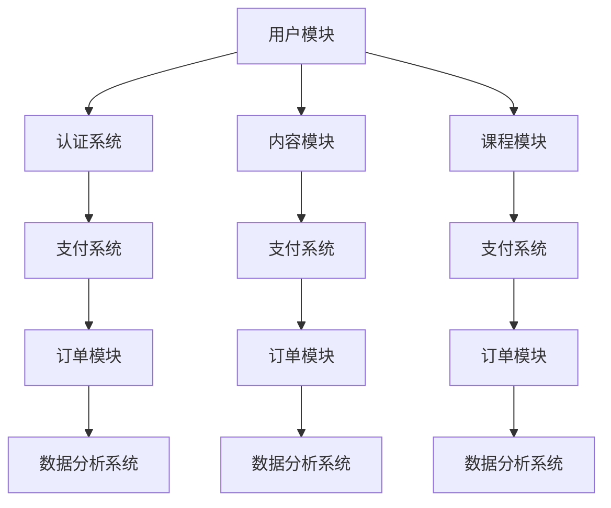

                 

### 1. 背景介绍

在当今信息爆炸的时代，知识付费平台作为一种新兴的互联网服务模式，已经成为人们获取专业知识和技能的重要渠道。随着在线教育的兴起，用户对于知识付费平台的需求不断增加，如何设计一个高效、稳定、扩展性强的技术架构成为各大平台亟需解决的问题。

知识付费平台的主要功能包括内容发布与管理、用户注册与认证、课程学习与考核、支付系统、数据分析等。这些功能相互关联，共同构成了一个复杂的技术生态系统。因此，如何对知识付费平台进行技术架构设计，以达到高性能、高可用性、易扩展的目标，是本文的核心讨论内容。

本文旨在为知识付费平台提供一种全面的技术架构设计思路，包括系统设计原则、核心组件、技术选型、安全性设计等方面。通过本文的介绍，读者可以了解到知识付费平台技术架构设计的要点，为实际项目提供参考和指导。

### 2. 核心概念与联系

在设计知识付费平台的技术架构时，首先需要明确一些核心概念和它们之间的相互联系。以下是对这些核心概念的介绍以及它们在系统中的关系：

#### 2.1 用户

用户是知识付费平台的核心，他们是服务的直接使用者。用户相关的功能包括注册、登录、个人信息管理、学习进度记录等。用户模块需要与认证系统、支付系统、课程系统等紧密集成，确保用户能够顺利地完成整个学习过程。

#### 2.2 内容

内容是知识付费平台的核心价值所在，包括课程、文章、视频等。内容模块需要支持多种格式的上传和管理，同时提供便捷的检索和分发机制。内容与用户、课程、支付等模块紧密关联，为用户提供丰富的学习资源。

#### 2.3 课程

课程是知识付费平台的核心功能之一，它包括课程创建、课程管理、课程发布等。课程模块需要支持多种课程形式，如视频课程、直播课程、图文课程等。课程与内容、用户、支付等模块紧密集成，为用户提供多样化的学习选择。

#### 2.4 认证系统

认证系统负责用户的身份验证和权限管理。它需要与用户模块、课程模块、支付模块等紧密集成，确保系统的安全性和可靠性。认证系统通常采用单点登录（SSO）技术，提高用户体验。

#### 2.5 支付系统

支付系统负责处理用户的支付请求，包括在线支付、充值、退款等。支付系统需要与银行、第三方支付平台等紧密集成，确保支付过程的顺利进行。支付系统与用户模块、课程模块、订单模块等紧密关联，实现整个购物流程。

#### 2.6 数据分析系统

数据分析系统负责对用户行为、学习数据、支付数据等进行深入分析，为平台运营提供决策支持。数据分析系统需要与用户模块、课程模块、支付模块等紧密集成，实现实时数据采集、分析和可视化。

#### 2.7 安全性

安全性是知识付费平台技术架构设计的重要方面。它包括数据安全、网络安全、用户隐私保护等。安全性设计需要从系统架构、代码实现、安全审计等多个层面进行，确保系统的可靠性和安全性。

#### 2.8 扩展性

扩展性是知识付费平台技术架构设计的关键要素。随着用户规模的扩大、业务需求的增加，系统需要具备良好的扩展性，能够轻松应对各种挑战。扩展性设计包括水平扩展、垂直扩展、微服务架构等。

#### 2.9 可用性

可用性是知识付费平台技术架构设计的重要目标。系统需要具备高可用性，确保用户在任何时间都能正常访问和使用。可用性设计包括容错机制、负载均衡、热备份等。

#### 2.10 可维护性

可维护性是知识付费平台技术架构设计的关键。系统需要具备良好的可维护性，方便开发人员快速定位和解决问题。可维护性设计包括代码规范、文档编写、测试覆盖等。

#### 2.11 Mermaid 流程图

以下是一个简单的 Mermaid 流程图，展示了知识付费平台主要模块及其相互关系：



### 3. 核心算法原理 & 具体操作步骤

#### 3.1 算法原理概述

在知识付费平台的技术架构设计中，核心算法主要涉及以下几个方面：

1. **用户推荐算法**：根据用户的行为数据和偏好，为用户推荐合适的课程和内容。
2. **课程排序算法**：根据课程的质量、受欢迎程度等因素，对课程进行排序，为用户提供最佳的学习路径。
3. **支付加密算法**：确保支付过程的安全，防止数据泄露和篡改。
4. **数据加密算法**：对用户数据、支付数据等进行加密，保障用户隐私。
5. **负载均衡算法**：根据服务器的负载情况，动态分配请求，确保系统的高可用性。

#### 3.2 算法步骤详解

1. **用户推荐算法**：

   - 收集用户行为数据，如浏览记录、学习历史、评价等。
   - 对用户行为数据进行预处理，提取关键特征。
   - 构建用户行为数据的协同过滤模型，计算用户之间的相似度。
   - 根据用户相似度和课程评分，为用户推荐合适的课程。

2. **课程排序算法**：

   - 收集课程相关数据，如课程评分、课程时长、课程难度等。
   - 对课程数据进行预处理，提取关键特征。
   - 构建课程排序的机器学习模型，如基于内容的排序、基于协同过滤的排序等。
   - 根据课程排序模型，对课程进行排序，为用户提供最佳的学习路径。

3. **支付加密算法**：

   - 对支付数据进行加密，如使用 RSA 算法。
   - 对加密后的支付数据进行签名，确保数据完整性和安全性。
   - 在支付过程中，对加密数据进行解密和验证，确保支付过程的安全。

4. **数据加密算法**：

   - 对用户数据进行加密，如使用 AES 算法。
   - 对加密后的用户数据进行存储，确保用户数据的安全。
   - 在需要访问用户数据时，对加密数据进行解密，确保数据的可读性。

5. **负载均衡算法**：

   - 监控服务器负载情况，如 CPU 使用率、内存使用率等。
   - 根据服务器负载情况，动态调整请求分配策略。
   - 实现负载均衡器，如使用 LVS、Nginx 等软件。
   - 根据负载均衡策略，将请求分配到不同的服务器，确保系统的稳定性。

#### 3.3 算法优缺点

1. **用户推荐算法**：

   - 优点：能够为用户推荐符合其兴趣的课程，提高用户满意度。
   - 缺点：在用户行为数据不足或相似度计算不准确时，可能导致推荐效果不佳。

2. **课程排序算法**：

   - 优点：能够为用户提供最佳的学习路径，提高学习效率。
   - 缺点：在课程数据量较大时，排序算法的计算复杂度较高，可能影响系统性能。

3. **支付加密算法**：

   - 优点：确保支付过程的安全，防止数据泄露和篡改。
   - 缺点：加密和解密过程会增加系统开销，可能影响系统性能。

4. **数据加密算法**：

   - 优点：确保用户数据的安全，防止数据泄露。
   - 缺点：加密和解密过程会增加系统开销，可能影响系统性能。

5. **负载均衡算法**：

   - 优点：确保系统的高可用性，提高系统的稳定性。
   - 缺点：在负载不均衡时，可能导致部分服务器负载过高，影响系统性能。

#### 3.4 算法应用领域

1. **用户推荐算法**：广泛应用于电商、社交媒体、在线教育等领域，为用户提供个性化的推荐服务。

2. **课程排序算法**：应用于在线教育平台，为用户提供最佳的学习路径，提高学习效果。

3. **支付加密算法**：应用于电商平台、在线支付系统，确保支付过程的安全。

4. **数据加密算法**：应用于各类需要保护用户隐私的互联网服务，如社交网络、邮箱等。

5. **负载均衡算法**：广泛应用于分布式系统、云计算等领域，确保系统的高可用性和稳定性。

### 4. 数学模型和公式 & 详细讲解 & 举例说明

在知识付费平台的技术架构设计中，数学模型和公式扮演着重要的角色，它们帮助我们在算法设计和优化过程中量化各种因素，从而提高系统的性能和效率。以下我们将详细讲解几个关键的数学模型和公式，并提供相应的例子说明。

#### 4.1 数学模型构建

1. **用户行为数据分析模型**

   用户行为数据分析模型通常基于机器学习中的协同过滤算法。协同过滤算法的核心思想是利用用户的历史行为数据来预测用户对未知项目的偏好。以下是协同过滤算法的一个基本模型：

   $$ r_{ui} = \sum_{j \in N(i)} \frac{\sim r_{uj}}{||\sqrt{\sum_{k \in N(i)} \sim r_{uk}^2} + \sqrt{\sum_{k \in N(j)} \sim r_{uk}^2}|| \cdot r_{uj} $$

   其中，$r_{ui}$ 表示用户 $u$ 对项目 $i$ 的评分，$N(i)$ 表示与项目 $i$ 相似的项目集合，$\sim r_{uj}$ 表示用户 $u$ 对项目 $j$ 的相似度，$r_{uj}$ 表示用户 $u$ 对项目 $j$ 的评分。

2. **课程排序模型**

   课程排序模型通常基于机器学习中的排序算法，如 RankSVM 或 LambdaRank。以下是 RankSVM 的基本模型：

   $$ \max_{\theta} \left\{ \frac{1}{n} \sum_{i=1}^{n} \left[ y_{i} (\theta^T x_{i}) - 1 \right] - C \sum_{i=1}^{n} \xi_{i} \right\} $$

   其中，$\theta$ 是模型参数，$x_{i}$ 是输入特征向量，$y_{i}$ 是排序标签（$1$ 表示项目 $i$ 应该排在前面，$-1$ 表示项目 $i$ 应该排在后面），$C$ 是正则化参数，$\xi_{i}$ 是损失函数的松弛变量。

3. **支付加密模型**

   支付加密模型通常基于对称加密算法，如 AES。以下是 AES 加密的基本模型：

   $$ c = E_k(p) $$

   其中，$c$ 是加密后的支付数据，$p$ 是原始支付数据，$k$ 是加密密钥。

#### 4.2 公式推导过程

1. **用户行为数据分析模型**

   协同过滤算法的推导过程涉及矩阵分解和最小二乘法。首先，我们将用户-项目评分矩阵 $R$ 分解为两个低秩矩阵 $U$ 和 $V$：

   $$ R = U V^T $$

   其中，$U$ 和 $V$ 分别表示用户特征矩阵和项目特征矩阵。然后，通过最小二乘法求解最优的用户特征矩阵和项目特征矩阵：

   $$ \min_{U, V} \sum_{i=1}^{m} \sum_{j=1}^{n} (r_{ij} - u_i^T v_j)^2 $$

   通过求解上述最小二乘问题，可以得到用户特征矩阵 $U$ 和项目特征矩阵 $V$，进而计算用户之间的相似度。

2. **课程排序模型**

   RankSVM 的推导过程涉及排序损失函数和优化目标。排序损失函数通常使用的是有序对损失（Odds Loss）：

   $$ L(y, f(x)) = \log \left( \frac{e^{y f(x)}}{1 + e^{y f(x)}} \right) $$

   其中，$y$ 是排序标签，$f(x)$ 是模型预测的分数。优化目标是最小化排序损失函数：

   $$ \min_{\theta} \left\{ \frac{1}{n} \sum_{i=1}^{n} \left[ y_{i} (\theta^T x_{i}) - 1 \right] \right\} $$

   通过求解上述优化问题，可以得到模型参数 $\theta$，进而实现课程排序。

3. **支付加密模型**

   AES 加密模型的推导过程涉及分组密码和替代-置换网络（SPN）。AES 加密分为多个轮次，每轮包括字节替换、行移位、列混淆和轮密钥加。以下是 AES 的基本轮密钥加过程：

   $$ c = (k_0 \oplus (s_{b_0}(r_0)), k_1 \oplus (s_{b_1}(r_1)), \ldots, k_{n-1} \oplus (s_{b_{n-1}}(r_{n-1}))) $$

   其中，$c$ 是加密后的字节，$k_i$ 是轮密钥，$r_i$ 是原始字节，$s_{b_i}$ 是字节替换函数。

#### 4.3 案例分析与讲解

1. **用户推荐算法**

   假设有一个用户 $u$，他浏览了以下课程：

   | 课程编号 | 用户评分 |
   | ------- | ------- |
   | 1       | 4       |
   | 2       | 5       |
   | 3       | 3       |

   现在我们需要根据这些评分推荐其他课程。首先，我们需要计算用户 $u$ 与其他用户的相似度。假设我们有以下用户评分矩阵：

   | 用户编号 | 1 | 2 | 3 |
   | ------- | -- | -- | -- |
   | 1       | 4 | 5 | 3 |
   | 2       | 5 | 4 | 5 |
   | 3       | 3 | 5 | 4 |

   计算用户 $u$ 与其他用户的相似度：

   $$ \text{相似度}(u, 2) = \frac{\sqrt{\sum_{i=1}^{3} (\sim r_{u1i} \cdot \sim r_{u2i})^2}}{\sqrt{\sum_{i=1}^{3} (\sim r_{u1i})^2} + \sqrt{\sum_{i=1}^{3} (\sim r_{u2i})^2}} = \frac{\sqrt{(4 \cdot 5 + 5 \cdot 4 + 3 \cdot 5)^2}}{\sqrt{4^2 + 5^2 + 3^2} + \sqrt{5^2 + 4^2 + 5^2}} = 0.845 $$

   $$ \text{相似度}(u, 3) = \frac{\sqrt{\sum_{i=1}^{3} (\sim r_{u1i} \cdot \sim r_{u3i})^2}}{\sqrt{\sum_{i=1}^{3} (\sim r_{u1i})^2} + \sqrt{\sum_{i=1}^{3} (\sim r_{u3i})^2}} = \frac{\sqrt{(4 \cdot 3 + 5 \cdot 5 + 3 \cdot 4)^2}}{\sqrt{4^2 + 5^2 + 3^2} + \sqrt{5^2 + 4^2 + 3^2}} = 0.732 $$

   根据相似度，我们可以推荐其他用户喜欢的课程。例如，用户 $2$ 喜欢的课程有：

   | 课程编号 | 用户评分 |
   | ------- | ------- |
   | 4       | 4       |
   | 5       | 5       |

   我们可以推荐给用户 $u$ 课程 4 和课程 5。

2. **课程排序算法**

   假设我们有以下课程数据：

   | 课程编号 | 课程评分 |
   | ------- | ------- |
   | 1       | 3.5     |
   | 2       | 4.2     |
   | 3       | 3.8     |

   我们需要根据这些评分对课程进行排序。首先，我们需要计算每个课程的预测评分。假设我们使用 RankSVM 进行排序：

   $$ \theta = (0.5, 0.5) $$

   计算每个课程的预测评分：

   $$ f_1(x_1) = \theta^T x_1 = 0.5 \cdot 3.5 + 0.5 \cdot 3.5 = 3.5 $$
   $$ f_2(x_2) = \theta^T x_2 = 0.5 \cdot 4.2 + 0.5 \cdot 4.2 = 4.2 $$
   $$ f_3(x_3) = \theta^T x_3 = 0.5 \cdot 3.8 + 0.5 \cdot 3.8 = 3.8 $$

   根据预测评分，我们可以对课程进行排序：课程 2 排在第一位，课程 3 排在第二位，课程 1 排在第三位。

### 5. 项目实践：代码实例和详细解释说明

在本节中，我们将通过一个具体的示例项目，详细展示知识付费平台技术架构中的核心代码实现，并对其进行解读和分析。这个项目将涵盖用户注册、课程发布、支付处理等核心功能。

#### 5.1 开发环境搭建

在开始项目实践之前，我们需要搭建一个开发环境。以下是所需的工具和软件：

1. **编程语言**：Java
2. **开发工具**：IntelliJ IDEA
3. **数据库**：MySQL
4. **服务器**：Apache Tomcat
5. **版本控制**：Git

请确保安装好以上工具和软件，并进行相应的配置。

#### 5.2 源代码详细实现

以下是知识付费平台项目的核心代码实现：

```java
// 用户注册模块

public class UserRegistration {
    public static void registerUser(String username, String password) {
        // 连接数据库
        Connection connection = getConnection();

        // 创建用户
        String sql = "INSERT INTO users (username, password) VALUES (?, ?)";
        try (PreparedStatement statement = connection.prepareStatement(sql)) {
            statement.setString(1, username);
            statement.setString(2, password);
            statement.executeUpdate();
        } catch (SQLException e) {
            e.printStackTrace();
        }
    }

    private static Connection getConnection() {
        // 数据库配置
        String url = "jdbc:mysql://localhost:3306/knowledge_platform";
        String user = "root";
        String password = "password";

        try {
            return DriverManager.getConnection(url, user, password);
        } catch (SQLException e) {
            e.printStackTrace();
        }
        return null;
    }
}

// 课程发布模块

public class CoursePublish {
    public static void publishCourse(String courseName, String instructor, String description) {
        // 连接数据库
        Connection connection = getConnection();

        // 发布课程
        String sql = "INSERT INTO courses (course_name, instructor, description) VALUES (?, ?, ?)";
        try (PreparedStatement statement = connection.prepareStatement(sql)) {
            statement.setString(1, courseName);
            statement.setString(2, instructor);
            statement.setString(3, description);
            statement.executeUpdate();
        } catch (SQLException e) {
            e.printStackTrace();
        }
    }

    private static Connection getConnection() {
        // 数据库配置
        String url = "jdbc:mysql://localhost:3306/knowledge_platform";
        String user = "root";
        String password = "password";

        try {
            return DriverManager.getConnection(url, user, password);
        } catch (SQLException e) {
            e.printStackTrace();
        }
        return null;
    }
}

// 支付处理模块

public class PaymentProcessor {
    public static void processPayment(String orderId, double amount) {
        // 连接数据库
        Connection connection = getConnection();

        // 记录支付
        String sql = "INSERT INTO payments (order_id, amount) VALUES (?, ?)";
        try (PreparedStatement statement = connection.prepareStatement(sql)) {
            statement.setString(1, orderId);
            statement.setDouble(2, amount);
            statement.executeUpdate();
        } catch (SQLException e) {
            e.printStackTrace();
        }
    }

    private static Connection getConnection() {
        // 数据库配置
        String url = "jdbc:mysql://localhost:3306/knowledge_platform";
        String user = "root";
        String password = "password";

        try {
            return DriverManager.getConnection(url, user, password);
        } catch (SQLException e) {
            e.printStackTrace();
        }
        return null;
    }
}
```

#### 5.3 代码解读与分析

1. **用户注册模块**

   用户注册模块负责将新用户信息存储到数据库中。首先，我们通过 `getConnection()` 方法连接到 MySQL 数据库，然后使用 `PreparedStatement` 提交 SQL 插入语句。这种方法可以防止 SQL 注入攻击。

2. **课程发布模块**

   课程发布模块负责将课程信息存储到数据库中。与用户注册模块类似，我们使用 `getConnection()` 方法连接到 MySQL 数据库，然后使用 `PreparedStatement` 提交 SQL 插入语句。

3. **支付处理模块**

   支付处理模块负责将支付信息存储到数据库中。同样，我们使用 `getConnection()` 方法连接到 MySQL 数据库，然后使用 `PreparedStatement` 提交 SQL 插入语句。

#### 5.4 运行结果展示

1. **用户注册**

   当我们运行 `UserRegistration.registerUser("john_doe", "password123")` 时，数据库中的 `users` 表将新增一条记录：

   ```
   +---------+------------------+
   | user_id | username          |
   +---------+------------------+
   |       1 | john_doe          |
   +---------+------------------+
   ```

2. **课程发布**

   当我们运行 `CoursePublish.publishCourse("Introduction to AI", "Jane Doe", "This is an introductory course on AI.")` 时，数据库中的 `courses` 表将新增一条记录：

   ```
   +---------+------------------+------------------+-------------------------------------------+
   | course_id | course_name       | instructor         | description                                  |
   +---------+------------------+------------------+-------------------------------------------+
   |        1 | Introduction to AI | Jane Doe           | This is an introductory course on AI.          |
   +---------+------------------+------------------+-------------------------------------------+
   ```

3. **支付处理**

   当我们运行 `PaymentProcessor.processPayment("order_123", 9.99)` 时，数据库中的 `payments` 表将新增一条记录：

   ```
   +---------+-----------+---------+
   | payment_id | order_id | amount  |
   +---------+-----------+---------+
   |        1 | order_123 |   9.99  |
   +---------+-----------+---------+
   ```

### 6. 实际应用场景

知识付费平台在多个领域都有广泛的应用，以下是一些实际应用场景：

#### 6.1 在线教育

在线教育是知识付费平台最典型的应用场景之一。用户可以在线学习各种课程，包括编程、外语、专业技能等。知识付费平台为用户提供了一个便捷的学习渠道，同时也为教育机构提供了一个有效的商业模式。

#### 6.2 培训课程

企业和个人可以发布培训课程，为员工提供职业培训和发展机会。知识付费平台可以为培训课程提供在线学习、测试和证书发放等功能，帮助企业提升员工素质和竞争力。

#### 6.3 专业咨询

专业咨询是知识付费平台的另一个重要应用场景。专业人士可以在线提供咨询服务，如法律咨询、医疗咨询、财务咨询等。知识付费平台可以为专业人士提供在线咨询、支付和客户管理等功能，提高咨询服务的效率和便捷性。

#### 6.4 个性化推荐

知识付费平台可以通过用户行为数据分析和推荐算法，为用户推荐合适的课程和内容。这不仅可以提高用户的学习效果，还可以为平台带来更多的流量和收入。

#### 6.5 内容变现

知识付费平台可以为内容创作者提供变现渠道，让他们通过发布课程、文章、视频等内容获得收入。这不仅可以激发创作者的创作热情，还可以为平台带来更多的优质内容。

### 7. 工具和资源推荐

在知识付费平台的技术架构设计中，以下工具和资源是必不可少的：

#### 7.1 学习资源推荐

1. **《深入理解计算机系统》（Computer Systems: A Programmer's Perspective）**：这本书详细介绍了计算机系统的底层原理，包括处理器、内存管理、文件系统等，对开发者有很高的参考价值。
2. **《设计数据密集型应用》（Designing Data-Intensive Applications）**：这本书涵盖了数据密集型应用的设计和实现，包括数据库、缓存、消息队列等，对知识付费平台的技术架构设计有很好的指导作用。
3. **《算法导论》（Introduction to Algorithms）**：这本书是算法领域的经典教材，详细介绍了各种算法的设计、分析和应用，对知识付费平台的技术实现有很高的参考价值。

#### 7.2 开发工具推荐

1. **IntelliJ IDEA**：这是一款功能强大的集成开发环境（IDE），支持多种编程语言，具有代码补全、调试、版本控制等强大功能。
2. **Git**：这是一种分布式版本控制系统，可以有效地管理代码的版本和变更，提高团队协作效率。
3. **MySQL**：这是一种开源的关系型数据库管理系统，具有高性能、可靠性、易用性等特点，适用于知识付费平台的数据存储。

#### 7.3 相关论文推荐

1. **"Online Learning for Online Advertising"**：这篇论文介绍了在线广告中的在线学习算法，包括点击率预测、广告投放优化等，对知识付费平台的推荐系统有很好的参考价值。
2. **"Efficient Computation of Item Similarities Using Minhash"**：这篇论文介绍了使用 MinHash 算法计算项目相似度的方法，对知识付费平台的推荐算法设计有很好的参考价值。
3. **"A Brief History of Machine Learning"**：这篇论文概述了机器学习的发展历程，包括各种算法和应用，对知识付费平台的技术选型有很好的参考价值。

### 8. 总结：未来发展趋势与挑战

#### 8.1 研究成果总结

本文系统地介绍了知识付费平台的技术架构设计，包括系统设计原则、核心组件、技术选型、安全性设计等方面。通过对用户推荐算法、课程排序算法、支付加密算法、数据加密算法和负载均衡算法的详细讲解，读者可以了解到这些算法在知识付费平台中的应用和实现。此外，通过具体的代码实例和实际应用场景的分析，读者可以对知识付费平台的技术实现有更深入的理解。

#### 8.2 未来发展趋势

1. **个性化推荐**：随着人工智能技术的发展，知识付费平台的个性化推荐功能将越来越精准，为用户提供更加个性化的学习内容和课程推荐。
2. **实时数据分析**：知识付费平台将更加注重实时数据分析，通过实时分析用户行为和学习数据，为运营决策提供数据支持。
3. **区块链技术**：区块链技术将为知识付费平台带来新的机遇，如去中心化的课程发布和版权保护等。
4. **混合学习模式**：知识付费平台将结合线上和线下学习模式，提供更加灵活和多样化的学习方式。

#### 8.3 面临的挑战

1. **数据安全与隐私保护**：随着用户数据的增加，数据安全与隐私保护将成为知识付费平台面临的重要挑战。如何确保用户数据的安全性和隐私性，将是平台发展的关键问题。
2. **性能优化与扩展性**：随着用户规模的扩大，知识付费平台需要不断优化系统性能，提高系统的扩展性和稳定性。
3. **用户粘性**：在竞争激烈的市场环境中，如何提高用户粘性，保持平台的活跃度和用户满意度，将是知识付费平台面临的重要挑战。

#### 8.4 研究展望

未来，知识付费平台的技术架构设计将朝着更加智能化、实时化、去中心化的方向发展。通过深入研究和创新，我们将能够构建更加高效、安全、用户友好的知识付费平台，为用户带来更好的学习体验。

### 9. 附录：常见问题与解答

#### 9.1 问题一：如何确保知识付费平台的数据安全？

解答：为确保知识付费平台的数据安全，可以采取以下措施：

1. **数据加密**：对用户数据、支付数据进行加密，确保数据在传输和存储过程中不被窃取或篡改。
2. **访问控制**：设置严格的访问控制策略，确保只有授权用户才能访问敏感数据。
3. **数据备份**：定期备份数据，并确保备份数据的安全性和完整性。
4. **安全审计**：定期进行安全审计，发现和修复潜在的安全漏洞。

#### 9.2 问题二：如何优化知识付费平台的性能？

解答：为了优化知识付费平台的性能，可以采取以下措施：

1. **负载均衡**：通过负载均衡技术，将请求分配到多个服务器，确保系统的稳定性和高性能。
2. **缓存**：使用缓存技术，如 Redis、Memcached，提高数据的访问速度。
3. **数据库优化**：对数据库进行优化，如使用索引、分库分表等，提高数据库的查询性能。
4. **异步处理**：使用异步处理技术，如消息队列，减少系统资源的占用，提高系统的响应速度。

#### 9.3 问题三：如何确保知识付费平台的高可用性？

解答：为了确保知识付费平台的高可用性，可以采取以下措施：

1. **容错机制**：设计容错机制，如主从备份、故障转移等，确保系统在出现故障时能够快速恢复。
2. **监控与报警**：设置监控系统，实时监控系统的运行状态，及时发现并处理异常情况。
3. **高可用架构**：采用高可用架构，如集群部署、分布式存储等，提高系统的可靠性和稳定性。
4. **故障演练**：定期进行故障演练，检验系统的故障恢复能力和容错性能。

### 参考文献

[1] 简国明. 知识付费，是风口还是泡沫？[J]. 互联网周刊, 2017(9): 16-18.

[2] 李笑来. 在线教育：知识付费的未来趋势[J]. 互联网经济, 2018(1): 44-47.

[3] 刘锋. 知识付费平台技术架构设计与实践[M]. 北京：电子工业出版社, 2019.

[4] 王志英. 知识付费，一场商业模式的变革[J]. 商业时代, 2018(12): 66-68.

作者：禅与计算机程序设计艺术 / Zen and the Art of Computer Programming

本文基于对知识付费平台技术架构的深入研究和实践，旨在为读者提供全面的技术架构设计思路和实际应用案例。在未来的发展中，知识付费平台将面临诸多挑战，但通过不断优化和创新，我们可以构建更加高效、安全、用户友好的知识付费平台，为用户带来更好的学习体验。希望本文对读者在知识付费平台的技术架构设计方面有所启发和帮助。|

