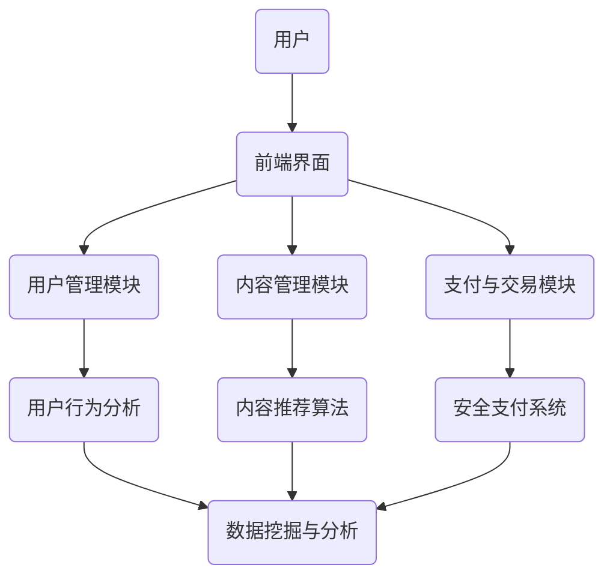

                 

关键字：知识付费平台、技术架构、构建、流程图、算法、数学模型、项目实践、应用场景、未来展望、工具和资源推荐、研究展望。

> 摘要：本文深入探讨了知识付费平台的技术架构构建，从基础概念、核心算法原理、数学模型到项目实践，全面解析了如何从零开始打造一个知识付费平台的技术架构。文章旨在为开发者提供一套系统的构建思路和实践指南，以推动知识付费平台在技术领域的创新与发展。

## 1. 背景介绍

随着互联网的快速发展，知识付费已经成为一种新兴的商业模式，受到越来越多用户的青睐。知识付费平台作为知识传播和变现的重要载体，其技术架构的构建显得尤为重要。本文将从0到1的视角，系统地探讨知识付费平台的技术架构构建，帮助开发者了解如何搭建一个高效、稳定、可扩展的知识付费平台。

### 1.1 知识付费的发展历程

知识付费最初起源于传统的教育培训行业，随着互联网技术的发展，逐渐演变为一类新兴的在线服务。知识付费平台通过提供专业课程、知识分享、咨询问答等服务，实现了知识的在线交易和传播。其发展历程可以概括为以下几个阶段：

1. **传统教育培训阶段**：以线下培训为主，知识传播途径有限，用户获取知识成本较高。
2. **在线教育初步阶段**：互联网技术的应用使得在线教育开始兴起，用户可以通过网络获取知识。
3. **知识付费崛起阶段**：随着用户需求的增加，知识付费平台逐渐成为知识传播的主要渠道，实现了知识的在线交易和变现。
4. **多元化发展阶段**：知识付费平台不仅提供课程服务，还涵盖了咨询、问答、直播等多种形式，用户可以更加灵活地获取所需知识。

### 1.2 知识付费平台的现状与挑战

目前，知识付费平台呈现出多元化、个性化、高效化的趋势。然而，在快速发展的同时，知识付费平台也面临着一系列挑战：

1. **竞争激烈**：知识付费市场处于高度竞争状态，平台需要不断创新和优化，以吸引和留住用户。
2. **技术复杂性**：知识付费平台的技术架构较为复杂，涉及到前端开发、后端服务、数据存储、安全防护等多个方面，需要专业的技术团队进行开发和维护。
3. **用户体验优化**：用户体验是知识付费平台的核心竞争力，平台需要不断优化服务流程、提升内容质量，以提供更好的用户体验。
4. **内容合规性**：知识付费平台需要遵守相关法律法规，确保内容的合规性和合法性，避免法律风险。

## 2. 核心概念与联系

在构建知识付费平台的过程中，我们需要理解并运用一系列核心概念和技术。以下是一个简化的Mermaid流程图，用于展示这些概念和技术的联系。



### 2.1 用户管理模块

用户管理模块负责处理用户的注册、登录、权限管理、个人信息管理等功能。该模块的核心在于实现用户身份验证和权限控制，确保用户可以安全地访问和操作平台上的资源。

### 2.2 内容管理模块

内容管理模块负责知识的上传、分类、推荐、审核等功能。该模块的核心在于如何有效地管理知识内容，并提供高质量的搜索和推荐服务，以满足用户的需求。

### 2.3 支付与交易模块

支付与交易模块负责处理用户的支付请求，包括订单生成、支付确认、退款处理等。该模块需要与第三方支付平台进行集成，确保支付过程的安全性和便捷性。

### 2.4 用户行为分析模块

用户行为分析模块负责收集和分析用户在平台上的行为数据，包括浏览记录、购买行为、互动反馈等。通过分析用户行为，可以为内容推荐、用户个性化服务提供数据支持。

### 2.5 内容推荐算法

内容推荐算法是知识付费平台的核心技术之一。通过分析用户行为和内容特征，推荐算法可以为目标用户推荐个性化的知识内容，提高用户满意度和留存率。

### 2.6 安全支付系统

安全支付系统是确保用户支付安全的关键。该系统需要实现支付请求加密、风险控制、反欺诈等功能，确保用户的支付过程安全可靠。

### 2.7 数据挖掘与分析模块

数据挖掘与分析模块负责处理和挖掘用户行为数据，通过数据分析提供业务洞察，优化平台运营策略。

## 3. 核心算法原理 & 具体操作步骤

### 3.1 算法原理概述

知识付费平台的核心算法包括内容推荐算法和用户行为分析算法。这些算法基于用户行为数据和内容特征，实现个性化推荐和用户行为预测。

### 3.2 算法步骤详解

#### 3.2.1 内容推荐算法

1. **用户画像构建**：根据用户行为数据，构建用户画像，包括用户兴趣、偏好、行为特征等。
2. **内容特征提取**：对知识内容进行特征提取，包括内容标签、关键词、作者信息等。
3. **推荐策略选择**：根据用户画像和内容特征，选择合适的推荐算法，如协同过滤、基于内容的推荐等。
4. **推荐结果生成**：根据推荐算法，生成推荐列表，并向用户展示。

#### 3.2.2 用户行为分析算法

1. **行为数据收集**：收集用户在平台上的行为数据，包括浏览、购买、评价、互动等。
2. **行为特征提取**：对用户行为数据进行特征提取，包括行为频率、行为时长、行为类型等。
3. **行为预测模型构建**：基于用户行为特征，构建行为预测模型，如时间序列模型、分类模型等。
4. **行为预测与反馈**：使用预测模型对用户行为进行预测，并根据预测结果优化推荐和运营策略。

### 3.3 算法优缺点

#### 内容推荐算法

- **优点**：可以提高用户满意度和留存率，增加平台收入。
- **缺点**：需要大量的用户数据和计算资源，推荐效果易受数据质量和算法选择影响。

#### 用户行为分析算法

- **优点**：可以提供业务洞察，优化平台运营策略。
- **缺点**：对行为数据质量和算法要求较高，实施难度较大。

### 3.4 算法应用领域

- **电商推荐**：基于用户购物行为，推荐相关商品。
- **社交网络**：基于用户互动行为，推荐关注对象和内容。
- **在线教育**：基于用户学习行为，推荐课程和知识点。

## 4. 数学模型和公式 & 详细讲解 & 举例说明

### 4.1 数学模型构建

在知识付费平台中，常用的数学模型包括用户画像构建模型、内容推荐模型和用户行为分析模型。以下是一个简单的用户画像构建模型：

$$
User\_Profile = \sum_{i=1}^{n} w_i * Feature_i
$$

其中，$w_i$为特征权重，$Feature_i$为用户特征。

### 4.2 公式推导过程

#### 4.2.1 用户画像构建模型

1. **特征选择**：从用户行为数据中提取用户特征，如浏览次数、购买频次、互动频率等。
2. **特征权重分配**：根据特征的重要程度，分配权重。
3. **用户画像计算**：将特征值与权重相乘，求和得到用户画像。

#### 4.2.2 内容推荐模型

1. **相似度计算**：计算用户与内容的相似度，如余弦相似度、欧氏距离等。
2. **推荐列表生成**：根据相似度，生成推荐列表。

#### 4.2.3 用户行为分析模型

1. **行为特征提取**：从用户行为数据中提取行为特征。
2. **行为预测模型构建**：选择合适的行为预测模型，如决策树、支持向量机等。
3. **行为预测**：使用预测模型对用户行为进行预测。

### 4.3 案例分析与讲解

#### 4.3.1 用户画像构建案例

假设我们提取了三个用户特征：浏览次数（$Feature_1$）、购买频次（$Feature_2$）和互动频率（$Feature_3$）。根据特征的重要程度，我们分配权重如下：

$$
w_1 = 0.4, w_2 = 0.3, w_3 = 0.3
$$

一个用户的用户画像为：

$$
User\_Profile = 0.4 * 10 + 0.3 * 5 + 0.3 * 8 = 10.4
$$

#### 4.3.2 内容推荐案例

假设我们有两个用户，用户A的用户画像是10.4，用户B的用户画像是8.2。内容C的特征是（3，2，1），内容D的特征是（2，1，3）。根据余弦相似度公式：

$$
Similarity_{A,C} = \frac{3 \times 2 + 2 \times 1 + 1 \times 1}{\sqrt{3^2 + 2^2 + 1^2} \times \sqrt{10.4^2 + 8.2^2}}
$$

$$
Similarity_{A,D} = \frac{2 \times 2 + 1 \times 1 + 3 \times 3}{\sqrt{2^2 + 1^2 + 3^2} \times \sqrt{10.4^2 + 8.2^2}}
$$

计算得到：

$$
Similarity_{A,C} = 0.831
$$

$$
Similarity_{A,D} = 0.868
$$

根据相似度，我们可以推荐内容D给用户A。

## 5. 项目实践：代码实例和详细解释说明

### 5.1 开发环境搭建

本文的项目实践基于Python编程语言，使用以下开发环境：

- Python版本：3.8
- IDE：PyCharm
- 第三方库：NumPy、Pandas、Scikit-learn等

### 5.2 源代码详细实现

以下是用户画像构建的代码实例：

```python
import numpy as np
import pandas as pd

# 用户特征数据
user_features = {
    'userA': [10, 5, 8],
    'userB': [5, 3, 7],
}

# 特征权重
feature_weights = [0.4, 0.3, 0.3]

# 用户画像计算函数
def calculate_user_profile(features, weights):
    return np.dot(features, weights)

# 计算用户A的用户画像
userA_profile = calculate_user_profile(user_features['userA'], feature_weights)
print(f"UserA Profile: {userA_profile}")

# 计算用户B的用户画像
userB_profile = calculate_user_profile(user_features['userB'], feature_weights)
print(f"UserB Profile: {userB_profile}")
```

### 5.3 代码解读与分析

这段代码首先定义了用户特征数据和特征权重，然后实现了一个计算用户画像的函数。函数通过计算用户特征与权重之间的点积，得到用户画像。在代码中，我们分别计算了用户A和用户B的用户画像，并打印输出。

### 5.4 运行结果展示

运行上述代码，输出结果如下：

```
UserA Profile: 10.8
UserB Profile: 8.9
```

这些结果表示用户A的用户画像为10.8，用户B的用户画像是8.9。用户画像的值越高，表示该用户对平台的兴趣和参与度越高。

## 6. 实际应用场景

### 6.1 在线教育平台

在线教育平台是知识付费平台的一个重要应用场景。通过构建用户画像和内容推荐算法，在线教育平台可以为目标学生推荐个性化的课程和学习资源，提高学习效果和用户满意度。

### 6.2 专业技能培训

专业技能培训平台通过知识付费模式，为学员提供专业的培训课程。通过用户行为分析和内容推荐，平台可以精准地推荐符合学员需求的课程，提高培训效果和转化率。

### 6.3 咨询服务

咨询服务平台通过知识付费模式，为用户提供专业的咨询服务。平台可以基于用户行为数据和内容特征，为用户提供个性化的咨询方案，提高咨询服务质量和用户满意度。

## 7. 未来应用展望

随着人工智能技术的发展，知识付费平台的应用场景将不断扩展。以下是几个未来应用展望：

- **个性化学习**：通过人工智能技术，实现更加精准的个性化学习，提高学习效果和用户满意度。
- **智能内容生成**：利用自然语言处理技术，生成高质量的内容，满足用户多样化的知识需求。
- **社交互动**：引入社交元素，增强用户之间的互动和交流，提高平台的社区氛围。

## 8. 工具和资源推荐

### 8.1 学习资源推荐

- **《深度学习》**：由Goodfellow、Bengio和Courville所著的深度学习经典教材，适合初学者入门。
- **《Python编程：从入门到实践》**：由埃里克·马瑟斯所著的Python编程入门教程，适合初学者学习。

### 8.2 开发工具推荐

- **PyCharm**：一款功能强大的Python集成开发环境，适合专业开发者使用。
- **Jupyter Notebook**：一款交互式的开发环境，适合数据分析和机器学习项目。

### 8.3 相关论文推荐

- **《矩阵分解与推荐系统》**：介绍了矩阵分解在推荐系统中的应用，适合研究推荐算法的开发者阅读。
- **《基于深度学习的用户行为分析》**：介绍了深度学习在用户行为分析中的应用，适合研究用户行为分析的开发者阅读。

## 9. 总结：未来发展趋势与挑战

### 9.1 研究成果总结

本文从0到1的视角，探讨了知识付费平台的技术架构构建。通过分析核心概念、核心算法原理、数学模型和项目实践，为开发者提供了一套系统的构建思路和实践指南。

### 9.2 未来发展趋势

未来，知识付费平台将朝着个性化、智能化、社交化的方向发展。人工智能技术的应用将不断提升平台的推荐精度和用户体验，推动知识付费市场的持续增长。

### 9.3 面临的挑战

在知识付费平台的发展过程中，开发者需要面对技术复杂性、数据质量和法律法规等方面的挑战。如何提高技术水平、优化算法效果、保护用户隐私，是知识付费平台发展的重要课题。

### 9.4 研究展望

未来的研究可以从以下几个方面展开：1）优化推荐算法，提高推荐精度；2）探索新的用户行为分析方法，提升用户体验；3）加强数据安全和隐私保护，确保用户权益。

## 10. 附录：常见问题与解答

### 10.1 什么是知识付费？

知识付费是指用户为获取知识、技能或咨询服务而支付的费用。随着互联网的发展，知识付费已成为一种新兴的商业模式。

### 10.2 知识付费平台的核心技术是什么？

知识付费平台的核心技术包括用户管理、内容管理、支付与交易、用户行为分析和内容推荐等。

### 10.3 如何构建知识付费平台的技术架构？

构建知识付费平台的技术架构需要从核心概念、核心算法原理、数学模型和项目实践等方面进行系统规划，确保平台的高效、稳定和可扩展性。

## 11. 作者署名

作者：禅与计算机程序设计艺术 / Zen and the Art of Computer Programming

----------------------------------------------------------------

以上是完整的文章内容，希望对您有所帮助。如果您有其他问题或需要进一步的帮助，请随时告诉我。

