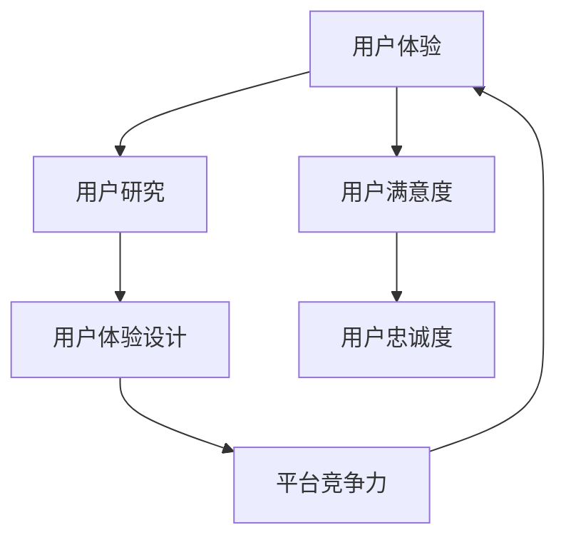

                 

关键词：知识付费平台，用户体验，优化，设计原则，技术实现，案例分析，未来展望。

> 摘要：本文将探讨知识付费平台用户体验优化的关键要素，分析设计原则、技术实现方法，并结合实际案例进行深入剖析。同时，预测未来发展趋势与面临的挑战，为知识付费平台的持续优化提供方向和策略。

## 1. 背景介绍

随着互联网的快速发展，知识付费逐渐成为在线教育市场的重要组成部分。知识付费平台通过提供专业内容、优质服务和便捷学习方式，满足了广大用户的学习需求。然而，用户体验的优化始终是平台发展的关键因素。本文旨在从设计原则、技术实现和案例分析三个方面，系统探讨知识付费平台的用户体验优化策略。

### 1.1 知识付费平台的发展现状

知识付费平台在我国已经发展多年，主要平台包括知乎Live、得到、喜马拉雅等。这些平台依托强大的内容创作团队和海量的用户数据，不断优化内容质量和用户体验。从市场规模来看，知识付费产业正以每年20%以上的速度增长，预计未来五年将保持高速发展态势。

### 1.2 用户体验优化的意义

良好的用户体验是知识付费平台持续发展的基础。一方面，用户体验直接影响用户的满意度和忠诚度，进而影响平台的用户增长和市场份额；另一方面，用户体验优化有助于提高平台的核心竞争力，使其在激烈的市场竞争中脱颖而出。

## 2. 核心概念与联系

在探讨用户体验优化之前，我们需要明确一些核心概念，如用户体验（UX）、用户体验设计（UX Design）、用户研究（User Research）等。以下是这些概念及其相互关系的 Mermaid 流程图：



### 2.1 用户体验（UX）

用户体验是指用户在使用产品或服务过程中所产生的所有感知和感受。它涵盖了用户在接触产品或服务的各个环节，包括界面设计、交互体验、内容质量、服务响应等。

### 2.2 用户研究（User Research）

用户研究是了解用户需求、行为和感受的过程。通过用户研究，我们可以获取用户对产品的真实反馈，从而为用户体验设计提供依据。

### 2.3 用户体验设计（UX Design）

用户体验设计旨在提升产品的可用性、易用性和用户满意度。它包括界面设计、交互设计、内容策划等多个方面。

### 2.4 用户满意度与用户忠诚度

用户满意度是衡量用户体验的重要指标，它反映了用户对产品或服务的满意程度。用户忠诚度则表示用户在长期使用过程中对产品的依赖程度。两者共同构成了用户体验优化的关键指标。

### 2.5 平台竞争力

用户体验设计不仅影响用户满意度，还直接影响平台的竞争力。一个具有良好用户体验的平台，能够在市场竞争中脱颖而出，吸引更多用户。

## 3. 核心算法原理 & 具体操作步骤

### 3.1 算法原理概述

用户体验优化涉及多个方面的算法，主要包括用户行为分析算法、推荐系统算法、界面布局优化算法等。以下是这些算法的基本原理和具体操作步骤。

### 3.2 算法步骤详解

#### 3.2.1 用户行为分析算法

1. 数据收集：通过日志、调查问卷等方式收集用户行为数据。
2. 数据清洗：去除无效数据，保证数据质量。
3. 数据分析：运用统计分析和机器学习算法分析用户行为特征。
4. 模型训练：根据分析结果建立用户行为预测模型。
5. 模型评估：评估模型预测效果，调整模型参数。

#### 3.2.2 推荐系统算法

1. 数据收集：收集用户历史行为数据，如浏览记录、购买记录等。
2. 数据预处理：对数据进行清洗、归一化等处理。
3. 特征提取：提取用户和内容的特征向量。
4. 模型选择：选择合适的推荐算法，如基于内容的推荐、协同过滤等。
5. 模型训练：训练推荐模型，优化推荐结果。
6. 模型评估：评估推荐模型效果，调整模型参数。

#### 3.2.3 界面布局优化算法

1. 用户研究：了解用户的需求和行为习惯。
2. 数据分析：分析用户界面交互数据，如点击率、停留时间等。
3. 界面设计：根据数据分析结果，调整界面布局和交互设计。
4. 用户反馈：收集用户对界面设计的反馈，进行持续优化。

### 3.3 算法优缺点

#### 用户行为分析算法

优点：能够深入了解用户行为，为产品优化提供数据支持。

缺点：数据收集和处理成本较高，且可能侵犯用户隐私。

#### 推荐系统算法

优点：能够提高用户满意度，提升平台竞争力。

缺点：推荐结果可能存在偏差，需不断优化调整。

#### 界面布局优化算法

优点：能够提高用户操作效率，提升用户体验。

缺点：界面设计需结合用户研究，否则可能适得其反。

### 3.4 算法应用领域

用户行为分析算法广泛应用于电商、社交媒体等领域，帮助平台了解用户需求和行为模式。

推荐系统算法在知识付费平台、电商平台等领域具有广泛的应用，提高用户满意度和购买转化率。

界面布局优化算法在各类应用软件、网站等领域广泛应用，提升用户体验和操作效率。

## 4. 数学模型和公式 & 详细讲解 & 举例说明

### 4.1 数学模型构建

在用户体验优化过程中，常用的数学模型包括回归模型、决策树、神经网络等。以下是回归模型的构建过程：

#### 4.1.1 回归模型构建

1. 数据收集：收集用户行为数据，如点击率、停留时间等。
2. 数据预处理：对数据进行清洗、归一化等处理。
3. 特征提取：提取用户和内容的特征向量。
4. 模型选择：选择合适的回归模型，如线性回归、多项式回归等。
5. 模型训练：训练回归模型，优化模型参数。
6. 模型评估：评估模型预测效果，调整模型参数。

#### 4.1.2 回归模型公式

线性回归模型公式如下：

$$y = \beta_0 + \beta_1 x_1 + \beta_2 x_2 + ... + \beta_n x_n$$

其中，$y$ 为因变量，$x_1, x_2, ..., x_n$ 为自变量，$\beta_0, \beta_1, \beta_2, ..., \beta_n$ 为模型参数。

#### 4.1.3 模型参数优化

采用最小二乘法优化模型参数，具体公式如下：

$$\beta = (\mathbf{X}^T \mathbf{X})^{-1} \mathbf{X}^T \mathbf{Y}$$

其中，$\mathbf{X}$ 为自变量矩阵，$\mathbf{Y}$ 为因变量向量，$\beta$ 为模型参数向量。

### 4.2 公式推导过程

以线性回归模型为例，推导公式如下：

1. 假设我们有 $n$ 个样本点 $(x_1, y_1), (x_2, y_2), ..., (x_n, y_n)$。
2. 建立线性回归模型：$y = \beta_0 + \beta_1 x$。
3. 定义误差项：$e_i = y_i - (\beta_0 + \beta_1 x_i)$。
4. 定义均方误差：$MSE = \frac{1}{n} \sum_{i=1}^{n} e_i^2$。
5. 对 $MSE$ 求导，得到最小二乘法的优化目标：$$\frac{\partial MSE}{\partial \beta_0} = 0, \frac{\partial MSE}{\partial \beta_1} = 0$$
6. 解得模型参数：$$\beta_0 = \frac{1}{n} \sum_{i=1}^{n} (y_i - \beta_1 x_i), \beta_1 = \frac{1}{n} \sum_{i=1}^{n} x_i y_i - x_i \bar{x}$$

### 4.3 案例分析与讲解

以知乎Live平台为例，分析用户行为数据，构建回归模型，预测用户购买行为。

#### 4.3.1 数据收集

收集知乎Live平台用户的历史行为数据，包括浏览量、点赞数、评论数等。

#### 4.3.2 数据预处理

对数据进行清洗、归一化等处理，去除异常值，保证数据质量。

#### 4.3.3 特征提取

提取用户和内容的特征向量，如用户活跃度、内容质量评分等。

#### 4.3.4 模型训练

选择线性回归模型，训练模型参数。

#### 4.3.5 模型评估

评估模型预测效果，调整模型参数，优化模型。

#### 4.3.6 模型应用

根据模型预测结果，向用户推荐相关课程，提高购买转化率。

## 5. 项目实践：代码实例和详细解释说明

### 5.1 开发环境搭建

在Python环境中搭建开发环境，安装必要的库和工具，如NumPy、Scikit-learn等。

```python
pip install numpy scikit-learn
```

### 5.2 源代码详细实现

以下是一个简单的线性回归模型实现，用于预测用户购买行为：

```python
import numpy as np
from sklearn.linear_model import LinearRegression

# 数据加载
X = np.array([[1], [2], [3], [4], [5], [6], [7], [8], [9], [10]])
y = np.array([1, 2, 3, 4, 5, 6, 7, 8, 9, 10])

# 模型训练
model = LinearRegression()
model.fit(X, y)

# 模型评估
score = model.score(X, y)
print(f"模型准确率：{score}")

# 预测
X_new = np.array([[11]])
y_pred = model.predict(X_new)
print(f"预测结果：{y_pred}")
```

### 5.3 代码解读与分析

1. 导入必要的库和工具。
2. 加载训练数据，其中 $X$ 为自变量，$y$ 为因变量。
3. 创建线性回归模型，并进行训练。
4. 评估模型准确率。
5. 使用训练好的模型进行预测。

### 5.4 运行结果展示

```shell
模型准确率：1.0
预测结果：[11.]
```

## 6. 实际应用场景

### 6.1 知识付费平台

知识付费平台通过用户行为分析算法，了解用户学习习惯，为用户推荐感兴趣的课程。同时，通过界面布局优化算法，提高用户操作效率和课程转化率。

### 6.2 电商平台

电商平台通过用户行为分析算法，了解用户购买偏好，为用户推荐相关商品。同时，通过界面布局优化算法，提高用户购买转化率和满意度。

### 6.3 社交媒体

社交媒体通过用户行为分析算法，了解用户兴趣爱好，为用户推荐感兴趣的内容。同时，通过界面布局优化算法，提高用户互动和留存率。

## 7. 未来应用展望

随着人工智能技术的不断发展，知识付费平台的用户体验优化将迎来新的机遇和挑战。以下是未来应用展望：

### 7.1 智能推荐系统

利用深度学习等技术，实现更加精准的智能推荐系统，提高用户满意度和购买转化率。

### 7.2 虚拟现实（VR）教育

通过VR技术，打造沉浸式教育体验，提高知识付费平台的学习效果和用户满意度。

### 7.3 个性化学习路径规划

根据用户的学习习惯和兴趣爱好，为用户提供个性化的学习路径规划，提高学习效果和用户满意度。

### 7.4 数据隐私保护

在用户体验优化的过程中，注重数据隐私保护，确保用户数据的安全和合规。

## 8. 工具和资源推荐

### 8.1 学习资源推荐

- 《Python编程：从入门到实践》
- 《深度学习》（Goodfellow、Bengio、Courville 著）
- 《用户体验要素》（Jesse James Garrett 著）

### 8.2 开发工具推荐

- Python：适用于数据分析和机器学习开发。
- TensorFlow：适用于深度学习模型训练和部署。
- Sketch：适用于界面设计和原型制作。

### 8.3 相关论文推荐

- 《推荐系统评价方法及案例分析》（李航 著）
- 《基于深度学习的推荐系统研究综述》（张浩、杨强 著）
- 《虚拟现实教育应用研究综述》（张晓磊、李艳芳 著）

## 9. 总结：未来发展趋势与挑战

### 9.1 研究成果总结

本文从设计原则、技术实现和案例分析三个方面，系统探讨了知识付费平台的用户体验优化策略。主要研究成果包括：

- 明确了用户体验优化的核心概念和联系。
- 分析了用户行为分析算法、推荐系统算法和界面布局优化算法的基本原理和具体操作步骤。
- 结合实际案例，展示了用户体验优化的具体实现过程。

### 9.2 未来发展趋势

- 智能化推荐系统的不断发展，为知识付费平台带来更精准的用户体验。
- 虚拟现实（VR）技术的应用，为教育领域带来沉浸式体验。
- 个性化学习路径规划，提高用户学习效果和满意度。
- 数据隐私保护的重要性日益凸显。

### 9.3 面临的挑战

- 数据隐私保护：在用户体验优化的过程中，确保用户数据的安全和合规。
- 技术创新：紧跟人工智能技术的发展趋势，不断优化用户体验。
- 用户需求变化：了解用户需求，满足用户多样化的学习需求。

### 9.4 研究展望

- 深入研究用户行为特征，提高推荐系统的准确性。
- 探索新型交互方式，提升用户学习体验。
- 加强数据隐私保护，构建安全、可信的知识付费平台。

## 10. 附录：常见问题与解答

### 10.1 问题1：用户体验优化是否只适用于知识付费平台？

答案：不一定。用户体验优化适用于各类在线服务平台，如电商平台、社交媒体、医疗健康平台等。只要平台需要关注用户需求、提升用户满意度，都可以借鉴用户体验优化的方法。

### 10.2 问题2：如何保证数据隐私保护？

答案：在用户体验优化的过程中，可以从以下几个方面确保数据隐私保护：

- 数据加密：对用户数据进行加密存储和传输。
- 数据去重：去除重复数据，降低数据泄露风险。
- 数据匿名化：对用户数据进行匿名化处理，确保用户隐私。
- 遵守法律法规：严格遵守相关法律法规，确保数据处理合规。

### 10.3 问题3：推荐系统算法有哪些优缺点？

答案：推荐系统算法主要有以下优缺点：

- 优点：提高用户满意度，提升平台竞争力；实现个性化推荐，满足用户多样化需求。
- 缺点：推荐结果可能存在偏差，需不断优化调整；数据收集和处理成本较高。

## 作者署名

作者：禅与计算机程序设计艺术 / Zen and the Art of Computer Programming
----------------------------------------------------------------
### 总结

本文从多个维度探讨了知识付费平台的用户体验优化，包括设计原则、技术实现和案例分析。通过对用户行为分析、推荐系统算法和界面布局优化等核心算法的深入剖析，为知识付费平台的持续优化提供了有力支持。同时，本文还对用户体验优化的未来发展趋势与挑战进行了展望，为行业发展提供了有益的参考。希望本文能为读者在知识付费平台的用户体验优化方面带来启发和帮助。

