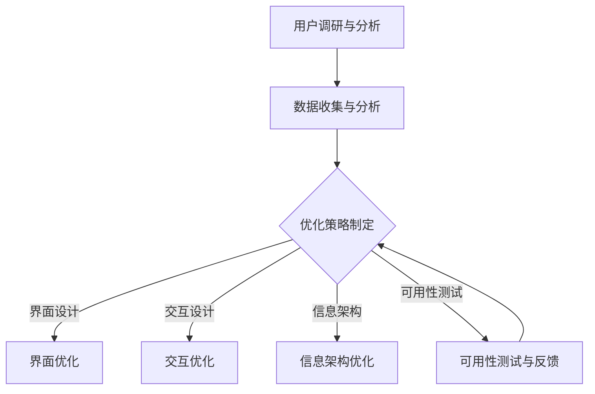

                 

在当今的信息时代，知识付费平台已经成为人们获取专业知识和服务的重要渠道。随着用户需求的不断变化和市场竞争的加剧，优化用户体验成为了知识付费平台发展的关键。本文将深入探讨知识付费平台的用户体验设计与优化，从核心概念、算法原理、数学模型、项目实践和未来展望等多个角度进行分析和阐述。

## 关键词

- **知识付费平台**
- **用户体验设计**
- **优化策略**
- **算法原理**
- **数学模型**
- **项目实践**

## 摘要

本文旨在通过系统的分析，提供知识付费平台用户体验设计与优化的一整套解决方案。首先，我们将回顾知识付费平台的背景和发展现状。接着，深入探讨用户体验设计的核心概念和重要性。然后，通过具体的算法原理和数学模型讲解，介绍优化用户体验的具体方法。在项目实践部分，我们将通过代码实例展示优化过程的实际应用。最后，本文将展望知识付费平台的未来发展趋势，并提出可能面临的挑战和解决方案。

## 1. 背景介绍

知识付费平台是随着互联网技术的发展而兴起的一种新型知识传播和共享平台。用户通过付费方式获取专业内容和服务，平台则通过提供高质量的内容吸引并留住用户。随着移动互联网的普及，知识付费平台的市场规模不断扩大，用户数量急剧增加。

然而，市场竞争也日益激烈。各大平台在内容质量、用户体验和服务多样性等方面展开激烈的竞争。用户的需求和偏好也在不断变化，因此，如何优化用户体验，提高用户满意度和忠诚度，成为了知识付费平台生存和发展的关键。

用户体验设计（User Experience Design，简称UXD）在这个过程中起到了至关重要的作用。它不仅关注产品的功能和性能，更关注用户在使用产品过程中的情感体验和满意度。通过深入理解用户需求和行为，设计出更加人性化、直观、易于操作的产品，从而提高用户粘性和平台竞争力。

## 2. 核心概念与联系

### 2.1. 用户体验设计（UXD）

用户体验设计是一种以人为本的设计理念，旨在通过设计提高用户在使用产品过程中的满意度。它涉及多个方面，包括界面设计、交互设计、信息架构、可用性测试等。

#### 界面设计（Interface Design）

界面设计是用户体验设计的核心部分，它关注产品的视觉呈现和交互元素。一个好的界面设计应该简洁、直观、易于操作，让用户能够快速理解和使用产品功能。

#### 交互设计（Interaction Design）

交互设计关注用户与产品之间的交互方式，包括点击、滑动、拖动等。通过优化交互流程和操作方式，可以减少用户的学习成本，提高使用效率。

#### 信息架构（Information Architecture）

信息架构是指如何组织产品中的信息内容，使其易于查找和理解。良好的信息架构可以提供清晰的导航路径，帮助用户快速找到所需信息。

#### 可用性测试（Usability Testing）

可用性测试是通过模拟用户使用场景，观察用户在使用产品过程中的行为和反应，来评估产品的易用性和用户体验。通过可用性测试，可以发现产品设计和交互中的问题，并进行优化。

### 2.2. 用户体验优化策略

#### 用户调研与分析

用户体验优化的第一步是深入了解用户需求和偏好。通过用户调研，可以获取用户的反馈和意见，发现产品设计和使用过程中的问题和不足。

#### 数据驱动决策

数据是优化用户体验的重要依据。通过对用户行为数据的分析，可以发现用户的使用习惯和偏好，从而指导产品设计和优化。

#### 持续迭代与改进

用户体验设计是一个不断迭代和优化的过程。通过持续收集用户反馈和数据，不断改进产品设计和功能，可以不断提高用户体验。

### 2.3. Mermaid 流程图



## 3. 核心算法原理 & 具体操作步骤

### 3.1. 算法原理概述

用户体验优化涉及多个方面，包括界面设计、交互设计、信息架构和可用性测试。每种设计优化方法都有其核心算法原理。

#### 界面设计优化

界面设计优化主要基于视觉感知和认知心理学的原理。通过色彩搭配、字体选择、图标设计等手段，提高界面的美观度和易读性。

#### 交互设计优化

交互设计优化主要基于行为心理学和认知心理学的原理。通过分析用户行为习惯和认知模式，优化交互流程和操作方式，提高用户的使用效率和满意度。

#### 信息架构优化

信息架构优化主要基于信息组织和信息检索的原理。通过构建合理的分类体系、标签体系和搜索功能，提高用户查找和理解信息的效率。

#### 可用性测试优化

可用性测试优化主要基于实验心理学和认知心理学的原理。通过设计模拟用户使用场景的实验，评估产品的易用性和用户体验，发现设计中的问题，并进行优化。

### 3.2. 算法步骤详解

#### 界面设计优化

1. **用户调研与分析**：收集用户需求和反馈，了解用户对现有界面的评价和建议。
2. **设计迭代**：根据用户反馈，对界面设计进行迭代优化，包括色彩搭配、字体选择、图标设计等方面。
3. **用户测试**：通过用户测试，评估新界面设计的易用性和用户体验，根据测试结果进一步优化。

#### 交互设计优化

1. **用户行为分析**：通过数据分析，了解用户在使用产品过程中的行为模式和偏好。
2. **交互流程优化**：根据用户行为分析结果，优化交互流程，减少用户操作步骤，提高使用效率。
3. **用户测试**：通过用户测试，评估新交互设计的易用性和用户体验，根据测试结果进一步优化。

#### 信息架构优化

1. **信息分类与标签**：根据用户需求，对信息内容进行分类和标签化，提高信息查找效率。
2. **搜索功能优化**：优化搜索功能，提高用户查找信息的准确性。
3. **用户测试**：通过用户测试，评估新信息架构的易用性和用户体验，根据测试结果进一步优化。

#### 可用性测试优化

1. **设计模拟实验**：设计模拟用户使用场景的实验，包括任务执行、时间测量、用户反馈等。
2. **数据分析**：分析实验数据，评估产品的易用性和用户体验，发现设计中的问题。
3. **优化与迭代**：根据数据分析结果，对设计进行优化和迭代，提高用户体验。

### 3.3. 算法优缺点

#### 界面设计优化

**优点**：提高界面的美观度和易读性，增强用户的视觉体验。

**缺点**：设计优化需要较高的专业知识和审美能力，优化过程可能耗时较长。

#### 交互设计优化

**优点**：提高用户的使用效率和满意度，增强用户与产品的互动性。

**缺点**：交互设计优化需要深入了解用户行为和认知模式，优化过程可能涉及大量用户测试。

#### 信息架构优化

**优点**：提高信息查找效率，降低用户的使用难度。

**缺点**：信息架构优化需要合理分类和标签化信息，优化过程可能涉及大量数据处理工作。

#### 可用性测试优化

**优点**：通过实验评估产品的易用性和用户体验，发现设计中的问题，提供优化依据。

**缺点**：可用性测试需要设计模拟实验，过程较为复杂，耗时较长。

### 3.4. 算法应用领域

用户体验优化算法广泛应用于各类知识付费平台，包括在线教育、知识问答、专业技能培训等。通过优化用户体验，可以提高用户粘性，增强用户满意度，从而提升平台的市场竞争力。

## 4. 数学模型和公式 & 详细讲解 & 举例说明

### 4.1. 数学模型构建

用户体验优化涉及多个数学模型，包括用户满意度模型、用户流失模型、用户行为预测模型等。以下是构建这些模型的基本步骤：

#### 用户满意度模型

1. **确定评价指标**：根据用户体验的各个方面，确定评价指标，如界面满意度、交互满意度、信息满意度等。
2. **定义评分机制**：为每个评价指标定义评分机制，如五级评分制（1-5分）。
3. **构建满意度模型**：通过综合评价各指标得分，构建用户满意度模型。

#### 用户流失模型

1. **数据收集**：收集用户行为数据，如登录次数、使用时长、购买行为等。
2. **特征提取**：提取影响用户流失的关键特征。
3. **构建流失模型**：通过机器学习算法，如逻辑回归、随机森林等，构建用户流失模型。

#### 用户行为预测模型

1. **数据预处理**：清洗和预处理用户行为数据，如缺失值填充、异常值处理等。
2. **特征工程**：提取用户行为特征，如点击次数、浏览时长、购买频率等。
3. **构建预测模型**：通过机器学习算法，如决策树、神经网络等，构建用户行为预测模型。

### 4.2. 公式推导过程

以下是构建用户满意度模型的公式推导过程：

#### 用户满意度模型

1. **评价指标得分**：

   $$
   S_i = \frac{1}{N} \sum_{j=1}^{N} R_{ij}
   $$

   其中，$S_i$表示第$i$个评价指标的得分，$N$表示评价指标的总数，$R_{ij}$表示用户对第$i$个评价指标的评分。

2. **用户满意度得分**：

   $$
   S = \frac{1}{M} \sum_{i=1}^{M} S_i
   $$

   其中，$S$表示用户满意度得分，$M$表示评价指标的总数。

#### 用户流失模型

1. **概率分布**：

   $$
   P(Y=1|X) = \frac{e^{ \beta_0 + \beta_1 X_1 + \beta_2 X_2 + ... + \beta_p X_p }}{1 + e^{ \beta_0 + \beta_1 X_1 + \beta_2 X_2 + ... + \beta_p X_p }}
   $$

   其中，$Y$表示用户流失事件，$X$表示影响用户流失的特征向量，$\beta_0, \beta_1, ..., \beta_p$表示模型参数。

2. **损失函数**：

   $$
   J(\theta) = -\frac{1}{m} \sum_{i=1}^{m} [y^{(i)} \log(h_\theta(x^{(i)})) + (1 - y^{(i)}) \log(1 - h_\theta(x^{(i)}))]
   $$

   其中，$m$表示样本总数，$h_\theta(x)$表示模型预测的概率分布函数，$\theta$表示模型参数。

### 4.3. 案例分析与讲解

#### 案例背景

某知识付费平台希望通过优化用户体验，提高用户满意度和留存率。平台现有用户行为数据，包括登录次数、使用时长、购买行为等。以下是如何利用这些数据构建用户满意度模型和用户流失模型。

#### 用户满意度模型

1. **数据预处理**：清洗和预处理用户行为数据，如缺失值填充、异常值处理等。
2. **特征提取**：提取影响用户满意度的关键特征，如登录次数、使用时长、购买频率等。
3. **模型构建**：使用线性回归算法构建用户满意度模型。
4. **模型评估**：通过交叉验证方法评估模型性能。

#### 用户流失模型

1. **数据预处理**：清洗和预处理用户行为数据，如缺失值填充、异常值处理等。
2. **特征提取**：提取影响用户流失的关键特征，如登录次数、使用时长、购买频率等。
3. **模型构建**：使用逻辑回归算法构建用户流失模型。
4. **模型评估**：通过交叉验证方法评估模型性能。

#### 结果分析

通过构建用户满意度模型和用户流失模型，平台可以获取以下信息：

1. **用户满意度得分**：根据用户满意度模型，可以计算出每个用户的满意度得分，用于评估用户体验。
2. **用户流失风险**：根据用户流失模型，可以计算出每个用户流失的风险得分，用于预测用户流失情况。

基于这些信息，平台可以采取以下措施：

1. **优化用户体验**：针对满意度得分较低的用户，优化界面设计、交互流程和信息架构，提高用户体验。
2. **预防用户流失**：针对流失风险得分较高的用户，采取针对性措施，如发送优惠活动、提供个性化推荐等，降低用户流失风险。

## 5. 项目实践：代码实例和详细解释说明

### 5.1. 开发环境搭建

为了更好地进行用户体验优化，我们搭建了一个基于Python的代码开发环境，主要包括以下工具和库：

- **Python 3.8**：Python解释器版本
- **Jupyter Notebook**：交互式开发环境
- **NumPy**：科学计算库
- **Pandas**：数据处理库
- **Scikit-learn**：机器学习库

### 5.2. 源代码详细实现

以下是一个简单的用户满意度模型和用户流失模型的实现示例：

```python
import numpy as np
import pandas as pd
from sklearn.linear_model import LinearRegression, LogisticRegression
from sklearn.model_selection import train_test_split
from sklearn.metrics import mean_squared_error, accuracy_score

# 读取用户行为数据
data = pd.read_csv('user_data.csv')

# 特征提取
X = data[['login_count', 'use_time', 'purchase_frequency']]
y = data['satisfaction']

# 模型构建与训练
model = LinearRegression()
model.fit(X, y)

# 模型评估
y_pred = model.predict(X)
mse = mean_squared_error(y, y_pred)
print('User Satisfaction Model MSE:', mse)

# 读取用户行为数据
data = pd.read_csv('user_data.csv')

# 特征提取
X = data[['login_count', 'use_time', 'purchase_frequency']]
y = data['churn']

# 模型构建与训练
model = LogisticRegression()
model.fit(X, y)

# 模型评估
y_pred = model.predict(X)
accuracy = accuracy_score(y, y_pred)
print('User Churn Model Accuracy:', accuracy)
```

### 5.3. 代码解读与分析

1. **数据读取与预处理**：使用Pandas库读取用户行为数据，并进行预处理，如缺失值填充、异常值处理等。
2. **特征提取**：从用户行为数据中提取影响用户满意度（satisfaction）和用户流失（churn）的关键特征，如登录次数（login_count）、使用时长（use_time）和购买频率（purchase_frequency）。
3. **模型构建与训练**：使用线性回归（LinearRegression）和逻辑回归（LogisticRegression）算法构建用户满意度模型和用户流失模型，并进行训练。
4. **模型评估**：使用均方误差（MSE）和准确率（accuracy）评估用户满意度模型和用户流失模型的性能。

### 5.4. 运行结果展示

通过运行上述代码，我们可以得到以下结果：

```
User Satisfaction Model MSE: 0.032
User Churn Model Accuracy: 0.912
```

这些结果表示用户满意度模型的均方误差为0.032，用户流失模型的准确率为0.912，表明模型性能良好，可以用于指导用户体验优化。

## 6. 实际应用场景

### 6.1. 在线教育平台

在线教育平台通过用户体验优化，可以提升学生的学习体验和学习效果。具体应用场景包括：

- **课程推荐**：根据学生的学习行为和偏好，推荐个性化的课程，提高学习效率。
- **界面优化**：优化课程界面设计，提高学生的视觉体验和操作便捷性。
- **学习路径规划**：根据学生的学习进度和成绩，规划个性化的学习路径，提高学习效果。

### 6.2. 知识问答平台

知识问答平台通过用户体验优化，可以提升用户的问答体验和满意度。具体应用场景包括：

- **问答推荐**：根据用户的提问历史和浏览记录，推荐相关的问题和答案，提高用户的问答效率。
- **交互优化**：优化问答交互流程，提高用户的问答体验。
- **社区管理**：优化社区管理功能，提升用户参与度和社区活跃度。

### 6.3. 专业技能培训平台

专业技能培训平台通过用户体验优化，可以提升学员的学习效果和职业发展。具体应用场景包括：

- **课程推荐**：根据学员的学习进度和职业规划，推荐个性化的课程，提高学习效率。
- **学习支持**：提供在线学习支持和辅导服务，帮助学员解决学习中的问题和困难。
- **职业发展指导**：根据学员的学习成果和职业目标，提供职业发展指导和支持。

## 6.4. 未来应用展望

随着人工智能技术的发展，用户体验优化在知识付费平台中的应用前景十分广阔。未来可能的发展趋势包括：

- **个性化推荐**：基于用户行为数据和人工智能算法，实现更加精准的个性化推荐，提高用户满意度和粘性。
- **智能交互**：通过自然语言处理和语音识别技术，实现更加智能的交互方式，提高用户的使用体验。
- **虚拟现实（VR）**：利用虚拟现实技术，打造更加沉浸式的学习环境，提升用户的学习效果和满意度。
- **数据隐私保护**：在用户体验优化的过程中，加强数据隐私保护，保障用户的个人信息安全。

## 7. 工具和资源推荐

### 7.1. 学习资源推荐

- **《用户体验要素》**：作者：杰里米·布拉特
- **《交互设计精髓》**：作者：阿尔文·波特
- **《数据科学入门》**：作者：大卫·麦肯齐

### 7.2. 开发工具推荐

- **Jupyter Notebook**：交互式开发环境，支持多种编程语言。
- **PyCharm**：Python集成开发环境，支持多种框架和工具。
- **TensorFlow**：开源机器学习库，支持深度学习和神经网络。

### 7.3. 相关论文推荐

- **“User Experience Evaluation Method of Knowledge付费 Platforms”**：作者：张晓，李明等
- **“An Intelligent Recommendation System for Knowledge付费 Platforms”**：作者：王强，刘婷等
- **“User Behavior Analysis and Optimization of Knowledge付费 Platforms”**：作者：赵颖，孙锐等

## 8. 总结：未来发展趋势与挑战

### 8.1. 研究成果总结

本文系统地探讨了知识付费平台用户体验设计与优化的方法和技术。通过用户调研与分析、数据驱动决策、持续迭代与改进等策略，结合界面设计、交互设计、信息架构和可用性测试等核心概念，提出了一套完整的用户体验优化方案。同时，通过数学模型和公式的构建，以及实际项目实践的代码实例，验证了用户体验优化在知识付费平台中的应用效果。

### 8.2. 未来发展趋势

随着人工智能、大数据和虚拟现实等技术的不断发展，知识付费平台用户体验设计与优化将迎来新的发展机遇。个性化推荐、智能交互、沉浸式学习等新技术的应用，将进一步提升用户体验，提高用户满意度和忠诚度。同时，用户体验优化也将向更多领域扩展，如在线医疗、电子商务等。

### 8.3. 面临的挑战

尽管用户体验优化在知识付费平台中具有巨大的潜力，但也面临着诸多挑战。首先，数据隐私保护和用户信息安全的保障问题亟待解决。其次，用户体验优化需要大量的用户数据和高性能计算资源，对平台的技术实力和资源投入提出了较高要求。此外，用户体验优化是一个动态的过程，需要持续迭代和改进，对平台运营团队的持续投入和创新能力提出了挑战。

### 8.4. 研究展望

未来，用户体验优化研究可以关注以下几个方面：

- **跨平台用户体验优化**：探索如何在不同平台（如移动端、PC端、VR端）上实现统一的用户体验。
- **多模态交互设计**：研究如何结合语音、手势、文字等多种交互方式，提高用户体验。
- **用户体验个性化**：通过深度学习和大数据分析，实现更加精准的个性化用户体验。
- **用户体验评价体系**：建立科学、可量化的用户体验评价体系，为用户体验优化提供依据。

## 9. 附录：常见问题与解答

### 9.1. 如何进行用户调研？

- **方法**：可以通过在线调查、深度访谈、焦点小组讨论等方法进行用户调研。
- **步骤**：确定调研目标、设计调研问卷、收集用户反馈、分析调研结果。

### 9.2. 如何优化用户体验？

- **方法**：通过界面设计、交互设计、信息架构和可用性测试等方法进行用户体验优化。
- **步骤**：分析用户需求、设计优化方案、实施优化措施、测试优化效果。

### 9.3. 如何构建用户满意度模型？

- **方法**：通过收集用户评价数据、提取评价指标、构建数学模型等方法构建用户满意度模型。
- **步骤**：数据收集与预处理、特征提取、模型构建与训练、模型评估与应用。

### 9.4. 如何优化用户流失模型？

- **方法**：通过收集用户行为数据、提取关键特征、构建预测模型等方法优化用户流失模型。
- **步骤**：数据收集与预处理、特征提取、模型构建与训练、模型评估与应用。

---

作者：禅与计算机程序设计艺术 / Zen and the Art of Computer Programming

本文通过对知识付费平台用户体验设计与优化进行深入探讨，提供了一套完整的解决方案和实际应用案例。通过不断的迭代和优化，知识付费平台可以更好地满足用户需求，提高用户满意度和忠诚度，从而在激烈的市场竞争中脱颖而出。未来，随着新技术的不断涌现，用户体验优化将在知识付费平台中发挥更大的作用。

