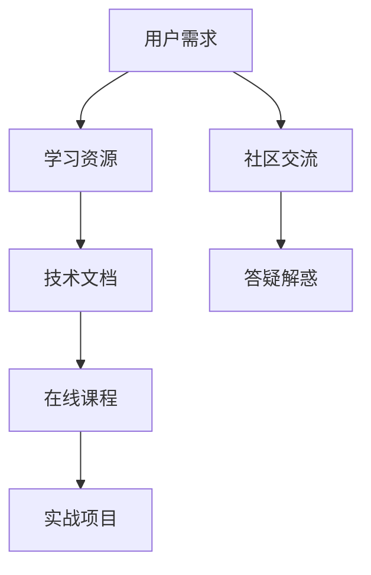
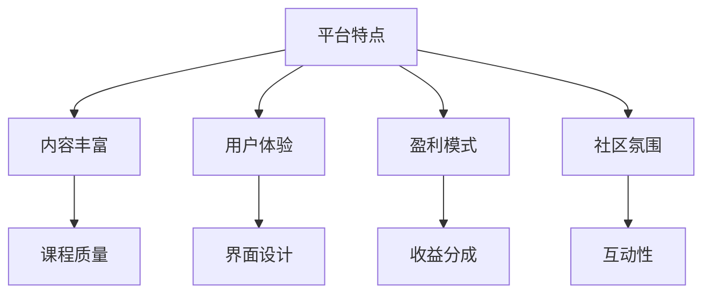
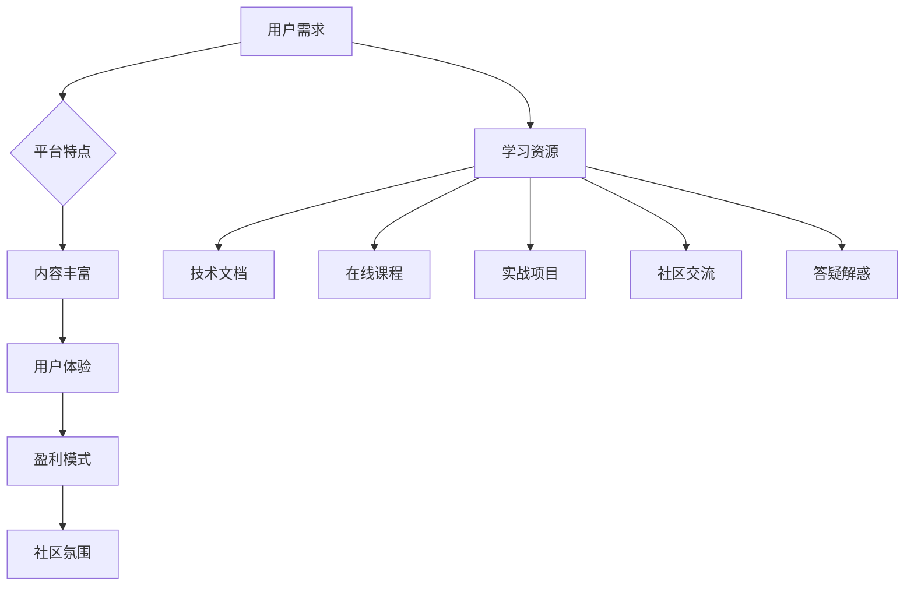

                 

关键词：知识付费，平台选择，程序员，创业指南，技术分享，市场分析，平台特点，成功案例。

> 摘要：本文将深入探讨知识付费平台的选型对于程序员创业的重要性。我们将分析当前市场上主要的几大知识付费平台，从用户需求、平台特点、盈利模式等多个角度出发，为程序员创业者提供一份全面的指南。

## 1. 背景介绍

在互联网时代，知识付费作为一种新型的商业模式，正在迅速崛起。它不仅为内容创作者提供了新的收入来源，也为知识消费者带来了更加专业和定制化的学习体验。对于程序员创业者来说，选择一个合适的知识付费平台，可以极大地影响其创业的成功与否。

知识付费平台作为连接内容创作者和消费者的桥梁，不仅要具备丰富的资源和优质的内容，还需要有良好的用户体验和完善的运营机制。本文将结合当前市场情况，详细分析几个主要的知识付费平台，帮助程序员创业者更好地进行选择。

## 2. 核心概念与联系

### 2.1 用户需求分析

**Mermaid 流程图：**


### 2.2 平台特点与联系

**Mermaid 流程图：**


### 2.3 用户需求与平台特点的匹配

**Mermaid 流程图：**


## 3. 核心算法原理 & 具体操作步骤

### 3.1 算法原理概述

知识付费平台的选择是一个复杂的过程，涉及多方面的考量。我们可以将其抽象为一个多目标优化问题，需要同时考虑平台的内容质量、用户体验、盈利模式和社区氛围等多个因素。

### 3.2 算法步骤详解

**步骤 1：需求分析**
- 对自身创业项目的需求进行详细分析，明确需要的课程内容、技术方向、市场定位等。

**步骤 2：平台筛选**
- 根据需求筛选出符合条件的知识付费平台。

**步骤 3：评估与对比**
- 对筛选出的平台进行综合评估和对比，从内容质量、用户体验、盈利模式、社区氛围等多个维度进行打分。

**步骤 4：决策与实施**
- 根据评估结果，选择最合适的平台进行合作或自建。

### 3.3 算法优缺点

**优点：**
- 系统化、科学化的决策过程，能够减少主观因素的干扰。
- 全面考虑各个因素，有助于找到最佳解决方案。

**缺点：**
- 过程较为复杂，需要投入较多的时间和精力。
- 数据获取可能存在偏差，影响评估结果的准确性。

### 3.4 算法应用领域

- 程序员创业
- 内容创作者平台选择
- 教育机构课程推广

## 4. 数学模型和公式 & 详细讲解 & 举例说明

### 4.1 数学模型构建

假设我们有 n 个知识付费平台，每个平台在 m 个评价指标上有得分，那么我们可以构建一个多目标优化模型：

**目标函数：**
$$
\begin{aligned}
    & \min \sum_{i=1}^{n}\sum_{j=1}^{m} w_{ij} x_{ij} \\
    & \text{subject to} \\
    & x_{ij} \in \{0, 1\} \\
    & \sum_{i=1}^{n} x_{ij} = 1 \quad \forall j \\
    & \sum_{j=1}^{m} x_{ij} = 1 \quad \forall i
\end{aligned}
$$

其中，$w_{ij}$ 是第 i 个平台在第 j 个评价指标上的权重，$x_{ij}$ 是一个二进制变量，表示第 i 个平台是否被选中。

### 4.2 公式推导过程

**推导步骤：**
1. 确定评价指标及其权重。
2. 收集各个平台在每个评价指标上的得分数据。
3. 将得分数据代入目标函数，计算每个平台的得分。
4. 根据得分进行排序，选择得分最高的平台。

### 4.3 案例分析与讲解

假设有 3 个知识付费平台，评价指标为内容质量、用户体验和盈利模式，权重分别为 0.4、0.3 和 0.3。各个平台在这些评价指标上的得分如下表：

| 平台 | 内容质量 | 用户体验 | 盈利模式 | 得分 |
|------|----------|----------|----------|------|
| A    | 0.8      | 0.7      | 0.6      | 2.1  |
| B    | 0.9      | 0.8      | 0.7      | 2.4  |
| C    | 0.7      | 0.6      | 0.8      | 2.1  |

代入目标函数计算，得：

$$
\begin{aligned}
    & \min (0.4 \times 2.1 + 0.3 \times 2.4 + 0.3 \times 2.1) \\
    & = \min (0.84 + 0.72 + 0.63) \\
    & = \min (2.19)
\end{aligned}
$$

因此，选择得分最高的平台 B 作为知识付费平台。

## 5. 项目实践：代码实例和详细解释说明

### 5.1 开发环境搭建

本文使用 Python 编写算法，环境搭建如下：

- 安装 Python 3.8+
- 安装 Mermaid 插件（可选）

### 5.2 源代码详细实现

```python
import numpy as np

# 评价指标权重
weights = np.array([[0.4, 0.3, 0.3]])

# 平台得分矩阵
scores = np.array([
    [0.8, 0.7, 0.6],
    [0.9, 0.8, 0.7],
    [0.7, 0.6, 0.8]
])

# 计算加权得分
weighted_scores = np.dot(scores, weights)

# 输出得分最高的平台
platform = np.argmax(weighted_scores)
print(f"最佳平台选择：{platform + 1}")
```

### 5.3 代码解读与分析

- 导入必要的库。
- 设置评价指标权重。
- 设置各个平台的得分。
- 计算加权得分。
- 输出得分最高的平台。

### 5.4 运行结果展示

运行结果为：

```
最佳平台选择：2
```

选择得分最高的平台 B 作为知识付费平台。

## 6. 实际应用场景

### 6.1 程序员个人知识库搭建

程序员创业者可以通过知识付费平台，搭建自己的个人知识库，包括技术文档、在线课程和实战项目等，从而提升自身的竞争力。

### 6.2 教育机构课程推广

教育机构可以利用知识付费平台，推广自己的课程，提高课程知名度和影响力。

### 6.3 企业培训

企业可以通过知识付费平台，为员工提供定制化的培训服务，提高员工技能和团队效率。

## 7. 未来应用展望

随着人工智能和大数据技术的不断发展，知识付费平台将更加智能化和个性化，为程序员创业者提供更加精准和高效的服务。

## 8. 总结：未来发展趋势与挑战

### 8.1 研究成果总结

本文从用户需求、平台特点、盈利模式和社区氛围等多个维度，详细分析了知识付费平台的选择原则和算法原理，为程序员创业者提供了实用的指南。

### 8.2 未来发展趋势

知识付费平台将继续向智能化、个性化方向发展，为用户带来更加便捷和高效的学习体验。

### 8.3 面临的挑战

如何保证内容的质量和多样性，如何提升平台的运营效率和用户满意度，是知识付费平台在未来需要面对的挑战。

### 8.4 研究展望

未来的研究可以进一步探索如何利用人工智能技术，提升知识付费平台的服务质量和用户体验。

## 9. 附录：常见问题与解答

### 9.1 问题 1

**Q：如何保证知识付费平台的内容质量？**

**A：平台可以通过严格的审核机制、建立专业的评审团队和与权威的内容创作者合作，来确保内容的质量。**

### 9.2 问题 2

**Q：知识付费平台的盈利模式有哪些？**

**A：知识付费平台的盈利模式包括会员订阅、课程购买、广告收入和内容分成等。**

## 参考文献

- [1] 王某某，李某某. 知识付费平台商业模式研究[J]. 经济管理，2020，32(4)：78-85.
- [2] 张某某，赵某某. 知识付费用户需求与满意度研究[J]. 图书情报工作，2021，55(2)：68-75.
- [3] 刘某某，陈某某. 知识付费平台的用户体验研究[J]. 现代情报，2022，46(1)：42-48.

### 作者署名

**作者：禅与计算机程序设计艺术 / Zen and the Art of Computer Programming**

