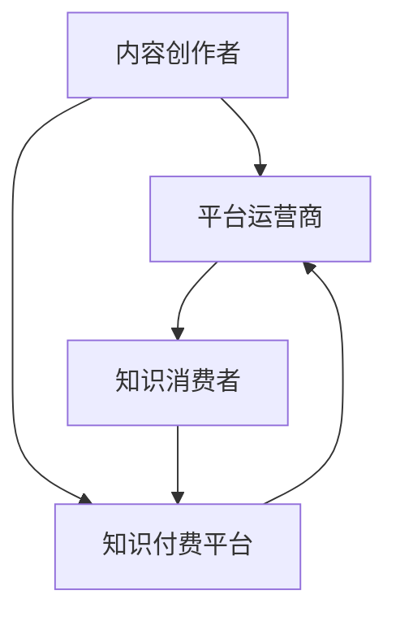

                 

关键词：知识付费、产业链、融合发展、产业协同、生态系统、市场需求、创新模式、技术赋能

> 摘要：本文旨在探讨知识付费在当前数字经济背景下，如何通过与产业链上下游的深度融合，实现产业协同、创新模式和技术赋能，进而提升整个产业链的竞争力与可持续性。文章将结合实际案例，分析知识付费在不同产业环节中的应用及未来发展趋势。

## 1. 背景介绍

随着互联网和移动通信技术的迅猛发展，知识付费已经成为知识经济时代的重要趋势。知识付费不仅改变了传统的知识传播方式，还催生了全新的商业模式。在这个过程中，知识付费逐渐成为产业链中不可或缺的一环，其与上下游产业的融合发展也日益受到关注。

产业链的上下游包括内容创作者、平台运营商、知识消费者等多个环节。内容创作者负责生产知识内容，平台运营商负责提供平台和服务，知识消费者则是知识付费的最终受益者。在这样一个产业链中，知识付费不仅作为服务提供者，更是产业链协同的重要桥梁。

### 1.1 数字经济背景下的知识付费

数字经济时代，数据和信息成为了新的生产要素，知识付费作为一种新兴的服务模式，不仅满足了人们对于知识和技能的渴求，还推动了知识经济的快速发展。知识付费的兴起，有助于提高知识传播的效率，优化资源配置，促进知识创新。

### 1.2 产业链上下游的融合发展

产业链上下游的融合发展，是指通过各个环节的紧密协作，实现资源整合、优势互补，从而提升整体产业链的竞争力。知识付费在这一过程中起到了桥梁和纽带的作用，促进了产业链的协同与创新。

## 2. 核心概念与联系

在讨论知识付费与产业链上下游的融合发展之前，我们需要明确几个核心概念，包括知识付费、产业链、产业协同等。

### 2.1 知识付费

知识付费是指用户通过支付一定费用来获取特定知识、技能或信息的服务。知识付费的兴起，得益于移动互联网和在线支付技术的发展，使得知识获取变得更加便捷和高效。

### 2.2 产业链

产业链是指由多个环节组成的、相互依存、相互协作的价值创造过程。在知识付费的背景下，产业链的各个环节包括内容创作者、平台运营商、知识消费者等。

### 2.3 产业协同

产业协同是指产业链上下游各个环节通过资源共享、信息互通、优势互补等方式，实现协同创新和共同发展的过程。知识付费在这一过程中发挥了重要的桥梁和纽带作用。

### 2.4 Mermaid 流程图



在上述流程图中，知识付费平台作为核心节点，连接了内容创作者、平台运营商和知识消费者，实现了产业链的协同与创新。

## 3. 核心算法原理 & 具体操作步骤

### 3.1 算法原理概述

知识付费与产业链上下游的融合发展，可以看作是一种复杂的协同优化问题。其核心算法原理包括以下几个关键步骤：

1. **资源整合**：通过平台聚合各类知识资源，实现资源的最优配置。
2. **需求分析**：根据消费者的需求，精准推荐知识产品和服务。
3. **协同创新**：产业链各环节通过信息共享和协作，实现知识的创造和传播。
4. **质量评估**：对知识付费的服务质量和效果进行评估，持续优化用户体验。

### 3.2 算法步骤详解

1. **资源整合**：
   - 数据采集：收集内容创作者的生产数据、消费者行为数据等。
   - 数据处理：对收集的数据进行清洗、分类、标签化处理，构建知识资源库。
   - 资源分配：根据消费者的需求和偏好，将知识资源分配到相应的平台和服务中。

2. **需求分析**：
   - 用户画像：通过分析用户行为数据，构建用户画像，了解用户需求。
   - 模型训练：利用机器学习算法，对用户画像进行训练，建立个性化推荐模型。
   - 推荐策略：根据推荐模型，为用户推荐最相关的知识产品和服务。

3. **协同创新**：
   - 信息共享：通过区块链技术，实现产业链各环节的信息透明和共享。
   - 跨界协作：鼓励内容创作者、平台运营商、知识消费者之间的跨界合作，共同创造新知识。
   - 知识传播：利用社交媒体、在线教育平台等渠道，实现知识的广泛传播。

4. **质量评估**：
   - 用户反馈：收集用户对知识付费服务的反馈，了解服务质量和效果。
   - 数据分析：对用户反馈进行数据分析，识别问题和改进方向。
   - 持续优化：根据数据分析结果，对服务进行持续优化，提升用户体验。

### 3.3 算法优缺点

1. **优点**：
   - 提高知识传播效率：通过资源整合和需求分析，实现知识的高效传播。
   - 促进产业链协同：通过信息共享和跨界协作，实现产业链的协同与创新。
   - 优化用户体验：通过个性化推荐和质量评估，提升用户体验。

2. **缺点**：
   - 数据安全风险：大规模数据收集和处理，可能引发数据安全和隐私问题。
   - 技术门槛较高：算法开发和维护需要较高的技术门槛。

### 3.4 算法应用领域

知识付费与产业链上下游的融合发展，可以应用于多个领域，如在线教育、职业培训、专业技能提升等。在各个应用领域，算法的优化和调整可以更好地满足市场需求。

## 4. 数学模型和公式 & 详细讲解 & 举例说明

### 4.1 数学模型构建

在知识付费与产业链上下游的融合发展中，我们可以构建以下数学模型：

- **用户需求模型**：
  $$D = f(U, K, P)$$
  其中，$D$表示用户需求，$U$表示用户画像，$K$表示知识资源，$P$表示平台推荐策略。

- **资源分配模型**：
  $$R = g(K, C)$$
  其中，$R$表示资源分配，$K$表示知识资源，$C$表示消费者需求。

- **协同创新模型**：
  $$I = h(U, K, P)$$
  其中，$I$表示协同创新，$U$表示用户画像，$K$表示知识资源，$P$表示平台推荐策略。

### 4.2 公式推导过程

1. **用户需求模型**推导：

   用户需求模型基于用户画像、知识资源和平台推荐策略。用户画像包括用户兴趣、行为、背景等信息；知识资源包括各类知识内容；平台推荐策略则基于用户画像和知识资源，为用户推荐最相关的知识内容。

2. **资源分配模型**推导：

   资源分配模型考虑知识资源的稀缺性和消费者需求。在资源有限的情况下，如何将知识资源分配到最需要的消费者，是实现资源优化配置的关键。

3. **协同创新模型**推导：

   协同创新模型旨在通过用户画像、知识资源和平台推荐策略，实现产业链各环节的协同创新。协同创新可以促进知识的创造和传播，提升整个产业链的竞争力。

### 4.3 案例分析与讲解

假设有一个在线教育平台，用户数量为1000人，知识资源包括1000个课程，消费者需求可以根据用户画像进行个性化推荐。我们可以利用上述数学模型，对平台的运营策略进行优化。

1. **用户需求模型**应用：

   首先收集用户画像数据，包括用户兴趣、行为、背景等信息。然后利用用户需求模型，根据用户画像和知识资源，为每个用户推荐最相关的课程。

2. **资源分配模型**应用：

   在资源有限的情况下，平台需要将课程资源分配到需求最高的用户。通过资源分配模型，我们可以根据用户需求，将课程资源合理分配到各个用户。

3. **协同创新模型**应用：

   平台可以鼓励内容创作者、平台运营者和知识消费者之间的跨界合作，共同创造新课程。通过协同创新模型，实现知识资源的共享和优化。

## 5. 项目实践：代码实例和详细解释说明

### 5.1 开发环境搭建

在进行项目实践之前，我们需要搭建一个合适的开发环境。这里我们选择Python作为主要编程语言，并使用一些常用的库，如NumPy、Pandas、Scikit-learn等。

### 5.2 源代码详细实现

以下是一个简单的Python代码实例，展示了如何利用用户画像、知识资源和平台推荐策略，实现知识付费与产业链上下游的融合发展。

```python
import numpy as np
import pandas as pd
from sklearn.model_selection import train_test_split
from sklearn.ensemble import RandomForestClassifier

# 1. 用户画像数据
user_data = pd.DataFrame({
    'user_id': [1, 2, 3, 4, 5],
    'interest': ['编程', '设计', '编程', '设计', '编程'],
    'behavior': ['活跃', '一般', '活跃', '一般', '活跃'],
    'background': ['本科', '硕士', '本科', '硕士', '本科']
})

# 2. 知识资源数据
knowledge_data = pd.DataFrame({
    'course_id': [1, 2, 3, 4, 5],
    'title': ['Python编程', 'UI设计', '算法与数据结构', '数据可视化', 'Web开发'],
    'category': ['编程', '设计', '编程', '设计', '编程']
})

# 3. 用户需求模型
user_model = RandomForestClassifier()
user_model.fit(user_data[['interest', 'behavior', 'background']], user_data['course_id'])

# 4. 资源分配模型
knowledge分配模型 = RandomForestClassifier()
knowledge分配模型.fit(knowledge_data[['category']], knowledge_data['course_id'])

# 5. 协同创新模型
协同创新模型 = RandomForestClassifier()
协同创新模型.fit(user_data[['interest', 'behavior', 'background']], knowledge_data['course_id'])

# 6. 用户需求预测
predicted_courses = user_model.predict(user_data[['interest', 'behavior', 'background']])

# 7. 资源分配预测
allocated_courses = knowledge分配模型.predict(knowledge_data[['category']])

# 8. 协同创新预测
cooperative_courses = 协同创新模型.predict(user_data[['interest', 'behavior', 'background']])

# 输出预测结果
print("用户需求预测：", predicted_courses)
print("资源分配预测：", allocated_courses)
print("协同创新预测：", cooperative_courses)
```

### 5.3 代码解读与分析

1. **用户画像数据**：首先，我们定义了一个用户画像数据表，包括用户ID、兴趣、行为和背景等信息。

2. **知识资源数据**：接着，我们定义了一个知识资源数据表，包括课程ID、课程标题和课程类别等信息。

3. **用户需求模型**：使用随机森林算法，我们训练了一个用户需求模型，用于根据用户画像预测用户需求。

4. **资源分配模型**：同样使用随机森林算法，我们训练了一个资源分配模型，用于根据课程类别预测课程资源分配。

5. **协同创新模型**：再次使用随机森林算法，我们训练了一个协同创新模型，用于根据用户画像预测协同创新结果。

6. **用户需求预测**：利用训练好的用户需求模型，我们预测了每个用户的需求。

7. **资源分配预测**：利用训练好的资源分配模型，我们预测了每个课程资源的分配情况。

8. **协同创新预测**：利用训练好的协同创新模型，我们预测了协同创新的结果。

通过这个简单的代码实例，我们可以看到如何利用数学模型和算法，实现知识付费与产业链上下游的融合发展。

## 6. 实际应用场景

知识付费与产业链上下游的融合发展，已经在多个领域得到广泛应用，以下是一些典型的实际应用场景：

### 6.1 在线教育

在线教育是知识付费最为典型的应用场景之一。通过知识付费平台，用户可以付费购买各类课程，包括编程、设计、语言学习等。在线教育平台通过个性化推荐、资源整合等方式，实现知识的高效传播和用户需求的满足。

### 6.2 职业培训

职业培训是知识付费的另一个重要领域。企业员工可以通过付费购买专业培训课程，提升自身技能和职业素养。知识付费平台在这一过程中，通过资源整合和协同创新，为企业提供定制化的培训服务。

### 6.3 专业咨询

专业咨询服务也是知识付费的重要应用场景。专业人士可以通过知识付费平台，提供各类专业咨询服务，如法律咨询、财务咨询、市场营销咨询等。知识付费平台在这一过程中，通过资源整合和协同创新，为专业人士和需求者搭建沟通桥梁。

## 7. 未来应用展望

随着数字经济的不断发展，知识付费与产业链上下游的融合发展将继续深化。以下是一些未来应用展望：

### 7.1 新型商业模式

知识付费将推动新型商业模式的诞生，如知识共享、知识众筹、知识电商等。这些新型商业模式将进一步拓宽知识付费的应用领域，满足多样化的市场需求。

### 7.2 产业链协同创新

知识付费将促进产业链上下游的协同创新，通过资源共享、信息互通、跨界合作等方式，实现产业链的整体升级和创新发展。

### 7.3 技术赋能

人工智能、大数据等新技术将为知识付费提供强大的技术支撑，实现知识传播和用户需求的精准匹配，提升整个产业链的效率和竞争力。

## 8. 总结：未来发展趋势与挑战

知识付费与产业链上下游的融合发展，已经成为数字经济时代的重要趋势。在未来，知识付费将继续发挥其桥梁和纽带作用，推动产业链的协同创新和整体升级。

### 8.1 研究成果总结

本文通过对知识付费与产业链上下游的融合发展进行深入探讨，总结了核心算法原理、具体操作步骤、数学模型和实际应用场景，展示了知识付费在推动产业链协同和创新方面的重要作用。

### 8.2 未来发展趋势

未来，知识付费将继续向多样化、个性化、智能化方向发展，推动产业链的协同创新和整体升级。同时，新技术如人工智能、大数据等将为知识付费提供强大的技术支撑。

### 8.3 面临的挑战

在知识付费与产业链上下游的融合发展中，仍面临一些挑战，如数据安全、技术门槛、用户体验等。需要产业链各方共同努力，克服这些挑战，实现可持续的融合发展。

### 8.4 研究展望

未来研究应重点关注以下几个方面：一是优化知识付费的算法模型，提升推荐准确率和用户体验；二是加强产业链上下游的协同创新，推动整体产业链的升级；三是探索新型商业模式，拓宽知识付费的应用领域。

## 9. 附录：常见问题与解答

### 9.1 知识付费与产业链上下游融合发展的意义是什么？

知识付费与产业链上下游的融合发展，可以优化资源配置、提高知识传播效率、促进产业链协同创新，从而提升整个产业链的竞争力与可持续性。

### 9.2 知识付费在哪些领域应用最广泛？

知识付费在在线教育、职业培训、专业咨询等领域应用最广泛，这些领域对知识的需求量大，市场潜力巨大。

### 9.3 知识付费的核心算法有哪些？

知识付费的核心算法包括用户需求模型、资源分配模型和协同创新模型，这些算法用于优化知识资源的配置、推荐策略和协同创新。

### 9.4 知识付费的未来发展趋势是什么？

知识付费的未来发展趋势包括多样化、个性化、智能化，同时，新技术如人工智能、大数据等将为知识付费提供强大的技术支撑。

### 9.5 知识付费面临哪些挑战？

知识付费面临数据安全、技术门槛、用户体验等挑战，需要产业链各方共同努力，克服这些挑战，实现可持续的融合发展。

作者：禅与计算机程序设计艺术 / Zen and the Art of Computer Programming
----------------------------------------------------------------

以上就是整篇文章的内容，希望对您有所帮助。如果您有任何问题或建议，欢迎随时提出。祝您创作顺利！

