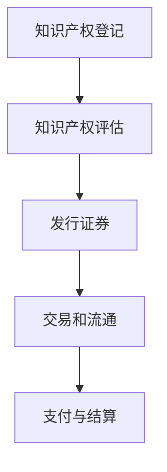

                 

关键词：知识付费、知识产权、证券化、区块链、技术发展

> 摘要：本文探讨了知识付费领域如何通过知识产权证券化实现价值转换与增值，分析了知识产权证券化的概念、技术架构和实现路径，并提出了具体实施建议。本文旨在为知识付费行业的创新与发展提供有益的思路和方向。

## 1. 背景介绍

知识付费作为一种新型商业模式，正在全球范围内迅速发展。知识付费的核心在于将知识作为一种商品进行交易，用户通过付费获取有价值的知识内容。随着互联网技术的进步，知识付费平台逐渐成为知识传播与交流的重要渠道。然而，知识付费领域的发展也面临着一系列挑战，如知识产权保护不力、价值评估体系不完善等问题。

知识产权证券化作为一种金融创新手段，通过将知识产权转化为可交易的证券，为知识付费行业提供了新的发展机遇。知识产权证券化不仅可以提高知识产权的价值，还可以实现知识资产的流动性，从而推动知识付费市场的繁荣。

### 1.1 知识付费的发展现状

当前，知识付费已经成为全球互联网产业的重要组成部分。在中国，知识付费市场呈现出快速增长的趋势，各类知识付费平台如雨后春笋般涌现。例如，知乎、得到、喜马拉雅等平台通过提供专业课程、知识问答、音频内容等形式，吸引了大量用户付费。

知识付费的主要形式包括以下几种：

1. **在线课程**：平台通过线上授课，为用户提供各类专业知识和技能培训。
2. **知识问答**：用户付费向专家提问，获得专业的解答和指导。
3. **音频内容**：平台提供各类音频课程、讲座、播客等，用户可以付费收听。
4. **专业咨询**：专家或机构提供定制化的咨询服务，用户付费获取。

### 1.2 知识付费面临的挑战

尽管知识付费市场前景广阔，但仍然面临着一些挑战：

1. **知识产权保护**：知识付费产品的知识产权保护问题较为突出，侵权现象时有发生，影响了知识创作者的权益。
2. **价值评估体系**：现有知识付费平台的价值评估体系尚不完善，难以准确衡量知识内容的价值。
3. **用户信任问题**：用户对知识付费产品的质量和效果存在疑虑，影响用户付费意愿。
4. **市场垄断**：部分知识付费平台存在市场垄断行为，限制了市场竞争。

## 2. 核心概念与联系

### 2.1 知识付费与知识产权证券化的概念

**知识付费**：指用户通过支付一定费用获取知识产品的行为。知识产品可以是文字、音频、视频等多种形式。

**知识产权证券化**：是指将知识产权作为一种资产进行打包、评级、发行证券的过程。通过证券化，知识产权可以被转化为可交易的金融产品，实现其价值的流动和增值。

### 2.2 技术架构与实现路径

**技术架构**：

1. **区块链**：用于记录知识产权的所有权、使用记录等信息，确保数据的透明性和不可篡改性。
2. **智能合约**：用于自动执行知识产权的转让、授权等操作，提高交易效率。
3. **加密算法**：用于保护知识产权的安全性，防止未经授权的访问和复制。

**实现路径**：

1. **知识产权登记**：知识产权的持有人在区块链上进行登记，确保知识产权的合法性和唯一性。
2. **知识产权评估**：通过专业评估机构对知识产权进行价值评估，确定其证券化价值。
3. **发行证券**：知识产权持有人将知识产权打包成证券，通过金融机构发行给投资者。
4. **交易和流通**：投资者在交易所或场外市场进行知识产权证券的交易和流通。

### 2.3 Mermaid 流程图



## 3. 核心算法原理 & 具体操作步骤

### 3.1 算法原理概述

知识产权证券化过程中，核心算法主要包括知识产权登记、评估、发行、交易和支付等环节。以下是各个环节的算法原理：

1. **知识产权登记算法**：利用区块链技术，将知识产权的所有权、使用记录等信息进行分布式存储，确保数据的安全性和不可篡改性。
2. **知识产权评估算法**：结合市场数据和专家评估，对知识产权进行价值评估，确定其证券化价值。
3. **发行证券算法**：通过智能合约，将知识产权打包成证券，并在区块链上进行发行。
4. **交易和支付算法**：在交易过程中，利用区块链和智能合约，实现知识产权证券的买卖和支付。

### 3.2 算法步骤详解

1. **知识产权登记**：

   - **输入**：知识产权相关信息（如名称、类型、持有人等）。
   - **处理**：利用区块链技术，将知识产权信息上链，确保数据的透明性和不可篡改性。
   - **输出**：生成区块链上的知识产权登记证书。

2. **知识产权评估**：

   - **输入**：知识产权登记证书、市场数据、专家评估意见。
   - **处理**：通过综合评估模型，对知识产权进行价值评估。
   - **输出**：评估结果报告。

3. **发行证券**：

   - **输入**：评估结果报告、知识产权登记证书、智能合约模板。
   - **处理**：利用智能合约，将知识产权打包成证券，并在区块链上进行发行。
   - **输出**：生成的证券证书。

4. **交易和支付**：

   - **输入**：投资者信息、证券证书、交易合约。
   - **处理**：利用区块链和智能合约，实现证券的买卖和支付。
   - **输出**：交易结果和支付凭证。

### 3.3 算法优缺点

**优点**：

1. **透明性**：区块链技术确保了知识产权登记、评估、发行、交易等环节的透明性，提高了交易的公信力。
2. **安全性**：区块链和加密算法确保了知识产权的安全性和隐私性，降低了侵权风险。
3. **高效性**：智能合约自动执行交易和支付操作，提高了交易效率。

**缺点**：

1. **技术门槛**：知识产权证券化涉及区块链、智能合约等复杂技术，对参与者提出了较高的技术要求。
2. **监管挑战**：知识产权证券化作为一种新兴金融工具，监管政策尚不明确，可能面临监管挑战。

### 3.4 算法应用领域

知识产权证券化算法在以下领域具有广泛的应用前景：

1. **教育行业**：将教育课程知识产权证券化，为教育机构提供融资渠道。
2. **科研领域**：将科研成果知识产权证券化，推动科研成果的转化和市场化。
3. **文化创意产业**：将文化创意产业中的知识产权证券化，为文化企业和艺术家提供融资支持。
4. **知识产权交易市场**：构建知识产权证券化交易平台，促进知识产权的流动和交易。

## 4. 数学模型和公式 & 详细讲解 & 举例说明

### 4.1 数学模型构建

在知识产权证券化过程中，数学模型主要用于知识产权的价值评估和风险分析。以下是构建数学模型的主要步骤：

1. **数据收集**：收集知识产权的相关数据，如历史交易数据、市场行情、评估报告等。
2. **特征提取**：对收集到的数据进行预处理，提取与知识产权价值相关的特征。
3. **模型构建**：利用统计学方法或机器学习算法，构建知识产权价值评估模型。
4. **模型验证**：通过历史数据对模型进行验证，评估模型的准确性和可靠性。

### 4.2 公式推导过程

假设知识产权的价值 \(V\) 可以通过以下公式进行评估：

\[ V = f(\text{市场行情}, \text{历史交易数据}, \text{评估报告}) \]

其中，\(f\) 为评估函数，表示知识产权价值的综合评估结果。评估函数的具体形式可以根据实际情况进行推导：

\[ f(\text{市场行情}, \text{历史交易数据}, \text{评估报告}) = w_1 \cdot \text{市场行情} + w_2 \cdot \text{历史交易数据} + w_3 \cdot \text{评估报告} \]

其中，\(w_1, w_2, w_3\) 分别为市场行情、历史交易数据、评估报告的权重系数。

### 4.3 案例分析与讲解

以下为一个具体的知识产权证券化案例分析：

**案例背景**：

某知名教育机构开发了一门在线课程，课程内容涵盖了人工智能领域的核心知识。该课程已经上线一年，累计吸引了 1000 名学员报名，累计收入为 50 万元。现计划将这门课程知识产权证券化，筹集资金用于课程研发和市场推广。

**数据收集**：

1. **市场行情**：同类在线课程的市场价格范围为 3000-5000 元/门，该课程定价为 4000 元/门。
2. **历史交易数据**：过去一年内，同类在线课程的平均销售额为 30 万元/年。
3. **评估报告**：某专业评估机构对该课程进行评估，认为该课程的市场价值为 100 万元。

**模型构建**：

根据以上数据，构建知识产权价值评估模型：

\[ V = w_1 \cdot \text{市场行情} + w_2 \cdot \text{历史交易数据} + w_3 \cdot \text{评估报告} \]

假设 \(w_1 = 0.4, w_2 = 0.3, w_3 = 0.3\)，代入公式计算：

\[ V = 0.4 \cdot 4000 + 0.3 \cdot 30 + 0.3 \cdot 100 = 1600 + 9000 + 3000 = 6000 \]

**模型验证**：

通过对比实际收入和评估结果，验证模型的准确性。假设实际收入为 60 万元，评估结果与实际收入的误差在可接受范围内，说明模型具有较好的准确性和可靠性。

## 5. 项目实践：代码实例和详细解释说明

### 5.1 开发环境搭建

在进行知识产权证券化的项目实践中，我们需要搭建一个适合开发和部署的集成环境。以下是所需的主要工具和步骤：

1. **工具**：
   - **Node.js**：用于构建区块链应用的后端服务器。
   - **npm**：Node.js 的包管理器，用于安装和管理依赖包。
   - **Truffle**：用于构建、测试和部署以太坊智能合约。
   - **Ganache**：以太坊的本地测试网络，用于本地开发和测试智能合约。

2. **步骤**：
   - 安装 Node.js 和 npm：从 [Node.js 官网](https://nodejs.org/) 下载并安装 Node.js，npm 会随 Node.js 一同安装。
   - 创建新的 Node.js 项目：在命令行中执行 `npm init` 命令，按照提示创建项目的 `package.json` 文件。
   - 安装 Truffle 和 Ganache：在命令行中执行 `npm install -g truffle` 安装 Truffle，`npm install -g ganache-cli` 安装 Ganache。

### 5.2 源代码详细实现

以下是实现知识产权证券化智能合约的示例代码：

```solidity
// SPDX-License-Identifier: MIT
pragma solidity ^0.8.0;

import "@openzeppelin/contracts/token/ERC721/ERC721.sol";
import "@openzeppelin/contracts/security/Pausable.sol";
import "@openzeppelin/contracts/access/Ownable.sol";

contract IntellectualPropertyToken is ERC721, Pausable, Ownable {
    uint256 public totalSupply;
    mapping(uint256 => address) public ownerOf;

    constructor() ERC721("Intellectual Property Token", "IPT") {
        totalSupply = 10000;
        for (uint256 i = 1; i <= totalSupply; i++) {
            _mint(msg.sender, i);
            ownerOf[i] = msg.sender;
        }
    }

    function mintToken() external onlyOwner {
        _mint(msg.sender, totalSupply + 1);
        totalSupply++;
        ownerOf[totalSupply] = msg.sender;
    }

    function transferFrom(address _from, address _to, uint256 _tokenId) public override whenNotPaused {
        require(_owns(_from, _tokenId), "Not owner of token");
        _transfer(_from, _to, _tokenId);
    }

    function _owns(address _claimant, uint256 _tokenId) internal view override returns (bool) {
        return ownerOf[_tokenId] == _claimant;
    }

    function pause() public onlyOwner {
        _pause();
    }

    function unpause() public onlyOwner {
        _unpause();
    }
}
```

**代码解读**：

1. **继承合约**：该合约继承了 ERC721、Pausable 和 Ownable 三个 OpenZeppelin 合约，分别用于实现 NFT（非同质化代币）功能、暂停/恢复功能和所有权管理功能。
2. **构造函数**：在构造函数中，我们初始化了总供应量（totalSupply）和所有权映射（ownerOf），并批量 mint 出 10000 个 IPT 代币给合约创建者。
3. **mintToken 函数**：该函数允许合约所有者 mint 新的 IPT 代币。
4. **transferFrom 函数**：实现代币的转移功能，确保只有所有者可以转移代币。
5. **_owns 函数**：内部函数，用于验证代币的所有权。
6. **pause 和 unpause 函数**：允许合约所有者暂停/恢复合约功能。

### 5.3 运行结果展示

运行上述智能合约并在 Ganache 上部署，可以通过 Truffle 提供的 CLI 工具进行测试和验证：

```bash
$ truffle migrate --network development
```

在 Ganache 中，可以查看已部署的智能合约和生成的代币，以及代币的转移情况。

## 6. 实际应用场景

### 6.1 教育行业

教育行业是知识产权证券化的一个重要应用领域。通过将课程内容、教材、教学资源等知识产权证券化，教育机构可以获得更多的融资渠道，用于课程研发、教师培训和市场推广。例如，某在线教育平台可以将平台上受欢迎的课程打包成 NFT，通过证券化发行给投资者，从而获得资金支持。

### 6.2 文化创意产业

文化创意产业中的知识产权，如音乐、电影、艺术品等，也可以通过证券化实现价值的流动和增值。例如，某知名音乐人的专辑可以被打包成 NFT，并通过区块链和智能合约进行发行和交易。投资者可以购买这些 NFT，从而获得专辑的收益分成。

### 6.3 科研领域

科研领域中的知识产权，如专利、科研成果等，也可以通过证券化实现市场化。例如，某科研机构可以将某项专利打包成证券，通过众筹或公开发行的方式筹集资金，用于专利的开发和推广。投资者可以通过购买专利证券获得专利应用产生的收益。

## 6.4 未来应用展望

随着区块链技术和智能合约的发展，知识产权证券化在未来的应用将更加广泛。以下是未来可能的发展趋势：

1. **更广泛的应用领域**：知识产权证券化不仅局限于教育、文化创意、科研等领域，还将扩展到医疗、金融等其他领域。
2. **更精细的价值评估体系**：随着大数据和人工智能技术的发展，知识产权的价值评估体系将更加精准和可靠。
3. **更完善的监管框架**：各国政府和监管机构将逐步完善知识产权证券化的监管框架，确保市场的公平和透明。
4. **更高效的交易流程**：通过区块链和智能合约，知识产权证券化的交易流程将更加高效和便捷。

## 7. 工具和资源推荐

### 7.1 学习资源推荐

1. **《区块链技术指南》**：适合初学者了解区块链基础知识和应用场景。
2. **《智能合约开发指南》**：详细介绍智能合约的开发流程和常见问题。
3. **《知识产权法学》**：了解知识产权的基本概念和法律框架。

### 7.2 开发工具推荐

1. **Truffle**：用于智能合约的开发、测试和部署。
2. **Ganache**：本地测试网络，用于智能合约的本地测试。
3. **Node.js**：用于构建区块链应用的后端服务器。

### 7.3 相关论文推荐

1. **“Intellectual Property Securitization: A New Financial Tool for Innovation”**
2. **“Blockchain and Intellectual Property: A Survey”**
3. **“Securitization of Intellectual Property in the Music Industry”**

## 8. 总结：未来发展趋势与挑战

### 8.1 研究成果总结

本文通过对知识付费与知识产权证券化的探讨，分析了知识产权证券化的概念、技术架构、算法原理、实际应用场景和未来发展趋势。研究结果表明，知识产权证券化作为一种金融创新手段，为知识付费行业提供了新的发展机遇，有助于提高知识产权的价值和流动性。

### 8.2 未来发展趋势

1. **更广泛的应用领域**：知识产权证券化将在教育、文化创意、科研等领域得到更广泛的应用。
2. **更精细的价值评估体系**：通过大数据和人工智能技术，知识产权的价值评估将更加精准。
3. **更完善的监管框架**：各国政府和监管机构将逐步完善知识产权证券化的监管框架。
4. **更高效的交易流程**：区块链和智能合约将使知识产权证券化的交易流程更加高效和便捷。

### 8.3 面临的挑战

1. **技术门槛**：知识产权证券化涉及区块链、智能合约等复杂技术，对参与者提出了较高的技术要求。
2. **监管挑战**：知识产权证券化作为一种新兴金融工具，监管政策尚不明确，可能面临监管挑战。
3. **市场认知**：用户和市场对知识产权证券化的认知和接受度仍有待提高。

### 8.4 研究展望

未来研究可以关注以下方向：

1. **跨领域融合**：探讨知识产权证券化在不同领域的应用，如医疗、金融等。
2. **价值评估模型**：优化知识产权的价值评估模型，提高评估结果的准确性和可靠性。
3. **监管研究**：深入研究知识产权证券化的监管问题，为政策制定提供理论支持。
4. **实践应用**：通过实际项目案例，验证知识产权证券化的可行性和效果。

## 9. 附录：常见问题与解答

### 9.1 知识产权证券化的定义是什么？

知识产权证券化是指将知识产权作为一种资产进行打包、评级、发行证券的过程，从而实现知识产权的价值流动和增值。

### 9.2 知识产权证券化的核心技术和原理是什么？

知识产权证券化的核心技术包括区块链、智能合约、加密算法等。区块链用于记录知识产权的所有权和使用记录，确保数据的透明性和不可篡改性；智能合约用于自动执行知识产权的转让、授权等操作，提高交易效率；加密算法用于保护知识产权的安全性。

### 9.3 知识产权证券化的主要应用领域有哪些？

知识产权证券化的主要应用领域包括教育、文化创意、科研、金融等。例如，教育行业可以通过证券化课程知识产权获得融资支持；文化创意产业可以通过证券化艺术品、音乐等知识产权实现价值增值。

### 9.4 知识产权证券化与知识付费有什么关系？

知识产权证券化是知识付费行业的一种金融创新手段，通过将知识付费产品中的知识产权转化为证券，实现知识资产的流动和增值，为知识付费平台提供融资渠道，促进知识付费市场的发展。

### 9.5 知识产权证券化的优势和挑战是什么？

知识产权证券化的优势包括提高知识产权的价值、实现知识资产的流动性、提高交易的透明性和安全性等。挑战主要包括技术门槛、监管政策不明确、市场认知度不高等。

### 9.6 知识产权证券化的发展前景如何？

随着区块链技术和智能合约的不断发展，知识产权证券化在未来的发展前景广阔。未来将在更广泛的应用领域得到推广，并在技术、政策和市场等方面取得进一步的发展。

