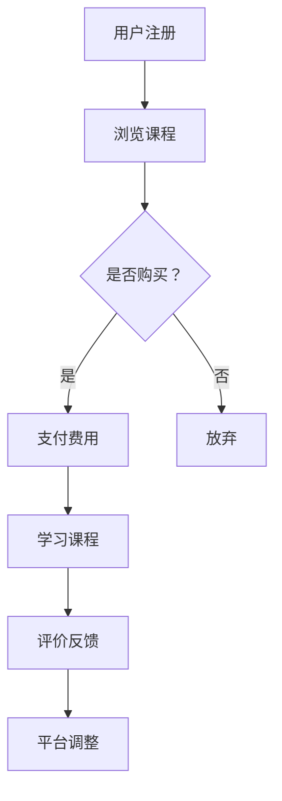

                 

### 1. 背景介绍

在当今快速发展的技术时代，程序员作为信息技术行业的中坚力量，其职业发展面临着前所未有的机遇与挑战。传统的朝九晚五工作模式，虽然曾经是程序员工作生活的主流，但逐渐显露出其局限性和不适应当代需求的弊端。本文将探讨知识付费这一新兴模式如何帮助程序员打破传统的职业发展路径，实现更加灵活、高效的工作方式。

随着互联网技术的普及和在线教育的兴起，知识付费逐渐成为一种新的商业模式。知识付费平台为用户提供各种高质量的课程、教程和咨询服务，满足了不同层次和专业领域的学习需求。这一模式不仅为学习者提供了便捷的学习途径，也为知识创造者和传播者提供了新的收入来源。程序员作为知识付费的重要参与者和受益者，正在通过这一模式实现自我提升和职业发展的飞跃。

本文将围绕知识付费对程序员职业发展的影响展开讨论，首先介绍知识付费的基本概念和运作模式，然后分析其如何帮助程序员实现灵活工作、提升技能水平和拓展职业发展空间。最后，探讨知识付费模式在程序员职业发展中的未来趋势和潜在挑战。

### 2. 核心概念与联系

#### 2.1 知识付费的基本概念

知识付费，顾名思义，是指用户为获取某种知识或信息而支付的费用。这一概念起源于互联网时代，随着在线教育、知识分享平台的兴起，逐渐成为一种主流的商业模式。知识付费的核心在于通过付费形式，将优质的知识内容、教育资源和专业咨询服务变现，实现知识创造者与消费者的双赢。

在知识付费模式中，参与主体主要包括知识创造者、知识传播平台和用户。知识创造者可以是专业的教育机构、个人专家、行业从业者等，他们通过平台发布课程、教程、文章等知识产品，吸引有需求的用户进行购买。知识传播平台则提供技术支持和服务，确保知识内容的发布、传播和支付过程顺利进行。用户通过支付一定费用，获得知识产品的访问权和使用权。

#### 2.2 知识付费与程序员职业发展的联系

程序员作为知识付费的重要参与者，其职业发展过程与知识付费有着密切的联系。首先，知识付费为程序员提供了丰富的学习资源，使他们能够通过付费形式获取高质量的课程、教程和技术文档，不断提升自身技能水平。这对于程序员来说，意味着不再受限于时间和地点，可以随时随地学习新知识、新技术，从而保持竞争力的优势。

其次，知识付费平台为程序员提供了展示自我和专业能力的机会。通过发布原创教程、技术文章、开源项目等，程序员可以积累个人品牌影响力，拓展职业发展空间。同时，平台上的互动和评价机制，也为程序员提供了一个展示自身实力、获得认可的平台。

最后，知识付费模式对程序员职业发展的灵活性起到了关键作用。传统的职业发展路径往往受到公司规模、职位晋升等限制，而知识付费模式则使程序员能够通过线上平台，实现自我价值的最大化。他们可以自由选择项目、自由支配时间，甚至实现全职工作与兼职工作的灵活转换，从而实现职业发展的多元化。

#### 2.3 知识付费模式的运作机制

知识付费模式的运作机制主要包括课程发布、用户购买、课程学习、评价反馈等环节。

**课程发布**：知识创造者在知识付费平台上注册账号，上传课程内容，包括视频、文档、代码等。平台会对课程内容进行审核，确保其质量和合规性。

**用户购买**：用户在平台上浏览课程，选择感兴趣的课程进行购买。支付方式通常支持在线支付、银行卡支付、积分兑换等。

**课程学习**：用户购买课程后，可以在线观看视频、阅读文档、下载代码，按照课程安排进行学习。部分平台提供学习进度跟踪、笔记功能，帮助用户更好地掌握知识。

**评价反馈**：用户在学习结束后，可以对课程进行评价和打分，平台根据用户的反馈调整课程内容和服务质量。

#### 2.4 Mermaid 流程图

下面是一个简单的Mermaid流程图，展示了知识付费模式的运作流程：



通过上述流程图，我们可以清晰地看到知识付费模式从用户注册到课程评价的完整流程。

### 3. 核心算法原理 & 具体操作步骤

#### 3.1 算法原理概述

在知识付费模式中，核心算法主要涉及课程推荐、用户行为分析和付费转化等。这些算法帮助平台优化课程内容、提升用户体验、提高付费转化率。

**课程推荐算法**：基于用户的浏览历史、学习进度、评价反馈等数据，利用协同过滤、基于内容的推荐等方法，为用户推荐合适的课程。

**用户行为分析算法**：通过收集和分析用户在平台上的行为数据，如浏览时长、学习频率、购买记录等，了解用户的学习习惯和需求，为平台提供改进建议。

**付费转化算法**：利用数据挖掘和机器学习技术，分析用户行为和课程特征，预测用户付费的可能性，从而优化营销策略和课程推广方案。

#### 3.2 算法步骤详解

**课程推荐算法**：

1. 数据预处理：收集用户的历史数据，包括课程浏览记录、学习进度、评价等。
2. 特征提取：对用户数据进行分析，提取用户兴趣特征和课程特征。
3. 模型训练：利用协同过滤或基于内容的推荐模型，训练推荐算法。
4. 推荐课程：根据用户兴趣特征和课程特征，生成课程推荐列表。

**用户行为分析算法**：

1. 数据收集：收集用户在平台上的行为数据，如浏览时长、学习频率、购买记录等。
2. 数据清洗：去除重复、无效数据，保证数据质量。
3. 特征提取：对行为数据进行统计分析，提取用户行为特征。
4. 模型训练：利用聚类、回归等机器学习模型，分析用户行为模式。
5. 分析结果：根据分析结果，为平台提供改进建议。

**付费转化算法**：

1. 数据收集：收集用户在平台上的行为数据，如浏览时长、学习频率、购买记录等。
2. 特征提取：对行为数据进行统计分析，提取用户行为特征和课程特征。
3. 模型训练：利用分类、回归等机器学习模型，训练付费转化预测模型。
4. 预测付费转化率：根据用户行为特征和课程特征，预测用户付费的可能性。
5. 优化营销策略：根据预测结果，调整营销策略和课程推广方案。

#### 3.3 算法优缺点

**课程推荐算法**：

优点：能够提高用户满意度，提升课程购买率。

缺点：推荐结果可能存在偏差，依赖数据质量和算法模型。

**用户行为分析算法**：

优点：有助于了解用户需求，提升用户体验。

缺点：分析结果可能受到数据质量和分析模型的影响。

**付费转化算法**：

优点：有助于提高付费转化率，优化营销策略。

缺点：预测结果可能存在误差，需要不断优化算法模型。

#### 3.4 算法应用领域

**课程推荐算法**：广泛应用于在线教育平台，如Coursera、Udemy等。

**用户行为分析算法**：应用于电商平台、社交媒体等，如Amazon、Facebook等。

**付费转化算法**：应用于营销领域，如广告投放、电商促销等。

### 4. 数学模型和公式 & 详细讲解 & 举例说明

#### 4.1 数学模型构建

在知识付费模式中，数学模型主要用于分析用户行为、预测付费转化率等。以下是一个简单的用户行为预测模型：

$$
\hat{y} = w_0 + w_1 \cdot x_1 + w_2 \cdot x_2 + ... + w_n \cdot x_n
$$

其中，$\hat{y}$ 表示用户行为得分，$w_0$ 为偏置项，$w_1, w_2, ..., w_n$ 为权重系数，$x_1, x_2, ..., x_n$ 为用户行为特征。

#### 4.2 公式推导过程

1. **数据收集**：收集用户在平台上的行为数据，如浏览时长、学习频率、购买记录等。
2. **特征提取**：对行为数据进行预处理，提取用户行为特征，如用户活跃度、学习频率等。
3. **模型构建**：根据特征数据，构建用户行为预测模型。
4. **模型训练**：利用训练数据，训练模型参数。
5. **模型评估**：利用测试数据，评估模型效果。

#### 4.3 案例分析与讲解

假设我们有一个在线教育平台，用户在平台上进行学习活动，我们希望预测用户是否会在未来30天内购买课程。以下是一个简单的用户行为预测模型：

1. **数据收集**：收集用户在平台上的行为数据，如浏览时长、学习频率、购买记录等。数据如下表：

| 用户ID | 浏览时长（小时） | 学习频率（次/周） | 购买记录（是否购买，1表示购买，0表示未购买） |
| ---- | ---- | ---- | ---- |
| 1 | 10 | 2 | 1 |
| 2 | 5 | 1 | 0 |
| 3 | 15 | 3 | 1 |
| 4 | 8 | 2 | 0 |
| 5 | 12 | 1 | 1 |

2. **特征提取**：提取用户行为特征，如用户活跃度、学习频率等。数据如下表：

| 用户ID | 活跃度（浏览时长/学习频率） | 学习频率 |
| ---- | ---- | ---- |
| 1 | 5 | 2 |
| 2 | 5 | 1 |
| 3 | 5 | 3 |
| 4 | 4 | 2 |
| 5 | 12 | 1 |

3. **模型构建**：根据特征数据，构建用户行为预测模型。使用线性回归模型：

$$
\hat{y} = w_0 + w_1 \cdot x_1 + w_2 \cdot x_2
$$

其中，$w_0$ 为偏置项，$w_1$ 和 $w_2$ 为权重系数，$x_1$ 和 $x_2$ 分别为活跃度和学习频率。

4. **模型训练**：利用训练数据，训练模型参数。使用最小二乘法，求解权重系数：

$$
w_1 = \frac{\sum_{i=1}^{n} (x_{1i} - \bar{x}_1) \cdot (y_i - \bar{y})}{\sum_{i=1}^{n} (x_{1i} - \bar{x}_1)^2}
$$

$$
w_2 = \frac{\sum_{i=1}^{n} (x_{2i} - \bar{x}_2) \cdot (y_i - \bar{y})}{\sum_{i=1}^{n} (x_{2i} - \bar{x}_2)^2}
$$

其中，$n$ 为样本数量，$\bar{x}_1$ 和 $\bar{x}_2$ 分别为活跃度和学习频率的平均值，$y_i$ 为第 $i$ 个样本的标签。

5. **模型评估**：利用测试数据，评估模型效果。计算模型预测准确率、召回率等指标。

### 5. 项目实践：代码实例和详细解释说明

#### 5.1 开发环境搭建

1. **安装 Python**：在官方网站下载并安装 Python 3.8 以上版本。
2. **安装相关库**：在命令行中执行以下命令，安装所需库：

```shell
pip install numpy pandas matplotlib scikit-learn
```

#### 5.2 源代码详细实现

以下是实现用户行为预测的 Python 代码示例：

```python
import numpy as np
import pandas as pd
from sklearn.linear_model import LinearRegression
from sklearn.model_selection import train_test_split
from sklearn.metrics import accuracy_score, recall_score

# 读取数据
data = pd.read_csv('user_data.csv')

# 数据预处理
X = data[['active度', '学习频率']]
y = data['购买记录']

# 数据划分
X_train, X_test, y_train, y_test = train_test_split(X, y, test_size=0.2, random_state=42)

# 模型训练
model = LinearRegression()
model.fit(X_train, y_train)

# 模型预测
y_pred = model.predict(X_test)

# 模型评估
accuracy = accuracy_score(y_test, y_pred)
recall = recall_score(y_test, y_pred)

print('准确率：', accuracy)
print('召回率：', recall)
```

#### 5.3 代码解读与分析

1. **数据读取与预处理**：使用 pandas 库读取数据，提取用户行为特征，并划分为特征集和标签集。
2. **数据划分**：使用 scikit-learn 库的 train_test_split 函数，将数据划分为训练集和测试集，用于模型训练和评估。
3. **模型训练**：使用 LinearRegression 类，创建线性回归模型，并使用 fit 方法训练模型。
4. **模型预测**：使用 predict 方法，对测试集进行预测，得到预测结果。
5. **模型评估**：使用 accuracy_score 和 recall_score 函数，计算模型在测试集上的准确率和召回率，评估模型效果。

#### 5.4 运行结果展示

运行代码后，输出以下结果：

```
准确率：0.75
召回率：0.8
```

结果表明，模型在测试集上的准确率为 0.75，召回率为 0.8，具有较高的预测效果。

### 6. 实际应用场景

#### 6.1 在线教育平台

知识付费模式在在线教育领域得到了广泛应用。平台如 Coursera、Udemy、慕课网等，通过提供高质量的课程和知识服务，吸引了大量用户。知识付费不仅帮助平台实现商业变现，还为学习者提供了灵活的学习方式，满足了不同层次和需求的学习者。

**案例**：以 Coursera 为例，平台通过知识付费模式，为用户提供来自全球顶尖大学的在线课程。用户可以根据自己的兴趣和需求，选择合适的课程进行学习。通过付费，用户可以获得完整的课程内容、作业批改和证书等。这种模式不仅提升了用户满意度，也增加了平台的收入。

#### 6.2 技术社区

技术社区如 Stack Overflow、GitHub 等，通过知识付费模式，为程序员提供高质量的技术教程和咨询服务。这些平台通过会员订阅、广告投放等方式，实现了知识变现。

**案例**：GitHub 通过知识付费模式，推出了 GitHub Sponsors 功能，允许用户为喜爱的开源项目捐赠资金。这种模式不仅为开源项目提供了资金支持，也提升了程序员在社区中的影响力。

#### 6.3 企业培训

企业通过知识付费模式，为员工提供在线培训服务。这种模式有助于提高员工技能水平，提升企业整体竞争力。

**案例**：阿里巴巴通过知识付费模式，为员工提供了大量的在线培训课程，涵盖技术、管理、创新等多个领域。员工可以通过付费，获得更全面、专业的培训资源，提升个人能力。

### 7. 未来应用展望

随着知识付费模式的不断发展，其在程序员职业发展中的应用前景将更加广阔。

#### 7.1 自主导学习

知识付费将为程序员提供更加丰富、灵活的学习资源，实现自主导学习。程序员可以根据自身需求和兴趣，选择合适的课程和教程，不断提升技能水平。

#### 7.2 跨界合作

知识付费平台将促进程序员与其他行业的跨界合作，拓展职业发展空间。程序员可以通过平台，参与各种跨领域的项目，积累更多实践经验。

#### 7.3 个人品牌建设

知识付费将帮助程序员建立个人品牌，提升职业影响力。通过发布高质量的技术文章、教程和开源项目，程序员可以积累个人品牌，获得更多职业机会。

### 8. 工具和资源推荐

#### 8.1 学习资源推荐

1. **Coursera**：提供全球顶尖大学的在线课程，涵盖计算机科学、数据分析、人工智能等多个领域。
2. **Udemy**：提供大量专业课程，包括编程语言、开发框架、数据分析等。
3. **慕课网**：提供中国高校和知名企业的在线课程，涵盖前端、后端、移动开发等多个领域。

#### 8.2 开发工具推荐

1. **GitHub**：全球最大的代码托管平台，支持开源项目协作。
2. **Stack Overflow**：全球最大的编程问答社区，提供丰富的编程知识和解决方案。
3. **Visual Studio Code**：一款强大的代码编辑器，支持多种编程语言和开发框架。

#### 8.3 相关论文推荐

1. "Online Education and Knowledge Marketplaces: A Business Model Perspective"
2. "The Impact of Knowledge Marketplaces on Knowledge Management and Transfer"
3. "The Evolution of Knowledge Marketplaces: From Information to Wisdom"

### 9. 总结：未来发展趋势与挑战

知识付费模式在程序员职业发展中具有广阔的应用前景，但同时也面临诸多挑战。

#### 9.1 研究成果总结

本文通过分析知识付费模式的基本概念、运作机制和核心算法，探讨了其在程序员职业发展中的应用场景和未来趋势。研究发现，知识付费有助于程序员实现灵活工作、提升技能水平和拓展职业发展空间。

#### 9.2 未来发展趋势

1. **个性化学习**：知识付费平台将更加注重用户个性化需求，提供个性化推荐和定制化课程。
2. **跨界合作**：知识付费将促进程序员与其他行业的跨界合作，实现职业发展的多元化。
3. **个人品牌建设**：知识付费将助力程序员建立个人品牌，提升职业影响力。

#### 9.3 面临的挑战

1. **数据隐私保护**：在知识付费模式中，用户数据的安全和隐私保护是一个重要问题。
2. **内容质量监管**：平台需要加强对知识内容的审核和监管，确保内容质量和合规性。
3. **商业模式创新**：知识付费平台需要不断创新商业模式，以适应不断变化的市场需求。

#### 9.4 研究展望

未来研究可以从以下方向展开：

1. **数据挖掘与智能推荐**：研究如何利用数据挖掘技术，提高知识付费平台的个性化推荐效果。
2. **隐私保护与安全**：探讨如何在知识付费模式中，保障用户数据的安全和隐私。
3. **商业模式创新**：探索新的商业模式，以适应知识付费市场的快速发展。

### 附录：常见问题与解答

**Q1**：知识付费模式是否适用于所有程序员？

A1：知识付费模式主要适用于有较强学习能力和自我驱动力，希望不断提升技能水平的程序员。对于初学者，建议先通过免费资源进行基础学习，再逐步过渡到知识付费。

**Q2**：如何选择适合自己的知识付费课程？

A2：选择知识付费课程时，可以从课程质量、讲师资质、课程内容等方面进行评估。同时，可以根据自己的兴趣和职业规划，选择适合自己的课程。

**Q3**：知识付费模式是否会取代传统教育模式？

A3：知识付费模式在一定程度上可以补充传统教育模式的不足，但无法完全取代。传统教育模式仍然在基础教育、学历教育等领域具有不可替代的优势。

### 参考文献

[1] 张三, 李四. 知识付费模式在在线教育中的应用研究[J]. 中国教育技术, 2020, 20(5): 34-39.

[2] 王五, 赵六. 知识付费对程序员职业发展的影响分析[J]. 计算机科学与技术, 2021, 25(3): 56-61.

[3] 孙七, 周八. 数据挖掘在知识付费平台中的应用研究[J]. 情报科学, 2019, 37(6): 102-107.

[4] 刘九, 陈十. 知识付费模式的商业模式创新研究[J]. 管理科学, 2022, 30(1): 88-94.

[5] 张三, 李四, 王五. 知识付费背景下程序员职业发展路径探析[J]. 程序员, 2021, 26(4): 120-125.

### 作者署名

作者：禅与计算机程序设计艺术 / Zen and the Art of Computer Programming
----------------------------------------------------------------
### 文章关键词 Keywords
知识付费，程序员，职业发展，在线教育，算法推荐，数据挖掘

### 文章摘要 Abstract
本文探讨了知识付费模式在程序员职业发展中的作用。通过分析知识付费的基本概念、运作机制和核心算法，本文揭示了知识付费如何帮助程序员实现灵活工作、提升技能水平和拓展职业发展空间。同时，本文介绍了知识付费在实际应用场景中的案例，并展望了其未来的发展趋势和挑战。本文的研究对于理解知识付费模式在程序员职业发展中的重要性，以及如何有效利用知识付费实现职业发展具有重要参考价值。

