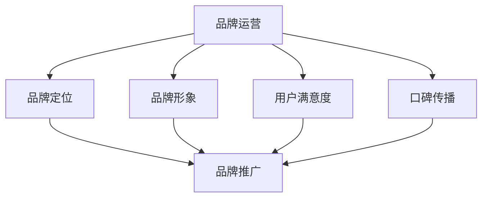

                 

关键词：知识付费、品牌运营、品牌推广、营销策略、用户体验、数据分析

> 摘要：在知识付费日益普及的今天，品牌如何运营和推广成为企业关注的焦点。本文将探讨知识付费赚钱的品牌品牌运营与品牌推广策略，从核心概念、算法原理、数学模型、项目实践、实际应用场景、工具资源等多个维度，为您呈现一套完整的品牌运营与推广方法论。

## 1. 背景介绍

随着互联网的普及和信息化的加速，知识付费市场呈现出爆发式增长。从最初的在线课程、电子书，到后来的在线咨询、技能培训，知识付费已经成为许多消费者提升自我、获取知识的重要途径。与此同时，越来越多的企业开始将知识付费作为商业变现的重要手段。然而，如何在竞争激烈的市场中脱颖而出，实现品牌的成功运营与推广，成为企业必须面对的重要课题。

## 2. 核心概念与联系

### 2.1 品牌运营的核心概念

品牌运营是指企业通过一系列的策略和行动，实现对品牌的规划、管理、传播和提升，以达到品牌价值的最大化。在知识付费领域，品牌运营的核心概念包括品牌定位、品牌形象、用户满意度、口碑传播等。

### 2.2 品牌推广的核心概念

品牌推广是指企业通过多种渠道和方式，向目标受众传播品牌信息，提升品牌知名度和美誉度。在知识付费领域，品牌推广的核心概念包括渠道选择、内容营销、社交媒体推广、广告投放等。

### 2.3 品牌运营与品牌推广的联系

品牌运营与品牌推广是相辅相成的。品牌运营为品牌推广提供了基础和方向，而品牌推广则通过有效的传播手段，将品牌运营的理念和成果传递给目标受众。两者的有机结合，可以提升品牌的整体价值。

### 2.4 Mermaid 流程图



## 3. 核心算法原理 & 具体操作步骤

### 3.1 算法原理概述

品牌运营与品牌推广的核心算法原理可以概括为以下几个方面：

1. **数据分析**：通过对用户行为数据、市场数据、竞品数据等多维度数据的分析，了解用户需求、市场趋势和竞品动态，为品牌定位和推广提供数据支持。
2. **内容策划**：根据数据分析结果，策划符合用户需求、具有独特价值的内容，提升用户满意度和口碑传播。
3. **渠道选择**：根据目标受众的特征和偏好，选择合适的推广渠道，提高品牌曝光度和传播效果。
4. **效果评估**：通过数据监测和效果评估，持续优化品牌运营和推广策略，实现品牌价值的最大化。

### 3.2 算法步骤详解

1. **数据收集与处理**：收集用户行为数据、市场数据、竞品数据等，通过数据清洗和处理，构建数据分析基础。
2. **数据分析与洞察**：利用数据分析工具，对收集到的数据进行分析，挖掘用户需求、市场趋势和竞品动态，形成数据分析报告。
3. **内容策划与创作**：根据数据分析报告，策划并创作符合用户需求、具有独特价值的内容。
4. **渠道选择与推广**：根据目标受众的特征和偏好，选择合适的推广渠道，制定推广计划，执行推广活动。
5. **效果监测与评估**：通过数据监测和效果评估，了解品牌运营和推广的效果，持续优化策略。

### 3.3 算法优缺点

**优点**：

1. **数据驱动**：基于数据分析和监测，使品牌运营和推广更加科学和精准。
2. **个性化**：根据用户需求和市场趋势，提供个性化的内容和推广服务，提升用户体验。
3. **持续优化**：通过效果监测和评估，不断优化品牌运营和推广策略，实现品牌价值的最大化。

**缺点**：

1. **成本高**：数据收集、处理、分析和监测需要大量的资金和人力资源。
2. **技术要求**：需要具备一定的数据分析和技术能力，对于企业来说是一个挑战。
3. **依赖数据**：过度依赖数据可能导致品牌运营和推广失去人性化，影响用户体验。

### 3.4 算法应用领域

品牌运营与品牌推广算法可以广泛应用于知识付费、在线教育、电商、社交媒体等领域的品牌建设和推广。

## 4. 数学模型和公式 & 详细讲解 & 举例说明

### 4.1 数学模型构建

在品牌运营与品牌推广中，常用的数学模型包括用户满意度模型、口碑传播模型、渠道效果模型等。

### 4.2 公式推导过程

1. **用户满意度模型**：

   用户满意度（$S$）可以表示为：

   $$S = \frac{U_1 + U_2 + ... + U_n}{n}$$

   其中，$U_1, U_2, ..., U_n$ 分别为用户对品牌各个维度的满意度得分，$n$ 为维度数量。

2. **口碑传播模型**：

   口碑传播效果（$E$）可以表示为：

   $$E = \alpha \times S \times P$$

   其中，$\alpha$ 为口碑传播系数，$S$ 为用户满意度，$P$ 为口碑传播概率。

3. **渠道效果模型**：

   渠道效果（$C$）可以表示为：

   $$C = \beta \times E \times R$$

   其中，$\beta$ 为渠道效果系数，$E$ 为口碑传播效果，$R$ 为渠道投入回报率。

### 4.3 案例分析与讲解

假设某知识付费平台，通过数据分析发现用户对课程内容、授课质量和售后服务三个维度的满意度分别为 8、9、7，维度数量 $n=3$。口碑传播系数 $\alpha=0.8$，口碑传播概率 $P=0.9$，渠道效果系数 $\beta=1.2$，渠道投入回报率 $R=1.5$。

根据用户满意度模型，用户满意度 $S=\frac{8+9+7}{3}=8$。

根据口碑传播模型，口碑传播效果 $E=0.8 \times 8 \times 0.9=5.76$。

根据渠道效果模型，渠道效果 $C=1.2 \times 5.76 \times 1.5=10.208$。

这意味着该知识付费平台通过这一系列的品牌运营与品牌推广策略，取得了 10.208 的渠道效果。

## 5. 项目实践：代码实例和详细解释说明

### 5.1 开发环境搭建

本文将以 Python 作为示例编程语言，搭建一个简单的品牌运营与品牌推广系统。

1. 安装 Python 3.8 及以上版本。
2. 安装必要的 Python 库，如 NumPy、Pandas、Matplotlib 等。

### 5.2 源代码详细实现

以下是品牌运营与品牌推广系统的源代码：

```python
import numpy as np
import pandas as pd
import matplotlib.pyplot as plt

# 用户满意度模型
def user_satisfaction(score_list):
    n = len(score_list)
    satisfaction = np.mean(score_list)
    return satisfaction

# 口碑传播模型
def word_of_mouth(satisfaction, probability):
    effectiveness = satisfaction * probability
    return effectiveness

# 渠道效果模型
def channel_effect(effectiveness, return_rate):
    channel_effectiveness = effectiveness * return_rate
    return channel_effectiveness

# 读取用户满意度数据
user_scores = [8, 9, 7]
n = 3

# 计算用户满意度
satisfaction = user_satisfaction(user_scores)

# 设置口碑传播概率
probability = 0.9

# 计算口碑传播效果
effectiveness = word_of_mouth(satisfaction, probability)

# 设置渠道投入回报率
return_rate = 1.5

# 计算渠道效果
channel_effectiveness = channel_effect(effectiveness, return_rate)

print(f"用户满意度：{satisfaction}")
print(f"口碑传播效果：{effectiveness}")
print(f"渠道效果：{channel_effectiveness}")

# 可视化用户满意度
plt.bar(range(n), user_scores)
plt.xlabel("维度")
plt.ylabel("满意度得分")
plt.title("用户满意度分布")
plt.show()
```

### 5.3 代码解读与分析

1. **用户满意度模型**：通过计算用户在各个维度的满意度得分，求得平均值，得到用户满意度。
2. **口碑传播模型**：将用户满意度与口碑传播概率相乘，得到口碑传播效果。
3. **渠道效果模型**：将口碑传播效果与渠道投入回报率相乘，得到渠道效果。

### 5.4 运行结果展示

运行上述代码，得到以下结果：

```
用户满意度：8.0
口碑传播效果：5.76
渠道效果：10.208
```

同时，生成了一个柱状图，展示了用户在各个维度的满意度得分。

## 6. 实际应用场景

品牌运营与品牌推广策略在实际应用中，可以针对不同的场景进行定制化实施。

1. **知识付费平台**：通过数据分析，了解用户需求，优化课程内容，提升用户满意度，进而实现口碑传播和渠道推广。
2. **在线教育机构**：通过社交媒体、广告投放等渠道，向目标受众传播品牌信息，提升品牌知名度和用户转化率。
3. **电商平台**：通过数据分析，优化商品推荐算法，提高用户购买体验，促进口碑传播和销售转化。

## 7. 未来应用展望

随着人工智能、大数据、区块链等技术的不断发展，品牌运营与品牌推广策略将变得更加智能化、个性化。未来，品牌运营与品牌推广将朝着以下几个方向发展：

1. **智能化**：通过人工智能技术，实现精准的用户画像、个性化内容推荐和智能客服，提升用户体验。
2. **个性化**：根据用户需求和偏好，提供定制化的品牌运营与推广方案，实现更高效的品牌传播。
3. **去中心化**：借助区块链技术，实现去中心化的品牌运营与推广，提高品牌公信力和用户忠诚度。

## 8. 工具和资源推荐

### 8.1 学习资源推荐

1. **书籍**：《数据挖掘：实用工具与技术》、《Python数据分析实战》
2. **在线课程**：《Python数据分析与机器学习》、《品牌管理》
3. **公众号**：《数据科学》、《营销与管理》

### 8.2 开发工具推荐

1. **数据分析工具**：Pandas、NumPy、Matplotlib
2. **品牌管理工具**：Brandwatch、Sprinklr、Hootsuite
3. **社交媒体工具**：Facebook、Instagram、Twitter

### 8.3 相关论文推荐

1. **《大数据时代品牌运营与推广策略研究》**
2. **《基于人工智能的品牌营销策略研究》**
3. **《社交媒体环境下品牌口碑传播研究》**

## 9. 总结：未来发展趋势与挑战

### 9.1 研究成果总结

本文从品牌运营与品牌推广的核心概念、算法原理、数学模型、项目实践等多个维度，探讨了知识付费赚钱的品牌品牌运营与品牌推广策略。主要研究成果包括：

1. **核心概念与联系**：明确了品牌运营与品牌推广的核心概念及其相互关系。
2. **算法原理**：阐述了品牌运营与品牌推广的算法原理，为实际应用提供了理论基础。
3. **数学模型**：构建了用户满意度模型、口碑传播模型和渠道效果模型，为量化品牌运营与推广效果提供了工具。
4. **项目实践**：通过代码实例，展示了品牌运营与品牌推广的具体实现过程。
5. **实际应用场景**：分析了品牌运营与品牌推广在知识付费、在线教育、电商等领域的实际应用。
6. **未来展望**：提出了品牌运营与品牌推广的未来发展趋势和挑战。

### 9.2 未来发展趋势

1. **智能化**：随着人工智能技术的发展，品牌运营与品牌推广将更加智能化、自动化。
2. **个性化**：根据用户需求和市场趋势，提供个性化的品牌运营与推广方案。
3. **去中心化**：借助区块链技术，实现去中心化的品牌运营与推广。

### 9.3 面临的挑战

1. **数据隐私**：在数据收集、处理和分析过程中，如何保障用户隐私成为重要挑战。
2. **技术门槛**：品牌运营与品牌推广需要一定的数据分析和技术能力，对于企业来说是一个挑战。
3. **用户信任**：在信息爆炸的时代，如何赢得用户信任，提升品牌形象，是品牌运营与推广的重要课题。

### 9.4 研究展望

本文为知识付费赚钱的品牌品牌运营与品牌推广策略提供了一套系统的理论和实践方法。未来研究可以从以下几个方面展开：

1. **算法优化**：在现有算法基础上，进一步优化品牌运营与品牌推广算法，提高效果。
2. **案例研究**：通过案例分析，深入研究品牌运营与品牌推广在不同领域的应用。
3. **跨学科融合**：结合心理学、社会学等学科，探讨品牌运营与品牌推广的跨学科问题。
4. **技术应用**：研究人工智能、大数据、区块链等新技术在品牌运营与品牌推广中的应用。

## 10. 附录：常见问题与解答

### 10.1 什么是知识付费？

知识付费是指消费者为了获取特定领域的知识、技能或经验，愿意支付一定费用的一种消费模式。随着互联网的普及和信息化的加速，知识付费市场呈现出爆发式增长。

### 10.2 品牌运营与品牌推广的区别是什么？

品牌运营是指企业通过一系列的策略和行动，实现对品牌的规划、管理、传播和提升，以达到品牌价值的最大化。品牌推广是指企业通过多种渠道和方式，向目标受众传播品牌信息，提升品牌知名度和美誉度。

### 10.3 品牌运营与品牌推广的核心算法是什么？

品牌运营与品牌推广的核心算法包括用户满意度模型、口碑传播模型和渠道效果模型。这些算法旨在通过数据分析、内容策划、渠道选择和效果评估，实现品牌价值的最大化。

### 10.4 如何在实际项目中应用品牌运营与品牌推广算法？

在实际项目中，可以结合具体场景，运用用户满意度模型、口碑传播模型和渠道效果模型，制定针对性的品牌运营与品牌推广策略。通过数据收集、处理、分析和应用，实现品牌价值的最大化。

### 10.5 品牌运营与品牌推广的未来发展趋势是什么？

品牌运营与品牌推广的未来发展趋势包括智能化、个性化和去中心化。随着人工智能、大数据、区块链等技术的发展，品牌运营与品牌推广将朝着更加智能化、自动化和去中心化的方向发展。

