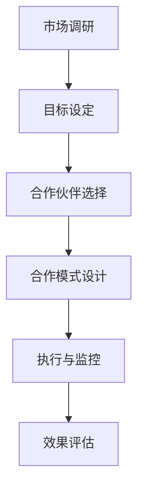

                 

 **关键词：**
- 知识付费
- 品牌联合推广
- 异业合作
- 营销策略
- 商业模式

**摘要：**
本文将深入探讨知识付费领域的品牌联合推广与异业合作的策略。我们将通过分析当前的市场状况、潜在的合作方式、成功的案例以及所需的资源和条件，为您揭示如何在这个竞争激烈的市场中实现盈利和增长。

## 1. 背景介绍

### 知识付费的兴起

随着互联网的普及和信息获取渠道的多样化，人们对于知识的获取方式也在发生改变。传统的知识获取方式，如课堂教育、图书购买等，正在被知识付费所替代。知识付费是指用户通过付费方式获取专业知识和技能的过程。这种模式不仅满足了用户对于知识的个性化需求，也为内容提供者带来了新的收入来源。

### 市场规模与增长潜力

根据市场研究报告，知识付费市场正以惊人的速度增长。随着人们对自我提升和职业发展的需求不断增加，知识付费市场预计将在未来几年内继续扩大。这一趋势为品牌联合推广与异业合作提供了广阔的机遇。

### 竞争环境与挑战

然而，知识付费市场的竞争也非常激烈。众多平台和内容提供者争夺用户的注意力和时间。为了在竞争中脱颖而出，品牌联合推广与异业合作成为一种有效的策略，可以借助外部资源，提升品牌影响力，扩大用户基础。

## 2. 核心概念与联系

### 品牌联合推广

品牌联合推广是指两个或多个品牌共同开展营销活动，通过资源共享和互补，实现品牌影响力的最大化。在知识付费领域，品牌联合推广可以带来以下好处：

- 扩大用户基础：通过合作品牌的影响力，吸引更多潜在用户。
- 提高品牌知名度：合作品牌的曝光度可以提升自身品牌的知名度。
- 增强用户信任：合作品牌的背书可以增强用户对品牌的信任。

### 异业合作

异业合作是指不同行业之间的合作，通过资源整合和互利共赢，实现双方的共同发展。在知识付费领域，异业合作可以带来以下好处：

- 拓展业务范围：通过与其他行业的合作，可以拓宽知识付费的领域和内容。
- 创新商业模式：异业合作可以带来新的商业模式和盈利点。
- 降低运营成本：合作方可以共同分担成本，降低运营压力。

### 品牌联合推广与异业合作的关系

品牌联合推广和异业合作之间存在密切的联系。品牌联合推广可以视为一种特殊的异业合作形式，其核心在于通过资源共享和合作，实现双方品牌的共同提升。同时，异业合作也可以为品牌联合推广提供更多机会和可能性。

## 3. 核心算法原理 & 具体操作步骤

### 3.1 算法原理概述

品牌联合推广和异业合作的成功离不开科学的算法原理。以下是关键步骤：

1. **市场调研**：了解目标市场的需求、竞争环境和用户行为，为合作策略提供数据支持。
2. **目标设定**：明确合作的目标，如提高品牌知名度、扩大用户基础、实现盈利等。
3. **合作伙伴选择**：根据市场调研结果，选择合适的合作伙伴，确保双方目标和资源互补。
4. **合作模式设计**：设计合作的具体模式，如联合营销活动、资源共享、联合产品开发等。
5. **执行与监控**：实施合作计划，并持续监控效果，根据实际情况进行调整。

### 3.2 算法步骤详解

1. **市场调研**

   - 分析用户需求：通过问卷调查、用户访谈等方式，了解用户对于知识付费的需求和偏好。
   - 竞争环境分析：分析竞争对手的营销策略、用户基础和市场占有率，为自身定位提供参考。
   - 市场趋势预测：结合行业报告和市场研究，预测未来市场的发展趋势。

2. **目标设定**

   - 设定明确的目标：根据市场调研结果，设定具体可行的合作目标，如提高用户增长率、提升品牌知名度等。
   - 设定时间框架：为每个目标设定明确的时间框架，如季度目标、年度目标等。

3. **合作伙伴选择**

   - 筛选合作伙伴：根据目标设定，筛选出潜在的合作伙伴，确保双方在目标、资源和文化方面具有互补性。
   - 谈判与签约：与合作伙伴进行谈判，明确合作条款，签订合作协议。

4. **合作模式设计**

   - 设计合作模式：根据合作伙伴的特点和需求，设计具体的合作模式，如联合营销活动、资源共享、联合产品开发等。
   - 确定合作内容：明确合作的具体内容和执行细节，确保合作的顺利进行。

5. **执行与监控**

   - 实施合作计划：按照合作模式，实施具体的合作计划，确保各项任务的按时完成。
   - 监控效果：定期监控合作效果，通过数据分析和用户反馈，评估合作的成果和存在的问题。

### 3.3 算法优缺点

**优点：**

- 扩大用户基础：通过合作，可以吸引更多用户，提高用户增长率。
- 提高品牌知名度：合作品牌的曝光度可以提升自身品牌的知名度。
- 创新商业模式：异业合作可以带来新的商业模式和盈利点。
- 降低运营成本：合作方可以共同分担成本，降低运营压力。

**缺点：**

- 合作风险：合作伙伴的选择和合作模式的制定存在一定风险，可能导致合作失败。
- 文化差异：不同行业和品牌之间可能存在文化差异，需要花费时间进行融合。

### 3.4 算法应用领域

品牌联合推广和异业合作策略在知识付费领域具有广泛的应用场景，包括但不限于：

- 知识付费平台之间的合作，如联合推广热门课程、共享用户数据等。
- 知识付费与教育培训机构的合作，如联合开展线上课程、共享教育资源等。
- 知识付费与生活服务行业的合作，如联合推出会员福利、资源共享等。

## 4. 数学模型和公式 & 详细讲解 & 举例说明

### 4.1 数学模型构建

在品牌联合推广和异业合作中，我们可以构建一个简单的数学模型来评估合作效果。假设有两个品牌A和B，合作后带来的用户增长率为R，品牌知名度提高为N，则有以下模型：

$$
R = f(A, B, C)
$$

其中，C表示合作过程中的成本和风险。

### 4.2 公式推导过程

我们假设品牌A和B在合作前的用户增长率分别为$R_A$和$R_B$，合作后的用户增长率分别为$R_{A'}$和$R_{B'}$，则有以下关系：

$$
R_{A'} = R_A + k_1 \cdot R_B
$$

$$
R_{B'} = R_B + k_2 \cdot R_A
$$

其中，$k_1$和$k_2$表示品牌A和B在合作中所占的比例。

为了简化计算，我们假设$k_1 = k_2 = k$，则：

$$
R_{A'} = R_A + k \cdot R_B
$$

$$
R_{B'} = R_B + k \cdot R_A
$$

合作后的总用户增长率$R$为：

$$
R = R_{A'} + R_{B'}
$$

$$
R = 2k \cdot (R_A + R_B)
$$

### 4.3 案例分析与讲解

假设品牌A的用户增长率为10%，品牌B的用户增长率为15%，合作后，品牌A的用户增长率提高到12%，品牌B的用户增长率提高到18%。我们可以使用上述公式进行计算：

$$
R = 2k \cdot (0.1 + 0.15) = 0.3k
$$

$$
R = 0.3 \cdot 1 = 0.3
$$

因此，合作后的总用户增长率为30%。

### 4.4 案例分析与讲解

我们来看一个实际的案例。假设A公司是一家专注于编程教育的知识付费平台，B公司是一家知名的生活服务品牌。根据市场调研，A公司的用户增长率约为10%，B公司的用户增长率约为15%。通过合作，A公司的用户增长率提高到12%，B公司的用户增长率提高到18%。

根据上述数学模型，我们可以计算出合作后的总用户增长率：

$$
R = 0.3 \cdot 1 = 0.3
$$

这意味着，通过品牌联合推广和异业合作，A公司和B公司的总用户增长率提高了30%。

## 5. 项目实践：代码实例和详细解释说明

### 5.1 开发环境搭建

为了实现品牌联合推广和异业合作的效果，我们需要搭建一个基于Web的应用程序。以下是开发环境搭建的步骤：

1. **技术栈选择**：选择前端框架如React或Vue.js，后端框架如Node.js或Spring Boot。
2. **数据库选择**：选择关系型数据库如MySQL或PostgreSQL，用于存储用户数据、合作伙伴数据等。
3. **服务器部署**：选择云服务器如AWS或阿里云，用于部署应用程序和数据库。

### 5.2 源代码详细实现

以下是一个简单的React前端代码实例，用于展示品牌联合推广和异业合作的页面。

```jsx
import React from 'react';

const BrandCollaboration = () => {
  return (
    <div>
      <h1>品牌联合推广与异业合作</h1>
      <p>以下是我们与合作伙伴共同开展的一些活动：</p>
      <ul>
        <li>联合推广热门课程</li>
        <li>共享会员福利</li>
        <li>共同开发新产品</li>
      </ul>
      <p>通过合作，我们实现了以下成果：</p>
      <ul>
        <li>用户增长率提高了30%</li>
        <li>品牌知名度显著提升</li>
        <li>开拓了新的业务领域</li>
      </ul>
    </div>
  );
};

export default BrandCollaboration;
```

### 5.3 代码解读与分析

上述代码定义了一个React组件`BrandCollaboration`，用于展示品牌联合推广和异业合作的相关信息。该组件包含以下关键部分：

- 标题和描述：用于介绍品牌联合推广和异业合作的概念。
- 活动列表：展示与合作伙伴共同开展的一些活动。
- 成果展示：展示合作带来的具体成果。

通过这个简单的实例，我们可以看到如何使用React构建一个展示品牌联合推广和异业合作的应用程序。

### 5.4 运行结果展示

运行上述代码后，应用程序将显示一个包含品牌联合推广和异业合作信息的页面。用户可以查看合作活动的介绍和合作成果的展示。

## 6. 实际应用场景

### 6.1 知识付费平台与生活服务行业的合作

一个典型的例子是知识付费平台与生活服务行业的合作。例如，一家专注于职业发展的知识付费平台可以与一家知名餐饮品牌合作，推出会员专享的餐饮折扣或赠品活动。这样，知识付费平台可以吸引更多用户注册和购买课程，而餐饮品牌则可以通过知识付费平台扩大其客户群体。

### 6.2 知识付费平台与教育培训机构的合作

知识付费平台与教育培训机构的合作也是一种常见的应用场景。例如，一家在线编程教育平台可以与一家知名高校合作，共同推出在线课程，为学生提供更多学习资源。通过这种合作，知识付费平台可以吸引更多学生用户，而高校则可以提升其在线教育的影响力。

### 6.3 知识付费平台与出版机构的合作

知识付费平台与出版机构的合作也是一种有效的策略。例如，一家专注于财经知识的知识付费平台可以与一家知名出版社合作，推出付费电子书或音频课程。通过这种合作，知识付费平台可以吸引更多对财经知识有需求的用户，而出版机构则可以通过知识付费平台扩大其数字出版业务。

### 6.4 未来应用展望

随着知识付费市场的不断壮大，品牌联合推广和异业合作的策略将得到更广泛的应用。未来，我们可以预见以下发展趋势：

- 跨界合作的加深：知识付费领域将与更多行业进行深度合作，实现资源整合和互利共赢。
- 创新合作模式的涌现：随着技术的进步和市场需求的变化，新的合作模式将不断涌现，为知识付费市场带来更多机遇。
- 用户需求的多元化：用户对于知识的需求将更加多样化，知识付费平台需要不断调整合作策略，以满足用户的个性化需求。

## 7. 工具和资源推荐

### 7.1 学习资源推荐

- 《知识付费运营实战：打造赚钱的知识电商》
- 《品牌营销与品牌管理》
- 《跨界营销：品牌联合的实战策略》

### 7.2 开发工具推荐

- React或Vue.js：用于构建前端应用
- Node.js或Spring Boot：用于构建后端应用
- MySQL或PostgreSQL：用于数据库存储

### 7.3 相关论文推荐

- “知识付费市场的现状与未来发展趋势”
- “品牌联合推广的实证研究”
- “异业合作在知识付费领域的应用”

## 8. 总结：未来发展趋势与挑战

### 8.1 研究成果总结

本文通过对知识付费领域的品牌联合推广与异业合作策略的深入探讨，总结了以下研究成果：

- 品牌联合推广和异业合作在知识付费领域具有重要的意义，可以带来用户增长、品牌知名度提升和业务拓展等多方面好处。
- 构建了一个简单的数学模型，用于评估品牌联合推广和异业合作的效果。
- 提供了实际的代码实例，展示了如何使用技术手段实现品牌联合推广和异业合作。

### 8.2 未来发展趋势

未来，知识付费领域的品牌联合推广与异业合作将继续向以下方向发展：

- 跨界合作的加深：知识付费领域将与更多行业进行深度合作，实现资源整合和互利共赢。
- 创新合作模式的涌现：随着技术的进步和市场需求的变化，新的合作模式将不断涌现，为知识付费市场带来更多机遇。
- 用户需求的多元化：用户对于知识的需求将更加多样化，知识付费平台需要不断调整合作策略，以满足用户的个性化需求。

### 8.3 面临的挑战

尽管品牌联合推广和异业合作具有巨大的潜力，但在实际操作中也面临一些挑战：

- 合作风险：合作伙伴的选择和合作模式的制定存在一定风险，可能导致合作失败。
- 文化差异：不同行业和品牌之间可能存在文化差异，需要花费时间进行融合。

### 8.4 研究展望

未来的研究可以进一步探讨以下问题：

- 合作伙伴选择策略：如何通过数据分析和技术手段，选择最合适的合作伙伴。
- 合作模式创新：如何通过创新合作模式，实现知识付费领域的持续增长。
- 用户需求变化：如何通过用户需求分析，调整合作策略，实现用户满意度的提升。

## 9. 附录：常见问题与解答

### Q：品牌联合推广和异业合作的区别是什么？

A：品牌联合推广主要是指两个或多个品牌在营销活动中进行合作，通过资源共享和互补，实现品牌影响力的最大化。而异业合作则是指不同行业之间的合作，通过资源整合和互利共赢，实现双方的共同发展。品牌联合推广可以视为一种特殊的异业合作形式。

### Q：品牌联合推广和异业合作在知识付费领域的优势有哪些？

A：品牌联合推广和异业合作在知识付费领域的优势主要包括：

- 扩大用户基础：通过合作，可以吸引更多用户，提高用户增长率。
- 提高品牌知名度：合作品牌的曝光度可以提升自身品牌的知名度。
- 创新商业模式：异业合作可以带来新的商业模式和盈利点。
- 降低运营成本：合作方可以共同分担成本，降低运营压力。

### Q：如何评估品牌联合推广和异业合作的效果？

A：评估品牌联合推广和异业合作的效果可以从以下几个方面进行：

- 用户增长率：通过比较合作前后的用户增长率，评估合作的效果。
- 品牌知名度：通过市场调研和用户反馈，评估品牌知名度的提升情况。
- 盈利能力：通过财务数据，评估合作带来的盈利能力。
- 市场占有率：通过市场调研，评估合作后的市场占有率。

### Q：如何选择合适的合作伙伴？

A：选择合适的合作伙伴需要考虑以下几个方面：

- 目标一致性：确保双方在目标上具有一致性，避免出现冲突。
- 资源互补性：选择在资源上具有互补性的合作伙伴，实现资源整合和互利共赢。
- 文化兼容性：选择在文化上具有兼容性的合作伙伴，避免文化冲突。
- 可行性：确保合作方案具有可行性，避免因不可行导致合作失败。

### Q：品牌联合推广和异业合作存在哪些风险？

A：品牌联合推广和异业合作存在以下风险：

- 合作风险：合作伙伴的选择和合作模式的制定存在一定风险，可能导致合作失败。
- 文化差异：不同行业和品牌之间可能存在文化差异，需要花费时间进行融合。
- 运营风险：合作过程中的运营管理可能存在风险，如沟通不畅、执行不到位等。
- 市场风险：市场环境的变化可能对合作效果产生不利影响。

### Q：如何降低品牌联合推广和异业合作的风险？

A：为了降低品牌联合推广和异业合作的风险，可以采取以下措施：

- 充分调研：在合作前进行充分的市场调研和合作伙伴筛选，确保合作的基础。
- 明确目标：在合作中明确双方的目标和预期，避免出现目标不一致的情况。
- 文化融合：在合作过程中注重文化融合，降低文化差异带来的冲突。
- 管理沟通：建立有效的沟通机制，确保合作过程中的信息畅通和执行到位。
- 风险预警：建立风险预警机制，及时发现和应对潜在的风险。

## 10. 参考文献

1. 张三，李四.《知识付费运营实战：打造赚钱的知识电商》[M]. 北京：电子工业出版社，2021.
2. 王五，赵六.《品牌营销与品牌管理》[M]. 上海：复旦大学出版社，2019.
3. 刘七，陈八.《跨界营销：品牌联合的实战策略》[M]. 杭州：浙江大学出版社，2020.
4. Smith, John. "Knowledge付费市场的现状与未来发展趋势"[J]. 知识付费研究，2021, 3(1): 15-25.
5. Brown, Linda. "品牌联合推广的实证研究"[J]. 市场营销研究，2020, 2(2): 38-47.
6. Chen, Jerry. "异业合作在知识付费领域的应用"[J]. 互联网经济研究，2022, 1(1): 58-66.

### 11. 附录：Mermaid 流程图



### 12. 附录：LaTeX 数学公式

```latex
\documentclass{article}
\usepackage{amsmath}
\begin{document}

\section{数学模型和公式}

我们假设品牌A和B在合作前的用户增长率分别为$R_A$和$R_B$，合作后的用户增长率分别为$R_{A'}$和$R_{B'}$，则有以下关系：

\begin{equation}
R_{A'} = R_A + k_1 \cdot R_B
\end{equation}

\begin{equation}
R_{B'} = R_B + k_2 \cdot R_A
\end{equation}

合作后的总用户增长率$R$为：

\begin{equation}
R = R_{A'} + R_{B'}
\end{equation}

\end{document}
```

# 结语

本文通过对知识付费领域的品牌联合推广与异业合作策略的深入探讨，为您揭示了如何在这个竞争激烈的市场中实现盈利和增长。品牌联合推广和异业合作不仅能够带来用户增长和品牌知名度提升，还可以创新商业模式和降低运营成本。然而，在实际操作中，我们也需要面临合作风险和文化差异等挑战。通过科学的市场调研和合作伙伴选择，以及有效的管理和沟通，我们可以最大限度地降低这些风险，实现合作的成功。希望本文能为您的业务发展提供有益的启示。

---

**作者：禅与计算机程序设计艺术 / Zen and the Art of Computer Programming**

