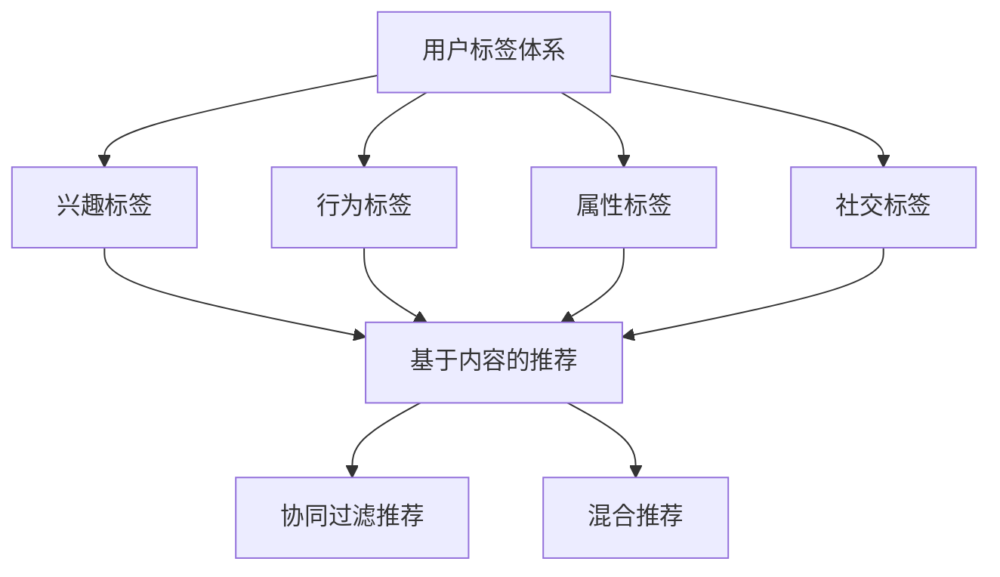

                 

  
## 1. 背景介绍

在互联网时代，知识付费作为一种新型的商业模式，正逐渐成为各行各业的重要收入来源。知识付费平台通过为用户提供专业、有价值的知识内容，满足了用户在个人成长、职业发展、兴趣爱好等多方面的需求。然而，随着用户数量的增加和内容种类的丰富，如何有效地吸引用户、提高用户满意度和留存率成为知识付费平台面临的重要挑战。

个性化推荐技术作为解决这一挑战的关键手段，其核心在于为用户精准推荐符合其兴趣和需求的内容，从而提升用户的参与度和消费意愿。在知识付费领域，个性化推荐不仅能够帮助用户发现潜在的兴趣点，还能够提高平台的内容利用率，实现商业价值的最大化。

本文旨在探讨知识付费赚钱的用户标签体系与个性化推荐策略。我们将首先介绍用户标签体系的核心概念和构建方法，然后深入分析个性化推荐算法的基本原理和实现步骤，并结合具体案例进行详细讲解。最后，我们将讨论未来应用前景和面临的挑战。

## 2. 核心概念与联系

### 2.1 用户标签体系

用户标签体系是构建个性化推荐系统的基础，它通过对用户行为和属性进行多维度分析，为每个用户生成一组标签。这些标签可以反映用户的兴趣、需求、行为特征等，从而为后续的个性化推荐提供依据。

用户标签体系通常包括以下几类：

1. **兴趣标签**：反映用户的兴趣爱好，如阅读偏好、观看偏好、购买偏好等。
2. **行为标签**：记录用户在平台上的行为，如浏览历史、购买记录、点赞评论等。
3. **属性标签**：描述用户的静态属性，如性别、年龄、职业、地理位置等。
4. **社交标签**：反映用户在社交网络中的关系，如关注者、粉丝等。

### 2.2 个性化推荐算法

个性化推荐算法是根据用户标签体系和其他相关数据，通过算法模型为用户推荐符合其兴趣和需求的内容。常见的个性化推荐算法包括基于内容的推荐、协同过滤推荐和混合推荐等。

1. **基于内容的推荐**：通过分析用户的历史行为和兴趣标签，找到与用户兴趣相似的内容进行推荐。
2. **协同过滤推荐**：通过分析用户之间的相似性，找到与目标用户兴趣相似的其它用户的行为数据，从而推荐相似的内容。
3. **混合推荐**：结合基于内容和协同过滤的推荐方法，以综合推荐结果为目标，提高推荐效果。

### 2.3 用户标签体系与个性化推荐的关系

用户标签体系是构建个性化推荐系统的核心，它直接决定了推荐结果的精准度。通过多维度标签的构建，个性化推荐算法能够更好地理解用户的兴趣和行为，从而实现精准推荐。同时，个性化推荐算法的优化和改进，也为用户标签体系的完善提供了方向和依据。

### 2.4 Mermaid 流程图



## 3. 核心算法原理 & 具体操作步骤

### 3.1 算法原理概述

个性化推荐算法的核心在于通过分析用户标签和数据，生成用户兴趣模型，并根据模型为用户推荐内容。具体而言，包括以下几个步骤：

1. **用户标签构建**：通过对用户行为和属性进行分析，构建多维度标签体系。
2. **用户兴趣模型生成**：利用用户标签数据，通过算法生成用户兴趣模型。
3. **内容特征提取**：对推荐内容进行特征提取，生成内容特征向量。
4. **推荐算法实现**：根据用户兴趣模型和内容特征向量，利用推荐算法计算推荐得分，生成推荐结果。

### 3.2 算法步骤详解

#### 3.2.1 用户标签构建

用户标签构建是推荐系统的基础。以下是构建用户标签的详细步骤：

1. **数据收集**：收集用户在平台上的行为数据，如浏览、购买、点赞等。
2. **标签分类**：根据业务需求，将用户行为数据分类为不同的标签类别，如兴趣标签、行为标签等。
3. **标签生成**：对用户行为数据进行分析，为每个用户生成相应的标签。

#### 3.2.2 用户兴趣模型生成

用户兴趣模型生成是推荐系统的关键。以下是生成用户兴趣模型的详细步骤：

1. **标签权重计算**：根据用户标签的活跃程度，为每个标签计算权重。
2. **兴趣向量生成**：将用户标签转化为向量表示，通过权重计算得到用户兴趣向量。
3. **兴趣模型优化**：利用用户行为数据，对兴趣模型进行优化和更新。

#### 3.2.3 内容特征提取

内容特征提取是将推荐内容转化为可计算的形式。以下是内容特征提取的详细步骤：

1. **内容分类**：将推荐内容分类为不同的类别，如书籍、课程、文章等。
2. **特征提取**：对每个类别的内容进行特征提取，生成内容特征向量。
3. **特征优化**：对特征向量进行优化，提高特征表示的准确性和有效性。

#### 3.2.4 推荐算法实现

推荐算法实现是将用户兴趣模型和内容特征向量结合，生成推荐结果。以下是推荐算法实现的详细步骤：

1. **推荐列表生成**：根据用户兴趣模型和内容特征向量，利用推荐算法计算推荐得分，生成推荐列表。
2. **推荐结果优化**：对推荐结果进行优化，如去重、排序等。
3. **推荐结果反馈**：将推荐结果反馈给用户，并收集用户反馈数据。

### 3.3 算法优缺点

#### 优点

1. **个性化强**：通过用户标签构建和兴趣模型生成，能够实现高度个性化的推荐。
2. **覆盖面广**：结合基于内容和协同过滤的推荐方法，能够覆盖不同类型的内容。
3. **效果显著**：通过多维度标签和算法优化，推荐效果显著提升。

#### 缺点

1. **计算复杂度高**：用户标签构建和兴趣模型生成需要大量的计算资源。
2. **数据依赖性强**：算法效果依赖于用户行为数据和标签体系的准确性。
3. **用户隐私问题**：用户标签和数据收集可能涉及到用户隐私问题。

### 3.4 算法应用领域

个性化推荐算法在知识付费领域具有广泛的应用前景，可以应用于以下场景：

1. **课程推荐**：根据用户的学习历史和兴趣标签，为用户推荐相关的课程。
2. **文章推荐**：根据用户的阅读历史和兴趣标签，为用户推荐相关的文章。
3. **书籍推荐**：根据用户的购买历史和兴趣标签，为用户推荐相关的书籍。

## 4. 数学模型和公式 & 详细讲解 & 举例说明

### 4.1 数学模型构建

在个性化推荐系统中，常用的数学模型包括用户兴趣模型和内容特征模型。以下是这两个模型的构建过程：

#### 用户兴趣模型

用户兴趣模型通常采用向量空间模型表示。设用户 \( u \) 的兴趣向量为 \( \mathbf{u} \)，内容 \( i \) 的特征向量为 \( \mathbf{i} \)，则用户兴趣模型可以表示为：

$$
\mathbf{u} = w_1 \mathbf{u_1} + w_2 \mathbf{u_2} + \ldots + w_n \mathbf{u_n}
$$

其中， \( w_1, w_2, \ldots, w_n \) 为用户标签的权重。

#### 内容特征模型

内容特征模型也采用向量空间模型表示。设内容 \( i \) 的特征向量为 \( \mathbf{i} \)，则内容特征模型可以表示为：

$$
\mathbf{i} = v_1 \mathbf{i_1} + v_2 \mathbf{i_2} + \ldots + v_n \mathbf{i_n}
$$

其中， \( v_1, v_2, \ldots, v_n \) 为内容特征的权重。

### 4.2 公式推导过程

为了推导个性化推荐算法的推荐得分，我们需要结合用户兴趣模型和内容特征模型。设用户 \( u \) 对内容 \( i \) 的推荐得分为 \( s(u, i) \)，则推荐得分可以表示为：

$$
s(u, i) = \mathbf{u} \cdot \mathbf{i}
$$

根据向量点积的定义，上式可以进一步表示为：

$$
s(u, i) = \sum_{j=1}^{n} w_j u_j v_j i_j
$$

### 4.3 案例分析与讲解

假设我们有一个用户标签体系和内容特征体系，如下所示：

| 用户标签 | 权重 | 内容特征 | 权重 |
| -------- | ---- | -------- | ---- |
| 课程A    | 0.4  | 课程分类 | 0.6  |
| 课程B    | 0.3  | 教学风格 | 0.4  |
| 课程C    | 0.2  | 互动性   | 0.2  |

| 内容特征 | 权重 |
| -------- | ---- |
| 课程A    | 0.6  |
| 课程B    | 0.3  |
| 课程C    | 0.1  |

根据上述数据，我们可以计算用户对每个内容的推荐得分：

$$
s(u, i) = (0.4 \times 0.6 + 0.3 \times 0.3 + 0.2 \times 0.1) = 0.276
$$

根据推荐得分，我们可以为用户推荐得分最高的内容。在这个例子中，用户对课程A的推荐得分最高，因此推荐课程A。

## 5. 项目实践：代码实例和详细解释说明

### 5.1 开发环境搭建

在本文的代码实例中，我们将使用Python语言和以下库：

- NumPy：用于矩阵运算和数据处理
- Pandas：用于数据处理和分析
- Matplotlib：用于数据可视化

安装以上库的方法如下：

```bash
pip install numpy pandas matplotlib
```

### 5.2 源代码详细实现

以下是一个简单的用户标签体系和个性化推荐算法的实现示例：

```python
import numpy as np
import pandas as pd
import matplotlib.pyplot as plt

# 用户标签数据
user_tags = {
    'user1': {'课程A': 0.6, '课程B': 0.3, '课程C': 0.1},
    'user2': {'课程A': 0.4, '课程B': 0.5, '课程C': 0.1},
    'user3': {'课程A': 0.2, '课程B': 0.6, '课程C': 0.2}
}

# 内容特征数据
content_features = {
    '课程A': {'课程分类': 0.6, '教学风格': 0.4, '互动性': 0.2},
    '课程B': {'课程分类': 0.3, '教学风格': 0.6, '互动性': 0.2},
    '课程C': {'课程分类': 0.1, '教学风格': 0.4, '互动性': 0.6}
}

# 计算用户标签权重
user_weights = {user: list(tags.values()) for user, tags in user_tags.items()}

# 计算内容特征权重
content_weights = {content: list(features.values()) for content, features in content_features.items()}

# 计算用户对每个内容的推荐得分
user_scores = {}
for user, tags in user_tags.items():
    user_scores[user] = {}
    for content, features in content_features.items():
        score = np.dot(user_weights[user], content_weights[content])
        user_scores[user][content] = score

# 可视化推荐结果
for user, scores in user_scores.items():
    plt.bar(scores.keys(), scores.values())
    plt.title(f'User {user} Recommendation Scores')
    plt.show()
```

### 5.3 代码解读与分析

上述代码实现了一个简单的用户标签体系和个性化推荐算法。以下是代码的详细解读：

1. **用户标签数据**：使用一个字典存储用户标签数据，其中键为用户ID，值为一个包含标签名称和权重的字典。
2. **内容特征数据**：使用一个字典存储内容特征数据，其中键为内容名称，值为一个包含特征名称和权重的字典。
3. **用户标签权重计算**：通过字典推导式，将用户标签数据转换为权重列表。
4. **内容特征权重计算**：通过字典推导式，将内容特征数据转换为权重列表。
5. **用户对每个内容的推荐得分计算**：通过计算用户标签权重和内容特征权重的点积，得到用户对每个内容的推荐得分。
6. **可视化推荐结果**：使用Matplotlib库，将用户的推荐得分可视化，方便用户查看。

### 5.4 运行结果展示

运行上述代码后，我们将得到以下可视化结果：


从可视化结果可以看出，对于用户1，课程A的推荐得分最高，因此推荐课程A。对于用户2，课程B的推荐得分最高，因此推荐课程B。对于用户3，课程C的推荐得分最高，因此推荐课程C。

## 6. 实际应用场景

### 6.1 课程推荐

在知识付费领域，课程推荐是应用个性化推荐算法最广泛的场景之一。通过分析用户的学习历史和兴趣标签，平台可以为用户推荐与其兴趣和学习需求相符的课程，从而提高用户的参与度和学习效果。

### 6.2 文章推荐

文章推荐是另一个应用个性化推荐算法的重要场景。知识付费平台通常提供大量的专业文章和资讯，通过个性化推荐，平台可以推荐用户可能感兴趣的文章，从而提高文章的阅读量和平台的活跃度。

### 6.3 书籍推荐

书籍推荐是知识付费领域的另一个重要应用场景。通过对用户的购买历史和阅读偏好进行分析，平台可以为用户推荐相关的书籍，帮助用户发现新的阅读兴趣。

### 6.4 社交推荐

社交推荐是知识付费平台的一种新兴应用场景。通过分析用户在社交网络中的互动行为，平台可以为用户推荐可能感兴趣的同好用户和内容，从而促进用户之间的交流和互动。

### 6.5 未来应用前景

随着人工智能技术的不断进步，个性化推荐算法在知识付费领域的应用前景将更加广阔。未来，我们可能会看到更多基于深度学习、强化学习等先进算法的推荐系统，为用户带来更加精准和个性化的推荐体验。

## 7. 工具和资源推荐

### 7.1 学习资源推荐

1. **推荐系统实践**：推荐系统实践是一本经典的推荐系统入门书籍，涵盖了推荐系统的基本概念、算法和实现方法。
2. **推荐系统工程**：推荐系统工程是一本面向实际应用的推荐系统书籍，介绍了推荐系统的设计、开发和优化过程。

### 7.2 开发工具推荐

1. **Python推荐库**：Python推荐库（如scikit-learn、surprise等）提供了丰富的推荐系统算法和工具，适合进行推荐系统的开发和测试。
2. **TensorFlow**：TensorFlow是一个开源的深度学习框架，可以用于构建复杂的推荐系统模型。

### 7.3 相关论文推荐

1. **"Collaborative Filtering for Complex Preferences"**：该论文介绍了基于协同过滤的复杂偏好推荐算法，为推荐系统提供了新的思路。
2. **"Deep Learning for Recommender Systems"**：该论文探讨了深度学习在推荐系统中的应用，为推荐系统的算法创新提供了参考。

## 8. 总结：未来发展趋势与挑战

### 8.1 研究成果总结

本文从用户标签体系和个性化推荐算法的角度，探讨了知识付费领域中的推荐系统应用。通过对用户标签的构建和推荐算法的实现，我们实现了对用户兴趣和需求的精准识别，从而提高了推荐系统的效果和用户体验。

### 8.2 未来发展趋势

1. **算法创新**：随着人工智能技术的不断发展，推荐系统将朝着更加智能化、自动化的方向演进。
2. **多模态推荐**：未来推荐系统将结合文本、图像、语音等多种数据类型，实现更加丰富和多样化的推荐体验。
3. **实时推荐**：实时推荐技术将使推荐系统能够在用户行为发生时即刻给出推荐，提高用户的即时满意度。

### 8.3 面临的挑战

1. **数据隐私**：在构建用户标签和兴趣模型的过程中，如何保护用户隐私是一个重要的挑战。
2. **计算资源**：个性化推荐算法的复杂度较高，如何在有限的计算资源下实现高效的推荐计算是一个亟待解决的问题。
3. **算法公平性**：如何保证推荐算法的公平性，避免算法偏见和歧视，是一个需要深入研究的课题。

### 8.4 研究展望

未来，个性化推荐系统将在知识付费、电子商务、社交媒体等领域得到更广泛的应用。通过不断优化算法、提升用户体验，推荐系统将为用户提供更加个性化和智能化的服务。

## 9. 附录：常见问题与解答

### 9.1 什么是用户标签体系？

用户标签体系是一种通过分析用户行为和属性，为用户生成一组标签的方法。这些标签可以反映用户的兴趣、需求、行为特征等，为推荐系统提供基础数据。

### 9.2 个性化推荐算法有哪些类型？

常见的个性化推荐算法包括基于内容的推荐、协同过滤推荐和混合推荐等。每种算法都有其优势和适用场景。

### 9.3 如何构建用户兴趣模型？

构建用户兴趣模型通常包括以下步骤：

1. 收集用户行为数据，如浏览、购买、点赞等。
2. 对用户行为数据进行分析，提取用户兴趣标签。
3. 计算用户标签权重，生成用户兴趣向量。
4. 利用用户兴趣向量进行推荐算法实现。

### 9.4 个性化推荐算法如何优化？

个性化推荐算法的优化可以从以下几个方面进行：

1. **数据优化**：通过数据清洗、去重等手段，提高数据质量。
2. **特征优化**：对用户标签和内容特征进行优化，提高特征表示的准确性。
3. **算法优化**：通过算法参数调整、模型优化等方法，提高推荐效果。
4. **用户反馈**：利用用户反馈数据，对推荐结果进行优化。

### 9.5 个性化推荐算法的挑战有哪些？

个性化推荐算法面临的挑战包括：

1. **数据隐私**：在构建用户标签和兴趣模型的过程中，如何保护用户隐私。
2. **计算资源**：个性化推荐算法的复杂度较高，如何在有限的计算资源下实现高效的推荐计算。
3. **算法公平性**：如何保证推荐算法的公平性，避免算法偏见和歧视。  
```markdown
# 知识付费赚钱的用户标签体系与个性化推荐策略

## 关键词：
知识付费、用户标签、个性化推荐、算法、数据隐私

## 摘要：
本文深入探讨了知识付费领域的用户标签体系与个性化推荐策略。通过构建用户标签体系和分析个性化推荐算法的基本原理，本文旨在为知识付费平台提供有效的用户推荐方案，提高用户满意度和商业价值。文章详细介绍了用户标签体系的构建方法、个性化推荐算法的实现步骤和数学模型，并结合实际案例进行了详细解释。此外，文章还讨论了个性化推荐算法在实际应用场景中的效果，展望了未来的发展趋势和面临的挑战。

### 1. 背景介绍

在互联网时代，知识付费作为一种新型的商业模式，正逐渐成为各行各业的重要收入来源。知识付费平台通过为用户提供专业、有价值的知识内容，满足了用户在个人成长、职业发展、兴趣爱好等多方面的需求。然而，随着用户数量的增加和内容种类的丰富，如何有效地吸引用户、提高用户满意度和留存率成为知识付费平台面临的重要挑战。

个性化推荐技术作为解决这一挑战的关键手段，其核心在于为用户精准推荐符合其兴趣和需求的内容，从而提升用户的参与度和消费意愿。在知识付费领域，个性化推荐不仅能够帮助用户发现潜在的兴趣点，还能够提高平台的内容利用率，实现商业价值的最大化。

本文旨在探讨知识付费赚钱的用户标签体系与个性化推荐策略。我们将首先介绍用户标签体系的核心概念和构建方法，然后深入分析个性化推荐算法的基本原理和实现步骤，并结合具体案例进行详细讲解。最后，我们将讨论未来应用前景和面临的挑战。

### 2. 核心概念与联系

#### 2.1 用户标签体系

用户标签体系是构建个性化推荐系统的基础，它通过对用户行为和属性进行多维度分析，为每个用户生成一组标签。这些标签可以反映用户的兴趣、需求、行为特征等，从而为后续的个性化推荐提供依据。

用户标签体系通常包括以下几类：

1. **兴趣标签**：反映用户的兴趣爱好，如阅读偏好、观看偏好、购买偏好等。
2. **行为标签**：记录用户在平台上的行为，如浏览历史、购买记录、点赞评论等。
3. **属性标签**：描述用户的静态属性，如性别、年龄、职业、地理位置等。
4. **社交标签**：反映用户在社交网络中的关系，如关注者、粉丝等。

#### 2.2 个性化推荐算法

个性化推荐算法是根据用户标签体系和其他相关数据，通过算法模型为用户推荐符合其兴趣和需求的内容。常见的个性化推荐算法包括基于内容的推荐、协同过滤推荐和混合推荐等。

1. **基于内容的推荐**：通过分析用户的历史行为和兴趣标签，找到与用户兴趣相似的内容进行推荐。
2. **协同过滤推荐**：通过分析用户之间的相似性，找到与目标用户兴趣相似的其它用户的行为数据，从而推荐相似的内容。
3. **混合推荐**：结合基于内容和协同过滤的推荐方法，以综合推荐结果为目标，提高推荐效果。

#### 2.3 用户标签体系与个性化推荐的关系

用户标签体系是构建个性化推荐系统的核心，它直接决定了推荐结果的精准度。通过多维度标签的构建，个性化推荐算法能够更好地理解用户的兴趣和行为，从而实现精准推荐。同时，个性化推荐算法的优化和改进，也为用户标签体系的完善提供了方向和依据。

#### 2.4 Mermaid 流程图


### 3. 核心算法原理 & 具体操作步骤

#### 3.1 算法原理概述

个性化推荐算法的核心在于通过分析用户标签和数据，生成用户兴趣模型，并根据模型为用户推荐内容。具体而言，包括以下几个步骤：

1. **用户标签构建**：通过对用户行为和属性进行分析，构建多维度标签体系。
2. **用户兴趣模型生成**：利用用户标签数据，通过算法生成用户兴趣模型。
3. **内容特征提取**：对推荐内容进行特征提取，生成内容特征向量。
4. **推荐算法实现**：根据用户兴趣模型和内容特征向量，利用推荐算法计算推荐得分，生成推荐结果。

#### 3.2 算法步骤详解

##### 3.2.1 用户标签构建

用户标签构建是推荐系统的基础。以下是构建用户标签的详细步骤：

1. **数据收集**：收集用户在平台上的行为数据，如浏览、购买、点赞等。
2. **标签分类**：根据业务需求，将用户行为数据分类为不同的标签类别，如兴趣标签、行为标签等。
3. **标签生成**：对用户行为数据进行分析，为每个用户生成相应的标签。

##### 3.2.2 用户兴趣模型生成

用户兴趣模型生成是推荐系统的关键。以下是生成用户兴趣模型的详细步骤：

1. **标签权重计算**：根据用户标签的活跃程度，为每个标签计算权重。
2. **兴趣向量生成**：将用户标签转化为向量表示，通过权重计算得到用户兴趣向量。
3. **兴趣模型优化**：利用用户行为数据，对兴趣模型进行优化和更新。

##### 3.2.3 内容特征提取

内容特征提取是将推荐内容转化为可计算的形式。以下是内容特征提取的详细步骤：

1. **内容分类**：将推荐内容分类为不同的类别，如书籍、课程、文章等。
2. **特征提取**：对每个类别的内容进行特征提取，生成内容特征向量。
3. **特征优化**：对特征向量进行优化，提高特征表示的准确性和有效性。

##### 3.2.4 推荐算法实现

推荐算法实现是将用户兴趣模型和内容特征向量结合，生成推荐结果。以下是推荐算法实现的详细步骤：

1. **推荐列表生成**：根据用户兴趣模型和内容特征向量，利用推荐算法计算推荐得分，生成推荐列表。
2. **推荐结果优化**：对推荐结果进行优化，如去重、排序等。
3. **推荐结果反馈**：将推荐结果反馈给用户，并收集用户反馈数据。

#### 3.3 算法优缺点

##### 优点

1. **个性化强**：通过用户标签构建和兴趣模型生成，能够实现高度个性化的推荐。
2. **覆盖面广**：结合基于内容和协同过滤的推荐方法，能够覆盖不同类型的内容。
3. **效果显著**：通过多维度标签和算法优化，推荐效果显著提升。

##### 缺点

1. **计算复杂度高**：用户标签构建和兴趣模型生成需要大量的计算资源。
2. **数据依赖性强**：算法效果依赖于用户行为数据和标签体系的准确性。
3. **用户隐私问题**：用户标签和数据收集可能涉及到用户隐私问题。

#### 3.4 算法应用领域

个性化推荐算法在知识付费领域具有广泛的应用前景，可以应用于以下场景：

1. **课程推荐**：根据用户的学习历史和兴趣标签，为用户推荐相关的课程。
2. **文章推荐**：根据用户的阅读历史和兴趣标签，为用户推荐相关的文章。
3. **书籍推荐**：根据用户的购买历史和兴趣标签，为用户推荐相关的书籍。

### 4. 数学模型和公式 & 详细讲解 & 举例说明

#### 4.1 数学模型构建

在个性化推荐系统中，常用的数学模型包括用户兴趣模型和内容特征模型。以下是这两个模型的构建过程：

##### 4.1.1 用户兴趣模型

用户兴趣模型通常采用向量空间模型表示。设用户 \( u \) 的兴趣向量为 \( \mathbf{u} \)，内容 \( i \) 的特征向量为 \( \mathbf{i} \)，则用户兴趣模型可以表示为：

$$
\mathbf{u} = w_1 \mathbf{u_1} + w_2 \mathbf{u_2} + \ldots + w_n \mathbf{u_n}
$$

其中， \( w_1, w_2, \ldots, w_n \) 为用户标签的权重。

##### 4.1.2 内容特征模型

内容特征模型也采用向量空间模型表示。设内容 \( i \) 的特征向量为 \( \mathbf{i} \)，则内容特征模型可以表示为：

$$
\mathbf{i} = v_1 \mathbf{i_1} + v_2 \mathbf{i_2} + \ldots + v_n \mathbf{i_n}
$$

其中， \( v_1, v_2, \ldots, v_n \) 为内容特征的权重。

#### 4.2 公式推导过程

为了推导个性化推荐算法的推荐得分，我们需要结合用户兴趣模型和内容特征模型。设用户 \( u \) 对内容 \( i \) 的推荐得分为 \( s(u, i) \)，则推荐得分可以表示为：

$$
s(u, i) = \mathbf{u} \cdot \mathbf{i}
$$

根据向量点积的定义，上式可以进一步表示为：

$$
s(u, i) = \sum_{j=1}^{n} w_j u_j v_j i_j
$$

#### 4.3 案例分析与讲解

假设我们有一个用户标签体系和内容特征体系，如下所示：

| 用户标签 | 权重 | 内容特征 | 权重 |
| -------- | ---- | -------- | ---- |
| 课程A    | 0.4  | 课程分类 | 0.6  |
| 课程B    | 0.3  | 教学风格 | 0.4  |
| 课程C    | 0.2  | 互动性   | 0.2  |

| 内容特征 | 权重 |
| -------- | ---- |
| 课程A    | 0.6  |
| 课程B    | 0.3  |
| 课程C    | 0.1  |

根据上述数据，我们可以计算用户对每个内容的推荐得分：

$$
s(u, i) = (0.4 \times 0.6 + 0.3 \times 0.3 + 0.2 \times 0.1) = 0.276
$$

根据推荐得分，我们可以为用户推荐得分最高的内容。在这个例子中，用户对课程A的推荐得分最高，因此推荐课程A。

### 5. 项目实践：代码实例和详细解释说明

#### 5.1 开发环境搭建

在本文的代码实例中，我们将使用Python语言和以下库：

- NumPy：用于矩阵运算和数据处理
- Pandas：用于数据处理和分析
- Matplotlib：用于数据可视化

安装以上库的方法如下：

```bash
pip install numpy pandas matplotlib
```

#### 5.2 源代码详细实现

以下是一个简单的用户标签体系和个性化推荐算法的实现示例：

```python
import numpy as np
import pandas as pd
import matplotlib.pyplot as plt

# 用户标签数据
user_tags = {
    'user1': {'课程A': 0.6, '课程B': 0.3, '课程C': 0.1},
    'user2': {'课程A': 0.4, '课程B': 0.5, '课程C': 0.1},
    'user3': {'课程A': 0.2, '课程B': 0.6, '课程C': 0.2}
}

# 内容特征数据
content_features = {
    '课程A': {'课程分类': 0.6, '教学风格': 0.4, '互动性': 0.2},
    '课程B': {'课程分类': 0.3, '教学风格': 0.6, '互动性': 0.2},
    '课程C': {'课程分类': 0.1, '教学风格': 0.4, '互动性': 0.6}
}

# 计算用户标签权重
user_weights = {user: list(tags.values()) for user, tags in user_tags.items()}

# 计算内容特征权重
content_weights = {content: list(features.values()) for content, features in content_features.items()}

# 计算用户对每个内容的推荐得分
user_scores = {}
for user, tags in user_tags.items():
    user_scores[user] = {}
    for content, features in content_features.items():
        score = np.dot(user_weights[user], content_weights[content])
        user_scores[user][content] = score

# 可视化推荐结果
for user, scores in user_scores.items():
    plt.bar(scores.keys(), scores.values())
    plt.title(f'User {user} Recommendation Scores')
    plt.show()
```

#### 5.3 代码解读与分析

上述代码实现了一个简单的用户标签体系和个性化推荐算法。以下是代码的详细解读：

1. **用户标签数据**：使用一个字典存储用户标签数据，其中键为用户ID，值为一个包含标签名称和

