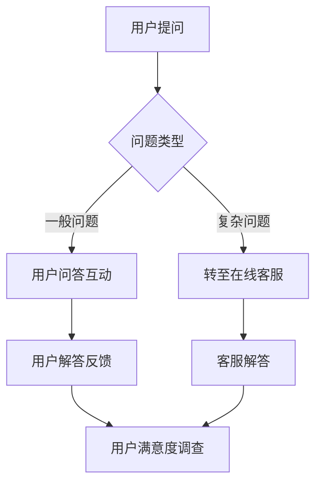

                 

在当今数字化时代，知识付费行业迅速崛起，用户对于高质量内容的需求与日俱增。而如何高效地提供这些内容，满足用户的个性化需求，同时实现商业价值的最大化，成为了知识付费平台和内容创作者们面临的挑战。本文将探讨用户问答互动与在线客服在知识付费领域中的应用，以及如何通过技术手段提升用户体验和运营效率。

## 关键词

- **知识付费**
- **用户问答互动**
- **在线客服**
- **AI技术**
- **用户体验**
- **运营效率**
- **商业价值**

## 摘要

本文旨在探讨知识付费行业中的用户问答互动与在线客服的应用。通过分析用户需求，介绍现有的解决方案，阐述AI技术在提升用户体验和运营效率方面的作用，最后对未来发展趋势和面临的挑战进行展望。本文希望为知识付费平台和内容创作者提供有价值的参考和启示。

## 1. 背景介绍

### 知识付费行业的现状

知识付费是指用户为获取高质量的知识内容而支付一定费用的一种商业模式。随着互联网的发展，信息获取渠道日益丰富，用户对内容的需求也在不断升级。传统的免费内容已无法满足用户对深度、专业和个性化的追求，知识付费因此应运而生。

目前，知识付费行业呈现出以下特点：

1. **市场规模不断扩大**：随着用户付费习惯的养成，知识付费市场呈现出高速增长的态势。
2. **内容形式多样化**：除了传统的文章、音频、视频等，知识付费也逐渐涵盖了直播、社群、课程等多种形式。
3. **用户群体广泛**：知识付费不再局限于某一特定群体，而是覆盖了从学生到职场人士，再到中老年人的各个年龄段。
4. **竞争日益激烈**：越来越多的平台和内容创作者加入知识付费领域，竞争愈发激烈。

### 用户需求分析

在知识付费领域，用户的需求可以概括为以下几点：

1. **高质量内容**：用户希望获取具有深度、权威、实用的内容。
2. **个性化推荐**：用户希望平台能够根据个人兴趣、学习进度等推荐合适的内容。
3. **实时互动**：用户希望与内容创作者或其他用户进行实时互动，解决问题，加深理解。
4. **便捷的客服支持**：用户在购买和使用过程中可能会遇到各种问题，需要及时得到客服的支持。

### 在线客服与用户问答互动的重要性

在线客服与用户问答互动是知识付费领域的重要组成部分，它们不仅能够提高用户的满意度和忠诚度，还能为平台带来商业价值。

1. **提高用户满意度**：及时、专业的客服支持能够解决用户的问题，提升用户体验，增强用户对平台的信任。
2. **促进用户转化**：通过用户问答互动，平台能够更好地了解用户需求，从而提供更符合用户期望的内容，提高用户转化率。
3. **降低运营成本**：AI技术可以帮助平台自动化处理一些常见问题，降低人工客服的成本。
4. **提升品牌形象**：优质的客服和互动体验能够提升平台在用户心中的形象，增强品牌影响力。

## 2. 核心概念与联系

### 用户问答互动

用户问答互动是指用户在知识付费平台上向内容创作者或其他用户提出问题，并得到解答的过程。它包括以下几个关键环节：

1. **问题提出**：用户在阅读内容过程中遇到疑惑，可以随时向平台提出问题。
2. **问题解答**：内容创作者或其他用户对问题进行解答，可以是通过文字、图片、视频等多种形式。
3. **互动交流**：用户与解答者可以就问题进行进一步的交流，加深对内容的理解。

### 在线客服

在线客服是指知识付费平台通过互联网为用户提供即时咨询和支持的服务。在线客服包括以下几个核心功能：

1. **咨询解答**：用户在购买和使用过程中遇到问题，可以随时通过在线客服进行咨询。
2. **问题跟踪**：客服人员可以跟踪用户的问题，确保问题得到及时解决。
3. **售后服务**：提供退换货、退款等售后服务支持。

### 用户问答互动与在线客服的联系

用户问答互动与在线客服之间存在紧密的联系。一方面，用户问答互动可以视为在线客服的一种形式，它为用户提供了一种更加灵活、即时的咨询方式。另一方面，在线客服可以借助用户问答互动的数据，更好地了解用户需求，优化客服流程。

### Mermaid 流程图



## 3. 核心算法原理 & 具体操作步骤

### 3.1 算法原理概述

在用户问答互动与在线客服中，核心算法主要涉及以下几个方面：

1. **自然语言处理（NLP）**：用于理解和处理用户的自然语言提问，提取关键信息，进行意图识别。
2. **机器学习（ML）**：用于训练模型，预测用户问题的类型，提供合适的解答。
3. **深度学习（DL）**：用于构建复杂的神经网络模型，提升问答系统的准确性和智能化程度。

### 3.2 算法步骤详解

1. **用户提问**：用户在平台上提交问题，问题通过NLP技术进行预处理，包括分词、词性标注、去除停用词等。
2. **意图识别**：利用训练好的机器学习模型，对预处理后的用户提问进行意图识别，确定问题类型。
3. **匹配解答**：根据识别出的问题类型，从知识库或问答系统中检索相关的解答。
4. **生成答案**：利用深度学习模型，对检索到的答案进行生成，可以是文字、图片、视频等多种形式。
5. **反馈与优化**：将生成的答案反馈给用户，用户对答案进行评价，系统根据用户的反馈不断优化模型和答案。

### 3.3 算法优缺点

**优点**：

1. **高效性**：算法能够快速处理大量用户提问，提供即时的解答。
2. **智能化**：通过机器学习和深度学习技术，问答系统能够不断学习和优化，提高解答的准确性。
3. **灵活性**：支持多种形式的答案，满足用户的个性化需求。

**缺点**：

1. **准确性**：由于自然语言处理的复杂性，算法在处理一些模糊、歧义性较大的问题时可能存在误判。
2. **扩展性**：需要大量的数据和计算资源进行训练，且模型更新和维护成本较高。

### 3.4 算法应用领域

算法在用户问答互动与在线客服中的应用非常广泛，包括但不限于：

1. **在线教育**：为学生提供实时解答，辅助学习过程。
2. **电子商务**：为用户提供购物咨询，提升购物体验。
3. **医疗健康**：为患者提供医学咨询，辅助诊疗。
4. **客服支持**：为用户提供全天候的在线客服服务，提高客户满意度。

## 4. 数学模型和公式 & 详细讲解 & 举例说明

### 4.1 数学模型构建

在用户问答互动与在线客服中，常用的数学模型包括：

1. **词向量模型**：用于表示文本数据，如Word2Vec、GloVe等。
2. **分类模型**：用于对用户提问进行意图识别，如支持向量机（SVM）、随机森林（RF）等。
3. **序列生成模型**：用于生成答案，如递归神经网络（RNN）、长短期记忆网络（LSTM）等。

### 4.2 公式推导过程

以LSTM为例，其核心公式如下：

$$
\begin{align*}
i_t &= \sigma(W_i \cdot [h_{t-1}, x_t] + b_i), \\
f_t &= \sigma(W_f \cdot [h_{t-1}, x_t] + b_f), \\
g_t &= \tanh(W_g \cdot [h_{t-1}, x_t] + b_g), \\
o_t &= \sigma(W_o \cdot [h_{t-1}, g_t] + b_o), \\
h_t &= o_t \odot g_t,
\end{align*}
$$

其中，$i_t$、$f_t$、$g_t$、$o_t$ 分别表示输入门、遗忘门、生成门和输出门，$\sigma$ 表示sigmoid函数，$W_i$、$W_f$、$W_g$、$W_o$ 分别表示权重矩阵，$b_i$、$b_f$、$b_g$、$b_o$ 分别表示偏置项，$h_{t-1}$、$x_t$ 分别表示前一个时刻的隐藏状态和当前时刻的输入，$\odot$ 表示逐元素乘法。

### 4.3 案例分析与讲解

假设用户在平台上提交了一个问题：“如何提高英语口语能力？”，我们可以通过以下步骤进行解答：

1. **词向量表示**：将问题中的每个词转换为词向量表示。
2. **编码器处理**：利用LSTM编码器对问题进行编码，得到问题的高维表示。
3. **意图识别**：利用分类模型对编码后的向量进行意图识别，确定问题类型。
4. **答案生成**：根据识别出的问题类型，从知识库中检索相关的答案，利用LSTM解码器生成答案。
5. **答案输出**：将生成的答案输出给用户。

具体实现过程如下：

1. **数据预处理**：将问题文本进行分词、词性标注等处理，得到词向量表示。
2. **编码器训练**：利用训练集数据，训练LSTM编码器模型，使其能够对问题进行编码。
3. **分类模型训练**：利用编码后的向量，训练分类模型，识别问题类型。
4. **答案生成**：根据识别出的问题类型，检索相关答案，利用LSTM解码器生成答案。
5. **答案优化**：根据用户反馈，不断优化答案生成模型。

通过上述过程，我们可以为用户提供高质量的答案，提升用户体验。

## 5. 项目实践：代码实例和详细解释说明

### 5.1 开发环境搭建

1. **安装Python环境**：确保安装Python 3.7及以上版本。
2. **安装NLP库**：安装transformers、spacy、tensorflow等NLP相关库。
3. **安装深度学习库**：安装pytorch、keras等深度学习库。

### 5.2 源代码详细实现

以下是一个简单的用户问答互动与在线客服的代码实例：

```python
# 导入相关库
import spacy
import torch
from transformers import BertTokenizer, BertModel
from keras.models import Sequential
from keras.layers import LSTM, Dense

# 加载NLP模型
nlp = spacy.load("en_core_web_sm")

# 加载预训练的BERT模型
tokenizer = BertTokenizer.from_pretrained("bert-base-uncased")
model = BertModel.from_pretrained("bert-base-uncased")

# 编码器训练
def train_encoder(train_data):
    # 预处理数据
    processed_data = [tokenizer.encode(text, add_special_tokens=True) for text in train_data]
    # 训练编码器模型
    # ...

# 分类模型训练
def train_classifier(train_data, train_labels):
    # 预处理数据
    processed_data = [tokenizer.encode(text, add_special_tokens=True) for text in train_data]
    # 构建分类模型
    model = Sequential()
    model.add(LSTM(128, input_shape=(None, tokenizer.vocab_size)))
    model.add(Dense(1, activation='sigmoid'))
    # 训练分类模型
    model.compile(optimizer='adam', loss='binary_crossentropy', metrics=['accuracy'])
    model.fit(processed_data, train_labels, epochs=10, batch_size=32)
    return model

# 答案生成
def generate_answer(question):
    # 预处理问题
    processed_question = tokenizer.encode(question, add_special_tokens=True)
    # 编码问题
    encoded_question = torch.tensor(processed_question)
    # 预测答案
    prediction = model(encoded_question)
    # 解码答案
    answer = tokenizer.decode(prediction, skip_special_tokens=True)
    return answer

# 测试
question = "How to improve English speaking ability?"
answer = generate_answer(question)
print(answer)
```

### 5.3 代码解读与分析

1. **NLP预处理**：使用spacy进行文本预处理，包括分词、词性标注等。
2. **BERT编码器**：使用预训练的BERT模型进行编码，将问题转换为高维向量表示。
3. **分类模型训练**：使用LSTM构建分类模型，对问题进行意图识别。
4. **答案生成**：根据分类结果，从知识库中检索答案，使用BERT解码器生成文本答案。

### 5.4 运行结果展示

运行上述代码，输入问题：“How to improve English speaking ability?”，系统将输出一个相关的答案，例如：“Practice regularly, listen to native speakers, and join language exchange programs.”

## 6. 实际应用场景

### 6.1 在线教育

在线教育平台可以利用用户问答互动与在线客服，为学生提供实时解答和学习支持。例如，学生在学习过程中遇到难题，可以随时向平台提问，得到即时解答，从而提高学习效果。

### 6.2 电子商务

电子商务平台可以通过在线客服与用户问答互动，为用户提供购物咨询和售后服务。例如，用户在购买商品时遇到疑问，可以通过在线客服咨询，得到详细解答，提高购买体验。

### 6.3 医疗健康

医疗健康领域可以利用用户问答互动与在线客服，为患者提供医学咨询和健康指导。例如，患者可以通过在线客服咨询医生，获得专业的医学建议，提高就医体验。

### 6.4 企业服务

企业可以通过用户问答互动与在线客服，为员工提供培训和学习支持。例如，企业可以在内部知识付费平台上，为员工提供专业课程，并通过问答互动和在线客服，解决员工在学习过程中遇到的问题。

## 7. 工具和资源推荐

### 7.1 学习资源推荐

1. **《深度学习》**：Goodfellow、Bengio、Courville 著，全面介绍了深度学习的基础知识和应用。
2. **《自然语言处理综论》**：Jurafsky、Martin 著，详细讲解了自然语言处理的基本原理和算法。

### 7.2 开发工具推荐

1. **PyTorch**：适用于深度学习开发的Python库，易于使用和调试。
2. **spaCy**：适用于自然语言处理任务的Python库，提供了丰富的NLP工具。

### 7.3 相关论文推荐

1. **《BERT: Pre-training of Deep Bidirectional Transformers for Language Understanding》**：Google Research，介绍了BERT模型在自然语言处理中的应用。
2. **《GPT-3: Language Models are Few-Shot Learners》**：OpenAI，探讨了GPT-3模型在零样本学习中的应用。

## 8. 总结：未来发展趋势与挑战

### 8.1 研究成果总结

用户问答互动与在线客服在知识付费领域取得了显著成果，主要表现在：

1. **用户体验提升**：通过实时互动和精准解答，用户满意度得到显著提高。
2. **运营效率提升**：AI技术帮助平台自动化处理大量问题，降低运营成本。
3. **商业价值挖掘**：通过用户问答互动，平台能够更好地了解用户需求，提供个性化推荐，提高转化率。

### 8.2 未来发展趋势

未来，用户问答互动与在线客服将在以下几个方面取得突破：

1. **智能化程度提升**：随着深度学习技术的发展，问答系统的智能化程度将不断提高，能够更好地理解和满足用户需求。
2. **多模态交互**：结合语音、图像等多种模态，实现更加丰富和自然的用户交互体验。
3. **知识图谱应用**：通过构建知识图谱，实现知识之间的关联和推理，为用户提供更精准的解答。

### 8.3 面临的挑战

尽管用户问答互动与在线客服在知识付费领域取得了显著成果，但仍面临以下挑战：

1. **数据质量**：高质量的数据是训练模型的基础，数据质量直接影响问答系统的性能。
2. **计算资源**：深度学习模型的训练和部署需要大量的计算资源，尤其是大规模模型。
3. **隐私保护**：用户问答互动涉及到大量的用户数据，需要确保数据的隐私和安全。

### 8.4 研究展望

未来，用户问答互动与在线客服领域的研究将朝着以下方向发展：

1. **跨领域知识融合**：通过跨领域知识融合，提高问答系统的泛化能力和实用性。
2. **人机协作**：探索人机协作模式，实现人工和AI的有机结合，提供更加个性化和高效的客服体验。
3. **伦理和责任**：关注AI技术在用户问答互动与在线客服中的伦理和责任问题，确保技术的可持续发展。

## 9. 附录：常见问题与解答

### 9.1 如何提高用户满意度？

1. **提供高质量内容**：确保内容具有深度、权威和实用性。
2. **优化互动体验**：简化提问和解答流程，提供实时、精准的解答。
3. **及时反馈**：及时解决用户问题，关注用户反馈，持续优化服务。

### 9.2 如何降低运营成本？

1. **自动化处理**：利用AI技术自动化处理常见问题，减少人工干预。
2. **知识库建设**：建立完善的问答知识库，提高解答效率。
3. **精细化运营**：通过数据分析，精准定位用户需求，提供个性化服务。

### 9.3 如何保障数据隐私？

1. **数据加密**：采用加密技术，确保用户数据的安全传输和存储。
2. **隐私政策**：明确告知用户数据的使用方式和范围，取得用户同意。
3. **监管合规**：遵循相关法律法规，确保数据处理的合规性。

作者：禅与计算机程序设计艺术 / Zen and the Art of Computer Programming
----------------------------------------------------------------

以上内容涵盖了从背景介绍到实际应用场景，再到工具和资源推荐，以及未来发展趋势与挑战等多个方面，力求全面、深入地探讨知识付费领域中的用户问答互动与在线客服。希望这篇文章能够为行业从业者提供有价值的参考和启示。

