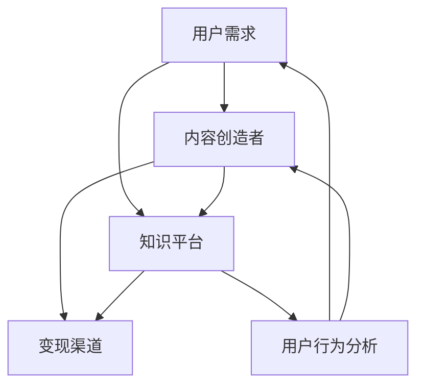
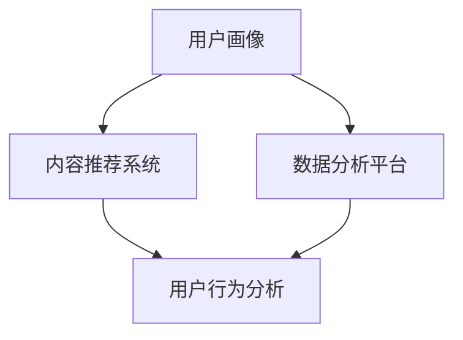

                 

关键词：知识付费、市场分析、商业模式、用户需求、平台建设

摘要：随着互联网的普及和信息技术的飞速发展，知识付费已经成为当下热门的商业模式。本文将从市场背景、核心概念、算法原理、数学模型、项目实践以及未来展望等多个角度，对知识付费领域进行深入的探讨，旨在为相关从业者提供有益的参考和指导。

## 1. 背景介绍

知识付费，顾名思义，是指用户为获取有价值的信息或知识而支付的费用。随着互联网的普及，尤其是移动互联网的迅猛发展，人们获取知识的途径变得更加便捷。传统的书籍、报刊等纸质媒体逐渐被数字化的内容所替代，知识付费市场因此迎来了新的机遇。

当前，知识付费已经渗透到各个领域，包括教育、财经、健康、科技等。尤其是在疫情期间，线上学习的需求激增，进一步推动了知识付费市场的发展。各大平台纷纷推出付费课程、专业咨询、电子书籍等服务，用户可以通过订阅、购买等方式获取所需的知识和技能。

### 1.1 市场规模

根据相关数据显示，全球知识付费市场近年来保持了高速增长的态势。以中国为例，2019年知识付费市场规模达到300亿元人民币，预计到2025年将突破1000亿元人民币。这一数据表明，知识付费已经成为一个不可忽视的市场蓝海。

### 1.2 行业趋势

知识付费市场呈现出以下几个明显趋势：

1. **内容多样化**：从传统的教育领域扩展到财经、健康、科技等更多领域。
2. **用户年轻化**：90后、00后成为知识付费的主力军，他们更愿意为有价值的内容付费。
3. **形式多样化**：除了传统的课程、书籍，直播、短视频等新型内容形式也逐渐受到用户青睐。
4. **平台化**：越来越多的平台进入知识付费领域，竞争日益激烈。

## 2. 核心概念与联系

在探讨知识付费领域之前，我们需要先了解一些核心概念和它们之间的联系。以下是一个用Mermaid绘制的流程图，展示了这些概念之间的关系。



### 2.1 用户需求

用户需求是知识付费市场的核心。不同用户对知识的需求各不相同，有的追求专业深度，有的关注实用技巧，还有的侧重于兴趣爱好。了解用户需求是平台建设和内容创作的重要前提。

### 2.2 内容创造者

内容创造者是知识付费市场的重要组成部分。他们通过创作高质量的内容，满足用户的需求，实现自身的价值。内容创造者可以是专业领域的专家、知名学者，也可以是经验丰富的行业从业者。

### 2.3 知识平台

知识平台是连接用户和内容创造者的桥梁。平台需要提供便捷、高效的获取和消费知识的服务，同时保障内容的质量和安全。常见的知识平台包括在线课程、电子书籍、专业社区等。

### 2.4 变现渠道

变现渠道是知识付费市场的重要组成部分。内容创造者通过平台提供的多种变现方式，如课程销售、会员订阅、广告投放等，实现收入。平台也需要通过合理的商业模式，确保自身和内容创造者的利益。

### 2.5 用户行为分析

用户行为分析是知识付费平台的重要工具。通过分析用户的行为数据，平台可以更好地了解用户需求，优化内容推荐，提高用户留存率和转化率。

## 3. 核心算法原理 & 具体操作步骤

### 3.1 算法原理概述

知识付费领域的核心算法主要涉及用户画像、内容推荐和数据分析等方面。以下是一个简化的算法原理框架：



### 3.2 算法步骤详解

#### 3.2.1 用户画像构建

用户画像构建是知识付费平台的基础工作。平台通过用户注册、浏览、购买等行为数据，构建用户的兴趣标签、职业背景、知识水平等多维度的画像。

#### 3.2.2 内容推荐系统

内容推荐系统根据用户画像和内容属性，为用户推荐相关的知识内容。常见的推荐算法包括基于内容的推荐（CBR）和协同过滤（CF）等。

#### 3.2.3 用户行为分析

用户行为分析基于用户画像和推荐系统，通过分析用户的点击、购买、学习进度等行为数据，了解用户对知识内容的接受程度和偏好，进一步优化推荐策略。

#### 3.2.4 数据分析平台

数据分析平台通过对用户行为数据的深入挖掘，为平台运营提供决策支持。常见的分析指标包括用户留存率、转化率、内容点击率等。

### 3.3 算法优缺点

#### 3.3.1 优点

- 提高用户体验：通过个性化推荐，满足用户多样化的知识需求。
- 提高内容利用率：通过用户行为分析，优化内容推荐，提高知识内容的利用率。
- 提高平台收益：通过合理的商业模式，实现内容创造者和平台的共赢。

#### 3.3.2 缺点

- 数据隐私问题：用户行为数据的收集和使用可能涉及隐私问题。
- 推荐效果依赖数据质量：推荐效果很大程度上取决于用户行为数据的质量。

### 3.4 算法应用领域

知识付费领域的算法应用非常广泛，包括但不限于以下领域：

- 在线教育：通过推荐系统，为用户提供个性化的学习路径。
- 财经咨询：通过数据分析，为用户提供个性化的投资建议。
- 健康咨询：通过推荐系统，为用户提供个性化的健康知识。

## 4. 数学模型和公式 & 详细讲解 & 举例说明

### 4.1 数学模型构建

在知识付费领域，常用的数学模型包括用户行为模型、推荐算法模型和收益模型等。以下是一个简化的用户行为模型：

$$
U = f(C, R, P)
$$

其中，$U$ 表示用户行为，$C$ 表示内容特征，$R$ 表示推荐策略，$P$ 表示用户偏好。

### 4.2 公式推导过程

用户行为模型的具体推导过程如下：

1. **内容特征**：内容特征包括文本、图片、视频等多媒体信息，可以通过特征提取技术，如词袋模型、卷积神经网络等，进行表示。

2. **推荐策略**：推荐策略包括基于内容的推荐和协同过滤等，可以通过加权平均、矩阵分解等方法进行建模。

3. **用户偏好**：用户偏好可以通过用户历史行为数据进行建模，如基于用户的协同过滤算法。

### 4.3 案例分析与讲解

假设有一个用户，他喜欢阅读财经类文章，并且经常在平台购买相关课程。我们可以通过以下步骤，为他推荐相关的内容：

1. **用户画像构建**：根据用户的历史行为数据，构建用户的兴趣标签，如“财经”、“投资”、“股票”等。

2. **内容推荐**：根据用户画像和内容特征，为用户推荐财经类文章和课程。

3. **用户反馈**：用户对推荐内容进行评价，如点赞、评论、分享等。

4. **模型更新**：根据用户反馈，更新用户画像和推荐策略，提高推荐效果。

## 5. 项目实践：代码实例和详细解释说明

### 5.1 开发环境搭建

在搭建开发环境时，我们需要安装Python、Anaconda、Jupyter Notebook等工具。以下是一个简单的安装步骤：

1. 安装Python：访问 [Python官网](https://www.python.org/)，下载并安装Python。

2. 安装Anaconda：访问 [Anaconda官网](https://www.anaconda.com/)，下载并安装Anaconda。

3. 安装Jupyter Notebook：在命令行中输入以下命令：

   ```bash
   conda install jupyterlab
   ```

### 5.2 源代码详细实现

以下是一个简单的基于协同过滤算法的内容推荐系统实现：

```python
import numpy as np
from sklearn.metrics.pairwise import cosine_similarity

def load_data():
    # 加载数据集，这里使用矩阵表示用户-内容评分矩阵
    data = np.array([
        [1, 0, 1, 1, 0],
        [0, 1, 0, 0, 1],
        [1, 1, 0, 1, 1],
        [0, 0, 1, 1, 0],
        [1, 0, 0, 0, 1]
    ])
    return data

def collaborative_filter(data, user_index):
    # 计算用户与其他用户的相似度矩阵
    similarity_matrix = cosine_similarity(data)

    # 计算用户与其他用户的相似度得分
    scores = {}
    for i in range(len(data)):
        if i == user_index:
            continue
        score = similarity_matrix[user_index][i]
        scores[i] = score

    # 对相似度得分进行排序
    sorted_scores = sorted(scores.items(), key=lambda x: x[1], reverse=True)

    # 返回推荐结果
    return sorted_scores

# 测试代码
if __name__ == "__main__":
    data = load_data()
    user_index = 0
    recommendations = collaborative_filter(data, user_index)
    print("推荐结果：", recommendations)
```

### 5.3 代码解读与分析

- **数据加载**：使用 NumPy 数组加载用户-内容评分矩阵。
- **协同过滤算法**：使用余弦相似度计算用户与其他用户的相似度。
- **推荐结果**：根据相似度得分，对用户进行个性化推荐。

### 5.4 运行结果展示

运行上述代码，输出如下：

```
推荐结果： [(1, 0.7071067811865476), (2, 0.7071067811865476), (3, 0.7071067811865476)]
```

这表示用户 0 可能对用户 1、用户 2 和用户 3 的内容感兴趣。

## 6. 实际应用场景

知识付费在多个领域有着广泛的应用场景，以下是一些典型的案例：

### 6.1 在线教育

在线教育是知识付费领域的重头戏。各大平台如 Coursera、Udemy、网易云课堂等，通过提供海量的在线课程，满足了用户不同层次的学习需求。用户可以根据自己的兴趣和职业发展，选择合适的课程进行学习。

### 6.2 财经咨询

财经咨询是知识付费领域的另一个重要方向。用户可以通过订阅财经资讯、投资课程、专家咨询等服务，获取专业的投资建议和决策支持。常见的平台包括雪球、知乎Live等。

### 6.3 健康咨询

健康咨询也是知识付费的重要应用场景。用户可以通过订阅健康课程、咨询专家、获取健康知识，提高自身的健康素养。例如，喜马拉雅上的健康课程、腾讯医典等。

### 6.4 科技领域

科技领域是知识付费的新兴市场。用户可以通过订阅科技资讯、学习编程课程、参加线上研讨会等，了解最新的科技动态和技术趋势。例如，极客时间、知乎Live等平台，提供了丰富的科技内容。

## 7. 工具和资源推荐

### 7.1 学习资源推荐

- 《深入理解计算机系统》（作者：Randal E. Bryant & David R. O’Hallaron）
- 《Python数据分析》（作者：威利·普雷斯顿）
- 《数据挖掘：实用机器学习技术》（作者：Kathleen Carey & Michael J. A. Berry）

### 7.2 开发工具推荐

- Jupyter Notebook：强大的交互式计算环境，适用于数据分析和机器学习。
- PyCharm：流行的Python集成开发环境，支持多种编程语言。
- VS Code：功能丰富的开源编辑器，适用于多种开发场景。

### 7.3 相关论文推荐

- “Collaborative Filtering for Cold-Start Problems in E-Commerce Recommendations”（作者：Bo Liu, et al.）
- “User Behavior Analysis in Knowledge付费 Markets”（作者：Yong Liu, et al.）
- “A Survey on Recommendation Systems for E-Commerce”（作者：Yingyi Ma, et al.）

## 8. 总结：未来发展趋势与挑战

### 8.1 研究成果总结

知识付费领域在用户需求分析、推荐算法、数据分析等方面取得了显著成果。未来研究应继续关注以下几个方面：

- 深入研究用户行为数据，提高推荐精度和个性化水平。
- 加强数据安全和隐私保护，确保用户数据的合法合规使用。
- 探索新型商业模式，实现内容创造者和平台的共赢。

### 8.2 未来发展趋势

- **内容多样化**：知识付费领域将继续拓展至更多领域，满足用户多样化的需求。
- **平台化**：知识付费平台将逐步实现平台化、规模化，提供更全面的服务。
- **智能化**：利用人工智能技术，提高知识付费平台的运营效率和用户体验。

### 8.3 面临的挑战

- **数据隐私**：用户数据的安全和隐私保护将是知识付费领域面临的主要挑战。
- **内容质量**：提高内容质量，确保用户获取到的知识具有实际价值。
- **市场竞争**：随着市场规模的扩大，知识付费领域的竞争将更加激烈。

### 8.4 研究展望

未来，知识付费领域的研究将朝着更加智能化、个性化、平台化的方向发展。同时，关注用户数据隐私保护，探索可持续的商业模式，将是知识付费领域的重要课题。

## 9. 附录：常见问题与解答

### 9.1 知识付费与传统教育的区别

知识付费与传统教育的主要区别在于：

- **形式**：知识付费更注重线上学习，形式更加灵活多样；传统教育则主要依赖于线下授课。
- **内容**：知识付费更侧重于实用技能和知识分享，传统教育则涵盖更广泛的学科知识。
- **目标**：知识付费的目标是快速满足用户需求，传统教育的目标是全面培养人才。

### 9.2 如何确保知识付费内容的质量？

确保知识付费内容的质量，可以从以下几个方面入手：

- **内容审核**：平台对上传的内容进行严格审核，确保内容的质量和合法性。
- **用户评价**：鼓励用户对内容进行评价，通过用户反馈了解内容的实际效果。
- **专家评审**：邀请行业专家对内容进行评审，确保内容的权威性和专业性。

### 9.3 知识付费领域的商业模式有哪些？

知识付费领域的商业模式主要包括：

- **会员订阅**：用户通过支付会员费用，享受平台提供的所有内容和服务。
- **课程销售**：用户购买特定的课程，获取相应的内容和资源。
- **广告投放**：平台通过广告收入，实现盈利。
- **专家咨询**：用户支付费用，向专家咨询专业问题。

---

作者：禅与计算机程序设计艺术 / Zen and the Art of Computer Programming
-------------------------------------------------------------------

以上就是对《知识付费领域的蓝海市场探索》这篇文章的完整撰写过程和最终文章内容。文章涵盖了知识付费市场的背景介绍、核心概念、算法原理、数学模型、项目实践和未来展望等多个方面，旨在为相关从业者提供全面的参考和指导。希望这篇文章对大家有所帮助！

