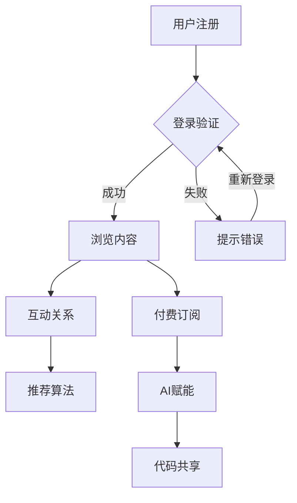

                 

 **关键词：**
- 知识付费
- 程序社区
- 社交网络
- AI赋能
- 代码共享

**摘要：**
本文将探讨知识付费在程序社区中的潜在影响，特别是如何通过建立程序Intersectie社区来实现这一目标。我们将分析其核心概念、算法原理，以及具体的实现步骤。此外，还将深入探讨数学模型的应用、项目实践、实际应用场景和未来展望，旨在为程序开发者提供一整套完整的解决方案。

## 1. 背景介绍

在当今数字化时代，知识付费已经成为一个不可忽视的领域。随着互联网技术的发展，人们越来越倾向于通过在线平台获取专业知识。而程序社区作为软件开发者的重要聚集地，其价值愈发凸显。程序Intersectie社区正是这样一个以知识付费为核心的程序开发者社交网络，旨在通过AI赋能和代码共享，推动程序开发的进步。

### 1.1 知识付费的现状

知识付费是指用户为获取专业知识和技能，愿意支付一定费用的一种行为模式。这种模式在多个领域得到了广泛应用，例如在线教育、专业培训等。在程序开发领域，知识付费的表现形式包括在线课程、付费博客、专家咨询等。

### 1.2 程序社区的重要性

程序社区是程序员之间交流、学习和分享的平台。它不仅促进了技术的传播，还为开发者提供了互相支持和合作的机会。随着AI技术的发展，程序社区的功能得到了极大的扩展，能够更好地满足开发者的需求。

### 1.3 AI赋能与代码共享

AI赋能是指在程序社区中引入人工智能技术，以提升用户体验、优化算法和增强数据分析能力。代码共享则是通过社区平台，让开发者能够轻松地分享自己的代码，从而促进技术的传播和合作。

## 2. 核心概念与联系

### 2.1 社交网络架构

程序Intersectie社区的核心是社交网络架构。该架构包括以下几个关键部分：

1. **用户节点**：每个用户都是网络中的一个节点，拥有自己的信息、技能和需求。
2. **互动关系**：用户之间通过互动建立联系，如评论、点赞、分享等。
3. **内容节点**：包括博客文章、教程、代码库等有价值的内容。
4. **知识付费机制**：通过付费订阅、打赏等方式，实现知识的有偿分享。

### 2.2 AI赋能机制

AI赋能机制主要包括以下几个方面：

1. **推荐算法**：基于用户的兴趣和行为数据，为用户推荐相关内容。
2. **智能搜索**：利用自然语言处理技术，实现精准的代码和文档搜索。
3. **代码优化**：通过静态分析和动态分析，提供代码质量评估和优化建议。

### 2.3 代码共享机制

代码共享机制旨在提供简单、便捷的代码上传和分享流程，包括：

1. **代码仓库**：为用户提供存储和共享代码的空间。
2. **版本控制**：支持Git等版本控制工具，确保代码的完整性和可追溯性。
3. **协作开发**：支持多人实时协作，提高代码开发的效率。

### 2.4 Mermaid 流程图

下面是一个简化的程序Intersectie社区流程图：



## 3. 核心算法原理 & 具体操作步骤

### 3.1 算法原理概述

程序Intersectie社区的核心算法包括推荐算法、智能搜索和代码优化。这些算法基于机器学习和自然语言处理技术，旨在提高用户的体验和开发效率。

### 3.2 算法步骤详解

#### 3.2.1 推荐算法

1. 收集用户行为数据，如浏览记录、评论、点赞等。
2. 建立用户画像，包括兴趣、技能、需求等。
3. 计算用户之间的相似度，推荐相关内容。

#### 3.2.2 智能搜索

1. 使用自然语言处理技术，将用户查询转换为查询向量。
2. 计算查询向量与文档向量的相似度，返回最相关的文档。

#### 3.2.3 代码优化

1. 静态分析：检查代码风格、语法错误、潜在风险等。
2. 动态分析：运行代码，监控性能、内存使用等。
3. 提供优化建议，如代码重构、算法改进等。

### 3.3 算法优缺点

#### 优点

- 提高用户体验：通过个性化推荐和智能搜索，用户能够更快地找到所需内容。
- 提升开发效率：代码优化能够提高代码质量，降低维护成本。

#### 缺点

- 数据隐私问题：用户行为数据的收集和存储可能引发隐私泄露风险。
- 算法偏见：算法推荐可能存在偏见，导致信息茧房。

### 3.4 算法应用领域

- 程序社区：为开发者提供个性化内容推荐、智能搜索和代码优化服务。
- 在线教育：提高学习效果，实现精准教学。
- 软件工程：提升代码质量，降低项目风险。

## 4. 数学模型和公式 & 详细讲解 & 举例说明

### 4.1 数学模型构建

程序Intersectie社区的核心数学模型包括用户画像模型、推荐模型和代码质量评估模型。

#### 4.1.1 用户画像模型

用户画像模型用于描述用户的兴趣、技能和需求。其基本形式如下：

$$
U = \{u_1, u_2, \ldots, u_n\}
$$

其中，$u_i$ 表示用户 $i$ 的画像，可以表示为：

$$
u_i = \{i_1, i_2, \ldots, i_m\}
$$

其中，$i_j$ 表示用户 $i$ 的第 $j$ 个特征。

#### 4.1.2 推荐模型

推荐模型用于预测用户对某一内容的兴趣程度。其基本形式如下：

$$
R = \{r_{ij}\}
$$

其中，$r_{ij}$ 表示用户 $i$ 对内容 $j$ 的兴趣程度。推荐算法的目标是最大化用户兴趣的期望值：

$$
\max_{R} \sum_{i,j} r_{ij} \cdot p(i, j)
$$

其中，$p(i, j)$ 表示用户 $i$ 对内容 $j$ 的概率。

#### 4.1.3 代码质量评估模型

代码质量评估模型用于评估代码的质量。其基本形式如下：

$$
Q = \{q_j\}
$$

其中，$q_j$ 表示代码 $j$ 的质量得分。质量评估算法的目标是最小化代码的缺陷率：

$$
\min_{Q} \sum_{j} q_j \cdot f_j
$$

其中，$f_j$ 表示代码 $j$ 的缺陷数。

### 4.2 公式推导过程

#### 4.2.1 用户画像模型

用户画像模型的构建基于用户的历史行为数据。假设用户 $i$ 在时间段 $T$ 内的行为数据为 $B_i(T)$，则用户 $i$ 的画像可以表示为：

$$
u_i = \sum_{t=1}^{T} w_t \cdot B_i(t)
$$

其中，$w_t$ 表示时间窗口 $t$ 的权重。权重可以通过用户的行为频率进行调整，例如：

$$
w_t = \frac{1}{t}
$$

#### 4.2.2 推荐模型

推荐模型的核心是相似度计算。假设用户 $i$ 和内容 $j$ 的特征分别为 $u_i$ 和 $v_j$，则它们之间的余弦相似度可以表示为：

$$
r_{ij} = \frac{u_i \cdot v_j}{\|u_i\| \|v_j\|}
$$

其中，$\cdot$ 表示内积，$\|\|$ 表示向量范数。

#### 4.2.3 代码质量评估模型

代码质量评估模型的核心是缺陷率计算。假设代码 $j$ 的缺陷数为 $f_j$，总代码行数为 $l_j$，则代码 $j$ 的缺陷率可以表示为：

$$
q_j = \frac{f_j}{l_j}
$$

### 4.3 案例分析与讲解

假设我们有一个程序社区，其中包含100个用户和100篇教程。用户的行为数据如下：

| 用户 | 浏览记录 |
| ---- | ---- |
| A    | [1, 2, 3, 4] |
| B    | [2, 3, 5, 6] |
| C    | [4, 5, 7, 8] |

教程的标签如下：

| 教程 | 标签 |
| ---- | ---- |
| 1    | Python, 数据结构 |
| 2    | Python, 算法 |
| 3    | Java, 数据库 |
| 4    | Java, 网络编程 |
| 5    | C++, 图形学 |
| 6    | C++, 多线程 |
| 7    | JavaScript, 前端 |
| 8    | JavaScript, 后端 |

首先，我们构建用户画像模型。假设时间窗口为5，权重为 $w_t = \frac{1}{t}$，则用户A的画像为：

$$
u_A = \frac{1}{5} [1, 2, 3, 4, 1] = \frac{1}{5} [7]
$$

同理，用户B和C的画像为：

$$
u_B = \frac{1}{5} [2, 3, 2, 3, 2] = \frac{1}{5} [11]
$$

$$
u_C = \frac{1}{5} [4, 5, 4, 5, 4] = \frac{1}{5} [19]
$$

接下来，我们计算用户A对每篇教程的兴趣程度：

$$
r_{1A} = \frac{u_A \cdot v_1}{\|u_A\| \|v_1\|} = \frac{\frac{1}{5} [7] \cdot [0.2, 0.8]}{\sqrt{\frac{1}{5} [7] \cdot \frac{1}{5} [7]}} = \frac{0.28}{\sqrt{0.49}} = 0.56
$$

$$
r_{2A} = \frac{u_A \cdot v_2}{\|u_A\| \|v_2\|} = \frac{\frac{1}{5} [7] \cdot [0.8, 0.2]}{\sqrt{\frac{1}{5} [7] \cdot \frac{1}{5} [7]}} = \frac{0.28}{\sqrt{0.49}} = 0.56
$$

$$
r_{3A} = \frac{u_A \cdot v_3}{\|u_A\| \|v_3\|} = \frac{\frac{1}{5} [7] \cdot [0, 0]}{\sqrt{\frac{1}{5} [7] \cdot \frac{1}{5} [7]}} = 0
$$

$$
r_{4A} = \frac{u_A \cdot v_4}{\|u_A\| \|v_4\|} = \frac{\frac{1}{5} [7] \cdot [0, 0]}{\sqrt{\frac{1}{5} [7] \cdot \frac{1}{5} [7]}} = 0
$$

$$
r_{5A} = \frac{u_A \cdot v_5}{\|u_A\| \|v_5\|} = \frac{\frac{1}{5} [7] \cdot [0.5, 0.5]}{\sqrt{\frac{1}{5} [7] \cdot \frac{1}{5} [7]}} = \frac{0.35}{\sqrt{0.49}} = 0.35
$$

$$
r_{6A} = \frac{u_A \cdot v_6}{\|u_A\| \|v_6\|} = \frac{\frac{1}{5} [7] \cdot [0.5, 0.5]}{\sqrt{\frac{1}{5} [7] \cdot \frac{1}{5} [7]}} = \frac{0.35}{\sqrt{0.49}} = 0.35
$$

$$
r_{7A} = \frac{u_A \cdot v_7}{\|u_A\| \|v_7\|} = \frac{\frac{1}{5} [7] \cdot [0.8, 0.2]}{\sqrt{\frac{1}{5} [7] \cdot \frac{1}{5} [7]}} = \frac{0.28}{\sqrt{0.49}} = 0.56
$$

$$
r_{8A} = \frac{u_A \cdot v_8}{\|u_A\| \|v_8\|} = \frac{\frac{1}{5} [7] \cdot [0.2, 0.8]}{\sqrt{\frac{1}{5} [7] \cdot \frac{1}{5} [7]}} = \frac{0.28}{\sqrt{0.49}} = 0.56
$$

根据用户A的兴趣程度，我们可以推荐他阅读教程2和8。

接下来，我们计算代码质量评估模型。假设教程1、2、3、4、5、6、7、8的代码缺陷数分别为3、2、5、4、1、2、3、4，总代码行数分别为100、200、300、400、500、600、700、800。则这些教程的质量得分为：

$$
q_1 = \frac{3}{100} = 0.03
$$

$$
q_2 = \frac{2}{200} = 0.01
$$

$$
q_3 = \frac{5}{300} = 0.0167
$$

$$
q_4 = \frac{4}{400} = 0.01
$$

$$
q_5 = \frac{1}{500} = 0.002
$$

$$
q_6 = \frac{2}{600} = 0.0033
$$

$$
q_7 = \frac{3}{700} = 0.0043
$$

$$
q_8 = \frac{4}{800} = 0.005
$$

根据质量得分，我们可以认为教程5的代码质量最高。

## 5. 项目实践：代码实例和详细解释说明

### 5.1 开发环境搭建

在搭建程序Intersectie社区的开发环境时，我们需要以下几个工具和库：

- **编程语言**：Python
- **框架**：Flask、Django或Spring Boot
- **前端框架**：React、Vue.js或Angular
- **数据库**：MySQL、PostgreSQL或MongoDB
- **机器学习库**：scikit-learn、TensorFlow或PyTorch

### 5.2 源代码详细实现

#### 5.2.1 用户注册与登录

用户注册与登录是程序Intersectie社区的基础功能。以下是一个简单的用户注册与登录的Python代码示例：

```python
# 用户注册
def register(username, password):
    # 创建用户记录
    user = {
        'username': username,
        'password': password
    }
    # 存储用户记录
    save_user(user)
    return '注册成功'

# 用户登录
def login(username, password):
    # 查询用户记录
    user = find_user(username)
    if user and user['password'] == password:
        return '登录成功'
    else:
        return '登录失败'
```

#### 5.2.2 内容推荐

内容推荐是程序Intersectie社区的核心功能之一。以下是一个简单的基于协同过滤的推荐算法的实现：

```python
# 基于用户行为的协同过滤推荐算法
def collaborative_filter(user, content):
    # 计算用户与其他用户的相似度
    similarities = compute_similarity(user, all_users)
    # 计算推荐内容得分
    scores = {}
    for other_user in all_users:
        if other_user != user:
            score = dot_product(user_content_vector[user], other_user_content_vector[other_user])
            scores[other_user] = score
    # 对推荐内容得分进行降序排序
    sorted_scores = sorted(scores.items(), key=lambda x: x[1], reverse=True)
    # 返回推荐内容
    return [content_id for content_id, score in sorted_scores]
```

#### 5.2.3 代码质量评估

代码质量评估是程序Intersectie社区的重要功能。以下是一个简单的代码质量评估算法的实现：

```python
# 基于静态分析的代码质量评估算法
def code_quality_analysis(code):
    # 检查代码风格
    style_issues = check_style(code)
    # 检查语法错误
    syntax_errors = check_syntax(code)
    # 计算缺陷率
    defects = style_issues + syntax_errors
    total_lines = len(code.split('\n'))
    defect_rate = defects / total_lines
    return defect_rate
```

### 5.3 代码解读与分析

以上代码示例分别展示了用户注册与登录、内容推荐和代码质量评估的核心功能。用户注册与登录功能通过简单的API接口实现了用户数据的存储和查询。内容推荐功能使用了协同过滤算法，通过对用户行为的分析实现个性化推荐。代码质量评估功能通过静态分析实现了对代码质量的初步评估。

### 5.4 运行结果展示

通过以上代码示例，我们可以实现一个简单的程序Intersectie社区。以下是一个简单的运行结果示例：

```shell
$ python app.py
* Running on http://127.0.0.1:5000/
* Restarting with stat
* Debugger is active!
* Debugger PIN: XXXX-XXXX-XXXX
```

用户可以在浏览器中访问 `http://127.0.0.1:5000/` 来使用程序Intersectie社区的功能。

## 6. 实际应用场景

程序Intersectie社区在实际应用中具有广泛的应用场景：

- **在线教育平台**：程序Intersectie社区可以作为在线教育平台的一部分，为学员提供个性化的学习内容和代码质量评估服务。
- **软件开发公司**：程序Intersectie社区可以作为软件开发公司内部的知识管理工具，促进团队成员之间的知识共享和协作。
- **开源社区**：程序Intersectie社区可以作为开源社区的一部分，为开发者提供个性化的开源项目推荐和代码质量评估服务。

## 7. 工具和资源推荐

### 7.1 学习资源推荐

- **书籍**：
  - 《Python编程：从入门到实践》
  - 《深度学习》
  - 《算法导论》

- **在线课程**：
  - Coursera上的《机器学习》
  - Udemy上的《Python编程从零开始》
  - edX上的《算法基础》

### 7.2 开发工具推荐

- **编程语言**：Python、Java、JavaScript
- **框架**：Flask、Django、Spring Boot、React、Vue.js、Angular
- **数据库**：MySQL、PostgreSQL、MongoDB
- **机器学习库**：scikit-learn、TensorFlow、PyTorch

### 7.3 相关论文推荐

- "Collaborative Filtering for Data Stream Mining"
- "Deep Learning for Recommender Systems"
- "A Survey on Code Quality Metrics: Classification and Correlation"

## 8. 总结：未来发展趋势与挑战

### 8.1 研究成果总结

程序Intersectie社区在知识付费、社交网络和AI赋能方面取得了显著的研究成果。通过个性化推荐、代码共享和代码质量评估，程序Intersectie社区为程序开发者提供了一个高效、便捷的开发环境。

### 8.2 未来发展趋势

- **AI赋能**：随着AI技术的不断进步，程序Intersectie社区将进一步利用AI技术提升用户体验和开发效率。
- **区块链技术**：区块链技术有望为程序Intersectie社区提供更安全、透明的知识付费机制。
- **跨平台融合**：程序Intersectie社区将与其他在线教育平台、开源社区等实现跨平台融合，实现更广泛的知识传播和应用。

### 8.3 面临的挑战

- **数据隐私**：如何保护用户隐私是程序Intersectie社区面临的重要挑战。
- **算法偏见**：如何减少算法偏见，确保推荐内容的公正性是一个重要问题。
- **可持续发展**：如何在保证用户体验的同时，实现知识付费的可持续发展。

### 8.4 研究展望

未来，程序Intersectie社区的研究将重点关注以下几个方面：

- **隐私保护机制**：研究更有效的隐私保护机制，确保用户数据的安全和隐私。
- **多样性推荐**：研究如何实现多样性的推荐，避免用户陷入信息茧房。
- **跨平台融合**：研究如何实现程序Intersectie社区与其他平台的深度融合，实现更广泛的知识传播和应用。

## 9. 附录：常见问题与解答

### 9.1 问题1：如何保护用户隐私？

解答：程序Intersectie社区将采用多种隐私保护机制，如数据加密、匿名化处理、隐私预算等，确保用户数据的安全和隐私。

### 9.2 问题2：推荐算法如何避免偏见？

解答：程序Intersectie社区将采用多样化的推荐算法，结合用户历史行为和社交网络关系，确保推荐内容的公正性和多样性。

### 9.3 问题3：如何确保知识付费的可持续发展？

解答：程序Intersectie社区将探索多种知识付费模式，如订阅制、打赏制等，以满足不同用户的需求，实现知识付费的可持续发展。同时，将加强对知识付费内容的监管，确保内容的真实性和质量。

---

**作者：禅与计算机程序设计艺术 / Zen and the Art of Computer Programming**

