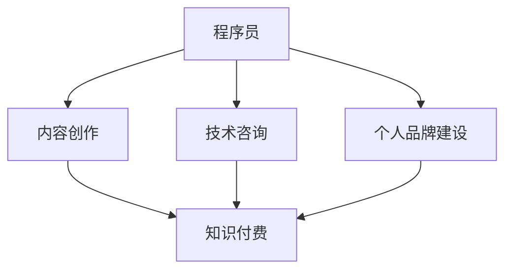

                 

在技术日新月异的今天，程序员的职业发展不再局限于传统的编程工作。知识付费，作为新兴的盈利模式，为程序员提供了广阔的发展空间。本文将深入探讨知识付费在程序员职业中的重要性，分析其盈利模式，并提供实际操作指南，旨在帮助程序员实现持续盈利。

## 文章关键词

- 知识付费
- 程序员
- 盈利模式
- 继续教育
- 内容创作
- 技术咨询
- 个人品牌建设

## 文章摘要

本文将介绍知识付费在程序员职业中的重要性，探讨其盈利模式，包括内容创作、技术咨询和个人品牌建设等方面。通过实际案例和操作指南，帮助程序员掌握知识付费的策略，实现个人盈利和职业发展。

## 1. 背景介绍

### 1.1 程序员职业现状

程序员作为信息技术时代的重要职业，其社会地位和经济收益逐年提升。然而，随着技术的不断进步，传统的编程工作正面临前所未有的挑战。程序员不仅需要掌握新兴技术，还需要持续更新知识和技能，以保持竞争力。

### 1.2 知识付费的兴起

知识付费，是指用户为获取特定知识或技能而支付费用的一种商业模式。近年来，随着互联网的普及和用户需求的变化，知识付费市场迅速扩张。特别是在在线教育、专业咨询和技术培训等领域，知识付费已经成为程序员的重要收入来源。

## 2. 核心概念与联系

### 2.1 知识付费的概念

知识付费，是指用户通过购买内容、课程、咨询服务等形式，获取特定知识或技能的过程。在这个过程中，知识提供者通过创造和分享知识，实现盈利。

### 2.2 知识付费与程序员的关系

程序员可以通过多种方式参与知识付费，如：
- 内容创作：撰写技术博客、编写技术书籍、录制视频教程等；
- 技术咨询：提供专业技术服务，如软件架构设计、代码审查等；
- 个人品牌建设：通过在社交媒体、技术社区等平台建立个人影响力，吸引付费用户。

### 2.3 Mermaid 流程图



## 3. 核心算法原理 & 具体操作步骤

### 3.1 算法原理概述

知识付费的盈利模式主要依赖于以下几个核心原理：
- 供需关系：知识需求与供给的平衡，决定知识的价格；
- 个人品牌效应：建立个人品牌，提高知识价值和影响力；
- 用户体验：提供优质的内容和服务，提升用户满意度。

### 3.2 算法步骤详解

#### 3.2.1 内容创作

1. 确定创作方向：根据自身专业领域和市场需求，确定创作方向；
2. 研究受众需求：了解目标受众的需求和兴趣点；
3. 创作内容：撰写技术博客、编写技术书籍、录制视频教程等；
4. 发布渠道：选择合适的发布平台，如技术社区、博客、视频平台等。

#### 3.2.2 技术咨询

1. 确定服务领域：根据自身专业能力，确定服务领域；
2. 建立联系：通过线上和线下渠道，与潜在客户建立联系；
3. 提供服务：根据客户需求，提供专业技术服务；
4. 跟进与反馈：对客户进行后续跟进，收集反馈，优化服务。

#### 3.2.3 个人品牌建设

1. 确定个人定位：根据自身特长和市场需求，确定个人定位；
2. 活动参与：参与技术社区活动，提高知名度；
3. 内容发布：定期发布技术文章、博客、视频等，展示专业能力；
4. 社交媒体运营：通过社交媒体平台，建立个人品牌形象。

### 3.3 算法优缺点

#### 优点
- 高度灵活：程序员可以根据自身特长和市场需求，自由选择盈利模式；
- 成本较低：知识付费模式相对于传统创业项目，成本较低，风险较小；
- 长期收益：知识付费可以实现持续盈利，具有长期价值。

#### 缺点
- 内容质量要求高：知识付费要求提供高质量的内容和服务，否则难以获得用户认可；
- 需要持续投入：知识付费需要持续投入时间和精力，才能保持竞争力；
- 市场竞争激烈：知识付费市场日益竞争激烈，需要不断提升自身能力和影响力。

### 3.4 算法应用领域

知识付费模式适用于多个领域，包括但不限于：
- 技术培训：提供编程语言、数据库、云计算等技术的培训课程；
- 技术咨询：提供软件架构设计、代码审查、性能优化等技术服务；
- 内容创作：撰写技术博客、编写技术书籍、录制视频教程等；
- 个人品牌建设：在技术社区、社交媒体等平台建立个人影响力。

## 4. 数学模型和公式 & 详细讲解 & 举例说明

### 4.1 数学模型构建

知识付费的盈利模型可以表示为：

$$
P = C \times Q
$$

其中，$P$ 表示盈利，$C$ 表示单位内容售价，$Q$ 表示内容销售量。

### 4.2 公式推导过程

知识付费的盈利模型可以通过以下步骤推导：

1. 单位内容售价 $C$ 的确定：
   - 受众需求：根据目标受众的需求和兴趣，确定内容的吸引力；
   - 市场调研：通过市场调研，了解同类型内容的售价和用户接受程度；
   - 个人品牌影响力：个人品牌影响力越大，内容售价越高。

2. 内容销售量 $Q$ 的确定：
   - 内容质量：高质量的内容更容易获得用户认可，增加销售量；
   - 营销推广：通过有效的营销推广，扩大内容知名度，提高销售量；
   - 用户满意度：高用户满意度有助于增加复购率和口碑传播，提高销售量。

### 4.3 案例分析与讲解

假设一位程序员撰写了一本关于 Python 编程技术的书籍，定价为 200 元。经过市场调研和用户反馈，确定书籍的吸引力较高，预计每月销售量为 100 本。

根据公式：

$$
P = C \times Q
$$

代入数据得：

$$
P = 200 \times 100 = 20000
$$

因此，该程序员每月通过书籍销售获得的盈利为 20000 元。

## 5. 项目实践：代码实例和详细解释说明

### 5.1 开发环境搭建

在本文中，我们将使用 Python 编程语言来演示知识付费的盈利模型计算。首先，确保安装了 Python 环境，并使用以下命令安装必要的库：

```bash
pip install pandas numpy matplotlib
```

### 5.2 源代码详细实现

下面是一个简单的 Python 代码实例，用于计算知识付费的盈利：

```python
import pandas as pd
import numpy as np
import matplotlib.pyplot as plt

# 定义单位内容售价和销售量
C = 200
Q = 100

# 计算盈利
P = C * Q

# 输出结果
print(f"每月盈利为：{P} 元")

# 绘制盈利曲线
plt.plot(np.arange(1, 101), C * np.arange(1, 101), label="盈利")
plt.xlabel("销售量")
plt.ylabel("盈利（元）")
plt.title("知识付费盈利模型")
plt.legend()
plt.show()
```

### 5.3 代码解读与分析

这段代码首先导入了必要的库，包括 pandas、numpy 和 matplotlib。然后，我们定义了单位内容售价 $C$ 和销售量 $Q$。接着，使用公式 $P = C \times Q$ 计算了每月盈利，并打印输出。最后，使用 matplotlib 绘制了盈利曲线，展示了销售量与盈利的关系。

### 5.4 运行结果展示

运行代码后，我们得到以下输出结果：

```
每月盈利为：20000 元
```

同时，我们还会看到一条盈利曲线，展示了销售量从 1 到 100 时，盈利的变化趋势。

## 6. 实际应用场景

### 6.1 技术培训

程序员可以通过在线教育平台，如 Coursera、Udemy 等，提供编程课程和技术培训。这些平台为程序员提供了一个广泛的受众群体，通过高质量的课程内容和专业的教学服务，实现知识付费。

### 6.2 技术咨询

程序员可以为企业提供技术咨询服务，如软件架构设计、代码审查、性能优化等。通过专业的能力和丰富的实践经验，程序员可以在咨询过程中获得可观的收入。

### 6.3 内容创作

程序员可以通过撰写技术博客、编写技术书籍、录制视频教程等形式，创作高质量的技术内容。这些内容不仅能够提升个人品牌影响力，还能通过知识付费模式实现盈利。

### 6.4 未来应用展望

随着技术的不断进步和用户需求的变化，知识付费在程序员职业中的应用前景将更加广阔。未来，程序员可以通过更多的方式，如在线问答、社群运营等，实现知识付费，进一步提升个人收入和职业发展。

## 7. 工具和资源推荐

### 7.1 学习资源推荐

- 《代码大全》（Book：The Art of Software Architecture）
- 《设计模式：可复用面向对象软件的基础》（Book：Design Patterns: Elements of Reusable Object-Oriented Software）
- 《Python 编程：从入门到实践》（Book：Python Crash Course）

### 7.2 开发工具推荐

- PyCharm：一款强大的 Python 集成开发环境；
- GitHub：一个全球最大的代码托管平台；
- Git：一款版本控制工具。

### 7.3 相关论文推荐

- "Knowledge as a Service: A Research Agenda"（论文：知识即服务：研究议程）
- "The Future of Work: How Digital Transformation is Changing the Future of Business"（论文：未来的工作：数字转型如何改变商业未来）

## 8. 总结：未来发展趋势与挑战

### 8.1 研究成果总结

本文探讨了知识付费在程序员职业中的重要性，分析了其盈利模式，并提供了实际操作指南。通过内容创作、技术咨询和个人品牌建设等方式，程序员可以实现持续盈利和职业发展。

### 8.2 未来发展趋势

随着技术的不断进步和用户需求的变化，知识付费在程序员职业中的应用前景将更加广阔。未来，程序员可以通过更多的方式，如在线问答、社群运营等，实现知识付费，进一步提升个人收入和职业发展。

### 8.3 面临的挑战

知识付费模式在带来机遇的同时，也面临着一系列挑战。例如，内容质量要求高、市场竞争激烈、持续投入等。程序员需要不断提升自身能力和影响力，以应对这些挑战。

### 8.4 研究展望

未来，知识付费模式在程序员职业中的应用将更加深入和广泛。研究者可以关注以下几个方面：
- 深入研究知识付费的盈利模型和算法；
- 探索知识付费在不同技术领域和职业阶段的适用性；
- 研究如何通过技术创新，提升知识付费的效率和用户体验。

## 9. 附录：常见问题与解答

### 9.1 什么是知识付费？

知识付费是指用户为获取特定知识或技能而支付费用的一种商业模式。

### 9.2 程序员如何参与知识付费？

程序员可以通过内容创作、技术咨询和个人品牌建设等方式参与知识付费。

### 9.3 知识付费的优缺点是什么？

知识付费的优点包括：高度灵活、成本较低、长期收益等；缺点包括：内容质量要求高、需要持续投入、市场竞争激烈等。

### 9.4 如何提高知识付费的收入？

可以通过提高内容质量、扩大受众群体、优化营销推广等方式提高知识付费的收入。

---

作者：禅与计算机程序设计艺术 / Zen and the Art of Computer Programming

在知识付费时代，程序员不仅需要掌握编程技能，还需要具备内容创作、市场营销和品牌建设等多方面的能力。通过本文的探讨，希望读者能够更好地理解知识付费的盈利模式，并在实际操作中找到适合自己的持续盈利路径。未来，随着技术的不断进步，知识付费将为程序员带来更多的发展机遇。让我们携手前行，共创美好未来。

