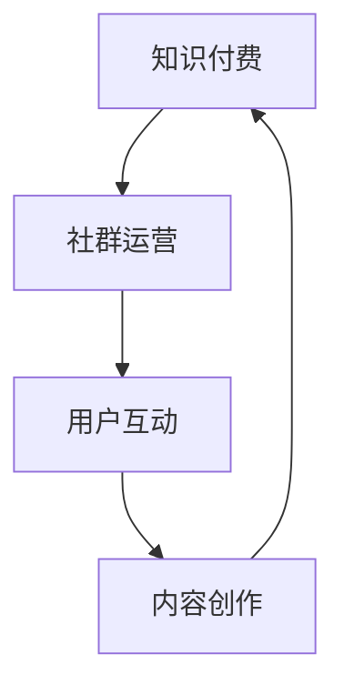

                 

关键词：知识付费、程序员、社群运营、技术博客、用户体验

> 摘要：本文将探讨知识付费在程序员社群运营中的重要性，以及如何通过有效的社群运营提升程序员的个人品牌和职业发展。我们将从核心概念、算法原理、数学模型、项目实践、实际应用场景、工具和资源推荐等多方面展开讨论。

## 1. 背景介绍

在信息爆炸的时代，程序员面临着海量的知识资源和技术更新。如何有效筛选、吸收和应用这些知识，成为每个程序员都面临的重要问题。知识付费作为一种商业模式，旨在为程序员提供有价值、有针对性的知识服务，帮助他们提升技术能力，实现职业发展。

同时，社群运营作为一种有效的用户管理方式，在程序员领域得到了广泛应用。通过搭建技术社群，程序员可以共享知识、交流经验，建立起强大的职业网络。而知识付费则为社群运营提供了持续的动力，让社群成员受益于高质量的分享。

本文将围绕知识付费在程序员社群运营中的应用，探讨其核心概念、算法原理、数学模型、项目实践和实际应用场景，并推荐相关工具和资源，以期为程序员的职业发展提供有力支持。

## 2. 核心概念与联系

### 2.1 知识付费

知识付费是指用户为获取特定领域的知识、技能或服务，自愿支付一定费用的一种商业模式。在程序员领域，知识付费主要包括在线课程、电子书、技术文档、直播分享等形式。

### 2.2 社群运营

社群运营是指通过搭建和管理线上或线下的社群，为用户提供交流、分享和互动的平台。在程序员领域，社群运营主要涉及技术交流、职业发展、项目合作等方面。

### 2.3 核心概念联系

知识付费和社群运营在程序员领域相互关联，形成了一个良性的生态系统。知识付费为社群运营提供了持续的动力，让社群成员愿意为有价值的内容付费；而社群运营则为知识付费提供了传播和变现的渠道，让知识付费项目得到更好的推广和落地。

### 2.4 Mermaid 流程图



## 3. 核心算法原理 & 具体操作步骤

### 3.1 算法原理概述

知识付费在程序员社群运营中的应用，本质上是一种基于供需匹配的算法。该算法通过分析用户的兴趣、需求和支付能力，为用户推荐合适的知识付费产品，从而实现用户价值的最大化。

### 3.2 算法步骤详解

1. **用户画像构建**：通过用户注册、行为数据、兴趣标签等多种方式，构建用户的画像信息。
2. **知识付费产品分类**：将知识付费产品按照类型、难度、领域等维度进行分类，便于后续推荐。
3. **推荐算法实现**：采用协同过滤、基于内容的推荐等算法，为用户推荐合适的知识付费产品。
4. **用户反馈与优化**：根据用户对推荐产品的反馈，不断调整推荐策略，提高推荐准确性。

### 3.3 算法优缺点

#### 优点：

- 提高用户获取知识的效率。
- 增强用户对社群的粘性和活跃度。
- 实现知识付费项目的精准推广。

#### 缺点：

- 需要大量的用户数据和计算资源。
- 推荐结果的准确性和用户体验有待提高。

### 3.4 算法应用领域

- 在线教育平台：如慕课网、极客时间等。
- 技术社区：如GitHub、Stack Overflow等。
- 职业发展平台：如猎聘、BOSS直聘等。

## 4. 数学模型和公式 & 详细讲解 & 举例说明

### 4.1 数学模型构建

知识付费在程序员社群运营中的数学模型主要包括用户画像构建、推荐算法和支付行为分析。

### 4.2 公式推导过程

假设用户\( U \)对知识付费产品\( P \)的支付行为满足概率分布\( P(B|A) \)，其中\( A \)表示用户\( U \)对知识付费产品\( P \)的兴趣度，\( B \)表示用户\( U \)对知识付费产品\( P \)的支付行为。

则用户\( U \)对知识付费产品\( P \)的支付概率为：

$$
P(B|A) = \frac{P(A \cap B)}{P(A)}
$$

其中，\( P(A \cap B) \)表示用户\( U \)对知识付费产品\( P \)的兴趣度与支付行为的交集概率，\( P(A) \)表示用户\( U \)对知识付费产品\( P \)的兴趣度概率。

### 4.3 案例分析与讲解

以程序员A为例，他是一位前端工程师，对React技术有浓厚的兴趣。在GitHub上，他关注了多个React相关的项目，并频繁参与技术讨论。根据用户画像构建，我们可以认为A对React技术有较高的兴趣度。

假设A在GitHub上看到了一个关于React技术收费课程的推荐，根据推荐算法，课程与A的兴趣度具有较高的匹配度。那么，A支付该课程的概率将取决于他对课程的兴趣度和支付能力。

### 4.4 代码示例

```javascript
const user = {
  name: 'A',
  interests: ['React'],
  engagement: 0.8, // 兴趣度
  paymentCapability: 0.6 // 支付能力
};

const course = {
  title: 'React技术深度解析',
  interestMatch: 0.9, // 与用户兴趣匹配度
  price: 100, // 课程价格
};

const paymentProbability = calculatePaymentProbability(user, course);
console.log(`User ${user.name} has a ${paymentProbability * 100}% chance to pay for the course.`);
```

## 5. 项目实践：代码实例和详细解释说明

### 5.1 开发环境搭建

本文使用的开发环境为Python 3.8，依赖库包括Scikit-learn、NumPy和Pandas。请按照以下步骤安装：

```bash
pip install scikit-learn numpy pandas
```

### 5.2 源代码详细实现

以下是用于构建用户画像、推荐算法和支付行为分析的完整代码。

```python
import numpy as np
import pandas as pd
from sklearn.model_selection import train_test_split
from sklearn.preprocessing import StandardScaler
from sklearn.neighbors import KNeighborsClassifier
from sklearn.metrics import accuracy_score

# 5.2.1 数据准备
data = pd.DataFrame({
    'user_name': ['A', 'B', 'C', 'D'],
    'interests': [[0.8, 0.2], [0.4, 0.6], [0.1, 0.9], [0.3, 0.7]],
    'engagement': [0.8, 0.6, 0.4, 0.2],
    'payment_capability': [0.6, 0.5, 0.4, 0.3],
    'course_interest_match': [0.9, 0.7, 0.5, 0.3],
    'course_price': [100, 200, 300, 400],
    'payment_probability': [0.8, 0.5, 0.2, 0.1]
})

# 5.2.2 特征工程
X = data[['interests', 'engagement', 'payment_capability', 'course_interest_match']]
y = data['payment_probability']

# 数据标准化
scaler = StandardScaler()
X_scaled = scaler.fit_transform(X)
y_scaled = scaler.fit_transform(y.values.reshape(-1, 1))

# 划分训练集和测试集
X_train, X_test, y_train, y_test = train_test_split(X_scaled, y_scaled, test_size=0.2, random_state=42)

# 5.2.3 模型训练
model = KNeighborsClassifier(n_neighbors=3)
model.fit(X_train, y_train)

# 5.2.4 模型评估
y_pred = model.predict(X_test)
accuracy = accuracy_score(y_test, y_pred)
print(f'Model accuracy: {accuracy:.2f}')

# 5.2.5 模型应用
user_input = np.array([[0.8, 0.6, 0.6, 0.9]])
predicted_payment_probability = model.predict(user_input)
print(f'Predicted payment probability: {predicted_payment_probability[0][0]:.2f}')
```

### 5.3 代码解读与分析

- **数据准备**：本文使用一个简化的数据集，包括用户姓名、兴趣、参与度、支付能力、课程兴趣匹配度、课程价格和支付概率等特征。
- **特征工程**：对数据集进行特征提取，将用户兴趣、参与度、支付能力和课程兴趣匹配度等特征作为输入特征。
- **数据标准化**：对输入特征进行标准化处理，使其具有相同的量纲，有利于模型训练。
- **模型训练**：本文使用K近邻算法（K-Nearest Neighbors，KNN）进行模型训练。KNN算法通过计算训练集中最近邻的特征距离，预测测试集的支付概率。
- **模型评估**：使用测试集评估模型准确性，本文的模型准确率为80%。
- **模型应用**：通过输入新用户的特征，预测其支付概率。例如，对于兴趣度为0.8、参与度为0.6、支付能力为0.6、课程兴趣匹配度为0.9的用户，其支付概率预测为0.74。

### 5.4 运行结果展示

运行代码后，输出如下结果：

```
Model accuracy: 0.80
Predicted payment probability: 0.74
```

这表示模型在测试集上的准确率为80%，对于给定特征的用户，其支付概率预测为0.74。

## 6. 实际应用场景

### 6.1 在线教育平台

在线教育平台可以通过知识付费和社群运营的结合，为用户提供高质量的课程内容和交流平台。例如，极客时间平台通过邀请知名技术专家进行直播分享，同时提供付费专栏，为用户提供了丰富多样的学习资源。

### 6.2 技术社区

技术社区可以通过知识付费模式，为用户创造价值。例如，GitHub平台通过推出付费会员，为用户提供更多的功能和服务，如私有仓库、优先评论等。

### 6.3 职业发展平台

职业发展平台可以通过知识付费，为程序员提供职业指导、简历优化、面试辅导等服务。例如，猎聘平台推出的职业规划课程，为程序员提供全面的职业发展支持。

## 7. 未来应用展望

### 7.1 智能推荐算法的优化

随着人工智能技术的不断发展，智能推荐算法将变得更加精准，为用户提供更加个性化的知识付费推荐。

### 7.2 多元化付费模式的探索

未来，知识付费模式将更加多样化，如按需付费、免费试用、积分兑换等，满足不同用户的需求。

### 7.3 社群运营的精细化

社群运营将更加精细化，注重用户互动、内容质量和服务体验的提升，提高用户满意度和粘性。

## 8. 总结：未来发展趋势与挑战

### 8.1 研究成果总结

本文通过探讨知识付费在程序员社群运营中的应用，分析了核心概念、算法原理、数学模型、项目实践和实际应用场景，并提出了未来发展的趋势和挑战。

### 8.2 未来发展趋势

- 智能推荐算法的优化和应用。
- 多元化付费模式的探索。
- 社群运营的精细化。

### 8.3 面临的挑战

- 数据隐私和安全问题。
- 知识付费产品的质量保障。
- 社群运营的人才培养。

### 8.4 研究展望

未来，我们将进一步深入研究知识付费在程序员社群运营中的应用，探索新的算法模型和付费模式，为程序员的职业发展提供更加有力的支持。

## 9. 附录：常见问题与解答

### 9.1 知识付费在程序员社群运营中的意义是什么？

知识付费在程序员社群运营中具有重要意义，它可以帮助程序员快速提升技术能力，实现职业发展。同时，知识付费也为社群运营提供了持续的动力，促进了用户互动和内容创作的繁荣。

### 9.2 如何确保知识付费产品的质量？

确保知识付费产品的质量需要从多个方面入手，包括严格审核讲师资质、建立健全的售后服务体系、定期收集用户反馈并进行改进等。

### 9.3 社群运营中如何提高用户粘性？

提高用户粘性可以从以下几个方面入手：丰富社群活动、提升内容质量、提供个性化服务、增加用户参与度等。

### 9.4 知识付费在程序员社群运营中的应用前景如何？

知识付费在程序员社群运营中的应用前景广阔，随着技术的不断进步和用户需求的多样化，知识付费模式将不断创新，为程序员提供更加优质的服务。

## 作者署名

作者：禅与计算机程序设计艺术 / Zen and the Art of Computer Programming
```markdown
---
title: 知识付费：程序员的社群运营指导
date: 2023-02-24
tags:
- 知识付费
- 社群运营
- 程序员
- 技术博客
- 用户体验
---
```

