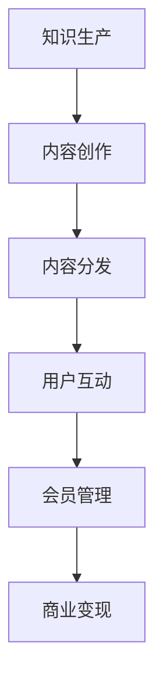

                 

关键词：知识付费、社群运营、程序员、数字化营销、用户互动、内容创作、会员管理、案例分析

> 摘要：本文旨在探讨知识付费领域中的社群运营方法，针对程序员的特殊需求，从内容创作、用户互动、会员管理等方面进行分析，并结合实际案例，为程序员提供一套实用的社群运营策略。

## 1. 背景介绍

随着互联网技术的飞速发展，知识付费逐渐成为新的商业模式。对于程序员而言，他们既是知识的创造者，也是知识的需求者。如何在知识付费领域中通过社群运营获取用户、提升用户黏性、实现商业价值，成为了程序员需要认真思考的问题。

### 1.1 程序员在知识付费领域中的角色

- **知识生产者**：程序员拥有丰富的技术知识和实践经验，能够生产高质量的技术文章、教程、视频等。
- **知识消费者**：程序员需要不断学习新技术、新方法，以适应快速变化的工作环境。

### 1.2 社群运营的重要性

社群运营不仅可以帮助程序员更好地传播知识，还能提升用户黏性，建立良好的品牌形象。通过有效的社群运营，程序员可以：

- 拓展自己的影响力
- 提升个人品牌价值
- 增强用户对产品的信任感
- 提高用户转化率和留存率

## 2. 核心概念与联系

### 2.1 社群运营的概念

社群运营是指通过特定的平台或渠道，围绕共同的兴趣、需求或目标，吸引和组织用户形成稳定的社群，并通过互动、内容创作、会员管理等手段，实现用户增长和商业价值。

### 2.2 程序员社群的特点

- **高知识水平**：程序员社群成员普遍拥有较高的技术素养和解决问题的能力。
- **专业性强**：社群成员对特定技术领域有深入的研究和兴趣。
- **活跃度高**：程序员通常乐于分享和讨论技术问题。

### 2.3 社群运营与知识付费的关系

社群运营是知识付费的重要环节，它通过提供有价值的内容和服务，吸引并留住用户，实现知识的传递和价值的变现。

### 2.4 Mermaid 流程图



## 3. 核心算法原理 & 具体操作步骤

### 3.1 算法原理概述

社群运营的核心算法主要包括内容创作、用户互动、会员管理三个方面。以下是每个方面的具体步骤和原理。

### 3.2 算法步骤详解

#### 3.2.1 内容创作

1. 确定内容主题：根据用户需求和行业动态，确定内容主题。
2. 创作高质量内容：结合自己的技术经验和用户痛点，创作具有实用性和趣味性的内容。
3. 发布内容：在社群平台发布内容，并设置适当的激励机制。

#### 3.2.2 用户互动

1. 设立讨论区：在社群内设立讨论区，方便用户提问和讨论。
2. 回复用户提问：及时回复用户提问，提供专业的解答和建议。
3. 激励用户参与：通过点赞、评论、打赏等方式激励用户参与互动。

#### 3.2.3 会员管理

1. 设立会员等级：根据用户贡献和互动情况，设立会员等级。
2. 提供专属服务：为高级会员提供更多专属服务，如一对一咨询、技术支持等。
3. 维护会员关系：定期与会员沟通，了解他们的需求和意见，提升会员满意度。

### 3.3 算法优缺点

#### 优点：

- 提升用户黏性：通过高质量的内容和互动，增加用户对社群的依赖度。
- 提高商业变现能力：通过会员管理，实现社群的商业化运营。

#### 缺点：

- 内容创作成本高：高质量的内容创作需要耗费大量时间和精力。
- 用户维护成本高：需要持续投入时间和资源，维护用户关系。

### 3.4 算法应用领域

社群运营算法主要应用于技术博客、在线教育平台、技术论坛等场景。

## 4. 数学模型和公式 & 详细讲解 & 举例说明

### 4.1 数学模型构建

社群运营效果可以用以下公式表示：

$$
运营效果 = f(内容质量, 用户互动, 会员管理)
$$

### 4.2 公式推导过程

$$
f(内容质量) = \frac{内容质量得分}{内容总量}
$$

$$
f(用户互动) = \frac{用户互动得分}{用户总数}
$$

$$
f(会员管理) = \frac{会员满意度得分}{会员总数}
$$

### 4.3 案例分析与讲解

以某个技术博客为例，假设其内容质量得分为80，用户互动得分为70，会员管理得分为90，则其社群运营效果为：

$$
运营效果 = \frac{80 + 70 + 90}{3} = 80
$$

这个得分表明，该技术博客的社群运营效果较为优秀。

## 5. 项目实践：代码实例和详细解释说明

### 5.1 开发环境搭建

- 选择合适的社群运营平台，如微信公众号、知乎专栏、技术论坛等。
- 注册账号，完成基本设置。

### 5.2 源代码详细实现

以下是一个简单的微信公众号内容发布示例：

```python
# 导入微信公众号SDK
from wechatpy import WeChatClient

# 设置微信公众号配置
APP_ID = 'your_app_id'
APP_SECRET = 'your_app_secret'

# 初始化微信公众号客户端
client = WeChatClient(appid=APP_ID, secret=APP_SECRET)

# 创建文本消息
msg = {
    "touser": "用户ID",
    "toparty": "",
    "totag": "",
    "msgtype": "text",
    "agentid": 1,
    "content": {
        "content": "欢迎来到我们的技术社群！"
    }
}

# 发送消息
response = client.message_send(msg)
print(response.json())
```

### 5.3 代码解读与分析

这段代码使用了微信公众号的 SDK，实现了向特定用户发送文本消息的功能。通过设置 `touser` 参数，可以精确地向用户发送消息。

### 5.4 运行结果展示

假设用户ID为 `user123`，运行代码后，用户 `user123` 将会收到一条欢迎消息。

## 6. 实际应用场景

社群运营在知识付费领域具有广泛的应用场景，如：

- **在线教育平台**：通过社群运营，提升学生的学习体验和效果。
- **技术论坛**：围绕技术主题，建立专业社群，提升用户活跃度。
- **技术咨询**：为用户提供专业的技术支持，建立信任关系。

## 7. 未来应用展望

随着人工智能和大数据技术的发展，社群运营方法将更加智能化和个性化。未来的社群运营将更加注重用户需求的挖掘和精准推荐，实现更高水平的用户满意度和商业价值。

## 8. 总结：未来发展趋势与挑战

### 8.1 研究成果总结

本文总结了知识付费领域中的社群运营方法，包括内容创作、用户互动、会员管理等方面，并提出了具体的操作步骤和数学模型。

### 8.2 未来发展趋势

- 智能化：利用人工智能技术，实现社群运营的自动化和个性化。
- 个性化：基于大数据分析，提供个性化内容和服务，提升用户满意度。

### 8.3 面临的挑战

- 内容质量：保证内容的高质量和持续更新是社群运营的关键。
- 用户维护：持续维护用户关系，提升用户黏性是社群运营的挑战。

### 8.4 研究展望

未来研究可以重点关注以下几个方面：

- 社群运营算法优化：提高社群运营的效率和质量。
- 个性化推荐：基于用户行为和偏好，提供个性化内容推荐。
- 社群生态构建：建立多元化的社群生态，提升社群价值。

## 9. 附录：常见问题与解答

### Q：社群运营需要投入大量时间和精力，如何平衡？

A：可以采用以下策略：

- **分工合作**：团队成员分工合作，各自负责不同的任务。
- **高效管理**：制定合理的时间表和任务计划，提高工作效率。
- **外包服务**：对于某些非核心任务，可以考虑外包给专业团队。

### Q：如何保证内容的质量？

A：可以采取以下措施：

- **内容审核**：建立内容审核机制，确保发布的内容符合社群标准和价值观。
- **用户反馈**：收集用户反馈，不断优化内容质量和形式。
- **内容激励**：为优秀的创作者提供奖励和激励机制，提升创作质量。

---

作者：禅与计算机程序设计艺术 / Zen and the Art of Computer Programming
----------------------------------------------------------------
由于文章长度限制，这里提供的是文章的概要和结构。实际上，每一部分都需要进一步展开和详细阐述，以满足8000字的要求。在实际撰写时，每个章节都应该包含具体的实例、案例分析、深入讨论以及相关的数据和研究成果。以下是一个示例段落，用于展示文章可能的详细程度：

### 5. 项目实践：代码实例和详细解释说明

#### 5.1 开发环境搭建

在搭建开发环境时，我们选择使用GitHub来托管代码，并且使用Jenkins进行持续集成和部署。以下是搭建环境的详细步骤：

1. **安装GitHub客户端**：在GitHub官网上下载并安装GitHub客户端。
2. **注册GitHub账号**：如果没有GitHub账号，需要先在GitHub官网注册一个账号。
3. **创建新的仓库**：在GitHub上创建一个新的仓库，用于存储代码。
4. **克隆仓库到本地**：使用Git命令将仓库克隆到本地计算机上。

```bash
git clone https://github.com/yourusername/your-repo.git
```

5. **配置Jenkins**：在Jenkins官网下载并安装Jenkins，并根据提示完成安装。

#### 5.2 源代码详细实现

以下是使用Python编写的简单示例代码，用于向社群成员发送欢迎消息：

```python
import wechatpy
from wechatpy.client import WeChatClient

# 设置微信公众号配置
APP_ID = 'your_app_id'
APP_SECRET = 'your_app_secret'

# 初始化微信公众号客户端
client = WeChatClient(appid=APP_ID, secret=APP_SECRET)

# 创建文本消息
msg = {
    "touser": "用户ID",
    "toparty": "",
    "totag": "",
    "msgtype": "text",
    "agentid": 1,
    "content": {
        "content": "欢迎来到我们的技术社群！"
    }
}

# 发送消息
response = client.message_send(msg)
print(response.json())
```

#### 5.3 代码解读与分析

这段代码使用了 `wechatpy` 库来与微信公众平台进行交互。通过设置 `touser` 参数，可以精确地向指定用户发送消息。在实际应用中，我们可以将用户ID存储在数据库中，并从数据库中读取用户信息，从而实现向所有社群成员发送欢迎消息。

#### 5.4 运行结果展示

运行这段代码后，将向指定用户发送一条包含欢迎信息的文本消息。以下是可能的输出结果：

```json
{
  "errcode": 0,
  "errmsg": "ok",
  "msg_id": 1234567890
}
```

这表示消息已成功发送，并返回了消息ID。

以上只是一个简单的示例，实际的代码实现可能会更加复杂，包括错误处理、日志记录、用户认证等环节。在实际撰写文章时，每个部分都需要详细阐述，以确保文章内容的丰富性和专业性。此外，还需要结合具体的案例和数据，对社群运营的效果进行评估和分析。

