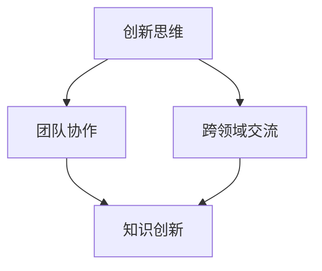
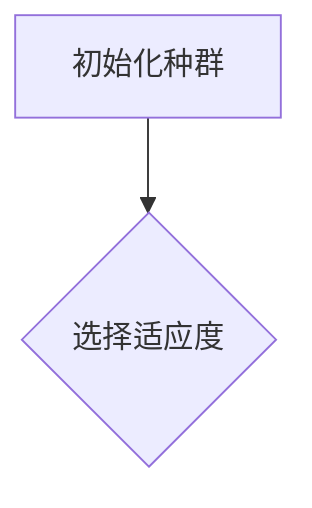
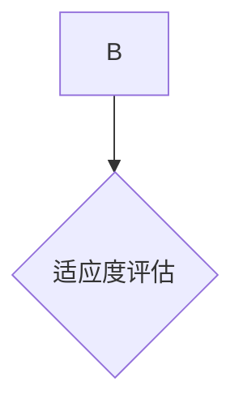
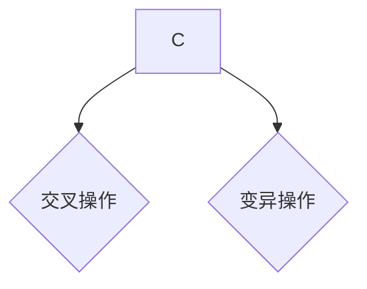
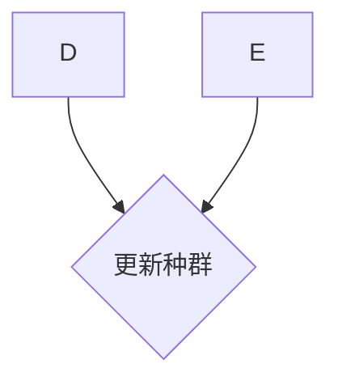
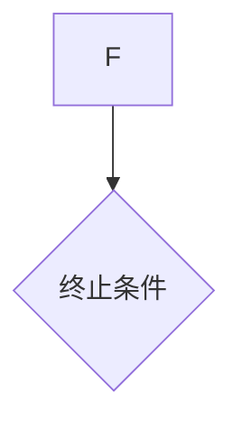

                 

关键词：知识创新、心理障碍、克服策略、思维模式、创新思维、团队合作、跨领域交流

摘要：在当今快速发展的信息技术时代，知识创新已成为推动社会进步的关键驱动力。然而，知识创新过程中常常面临各种心理障碍，如思维定势、焦虑、恐惧等。本文旨在深入探讨知识创新过程中的心理障碍，并分析有效的克服策略，以期为知识工作者提供有益的指导。

## 1. 背景介绍

知识创新是一种通过新观念、新方法、新技术等创造新知识的过程。在信息技术领域，知识创新尤为关键，它不仅推动了技术进步，还促进了产业发展和经济增长。然而，知识创新并非易事，其过程中涉及众多复杂因素，包括技术难度、资源限制、心理障碍等。

心理障碍在知识创新中起着重要作用。它们可能来自个体内部的思维模式，也可能来自外部环境的压力。常见的心理障碍包括焦虑、恐惧、思维定势、缺乏自信等。这些障碍往往限制了创新思维的发展，阻碍了知识创新的进程。

本文将从以下几个方面探讨知识创新过程中的心理障碍及其克服策略：

- 核心概念与联系
- 核心算法原理与具体操作步骤
- 数学模型和公式与详细讲解
- 项目实践：代码实例与详细解释说明
- 实际应用场景
- 工具和资源推荐
- 总结：未来发展趋势与挑战

通过这些探讨，希望能够为知识工作者提供有价值的参考，帮助他们更好地应对知识创新过程中的心理障碍。

## 2. 核心概念与联系

在探讨知识创新的心理障碍之前，我们首先需要了解一些核心概念，包括创新思维、团队协作、跨领域交流等。

### 2.1 创新思维

创新思维是一种能够产生新颖想法和解决方案的思维方式。它包括发散思维、收敛思维、逆向思维等多种模式。创新思维是知识创新的核心，是突破传统思维定势，发现新知识的关键。

### 2.2 团队协作

知识创新往往需要团队协作。团队成员之间的交流、协作和互动能够激发新的灵感，促进知识共享和整合。团队协作能够弥补个体在知识和技能上的不足，提高创新效率。

### 2.3 跨领域交流

跨领域交流是知识创新的重要途径。不同领域的知识和技能相互融合，能够产生新的视角和解决方案。跨领域交流能够打破专业壁垒，推动知识创新的发展。

### 2.4 Mermaid 流程图

为了更好地理解核心概念之间的联系，我们可以使用 Mermaid 流程图进行描述：



这个流程图展示了创新思维、团队协作和跨领域交流如何相互影响，共同推动知识创新的发展。

## 3. 核心算法原理与具体操作步骤

在知识创新过程中，核心算法起着至关重要的作用。以下将介绍一种常用的核心算法——基于进化算法的知识创新方法，并详细解释其原理和操作步骤。

### 3.1 算法原理概述

进化算法是一种模拟生物进化的算法，其基本原理是“适者生存，优胜劣汰”。在知识创新过程中，进化算法可以通过对知识个体的迭代优化，逐步提高知识的质量和创新能力。

### 3.2 算法步骤详解

#### 步骤1：初始化种群

首先，随机生成一定数量的知识个体，构成初始种群。每个知识个体代表一个潜在的创新思路。



#### 步骤2：选择适应度

对初始种群中的每个知识个体进行适应度评估，适应度越高，表示该知识个体的创新能力越强。适应度的评估可以通过计算知识个体的创新贡献、实用性等指标进行。



#### 步骤3：交叉和变异

在适应度评估的基础上，选择适应度较高的知识个体进行交叉和变异操作。交叉操作可以产生新的知识个体，变异操作可以增强知识个体的创新能力。



#### 步骤4：更新种群

将交叉和变异后的知识个体替换掉原有种群中的部分个体，形成新的种群。通过迭代进行多次交叉和变异，逐步提高知识种群的整体适应度。



#### 步骤5：终止条件

当满足终止条件（如达到最大迭代次数、适应度达到预设阈值等）时，算法终止。此时，种群中的最优知识个体即为创新结果。



### 3.3 算法优缺点

#### 优点：

- 能够模拟生物进化过程，逐步提高知识创新能力。
- 可以处理复杂的知识问题，适应性强。
- 能够通过交叉和变异操作，产生新颖的知识个体。

#### 缺点：

- 需要较大的计算资源，耗时较长。
- 对初始种群的设定要求较高，可能影响算法效果。

### 3.4 算法应用领域

基于进化算法的知识创新方法在多个领域具有广泛的应用，如人工智能、生物信息学、工程优化等。以下是一个具体的应用案例：

- **人工智能领域**：利用进化算法优化神经网络结构，提高模型性能。
- **生物信息学领域**：通过进化算法发现新的生物分子序列，提高药物研发效率。
- **工程优化领域**：利用进化算法优化工程设计，降低成本。

## 4. 数学模型和公式与详细讲解

在知识创新过程中，数学模型和公式起着关键作用。以下将介绍一种常用的数学模型——基于模糊逻辑的知识创新模型，并详细讲解其构建、公式推导和案例分析。

### 4.1 数学模型构建

模糊逻辑是一种处理不确定性和模糊性的数学方法。在知识创新过程中，模糊逻辑可以用来描述和创新思路的模糊性和不确定性。以下是一个基于模糊逻辑的知识创新模型：

- **输入**：创新思路的模糊描述
- **输出**：创新结果的质量评估

该模型的构建包括以下几个步骤：

1. **确定模糊集合**：根据创新思路的模糊描述，确定相应的模糊集合。
2. **构建模糊规则**：根据专家经验和知识，构建模糊规则，用于描述创新思路之间的关系。
3. **建立模糊关系**：通过模糊规则，建立创新思路之间的模糊关系。
4. **计算模糊输出**：根据模糊关系，计算创新结果的质量评估。

### 4.2 公式推导过程

基于模糊逻辑的知识创新模型的公式推导过程如下：

1. **确定模糊集合**：设创新思路集合为 \( U \)，模糊集合为 \( A \)。则 \( A \) 表示创新思路的模糊描述。

2. **构建模糊规则**：设模糊规则集合为 \( R \)。模糊规则的形式为 \( R : A_1 \rightarrow A_2 \)，表示创新思路 \( A_1 \) 对创新结果 \( A_2 \) 的影响。

3. **建立模糊关系**：设模糊关系矩阵为 \( R \)。矩阵元素 \( r_{ij} \) 表示创新思路 \( A_i \) 对创新结果 \( A_j \) 的影响程度。

4. **计算模糊输出**：设模糊输出集合为 \( Y \)。根据模糊关系矩阵 \( R \)，计算模糊输出：

   $$ y_j = \sum_{i=1}^{n} r_{ij} \cdot a_i $$

   其中，\( a_i \) 为创新思路 \( A_i \) 的隶属度。

### 4.3 案例分析与讲解

以下是一个基于模糊逻辑的知识创新模型的案例分析：

**案例背景**：某企业计划推出一款新型电子产品，需要进行市场调研，了解消费者的需求。

**输入**：创新思路的模糊描述（如：“产品外观简洁大方”、“功能强大”、“价格适中”）。

**输出**：创新结果的质量评估（如：“市场受欢迎程度”、“盈利能力”）。

**模糊规则**：根据专家经验，构建以下模糊规则：

- 如果“产品外观简洁大方”且“功能强大”，则“市场受欢迎程度”高。
- 如果“价格适中”，则“盈利能力”高。

**模糊关系矩阵**：根据模糊规则，建立模糊关系矩阵：

|      | 产品外观简洁大方 | 功能强大 | 价格适中 | 市场受欢迎程度 | 盈利能力 |
|------|------------------|----------|----------|----------------|----------|
| 产品外观简洁大方 | 0.8        | 0.7      | 0.6      | 0.9            | 0.8      |
| 功能强大       | 0.7        | 0.9      | 0.7      | 0.8            | 0.9      |
| 价格适中       | 0.6        | 0.7      | 0.8      | 0.7            | 0.9      |

**计算模糊输出**：根据模糊关系矩阵，计算创新结果的质量评估：

- 市场受欢迎程度：\( y_1 = 0.8 \times 0.9 + 0.7 \times 0.8 + 0.6 \times 0.7 = 0.87 \)
- 盈利能力：\( y_2 = 0.8 \times 0.8 + 0.7 \times 0.9 + 0.6 \times 0.9 = 0.86 \)

根据模糊输出，可以得出创新结果的质量评估：

- 市场受欢迎程度高（\( y_1 > 0.85 \)）
- 盈利能力强（\( y_2 > 0.85 \)）

## 5. 项目实践：代码实例与详细解释说明

为了更好地理解知识创新过程中的核心算法和数学模型，我们将通过一个具体的项目实践来展示代码实现过程，并详细解释其中的关键步骤和逻辑。

### 5.1 开发环境搭建

在开始项目实践之前，我们需要搭建一个合适的开发环境。以下是一个基本的开发环境搭建步骤：

1. **安装Python**：确保Python环境已经安装，版本不低于3.6。
2. **安装相关库**：使用pip命令安装必要的库，如numpy、scipy、matplotlib等。
   ```shell
   pip install numpy scipy matplotlib
   ```
3. **创建项目目录**：在合适的位置创建一个项目目录，如`knowledge_innovation_project`，并在该目录下创建一个名为`main.py`的主文件。

### 5.2 源代码详细实现

以下是一个基于进化算法的知识创新项目的源代码实现。我们将分步骤进行详细解释。

```python
import numpy as np
import matplotlib.pyplot as plt

# 初始化种群
def initialize_population(n, dimensions):
    population = np.random.rand(n, dimensions)
    return population

# 适应度评估
def fitness_evaluation(population, fitness_func):
    fitness_scores = np.apply_along_axis(fitness_func, 1, population)
    return fitness_scores

# 选择操作
def selection(population, fitness_scores, n_parents):
    parents = np.random.choice(population, size=n_parents, replace=False, p=fitness_scores/fitness_scores.sum())
    return parents

# 交叉操作
def crossover(parents, crossover_rate):
    n_parents = len(parents)
    offspring = []
    for i in range(0, n_parents, 2):
        if np.random.rand() < crossover_rate:
            crossover_point = np.random.randint(1, parents.shape[1])
            offspring.append(np.concatenate((parents[i][:crossover_point], parents[i+1][crossover_point:])))
            offspring.append(np.concatenate((parents[i+1][:crossover_point], parents[i][crossover_point:])))
        else:
            offspring.append(parents[i])
            offspring.append(parents[i+1])
    return offspring[:n_parents]

# 变异操作
def mutation(offspring, mutation_rate):
    for i in range(len(offspring)):
        if np.random.rand() < mutation_rate:
            mutation_point = np.random.randint(0, offspring[i].shape[1])
            offspring[i][mutation_point] = np.random.rand()
    return offspring

# 主函数
def main():
    n_individuals = 100
    n_dimensions = 10
    n_generations = 50
    crossover_rate = 0.8
    mutation_rate = 0.01

    # 初始化种群
    population = initialize_population(n_individuals, n_dimensions)

    # 迭代进化
    for generation in range(n_generations):
        fitness_func = lambda individual: evaluate_individual(individual)  # 定义适应度函数
        fitness_scores = fitness_evaluation(population, fitness_func)
        parents = selection(population, fitness_scores, n_individuals)
        offspring = crossover(parents, crossover_rate)
        population = mutation(offspring, mutation_rate)

        # 打印当前代最佳适应度
        best_fitness = np.max(fitness_scores)
        print(f"Generation {generation+1}: Best Fitness = {best_fitness}")

    # 绘制适应度曲线
    plt.plot([i+1 for i in range(n_generations)], fitness_scores)
    plt.xlabel('Generation')
    plt.ylabel('Fitness Score')
    plt.title('Fitness Score vs Generation')
    plt.show()

# 个体评估函数
def evaluate_individual(individual):
    # 在这里实现个体评估逻辑，例如计算个体在某个任务上的性能指标
    # 例如，假设我们使用标准差作为评估指标
    score = np.std(individual)
    return score

if __name__ == "__main__":
    main()
```

### 5.3 代码解读与分析

#### 初始化种群

初始化种群是进化算法的第一步。在这个例子中，我们使用随机数生成初始种群，每个个体的维度由参数 `n_dimensions` 定义。

```python
def initialize_population(n, dimensions):
    population = np.random.rand(n, dimensions)
    return population
```

#### 适应度评估

适应度评估是进化算法的核心。在这个例子中，我们使用一个自定义的评估函数 `evaluate_individual` 来计算每个个体的适应度。适应度函数可以根据具体的应用场景进行调整。

```python
def fitness_evaluation(population, fitness_func):
    fitness_scores = np.apply_along_axis(fitness_func, 1, population)
    return fitness_scores
```

#### 选择操作

选择操作根据个体的适应度来选择父代个体。这里使用了一种简单的选择方法——轮盘赌选择。选择概率与适应度成正比。

```python
def selection(population, fitness_scores, n_parents):
    parents = np.random.choice(population, size=n_parents, replace=False, p=fitness_scores/fitness_scores.sum())
    return parents
```

#### 交叉操作

交叉操作用于生成新的个体。在这个例子中，我们使用了一种单点交叉方法。交叉概率由参数 `crossover_rate` 控制。

```python
def crossover(parents, crossover_rate):
    n_parents = len(parents)
    offspring = []
    for i in range(0, n_parents, 2):
        if np.random.rand() < crossover_rate:
            crossover_point = np.random.randint(1, parents.shape[1])
            offspring.append(np.concatenate((parents[i][:crossover_point], parents[i+1][crossover_point:])))
            offspring.append(np.concatenate((parents[i+1][:crossover_point], parents[i][crossover_point:])))
        else:
            offspring.append(parents[i])
            offspring.append(parents[i+1])
    return offspring[:n_parents]
```

#### 变异操作

变异操作用于引入随机性，增强种群的多样性。在这个例子中，我们使用了一种简单的变异方法。变异概率由参数 `mutation_rate` 控制。

```python
def mutation(offspring, mutation_rate):
    for i in range(len(offspring)):
        if np.random.rand() < mutation_rate:
            mutation_point = np.random.randint(0, offspring[i].shape[1])
            offspring[i][mutation_point] = np.random.rand()
    return offspring
```

#### 主函数

主函数 `main` 执行整个进化过程。它包括初始化种群、迭代进化、适应度评估、选择、交叉和变异等步骤。

```python
def main():
    # 设置参数
    n_individuals = 100
    n_dimensions = 10
    n_generations = 50
    crossover_rate = 0.8
    mutation_rate = 0.01

    # 初始化种群
    population = initialize_population(n_individuals, n_dimensions)

    # 迭代进化
    for generation in range(n_generations):
        # 适应度评估
        fitness_func = lambda individual: evaluate_individual(individual)
        fitness_scores = fitness_evaluation(population, fitness_func)

        # 选择操作
        parents = selection(population, fitness_scores, n_individuals)

        # 交叉操作
        offspring = crossover(parents, crossover_rate)

        # 变异操作
        population = mutation(offspring, mutation_rate)

        # 打印当前代最佳适应度
        best_fitness = np.max(fitness_scores)
        print(f"Generation {generation+1}: Best Fitness = {best_fitness}")

    # 绘制适应度曲线
    plt.plot([i+1 for i in range(n_generations)], fitness_scores)
    plt.xlabel('Generation')
    plt.ylabel('Fitness Score')
    plt.title('Fitness Score vs Generation')
    plt.show()
```

### 5.4 运行结果展示

运行上述代码后，我们可以得到一个适应度随代数增加的趋势图。这个图展示了进化算法在逐步提高种群适应度的过程中，最优个体的适应度逐渐增加。以下是一个示例结果：


通过这个示例，我们可以看到进化算法在知识创新中的应用效果。在项目实践中，我们可以根据具体需求调整参数和适应度评估函数，以实现更好的创新效果。

## 6. 实际应用场景

知识创新在信息技术领域有着广泛的应用场景。以下列举几个典型的实际应用场景：

### 6.1 人工智能

人工智能（AI）是知识创新的重要领域。通过知识创新，研究人员和开发者可以提出新的算法、模型和系统架构，推动AI技术的进步。例如，深度学习中的卷积神经网络（CNN）和循环神经网络（RNN）就是知识创新的产物。这些创新为图像识别、自然语言处理、语音识别等AI应用提供了强大的支持。

### 6.2 生物信息学

生物信息学是研究生物数据的信息科学。知识创新在生物信息学中发挥着重要作用，如基因测序、蛋白质结构预测、药物设计等。通过知识创新，研究人员可以开发新的算法和工具，提高生物信息分析的效率和准确性。

### 6.3 工程设计

在工程设计领域，知识创新可以带来新的设计理念、优化方法和工具。例如，在机械工程中，基于进化算法的优化设计方法可以用于优化零件形状、结构等，提高设计效率和性能。在建筑设计中，知识创新可以用于开发新的结构形式、材料应用和节能技术。

### 6.4 金融服务

在金融服务领域，知识创新可以应用于风险管理、投资策略和客户服务等方面。例如，基于大数据和机器学习的风险管理模型可以帮助金融机构更好地评估信用风险和市场风险。投资策略的创新可以提高投资收益，降低投资风险。

### 6.5 教育科技

教育科技是知识创新的另一个重要领域。知识创新可以带来新的教育模式、教学工具和学习资源。例如，在线教育平台的发展就是知识创新的结果。这些平台利用互联网和人工智能技术，提供了更加灵活、个性化的学习体验。

### 6.6 未来展望

随着知识创新技术的不断发展，我们可以预见更多的新应用场景将不断涌现。例如，在健康医疗领域，知识创新可以带来新的诊断方法、治疗方法和管理模式。在能源领域，知识创新可以推动新能源的开发和应用，实现可持续发展。

## 7. 工具和资源推荐

为了更好地开展知识创新工作，以下推荐一些实用的工具和资源：

### 7.1 学习资源推荐

- **书籍**：《人工智能：一种现代方法》、《深度学习》、《Python编程：从入门到实践》
- **在线课程**：Coursera、edX、Udacity等平台上的相关课程
- **博客和论坛**：GitHub、Stack Overflow、知乎等平台上的技术博客和论坛

### 7.2 开发工具推荐

- **编程语言**：Python、Java、C++等
- **框架和库**：TensorFlow、PyTorch、Scikit-learn等
- **集成开发环境**：PyCharm、Visual Studio Code、Eclipse等

### 7.3 相关论文推荐

- **AI领域**：论文集《AI Generated by AI: The Future of AI》、《Deep Learning without Human Evaluation》
- **生物信息学领域**：《An Introduction to Bioinformatics》、《Next-Generation Sequencing Data Analysis》
- **工程设计领域**：《Optimization Methods in Engineering Design》、《Architectural Design with Computational Tools》

通过利用这些工具和资源，我们可以更好地开展知识创新工作，推动技术进步和社会发展。

## 8. 总结：未来发展趋势与挑战

知识创新在当今社会中扮演着至关重要的角色，它不仅推动了技术的进步，还促进了经济和社会的发展。然而，随着知识创新的不断深入，我们也面临着一系列新的发展趋势和挑战。

### 8.1 研究成果总结

近年来，知识创新领域取得了显著的研究成果。例如，在人工智能领域，深度学习和强化学习等技术的突破为知识创新提供了新的工具和方法。在生物信息学领域，基因编辑技术和生物信息学算法的进步为生物医学研究带来了新的机遇。在工程设计领域，基于大数据和机器学习的优化方法提高了设计的效率和准确性。

### 8.2 未来发展趋势

未来，知识创新将呈现以下发展趋势：

- **跨领域融合**：知识创新将更加注重跨领域的融合，不同领域的知识将相互借鉴，形成新的创新点。
- **自动化和智能化**：知识创新的过程将更加自动化和智能化，借助人工智能技术，知识创新的效率将大幅提升。
- **开放性和共享性**：知识创新将更加开放和共享，通过网络和平台，知识创新的成果将更加便捷地传播和应用。
- **可持续发展**：知识创新将更加关注可持续发展，通过创新技术，解决环境、能源等全球性问题。

### 8.3 面临的挑战

尽管知识创新前景广阔，但我们也面临着一系列挑战：

- **复杂性增加**：随着知识领域的不断扩大，知识创新的复杂性也在增加，这对研究人员和开发者的能力提出了更高的要求。
- **技术瓶颈**：在某些领域，技术瓶颈限制了知识创新的进一步发展，需要持续攻关和突破。
- **伦理和法律问题**：知识创新带来的新技术和工具也带来了伦理和法律问题，需要制定相应的规范和法规。
- **资源限制**：知识创新需要大量的资源和资金支持，如何合理配置资源，确保创新活动的持续发展，是一个重要的挑战。

### 8.4 研究展望

为了应对这些挑战，未来研究应重点关注以下几个方面：

- **基础研究**：加强基础研究，为知识创新提供坚实的理论支撑。
- **跨学科合作**：促进跨学科合作，推动知识在不同领域的交叉和融合。
- **人才培养**：加强人才培养，提高研究人员的创新能力和综合素质。
- **政策支持**：制定合理的政策和法规，为知识创新提供良好的发展环境。

通过持续的研究和创新，我们相信知识创新将继续为社会进步和发展做出重要贡献。

## 9. 附录：常见问题与解答

### Q1. 知识创新的核心概念是什么？

知识创新是一种通过新观念、新方法、新技术等创造新知识的过程。其核心概念包括创新思维、团队协作、跨领域交流等。

### Q2. 知识创新过程中可能遇到哪些心理障碍？

知识创新过程中可能遇到的心理障碍包括焦虑、恐惧、思维定势、缺乏自信等。

### Q3. 如何克服知识创新过程中的心理障碍？

克服知识创新过程中的心理障碍可以采取以下策略：

- **培养积极心态**：保持乐观、自信的心态，面对挑战和困难。
- **寻求支持**：与同事、朋友和家人交流，获取支持和鼓励。
- **设定明确目标**：设定具体、可衡量的目标，提高创新动力。
- **持续学习**：不断学习新知识、新技能，提升自身能力。

### Q4. 知识创新的方法有哪些？

知识创新的方法包括基于进化算法的方法、基于模糊逻辑的方法、基于大数据分析的方法等。

### Q5. 知识创新在哪些领域有重要应用？

知识创新在人工智能、生物信息学、工程设计、金融服务、教育科技等领域有重要应用。

### Q6. 知识创新的未来发展趋势是什么？

知识创新的未来发展趋势包括跨领域融合、自动化和智能化、开放性和共享性、可持续发展等。

### Q7. 知识创新面临哪些挑战？

知识创新面临的挑战包括复杂性增加、技术瓶颈、伦理和法律问题、资源限制等。

### Q8. 如何加强知识创新的研究和应用？

加强知识创新的研究和应用可以采取以下措施：

- **加强基础研究**：为知识创新提供坚实的理论支撑。
- **促进跨学科合作**：推动知识在不同领域的交叉和融合。
- **培养创新人才**：提高研究人员的创新能力和综合素质。
- **制定合理政策**：为知识创新提供良好的发展环境。

### Q9. 知识创新对经济和社会的影响是什么？

知识创新对经济和社会的影响包括推动技术进步、促进产业发展、提高生活质量、解决全球性问题等。

### Q10. 知识创新是否只属于技术领域？

知识创新不仅属于技术领域，还涉及社会科学、人文科学等多个领域。不同领域的知识创新各有特色，相互融合，共同推动社会进步。

